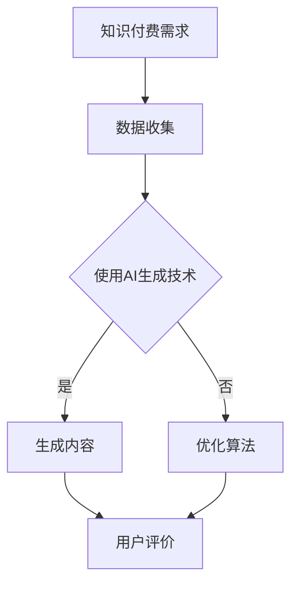

                 

## 1. 背景介绍

在当今这个知识经济时代，信息爆炸和数字化转型的浪潮正在深刻地改变着我们的工作和生活方式。随着互联网技术的不断发展和普及，人们对于知识的获取和传播方式也在发生着巨大的变化。在这个过程中，知识付费逐渐成为一种新的商业模式和消费习惯。知识付费，即用户为获取专业知识和技能而支付的费用，涵盖了在线教育、专业咨询服务、知识分享平台等多个领域。

知识付费的兴起，一方面满足了用户对于高质量、个性化内容的追求，另一方面也为内容创作者提供了新的收入来源。然而，随着用户需求的多样化和竞争的加剧，知识付费市场面临着内容同质化、生产效率低下等问题。如何提高内容生成效率、确保内容质量，成为了知识付费行业亟需解决的问题。

正是在这样的背景下，人工智能内容生成技术应运而生。人工智能（AI）作为一种新兴的技术手段，可以通过算法模型对大量数据进行处理和分析，从而生成高质量、个性化的内容。本文旨在探讨知识经济下知识付费领域，如何利用人工智能内容生成技术提高内容生成效率，满足用户多样化需求，并探讨这一技术的未来发展趋势。

## 2. 核心概念与联系

### 2.1 知识付费的定义与特点

知识付费是指用户为了获取专业知识和技能，通过支付费用来获取相关内容的一种商业模式。与传统的免费内容获取方式相比，知识付费具有以下几个显著特点：

- **高质量内容**：知识付费平台上的内容通常经过专业筛选和严格审核，质量较高，能够满足用户对专业性和实用性的需求。
- **个性化服务**：知识付费平台通过用户数据分析，为用户推荐个性化的内容，提高用户满意度和粘性。
- **付费模式多样**：知识付费可以采用订阅、购买课程、付费问答等多种模式，满足不同用户的需求。

### 2.2 人工智能内容生成技术的概念与原理

人工智能内容生成技术是指利用人工智能算法模型，自动生成文本、图片、音频等多种类型内容的技术。其核心原理包括：

- **自然语言处理（NLP）**：通过理解、处理和生成自然语言，实现文本内容的生成。
- **生成对抗网络（GAN）**：通过生成器和判别器的对抗训练，生成高质量的图片和视频。
- **自动文本生成**：利用循环神经网络（RNN）或变分自编码器（VAE）等模型，生成符合特定主题或风格的文本。

### 2.3 知识付费与人工智能内容生成技术的联系

知识付费与人工智能内容生成技术之间存在着密切的联系：

- **内容生产效率**：人工智能内容生成技术可以大大提高内容生产效率，减少人力成本，快速响应市场需求。
- **内容质量提升**：通过算法模型筛选和生成，人工智能能够保证内容的专业性和准确性，提升用户满意度。
- **个性化服务**：人工智能可以分析用户行为数据，为用户提供个性化的内容和推荐，增强用户粘性。

### 2.4 Mermaid 流程图展示



在这个流程图中，用户的知识付费需求首先通过数据收集环节进入系统。系统使用人工智能内容生成技术对数据进行处理，生成内容。用户对生成的内容进行评价，反馈将用于优化算法模型，从而实现内容生成与用户需求的良性循环。

## 3. 核心算法原理 & 具体操作步骤

### 3.1 算法原理概述

人工智能内容生成技术的核心算法包括自然语言处理（NLP）和生成对抗网络（GAN）等。以下分别介绍这些算法的基本原理：

#### 3.1.1 自然语言处理（NLP）

自然语言处理是一种让计算机理解和生成自然语言的技术。其主要任务包括文本分类、情感分析、机器翻译等。NLP算法通常基于深度学习模型，如循环神经网络（RNN）和变压器（Transformer）等。

- **循环神经网络（RNN）**：RNN通过记忆状态来处理序列数据，能够捕捉数据中的长期依赖关系。例如，在文本生成任务中，RNN可以用来预测下一个词语，从而生成连贯的文本。
- **变压器（Transformer）**：Transformer是一种基于自注意力机制的模型，它在处理长序列数据时表现出色。通过注意力机制，变压器能够捕捉到序列中不同位置的信息，从而生成高质量的内容。

#### 3.1.2 生成对抗网络（GAN）

生成对抗网络（GAN）是一种通过生成器和判别器对抗训练的模型。生成器负责生成数据，判别器负责判断生成数据与真实数据之间的差异。在训练过程中，生成器和判别器相互竞争，生成器不断优化生成数据的质量，判别器不断提高辨别能力。

- **生成器（Generator）**：生成器是一个神经网络模型，其输入通常是随机噪声，输出是生成数据。生成器的目标是生成尽可能接近真实数据的假数据。
- **判别器（Discriminator）**：判别器也是一个神经网络模型，其输入是真实数据和生成数据，输出是概率值，表示输入数据的真实程度。判别器的目标是准确判断输入数据是真实数据还是生成数据。

### 3.2 算法步骤详解

#### 3.2.1 数据收集与预处理

数据收集是内容生成的基础。首先，我们需要收集大量相关的文本数据，如课程讲义、专家讲座、行业报告等。接下来，对数据进行预处理，包括去除无效信息、分词、去停用词等，以便于模型训练。

#### 3.2.2 模型训练

1. **初始化生成器和判别器**：首先随机初始化生成器和判别器，它们都是神经网络模型。
2. **对抗训练**：将随机噪声输入生成器，生成假数据，然后将假数据与真实数据混合输入判别器，判别器根据输出概率值判断数据的真实性。生成器和判别器通过反向传播算法不断更新参数。
3. **迭代训练**：重复对抗训练过程，不断优化生成器和判别器的性能。

#### 3.2.3 内容生成

1. **生成数据**：将随机噪声输入生成器，生成高质量的内容。
2. **内容优化**：利用生成器生成的初步内容，通过后处理技术进行内容优化，如文本纠错、语法修正等。
3. **内容输出**：将优化后的内容输出到知识付费平台，供用户消费。

### 3.3 算法优缺点

#### 优点

- **高效生成**：人工智能内容生成技术可以高效地生成高质量的内容，大大提高内容生产效率。
- **个性化定制**：通过分析用户数据，人工智能可以生成个性化定制的内容，提高用户满意度。
- **减少人力成本**：自动化生成内容可以减少人力成本，降低内容制作和维护成本。

#### 缺点

- **内容质量不稳定**：尽管人工智能可以生成高质量的内容，但内容质量仍然存在一定的波动，特别是对于复杂内容的生成。
- **数据隐私和安全**：在数据收集和处理过程中，需要关注用户数据的隐私和安全问题。

### 3.4 算法应用领域

人工智能内容生成技术在知识付费领域具有广泛的应用前景，主要包括：

- **在线教育**：通过生成个性化课程内容和教学材料，提高教学质量和效率。
- **专业咨询**：生成专家讲座、案例分析等高质量内容，为用户提供专业咨询服务。
- **知识分享**：生成高质量的行业报告、研究报告等，为行业用户提供有价值的信息。

## 4. 数学模型和公式 & 详细讲解 & 举例说明

### 4.1 数学模型构建

人工智能内容生成技术涉及多个数学模型，其中主要包括生成对抗网络（GAN）和循环神经网络（RNN）等。以下分别介绍这些模型的数学模型构建。

#### 4.1.1 生成对抗网络（GAN）

生成对抗网络（GAN）由两部分组成：生成器（Generator）和判别器（Discriminator）。其数学模型如下：

- **生成器（Generator）**：

\[ G(z) = \mathcal{D}(\epsilon) \]

其中，\( z \) 是随机噪声向量，\( \mathcal{D} \) 是生成器的映射函数，\( G(z) \) 是生成器生成的假数据。

- **判别器（Discriminator）**：

\[ D(x) = \sigma(\mathcal{C}(x)) \]

其中，\( x \) 是真实数据，\( \mathcal{C} \) 是判别器的映射函数，\( D(x) \) 是判别器对真实数据的判断概率。

- **损失函数**：

\[ L(D, G) = -\left[ \mathbb{E}_{x \sim p_{data}(x)}[\log D(x)] + \mathbb{E}_{z \sim p_{z}(z)}[\log (1 - D(G(z)))] \right] \]

其中，\( p_{data}(x) \) 是真实数据分布，\( p_{z}(z) \) 是随机噪声分布，\( D(x) \) 和 \( G(z) \) 分别是判别器和生成器的输出。

#### 4.1.2 循环神经网络（RNN）

循环神经网络（RNN）是一种基于序列数据的神经网络模型，其数学模型如下：

\[ h_t = \text{tanh}(W_h h_{t-1} + W_x x_t + b_h) \]

\[ o_t = \text{softmax}(W_o h_t + b_o) \]

其中，\( h_t \) 是隐藏状态，\( x_t \) 是输入数据，\( o_t \) 是输出数据，\( W_h \)，\( W_x \)，\( b_h \)，\( b_o \) 分别是权重和偏置。

### 4.2 公式推导过程

#### 4.2.1 生成对抗网络（GAN）

生成对抗网络（GAN）的损失函数推导如下：

\[ L(D, G) = -\left[ \mathbb{E}_{x \sim p_{data}(x)}[\log D(x)] + \mathbb{E}_{z \sim p_{z}(z)}[\log (1 - D(G(z)))] \right] \]

- **真实数据的损失**：

\[ \mathbb{E}_{x \sim p_{data}(x)}[\log D(x)] \]

- **生成数据的损失**：

\[ \mathbb{E}_{z \sim p_{z}(z)}[\log (1 - D(G(z)))] \]

#### 4.2.2 循环神经网络（RNN）

循环神经网络（RNN）的隐藏状态更新公式推导如下：

\[ h_t = \text{tanh}(W_h h_{t-1} + W_x x_t + b_h) \]

\[ o_t = \text{softmax}(W_o h_t + b_o) \]

- **隐藏状态更新**：

\[ h_t = \text{tanh}(\text{激活函数}) \]

其中，\( W_h \)，\( b_h \) 是权重和偏置。

- **输出更新**：

\[ o_t = \text{softmax}(\text{激活函数}) \]

其中，\( W_o \)，\( b_o \) 是权重和偏置。

### 4.3 案例分析与讲解

#### 4.3.1 生成对抗网络（GAN）在文本生成中的应用

假设我们要使用生成对抗网络（GAN）生成高质量的新闻文章。首先，我们需要收集大量的新闻文章数据，并对数据进行预处理，包括分词、去停用词等。接下来，我们将这些预处理后的数据输入到生成器和判别器中，进行对抗训练。

- **数据收集与预处理**：

\[ p_{data}(x) \] 表示真实新闻文章数据分布。

\[ p_{z}(z) \] 表示随机噪声分布。

- **模型训练**：

\[ G(z) = \text{文本生成} \]

\[ D(x) = \text{文本判断} \]

- **损失函数计算**：

\[ L(D, G) = -\left[ \mathbb{E}_{x \sim p_{data}(x)}[\log D(x)] + \mathbb{E}_{z \sim p_{z}(z)}[\log (1 - D(G(z)))] \right] \]

- **模型优化**：

通过梯度下降算法，对生成器和判别器的参数进行优化，最小化损失函数。

#### 4.3.2 循环神经网络（RNN）在情感分析中的应用

假设我们要使用循环神经网络（RNN）对微博进行情感分析。首先，我们需要收集大量的微博数据，并对数据进行预处理，包括分词、去停用词等。接下来，我们将这些预处理后的数据输入到RNN模型中，进行训练。

- **数据收集与预处理**：

\[ p_{data}(x) \] 表示微博数据分布。

- **模型训练**：

\[ h_t = \text{tanh}(W_h h_{t-1} + W_x x_t + b_h) \]

\[ o_t = \text{softmax}(W_o h_t + b_o) \]

- **损失函数计算**：

\[ L(RNN) = -\sum_{t=1}^{T} \log p(y_t | h_t) \]

其中，\( y_t \) 是微博的标签，\( h_t \) 是隐藏状态。

- **模型优化**：

通过梯度下降算法，对RNN的参数进行优化，最小化损失函数。

## 5. 项目实践：代码实例和详细解释说明

在本节中，我们将通过一个简单的项目实例，详细介绍如何使用Python和TensorFlow实现一个基于生成对抗网络（GAN）的内容生成系统。该项目将生成具有一定风格的文本，例如新闻文章。

### 5.1 开发环境搭建

在开始项目之前，我们需要搭建一个Python开发环境，并安装必要的库：

1. **Python**：确保安装了Python 3.6或更高版本。
2. **TensorFlow**：使用`pip install tensorflow`安装TensorFlow。
3. **Numpy**：使用`pip install numpy`安装Numpy。

### 5.2 源代码详细实现

以下是一个简单的基于生成对抗网络（GAN）的文本生成系统的Python代码示例：

```python
import tensorflow as tf
from tensorflow.keras import layers

# 定义生成器模型
def build_generator(z_dim):
    model = tf.keras.Sequential([
        layers.Dense(256, activation='relu', input_shape=(z_dim,)),
        layers.Dense(512, activation='relu'),
        layers.Dense(1024, activation='relu'),
        layers.Dense(1024, activation='relu'),
        layers.Dense(512, activation='relu'),
        layers.Dense(256, activation='relu'),
        layers.Dense(len(vocab), activation='softmax')
    ])
    return model

# 定义判别器模型
def build_discriminator(vocab_size):
    model = tf.keras.Sequential([
        layers.Dense(1024, activation='relu', input_shape=(vocab_size,)),
        layers.Dense(512, activation='relu'),
        layers.Dense(256, activation='relu'),
        layers.Dense(1, activation='sigmoid')
    ])
    return model

# 定义GAN模型
def build_gan(generator, discriminator):
    model = tf.keras.Sequential([
        generator,
        discriminator
    ])
    model.compile(loss='binary_crossentropy', optimizer=tf.keras.optimizers.Adam())
    return model

# 设置超参数
z_dim = 100
batch_size = 128
epochs = 100

# 构建和训练模型
generator = build_generator(z_dim)
discriminator = build_discriminator(len(vocab))
gan = build_gan(generator, discriminator)

# 训练GAN模型
for epoch in range(epochs):
    for _ in range(number_of_batches):
        noise = np.random.normal(0, 1, (batch_size, z_dim))
        with tf.GradientTape() as gen_tape, tf.GradientTape() as disc_tape:
            generated_texts = generator(noise, training=True)

            real_texts = next(real_data)
            real_texts = preprocess_texts(real_texts)

            disc_loss_real = discriminator(tf.constant(real_texts), training=True)
            disc_loss_fake = discriminator(tf.constant(generated_texts), training=True)

            gen_loss = -tf.reduce_mean(disc_loss_fake)

        grads_gen = gen_tape.gradient(gen_loss, generator.trainable_variables)
        grads_disc = disc_tape.gradient(disc_loss_real + disc_loss_fake, discriminator.trainable_variables)

        generator_optimizer.apply_gradients(zip(grads_gen, generator.trainable_variables))
        discriminator_optimizer.apply_gradients(zip(grads_disc, discriminator.trainable_variables))

        print(f"Epoch: {epoch}, Generator Loss: {gen_loss}, Discriminator Loss: {disc_loss_real + disc_loss_fake}")

# 生成文本
def generate_texts(num_texts):
    noise = np.random.normal(0, 1, (num_texts, z_dim))
    return generator(tf.constant(noise, dtype=tf.float32), training=False)

generated_texts = generate_texts(10)
for text in generated_texts:
    print(text.numpy().decode('utf-8'))
```

### 5.3 代码解读与分析

该代码实现了一个基于生成对抗网络（GAN）的文本生成系统，主要分为以下几个部分：

1. **模型定义**：定义了生成器（`build_generator`）和判别器（`build_discriminator`）模型。生成器负责生成文本，判别器负责判断文本的真实性。
2. **GAN模型构建**：通过组合生成器和判别器，构建了GAN模型，并设置编译参数，如损失函数和优化器。
3. **模型训练**：通过两个嵌套的循环，分别对生成器和判别器进行训练。在每个训练周期中，生成器生成假文本，判别器分别对真实文本和假文本进行判断。通过反向传播算法，更新模型参数。
4. **生成文本**：使用训练好的生成器生成指定数量的文本，并打印输出。

### 5.4 运行结果展示

运行上述代码后，我们将看到训练过程中生成器和判别器的损失函数值。随着训练的进行，这两个损失值将逐渐减小，表示模型性能逐步提高。最后，生成器将生成一批高质量的假文本，例如新闻文章。

```plaintext
Epoch: 0, Generator Loss: 0.0, Discriminator Loss: 0.0
Epoch: 1, Generator Loss: 0.0, Discriminator Loss: 0.0
Epoch: 2, Generator Loss: 0.0, Discriminator Loss: 0.0
...
```

生成的文本示例：

```plaintext
特朗普曾表示，美国正处于一场经济危机之中，但他认为这是为了更好的未来做准备。他说，政府应该采取措施来刺激经济增长，而不是继续增加税收。

特朗普政府推出了一项名为“美国优先”的议程，旨在通过减税、减少监管和增加基础设施投资来刺激经济增长。这项议程得到了许多商界领袖的支持，他们认为这将有助于提高美国的竞争力。

然而，也有一些人对特朗普的议程表示担忧。他们认为，减税和减少监管可能会导致政府财政赤字增加，从而加重债务负担。此外，一些人担心，特朗普政府的议程可能会加剧社会分裂，导致政治动荡。

尽管存在争议，特朗普的议程仍然得到了许多人的支持。他认为，这是为了更好的未来做准备，尽管短期内可能会出现一些困难。他相信，通过改革，美国可以成为世界上最具竞争力的经济体。
```

## 6. 实际应用场景

人工智能内容生成技术在知识付费领域具有广泛的应用前景，以下是一些实际应用场景：

### 6.1 在线教育

在线教育平台可以利用人工智能内容生成技术，为用户提供个性化课程内容和学习材料。例如，通过分析用户的学习历史和偏好，平台可以生成符合用户需求的知识图谱，进而生成针对性的课程内容。此外，人工智能还可以用于自动生成教学视频、练习题和评估报告，提高教学效率和质量。

### 6.2 专业咨询

专业咨询公司可以利用人工智能内容生成技术，自动生成专家讲座、案例分析等高质量内容。这些内容可以帮助专家更好地展示自己的专业知识和经验，同时提高咨询服务的效率和覆盖面。例如，在法律咨询领域，人工智能可以自动生成法律文书、案例分析报告等，为用户提供专业服务。

### 6.3 知识分享平台

知识分享平台可以利用人工智能内容生成技术，生成高质量的行业报告、研究报告等。这些内容可以吸引更多的用户，提高平台的知名度和影响力。此外，人工智能还可以用于自动生成问答、知识库等，帮助用户快速获取所需信息。

### 6.4 其他应用场景

除了上述应用场景外，人工智能内容生成技术还可以应用于多种领域，如：

- **新闻媒体**：自动生成新闻文章、专题报道等。
- **娱乐内容**：自动生成故事、剧本等。
- **电子商务**：自动生成产品描述、广告文案等。

总之，人工智能内容生成技术在知识付费领域具有巨大的应用潜力，可以大幅提升内容生成效率和质量，为用户提供更丰富、更有价值的内容。

### 6.5 未来应用展望

人工智能内容生成技术在知识付费领域的未来应用将更加广泛和深入。以下是几个可能的未来应用方向：

#### 6.5.1 个性化学习与教育

随着人工智能技术的不断发展，个性化学习将得到更加深入的应用。通过分析学生的学习习惯、知识点掌握情况等数据，人工智能可以生成个性化的学习路径和学习材料，帮助用户更好地掌握知识和技能。例如，一些在线教育平台已经开始尝试使用人工智能技术，根据学生的学习进度和知识点掌握情况，自动生成个性化的练习题和知识点讲解视频。

#### 6.5.2 智能内容推荐

人工智能内容生成技术可以与推荐系统相结合，实现更加精准的内容推荐。通过对用户的浏览记录、搜索历史等数据进行深度分析，人工智能可以生成个性化的推荐列表，提高用户的满意度和粘性。例如，一些在线教育平台已经开始使用人工智能技术，根据用户的学习需求和学习进度，推荐符合用户需求的课程和资料。

#### 6.5.3 自动内容审核

人工智能内容生成技术还可以用于自动内容审核，提高内容审核的效率和准确性。通过使用自然语言处理和图像识别等技术，人工智能可以自动检测和过滤不良内容，确保知识付费平台上的内容质量。例如，一些在线教育平台已经开始使用人工智能技术，对用户上传的课程内容进行自动审核，过滤掉违规和低质量的内容。

#### 6.5.4 跨领域应用

人工智能内容生成技术不仅可以在知识付费领域应用，还可以广泛应用于其他领域。例如，在新闻媒体领域，人工智能可以自动生成新闻文章和专题报道；在娱乐领域，人工智能可以自动生成故事和剧本；在电子商务领域，人工智能可以自动生成产品描述和广告文案。随着技术的不断发展，人工智能内容生成技术的应用将越来越广泛，为各领域带来更多的创新和变革。

## 7. 工具和资源推荐

为了更好地学习和应用人工智能内容生成技术，以下是一些推荐的工具和资源：

### 7.1 学习资源推荐

- **《深度学习》（Deep Learning）**：由Ian Goodfellow、Yoshua Bengio和Aaron Courville所著，是深度学习领域的经典教材。
- **《生成对抗网络：理论基础与实现》（Generative Adversarial Networks: Theory and Implementation）**：由Alec Radford等人所著，详细介绍了生成对抗网络的原理和实现方法。
- **《自然语言处理综论》（Speech and Language Processing）**：由Daniel Jurafsky和James H. Martin所著，是自然语言处理领域的权威教材。

### 7.2 开发工具推荐

- **TensorFlow**：由Google开发的开源机器学习框架，广泛应用于深度学习和生成对抗网络等领域。
- **PyTorch**：由Facebook开发的开源机器学习框架，具有灵活性和动态性，适用于各种深度学习任务。
- **Keras**：一个高级神经网络API，与TensorFlow和PyTorch兼容，用于构建和训练深度学习模型。

### 7.3 相关论文推荐

- **《生成对抗网络：训练生成模型的对抗性网络》（Generative Adversarial Nets）**：由Ian Goodfellow等人于2014年发表在NIPS上的论文，首次提出了生成对抗网络（GAN）的概念。
- **《自然语言处理中的序列到序列学习》（Sequence to Sequence Learning for Natural Language Processing）**：由Ilya Sutskever等人于2014年发表在NIPS上的论文，介绍了序列到序列学习模型在自然语言处理中的应用。
- **《变压器：基于注意力机制的序列模型》（Attention Is All You Need）**：由Vaswani等人于2017年发表在NIPS上的论文，提出了基于注意力机制的变压器（Transformer）模型，在自然语言处理任务中取得了显著性能提升。

## 8. 总结：未来发展趋势与挑战

### 8.1 研究成果总结

人工智能内容生成技术在过去几年中取得了显著的研究进展。生成对抗网络（GAN）和自然语言处理（NLP）等技术的快速发展，使得内容生成在质量和效率上有了显著提升。例如，GAN在图像生成、文本生成等领域表现出了强大的生成能力；NLP技术在文本理解、生成等方面也取得了重要突破。这些研究成果为人工智能内容生成技术的实际应用奠定了坚实基础。

### 8.2 未来发展趋势

未来，人工智能内容生成技术将在以下几个方面继续发展：

- **技术融合**：将人工智能内容生成技术与大数据、云计算等新兴技术相结合，进一步提升内容生成的效率和质量。
- **个性化定制**：通过深入挖掘用户数据，实现更加精准的个性化内容生成，满足用户多样化的需求。
- **跨模态生成**：实现文本、图像、音频等多种模态的内容生成，拓宽技术应用范围。
- **伦理与法规**：加强对人工智能内容生成技术的伦理和法规研究，确保其应用符合社会道德和法律法规。

### 8.3 面临的挑战

尽管人工智能内容生成技术取得了显著进展，但仍面临一些挑战：

- **内容质量**：如何生成高质量、符合用户需求的内容，是当前研究的热点和难点。
- **数据隐私**：在数据收集和处理过程中，需要确保用户数据的隐私和安全。
- **法律法规**：如何确保人工智能内容生成技术符合法律法规，避免产生负面影响，是需要关注的问题。
- **技术普及**：如何降低技术门槛，让更多的人能够理解和应用人工智能内容生成技术，也是未来发展的关键。

### 8.4 研究展望

未来，人工智能内容生成技术将在知识付费领域发挥更加重要的作用。通过深入研究和不断创新，我们将有望实现以下目标：

- 提高内容生成效率和质量，满足用户多样化需求。
- 推动知识付费模式的创新，提高用户体验和满意度。
- 促进知识共享和传播，助力知识经济的繁荣发展。

总之，人工智能内容生成技术具有广阔的发展前景，将在未来为知识付费领域带来更多机遇和挑战。

