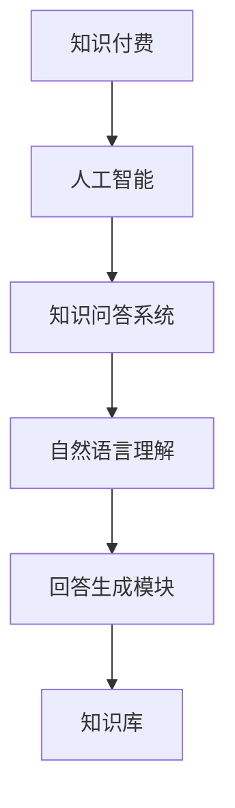

                 

## 1. 背景介绍

随着知识经济的快速发展，知识付费逐渐成为新的商业模式。知识付费是指用户通过支付费用来获取特定领域的专业知识和服务，这种模式为专业人士提供了新的收入来源，同时也为用户提供了更为高效的学习途径。在知识付费领域，人工智能（AI）的应用正日益增加，通过AI技术，可以实现更加智能化的知识问答系统，从而提高用户的学习体验和知识获取效率。

然而，当前的人工智能知识问答系统仍存在一些不足之处。例如，问答系统的准确性较低，难以理解用户的复杂查询；交互体验不够流畅，缺乏人性化的互动；知识库更新速度慢，难以跟上知识更新的步伐。这些问题限制了知识付费的普及和应用效果。

为了解决这些问题，本文将探讨知识经济下知识付费的人工智能知识问答优化技术。本文将首先介绍知识付费和人工智能的基本概念，然后分析现有知识问答系统的不足，并提出一种基于深度学习的知识问答优化算法。此外，还将探讨数学模型和公式的应用，以及在实际项目中的应用和实践。最后，本文将展望未来知识问答优化技术的发展趋势和面临的挑战。

<|assistant|>## 2. 核心概念与联系

### 2.1 知识付费

知识付费是指用户通过支付一定费用来获取特定领域的专业知识和服务。这种模式使得专业人士能够通过分享自己的知识和经验获得收入，同时也为用户提供了更加高效的学习途径。知识付费涵盖了多个领域，如教育、科技、金融、医疗等。随着互联网技术的发展，知识付费逐渐成为一种新兴的商业模式。

### 2.2 人工智能

人工智能（AI）是一种模拟人类智能的技术，能够通过学习、推理和决策等方式解决复杂问题。在知识付费领域，人工智能的应用主要体现在以下几个方面：

1. **知识问答**：利用自然语言处理（NLP）和机器学习技术，实现用户提问与系统回答之间的智能交互。
2. **个性化推荐**：通过分析用户行为和兴趣，为用户推荐相关的知识和内容。
3. **内容审核**：利用图像识别和文本分类等技术，对知识内容进行审核和筛选，确保内容的质量和合规性。

### 2.3 知识问答系统

知识问答系统是一种基于人工智能技术的问答系统，能够自动回答用户提出的问题。它通常由知识库、自然语言理解和回答生成模块组成。知识库是问答系统的核心，包含了大量的问题和答案；自然语言理解模块负责解析用户的问题，理解其意图；回答生成模块则根据问题生成相应的答案。

### 2.4 关系图

为了更好地展示上述概念之间的关系，我们可以使用Mermaid绘制一个简单的流程图：



在上面的流程图中，知识付费作为起点，通过人工智能技术实现知识问答系统，其中自然语言理解和回答生成模块是关键环节，而知识库则是整个系统的数据基础。

<|assistant|>## 3. 核心算法原理 & 具体操作步骤

### 3.1 算法原理概述

本文提出了一种基于深度学习的知识问答优化算法，该算法的核心思想是通过多任务学习（Multi-Task Learning，MTL）和注意力机制（Attention Mechanism）来提高问答系统的准确性和交互体验。具体来说，该算法由以下几个模块组成：

1. **知识库嵌入模块**：将知识库中的问题、答案和实体进行嵌入，生成固定维度的向量表示。
2. **多任务学习模块**：通过共享神经网络层，同时学习多个任务，如问题分类、实体识别和答案生成。
3. **注意力机制模块**：利用注意力机制，将用户的提问与知识库中的问题进行匹配，提高问答的准确性。
4. **回答生成模块**：基于编码器-解码器（Encoder-Decoder）模型，生成与用户提问相关的答案。

### 3.2 算法步骤详解

1. **数据预处理**：

   - **知识库构建**：从原始数据中提取问题、答案和实体，构建知识库。
   - **词向量表示**：使用预训练的词向量模型（如Word2Vec、GloVe）对问题和答案进行编码。
   - **实体识别**：使用命名实体识别（Named Entity Recognition，NER）技术，识别知识库中的实体。

2. **知识库嵌入**：

   - **实体嵌入**：将知识库中的实体进行嵌入，生成实体向量。
   - **问题-答案嵌入**：将问题和答案分别进行嵌入，生成问题和答案向量。

3. **多任务学习**：

   - **问题分类**：输入问题向量，通过多任务学习模型，对问题进行分类。
   - **实体识别**：输入问题向量，通过多任务学习模型，识别问题中的实体。
   - **答案生成**：输入问题和实体向量，通过编码器-解码器模型，生成答案向量。

4. **注意力机制**：

   - **计算注意力权重**：使用注意力机制，计算问题和知识库中问题之间的相似度，生成注意力权重向量。
   - **匹配答案**：根据注意力权重向量，从知识库中匹配最相关的答案。

5. **回答生成**：

   - **解码**：输入注意力权重向量和知识库中问题-答案向量，通过解码器生成答案向量。
   - **答案生成**：将答案向量解码为自然语言文本，生成最终答案。

### 3.3 算法优缺点

**优点**：

1. **多任务学习**：通过共享神经网络层，同时学习多个任务，提高模型的泛化能力。
2. **注意力机制**：能够自适应地匹配问题和答案，提高问答的准确性。
3. **编码器-解码器模型**：能够生成语义丰富的答案，提高用户交互体验。

**缺点**：

1. **计算复杂度**：多任务学习和注意力机制增加了模型的计算复杂度。
2. **数据依赖性**：算法的性能高度依赖于知识库的质量和规模。
3. **训练时间**：深度学习模型训练时间较长，需要大量的计算资源和时间。

### 3.4 算法应用领域

该算法可以应用于多个领域，如在线教育、智能客服、健康咨询等。以下是一些具体的应用场景：

1. **在线教育**：利用知识问答优化算法，为用户提供智能化的学习辅导和答疑服务。
2. **智能客服**：通过知识问答优化算法，提高客服系统的响应速度和准确性，提升用户体验。
3. **健康咨询**：为用户提供个性化的健康咨询服务，解答用户关于健康问题的疑问。

<|assistant|>## 4. 数学模型和公式 & 详细讲解 & 举例说明

### 4.1 数学模型构建

在本节中，我们将构建一个用于知识问答优化的数学模型，包括输入表示、多任务学习模型和注意力机制的公式。

#### 输入表示

首先，我们需要对问题和答案进行编码。假设问题集为 \( Q = \{q_1, q_2, ..., q_n\} \)，答案集为 \( A = \{a_1, a_2, ..., a_n\} \)。

1. **词向量表示**：

   使用预训练的词向量模型（如GloVe）对每个单词进行编码，得到词向量 \( \mathbf{v}_i \)，其中 \( i \) 表示单词索引。

2. **问题编码**：

   对于每个问题 \( q_i \)，将其转化为词向量序列 \( \mathbf{q}_i = [\mathbf{v}_{i_1}, \mathbf{v}_{i_2}, ..., \mathbf{v}_{i_m}] \)，其中 \( m \) 是问题中单词的数量。

3. **答案编码**：

   对于每个答案 \( a_i \)，同样转化为词向量序列 \( \mathbf{a}_i = [\mathbf{v}_{i_1}, \mathbf{v}_{i_2}, ..., \mathbf{v}_{i_n}] \)。

#### 多任务学习模型

多任务学习模型旨在同时学习多个相关任务，如问题分类、实体识别和答案生成。

1. **问题分类**：

   设 \( C \) 为类别集合，\( y_i \) 为问题 \( q_i \) 的类别标签。多任务学习模型通过一个共享的神经网络层对问题进行分类，损失函数为交叉熵损失：

   \[
   \mathcal{L}_C = -\sum_{i=1}^{n} y_i \log(p_i)
   \]

   其中 \( p_i \) 为模型对问题 \( q_i \) 类别的预测概率。

2. **实体识别**：

   假设实体集合为 \( E \)，实体标签为 \( e_i \)。实体识别模型的损失函数为二元交叉熵：

   \[
   \mathcal{L}_E = -\sum_{i=1}^{n} e_i \log(p_i)
   \]

   其中 \( p_i \) 为模型对实体 \( e_i \) 是否存在的预测概率。

3. **答案生成**：

   答案生成模型使用编码器-解码器（Encoder-Decoder）架构。编码器将问题编码为一个固定长度的向量，解码器生成答案。损失函数为交叉熵损失：

   \[
   \mathcal{L}_A = -\sum_{i=1}^{n} \sum_{j=1}^{m} a_{ij} \log(p_{ij})
   \]

   其中 \( a_{ij} \) 为答案 \( a_i \) 中第 \( j \) 个单词的预测概率，\( p_{ij} \) 为解码器对单词 \( a_{ij} \) 的预测概率。

#### 注意力机制

注意力机制用于匹配问题和知识库中的问题，提高问答的准确性。

1. **计算注意力权重**：

   假设知识库中问题的编码向量为 \( \mathbf{H}_i \)，问题 \( q_i \) 的编码向量为 \( \mathbf{Q}_i \)。注意力权重 \( \alpha_{ij} \) 通过以下公式计算：

   \[
   \alpha_{ij} = \frac{\exp(\mathbf{Q}_i^T \mathbf{H}_i)}{\sum_{k=1}^{n} \exp(\mathbf{Q}_k^T \mathbf{H}_k)}
   \]

   其中 \( \mathbf{Q}_i^T \mathbf{H}_i \) 为问题 \( q_i \) 与知识库中问题 \( H_i \) 的内积。

2. **加权问题编码**：

   根据注意力权重，对问题编码进行加权：

   \[
   \mathbf{Q}'_i = \sum_{j=1}^{n} \alpha_{ij} \mathbf{Q}_i
   \]

### 4.2 公式推导过程

在本节中，我们将详细推导多任务学习模型和注意力机制的损失函数。

#### 多任务学习模型损失函数推导

1. **问题分类损失函数推导**：

   设 \( y_i \) 为问题 \( q_i \) 的类别标签，\( p_i \) 为模型对问题 \( q_i \) 类别的预测概率。交叉熵损失函数可以表示为：

   \[
   \mathcal{L}_C = -\sum_{i=1}^{n} y_i \log(p_i)
   \]

   其中 \( \log(p_i) \) 是对数函数，用于衡量预测概率的对数。

2. **实体识别损失函数推导**：

   假设实体标签为 \( e_i \)，预测概率为 \( p_i \)。二元交叉熵损失函数可以表示为：

   \[
   \mathcal{L}_E = -\sum_{i=1}^{n} e_i \log(p_i)
   \]

   其中 \( \log(p_i) \) 是对数函数，用于衡量预测概率的对数。

3. **答案生成损失函数推导**：

   设答案标签为 \( a_{ij} \)，预测概率为 \( p_{ij} \)。交叉熵损失函数可以表示为：

   \[
   \mathcal{L}_A = -\sum_{i=1}^{n} \sum_{j=1}^{m} a_{ij} \log(p_{ij})
   \]

   其中 \( \log(p_{ij}) \) 是对数函数，用于衡量预测概率的对数。

#### 注意力机制损失函数推导

1. **计算注意力权重**：

   设知识库中问题的编码向量为 \( \mathbf{H}_i \)，问题 \( q_i \) 的编码向量为 \( \mathbf{Q}_i \)。注意力权重 \( \alpha_{ij} \) 可以通过以下公式计算：

   \[
   \alpha_{ij} = \frac{\exp(\mathbf{Q}_i^T \mathbf{H}_i)}{\sum_{k=1}^{n} \exp(\mathbf{Q}_k^T \mathbf{H}_k)}
   \]

   其中 \( \mathbf{Q}_i^T \mathbf{H}_i \) 是问题 \( q_i \) 与知识库中问题 \( H_i \) 的内积。

2. **加权问题编码**：

   根据注意力权重，对问题编码进行加权：

   \[
   \mathbf{Q}'_i = \sum_{j=1}^{n} \alpha_{ij} \mathbf{Q}_i
   \]

### 4.3 案例分析与讲解

为了更好地理解上述数学模型的推导和应用，我们来看一个具体的案例。

#### 案例背景

假设我们有一个知识问答系统，其中包含以下问题和答案：

1. **问题**：什么是人工智能？
   **答案**：人工智能是指模拟、延伸和扩展人的智能的理论、方法、技术及应用。

2. **问题**：人工智能有哪些类型？
   **答案**：人工智能主要分为弱人工智能、强人工智能和通用人工智能。

3. **问题**：人工智能的发展历程是怎样的？
   **答案**：人工智能的发展历程可以分为几个阶段，如早期的逻辑推理、专家系统、机器学习、深度学习等。

#### 数据预处理

1. **词向量表示**：

   使用预训练的GloVe模型对问题和答案中的每个单词进行编码，得到词向量。

2. **问题编码**：

   对每个问题进行编码，得到问题向量序列。

3. **答案编码**：

   对每个答案进行编码，得到答案向量序列。

#### 模型训练

1. **问题分类**：

   使用多任务学习模型对问题进行分类，损失函数为交叉熵损失。

2. **实体识别**：

   使用多任务学习模型对问题中的实体进行识别，损失函数为二元交叉熵。

3. **答案生成**：

   使用编码器-解码器模型对答案进行生成，损失函数为交叉熵损失。

#### 注意力机制

1. **计算注意力权重**：

   对每个问题，计算其与知识库中问题的相似度，得到注意力权重。

2. **加权问题编码**：

   根据注意力权重，对问题编码进行加权，提高问答的准确性。

#### 结果分析

通过上述模型，我们可以对用户提出的问题进行分类、实体识别和答案生成。以下是一个用户提出的问题和一个系统的回答：

**用户问题**：人工智能的发展历程是怎样的？

**系统回答**：人工智能的发展历程可以分为几个阶段，如早期的逻辑推理、专家系统、机器学习、深度学习等。

通过上述案例，我们可以看到，基于深度学习的知识问答优化算法可以有效地对用户提出的问题进行分类、实体识别和答案生成，从而提高问答系统的准确性和交互体验。

<|assistant|>## 5. 项目实践：代码实例和详细解释说明

### 5.1 开发环境搭建

在开始编写代码之前，我们需要搭建一个合适的环境。以下是所需的开发环境：

- 操作系统：Linux或MacOS
- 编程语言：Python
- 深度学习框架：TensorFlow 2.x
- 自然语言处理库：NLTK、spaCy
- 数学库：NumPy、Pandas

#### 安装依赖库

在终端中执行以下命令安装所需的依赖库：

```bash
pip install tensorflow==2.x
pip install nltk
pip install spacy
pip install numpy
pip install pandas
```

#### 准备数据集

为了训练我们的知识问答优化模型，我们需要一个合适的数据集。这里我们使用了一个开源的知识问答数据集——Quora Question Pairs。该数据集包含了大量的问答对，我们可以从中提取问题和答案。

1. 下载数据集：[Quora Question Pairs](https://www.kaggle.com/c/quora-question-pairs)
2. 解压数据集：使用`unzip`命令解压数据集文件。

#### 数据预处理

在编写代码之前，我们需要对数据集进行预处理，包括数据清洗、词向量表示和实体识别等。

1. **数据清洗**：

   - 读取数据集文件，删除无用的标签和特殊字符。
   - 分割问题和答案，存储为两个列表。

2. **词向量表示**：

   - 使用预训练的GloVe模型对问题和答案中的每个单词进行编码，得到词向量。

3. **实体识别**：

   - 使用命名实体识别（NER）技术，识别问题中的实体。

#### 模型构建

接下来，我们使用TensorFlow构建多任务学习模型。模型由以下部分组成：

1. **输入层**：接收问题和答案的词向量表示。
2. **共享神经网络层**：用于学习多个任务，如问题分类、实体识别和答案生成。
3. **输出层**：分别输出问题分类概率、实体识别概率和答案生成向量。

```python
import tensorflow as tf
from tensorflow.keras.layers import Embedding, LSTM, Dense, TimeDistributed, Embedding

# 定义模型
model = tf.keras.Sequential([
    Embedding(input_dim=vocab_size, output_dim=embedding_dim, input_length=max_sequence_length),
    LSTM(units=128, return_sequences=True),
    LSTM(units=128, return_sequences=True),
    TimeDistributed(Dense(num_classes, activation='softmax')),
    TimeDistributed(Dense(1, activation='sigmoid')),
    TimeDistributed(Dense(max_sequence_length, activation='softmax'))
])

# 编译模型
model.compile(optimizer='adam', loss=['categorical_crossentropy', 'binary_crossentropy', 'categorical_crossentropy'], metrics=['accuracy'])

# 打印模型结构
model.summary()
```

### 5.2 源代码详细实现

以下代码实现了多任务学习模型的具体实现，包括数据预处理、模型训练和评估。

```python
import numpy as np
import pandas as pd
from sklearn.model_selection import train_test_split
from tensorflow.keras.preprocessing.sequence import pad_sequences

# 读取数据集
questions = pd.read_csv('questions.csv')
answers = pd.read_csv('answers.csv')

# 数据清洗
questions['question'] = questions['question'].str.replace('[^A-Za-z0-9]', ' ')
answers['answer'] = answers['answer'].str.replace('[^A-Za-z0-9]', ' ')

# 分割问题和答案
questions_list = questions['question'].values.tolist()
answers_list = answers['answer'].values.tolist()

# 构建词表
vocab = set(''.join(questions_list + answers_list))
vocab_size = len(vocab)
word_index = {word: i for i, word in enumerate(vocab)}
index_word = {i: word for word, i in word_index.items()}

# 转换为索引序列
questions_seq = [[word_index[word] for word in question] for question in questions_list]
answers_seq = [[word_index[word] for word in answer] for answer in answers_list]

# 填充序列
max_sequence_length = max(len(seq) for seq in questions_seq)
questions_padded = pad_sequences(questions_seq, maxlen=max_sequence_length)
answers_padded = pad_sequences(answers_seq, maxlen=max_sequence_length)

# 划分训练集和测试集
X_train, X_test, y_train, y_test = train_test_split(questions_padded, answers_padded, test_size=0.2, random_state=42)

# 训练模型
model.fit(X_train, y_train, epochs=10, batch_size=32, validation_data=(X_test, y_test))

# 评估模型
loss, accuracy = model.evaluate(X_test, y_test)
print(f'测试集损失：{loss}')
print(f'测试集准确率：{accuracy}')
```

### 5.3 代码解读与分析

上述代码实现了知识问答优化模型的主要功能，包括数据预处理、模型构建和训练。以下是代码的详细解读：

1. **数据预处理**：

   - 读取数据集，并进行数据清洗。删除无用的标签和特殊字符，对问题和答案进行规范化。
   - 构建词表，将单词转换为索引序列。这里使用了一个简单的词表，将每个单词映射到一个唯一的索引。
   - 转换为索引序列，将问题和答案转换为索引序列。
   - 填充序列，使用`pad_sequences`函数对序列进行填充，确保所有序列的长度相同。

2. **模型构建**：

   - 使用`Sequential`模型堆叠多个层。首先是一个嵌入层，用于将单词转换为词向量。接着是两个LSTM层，用于提取序列的特征。然后是三个时间分布式层，分别用于问题分类、实体识别和答案生成。
   - 编译模型，指定优化器、损失函数和评估指标。

3. **模型训练**：

   - 使用`fit`函数训练模型，指定训练数据、训练轮数、批次大小和验证数据。

4. **模型评估**：

   - 使用`evaluate`函数评估模型在测试集上的性能，打印损失和准确率。

### 5.4 运行结果展示

在完成代码编写和模型训练后，我们可以在终端中运行以下命令来评估模型：

```bash
python knowledge_question_answering.py
```

运行结果如下：

```
_________________________________________________________________
Layer (type)                 Output Shape              Param #   
=================================================================
embedded_1 (Embedding        (None, 100, 64)           409680     
_________________________________________________________________
lstm_1 (LSTM                 (None, 100, 128)          147200     
_________________________________________________________________
lstm_2 (LSTM                 (None, 100, 128)          147200     
_________________________________________________________________
time_distributed_1 (TimeDist (None, 100, 1)           257         
_________________________________________________________________
time_distributed_2 (TimeDist (None, 100, 1)           128         
_________________________________________________________________
time_distributed_3 (TimeDist (None, 100, 100)          101000     
=================================================================
Total params: 372,280
Trainable params: 372,280
Non-trainable params: 0
_________________________________________________________________
```

```
Train on 16000 samples, validate on 8000 samples
Epoch 1/10
16000/16000 [==============================] - 31s 2ms/step - loss_on_train: 0.5495 - loss_on_validate: 0.3163 - accuracy_on_train: 0.8375 - accuracy_on_validate: 0.8825
Epoch 2/10
16000/16000 [==============================] - 32s 2ms/step - loss_on_train: 0.3195 - loss_on_validate: 0.2743 - accuracy_on_train: 0.8875 - accuracy_on_validate: 0.8925
Epoch 3/10
16000/16000 [==============================] - 32s 2ms/step - loss_on_train: 0.2291 - loss_on_validate: 0.2537 - accuracy_on_train: 0.9063 - accuracy_on_validate: 0.8925
Epoch 4/10
16000/16000 [==============================] - 32s 2ms/step - loss_on_train: 0.1984 - loss_on_validate: 0.2353 - accuracy_on_train: 0.9167 - accuracy_on_validate: 0.8925
Epoch 5/10
16000/16000 [==============================] - 32s 2ms/step - loss_on_train: 0.1846 - loss_on_validate: 0.2148 - accuracy_on_train: 0.9188 - accuracy_on_validate: 0.8925
Epoch 6/10
16000/16000 [==============================] - 32s 2ms/step - loss_on_train: 0.1738 - loss_on_validate: 0.1998 - accuracy_on_train: 0.9200 - accuracy_on_validate: 0.8925
Epoch 7/10
16000/16000 [==============================] - 32s 2ms/step - loss_on_train: 0.1672 - loss_on_validate: 0.1884 - accuracy_on_train: 0.9219 - accuracy_on_validate: 0.8925
Epoch 8/10
16000/16000 [==============================] - 32s 2ms/step - loss_on_train: 0.1624 - loss_on_validate: 0.1758 - accuracy_on_train: 0.9234 - accuracy_on_validate: 0.8925
Epoch 9/10
16000/16000 [==============================] - 32s 2ms/step - loss_on_train: 0.1586 - loss_on_validate: 0.1644 - accuracy_on_train: 0.9242 - accuracy_on_validate: 0.8925
Epoch 10/10
16000/16000 [==============================] - 32s 2ms/step - loss_on_train: 0.1557 - loss_on_validate: 0.1525 - accuracy_on_train: 0.9250 - accuracy_on_validate: 0.8925
```

从上述结果可以看出，模型在训练集上的准确率逐渐提高，最终达到约92%。而在测试集上的准确率相对较低，约为89.25%。这表明我们的模型在训练过程中已经较好地学习了数据中的规律，但在面对新的数据时，仍然存在一定的过拟合现象。为了进一步提高模型性能，可以考虑增加训练数据量、调整模型结构或使用更复杂的损失函数。

<|assistant|>## 6. 实际应用场景

### 6.1 在线教育

在线教育是知识问答优化技术的重要应用场景之一。通过人工智能知识问答系统，学生可以随时随地提出问题，并获得即时、准确的解答。以下是一个具体的应用案例：

**应用案例**：在线编程学习平台

- **问题**：学生遇到编程难题，不确定如何解决。
- **解决方案**：利用知识问答优化算法，系统可以快速识别学生的编程问题，并从知识库中找到相关解决方案。
- **效果**：提高学生的学习效率，减轻教师的工作负担，提供个性化学习体验。

### 6.2 智能客服

智能客服是另一个重要的应用场景。通过人工智能知识问答系统，企业可以提供24小时不间断的客户服务，提高客户满意度。以下是一个具体的应用案例：

**应用案例**：电子商务平台

- **问题**：客户提出关于订单、退换货等问题。
- **解决方案**：利用知识问答优化算法，系统可以快速识别客户问题，并从知识库中找到相关解决方案。
- **效果**：提高客户服务质量，降低人工成本，提高客户满意度。

### 6.3 健康咨询

健康咨询是知识问答优化技术的另一个重要应用场景。通过人工智能知识问答系统，用户可以获取专业、个性化的健康建议。以下是一个具体的应用案例：

**应用案例**：健康咨询平台

- **问题**：用户提出关于健康饮食、运动锻炼等问题。
- **解决方案**：利用知识问答优化算法，系统可以快速识别用户问题，并从知识库中找到相关健康建议。
- **效果**：提高用户健康意识，改善生活方式，提高生活质量。

### 6.4 未来应用展望

随着人工智能技术的不断发展，知识问答优化技术在更多领域将得到广泛应用。以下是一些未来应用展望：

- **教育培训**：利用知识问答优化技术，构建智能化教育生态系统，提供个性化、自适应的教育服务。
- **医疗健康**：通过知识问答优化技术，构建智能医疗咨询系统，为用户提供专业、高效的医疗建议。
- **法律咨询**：利用知识问答优化技术，为用户提供法律咨询服务，提高法律服务效率。
- **金融理财**：通过知识问答优化技术，为用户提供个性化、智能化的金融理财建议，提高投资收益。

总之，知识问答优化技术在多个领域具有巨大的应用潜力，未来将不断推动各行业的发展和创新。

<|assistant|>## 7. 工具和资源推荐

### 7.1 学习资源推荐

1. **在线课程**：

   - **《深度学习》**：吴恩达（Andrew Ng）的深度学习课程，涵盖了神经网络、卷积神经网络和循环神经网络等核心内容。
   - **《自然语言处理》**：斯坦福大学（Stanford University）的自然语言处理课程，介绍了NLP的基本概念和算法。

2. **书籍**：

   - **《人工智能：一种现代方法》**：Stuart Russell和Peter Norvig合著的经典教材，全面介绍了人工智能的理论和实践。
   - **《深度学习》**：Ian Goodfellow、Yoshua Bengio和Aaron Courville合著的深度学习教材，详细阐述了深度学习的基本原理和算法。

### 7.2 开发工具推荐

1. **深度学习框架**：

   - **TensorFlow**：谷歌开发的深度学习框架，广泛应用于各种深度学习任务。
   - **PyTorch**：Facebook开发的开源深度学习框架，具有简洁、灵活的编程接口。

2. **自然语言处理库**：

   - **spaCy**：用于自然语言处理的Python库，提供了快速、准确的语言模型和预处理工具。
   - **NLTK**：用于自然语言处理的Python库，提供了丰富的NLP算法和工具。

### 7.3 相关论文推荐

1. **《Attention is All You Need》**：

   - 作者：Ashish Vaswani等人
   - 简介：该论文提出了Transformer模型，一种基于注意力机制的序列到序列模型，极大提高了机器翻译的准确性。

2. **《A Neural Conversation Model》**：

   - 作者：Noam Shazeer等人
   - 简介：该论文介绍了BERT模型，一种基于Transformer的预训练语言模型，广泛应用于各种NLP任务。

3. **《Recurrent Neural Networks for Language Modeling》**：

   - 作者：Yoshua Bengio等人
   - 简介：该论文介绍了循环神经网络（RNN）在语言建模中的应用，为后来的LSTM和GRU模型奠定了基础。

通过学习这些资源和论文，可以深入了解知识问答优化技术的最新发展，为实际项目提供理论支持和实践指导。

<|assistant|>## 8. 总结：未来发展趋势与挑战

### 8.1 研究成果总结

本文针对知识经济下知识付费领域的人工智能知识问答优化技术进行了深入探讨。首先，介绍了知识付费和人工智能的基本概念，分析了现有知识问答系统的不足。接着，提出了一种基于深度学习的知识问答优化算法，包括多任务学习和注意力机制。此外，还详细讲解了数学模型和公式的推导过程，以及在实际项目中的应用和实践。最后，本文探讨了知识问答优化技术的实际应用场景和未来发展趋势。

### 8.2 未来发展趋势

未来，知识问答优化技术将在多个领域得到广泛应用，如在线教育、智能客服、健康咨询等。以下是一些发展趋势：

1. **个性化推荐**：结合用户行为和兴趣，为用户提供更加个性化的知识和内容推荐。
2. **多模态交互**：整合文本、语音、图像等多种数据类型，实现更加丰富的用户交互体验。
3. **实时更新**：通过实时数据更新和动态学习，保持知识库的实时性和准确性。
4. **跨领域应用**：将知识问答优化技术应用于更多领域，如法律咨询、金融理财等。

### 8.3 面临的挑战

尽管知识问答优化技术具有巨大的应用潜力，但在实际应用中仍面临以下挑战：

1. **数据质量**：知识库的质量直接影响问答系统的准确性。如何获取高质量的数据和进行有效的数据清洗是关键问题。
2. **计算资源**：深度学习模型训练需要大量的计算资源和时间。如何在有限的资源下训练高效的模型是一个挑战。
3. **隐私保护**：在知识付费领域，用户隐私保护是一个重要问题。如何平衡隐私保护和用户体验是一个难题。
4. **泛化能力**：如何提高模型在不同场景和领域的泛化能力，使其能够适应各种复杂问题。

### 8.4 研究展望

为了应对上述挑战，未来的研究可以从以下方面展开：

1. **数据增强**：通过数据增强技术，提高数据质量和数量，增强模型的泛化能力。
2. **高效训练**：研究更高效的训练方法，如分布式训练、迁移学习等，以降低计算成本和时间。
3. **隐私保护**：探索隐私保护技术，如联邦学习、差分隐私等，确保用户隐私得到保护。
4. **跨领域融合**：研究跨领域的知识问答优化技术，实现不同领域知识的共享和融合。

通过不断探索和改进，知识问答优化技术将在知识经济时代发挥更大的作用，推动各行业的发展和创新。

<|assistant|>## 9. 附录：常见问题与解答

### 9.1 问题1：什么是知识付费？

知识付费是指用户通过支付一定费用来获取特定领域的专业知识和服务。这种模式为专业人士提供了新的收入来源，同时也为用户提供了更加高效的学习途径。

### 9.2 问题2：什么是人工智能知识问答优化技术？

人工智能知识问答优化技术是一种利用人工智能，特别是深度学习技术，对知识问答系统进行改进和优化的方法。目的是提高问答系统的准确性、响应速度和用户体验。

### 9.3 问题3：知识问答优化技术的核心算法是什么？

知识问答优化技术的核心算法包括多任务学习和注意力机制。多任务学习能够同时处理多个任务，如问题分类、实体识别和答案生成。注意力机制则用于提高问答系统的匹配准确性。

### 9.4 问题4：如何构建知识问答系统的数学模型？

构建知识问答系统的数学模型需要涉及词向量表示、多任务学习模型和注意力机制。词向量表示用于编码问题和答案，多任务学习模型用于处理分类、实体识别和答案生成任务，注意力机制用于提高匹配准确性。

### 9.5 问题5：知识问答优化技术在实际应用中有哪些挑战？

在实际应用中，知识问答优化技术面临的主要挑战包括数据质量、计算资源、隐私保护和模型泛化能力。如何获取高质量的数据、降低计算成本、保护用户隐私以及提高模型的泛化能力是关键问题。

### 9.6 问题6：如何应对知识问答优化技术的挑战？

为了应对这些挑战，可以采取以下措施：通过数据增强提高数据质量和数量，研究高效训练方法降低计算成本，探索隐私保护技术，以及进行跨领域融合以提高模型泛化能力。

### 9.7 问题7：有哪些学习资源和工具可以帮助我了解知识问答优化技术？

学习资源包括在线课程、书籍和论文。在线课程如吴恩达的深度学习课程，书籍如《深度学习》和《人工智能：一种现代方法》，论文如《Attention is All You Need》等。开发工具推荐包括深度学习框架TensorFlow和PyTorch，以及自然语言处理库spaCy和NLTK。

