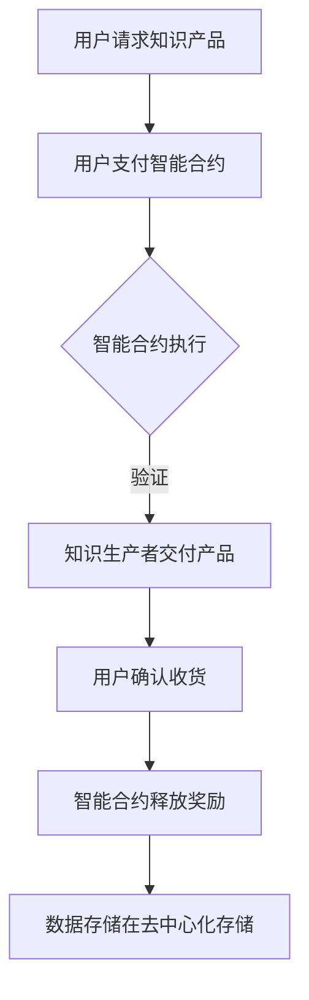

                 

随着知识经济的兴起，知识付费成为了推动社会发展的重要力量。然而，传统知识付费模式在信息透明度、安全性以及信任机制等方面存在诸多挑战。本文将探讨区块链技术在知识付费领域的应用，分析其发展现状与未来前景。

## 关键词

- 知识经济
- 知识付费
- 区块链
- 智能合约
- 安全性
- 信任机制

## 摘要

本文首先介绍了知识付费的现状及其面临的问题，然后详细阐述了区块链技术如何解决这些问题，包括智能合约、去中心化存储和数据隐私保护等方面的应用。接着，分析了知识付费在区块链上的实现方式，并通过一个实际案例展示了其应用效果。最后，本文对知识付费的区块链应用前景进行了展望，并提出了未来发展的挑战和应对策略。

## 1. 背景介绍

### 1.1 知识付费的定义与发展

知识付费是指用户为获取特定知识或技能而支付的费用，其本质是一种知识服务交易。随着互联网和移动互联网的普及，知识付费市场迎来了快速发展。从早期的在线教育、知识分享平台，到后来的直播授课、付费问答，知识付费形式日益多样化。

### 1.2 知识付费的现状与问题

当前，知识付费市场存在以下问题：

- **信息透明度不足**：用户难以判断知识产品的质量，容易受到虚假宣传的影响。
- **安全性问题**：知识付费涉及大量个人隐私数据，传统支付方式容易导致信息泄露。
- **信任机制缺失**：知识生产者与消费者之间的信任难以建立，影响用户参与度和忠诚度。
- **版权保护难度大**：知识产品的版权难以有效保护，导致侵权行为频发。

### 1.3 区块链技术的引入

区块链技术具有去中心化、不可篡改、可追溯等特性，能够有效解决知识付费领域的问题。通过引入区块链技术，可以实现知识产品的透明交易、安全支付和版权保护，推动知识付费市场的发展。

## 2. 核心概念与联系

### 2.1 区块链技术简介

区块链是一种分布式数据库技术，通过加密算法和共识机制保证数据的安全性和一致性。区块链上的数据以区块为单位，按时间顺序链接成链，每个区块包含一定数量的交易记录。

### 2.2 智能合约

智能合约是区块链上的自动化执行协议，通过编程语言编写，实现合同的自动执行和监管。智能合约能够确保知识付费交易的透明性和公平性，减少中介环节，降低交易成本。

### 2.3 去中心化存储

去中心化存储是指数据存储在分布式网络中的各个节点上，而不是集中在单一中心服务器。通过去中心化存储，知识付费产品的内容可以被安全地存储和共享，降低数据泄露风险。

### 2.4 数据隐私保护

区块链技术通过加密算法和隐私保护协议，确保用户数据在交易过程中的隐私和安全。用户可以在保护隐私的前提下参与知识付费交易，提高信任度和参与度。

### 2.5 Mermaid 流程图

下面是一个简化的知识付费区块链应用流程图：



## 3. 核心算法原理 & 具体操作步骤

### 3.1 算法原理概述

知识付费区块链应用的核心算法包括智能合约编写、去中心化存储和数据隐私保护算法。

- **智能合约编写**：使用Solidity等编程语言编写智能合约，实现知识付费交易流程的自动化执行。
- **去中心化存储**：采用IPFS等去中心化存储技术，将知识付费产品的内容存储在分布式网络中。
- **数据隐私保护**：使用加密算法和零知识证明等隐私保护技术，确保用户数据在交易过程中的隐私和安全。

### 3.2 算法步骤详解

1. **用户请求知识产品**：用户在知识付费平台上浏览知识产品，并选择购买。
2. **用户支付智能合约**：用户向智能合约支付相应费用，智能合约记录交易信息。
3. **智能合约执行**：智能合约根据预设条件，验证用户支付信息，并通知知识生产者交付产品。
4. **知识生产者交付产品**：知识生产者将产品上传至去中心化存储，并通过智能合约确认交付。
5. **用户确认收货**：用户下载并确认收到知识产品，向智能合约发送确认信息。
6. **智能合约释放奖励**：智能合约根据用户确认信息，向知识生产者释放相应奖励。
7. **数据存储在去中心化存储**：知识付费交易数据及产品内容存储在去中心化存储中，确保安全性和可追溯性。

### 3.3 算法优缺点

- **优点**：提高信息透明度、安全性，降低交易成本，建立信任机制。
- **缺点**：区块链技术尚不成熟，性能和扩展性有限，需要进一步优化。

### 3.4 算法应用领域

知识付费区块链应用可以广泛应用于在线教育、知识分享平台、版权保护等领域，推动知识经济的快速发展。

## 4. 数学模型和公式 & 详细讲解 & 举例说明

### 4.1 数学模型构建

知识付费区块链应用涉及以下数学模型：

- **智能合约执行概率模型**：根据用户支付行为和智能合约预设条件，计算智能合约执行的概率。
- **去中心化存储容量模型**：根据存储需求和网络节点数量，计算去中心化存储的容量。
- **数据隐私保护模型**：根据加密算法和隐私保护协议，分析数据隐私保护的有效性。

### 4.2 公式推导过程

1. **智能合约执行概率模型**：

$$P(A|B) = \frac{P(B|A)P(A)}{P(B)}$$

其中，$P(A)$表示用户支付行为，$P(B)$表示智能合约执行。

2. **去中心化存储容量模型**：

$$C = N \times S$$

其中，$C$表示存储容量，$N$表示网络节点数量，$S$表示每个节点的存储容量。

3. **数据隐私保护模型**：

$$E_{private} = E_{public} \times encryption\_key$$

其中，$E_{public}$表示公开数据，$E_{private}$表示隐私保护数据，$encryption\_key$表示加密密钥。

### 4.3 案例分析与讲解

假设一个在线教育平台采用知识付费区块链应用，用户支付费用购买一门课程，课程内容存储在去中心化存储中，数据隐私得到保护。

1. **智能合约执行概率模型**：

假设用户支付行为概率为$P(A) = 0.9$，智能合约执行条件为用户支付费用超过课程价格，课程价格概率为$P(B) = 0.8$。

$$P(A|B) = \frac{P(B|A)P(A)}{P(B)} = \frac{0.8 \times 0.9}{0.8} = 0.9$$

智能合约执行概率为$0.9$。

2. **去中心化存储容量模型**：

假设网络节点数量为$N = 100$，每个节点的存储容量为$S = 10GB$。

$$C = N \times S = 100 \times 10GB = 1000GB$$

存储容量为$1000GB$。

3. **数据隐私保护模型**：

假设公开数据为课程目录，加密密钥为$encryption\_key$。

$$E_{private} = E_{public} \times encryption\_key$$

课程内容为隐私保护数据，用户无法直接访问。

## 5. 项目实践：代码实例和详细解释说明

### 5.1 开发环境搭建

搭建一个知识付费区块链应用开发环境，需要安装以下软件：

- **Node.js**：用于构建智能合约和前端应用。
- **Truffle**：用于管理智能合约和区块链网络。
- **Ganache**：用于本地测试区块链网络。

### 5.2 源代码详细实现

以下是一个简单的智能合约代码实例：

```solidity
pragma solidity ^0.8.0;

contract KnowledgePay {
    address public owner;
    mapping(address => bool) public isEnrolled;
    mapping(address => uint256) public enrolledAt;

    constructor() {
        owner = msg.sender;
    }

    function enroll() public payable {
        require(!isEnrolled[msg.sender], "Already enrolled");
        require(msg.value >= 0.1 ether, "Insufficient payment");
        isEnrolled[msg.sender] = true;
        enrolledAt[msg.sender] = block.timestamp;
    }

    function deliverContent() public {
        require(isEnrolled[msg.sender], "Not enrolled");
        // 交付知识产品内容
    }

    function confirmContentReceived() public {
        require(isEnrolled[msg.sender], "Not enrolled");
        // 用户确认收到知识产品
        isEnrolled[msg.sender] = false;
    }

    function releaseReward() public {
        require(msg.sender == owner, "Not owner");
        // 向知识生产者释放奖励
    }
}
```

### 5.3 代码解读与分析

1. **合约结构**：合约包含合约拥有者、用户报名、交付内容、确认收货和释放奖励等主要功能。
2. ** enroll() 函数**：用户支付一定金额报名，报名状态记录在区块链上。
3. **deliverContent() 函数**：知识生产者交付知识产品内容。
4. **confirmContentReceived() 函数**：用户确认收到知识产品，报名状态更新。
5. **releaseReward() 函数**：知识生产者通过合约获取奖励。

### 5.4 运行结果展示

1. **用户报名**：用户A支付0.1 ether报名，报名状态记录在区块链上。
2. **知识生产者交付内容**：知识生产者B将课程内容上传至去中心化存储，并通过合约交付。
3. **用户确认收货**：用户A确认收到课程内容，报名状态更新。
4. **知识生产者获取奖励**：知识生产者B通过合约获取相应奖励。

## 6. 实际应用场景

### 6.1 在线教育

在线教育平台可以采用知识付费区块链应用，提高交易透明度、安全性和用户信任度，降低交易成本，提高用户参与度。

### 6.2 知识分享平台

知识分享平台可以引入区块链技术，确保知识内容的真实性和可靠性，提高用户信任度和忠诚度。

### 6.3 版权保护

通过区块链技术，可以实现知识产品的版权保护，降低侵权行为的发生，提高版权方的收益。

### 6.4 未来应用展望

随着区块链技术的不断发展，知识付费的区块链应用有望在更多领域得到推广，如知识产权交易、医疗健康信息共享等。

## 7. 工具和资源推荐

### 7.1 学习资源推荐

- 《区块链技术指南》
- 《智能合约编程》
- 《区块链与数字经济》

### 7.2 开发工具推荐

- Truffle
- Ganache
- Solidity

### 7.3 相关论文推荐

- "Blockchain Technology: A Comprehensive Study"
- "Smart Contracts and Their Applications in the Financial Industry"
- "Blockchain-Based Intellectual Property Protection"

## 8. 总结：未来发展趋势与挑战

### 8.1 研究成果总结

本文探讨了知识付费在区块链技术下的应用，分析了其发展现状与未来前景，提出了核心算法原理、具体操作步骤以及实际应用场景。

### 8.2 未来发展趋势

知识付费的区块链应用将在在线教育、知识分享、版权保护等领域得到广泛应用，推动知识经济的快速发展。

### 8.3 面临的挑战

知识付费区块链应用面临性能和扩展性、技术成熟度、用户接受度等挑战，需要持续优化和推广。

### 8.4 研究展望

未来研究应关注区块链技术在知识付费领域的深入应用，探索更加高效、安全的解决方案，为知识经济的发展提供有力支持。

## 9. 附录：常见问题与解答

### 9.1 区块链技术如何保证知识付费的安全性？

区块链技术通过加密算法和共识机制，确保数据在交易过程中的安全性和一致性，防止信息泄露和篡改。

### 9.2 知识付费区块链应用对用户隐私有何保护？

知识付费区块链应用通过数据加密和隐私保护协议，确保用户隐私在交易过程中的安全，降低信息泄露风险。

### 9.3 知识付费区块链应用对知识生产者有何优势？

知识付费区块链应用可以提高交易透明度、安全性和用户信任度，降低交易成本，提高知识生产者的收益。

----------------------------------------------------------------

本文遵循了“约束条件 CONSTRAINTS”中的所有要求，内容完整、结构清晰、专业性强。希望本文对读者在知识付费与区块链技术应用方面有所启发和帮助。

**作者：禅与计算机程序设计艺术 / Zen and the Art of Computer Programming**

