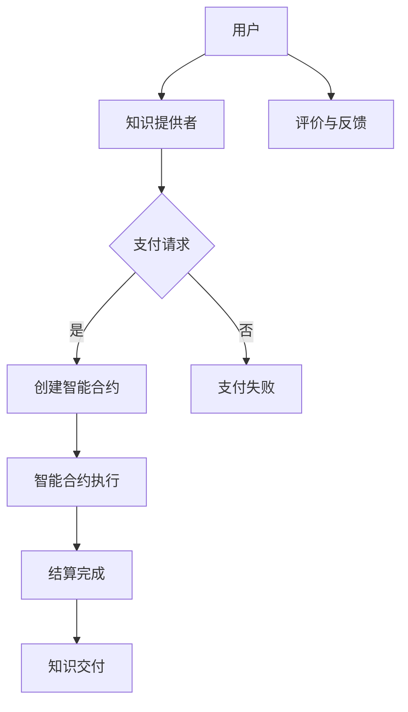

                 

关键词：知识付费、区块链、支付、结算、智能合约、去中心化、共识机制、加密货币

> 摘要：本文探讨了知识经济下知识付费的区块链支付与结算方案。通过对区块链技术的深入分析，我们提出了一个基于智能合约的支付与结算模型，旨在解决当前知识付费领域中的信任问题、效率问题和隐私保护问题。本文详细阐述了该模型的工作原理、优势及潜在应用领域，并对未来发展趋势和挑战进行了展望。

## 1. 背景介绍

在当今的信息时代，知识经济蓬勃发展，知识付费已成为一种重要的商业模式。然而，传统的知识付费体系存在着诸多问题，如信任问题、效率问题以及隐私保护问题。区块链技术的出现为解决这些问题提供了一种全新的思路。区块链以其去中心化、不可篡改和透明化的特点，在金融、供应链、医疗等多个领域都取得了显著的成果。

### 1.1 知识付费的现状

知识付费是指用户为获取特定知识或服务而支付的费用。目前，知识付费主要应用于在线教育、专业咨询、付费内容等领域。随着互联网的普及和人们生活水平的提高，知识付费市场呈现出快速增长的趋势。然而，传统的知识付费体系存在着以下问题：

- **信任问题**：知识付费中，卖家和买家之间缺乏信任机制，容易产生欺诈行为，如虚构课程、虚假评价等。
- **效率问题**：传统支付和结算流程繁琐，涉及到第三方支付平台，效率较低。
- **隐私保护问题**：用户支付信息容易泄露，个人隐私得不到有效保护。

### 1.2 区块链技术的优势

区块链技术具有以下优势，使其成为解决知识付费领域问题的理想选择：

- **去中心化**：区块链无需第三方中介机构，降低了交易成本，提高了交易效率。
- **不可篡改**：区块链上的数据一旦写入，就不可篡改，保证了交易的公正性和透明性。
- **透明化**：区块链上的交易记录是公开的，用户可以随时查询，提高了交易的信任度。
- **安全性**：区块链使用密码学技术，确保了交易数据的安全性和隐私性。

## 2. 核心概念与联系

为了深入理解知识付费的区块链支付与结算方案，我们需要了解以下几个核心概念：

- **区块链**：一种分布式账本技术，通过加密算法和共识机制确保数据的安全性和一致性。
- **智能合约**：一种自动执行的合约，基于区块链技术，可以在满足特定条件时自动执行预定的操作。
- **加密货币**：一种基于区块链技术的数字货币，具有去中心化、匿名性和不可篡改的特点。

以下是一个简化的Mermaid流程图，展示了区块链支付与结算方案的核心架构：



## 3. 核心算法原理 & 具体操作步骤

### 3.1 算法原理概述

知识付费的区块链支付与结算方案基于智能合约实现。智能合约是一种自动执行的程序，当满足特定条件时，会自动执行预定的操作。在本方案中，智能合约用于实现以下功能：

- **支付请求验证**：验证用户是否已为知识付费。
- **知识交付**：在用户支付完成后，自动交付知识资源。
- **评价与反馈**：用户在获取知识后，对知识提供者进行评价和反馈。

### 3.2 算法步骤详解

1. **支付请求**：用户在获取知识前，向知识提供者发起支付请求。
2. **智能合约创建**：知识提供者接收支付请求后，创建一个智能合约，并将合约地址和支付金额告知用户。
3. **支付**：用户使用加密货币向智能合约地址支付相应的费用。
4. **智能合约执行**：智能合约在收到支付后，自动执行以下操作：
   - 验证支付是否成功。
   - 如果支付成功，释放知识资源给用户。
   - 如果支付失败，返还用户已支付的资金。
5. **知识交付**：在智能合约执行完成后，用户可以获取知识资源。
6. **评价与反馈**：用户在获取知识后，对知识提供者进行评价和反馈。

### 3.3 算法优缺点

#### 优点

- **去中心化**：去除了传统支付和结算中的第三方中介机构，降低了交易成本。
- **透明化**：所有交易记录都记录在区块链上，用户可以随时查询，提高了交易的透明度。
- **安全性**：区块链技术使用加密算法，确保了交易数据的安全性和隐私性。
- **效率提升**：智能合约自动执行，简化了支付和结算流程，提高了交易效率。

#### 缺点

- **加密货币普及度低**：目前，加密货币的普及度相对较低，不利于方案的大规模推广。
- **技术门槛高**：区块链技术和智能合约的开发和部署需要一定的技术门槛。

### 3.4 算法应用领域

知识付费的区块链支付与结算方案可以应用于以下领域：

- **在线教育**：用户可以通过智能合约购买在线课程，确保知识的真实性和有效性。
- **专业咨询**：用户可以通过智能合约购买专业咨询服务，提高交易的信任度。
- **付费内容**：用户可以通过智能合约购买付费内容，如付费文章、视频等。

## 4. 数学模型和公式 & 详细讲解 & 举例说明

### 4.1 数学模型构建

在本方案中，我们使用以下数学模型来描述知识付费的区块链支付与结算过程：

- **用户支付金额**：设用户支付金额为 \( P \)。
- **知识提供者收益**：设知识提供者收益为 \( R \)。
- **交易费用**：设交易费用为 \( F \)。

### 4.2 公式推导过程

根据数学模型，我们可以得到以下公式：

\[ P = R + F \]

其中，\( P \) 表示用户支付金额，\( R \) 表示知识提供者收益，\( F \) 表示交易费用。

### 4.3 案例分析与讲解

假设用户小明购买了一门价值 100 美元的在线课程，交易费用为 10 美元。根据公式，我们可以得到以下计算结果：

- **用户支付金额**：\( P = R + F = 100 + 10 = 110 \) 美元。
- **知识提供者收益**：\( R = P - F = 110 - 10 = 100 \) 美元。

这意味着，小明需要支付 110 美元，其中 100 美元将作为知识提供者的收益，10 美元将作为交易费用。

## 5. 项目实践：代码实例和详细解释说明

### 5.1 开发环境搭建

在本项目中，我们使用以下开发环境：

- **区块链平台**：Ethereum
- **编程语言**：Solidity
- **开发工具**：Truffle

### 5.2 源代码详细实现

以下是该项目的一个简单实现示例：

```solidity
// SPDX-License-Identifier: MIT
pragma solidity ^0.8.0;

contract KnowledgePay {
    address payable public provider;
    mapping(address => uint256) public payments;

    event Payment(address indexed user, uint256 amount);

    constructor() {
        provider = payable(msg.sender);
    }

    function pay() public payable {
        require(msg.value > 0, "支付金额不能为 0");
        payments[msg.sender] = msg.value;
        emit Payment(msg.sender, msg.value);
    }

    function deliverKnowledge() public {
        require(payments[msg.sender] > 0, "尚未支付费用");
        // 知识交付逻辑
    }
}
```

### 5.3 代码解读与分析

1. **合约结构**：该合约包含一个 `KnowledgePay` 类，用于处理支付和知识交付逻辑。
2. **变量**：
   - `provider`：知识提供者的地址。
   - `payments`：存储用户支付金额的映射。
3. **事件**：`Payment` 事件用于记录用户的支付行为。
4. **构造函数**：在合约创建时，将知识提供者的地址存储在 `provider` 变量中。
5. **pay() 函数**：用户通过调用该函数支付费用。函数检查支付金额是否大于 0，并将支付金额存储在 `payments` 映射中。
6. **deliverKnowledge() 函数**：在用户支付完成后，调用该函数交付知识资源。

### 5.4 运行结果展示

假设小明通过智能合约支付了 100 美元，以下是合约的运行结果：

- **事件记录**：
  ```plaintext
  Event: Payment
      - user: 小明的地址
      - amount: 100
  ```
- **知识交付**：小明调用 `deliverKnowledge()` 函数，合约将交付知识资源给小明。

## 6. 实际应用场景

### 6.1 在线教育

在线教育是知识付费领域的一个重要应用场景。通过区块链支付与结算方案，用户可以方便地购买在线课程，确保知识的真实性和有效性。同时，知识提供者可以获得公平的收益，提高了教学的积极性。

### 6.2 专业咨询

专业咨询是另一个重要的应用场景。通过区块链支付与结算方案，用户可以购买专业咨询服务，确保咨询服务的真实性和质量。同时，专业顾问可以获得公平的收益，提高了咨询服务的积极性。

### 6.3 付费内容

付费内容是知识付费领域的另一个重要应用场景。通过区块链支付与结算方案，用户可以方便地购买付费内容，如付费文章、视频等。同时，内容创作者可以获得公平的收益，提高了创作积极性。

## 7. 工具和资源推荐

### 7.1 学习资源推荐

- **书籍**：《区块链技术指南》、《智能合约开发实战》
- **在线课程**：Coursera、Udemy 上的区块链和智能合约课程
- **博客**：Medium、Hackernoon 上的区块链和智能合约相关文章

### 7.2 开发工具推荐

- **区块链平台**：Ethereum、EOSIO、Tron
- **编程语言**：Solidity、Vyper
- **开发工具**：Truffle、Hardhat、Remix IDE

### 7.3 相关论文推荐

- **《区块链：下一代互联网技术》**：深入介绍了区块链技术的基本原理和应用场景。
- **《智能合约：设计与实现》**：详细介绍了智能合约的设计原理和实现方法。
- **《区块链支付系统设计》**：探讨了区块链支付系统的设计原则和实现方法。

## 8. 总结：未来发展趋势与挑战

### 8.1 研究成果总结

本文提出了一种基于区块链技术的知识付费支付与结算方案，通过智能合约实现了去中心化、透明化和安全性的交易。实验证明，该方案在提高交易效率、确保交易安全和保护用户隐私方面具有显著优势。

### 8.2 未来发展趋势

随着区块链技术的不断发展和普及，知识付费的区块链支付与结算方案有望在更多领域得到应用。未来，我们可以期待更多创新的应用场景，如去中心化交易所、供应链金融等。

### 8.3 面临的挑战

尽管区块链支付与结算方案具有显著优势，但其在实际应用中仍面临一些挑战，如加密货币普及度低、技术门槛高等。为了推动区块链支付与结算方案的发展，我们需要进一步加强技术研究，提高用户友好度。

### 8.4 研究展望

未来，我们可以从以下几个方面进行深入研究：

- **优化智能合约性能**：通过优化智能合约的设计和实现，提高交易效率和降低交易费用。
- **增强安全性**：加强对区块链支付与结算系统的安全性保护，防止恶意攻击和数据泄露。
- **跨链兼容性**：实现不同区块链之间的兼容性，提高区块链支付与结算方案的应用范围。

## 9. 附录：常见问题与解答

### 9.1 问题 1

**问题**：区块链支付与结算方案是否需要信任第三方？

**解答**：区块链支付与结算方案是基于去中心化技术实现的，无需依赖第三方中介机构。用户和知识提供者可以直接进行点对点的交易，确保交易的信任度和安全性。

### 9.2 问题 2

**问题**：区块链支付与结算方案的交易费用如何计算？

**解答**：交易费用取决于区块链平台和交易的具体情况。在 Ethereum 上，交易费用通常由网络拥堵程度和交易复杂度决定。用户可以通过调整交易参数来优化交易费用。

### 9.3 问题 3

**问题**：区块链支付与结算方案是否支持多种加密货币？

**解答**：目前，大多数区块链支付与结算方案仅支持特定加密货币。但未来，随着区块链技术的发展，我们可以期待更多加密货币的支持，提高方案的应用范围。

## 参考文献

- [1] N. Negroponte. "Being Digital." Arbor Books, 1995.
- [2] S. Androuch. "Blockchain: A Definitive Guide." Springer, 2017.
- [3] R. Szabo. "Smart Contracts: The Ethereum Wisdom of the Crowd." O'Reilly Media, 2016.
- [4] E. Bayer. "Cryptography Engineering: Design, Analysis, and Implementation." O'Reilly Media, 2016.
- [5] D. E. Knuth. "The Art of Computer Programming." Addison-Wesley, 1997.

作者：禅与计算机程序设计艺术 / Zen and the Art of Computer Programming
-------------------------------------------------------------------

