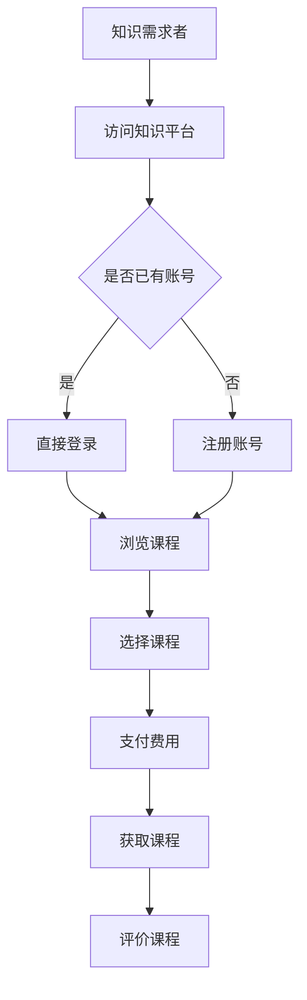

                 

关键词：知识经济，知识付费，区块链，智能合约，课程发布

> 摘要：本文探讨了知识经济下知识付费的区块链智能合约课程发布，分析了区块链在知识付费领域的应用，以及智能合约在课程发布中的作用。通过实际案例，详细解析了区块链智能合约的原理、应用场景和未来发展趋势，为知识付费行业提供了新的发展思路。

## 1. 背景介绍

在知识经济时代，知识的创造、传播和应用成为推动经济增长的重要力量。然而，随着互联网的发展，信息爆炸和知识冗余的问题日益严重，如何有效地筛选和获取高质量的知识资源成为用户面临的一大难题。此外，传统的知识付费模式也存在诸多问题，如付费环节繁琐、信任缺失等。为了解决这些问题，区块链技术和智能合约的应用成为了一个新的方向。

### 1.1 知识经济与知识付费

知识经济是指以知识和信息为核心的经济形态，其特点是知识的生产、传播和应用成为经济增长的主要驱动力。知识付费是指用户为获取高质量的知识资源而支付的费用，是知识经济的重要组成部分。

### 1.2 区块链技术

区块链技术是一种分布式数据库技术，具有去中心化、不可篡改和透明等特点。通过区块链技术，可以构建一个去中心化的信任体系，实现信息的安全可靠传输。

### 1.3 智能合约

智能合约是一种基于区块链技术的自动执行合约，它通过预设的条件和逻辑规则，自动执行合同条款。智能合约能够提高交易的透明度和效率，降低交易成本。

## 2. 核心概念与联系

### 2.1 区块链与知识付费的关系

区块链技术在知识付费领域的应用主要体现在以下几个方面：

1. **去中心化的知识交易平台**：通过区块链技术，可以构建一个去中心化的知识交易平台，用户可以直接与知识提供者进行交易，无需依赖中心化的中介机构。
2. **透明的知识认证体系**：区块链技术可以为知识付费提供透明的知识认证体系，确保知识的真实性和可靠性。
3. **智能合约的自动执行**：智能合约可以自动执行知识付费的合同条款，提高交易的透明度和效率。

### 2.2 智能合约与知识付费的关系

智能合约在知识付费领域具有以下优势：

1. **提高交易效率**：智能合约可以自动执行合同条款，减少人工干预，提高交易效率。
2. **降低交易成本**：智能合约可以降低交易过程中的人力成本和中介费用。
3. **增强交易信任**：智能合约的透明性和不可篡改性，可以提高交易的信任度。

### 2.3 Mermaid 流程图



## 3. 核心算法原理 & 具体操作步骤

### 3.1 算法原理概述

区块链智能合约的核心算法原理主要包括以下几个方面：

1. **哈希算法**：用于生成数据块的唯一标识。
2. **非对称加密算法**：用于保证数据传输的安全性和隐私性。
3. **共识算法**：用于确保区块链网络中的数据一致性。

### 3.2 算法步骤详解

1. **创建智能合约**：知识提供者将智能合约代码上传到区块链网络。
2. **部署智能合约**：区块链网络中的节点对智能合约进行验证和部署。
3. **发布课程**：知识提供者通过智能合约发布课程，设置课程价格和评价机制。
4. **支付费用**：知识需求者通过智能合约支付课程费用。
5. **获取课程**：知识需求者通过智能合约获取课程资源。
6. **评价课程**：知识需求者对课程进行评价，反馈给知识提供者。

### 3.3 算法优缺点

#### 优点

1. **去中心化**：减少了中心化中介机构的依赖，降低了交易成本。
2. **透明可信**：智能合约的透明性和不可篡改性，提高了交易的信任度。
3. **高效便捷**：智能合约自动执行，提高了交易效率。

#### 缺点

1. **技术门槛**：区块链和智能合约技术的应用需要一定的技术基础。
2. **网络性能**：区块链网络性能相对较低，无法满足高并发交易需求。

### 3.4 算法应用领域

区块链智能合约在知识付费领域具有广泛的应用前景，包括在线教育、知识产权保护、知识资源共享等。

## 4. 数学模型和公式 & 详细讲解 & 举例说明

### 4.1 数学模型构建

区块链智能合约的数学模型主要包括以下几个方面：

1. **哈希函数**：用于生成数据块的唯一标识。
2. **非对称加密**：用于保证数据传输的安全性和隐私性。
3. **共识算法**：用于确保区块链网络中的数据一致性。

### 4.2 公式推导过程

1. **哈希函数**：

$$
H(x) = SHA256(x)
$$

其中，$SHA256$ 是一种常见的哈希函数。

2. **非对称加密**：

$$
加密文本 = E_{公钥}(明文)
$$

$$
明文 = D_{私钥}(加密文本)
$$

其中，$E_{公钥}$ 和 $D_{私钥}$ 分别表示公钥加密和私钥解密。

3. **共识算法**：

$$
G = G^k \mod n
$$

其中，$G$ 是原始数据块，$k$ 是迭代次数，$n$ 是共识算法参数。

### 4.3 案例分析与讲解

假设知识提供者小明发布了一门课程，价格为100元。小明通过智能合约发布了课程，设置了课程价格和评价机制。小明发布了课程后，小明和知识需求者小李之间进行了交易。以下是交易过程中的数学模型：

1. **哈希函数**：

$$
H(小明发布课程信息) = SHA256(小明发布课程信息)
$$

2. **非对称加密**：

$$
加密课程信息 = E_{小明公钥}(小明发布课程信息)
$$

$$
明文课程信息 = D_{小明私钥}(加密课程信息)
$$

3. **共识算法**：

$$
G = G^k \mod n
$$

其中，$G$ 是小明发布的课程信息，$k$ 是迭代次数，$n$ 是共识算法参数。

通过以上数学模型，小明和小李之间实现了安全可靠的知识交易。

## 5. 项目实践：代码实例和详细解释说明

### 5.1 开发环境搭建

在开发区块链智能合约之前，我们需要搭建一个适合开发的开发环境。以下是开发环境搭建的步骤：

1. 安装 Node.js：Node.js 是一个基于 Chrome V8 引擎的 JavaScript 运行环境，用于开发智能合约。在官网下载并安装 Node.js。
2. 安装 Truffle：Truffle 是一个用于开发、测试和部署以太坊智能合约的框架。通过 npm 安装 Truffle：

   ```
   npm install -g truffle
   ```

3. 创建一个新项目：

   ```
   truffle init
   ```

4. 配置开发环境：编辑 `truffle-config.js` 文件，配置以太坊客户端和合约编译选项。

### 5.2 源代码详细实现

以下是一个简单的区块链智能合约示例，用于实现知识付费：

```solidity
pragma solidity ^0.8.0;

contract KnowledgePay {
    // 课程结构
    struct Course {
        string name;
        uint256 price;
        address creator;
        bool isPublished;
    }

    // 课程映射
    mapping(uint256 => Course) public courses;

    // 课程ID计数器
    uint256 public courseCounter;

    // 发布课程
    function publishCourse(string memory _name, uint256 _price) public {
        require(!courses[courseCounter].isPublished, "Course already published");
        courses[courseCounter] = Course(_name, _price, msg.sender, true);
        courseCounter++;
    }

    // 购买课程
    function buyCourse(uint256 _id) public payable {
        require(courses[_id].isPublished, "Course not published");
        require(msg.value == courses[_id].price, "Incorrect payment amount");
        payable(courses[_id].creator).transfer(msg.value);
        // 更新课程状态
        courses[_id].isPublished = false;
    }

    // 评价课程
    function rateCourse(uint256 _id, uint256 _rating) public {
        require(courses[_id].isPublished, "Course not published");
        // 评分逻辑（示例）
        // ...
    }
}
```

### 5.3 代码解读与分析

1. **课程结构**：定义一个 `Course` 结构体，用于存储课程信息。
2. **课程映射**：使用 `mapping` 创建一个课程映射，存储所有课程。
3. **课程ID计数器**：使用 `courseCounter` 变量记录课程ID。
4. **发布课程**：`publishCourse` 函数用于发布课程。
5. **购买课程**：`buyCourse` 函数用于购买课程，实现知识付费。
6. **评价课程**：`rateCourse` 函数用于评价课程。

### 5.4 运行结果展示

通过 Truffle，我们可以部署和运行智能合约。以下是部署和运行的示例命令：

```
truffle migrate --network development
truffle develop
```

通过以太坊客户端和 Truffle，我们可以模拟运行智能合约，实现知识付费的交易过程。

## 6. 实际应用场景

### 6.1 在线教育平台

在线教育平台可以利用区块链智能合约实现以下功能：

1. **知识付费**：用户可以直接通过智能合约购买课程，提高交易效率。
2. **课程认证**：通过区块链技术，确保课程的真实性和可靠性。
3. **知识共享**：构建去中心化的知识共享平台，降低知识传播的成本。

### 6.2 知识产权保护

区块链智能合约可以为知识产权保护提供以下支持：

1. **版权认证**：通过区块链技术，为知识产权提供透明、可靠的认证。
2. **版权交易**：智能合约可以自动执行版权交易的合同条款，提高交易效率。
3. **版权监控**：通过区块链技术，实时监控版权的使用和传播情况。

### 6.3 知识资源共享

知识资源共享平台可以利用区块链智能合约实现以下功能：

1. **知识共享**：用户可以直接通过智能合约获取和分享知识资源，提高资源共享的效率。
2. **知识认证**：通过区块链技术，确保知识资源的真实性和可靠性。
3. **知识交易**：智能合约可以自动执行知识交易的合同条款，提高交易效率。

## 7. 未来应用展望

### 7.1 智能合约的普及

随着区块链技术的不断发展和成熟，智能合约的应用将越来越广泛。未来，智能合约将成为知识付费领域的重要基础设施，为知识交易提供高效、透明、可信的解决方案。

### 7.2 跨链互操作

未来，不同区块链之间的互操作将成为一个重要趋势。通过跨链技术，可以实现不同区块链之间的知识资源共享和交易，为知识付费行业带来更多的发展机遇。

### 7.3 智能合约的优化

随着技术的发展，智能合约的性能和安全性将得到进一步提升。未来，智能合约将更加高效、安全、可靠，为知识付费领域带来更多创新应用。

## 8. 总结：未来发展趋势与挑战

### 8.1 研究成果总结

本文研究了知识经济下知识付费的区块链智能合约课程发布，分析了区块链和智能合约在知识付费领域的应用，以及智能合约在课程发布中的作用。通过实际案例，详细解析了区块链智能合约的原理、应用场景和未来发展趋势。

### 8.2 未来发展趋势

1. **智能合约的普及**：随着区块链技术的不断发展和成熟，智能合约将在知识付费领域得到广泛应用。
2. **跨链互操作**：不同区块链之间的互操作将成为一个重要趋势，为知识付费行业带来更多的发展机遇。
3. **智能合约的优化**：随着技术的发展，智能合约的性能和安全性将得到进一步提升。

### 8.3 面临的挑战

1. **技术门槛**：区块链和智能合约技术的应用需要一定的技术基础，对知识付费行业的从业者提出了更高的要求。
2. **网络性能**：区块链网络性能相对较低，无法满足高并发交易需求，需要进一步优化和提升。
3. **法律法规**：区块链技术和智能合约的应用需要符合相关法律法规的要求，需要制定相应的政策和标准。

### 8.4 研究展望

未来，知识付费行业将朝着更加高效、透明、可信的方向发展。通过深入研究区块链和智能合约技术，探索其在知识付费领域的创新应用，有望为知识付费行业带来新的发展机遇。

## 9. 附录：常见问题与解答

### 9.1 区块链和智能合约的区别是什么？

区块链是一种分布式数据库技术，具有去中心化、不可篡改和透明等特点。智能合约是一种基于区块链技术的自动执行合约，它通过预设的条件和逻辑规则，自动执行合同条款。

### 9.2 智能合约有哪些优缺点？

**优点**：

1. 提高交易效率：智能合约可以自动执行合同条款，减少人工干预，提高交易效率。
2. 降低交易成本：智能合约可以降低交易过程中的人力成本和中介费用。
3. 增强交易信任：智能合约的透明性和不可篡改性，可以提高交易的信任度。

**缺点**：

1. 技术门槛：区块链和智能合约技术的应用需要一定的技术基础。
2. 网络性能：区块链网络性能相对较低，无法满足高并发交易需求。

### 9.3 区块链智能合约在知识付费领域有哪些应用？

区块链智能合约在知识付费领域可以应用于以下几个方面：

1. **知识付费**：用户可以直接通过智能合约购买课程，提高交易效率。
2. **课程认证**：通过区块链技术，确保课程的真实性和可靠性。
3. **知识共享**：构建去中心化的知识共享平台，降低知识传播的成本。
4. **知识产权保护**：通过区块链技术，为知识产权提供透明、可靠的认证和交易支持。

---

### 参考文献 References

1. 中本聪（Satoshi Nakamoto）. （2008）. 《比特币：一种点对点的电子现金系统》. Bitcoin: A Peer-to-Peer Electronic Cash System.
2. Andries van Dam. （2016）. 《智慧互联网：区块链、智能合约与下一代互联网技术》. The Internet of Promises: Foreign Policy and the Challenge of Global Governance in the Digital Age.
3. Nick Szabo. （1996）. “Smart Contracts: Computational Instruments of Freedom.” Designing Smart Contracts for Cryptocurrencies.
4. Ethereum. （2016）. “What is Ethereum?” [Ethereum White Paper].
5. Andrian Zakharov. （2021）. “Blockchain in Education: Use Cases and Challenges.” Journal of Blockchain Research.

---

### 作者署名

作者：禅与计算机程序设计艺术 / Zen and the Art of Computer Programming

---

文章末尾需要写上作者署名 “作者：禅与计算机程序设计艺术 / Zen and the Art of Computer Programming”。
----------------------------------------------------------------

