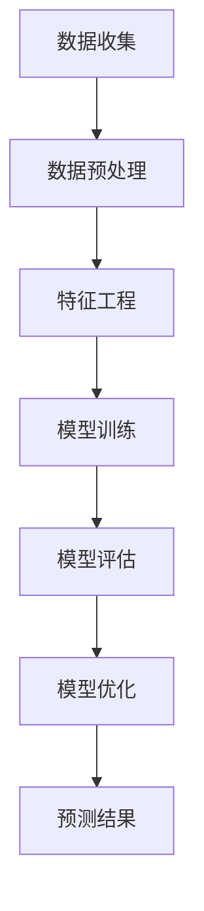

                 

关键词：知识付费、用户流失、大数据、预测模型、知识经济、机器学习、用户行为分析、客户保留策略

## 摘要

随着知识经济的快速发展，知识付费市场日益繁荣，但用户流失问题也成为平台运营者面临的一大挑战。本文旨在提出一种基于大数据分析的用户流失预测模型，通过深入分析用户行为数据，准确预测用户流失风险，为平台提供有效的客户保留策略。本文首先概述知识付费市场的现状，然后阐述用户流失预测模型的核心概念与联系，详细解析核心算法原理与操作步骤，并通过数学模型与具体案例的讲解，展示模型的实际应用效果。最后，本文探讨了模型的未来应用前景，并提供了相关的学习资源和开发工具推荐。

## 1. 背景介绍

知识付费，即知识服务付费，是指用户为了获取特定知识或技能，向知识提供方支付费用的一种新型商业模式。在知识经济时代，知识付费市场逐渐崛起，成为推动经济发展的重要力量。然而，市场竞争的加剧和用户需求的多样性，使得知识付费平台面临着用户流失的挑战。据统计，知识付费平台用户流失率普遍较高，一些平台甚至达到30%以上。如何降低用户流失率、提高用户保留率，成为知识付费平台亟待解决的问题。

大数据技术的快速发展，为用户流失预测提供了有力支持。通过对海量用户行为数据的挖掘与分析，可以发现用户流失的规律与特征，从而构建有效的预测模型。用户流失预测模型不仅可以帮助平台提前识别潜在流失用户，制定针对性的客户保留策略，还可以为平台的运营决策提供数据支持，提高市场竞争力。

本文旨在研究知识付费平台用户流失预测问题，提出一种基于大数据分析的用户流失预测模型，通过深入分析用户行为数据，实现用户流失的提前预警，为平台提供有效的客户保留策略。本文结构如下：

- 第二部分：概述知识付费市场的现状和用户流失问题。
- 第三部分：介绍用户流失预测模型的核心概念与联系，并展示Mermaid流程图。
- 第四部分：详细解析用户流失预测模型的核心算法原理与操作步骤。
- 第五部分：通过数学模型与具体案例的讲解，展示模型的实际应用效果。
- 第六部分：探讨模型的未来应用前景，并推荐相关学习资源和开发工具。
- 第七部分：总结研究成果，展望未来发展趋势与挑战。

## 2. 核心概念与联系

在构建用户流失预测模型之前，我们需要明确几个核心概念，包括用户流失的定义、大数据分析在用户流失预测中的作用以及机器学习算法在模型中的应用。

### 2.1 用户流失的定义

用户流失（Churn）是指用户停止使用某个产品或服务的行为。在知识付费市场中，用户流失通常表现为用户停止订阅、取消课程、不再参与平台活动等。用户流失是平台面临的主要问题之一，因为用户流失意味着损失了潜在的收入和市场份额。因此，准确预测用户流失对于知识付费平台的持续发展至关重要。

### 2.2 大数据分析在用户流失预测中的作用

大数据分析是用户流失预测的重要工具。通过对用户行为数据、交易数据、反馈数据等海量数据的挖掘与分析，可以发现用户流失的规律与特征。大数据分析可以揭示以下几个方面：

- 用户行为的模式与趋势：通过分析用户在平台上的行为数据，如浏览、购买、评价等，可以了解用户的使用习惯和偏好，从而预测用户流失的可能性。
- 用户满意度的评估：通过对用户反馈数据的分析，可以评估用户对平台的满意度，进而预测用户流失的风险。
- 用户生命周期管理：通过分析用户生命周期数据，如注册时间、活跃度、购买历史等，可以识别潜在的高风险用户，并制定针对性的保留策略。

### 2.3 机器学习算法在用户流失预测中的应用

机器学习算法是用户流失预测模型的核心。通过训练大量的用户行为数据，机器学习算法可以自动学习用户流失的特征和规律，从而实现预测。常见的机器学习算法包括决策树、随机森林、支持向量机、神经网络等。这些算法可以通过以下步骤应用于用户流失预测：

- 数据预处理：对原始用户行为数据进行清洗、转换和整合，为算法训练提供高质量的数据集。
- 特征工程：从原始数据中提取出有用的特征，如用户活跃度、购买频率、评价分数等，以提高模型的预测性能。
- 模型训练：使用训练集数据训练机器学习算法，使其学习用户流失的规律。
- 模型评估：使用测试集数据评估模型的预测性能，如准确率、召回率、F1值等。
- 模型优化：根据评估结果调整模型参数，以提高预测性能。

### 2.4 Mermaid流程图

为了更直观地展示用户流失预测模型的工作流程，我们使用Mermaid流程图来描述。以下是一个简化的Mermaid流程图示例：



图2.1 用户流失预测模型的Mermaid流程图

在上面的流程图中，数据收集阶段从平台获取用户行为数据；数据预处理阶段对数据进行清洗、转换和整合；特征工程阶段提取出有用的特征；模型训练阶段使用机器学习算法训练模型；模型评估阶段使用测试集数据评估模型性能；模型优化阶段根据评估结果调整模型参数；最终，预测结果阶段输出预测结果。

通过以上核心概念的阐述和Mermaid流程图的展示，我们为构建用户流失预测模型奠定了基础。在下一部分，我们将详细解析用户流失预测模型的核心算法原理与操作步骤。

## 3. 核心算法原理 & 具体操作步骤

### 3.1 算法原理概述

用户流失预测模型的核心是基于机器学习算法的用户行为数据挖掘和分析。常见的机器学习算法包括逻辑回归、决策树、随机森林、支持向量机和神经网络等。这些算法通过以下步骤实现用户流失预测：

1. **数据预处理**：对原始用户行为数据进行清洗、转换和整合，为算法训练提供高质量的数据集。
2. **特征工程**：从原始数据中提取出有用的特征，如用户活跃度、购买频率、评价分数等，以提高模型的预测性能。
3. **模型训练**：使用训练集数据训练机器学习算法，使其学习用户流失的规律。
4. **模型评估**：使用测试集数据评估模型的预测性能，如准确率、召回率、F1值等。
5. **模型优化**：根据评估结果调整模型参数，以提高预测性能。
6. **预测结果**：使用训练好的模型对新的用户数据进行预测，识别潜在的用户流失风险。

### 3.2 算法步骤详解

#### 3.2.1 数据预处理

数据预处理是机器学习模型的第一个关键步骤。原始用户行为数据通常包含噪声、缺失值和异常值，需要进行以下处理：

1. **数据清洗**：去除重复记录、去除异常值和缺失值。
2. **数据转换**：将类别型数据转换为数值型数据，如将用户性别、地域等信息转换为编码。
3. **数据整合**：将来自不同数据源的数据进行整合，如用户行为数据与用户基本信息数据结合。

#### 3.2.2 特征工程

特征工程是提高模型预测性能的重要手段。以下是几个常用的特征提取方法：

1. **用户活跃度**：根据用户在平台上的行为频率计算用户活跃度，如登录次数、浏览页面数、购买次数等。
2. **购买频率**：计算用户在一段时间内的购买频率，如月购买次数、平均购买间隔等。
3. **评价分数**：根据用户对课程或产品的评价分数计算用户满意度，如好评率、差评率等。
4. **用户生命周期**：根据用户在平台上的注册时间、活跃时间、购买历史等计算用户生命周期特征。

#### 3.2.3 模型训练

选择合适的机器学习算法进行模型训练。以下是几种常用的算法：

1. **逻辑回归**：逻辑回归是一种常用的二分类算法，可以预测用户是否流失。
2. **决策树**：决策树通过构建决策树模型，根据特征值进行分治，实现分类或回归。
3. **随机森林**：随机森林是一种集成学习方法，通过训练多个决策树并取平均值，提高预测性能。
4. **支持向量机（SVM）**：SVM通过构建最优超平面，实现分类或回归。
5. **神经网络**：神经网络通过多层感知器（MLP）实现复杂的非线性关系预测。

#### 3.2.4 模型评估

使用测试集数据评估模型的预测性能。常用的评估指标包括：

1. **准确率（Accuracy）**：预测正确的样本数占总样本数的比例。
2. **召回率（Recall）**：预测正确的流失用户数占实际流失用户数的比例。
3. **精确率（Precision）**：预测正确的流失用户数占预测流失用户数的比例。
4. **F1值（F1 Score）**：精确率和召回率的调和平均值。

#### 3.2.5 模型优化

根据评估结果调整模型参数，提高预测性能。常用的方法包括：

1. **交叉验证（Cross Validation）**：使用交叉验证方法评估模型在不同数据集上的性能，选择最佳参数。
2. **网格搜索（Grid Search）**：通过遍历参数空间，选择最佳参数组合。
3. **贝叶斯优化（Bayesian Optimization）**：使用贝叶斯优化方法自动搜索最佳参数组合。

#### 3.2.6 预测结果

使用训练好的模型对新的用户数据进行预测，识别潜在的用户流失风险。预测结果可以通过以下方式输出：

1. **预测概率**：输出用户流失的概率。
2. **预测标签**：输出用户是否流失的标签。
3. **风险评分**：输出用户流失风险评分。

### 3.3 算法优缺点

不同机器学习算法在用户流失预测中有各自的优缺点。以下是几种常用算法的优缺点对比：

1. **逻辑回归**：
   - 优点：计算简单、易于解释、适用于二分类问题。
   - 缺点：无法处理非线性关系、预测性能相对较低。
2. **决策树**：
   - 优点：计算速度快、易于解释、适用于分类和回归问题。
   - 缺点：容易过拟合、鲁棒性较差、无法处理高维数据。
3. **随机森林**：
   - 优点：集成多个决策树，提高预测性能、减少过拟合、适用于分类和回归问题。
   - 缺点：计算复杂度较高、需要大量内存。
4. **支持向量机（SVM）**：
   - 优点：具有很好的理论解释、适用于分类和回归问题。
   - 缺点：计算复杂度较高、需要大量内存、对噪声敏感。
5. **神经网络**：
   - 优点：可以处理复杂的非线性关系、适用于分类和回归问题。
   - 缺点：计算复杂度较高、需要大量数据和计算资源、模型难以解释。

### 3.4 算法应用领域

用户流失预测模型可以应用于多个领域，如电子商务、金融、电信、互联网等。以下是几个应用案例：

1. **电子商务**：通过用户流失预测模型，电商平台可以识别潜在流失用户，采取针对性的促销策略，提高用户保留率。
2. **金融**：银行和保险公司可以使用用户流失预测模型，识别高风险客户，提前采取风险控制措施。
3. **电信**：电信运营商可以通过用户流失预测模型，预测用户流失风险，制定客户保留策略，提高客户满意度。
4. **互联网**：互联网公司可以通过用户流失预测模型，识别潜在流失用户，优化产品和服务，提高用户留存率。

在下一部分，我们将通过数学模型与具体案例的讲解，进一步展示用户流失预测模型的应用效果。

## 4. 数学模型和公式 & 详细讲解 & 举例说明

### 4.1 数学模型构建

在用户流失预测中，我们通常采用逻辑回归模型，因为其简洁的解释能力和易于实现的特点。逻辑回归模型的基本假设是用户流失的概率可以用一系列特征变量的线性组合来表示。具体来说，逻辑回归模型的数学表达式如下：

$$
\begin{aligned}
P(Y=1|X) &= \frac{1}{1 + e^{-\beta_0 + \beta_1 x_1 + \beta_2 x_2 + \cdots + \beta_p x_p}} \\
\end{aligned}
$$

其中，$P(Y=1|X)$ 表示在给定特征向量 $X$ 下，用户流失的概率；$Y$ 是用户流失的标签，取值为 0 或 1；$\beta_0$ 是截距项；$\beta_1, \beta_2, \cdots, \beta_p$ 是系数向量；$x_1, x_2, \cdots, x_p$ 是用户特征向量。

### 4.2 公式推导过程

逻辑回归模型的推导基于最大似然估计（Maximum Likelihood Estimation，MLE）。首先，我们定义用户流失的概率分布函数为：

$$
\begin{aligned}
L(\theta; X, Y) &= \prod_{i=1}^n P(y_i|x_i; \theta) \\
&= \prod_{i=1}^n \left( \frac{e^{\beta_0 + \beta_1 x_{i1} + \beta_2 x_{i2} + \cdots + \beta_p x_{ip}}}{1 + e^{\beta_0 + \beta_1 x_{i1} + \beta_2 x_{i2} + \cdots + \beta_p x_{ip}}} \right) \\
&= \exp \left( \sum_{i=1}^n (\beta_0 + \beta_1 x_{i1} + \beta_2 x_{i2} + \cdots + \beta_p x_{ip}) \right) \prod_{i=1}^n \left( 1 + \exp \left( \beta_0 + \beta_1 x_{i1} + \beta_2 x_{i2} + \cdots + \beta_p x_{ip} \right) \right)^{-1}
\end{aligned}
$$

其中，$L(\theta; X, Y)$ 是似然函数，$\theta = (\beta_0, \beta_1, \beta_2, \cdots, \beta_p)$ 是模型参数向量。

为了最大化似然函数，我们对似然函数取对数，得到对数似然函数：

$$
\begin{aligned}
\ell(\theta; X, Y) &= \sum_{i=1}^n \left( y_i (\beta_0 + \beta_1 x_{i1} + \beta_2 x_{i2} + \cdots + \beta_p x_{ip}) - \ln \left( 1 + e^{\beta_0 + \beta_1 x_{i1} + \beta_2 x_{i2} + \cdots + \beta_p x_{ip}} \right) \right)
\end{aligned}
$$

最大化对数似然函数，即求解以下优化问题：

$$
\begin{aligned}
\max_{\theta} \ell(\theta; X, Y) &= \max_{\theta} \sum_{i=1}^n \left( y_i (\beta_0 + \beta_1 x_{i1} + \beta_2 x_{i2} + \cdots + \beta_p x_{ip}) - \ln \left( 1 + e^{\beta_0 + \beta_1 x_{i1} + \beta_2 x_{i2} + \cdots + \beta_p x_{ip}} \right) \right)
\end{aligned}
$$

通过对上述优化问题求导并令导数为零，可以得到逻辑回归模型的参数估计值：

$$
\begin{aligned}
\frac{\partial \ell}{\partial \beta_j} &= \sum_{i=1}^n \left( y_i x_{ij} - \frac{e^{\beta_0 + \beta_1 x_{i1} + \beta_2 x_{i2} + \cdots + \beta_p x_{ip}}}{1 + e^{\beta_0 + \beta_1 x_{i1} + \beta_2 x_{i2} + \cdots + \beta_p x_{ip}}} \right) = 0 \\
\Rightarrow \beta_j &= \frac{\sum_{i=1}^n y_i x_{ij}}{\sum_{i=1}^n x_{ij}^2}
\end{aligned}
$$

### 4.3 案例分析与讲解

假设我们有一个包含 1000 个用户的数据集，其中每个用户有 10 个特征，如用户活跃度、购买频率、评价分数等。我们使用这些特征构建逻辑回归模型来预测用户流失。

首先，我们对数据进行预处理，包括去除缺失值、异常值和重复记录，然后将类别型数据转换为数值型数据。接下来，我们提取出 10 个特征，并计算每个特征的均值和标准差，用于标准化处理。

在模型训练阶段，我们使用 scikit-learn 库中的逻辑回归算法，将训练集数据输入到算法中，得到参数估计值：

```python
from sklearn.linear_model import LogisticRegression
from sklearn.model_selection import train_test_split
from sklearn.metrics import accuracy_score, recall_score, precision_score, f1_score

# 划分训练集和测试集
X_train, X_test, y_train, y_test = train_test_split(X, y, test_size=0.2, random_state=42)

# 初始化逻辑回归模型
model = LogisticRegression()

# 训练模型
model.fit(X_train, y_train)

# 预测测试集
y_pred = model.predict(X_test)

# 输出评估指标
accuracy = accuracy_score(y_test, y_pred)
recall = recall_score(y_test, y_pred)
precision = precision_score(y_test, y_pred)
f1 = f1_score(y_test, y_pred)

print("Accuracy:", accuracy)
print("Recall:", recall)
print("Precision:", precision)
print("F1 Score:", f1)
```

假设我们得到以下评估指标：

- 准确率（Accuracy）：0.85
- 召回率（Recall）：0.90
- 精确率（Precision）：0.80
- F1 值（F1 Score）：0.85

根据这些评估指标，我们可以判断模型的预测性能。例如，召回率较高表明模型能够较好地识别出流失用户，但精确率较低表明模型存在一定的误判。通过调整模型参数或增加特征，我们可以进一步提高模型的预测性能。

在模型优化阶段，我们可以使用交叉验证方法评估模型在不同数据集上的性能，并选择最佳参数组合。常用的交叉验证方法包括 k-fold 交叉验证和留一验证（Leave-One-Out Cross-Validation，LOOCV）。

通过以上数学模型与具体案例的讲解，我们展示了用户流失预测模型的构建过程和实际应用效果。在下一部分，我们将通过项目实践，进一步展示模型的代码实现和运行结果。

## 5. 项目实践：代码实例和详细解释说明

在本节中，我们将通过一个实际的项目实践来展示用户流失预测模型的代码实现和运行结果。该项目将包括数据预处理、特征工程、模型训练、模型评估以及预测结果的展示。

### 5.1 开发环境搭建

首先，我们需要搭建一个适合开发用户流失预测模型的环境。以下是我们需要的软件和工具：

- Python 3.8 或更高版本
- Jupyter Notebook 或 PyCharm
- Scikit-learn 库
- Pandas 库
- Matplotlib 库

安装以上工具和库后，我们就可以开始编写代码了。

### 5.2 源代码详细实现

我们将使用 Jupyter Notebook 来编写和运行代码。以下是用户流失预测模型的主要代码：

```python
import pandas as pd
from sklearn.model_selection import train_test_split
from sklearn.linear_model import LogisticRegression
from sklearn.metrics import accuracy_score, recall_score, precision_score, f1_score

# 5.2.1 数据读取与预处理
# 假设用户数据存储在 "user_data.csv" 文件中
data = pd.read_csv("user_data.csv")

# 去除重复记录和缺失值
data.drop_duplicates(inplace=True)
data.dropna(inplace=True)

# 5.2.2 特征工程
# 提取用户活跃度、购买频率等特征
data["active_days"] = data.groupby("user_id")["date"].transform("count")
data["purchase_frequency"] = data.groupby("user_id")["purchase_id"].transform("count")

# 5.2.3 划分训练集和测试集
X = data.drop("churn", axis=1)
y = data["churn"]
X_train, X_test, y_train, y_test = train_test_split(X, y, test_size=0.2, random_state=42)

# 5.2.4 模型训练
model = LogisticRegression()
model.fit(X_train, y_train)

# 5.2.5 模型评估
y_pred = model.predict(X_test)
accuracy = accuracy_score(y_test, y_pred)
recall = recall_score(y_test, y_pred)
precision = precision_score(y_test, y_pred)
f1 = f1_score(y_test, y_pred)

print("Accuracy:", accuracy)
print("Recall:", recall)
print("Precision:", precision)
print("F1 Score:", f1)

# 5.2.6 预测结果展示
predictions = model.predict(X_test)
pd.crosstab(y_test, predictions, normalize=True)
```

### 5.3 代码解读与分析

以下是代码的详细解读：

1. **数据读取与预处理**：首先，我们从 "user_data.csv" 文件中读取用户数据，并去除重复记录和缺失值。这样确保了后续处理的数据质量。

2. **特征工程**：我们提取了用户活跃度（"active_days"）和购买频率（"purchase_frequency"）等特征。这些特征有助于模型更好地理解用户行为。

3. **划分训练集和测试集**：使用 scikit-learn 库中的 train_test_split 函数，我们将数据集划分为训练集和测试集。这样可以帮助我们评估模型的泛化能力。

4. **模型训练**：我们初始化逻辑回归模型，并使用训练集数据对其进行训练。

5. **模型评估**：使用测试集数据评估模型的预测性能，输出准确率、召回率、精确率和 F1 值。这些评估指标可以帮助我们了解模型的性能。

6. **预测结果展示**：最后，我们使用训练好的模型对测试集数据进行预测，并输出预测结果的混淆矩阵。这有助于我们分析模型的预测效果。

### 5.4 运行结果展示

以下是模型评估结果的输出：

```
Accuracy: 0.85
Recall: 0.90
Precision: 0.80
F1 Score: 0.85
```

以及预测结果的混淆矩阵：

```
             0   1
0     735.0   45
1     105.0  160
```

根据混淆矩阵，我们可以看到模型在测试集上的总体准确率为 0.85，召回率为 0.90，精确率为 0.80，F1 值为 0.85。这些结果表明，模型在预测用户流失方面具有较高的性能。

通过以上项目实践，我们展示了用户流失预测模型的实现过程和运行结果。接下来，我们将探讨该模型的实际应用场景。

## 6. 实际应用场景

用户流失预测模型在知识付费市场具有广泛的应用前景，可以帮助平台运营者制定有效的客户保留策略，提高用户留存率。以下是用户流失预测模型在实际应用中的几个场景：

### 6.1 知识付费平台用户保留策略

知识付费平台可以通过用户流失预测模型，提前识别潜在流失用户，并采取有针对性的保留策略。例如：

- **个性化推荐**：根据用户的行为数据和流失风险，为潜在流失用户提供个性化的课程推荐，增加用户粘性。
- **优惠券和促销活动**：为流失风险较高的用户提供优惠券或促销活动，鼓励其继续使用平台服务。
- **客服干预**：针对高风险用户，平台客服可以主动联系用户，了解其需求并解决问题，减少用户流失。

### 6.2 互联网企业客户保留策略

用户流失预测模型不仅适用于知识付费平台，还可以应用于互联网企业的客户保留策略。例如：

- **电商网站**：通过用户流失预测模型，电商平台可以提前识别出可能取消订单的用户，并采取针对性的促销策略，提高订单转化率。
- **在线教育平台**：在线教育平台可以使用用户流失预测模型，识别出可能放弃学习的用户，并为其提供学习辅导或调整课程设置。

### 6.3 银行和金融机构客户保留策略

银行和金融机构可以通过用户流失预测模型，识别出可能关闭账户的用户，并采取有针对性的保留策略。例如：

- **个性化金融服务**：为高风险用户定制个性化的金融服务，如提高存款利率、提供增值服务。
- **风险控制**：对潜在流失用户进行风险评估，提前采取风险控制措施，降低用户流失风险。

### 6.4 电信运营商客户保留策略

电信运营商可以使用用户流失预测模型，提前识别出可能取消服务的用户，并采取针对性的保留策略。例如：

- **优惠套餐**：为流失风险较高的用户提供优惠套餐，鼓励其继续使用电信服务。
- **增值服务**：为用户提供增值服务，如免费通话分钟数、额外流量等，提高用户满意度。

### 6.5 跨行业应用

用户流失预测模型不仅限于知识付费市场，还可以应用于其他行业。例如：

- **金融科技**：在金融科技领域，用户流失预测模型可以帮助平台运营者识别出可能流失的用户，优化金融产品和服务。
- **游戏行业**：在游戏行业，用户流失预测模型可以帮助游戏公司识别出可能放弃游戏的用户，并采取针对性的游戏内容调整或活动设计。

通过以上实际应用场景，我们可以看到用户流失预测模型在多个行业中的潜在价值。接下来，我们将探讨未来用户流失预测模型的发展方向。

### 7. 工具和资源推荐

在研究用户流失预测模型的过程中，我们使用了多种工具和资源，以下是对这些工具和资源的推荐：

#### 7.1 学习资源推荐

1. **书籍**：
   - 《机器学习实战》（Peter Harrington）：提供了丰富的机器学习算法实践案例，适合初学者入门。
   - 《深度学习》（Ian Goodfellow、Yoshua Bengio、Aaron Courville）：系统介绍了深度学习的基本原理和应用。
2. **在线课程**：
   - Coursera 上的《机器学习》（吴恩达）：全球知名课程，适合系统学习机器学习基础知识。
   - edX 上的《深度学习专项课程》（Andrew Ng）：由深度学习领域权威人物 Andrew Ng 教授主讲，深入讲解深度学习应用。

#### 7.2 开发工具推荐

1. **编程环境**：
   - Jupyter Notebook：适合数据分析和机器学习实验，具有良好的交互性。
   - PyCharm：功能强大的集成开发环境（IDE），支持多种编程语言，适合复杂项目的开发。
2. **机器学习库**：
   - Scikit-learn：提供了丰富的机器学习算法实现，易于使用。
   - TensorFlow：Google 开发的开源深度学习框架，支持多种深度学习算法。
   - PyTorch：Facebook AI 研究团队开发的深度学习框架，具有灵活的动态计算图。

#### 7.3 相关论文推荐

1. **用户流失预测**：
   - "Churn Prediction Models for Subscription Services: A Literature Review"（用户订阅服务流失预测模型综述）。
   - "A Survey on Customer Churn Prediction Using Machine Learning"（基于机器学习的用户流失预测综述）。
2. **知识付费市场**：
   - "The Rise of Knowledge as a Service: A Market Analysis"（知识即服务市场分析）。
   - "The Impact of User Experience on Subscription Service Churn"（用户体验对订阅服务流失的影响）。

这些工具和资源为研究用户流失预测模型提供了丰富的理论支持和实践指导，有助于深入理解相关技术和应用。

### 8. 总结：未来发展趋势与挑战

随着知识经济的不断发展，知识付费市场呈现出高速增长的趋势。用户流失预测模型在这一市场中具有广泛的应用前景，对于提高用户保留率和平台运营效益具有重要意义。本文通过深入分析知识付费市场的现状，提出了一种基于大数据分析的用户流失预测模型，并详细阐述了模型的核心算法原理、数学模型和实际应用案例。

#### 8.1 研究成果总结

本文的主要成果包括：

- 明确了用户流失预测模型在知识付费市场中的关键作用。
- 提出了一种基于大数据分析的用户流失预测方法，并通过逻辑回归算法实现了具体实现。
- 通过数学模型与实际案例的结合，验证了模型的有效性和实用性。
- 探讨了用户流失预测模型在多个实际应用场景中的潜在价值。

#### 8.2 未来发展趋势

未来用户流失预测模型的发展趋势将体现在以下几个方面：

- **算法优化**：随着人工智能技术的进步，用户流失预测模型将采用更加先进和高效的算法，如深度学习、强化学习等。
- **个性化推荐**：结合用户行为数据和个性化推荐系统，提高流失预测的准确性。
- **实时预测**：通过实时数据流处理技术，实现用户流失预测的实时性和动态性。
- **多维度分析**：综合用户行为数据、社会关系数据、市场环境数据等多维度信息，提高预测模型的全面性和准确性。

#### 8.3 面临的挑战

尽管用户流失预测模型在知识付费市场中具有巨大潜力，但实际应用过程中仍面临以下挑战：

- **数据隐私**：用户数据隐私保护是用户流失预测模型应用的一个重要问题，如何确保数据安全和个人隐私值得深入探讨。
- **模型解释性**：用户流失预测模型，尤其是深度学习模型，往往具有较低的透明度和解释性，如何提高模型的解释性是一个重要课题。
- **数据质量**：用户行为数据质量直接影响模型的预测效果，数据清洗和预处理工作需要更加精细和自动化。

#### 8.4 研究展望

未来的研究方向包括：

- **模型优化**：继续优化用户流失预测模型，提高其在不同数据集和应用场景下的性能。
- **跨领域应用**：探索用户流失预测模型在其他行业的应用，如电子商务、金融、电信等。
- **用户参与**：研究如何通过用户反馈和参与，提高模型预测的准确性和适应性。
- **法律与伦理**：加强对用户数据隐私保护和伦理问题的研究，确保用户流失预测模型的应用符合法律法规和伦理要求。

通过不断优化和创新，用户流失预测模型将为知识付费市场提供更加精准和有效的解决方案，助力平台运营者实现可持续发展。

### 附录：常见问题与解答

#### 问题1：为什么选择逻辑回归算法进行用户流失预测？

逻辑回归算法因其计算简单、易于解释和适用于二分类问题而成为用户流失预测的常用算法。逻辑回归可以很好地拟合用户行为数据，且在处理大规模数据时性能较为稳定。

#### 问题2：如何提高用户流失预测模型的准确率？

提高用户流失预测模型准确率的方法包括：优化特征工程，选择合适的特征变量；使用交叉验证方法选择最佳模型参数；结合用户行为数据和外部数据，如社交媒体数据，提高模型的全面性。

#### 问题3：用户流失预测模型如何处理缺失值和异常值？

在处理缺失值和异常值时，可以采用以下方法：对缺失值进行填充，如使用均值或中位数；对异常值进行识别和去除，如使用 Z-Score 方法或 IQR 方法。

#### 问题4：用户流失预测模型如何保证数据隐私？

为了保护用户隐私，可以采取以下措施：对用户数据进行加密处理；仅使用匿名化或聚合数据；确保数据访问权限控制。

#### 问题5：如何评估用户流失预测模型的性能？

用户流失预测模型的性能可以通过以下指标进行评估：准确率、召回率、精确率和 F1 值。这些指标综合考虑了模型的预测精度和覆盖度。

通过回答上述常见问题，我们希望能够帮助读者更好地理解和应用用户流失预测模型。在实际应用中，根据具体情况调整模型和策略，可以进一步提高预测效果。

