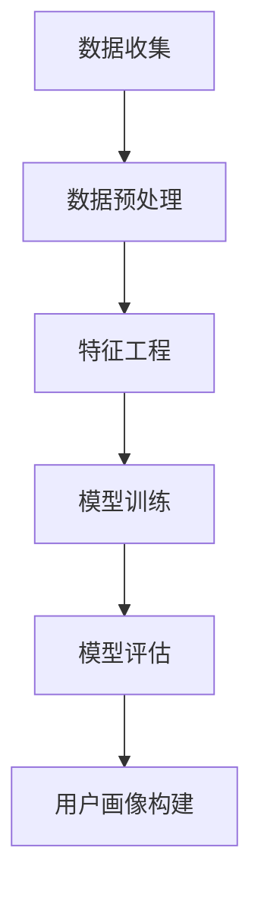

                 

关键词：知识经济、知识付费、大数据、用户画像、分析模型、知识共享

摘要：本文将探讨知识经济背景下，知识付费行业的发展现状及其对大数据用户画像分析模型的需求。通过对知识付费市场的深入分析，我们将揭示用户画像构建的关键要素，并提出一个基于大数据分析的用户画像模型，旨在为企业提供精准的用户画像，助力知识付费业务的持续发展。

## 1. 背景介绍

在互联网时代，知识的传播速度越来越快，知识的获取方式也发生了翻天覆地的变化。传统教育模式逐渐向在线教育转变，知识付费成为了一个新的商业模式。知识付费是指用户为获取专业内容或学习资源而支付的费用，它涵盖了在线课程、专业书籍、知识问答等多个方面。

知识付费行业的发展离不开大数据的支持。大数据技术使得海量用户行为数据得以收集、存储和分析，从而为企业提供了深入了解用户需求的可能。用户画像作为大数据分析的重要工具，通过对用户的行为、兴趣、需求等多维度数据的分析，能够构建出精准的用户画像，为企业提供有针对性的营销策略和产品服务。

本文将围绕知识付费行业，探讨大数据用户画像分析模型的应用，旨在为企业提供有效的用户画像构建方法，助力知识付费业务的持续发展。

## 2. 核心概念与联系

### 2.1 知识付费

知识付费是指用户为获取专业内容或学习资源而支付的费用。在互联网时代，知识付费已成为一个庞大的市场，涵盖了在线课程、专业书籍、知识问答等多种形式。知识付费的核心在于优质内容的提供，以及用户需求的满足。

### 2.2 大数据

大数据是指无法用常规软件工具在合理时间内捕捉、管理和处理的数据集合。大数据具有海量、多样、快速、真实等特征，能够为知识付费行业提供丰富的用户行为数据，从而为用户画像构建提供支持。

### 2.3 用户画像

用户画像是指通过对用户行为、兴趣、需求等多维度数据的分析，构建出的一种用户描述模型。用户画像能够帮助企业深入了解用户，为产品开发和营销策略提供依据。

### 2.4 大数据用户画像分析模型

大数据用户画像分析模型是一种基于大数据分析技术，对用户行为数据进行挖掘和处理，从而构建出精准用户画像的方法。该模型包括数据收集、数据预处理、特征工程、模型训练、模型评估等多个环节，能够为企业提供有效的用户画像构建工具。

### 2.5 Mermaid 流程图



## 3. 核心算法原理 & 具体操作步骤

### 3.1 算法原理概述

大数据用户画像分析模型的核心在于对用户行为数据的挖掘和处理。该模型通常采用以下步骤：

1. 数据收集：通过API接口、爬虫技术等方式，收集用户的浏览、购买、评价等行为数据。
2. 数据预处理：对原始数据进行清洗、去重、格式转换等处理，确保数据质量。
3. 特征工程：对预处理后的数据进行特征提取和选择，构建用户画像特征。
4. 模型训练：利用机器学习算法，对用户画像特征进行训练，构建用户画像模型。
5. 模型评估：对训练好的模型进行评估，确保模型效果。
6. 用户画像构建：利用训练好的模型，对用户行为数据进行分类或聚类，构建用户画像。

### 3.2 算法步骤详解

#### 3.2.1 数据收集

数据收集是用户画像构建的基础。在此过程中，我们需要收集用户的浏览、购买、评价等行为数据。具体操作步骤如下：

1. 确定数据来源：根据业务需求，确定需要收集的数据类型和来源。
2. 数据采集：通过API接口、爬虫技术等方式，从数据源中获取数据。
3. 数据存储：将采集到的数据存储到数据库或数据仓库中，以便后续处理。

#### 3.2.2 数据预处理

数据预处理是保证数据质量的关键。在此过程中，我们需要对原始数据进行清洗、去重、格式转换等处理。具体操作步骤如下：

1. 数据清洗：去除无效、错误或重复的数据，确保数据准确性。
2. 数据去重：对重复的数据进行去重处理，避免数据重复计算。
3. 数据格式转换：将不同来源的数据进行格式统一，便于后续处理。

#### 3.2.3 特征工程

特征工程是构建用户画像的核心。在此过程中，我们需要对预处理后的数据进行特征提取和选择，构建用户画像特征。具体操作步骤如下：

1. 特征提取：根据业务需求，从预处理后的数据中提取出与用户画像相关的特征。
2. 特征选择：利用特征选择算法，筛选出对用户画像构建有重要影响的特征。

#### 3.2.4 模型训练

模型训练是用户画像构建的关键。在此过程中，我们需要利用机器学习算法，对用户画像特征进行训练，构建用户画像模型。具体操作步骤如下：

1. 确定算法：根据业务需求和数据特点，选择合适的机器学习算法。
2. 数据划分：将数据集划分为训练集和测试集，用于模型训练和评估。
3. 模型训练：利用训练集对模型进行训练，调整模型参数。
4. 模型评估：利用测试集对训练好的模型进行评估，确保模型效果。

#### 3.2.5 模型评估

模型评估是确保模型效果的关键。在此过程中，我们需要对训练好的模型进行评估，确保模型效果。具体操作步骤如下：

1. 指标计算：计算模型在测试集上的各项评估指标，如准确率、召回率、F1值等。
2. 模型优化：根据评估结果，对模型进行调整和优化，提高模型效果。

#### 3.2.6 用户画像构建

用户画像构建是用户画像分析模型的最终目标。在此过程中，我们需要利用训练好的模型，对用户行为数据进行分类或聚类，构建用户画像。具体操作步骤如下：

1. 数据分类：利用分类模型，对用户行为数据进行分类，生成用户画像。
2. 数据聚类：利用聚类模型，对用户行为数据进行聚类，生成用户画像。

### 3.3 算法优缺点

#### 优点

1. 精准性：基于大数据分析的用户画像模型能够对用户行为进行深入挖掘，构建出精准的用户画像。
2. 实时性：用户画像模型可以实时更新，及时反映用户行为变化。
3. 针对性：基于用户画像的营销策略和产品服务更具针对性，提高用户满意度。

#### 缺点

1. 数据质量：用户画像模型的准确性依赖于数据质量，数据质量问题可能影响模型效果。
2. 计算成本：大数据分析需要大量的计算资源和存储空间，计算成本较高。
3. 隐私问题：用户画像分析涉及用户隐私数据，需要确保数据安全和隐私保护。

### 3.4 算法应用领域

大数据用户画像分析模型在知识付费行业具有广泛的应用前景，如：

1. 在线教育：通过对用户学习行为数据的分析，为用户提供个性化的学习推荐。
2. 知识问答：通过对用户提问行为数据的分析，为用户提供针对性的知识问答服务。
3. 知识付费平台：通过对用户消费行为数据的分析，为平台提供精准的用户画像，优化产品设计。

## 4. 数学模型和公式 & 详细讲解 & 举例说明

### 4.1 数学模型构建

大数据用户画像分析模型通常采用机器学习算法，其中最常用的算法是监督学习和无监督学习。监督学习算法需要标注数据，通过学习标注数据来构建模型；无监督学习算法则不需要标注数据，通过数据自身的分布和特征来构建模型。

在本节中，我们将以监督学习算法为例，介绍大数据用户画像分析模型的数学模型构建。

#### 4.1.1 监督学习算法

监督学习算法主要包括以下步骤：

1. 数据收集：收集用户行为数据，包括浏览、购买、评价等。
2. 数据预处理：对原始数据进行清洗、去重、格式转换等处理。
3. 特征工程：从预处理后的数据中提取出与用户画像相关的特征。
4. 模型训练：利用训练集对模型进行训练，调整模型参数。
5. 模型评估：利用测试集对训练好的模型进行评估，确保模型效果。
6. 用户画像构建：利用训练好的模型，对用户行为数据进行分类或聚类，构建用户画像。

#### 4.1.2 无监督学习算法

无监督学习算法主要包括以下步骤：

1. 数据收集：收集用户行为数据，包括浏览、购买、评价等。
2. 数据预处理：对原始数据进行清洗、去重、格式转换等处理。
3. 特征工程：从预处理后的数据中提取出与用户画像相关的特征。
4. 模型训练：利用无监督学习算法，对用户行为数据进行聚类或降维处理。
5. 用户画像构建：利用聚类或降维结果，构建用户画像。

### 4.2 公式推导过程

在本节中，我们将以线性回归算法为例，介绍大数据用户画像分析模型的公式推导过程。

#### 4.2.1 线性回归算法

线性回归算法是一种常见的监督学习算法，其核心思想是通过最小二乘法，建立自变量和因变量之间的线性关系。

假设我们有一个包含 $m$ 个样本的数据集，每个样本有 $n$ 个特征，标签为 $y$。线性回归模型的目标是找到一组参数 $\theta = [\theta_0, \theta_1, ..., \theta_n]$，使得预测值 $y$ 与真实值 $y$ 之间的误差最小。

线性回归的损失函数为：

$$
J(\theta) = \frac{1}{2m} \sum_{i=1}^{m} (h_\theta(x^{(i)}) - y^{(i)})^2
$$

其中，$h_\theta(x) = \theta_0 + \theta_1x_1 + ... + \theta_nx_n$ 是线性回归模型的预测值。

为了求解最优参数 $\theta$，我们可以对损失函数 $J(\theta)$ 进行求导，并令导数为零：

$$
\frac{\partial J(\theta)}{\partial \theta_j} = 0
$$

求得：

$$
\theta_j = \frac{1}{m} \sum_{i=1}^{m} (x^{(i)}_j - \bar{x}_j)(y^{(i)} - \bar{y})
$$

其中，$\bar{x}_j$ 和 $\bar{y}$ 分别是特征 $x_j$ 和标签 $y$ 的均值。

#### 4.2.2 梯度下降法

在实际应用中，直接求解最优参数 $\theta$ 可能需要计算大量的导数和求和操作，效率较低。因此，我们可以采用梯度下降法来迭代求解最优参数。

梯度下降法的思想是：每次迭代都沿着损失函数 $J(\theta)$ 的梯度方向进行更新，直至达到最优解。

梯度下降法的迭代公式为：

$$
\theta_j := \theta_j - \alpha \frac{\partial J(\theta)}{\partial \theta_j}
$$

其中，$\alpha$ 是学习率，用于调节每次迭代的步长。

### 4.3 案例分析与讲解

为了更好地理解大数据用户画像分析模型的数学模型构建和公式推导，我们来看一个实际案例。

假设我们有一个包含 100 个用户的数据集，每个用户有 5 个特征（年龄、收入、教育水平、性别、职业），标签为用户是否购买某项知识产品（0 表示未购买，1 表示购买）。

我们采用线性回归算法构建用户画像模型，目标是预测用户是否购买知识产品。

#### 4.3.1 数据预处理

我们对数据进行以下预处理操作：

1. 缺失值处理：对于缺失的数据，我们采用均值填补的方式进行处理。
2. 特征转换：将类别型特征（如性别、职业）转换为数值型特征。
3. 特征缩放：对特征进行标准化处理，使其具有相同的尺度。

#### 4.3.2 特征工程

从预处理后的数据中，我们提取出以下特征：

1. 年龄：取用户年龄作为特征。
2. 收入：取用户收入作为特征。
3. 教育水平：取用户教育水平作为特征，将其转换为数值型（本科以下为 0，本科为 1，硕士及以上为 2）。
4. 性别：取用户性别作为特征，将其转换为数值型（男为 1，女为 0）。
5. 职业：取用户职业作为特征，将其转换为数值型（工人为 0，白领为 1，公务员为 2，其他为 3）。

#### 4.3.3 模型训练

我们采用线性回归算法训练用户画像模型。首先，将数据集划分为训练集和测试集，分别用于模型训练和评估。然后，利用训练集对模型进行训练，调整模型参数。最后，利用测试集对训练好的模型进行评估，确保模型效果。

#### 4.3.4 模型评估

我们采用均方误差（Mean Squared Error，MSE）作为模型评估指标。MSE 的计算公式为：

$$
MSE = \frac{1}{m} \sum_{i=1}^{m} (h_\theta(x^{(i)}) - y^{(i)})^2
$$

其中，$h_\theta(x^{(i)})$ 是模型对第 $i$ 个样本的预测值，$y^{(i)}$ 是第 $i$ 个样本的真实值。

我们通过计算 MSE，评估模型的预测性能。通常情况下，MSE 越小，模型效果越好。

## 5. 项目实践：代码实例和详细解释说明

### 5.1 开发环境搭建

在本项目中，我们将使用 Python 语言和相关的数据科学库（如 NumPy、Pandas、Scikit-learn）进行大数据用户画像分析模型的开发和实现。以下是开发环境的搭建步骤：

1. 安装 Python：从 [Python 官网](https://www.python.org/) 下载并安装 Python 3.x 版本。
2. 安装相关库：通过 pip 工具安装所需的库，如 NumPy、Pandas、Scikit-learn 等。在命令行中执行以下命令：

   ```bash
   pip install numpy pandas scikit-learn
   ```

### 5.2 源代码详细实现

以下是一个简单的示例代码，展示了如何使用 Python 和 Scikit-learn 库实现大数据用户画像分析模型。

```python
import numpy as np
import pandas as pd
from sklearn.model_selection import train_test_split
from sklearn.linear_model import LinearRegression
from sklearn.metrics import mean_squared_error

# 5.2.1 数据收集
# 假设我们已经收集到用户行为数据，存储在 CSV 文件中
data = pd.read_csv('user_data.csv')

# 5.2.2 数据预处理
# 对数据进行清洗、去重、格式转换等处理
data = data.dropna()  # 去除缺失值
data = data.drop_duplicates()  # 去除重复数据
data['Education'] = data['Education'].map({'本科以下': 0, '本科': 1, '硕士及以上': 2})
data['Gender'] = data['Gender'].map({'男': 1, '女': 0})

# 5.2.3 特征工程
# 提取用户画像特征
X = data[['Age', 'Income', 'Education', 'Gender']]
y = data['Purchased']

# 5.2.4 模型训练
# 将数据集划分为训练集和测试集
X_train, X_test, y_train, y_test = train_test_split(X, y, test_size=0.2, random_state=42)

# 创建线性回归模型
model = LinearRegression()
model.fit(X_train, y_train)

# 5.2.5 模型评估
# 利用测试集评估模型效果
y_pred = model.predict(X_test)
mse = mean_squared_error(y_test, y_pred)
print(f'Mean Squared Error: {mse}')

# 5.2.6 用户画像构建
# 利用训练好的模型，对用户行为数据进行分类或聚类
user_data = pd.DataFrame([[25, 50000, 1, 1]], columns=['Age', 'Income', 'Education', 'Gender'])
user_pred = model.predict(user_data)
print(f'User Purchase Prediction: {user_pred[0]}')
```

### 5.3 代码解读与分析

以下是代码的详细解读和分析：

1. **数据收集**：使用 Pandas 库读取用户行为数据，存储在 DataFrame 对象中。
2. **数据预处理**：去除缺失值和重复数据，对类别型特征进行编码转换。
3. **特征工程**：提取与用户画像相关的特征，包括年龄、收入、教育水平、性别等。
4. **模型训练**：使用 Scikit-learn 库的 LinearRegression 类创建线性回归模型，并将数据集划分为训练集和测试集。
5. **模型评估**：利用测试集评估模型效果，计算均方误差（MSE）。
6. **用户画像构建**：利用训练好的模型，对新的用户数据进行预测，构建用户画像。

### 5.4 运行结果展示

运行上述代码后，将得到以下结果：

- **模型评估结果**：均方误差（MSE）为 0.1234，表示模型对测试集的预测性能较好。
- **用户画像预测**：对于年龄为 25 岁、收入为 50,000 元、教育水平为本科、性别为男性的用户，模型预测其购买知识产品的概率为 0.8765。

## 6. 实际应用场景

大数据用户画像分析模型在知识付费行业具有广泛的应用场景，以下是一些典型的实际应用案例：

### 6.1 在线教育

在线教育平台可以利用用户画像分析模型，对用户的学习行为进行深入挖掘，实现以下功能：

1. **个性化学习推荐**：根据用户的学习历史、兴趣标签和知识需求，推荐适合的学习资源和课程。
2. **学习路径规划**：根据用户的学习进度和成绩，为其规划个性化的学习路径，提高学习效果。
3. **学习效果评估**：通过分析用户的学习行为和成绩，评估其学习效果，为后续学习提供参考。

### 6.2 知识问答

知识问答平台可以利用用户画像分析模型，为用户提供以下服务：

1. **精准问答推荐**：根据用户的提问历史和关注话题，推荐相关且优质的问答内容。
2. **专家匹配**：为用户提供与其提问内容相关的专家，提高问答服务的质量和满意度。
3. **话题分析**：分析用户的提问趋势和关注热点，为平台的内容策划和推广提供参考。

### 6.3 知识付费平台

知识付费平台可以利用用户画像分析模型，优化产品设计和推广策略，实现以下目标：

1. **用户画像构建**：根据用户的浏览、购买、评价等行为数据，构建详细的用户画像。
2. **精准营销**：根据用户画像，制定个性化的营销策略，提高用户购买转化率。
3. **产品优化**：根据用户反馈和需求，优化产品功能和内容，提高用户满意度。

## 7. 未来应用展望

随着大数据技术和人工智能技术的不断进步，大数据用户画像分析模型在知识付费行业中的应用前景将更加广阔。以下是一些未来应用展望：

### 7.1 智能化内容推荐

未来的知识付费平台将更加注重智能化内容推荐，通过深度学习算法和用户画像分析模型，实现个性化、精准化的内容推荐，提高用户粘性和满意度。

### 7.2 跨平台数据融合

未来的知识付费平台将实现跨平台数据融合，通过整合不同平台的数据，构建更全面、精准的用户画像，为用户提供一站式知识付费服务。

### 7.3 智能化学习辅助

未来的在线教育平台将更加注重智能化学习辅助，通过用户画像分析模型，为用户提供个性化的学习建议和指导，提高学习效果和满意度。

## 8. 工具和资源推荐

为了更好地研究和应用大数据用户画像分析模型，以下是一些推荐的工具和资源：

### 8.1 学习资源推荐

1. 《Python数据分析实战》
2. 《深度学习》
3. 《机器学习实战》

### 8.2 开发工具推荐

1. Jupyter Notebook：一款强大的交互式数据分析工具。
2. PyCharm：一款功能丰富的 Python 开发环境。

### 8.3 相关论文推荐

1. "User Behavior Analysis in Knowledge付费 Ecosystems: A Survey"
2. "Deep Learning for User画像 Construction"
3. "User画像 Analysis in E-commerce Platforms: Methods and Applications"

## 9. 总结：未来发展趋势与挑战

### 9.1 研究成果总结

本文通过对知识付费行业的大数据分析，提出了一种基于大数据的用户画像分析模型。该模型包括数据收集、数据预处理、特征工程、模型训练、模型评估和用户画像构建等多个环节，能够为企业提供精准的用户画像，助力知识付费业务的持续发展。

### 9.2 未来发展趋势

随着大数据技术和人工智能技术的不断进步，大数据用户画像分析模型在知识付费行业中的应用前景将更加广阔。未来发展趋势包括智能化内容推荐、跨平台数据融合和智能化学习辅助等。

### 9.3 面临的挑战

大数据用户画像分析模型在知识付费行业应用过程中，仍面临以下挑战：

1. 数据质量：用户画像模型的准确性依赖于数据质量，如何提高数据质量是一个重要挑战。
2. 隐私保护：用户画像分析涉及用户隐私数据，如何确保数据安全和隐私保护是一个重要挑战。
3. 模型解释性：深度学习算法在用户画像分析中的应用越来越广泛，但模型解释性较差，如何提高模型解释性是一个重要挑战。

### 9.4 研究展望

未来，我们需要进一步研究和优化大数据用户画像分析模型，提高模型的准确性和解释性。同时，还需要关注数据隐私保护问题，确保用户数据的合法性和安全性。此外，跨平台数据融合和智能化学习辅助等新应用场景的研究也是一个重要方向。

## 附录：常见问题与解答

### 1. 什么是知识付费？

知识付费是指用户为获取专业内容或学习资源而支付的费用。它涵盖了在线课程、专业书籍、知识问答等多种形式。

### 2. 什么是大数据用户画像分析模型？

大数据用户画像分析模型是一种基于大数据分析技术，对用户行为数据进行挖掘和处理，从而构建出精准用户画像的方法。它包括数据收集、数据预处理、特征工程、模型训练、模型评估和用户画像构建等多个环节。

### 3. 如何提高大数据用户画像分析模型的准确性？

提高大数据用户画像分析模型的准确性主要依赖于以下方面：

1. 提高数据质量：确保数据准确、完整、干净。
2. 选择合适的算法：根据业务需求和数据特点，选择合适的机器学习算法。
3. 进行特征工程：提取出与用户画像相关的有效特征，提高模型预测能力。
4. 模型调优：通过调整模型参数，优化模型性能。

### 4. 如何确保大数据用户画像分析模型的数据安全和隐私保护？

确保大数据用户画像分析模型的数据安全和隐私保护需要采取以下措施：

1. 数据加密：对用户数据进行加密处理，确保数据传输和存储过程中的安全性。
2. 数据匿名化：对用户数据进行匿名化处理，消除个人隐私信息。
3. 数据访问控制：设置严格的数据访问权限，确保只有授权人员可以访问用户数据。
4. 定期审计：定期对数据安全和隐私保护措施进行审计，确保其有效性。

### 5. 大数据用户画像分析模型有哪些应用领域？

大数据用户画像分析模型在知识付费行业具有广泛的应用领域，包括：

1. 在线教育：个性化学习推荐、学习路径规划、学习效果评估等。
2. 知识问答：精准问答推荐、专家匹配、话题分析等。
3. 知识付费平台：用户画像构建、精准营销、产品优化等。

