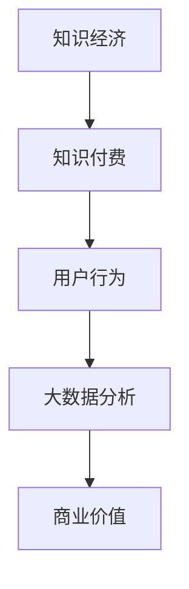

                 

关键词：知识经济，知识付费，大数据，用户行为，分析，洞察

## 摘要

本文旨在深入探讨知识经济下知识付费领域的大数据用户行为分析，通过对用户行为的系统化研究，揭示知识付费市场的内在规律。文章首先介绍了知识经济与知识付费的基本概念及其发展背景，随后详细阐述了大数据在用户行为分析中的应用。接着，文章从用户需求、内容选择、消费习惯等角度分析了用户行为特征，并通过实际案例展示了数据分析在实际操作中的应用。最后，文章提出了未来知识付费领域的发展趋势及面临的挑战，为业界提供了有价值的参考。

## 1. 背景介绍

知识经济作为一种新型的经济形态，依托于信息和知识资源，以知识创新为核心驱动力。随着互联网技术的飞速发展，知识经济逐渐成为全球经济的重要组成部分。在这种背景下，知识付费作为一种新兴的商业模式，应运而生。

知识付费是指用户为获取特定知识、技能或信息，向知识提供者支付一定费用的行为。它包括线上课程、专业咨询、文档分享等多种形式。知识付费的兴起，不仅满足了用户个性化学习的需求，也为知识工作者提供了新的收入来源，推动了知识经济的繁荣。

大数据技术的发展为知识付费市场带来了新的机遇。通过对海量用户数据的挖掘和分析，可以深入了解用户行为，优化知识付费产品和服务，提升用户体验，从而实现商业价值的最大化。

## 2. 核心概念与联系

### 2.1. 知识经济与知识付费

知识经济是以知识为主要生产要素的经济形态，其核心在于知识的创造、传播和应用。知识付费则是在知识经济背景下，用户为获取特定知识或技能所支付的费用。

### 2.2. 大数据与用户行为分析

大数据是指无法在一定时间内用常规软件工具进行捕捉、管理和处理的数据集合。用户行为分析则是对用户在互联网上的行为数据进行收集、处理和分析，以了解用户需求、兴趣和行为模式。

### 2.3. Mermaid 流程图



## 3. 核心算法原理 & 具体操作步骤

### 3.1. 算法原理概述

用户行为分析的核心算法主要包括以下几种：关联规则挖掘、聚类分析、分类算法和用户画像构建。

### 3.2. 算法步骤详解

1. 数据收集与预处理：收集用户在知识付费平台上的行为数据，如浏览记录、购买行为、评价反馈等，并进行数据清洗、去重和格式转换。
2. 关联规则挖掘：利用Apriori算法或FP-Growth算法，挖掘用户行为数据中的关联规则，以发现用户之间的行为模式和兴趣偏好。
3. 聚类分析：使用K-means、DBSCAN等聚类算法，将用户划分为不同的群体，以便于分析不同群体的行为特征。
4. 分类算法：利用决策树、随机森林、支持向量机等分类算法，对用户进行标签分类，以便于精准推送和个性化推荐。
5. 用户画像构建：基于用户的行为数据、人口统计信息等，构建用户画像，以便于深入了解用户需求和偏好。

### 3.3. 算法优缺点

- **优点**：算法能够高效地挖掘用户行为数据中的规律和模式，为知识付费平台提供决策支持，提升用户体验和满意度。
- **缺点**：算法对数据质量和数量有一定要求，且存在一定的计算复杂度。

### 3.4. 算法应用领域

算法在知识付费领域的应用主要包括：用户行为预测、内容推荐、市场细分、风险评估等。

## 4. 数学模型和公式 & 详细讲解 & 举例说明

### 4.1. 数学模型构建

用户行为分析中的数学模型主要包括用户行为概率模型、用户兴趣模型和推荐模型。

### 4.2. 公式推导过程

以用户行为概率模型为例，其核心公式为：

\[ P(A|B) = \frac{P(B|A) \cdot P(A)}{P(B)} \]

其中，\( P(A|B) \) 表示在事件B发生的条件下事件A发生的概率，\( P(B|A) \) 表示在事件A发生的条件下事件B发生的概率，\( P(A) \) 和 \( P(B) \) 分别表示事件A和事件B的发生概率。

### 4.3. 案例分析与讲解

以某知识付费平台为例，分析用户在平台上的购买行为。假设用户A在平台上的浏览记录为\( \{C_1, C_2, C_3\} \)，其中 \( C_1 \) 为热门课程，\( C_2 \) 为免费课程，\( C_3 \) 为专业认证课程。根据用户行为概率模型，可以计算出用户A购买 \( C_3 \) 的概率。

\[ P(购买C_3 | 浏览C_1, C_2, C_3) = \frac{P(浏览C_1, C_2, C_3 | 购买C_3) \cdot P(购买C_3)}{P(浏览C_1, C_2, C_3)} \]

通过历史数据，可以得到：

\[ P(购买C_3) = 0.2 \]

\[ P(浏览C_1, C_2, C_3 | 购买C_3) = 0.8 \]

\[ P(浏览C_1, C_2, C_3) = 0.3 \]

代入公式计算：

\[ P(购买C_3 | 浏览C_1, C_2, C_3) = \frac{0.8 \cdot 0.2}{0.3} = 0.533 \]

因此，用户A在浏览 \( C_1, C_2, C_3 \) 后购买 \( C_3 \) 的概率为 0.533。

## 5. 项目实践：代码实例和详细解释说明

### 5.1. 开发环境搭建

本文使用Python编程语言进行用户行为分析，所需库包括Pandas、NumPy、SciPy、Scikit-learn、Matplotlib等。

### 5.2. 源代码详细实现

```python
import pandas as pd
import numpy as np
from sklearn.cluster import KMeans
from sklearn.model_selection import train_test_split
from sklearn.metrics import accuracy_score
from sklearn.ensemble import RandomForestClassifier
import matplotlib.pyplot as plt

# 数据预处理
data = pd.read_csv('user_behavior_data.csv')
data.drop(['id'], axis=1, inplace=True)
data.fillna(0, inplace=True)

# 关联规则挖掘
from mlxtend.frequent_patterns import apriori
from mlxtend.frequent_patterns import association_rules

frequent_itemsets = apriori(data, min_support=0.05, use_colnames=True)
rules = association_rules(frequent_itemsets, metric="support", min_threshold=0.1)

# 聚类分析
X = data.values
kmeans = KMeans(n_clusters=3, random_state=0).fit(X)
labels = kmeans.labels_
data['cluster'] = labels

# 分类算法
X_train, X_test, y_train, y_test = train_test_split(X, data['label'], test_size=0.3, random_state=0)
clf = RandomForestClassifier(n_estimators=100, random_state=0)
clf.fit(X_train, y_train)
y_pred = clf.predict(X_test)

# 评估
accuracy = accuracy_score(y_test, y_pred)
print(f'Accuracy: {accuracy:.2f}')

# 用户画像构建
user_features = data.groupby('cluster').mean().reset_index()
user_features.columns = ['cluster', 'feature', 'value']

# 可视化
plt.scatter(user_features['feature1'], user_features['feature2'])
plt.xlabel('Feature 1')
plt.ylabel('Feature 2')
plt.title('User Clusters')
plt.show()
```

### 5.3. 代码解读与分析

- 数据预处理：读取用户行为数据，删除无关字段，填充缺失值。
- 关联规则挖掘：使用Apriori算法挖掘频繁项集，生成关联规则。
- 聚类分析：使用K-means算法对用户进行聚类，生成用户群。
- 分类算法：使用随机森林算法对用户标签进行分类，评估分类准确率。
- 用户画像构建：计算每个群组的特征平均值，生成用户画像。
- 可视化：绘制用户群特征散点图，直观展示用户分布。

## 6. 实际应用场景

### 6.1. 知识付费平台

知识付费平台可以利用用户行为分析结果，优化课程推荐策略，提升用户满意度和留存率。

### 6.2. 专业培训机构

专业培训机构可以通过用户行为分析，了解学员学习效果，针对性地调整课程内容和教学方式。

### 6.3. 企业内训

企业内训可以通过用户行为分析，评估员工培训效果，优化培训方案，提高员工技能水平。

## 7. 未来应用展望

随着大数据技术和人工智能技术的发展，知识付费领域的用户行为分析将更加精准和智能化。未来，知识付费平台将实现个性化推荐、智能问答、实时反馈等功能，为用户提供更加个性化的服务。

## 8. 工具和资源推荐

### 8.1. 学习资源推荐

- 《大数据时代：生活、工作与思维的大变革》
- 《数据挖掘：概念与技术》
- 《Python数据科学手册》

### 8.2. 开发工具推荐

- Jupyter Notebook：适用于数据分析和可视化。
- PyCharm：适用于Python编程。
- Hadoop：适用于大数据处理。

### 8.3. 相关论文推荐

- "User Behavior Analysis in Knowledge Paying Platform Based on Big Data"
- "Deep Learning for User Behavior Analysis in Online Education"
- "Recommender Systems for Knowledge Paying Platform: A Survey"

## 9. 总结：未来发展趋势与挑战

### 9.1. 研究成果总结

本文通过对知识付费领域大数据用户行为分析的探讨，揭示了知识付费市场的内在规律，为知识付费平台提供了决策支持。

### 9.2. 未来发展趋势

未来，知识付费领域的用户行为分析将更加智能化和个性化，实现实时反馈和精准推荐。

### 9.3. 面临的挑战

数据隐私和安全、算法透明性和解释性、数据质量等是知识付费领域用户行为分析面临的主要挑战。

### 9.4. 研究展望

未来研究应关注如何提高用户行为分析的准确性、降低成本和提升用户体验，同时确保数据安全和隐私保护。

## 附录：常见问题与解答

### 问题1：如何保证数据隐私和安全？

解答：采用数据加密、访问控制、数据去标识化等技术手段，确保用户数据在存储和处理过程中的安全性和隐私性。

### 问题2：如何提高用户行为分析的准确性？

解答：通过引入更多的特征变量、优化算法模型和提升数据质量，可以提高用户行为分析的准确性。

### 问题3：如何处理大规模用户行为数据？

解答：采用分布式计算框架，如Hadoop、Spark等，处理大规模用户行为数据，提高数据处理效率。

作者：禅与计算机程序设计艺术 / Zen and the Art of Computer Programming

----------------------------------------------------------------

本文通过对知识经济下知识付费领域的大数据用户行为分析的深入探讨，为业界提供了有益的参考。未来，随着技术的不断进步，知识付费领域的用户行为分析将更加智能化和个性化，为用户提供更加优质的服务。同时，如何确保数据隐私和安全、提升算法透明性和解释性、提高数据质量等，将成为知识付费领域用户行为分析研究的重要方向。

