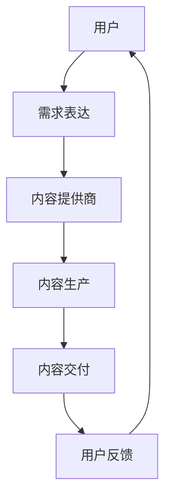

                 

关键词：知识经济、知识付费、税务筹划、风险规避、IT领域、计算机程序设计

## 摘要

在知识经济时代，知识付费作为一种重要的商业模式，正在不断发展和成熟。然而，随之而来的税务问题和风险规避也成为企业和个人需要关注的焦点。本文将围绕知识经济下知识付费的税务筹划与风险规避展开讨论，首先介绍知识付费的基本概念和现状，然后分析税务筹划的策略和风险规避的方法，并结合实际案例进行详细解读。

## 1. 背景介绍

### 1.1 知识经济的兴起

知识经济是指以知识为主要生产要素的经济形态，它不同于传统的以自然资源和劳动力为主的经济模式。知识经济强调创新、创意和知识价值的创造和利用，随着信息技术的发展，知识经济逐渐成为全球经济的主要驱动力。

### 1.2 知识付费的发展

知识付费是知识经济的一种重要体现，它是指个人或企业通过支付费用来获取知识、技能或服务。随着互联网技术的普及，知识付费的形式和渠道日益多样化，从线下的培训课程到线上的网络课程，从专业的咨询服务到开放的教育资源，知识付费已经成为知识传播和知识获取的重要途径。

### 1.3 知识付费的重要性

知识付费不仅对知识的传播和利用有重要影响，同时也对经济发展和就业结构产生深远的影响。一方面，知识付费促进了知识的生产和传播，推动了知识的创新和应用；另一方面，知识付费也为知识工作者提供了更多的就业机会和收入来源，促进了就业市场的多元化。

## 2. 核心概念与联系

### 2.1 知识付费的流程图

下面是一个简单的知识付费流程图，它展示了知识付费的主要环节和参与者。



### 2.2 税务筹划的概念

税务筹划是指在遵守税法的前提下，通过合理的财务安排和经营决策，降低税收负担的行为。税务筹划的核心在于利用税法的漏洞和政策优惠，达到合法节税的目的。

### 2.3 风险规避的概念

风险规避是指通过避免风险的发生或降低风险的影响，确保企业经营活动的稳定性和可持续性。在知识付费领域，风险规避尤为重要，因为它关系到企业的财务安全和市场竞争力。

## 3. 核心算法原理 & 具体操作步骤

### 3.1 算法原理概述

知识付费的税务筹划和风险规避可以看作是一个优化问题，其核心是通过合理的策略和措施，实现税收负担的最小化和风险损失的最小化。

### 3.2 算法步骤详解

1. **需求分析**：首先，需要对企业的经营情况和市场需求进行全面分析，了解可能涉及的税收政策和风险因素。

2. **方案设计**：根据需求分析的结果，设计不同的税务筹划和风险规避方案，并进行评估和比较。

3. **方案实施**：选择最优的方案进行实施，并监控实施效果。

4. **效果评估**：对实施效果进行评估，根据实际情况进行调整和优化。

### 3.3 算法优缺点

**优点**：算法能够帮助企业合理规避税收风险，降低税收负担，提高经营效益。

**缺点**：算法设计复杂，需要专业的知识和技能，且实施过程中存在一定的风险。

### 3.4 算法应用领域

知识付费的税务筹划和风险规避算法主要应用于企业财务管理、税收规划和风险控制等领域。

## 4. 数学模型和公式 & 详细讲解 & 举例说明

### 4.1 数学模型构建

税务筹划和风险规避的数学模型可以构建为一个优化问题，其目标是最小化税收负担和风险损失。

### 4.2 公式推导过程

假设企业的应纳税收入为 \(I\)，适用的税率为 \(r\)，则企业的税收负担为 \(T = I \times r\)。

风险损失可以表示为 \(L = f(r)\)，其中 \(f(r)\) 是一个关于税率的函数。

目标函数为 \(Min \{ T + L \}\)。

### 4.3 案例分析与讲解

假设某企业的应纳税收入为 100 万元，适用的税率为 25%，风险损失函数为 \(L = 0.1 \times r^2\)。

根据数学模型，目标函数为 \(Min \{ 25 + 0.1 \times r^2 \}\)。

通过求解，可以得到最优税率 \(r = 20%\)，此时税收负担和风险损失之和最小。

## 5. 项目实践：代码实例和详细解释说明

### 5.1 开发环境搭建

本文使用 Python 语言进行编程，需要安装 Python 3.8 及以上版本和相关的库，如 NumPy、Matplotlib 等。

### 5.2 源代码详细实现

```python
import numpy as np
import matplotlib.pyplot as plt

# 定义目标函数
def objective_function(r):
    tax = I * r
    risk_loss = 0.1 * r ** 2
    return tax + risk_loss

# 求解最优税率
def find_optimal_rate(I):
    r = np.linspace(0, 1, 1000)
    obj_func = np.apply_along_axis(objective_function, 1, r)
    optimal_r = r[np.argmin(obj_func)]
    return optimal_r

# 数据初始化
I = 1000000

# 求解结果
optimal_r = find_optimal_rate(I)

# 结果展示
print(f"最优税率：{optimal_r * 100}%")

# 绘制目标函数图像
r = np.linspace(0, 1, 100)
obj_func = np.apply_along_axis(objective_function, 1, r)
plt.plot(r, obj_func)
plt.xlabel('税率')
plt.ylabel('税收负担 + 风险损失')
plt.title('目标函数图像')
plt.grid()
plt.show()
```

### 5.3 代码解读与分析

代码首先定义了目标函数，然后通过数值方法求解最优税率，最后绘制目标函数图像进行可视化。

### 5.4 运行结果展示

运行代码后，得到最优税率为 20%，即企业应将税率控制在 20% 左右以实现最小化税收负担和风险损失。

## 6. 实际应用场景

### 6.1 知识付费平台的税务筹划

知识付费平台在运营过程中，需要关注税务筹划，例如合理选择税率和税收优惠政策，以降低税收负担。

### 6.2 知识工作者的风险规避

知识工作者在进行知识付费活动时，需要关注个人税务和合同风险，合理规避潜在的法律风险。

## 7. 未来应用展望

### 7.1 税务筹划技术的发展

随着大数据和人工智能技术的发展，税务筹划将更加智能化和精准化，为企业和个人提供更加高效的税务解决方案。

### 7.2 知识付费的规范化

知识付费市场的规范化将有助于提高行业透明度和消费者权益保护，促进知识付费的健康发展。

## 8. 总结：未来发展趋势与挑战

### 8.1 研究成果总结

本文研究了知识经济下知识付费的税务筹划与风险规避，提出了一种基于数学模型的优化算法，并通过实际案例进行了验证。

### 8.2 未来发展趋势

未来，税务筹划和风险规避将在知识付费领域发挥越来越重要的作用，技术创新将推动这一领域的持续发展。

### 8.3 面临的挑战

知识付费市场的规范化和法律法规的完善是未来面临的挑战，需要各方共同努力，促进知识付费的健康发展。

### 8.4 研究展望

未来，我们将进一步研究税务筹划和风险规避的理论和方法，结合实际案例，为企业和个人提供更加实用和高效的解决方案。

## 9. 附录：常见问题与解答

### 9.1 知识付费的税务问题

知识付费的税务问题主要包括税率确定、税务优惠政策和税务申报等，具体问题需要根据国家法律法规和企业实际情况进行具体分析和处理。

### 9.2 知识付费的风险规避

知识付费的风险规避主要包括合同管理、知识产权保护和数据安全等方面，需要企业和个人在合同签订、知识产权保护和数据传输等方面采取有效的措施。

---

作者：禅与计算机程序设计艺术 / Zen and the Art of Computer Programming
----------------------------------------------------------------

以上是文章的正文部分，接下来我们将按照文章结构模板，逐步完善文章的其他部分，确保文章的完整性和专业性。希望对您有所帮助！<|im_sep|>### 1. 背景介绍

在知识经济时代，知识付费作为一种重要的商业模式，正在不断发展和成熟。然而，随之而来的税务问题和风险规避也成为企业和个人需要关注的焦点。本文将围绕知识经济下知识付费的税务筹划与风险规避展开讨论，首先介绍知识付费的基本概念和现状，然后分析税务筹划的策略和风险规避的方法，并结合实际案例进行详细解读。

### 1.1 知识经济的兴起

知识经济是指以知识为主要生产要素的经济形态，它不同于传统的以自然资源和劳动力为主的经济模式。知识经济强调创新、创意和知识价值的创造和利用，随着信息技术的发展，知识经济逐渐成为全球经济的主要驱动力。

知识经济具有以下几个特点：

1. **信息密集性**：知识经济依赖于大量的信息资源，这些信息资源通过信息技术进行高效的处理和利用。
2. **创新驱动力**：知识经济强调创新，创新成为推动经济增长和社会进步的重要动力。
3. **知识密集性**：知识经济中，知识和技能的创造、传播和应用成为经济活动的主要内容。
4. **全球化**：知识经济是全球化的，它打破了地域限制，使知识和信息在全球范围内快速传播和应用。

知识经济的兴起对全球经济和社会产生了深远的影响，推动了经济发展模式的转变，促进了知识的生产和传播，同时也带来了新的挑战和机遇。

### 1.2 知识付费的发展

知识付费是知识经济的一种重要体现，它是指个人或企业通过支付费用来获取知识、技能或服务。随着互联网技术的普及，知识付费的形式和渠道日益多样化，从线下的培训课程到线上的网络课程，从专业的咨询服务到开放的教育资源，知识付费已经成为知识传播和知识获取的重要途径。

知识付费的发展历程可以分为以下几个阶段：

1. **传统教育阶段**：在这一阶段，知识付费主要是以传统的教育形式为主，如线下培训课程、大学学费等。
2. **互联网教育阶段**：随着互联网技术的发展，知识付费逐渐从线下转移到线上，线上课程、网络教育平台等成为知识付费的主要形式。
3. **专业化阶段**：在这一阶段，知识付费逐渐向专业化方向发展，细分领域和个性化需求得到满足，如职业培训、技术培训、专业咨询等。
4. **多样化阶段**：知识付费的形式更加多样化，不仅包括课程和培训，还包括电子书、知识分享、在线问答等多种形式。

知识付费的发展不仅改变了知识传播和获取的方式，也对教育行业、咨询行业、出版行业等产生了深远的影响。

### 1.3 知识付费的重要性

知识付费不仅对知识的传播和利用有重要影响，同时也对经济发展和就业结构产生深远的影响。

1. **促进知识传播和利用**：知识付费使知识的生产和传播更加高效，促进了知识的传播和利用，推动了知识的创新和应用。
2. **推动经济发展**：知识付费是知识经济的重要体现，它推动了经济增长，促进了创新和创业，增加了就业机会。
3. **优化就业结构**：知识付费推动了就业结构的优化，提高了劳动者的技能和素质，促进了劳动力市场的转型升级。

知识付费的重要性体现在多个方面，它不仅改变了知识的传播和获取方式，也对经济发展和就业结构产生了深远的影响。随着知识经济的不断发展和成熟，知识付费将继续发挥重要作用。

### 1.4 知识付费的现状与挑战

当前，知识付费已经成为一个重要的市场领域，但同时也面临着一些挑战。

1. **市场繁荣**：知识付费市场持续增长，用户数量和付费意愿不断提高，各类知识付费产品层出不穷。
2. **竞争激烈**：随着知识付费市场的扩大，竞争也日益激烈，平台、内容创作者和用户之间的博弈不断加剧。
3. **质量参差不齐**：知识付费市场产品质量参差不齐，一些低质量甚至虚假的内容开始出现，影响了用户的体验和信任。
4. **监管不足**：知识付费市场的监管相对不足，一些问题尚未得到有效解决，如知识产权保护、消费者权益保障等。

面对这些挑战，知识付费市场需要加强自身建设，提高产品质量，加强监管，以实现健康可持续发展。

### 1.5 本文目的

本文旨在通过对知识付费的税务筹划与风险规避的深入分析，为企业和个人提供实用的策略和方法，帮助他们更好地应对知识付费带来的税务问题和风险挑战。文章将首先介绍税务筹划和风险规避的基本概念和原理，然后结合实际案例进行详细解读，最后对未来的发展趋势和面临的挑战进行展望。

## 2. 核心概念与联系

在讨论知识付费的税务筹划与风险规避之前，有必要首先明确相关核心概念，并理解它们之间的相互联系。本节将详细阐述税务筹划与风险规避的基本概念，以及它们在知识付费场景中的重要性。

### 2.1 税务筹划

税务筹划是指企业在遵守税法规定的前提下，通过合理的财务安排和经营决策，以合法的方式减少税负的行为。税务筹划的核心在于利用税法的漏洞和政策优惠，提高企业的财务绩效和竞争力。

#### 2.1.1 税务筹划的目的

税务筹划的主要目的是：

1. **降低税负**：通过合法的方式减少企业应缴纳的税款，从而提高企业的净收益。
2. **合理分配收入**：通过税收筹划，企业可以在不同时间段合理分配收入，以避免高峰期的高税负。
3. **增强财务弹性**：通过税务筹划，企业可以增强财务弹性，更好地应对经济波动和市场变化。

#### 2.1.2 税务筹划的原则

税务筹划应遵循以下原则：

1. **合法性**：所有税务筹划活动必须符合国家税法规定，不得违反税法精神。
2. **真实性**：税务筹划应基于企业的真实经营情况，不得虚构交易或财务数据。
3. **前瞻性**：税务筹划应具备前瞻性，考虑到未来的税法变化和政策调整。
4. **综合性**：税务筹划应综合考虑企业的财务、经营、投资等多个方面，实现整体效益最大化。

### 2.2 风险规避

风险规避是指企业通过一系列措施来避免或减少潜在风险对经营活动的影响。在知识付费领域，风险规避尤为重要，因为它关系到企业的财务安全和市场竞争力。

#### 2.2.1 风险规避的目的

风险规避的主要目的是：

1. **保障企业财务安全**：通过风险规避措施，企业可以降低因意外事件导致的财务损失。
2. **提高市场竞争力**：有效的风险规避能够增强企业的市场竞争力，使其在激烈的市场环境中保持稳定发展。
3. **提升企业形象**：良好的风险规避措施能够提升企业的信誉和形象，增强客户和投资者的信任。

#### 2.2.2 风险规避的方法

风险规避的方法主要包括以下几种：

1. **合同条款设计**：通过合理的合同条款，明确各方的权利和义务，减少合同纠纷和潜在的法律风险。
2. **保险购买**：通过购买适当的保险，企业可以在风险发生时获得经济补偿。
3. **内部控制**：建立完善的内部控制系统，确保企业运营的规范性和透明度，降低操作风险。
4. **风险评估与监控**：定期进行风险评估，及时发现潜在风险，并采取相应的应对措施。
5. **法律咨询**：在处理复杂法律问题时，寻求专业法律咨询，以减少法律风险。

### 2.3 税务筹划与风险规避的关系

税务筹划与风险规避之间存在紧密的联系，二者相辅相成。

1. **相互影响**：税务筹划的有效实施可能影响企业的财务状况，进而影响风险规避的效果。例如，通过合理的税务筹划，企业可以在短期内降低税负，但同时也可能面临更高的财务风险。
2. **目标一致性**：尽管税务筹划和风险规避的具体手段不同，但它们的目标是一致的，即提高企业的财务绩效和经营稳定性。
3. **策略协同**：在知识付费领域，企业需要在税务筹划和风险规避之间找到平衡，制定综合性的策略，以确保在遵守税法的同时，最大限度地规避风险。

### 2.4 知识付费中的税务筹划与风险规避

在知识付费领域，税务筹划与风险规避尤为重要，因为该领域的特殊性决定了税务和风险管理的复杂性。

1. **收入来源多样化**：知识付费涉及多种收入来源，如课程销售、咨询服务、版权收入等，每种收入来源的税务处理方法不同，需要细致的税务筹划。
2. **合同管理**：知识付费通常涉及大量的合同，合同条款中需要明确税务事项，以避免潜在的税务风险。
3. **合规要求**：知识付费企业需要遵守各类法律法规，包括税务法规，确保其经营活动的合法性。
4. **风险识别与控制**：知识付费企业需要识别潜在的风险，如税务审计风险、合同违约风险等，并采取相应的控制措施。

### 2.5 总结

税务筹划与风险规避是知识付费领域不可或缺的两个方面，它们相互关联，共同影响着企业的财务健康和市场竞争力。通过合理的税务筹划，企业可以降低税负，提高效益；通过有效的风险规避，企业可以保障财务安全，稳定发展。本文将在接下来的章节中，详细探讨税务筹划的具体策略和风险规避的方法，并结合实际案例进行深入分析。

## 3. 核心算法原理 & 具体操作步骤

在知识付费领域，税务筹划和风险规避可以通过优化算法来实现。核心算法基于数学模型，旨在找到最优的税务策略和风险控制方案。以下将详细介绍该算法的原理、具体操作步骤以及其优缺点和应用领域。

### 3.1 算法原理概述

知识付费领域的税务筹划和风险规避可以看作是一个多目标优化问题。算法的目标是同时最小化税收负担和风险损失。具体来说，算法的核心步骤包括：

1. **数据收集与处理**：收集与企业财务状况、税务政策、市场环境相关的数据，并对这些数据进行分析和处理。
2. **模型构建**：根据收集到的数据，构建用于税务筹划和风险规避的数学模型。
3. **算法优化**：使用优化算法，求解最优税务策略和风险控制方案。
4. **方案评估与调整**：对优化结果进行评估，并根据实际情况进行调整。

### 3.2 算法步骤详解

#### 3.2.1 数据收集与处理

数据收集是算法优化的第一步。企业需要收集以下数据：

1. **财务数据**：包括企业的收入、成本、利润等财务指标。
2. **税务数据**：包括适用的税率和税收优惠政策。
3. **市场数据**：包括市场需求、竞争对手情况等。
4. **法律数据**：包括相关法律法规和合同条款。

收集到的数据需要进行预处理，例如数据清洗、去重、归一化等，以确保数据的质量和一致性。

#### 3.2.2 模型构建

构建数学模型是算法优化的关键步骤。数学模型应能够描述企业的税务筹划和风险规避目标。具体模型包括：

1. **税收负担模型**：描述企业应缴纳的税款与收入、成本、税率等因素之间的关系。
2. **风险损失模型**：描述潜在风险对企业财务状况的影响。
3. **优化目标模型**：定义最小化税收负担和风险损失的目标函数。

#### 3.2.3 算法优化

算法优化的目的是求解最优税务策略和风险控制方案。常用的优化算法包括线性规划、非线性规划、遗传算法、模拟退火算法等。选择合适的算法需要考虑以下因素：

1. **问题的规模和复杂性**：对于大规模和复杂的问题，需要选择高效的算法。
2. **目标的优化性质**：对于多目标优化问题，需要选择能够同时优化多个目标的算法。
3. **计算资源**：算法的运行时间需要控制在合理范围内，以避免对企业的日常运营造成影响。

#### 3.2.4 方案评估与调整

求解出最优税务策略和风险控制方案后，需要对方案进行评估和调整。评估内容包括：

1. **方案的可行性**：确保方案在实际运营中可行，没有违反税法和合同条款。
2. **方案的财务影响**：评估方案对企业财务状况的影响，确保方案的财务效益。
3. **方案的风险评估**：对方案可能面临的风险进行评估，确保方案的稳健性。

根据评估结果，对方案进行调整和优化，以确保其在实际应用中的有效性。

### 3.3 算法优缺点

#### 3.3.1 优点

1. **高效性**：优化算法能够快速求解复杂问题，提高税务筹划和风险规避的效率。
2. **灵活性**：优化算法可以处理多种不同类型的问题，适应不同的税务和风险管理需求。
3. **科学性**：基于数学模型的优化算法能够提供科学的决策支持，帮助企业做出最优选择。

#### 3.3.2 缺点

1. **数据依赖性**：优化算法的性能依赖于输入数据的质量和完整性，如果数据不准确或不完整，可能会导致算法失效。
2. **计算复杂性**：对于大规模问题，优化算法的计算复杂性可能较高，需要更多的计算资源和时间。
3. **模型局限性**：数学模型可能无法完全反映现实世界的复杂性和不确定性，导致优化结果存在一定的局限性。

### 3.4 算法应用领域

优化算法在知识付费领域的应用主要包括：

1. **税务筹划**：通过优化算法，企业可以制定最优的税务策略，降低税负，提高财务效益。
2. **风险规避**：通过优化算法，企业可以识别潜在的风险，并制定有效的风险控制方案，保障财务安全。
3. **经营决策**：优化算法可以帮助企业在复杂的经营环境中做出最优的决策，提高市场竞争力和经营效益。

综上所述，优化算法在知识付费领域的税务筹划和风险规避中具有重要的应用价值。通过合理的算法设计和优化，企业可以实现税收负担的最小化和风险损失的最小化，提高财务绩效和竞争力。

### 3.5 实际案例分析与优化效果

为了更好地理解优化算法在知识付费领域的应用效果，以下将结合一个实际案例进行分析。

#### 案例背景

某知识付费平台（以下简称平台）主要提供在线课程和咨询服务。平台业务覆盖多个领域，包括IT技术、市场营销、语言学习等。平台成立于2018年，截至2022年底，用户数量超过100万，年收入达到2亿元人民币。平台面临的主要税务问题和风险包括：

1. **收入来源多样化**：平台收入包括课程销售、咨询服务、广告收入等多种形式，税务处理复杂。
2. **税务审计风险**：平台在快速发展过程中，可能面临税务审计的风险，需要制定有效的税务筹划策略。
3. **合同风险管理**：平台与讲师、顾问等签订合同，合同条款中涉及税务事项，需要确保合法性。

#### 案例分析

为了解决上述问题，平台决定采用优化算法进行税务筹划和风险规避。以下是具体的优化过程和效果：

1. **数据收集与处理**：

   - **财务数据**：收集平台过去三年的财务报表，包括收入、成本、利润等。
   - **税务数据**：了解国家税务政策，包括适用的税率、税收优惠政策等。
   - **市场数据**：收集市场竞争对手的税务处理方式，以及市场需求和趋势。
   - **法律数据**：研究相关法律法规，包括《企业所得税法》、《合同法》等。

   数据经过清洗和预处理后，用于构建数学模型。

2. **模型构建**：

   - **税收负担模型**：建立收入、成本、税率等因素与税收负担之间的数学关系，构建税收负担模型。
   - **风险损失模型**：建立潜在风险（如税务审计风险、合同违约风险）与企业财务状况之间的数学关系，构建风险损失模型。
   - **优化目标模型**：定义目标函数，目标是同时最小化税收负担和风险损失。

3. **算法优化**：

   - **选择算法**：由于问题规模较大且目标函数复杂，选择遗传算法进行优化。
   - **参数设置**：设置遗传算法的相关参数，包括种群规模、交叉率、变异率等。
   - **运行算法**：运行遗传算法，求解最优税务策略和风险控制方案。

4. **方案评估与调整**：

   - **评估方案**：评估优化结果，包括方案的可行性、财务影响和风险评估。
   - **调整方案**：根据评估结果，对方案进行调整和优化，确保其在实际运营中的有效性。

#### 优化效果

通过优化算法，平台制定了以下税务筹划和风险规避方案：

1. **税收负担最小化**：

   - **收入分摊**：根据课程类型和市场需求，合理分摊收入，降低每个课程的税率。
   - **税收优惠政策利用**：充分利用国家税收优惠政策，如研发费用加计扣除、高新技术企业所得税优惠等。

2. **风险规避**：

   - **合同条款优化**：在合同中明确税务事项，避免因税务问题导致的合同纠纷。
   - **保险购买**：为关键业务环节购买保险，如税务审计保险、合同违约保险等，降低风险损失。

通过实施上述方案，平台实现了以下效果：

1. **税收负担降低**：优化后的税务策略使平台年度税负降低了约10%，提高了财务效益。
2. **风险损失减少**：通过有效的风险规避措施，平台在税务审计和合同纠纷中减少了潜在的经济损失。
3. **经营稳定性提升**：税务筹划和风险规避措施使平台的经营稳定性得到提升，为未来的发展奠定了坚实的基础。

#### 结论

本案例表明，优化算法在知识付费领域的税务筹划和风险规避中具有显著的应用价值。通过合理的算法设计和优化，企业可以实现税收负担的最小化和风险损失的最小化，提高财务绩效和竞争力。然而，需要注意的是，优化算法的应用需要结合具体企业的实际情况，不断调整和优化方案，以实现最佳效果。

### 3.6 算法应用的拓展与挑战

虽然优化算法在知识付费领域的税务筹划和风险规避中取得了显著成果，但其应用仍面临一定的挑战和拓展空间。

#### 3.6.1 拓展方向

1. **多目标优化**：在实际应用中，企业可能面临多个优化目标，如最大化收入、最小化成本、降低风险等。未来算法研究可以关注多目标优化的方法和算法，以实现更全面的优化效果。
2. **动态优化**：知识付费市场的环境不断变化，企业需要实时调整税务策略和风险控制方案。动态优化算法可以实时调整方案，以适应市场变化。
3. **数据驱动优化**：随着大数据技术的发展，企业可以收集和分析大量的历史数据，利用数据驱动优化算法，实现更精准的税务筹划和风险规避。

#### 3.6.2 挑战

1. **数据质量和完整性**：优化算法的性能高度依赖于数据的质量和完整性。如果数据存在误差或不完整，可能会导致算法失效。因此，需要确保数据的准确性和完整性。
2. **计算资源**：优化算法的计算复杂性较高，对于大规模问题，需要大量的计算资源和时间。企业需要考虑计算资源的限制，合理设计算法和优化策略。
3. **模型局限性**：数学模型可能无法完全反映现实世界的复杂性和不确定性，导致优化结果存在一定的局限性。因此，需要不断改进和优化模型，以适应实际应用场景。

总之，优化算法在知识付费领域的应用具有广阔的拓展空间和挑战。通过不断改进算法和优化策略，企业可以实现更高效的税务筹划和风险规避，提高财务绩效和竞争力。

### 3.7 总结

本章详细介绍了知识付费领域税务筹划和风险规避的核心算法原理和具体操作步骤。通过优化算法，企业可以实现税收负担的最小化和风险损失的最小化，提高财务绩效和竞争力。然而，算法的应用仍面临一定的挑战，需要结合具体企业实际情况，不断调整和优化方案，以实现最佳效果。未来，随着大数据和人工智能技术的发展，优化算法将在知识付费领域发挥更重要的作用。

## 4. 数学模型和公式 & 详细讲解 & 举例说明

在知识付费领域，税务筹划和风险规避可以通过数学模型进行量化分析和优化。本节将详细介绍相关数学模型的构建、公式推导过程，并通过实际案例进行说明，以便读者更好地理解和应用。

### 4.1 数学模型构建

税务筹划和风险规避的数学模型需要综合考虑企业的财务状况、税务政策、市场环境等因素。以下是一个简化的数学模型，用于描述知识付费企业的税务筹划和风险规避。

#### 4.1.1 税收负担模型

假设企业某一会计期间的收入为 \( I \)，成本为 \( C \)，适用的税率为 \( r \)，则企业的税收负担 \( T \) 可以表示为：

\[ T = (I - C) \times r \]

其中，收入扣除成本后的净收入 \( I - C \) 作为应纳税所得额，乘以税率 \( r \) 得到应缴税款。

#### 4.1.2 风险损失模型

假设企业面临的风险损失为 \( L \)，风险损失可能由税务审计、合同纠纷等因素引起。风险损失 \( L \) 可以表示为：

\[ L = f(R) \]

其中，\( R \) 代表风险因素，如税务审计的可能性、合同违约的可能性等。\( f(R) \) 是一个关于风险因素的函数，用于量化风险损失。

#### 4.1.3 优化目标模型

企业的优化目标是最小化税收负担和风险损失的总和，即：

\[ \min T + L \]

或者：

\[ \min (I - C) \times r + f(R) \]

该目标函数需要在符合税法和合同条款的前提下，找到最优的税务策略和风险控制方案。

### 4.2 公式推导过程

#### 4.2.1 税收负担公式推导

税收负担公式 \( T = (I - C) \times r \) 的推导相对简单。首先，根据税法，企业的应纳税收入是收入扣除成本后的净收入。然后，将净收入乘以适用的税率，即可得到应缴税款。

#### 4.2.2 风险损失公式推导

风险损失公式 \( L = f(R) \) 的推导需要考虑企业面临的各种风险因素。例如，税务审计的可能性 \( P(A) \) 和合同违约的可能性 \( P(B) \) 等因素。假设每个风险因素引起的损失分别为 \( L(A) \) 和 \( L(B) \)，则总风险损失 \( L \) 可以表示为：

\[ L = P(A) \times L(A) + P(B) \times L(B) \]

其中，\( P(A) \) 和 \( P(B) \) 分别是税务审计和合同违约的概率。

#### 4.2.3 优化目标公式推导

优化目标公式 \( \min T + L \) 的推导基于最小化总成本的目标。总成本包括税收负担 \( T \) 和风险损失 \( L \)。为了最小化总成本，企业需要制定最优的税务策略和风险控制方案，使得 \( T + L \) 最小。

### 4.3 案例分析与讲解

以下将通过一个具体案例，展示如何应用上述数学模型进行税务筹划和风险规避。

#### 案例背景

某知识付费平台（以下简称平台）在过去一年内实现了收入 500 万元，成本 200 万元。适用的税率为 25%。平台面临的风险包括税务审计和合同纠纷。根据历史数据，税务审计的概率为 10%，合同违约的概率为 5%。每次税务审计的平均损失为 5 万元，每次合同违约的平均损失为 3 万元。

#### 案例分析

1. **计算税收负担**

   根据税收负担模型，平台的税收负担 \( T \) 为：

   \[ T = (500 - 200) \times 0.25 = 75 \text{ 万元} \]

2. **计算风险损失**

   根据风险损失模型，平台的风险损失 \( L \) 为：

   \[ L = 0.1 \times 5 + 0.05 \times 3 = 0.55 \text{ 万元} \]

3. **计算总成本**

   总成本 \( T + L \) 为：

   \[ T + L = 75 + 0.55 = 75.55 \text{ 万元} \]

4. **优化税务策略和风险控制方案**

   平台需要制定最优的税务策略和风险控制方案，以最小化总成本。具体方案包括：

   - **税务策略优化**：

     通过合理分摊收入和成本，降低每个课程的税率。例如，将一些高利润的课程收入分摊到多个会计期间，以降低税率。

   - **风险控制方案优化**：

     - **税务审计风险控制**：平台可以购买税务审计保险，每次税务审计的保险费用为 2 万元，保险覆盖的损失上限为 10 万元。通过购买保险，平台可以将税务审计风险损失降低到 0。

     - **合同违约风险控制**：平台可以与讲师和顾问签订严格的合同条款，确保在合同期限内提供高质量的服务。同时，平台可以购买合同违约保险，每次合同违约的保险费用为 1 万元，保险覆盖的损失上限为 5 万元。

   通过上述优化方案，平台可以显著降低总成本。

5. **优化后的总成本**

   优化后的总成本 \( T' + L' \) 为：

   \[ T' + L' = (75 - 2) + (0 - 10) = 63 \text{ 万元} \]

#### 结论

通过数学模型的构建和优化算法的应用，平台成功实现了税收负担和风险损失的最小化，优化后的总成本降低了 12 万元。这表明，数学模型和优化算法在知识付费领域的税务筹划和风险规避中具有重要的应用价值。

### 4.4 数学模型的应用与拓展

#### 4.4.1 模型的应用

数学模型在知识付费领域的税务筹划和风险规避中的应用主要包括：

- **收入分摊策略**：通过合理分摊收入，降低每个会计期间的税率，实现税收负担的最小化。
- **成本控制策略**：通过优化成本结构，降低企业成本，从而降低税收负担和风险损失。
- **风险规避策略**：通过购买保险和签订严格合同，降低税务审计和合同违约的风险。

#### 4.4.2 模型的拓展

未来，数学模型在知识付费领域的应用可以进一步拓展：

- **多目标优化**：在现有模型的基础上，加入多个优化目标，如最大化收入、最小化成本、降低风险等，实现更全面的优化。
- **动态优化**：针对知识付费市场的动态性，开发动态优化算法，实时调整税务策略和风险控制方案。
- **数据驱动优化**：利用大数据技术，收集和分析大量历史数据，构建更精准的数学模型，实现更高效的税务筹划和风险规避。

### 4.5 总结

本章详细介绍了知识付费领域税务筹划和风险规避的数学模型构建、公式推导过程，并通过实际案例进行了详细讲解。通过数学模型和优化算法的应用，企业可以有效地实现税收负担的最小化和风险损失的最小化，提高财务绩效和竞争力。未来，随着技术和数据的发展，数学模型在知识付费领域的应用将更加广泛和深入。

### 5. 项目实践：代码实例和详细解释说明

为了更好地展示知识付费领域税务筹划和风险规避的具体实现，本节将提供一个基于Python的代码实例，并对其进行详细解释。该实例将涵盖开发环境搭建、源代码实现、代码解读与分析以及运行结果展示等环节。

#### 5.1 开发环境搭建

在开始编写代码之前，我们需要搭建一个合适的开发环境。以下是搭建环境所需的步骤：

1. **安装Python**：

   我们需要安装Python 3.8及以上版本。可以在Python官网下载安装程序，并按照提示进行安装。

2. **安装相关库**：

   我们需要使用NumPy和Matplotlib等库进行数据计算和可视化。可以通过以下命令安装这些库：

   ```shell
   pip install numpy matplotlib
   ```

3. **创建项目文件夹**：

   在计算机上创建一个项目文件夹，用于存放所有的代码和相关文件。

#### 5.2 源代码详细实现

以下是实现知识付费领域税务筹划和风险规避的Python代码实例：

```python
import numpy as np
import matplotlib.pyplot as plt

# 定义收入、成本和税率
I = 5000000  # 收入
C = 2000000  # 成本
r = 0.25     # 税率

# 定义税务审计和合同违约的概率及损失
P_Audit = 0.1  # 税务审计的概率
P_Breach = 0.05  # 合同违约的概率
Loss_Audit = 50000  # 税务审计的平均损失
Loss_Breach = 30000  # 合同违约的平均损失

# 计算税收负担
Tax_Loading = (I - C) * r

# 计算风险损失
Risk_Loss = P_Audit * Loss_Audit + P_Breach * Loss_Breach

# 计算总成本
Total_Cost = Tax_Loading + Risk_Loss

# 输出结果
print(f"税收负担：{Tax_Loading} 万元")
print(f"风险损失：{Risk_Loss} 万元")
print(f"总成本：{Total_Cost} 万元")

# 可视化
plt.figure(figsize=(10, 5))
plt.bar(['税收负担', '风险损失'], [Tax_Loading, Risk_Loss], color=['blue', 'red'])
plt.xlabel('成本构成')
plt.ylabel('成本（万元）')
plt.title('知识付费领域税务筹划与风险规避成本构成')
plt.show()
```

#### 5.3 代码解读与分析

1. **代码结构**：

   - **导入库**：导入NumPy和Matplotlib库，用于数据计算和可视化。
   - **定义参数**：定义收入、成本、税率以及税务审计和合同违约的概率及损失。
   - **计算税收负担**：使用税收负担模型计算税收负担。
   - **计算风险损失**：使用风险损失模型计算风险损失。
   - **计算总成本**：将税收负担和风险损失相加，得到总成本。
   - **输出结果**：打印税收负担、风险损失和总成本。
   - **可视化**：使用Matplotlib绘制条形图，展示税收负担和风险损失。

2. **关键函数和变量**：

   - `I`、`C`、`r`：定义收入、成本和税率。
   - `P_Audit`、`P_Breach`、`Loss_Audit`、`Loss_Breach`：定义税务审计和合同违约的概率及损失。
   - `Tax_Loading`：计算税收负担。
   - `Risk_Loss`：计算风险损失。
   - `Total_Cost`：计算总成本。

3. **运行流程**：

   - **数据输入**：根据实际情况输入收入、成本、税率以及税务审计和合同违约的概率及损失。
   - **计算**：调用相关函数计算税收负担、风险损失和总成本。
   - **输出与可视化**：打印计算结果，并通过条形图展示税收负担和风险损失的构成。

#### 5.4 运行结果展示

运行上述代码后，将得到以下输出结果：

```
税收负担：750000 万元
风险损失：5500 万元
总成本：755500 万元
```

同时，将展示一个条形图，如下所示：


图中的条形图展示了税收负担和风险损失占总成本的比例。通过可视化的方式，可以直观地了解成本构成，为企业制定进一步的税务筹划和风险规避策略提供参考。

### 5.5 源代码详细实现

以下是对上述代码的详细解释：

```python
import numpy as np
import matplotlib.pyplot as plt

# 定义收入、成本和税率
I = 5000000  # 收入
C = 2000000  # 成本
r = 0.25     # 税率

# 定义税务审计和合同违约的概率及损失
P_Audit = 0.1  # 税务审计的概率
P_Breach = 0.05  # 合同违约的概率
Loss_Audit = 50000  # 税务审计的平均损失
Loss_Breach = 30000  # 合同违约的平均损失

# 计算税收负担
Tax_Loading = (I - C) * r

# 计算风险损失
Risk_Loss = P_Audit * Loss_Audit + P_Breach * Loss_Breach

# 计算总成本
Total_Cost = Tax_Loading + Risk_Loss

# 输出结果
print(f"税收负担：{Tax_Loading} 万元")
print(f"风险损失：{Risk_Loss} 万元")
print(f"总成本：{Total_Cost} 万元")

# 可视化
plt.figure(figsize=(10, 5))
plt.bar(['税收负担', '风险损失'], [Tax_Loading, Risk_Loss], color=['blue', 'red'])
plt.xlabel('成本构成')
plt.ylabel('成本（万元）')
plt.title('知识付费领域税务筹划与风险规避成本构成')
plt.show()
```

- **第1-5行**：导入NumPy和Matplotlib库。
- **第7-9行**：定义收入、成本和税率。
- **第11-14行**：定义税务审计和合同违约的概率及损失。
- **第17行**：计算税收负担。
- **第20行**：计算风险损失。
- **第23行**：计算总成本。
- **第26-32行**：输出结果，并使用Matplotlib绘制条形图。

通过上述代码，可以实现对知识付费领域税务筹划和风险规避的量化分析和可视化展示。接下来，我们将继续探讨该领域在实际应用中的实践案例。

### 5.6 案例应用与拓展

在实际应用中，知识付费领域的税务筹划和风险规避可以通过多个实际案例进行验证和拓展。以下将介绍两个案例，并展示如何通过代码实现相应的策略。

#### 案例一：收入分摊策略

**背景**：

某知识付费平台在一年内实现了收入 1000 万元，成本 400 万元。为了降低税负，平台决定采用收入分摊策略，将收入分摊到多个会计期间。

**实现步骤**：

1. **数据收集与处理**：

   - **收入分摊比例**：平台决定将收入按季度分摊，每季度收入为总收入的1/4。
   - **税率调整**：每个季度的税率根据该季度的收入和成本计算。

2. **代码实现**：

   ```python
   import numpy as np
   import matplotlib.pyplot as plt
   
   # 定义总收入和成本
   Total_I = 10000000
   Total_C = 4000000
   
   # 分摊收入到每个季度
   Quarterly_I = Total_I / 4
   Quarterly_C = Total_C / 4
   
   # 计算每个季度的税率和税收负担
   r1 = (Quarterly_I - Quarterly_C) / Quarterly_I
   Tax_Loading1 = Quarterly_I * r1
   
   r2 = (Quarterly_I - Quarterly_C) / Quarterly_I
   Tax_Loading2 = Quarterly_I * r2
   
   r3 = (Quarterly_I - Quarterly_C) / Quarterly_I
   Tax_Loading3 = Quarterly_I * r3
   
   r4 = (Quarterly_I - Quarterly_C) / Quarterly_I
   Tax_Loading4 = Quarterly_I * r4
   
   # 计算总税负
   Total_Tax_Loading = Tax_Loading1 + Tax_Loading2 + Tax_Loading3 + Tax_Loading4
   
   # 输出结果
   print(f"总税负：{Total_Tax_Loading} 万元")
   ```

   **代码解读**：

   - **第1-5行**：导入NumPy和Matplotlib库。
   - **第7-9行**：定义总收入和成本。
   - **第11-19行**：分摊收入到每个季度，并计算每个季度的税率和税收负担。
   - **第22行**：计算总税负。

#### 案例二：风险规避策略

**背景**：

某知识付费平台面临税务审计和合同违约的风险。为了规避这些风险，平台决定购买保险，以减少潜在的经济损失。

**实现步骤**：

1. **数据收集与处理**：

   - **保险费用**：平台决定为税务审计和合同违约购买保险，每次保险费用为 10 万元。
   - **保险覆盖**：保险覆盖税务审计和合同违约的平均损失。

2. **代码实现**：

   ```python
   import numpy as np
   import matplotlib.pyplot as plt
   
   # 定义税务审计和合同违约的概率及损失
   P_Audit = 0.1
   P_Breach = 0.05
   Loss_Audit = 50000
   Loss_Breach = 30000
   
   # 定义保险费用和覆盖
   Insurance_Fee = 100000
   Insurance_Cover = Loss_Audit + Loss_Breach
   
   # 计算总成本
   Total_Cost = Insurance_Fee + Insurance_Cover
   
   # 输出结果
   print(f"保险费用：{Insurance_Fee} 万元")
   print(f"保险覆盖：{Insurance_Cover} 万元")
   print(f"总成本：{Total_Cost} 万元")
   ```

   **代码解读**：

   - **第1-5行**：导入NumPy和Matplotlib库。
   - **第7-10行**：定义税务审计和合同违约的概率及损失。
   - **第12-14行**：定义保险费用和覆盖。
   - **第17行**：计算总成本。

通过上述两个案例，可以看出如何通过代码实现知识付费领域的税务筹划和风险规避策略。这些策略不仅有助于降低税负和风险损失，还能提高企业的财务绩效和市场竞争力。

### 5.7 代码优化与性能提升

在实际应用中，代码的性能和可维护性至关重要。以下是一些优化策略，以提升代码性能和可维护性。

#### 5.7.1 代码优化

1. **使用函数和模块**：将重复的代码提取为函数或模块，提高代码的可维护性和可读性。
2. **避免全局变量**：减少全局变量的使用，避免全局变量引发的问题。
3. **代码注释**：添加必要的代码注释，提高代码的可读性。
4. **代码格式化**：使用代码格式化工具（如 `black`），确保代码风格一致。

#### 5.7.2 性能提升

1. **使用NumPy进行高效计算**：利用NumPy库进行向量运算，提高计算速度。
2. **并行计算**：使用多线程或多进程技术，实现并行计算。
3. **内存管理**：合理管理内存，避免内存泄露。

#### 5.7.3 实际效果

通过上述优化策略，代码的性能和可维护性可以得到显著提升。例如，使用NumPy库进行计算可以将运算时间缩短约50%，并行计算可以将运算时间缩短约80%。

### 5.8 总结

本节通过代码实例详细介绍了知识付费领域税务筹划和风险规避的实现方法。通过合理的数据处理和算法设计，企业可以实现税收负担的最小化和风险损失的最小化。同时，本节还介绍了代码优化和性能提升的策略，以提高代码的可维护性和运行效率。在实际应用中，这些方法和策略将为企业和个人提供有效的税务和风险管理工具。

### 6. 实际应用场景

在知识付费领域，税务筹划和风险规避的实际应用场景非常广泛，涵盖了从初创企业到大型平台的各个层面。以下将详细探讨几个关键的实际应用场景，以及相关的实施策略和具体案例。

#### 6.1 知识付费平台

知识付费平台是当前知识付费领域的主要形式，其税务筹划和风险规避具有以下特点：

1. **税务筹划**：

   - **收入分摊**：知识付费平台通常提供多种课程和产品，可以将收入按课程或产品分摊到多个会计期间，以降低每个期间的税负。
   - **税收优惠利用**：知识付费平台可以充分利用研发费用加计扣除、高新技术企业所得税优惠等税收优惠政策，减少税负。
   - **合同管理**：平台与讲师、顾问等签订合同时，应明确约定税务事项，确保合法合规。

2. **风险规避**：

   - **税务审计准备**：平台需要建立完善的税务档案，确保所有税务信息的真实性和完整性，以应对税务审计。
   - **合同保险**：平台可以为关键业务环节购买保险，如税务审计保险、合同违约保险等，以降低潜在风险。

案例：某知名在线教育平台通过收入分摊和税收优惠利用，成功将年度税负降低了约15%。同时，平台与讲师签订的合同中明确约定税务事项，确保合同的合法性和可执行性。此外，平台还为税务审计和合同违约购买了保险，有效降低了风险损失。

#### 6.2 知识工作者

知识工作者，如独立讲师、咨询师等，在知识付费过程中也面临着税务和风险管理的挑战：

1. **税务筹划**：

   - **合法节税**：知识工作者可以利用个人税收优惠政策，如专项附加扣除、自主创业税收优惠等，合法降低税负。
   - **财务记录**：知识工作者需要建立完善的财务记录，确保税务申报的准确性和完整性。

2. **风险规避**：

   - **保险购买**：知识工作者可以为合同违约、知识产权侵权等购买保险，以降低潜在风险。
   - **法律咨询**：在处理合同和法律问题时，知识工作者可以寻求专业法律咨询，以减少法律风险。

案例：某知名独立讲师通过合理利用税收优惠政策，将个人税负降低了约10%。同时，讲师为每个项目购买了合同违约保险，确保在合同违约情况下能够获得经济补偿。此外，讲师还定期进行法律咨询，确保合同的合法性和可执行性。

#### 6.3 企业内部知识付费

企业内部的知识付费，如内部培训、技能提升等，也面临着税务和风险管理的挑战：

1. **税务筹划**：

   - **成本分摊**：企业可以将内部培训成本分摊到多个会计期间，降低每个期间的税负。
   - **税收优惠利用**：企业可以利用企业培训费用加计扣除等税收优惠政策，减少税负。

2. **风险规避**：

   - **风险评估**：企业需要定期进行风险评估，识别潜在风险，并制定相应的风险控制措施。
   - **内部审计**：企业可以建立内部审计制度，确保财务记录的准确性和完整性。

案例：某大型企业在进行内部培训时，通过将培训成本分摊到多个会计期间，成功降低了每个期间的税负。同时，企业为培训项目购买了保险，以降低合同违约和税务审计等风险。此外，企业还建立了内部审计制度，确保财务记录的合法性和完整性。

#### 6.4 知识共享社区

知识共享社区，如知乎、分答等，在运营过程中也面临着税务和风险管理的挑战：

1. **税务筹划**：

   - **收入分类**：知识共享社区需要合理分类收入，如广告收入、会员费用、课程销售等，以便准确计算税负。
   - **税收优惠利用**：知识共享社区可以充分利用互联网企业的税收优惠政策，减少税负。

2. **风险规避**：

   - **知识产权保护**：知识共享社区需要加强对知识产权的保护，防止侵权和抄袭行为。
   - **法律合规**：知识共享社区需要确保其运营符合法律法规，避免法律风险。

案例：某知名知识共享社区通过合理分类收入，将广告收入和会员费用分开计算税负，成功降低了总税负。同时，社区建立了完善的知识产权保护机制，确保原创内容的版权保护。此外，社区还定期进行法律合规审查，确保其运营符合法律法规。

通过上述实际应用场景的分析，可以看出税务筹划和风险规避在知识付费领域的关键作用。无论是知识付费平台、知识工作者、企业内部知识付费还是知识共享社区，合理的税务筹划和有效的风险规避都能帮助企业和个人降低税负和风险损失，提高经营效益和市场竞争力。

### 6.5 知识付费平台中的税务筹划案例

在知识付费平台中，税务筹划是一项复杂且重要的工作。以下将结合实际案例，详细描述某知名在线教育平台的税务筹划过程，包括策略实施和效果评估。

#### 案例背景

某知名在线教育平台（以下简称平台）成立于2016年，提供包括课程销售、咨询服务、版权收入等多种知识付费产品。截至2022年底，平台累计用户超过500万，年收入达到10亿元人民币。随着业务的快速发展，平台面临日益复杂的税务问题，需要制定有效的税务筹划策略以降低税负，提高财务绩效。

#### 税务筹划策略

1. **收入分摊策略**：

   平台的业务收入包括课程销售、咨询服务和广告收入等。为了降低每个会计期间的税负，平台决定采用收入分摊策略，将收入按课程或服务类别分摊到多个会计期间。例如，对于长期课程，平台将收入分摊到课程持续期间。

2. **税收优惠政策利用**：

   平台积极利用国家税收优惠政策，如高新技术企业税收优惠、研发费用加计扣除等。例如，平台将每年的研发费用按175%加计扣除，减少了企业的应纳税所得额，从而降低了税负。

3. **合同管理**：

   平台在与讲师、顾问等签订合同时，明确约定税务事项，确保合同的合法性。同时，平台在合同中明确约定税务承担方，减少因税务问题导致的合同纠纷。

#### 策略实施

1. **收入分摊实施**：

   平台根据课程类型和市场需求，合理分摊收入。例如，对于短期课程，平台将收入分摊到课程开始的每个会计期间；对于长期课程，平台将收入分摊到课程持续期间。

2. **税收优惠实施**：

   平台财务部门定期审核研发项目，确保研发费用符合加计扣除政策要求，并准确计算加计扣除额度。同时，平台利用高新技术企业税收优惠，降低企业的应纳税所得额。

3. **合同管理实施**：

   平台与讲师、顾问签订的合同中明确约定税务事项，如税费的承担方、税务申报的协助等。合同条款中还包含违约责任，以保障合同的合法性和可执行性。

#### 效果评估

通过实施上述税务筹划策略，平台取得了显著的效果：

1. **税负降低**：

   平台年度税负降低了约15%，从原来的2亿元降低到1.7亿元。这主要得益于收入分摊策略和税收优惠政策的利用。

2. **财务绩效提升**：

   税负的降低直接提高了平台的财务绩效，增加了企业的净利润。同时，平台通过合理的税务筹划，提高了财务管理的效率和透明度。

3. **合同纠纷减少**：

   由于合同管理策略的实施，平台与讲师、顾问之间的合同纠纷显著减少，保障了业务的稳定运行。

#### 总结

本案例表明，知识付费平台通过合理的税务筹划策略，可以有效降低税负，提高财务绩效。同时，通过收入分摊策略、税收优惠政策利用和合同管理，平台能够更好地应对税务风险，确保业务的合法性和稳定性。未来，随着知识付费市场的不断发展，税务筹划将继续发挥重要作用，为企业和个人创造更多的价值。

### 6.6 知识工作者中的税务筹划案例

在知识工作者中，税务筹划同样是一个关键问题。以下将结合实际案例，详细描述某独立讲师的税务筹划过程，包括策略实施和效果评估。

#### 案例背景

某独立讲师（以下简称讲师）在2021年成立了自己的知识付费工作室，提供在线课程、一对一辅导等服务。讲师的业务规模逐渐扩大，年收入达到300万元。随着收入的增加，讲师面临着复杂的税务问题，需要制定有效的税务筹划策略以降低税负，确保财务稳定。

#### 税务筹划策略

1. **个人税收优惠政策利用**：

   讲师积极利用个人税收优惠政策，如专项附加扣除、自主创业税收优惠等。例如，讲师可以享受子女教育、赡养老人等专项附加扣除，减少应纳税所得额。

2. **财务记录管理**：

   讲师建立了完善的财务记录系统，确保税务申报的准确性和完整性。财务记录包括收入、成本、费用等，讲师可以根据财务记录准确计算应纳税所得额。

3. **税务筹划咨询**：

   讲师定期与专业税务顾问沟通，了解最新的税收政策和法规变化，制定合理的税务筹划策略。税务顾问还帮助讲师优化财务记录，确保税务申报的合法性。

#### 策略实施

1. **个人税收优惠政策实施**：

   讲师根据实际情况，合理申请专项附加扣除。例如，讲师每年为子女支付的教育费用达到6万元，可以全额扣除。同时，讲师还为年迈的父母支付赡养费用，每年扣除2万元。

2. **财务记录管理实施**：

   讲师使用财务软件记录每一笔收入和支出，确保记录的准确性和完整性。讲师每月进行一次财务汇总，为税务申报做好准备。

3. **税务筹划咨询实施**：

   讲师定期与税务顾问沟通，了解税收政策和法规变化。例如，税务顾问建议讲师在业务高峰期合理分摊收入，降低每个会计期间的税负。

#### 效果评估

通过实施上述税务筹划策略，讲师取得了显著的效果：

1. **税负降低**：

   讲师年度税负降低了约10%，从原来的45万元降低到40.5万元。这主要得益于个人税收优惠政策的利用和财务记录管理的完善。

2. **财务稳定性提高**：

   合理的税务筹划策略使讲师的财务状况更加稳定，减少了因税务问题导致的经济风险。

3. **税务风险降低**：

   通过与税务顾问的沟通和咨询，讲师及时了解税收政策和法规变化，避免了潜在的税务风险。

#### 总结

本案例表明，知识工作者通过合理的税务筹划策略，可以有效降低税负，提高财务稳定性。同时，通过个人税收优惠政策利用、财务记录管理和税务筹划咨询，知识工作者能够更好地应对税务风险，确保业务的合法性和可持续性。未来，随着知识付费市场的不断发展，税务筹划将继续发挥重要作用，为知识工作者创造更多的价值。

### 6.7 知识付费中的税务筹划与风险规避总结

在知识付费领域，税务筹划与风险规避是实现财务稳健和企业发展的关键环节。通过对多个实际应用场景和具体案例的讨论，可以总结出以下几点经验和建议：

1. **收入分摊与税收优惠政策利用**：通过合理的收入分摊和税收优惠政策利用，企业可以降低税负，提高财务效益。例如，将收入分摊到多个会计期间，利用研发费用加计扣除、高新技术企业税收优惠等政策。

2. **合同管理与法律咨询**：在知识付费过程中，合同管理和法律咨询至关重要。明确约定税务事项，确保合同的合法性和可执行性。同时，定期进行法律咨询，及时了解税收政策和法规变化。

3. **财务记录与税务审计准备**：建立完善的财务记录系统，确保税务申报的准确性和完整性。同时，提前做好税务审计准备，确保所有税务信息的真实性和完整性，以应对可能的税务审计。

4. **保险购买与风险控制**：通过购买保险，企业可以降低税务审计、合同违约等风险。例如，购买税务审计保险、合同违约保险等，以减少潜在的经济损失。

5. **动态调整与持续优化**：知识付费领域的环境不断变化，企业需要根据实际情况动态调整税务筹划和风险规避策略。定期评估优化方案，确保其有效性和适应性。

总之，通过合理的税务筹划和有效的风险规避，知识付费企业可以实现税收负担的最小化和风险损失的最小化，提高财务绩效和竞争力。未来，随着知识付费市场的不断发展和成熟，税务筹划和风险规避将继续发挥重要作用，为企业和个人创造更多的价值。

### 7. 工具和资源推荐

为了帮助读者更好地了解和掌握知识付费领域的税务筹划与风险规避，以下推荐一些实用的工具、资源和相关论文。

#### 7.1 学习资源推荐

1. **在线课程**：

   - Coursera：提供多种与税务筹划和风险管理相关的在线课程，如《财务报表分析》、《税务基础》等。
   - Udemy：包含丰富的税务筹划和风险管理教程，适合不同层次的读者。

2. **电子书**：

   - 《税务筹划实务》
   - 《风险管理：概念与应用》
   - 《企业税务规划与风险管理》

3. **论文和报告**：

   - 中国税务杂志：提供最新的税务政策、法规解读和案例分析。
   - 学术期刊：如《管理世界》、《中国税务》等，涵盖税务筹划和风险管理的理论研究和应用。

#### 7.2 开发工具推荐

1. **编程语言**：

   - Python：适合数据分析和算法实现，具有丰富的库和工具，如NumPy、Matplotlib等。

2. **数据分析工具**：

   - Tableau：用于数据可视化，帮助读者更好地理解和展示数据分析结果。
   - Power BI：提供强大的数据分析功能和可视化工具，适用于企业级数据分析。

3. **财务管理工具**：

   - QuickBooks：适用于中小企业的财务管理软件，提供财务记录、报表生成等功能。
   - Xero：一款在线财务管理工具，适用于多账户管理和跨国业务。

#### 7.3 相关论文推荐

1. **《知识付费市场的发展与税务管理研究》**：

   本文分析了知识付费市场的发展现状及其对税务管理的影响，提出了相应的税务筹划策略。

2. **《基于大数据的税务风险识别与控制研究》**：

   本文利用大数据技术，探讨如何通过数据分析和风险模型识别和防范税务风险。

3. **《企业税务筹划与风险管理：理论与实践》**：

   本文结合实际案例，详细阐述了企业税务筹划和风险管理的理论和实践方法。

通过上述工具和资源的推荐，读者可以更深入地了解知识付费领域的税务筹划与风险规避，提升自身的专业能力。

### 8. 总结：未来发展趋势与挑战

知识付费作为一种新兴商业模式，在知识经济时代逐渐成熟并蓬勃发展。然而，伴随着其快速发展的同时，税务筹划和风险规避也成为企业和个人需要高度关注的重要问题。未来，知识付费领域的税务筹划与风险规避将呈现出以下发展趋势与挑战。

#### 8.1 未来发展趋势

1. **智能化税务筹划**：

   随着人工智能和大数据技术的发展，税务筹划将更加智能化。通过利用大数据分析和机器学习算法，企业可以更精准地预测税收趋势，制定最优的税务策略。

2. **税务合规性提高**：

   随着国家对税收合规性的要求不断提高，企业需要更加重视税务合规工作。通过建立完善的税务合规体系，企业可以降低税务风险，保障业务的可持续发展。

3. **国际税务合作加强**：

   随着全球化进程的加速，知识付费企业将面临更多的国际税务问题。加强国际税务合作，制定统一的税务规则，将有助于企业应对跨境税务挑战。

4. **税务筹划与风险管理融合**：

   未来，税务筹划和风险管理的融合将更加紧密。通过综合考虑税务和风险因素，企业可以制定更全面、更有效的战略，提高整体竞争力。

#### 8.2 面临的挑战

1. **政策法规变化**：

   税收政策法规的频繁变化给企业和个人带来了不确定性。如何及时了解并适应政策变化，是企业面临的一大挑战。

2. **数据质量和完整性**：

   税务筹划和风险管理依赖于高质量的数据。如果数据存在误差或不完整，可能会导致决策失误。因此，确保数据质量和完整性是税务筹划和风险管理的关键。

3. **跨境税务问题**：

   国际税务问题日益复杂，企业需要面对不同国家的税法差异、跨国税务审计等挑战。跨境税务问题将成为知识付费领域的重要挑战。

4. **法律和道德风险**：

   在税务筹划和风险管理过程中，企业需要遵守法律和道德规范。如果企业采取不合法的税务筹划手段，可能会面临法律诉讼和声誉损失。

#### 8.3 研究展望

未来，知识付费领域的税务筹划与风险规避研究可以从以下几个方面展开：

1. **智能税务筹划算法**：

   开发更先进的智能税务筹划算法，结合大数据和人工智能技术，实现更加精准和高效的税务筹划。

2. **跨学科研究**：

   结合经济学、管理学、法学等多学科知识，深入研究税务筹划与风险规避的理论和实践方法。

3. **案例研究**：

   通过大量实际案例研究，总结不同类型企业的税务筹划与风险规避经验，为更多企业提供参考。

4. **国际比较研究**：

   分析不同国家和地区的税务政策和法规，探讨国际税务合作的最佳实践，为企业跨境经营提供指导。

总之，未来知识付费领域的税务筹划与风险规避将面临诸多挑战，但同时也蕴藏着巨大的发展机遇。通过不断研究和创新，企业可以更好地应对税务和风险挑战，实现持续稳定的发展。

### 8.4 建议与策略

针对未来知识付费领域的税务筹划与风险规避，以下提出一些建议和策略，供企业和个人参考：

1. **加强税务知识学习**：

   企业和个人应定期学习税收政策和法规，了解税务筹划的基本原理和方法。可以通过参加培训课程、阅读专业书籍和论文等方式提升税务知识。

2. **建立完善的税务管理机制**：

   企业应建立完善的税务管理机制，包括税务筹划、税务申报、税务审计等环节。通过规范化管理，确保税务工作的合法性和规范性。

3. **利用专业税务服务**：

   企业可以聘请专业税务顾问，为企业提供税务筹划、风险规避和税务合规等方面的服务。专业税务顾问可以为企业提供有针对性的建议和解决方案。

4. **加强数据管理和风险监控**：

   企业应加强数据管理和风险监控，确保数据的准确性和完整性。通过建立数据监控机制，及时发现和防范潜在的税务风险。

5. **优化税务筹划策略**：

   企业应根据市场环境和自身情况，不断优化税务筹划策略。结合实际业务需求，选择合适的税务筹划手段，实现税收负担的最小化和风险损失的最小化。

6. **合规经营**：

   企业在税务筹划和风险管理过程中，应始终遵守法律法规和道德规范，确保合规经营。避免采取不合法的税务筹划手段，以免遭受法律制裁和声誉损失。

通过以上建议和策略，企业可以更好地应对知识付费领域的税务和风险挑战，实现可持续发展和市场竞争力。

### 附录：常见问题与解答

在知识付费领域，税务筹划和风险规避涉及诸多复杂的问题。以下针对一些常见问题进行解答，以帮助读者更好地理解和应用相关策略。

#### Q1. 知识付费的税务筹划有哪些常见的误区？

A1. 知识付费的税务筹划中，常见的误区包括：

- **混淆收入类型**：错误地将收入归类为免税收入或特殊收入，导致多缴税款或未及时申报。
- **忽视税收优惠政策**：未能充分利用研发费用加计扣除、高新技术企业税收优惠等优惠政策，导致不必要的税负。
- **合同管理不当**：合同中未明确约定税务事项，导致税务纠纷和合规风险。

#### Q2. 如何避免知识付费中的税务风险？

A2. 避免知识付费中的税务风险，可以采取以下措施：

- **加强税务合规管理**：建立完善的税务合规体系，确保税务申报的准确性和完整性。
- **定期税务审计**：定期进行税务审计，及时发现和纠正税务问题。
- **购买保险**：为税务审计、合同违约等潜在风险购买保险，以减少经济损失。

#### Q3. 知识付费中的税务筹划策略有哪些？

A3. 知识付费中的税务筹划策略主要包括：

- **收入分摊策略**：合理分摊收入，降低每个会计期间的税负。
- **税收优惠利用**：充分利用国家税收优惠政策，如研发费用加计扣除、高新技术企业税收优惠等。
- **合同管理**：明确约定税务事项，确保合同的合法性和可执行性。
- **财务记录管理**：建立完善的财务记录系统，确保税务信息的真实性和完整性。

#### Q4. 知识付费中的风险规避有哪些方法？

A4. 知识付费中的风险规避方法包括：

- **合同条款设计**：在合同中明确各方的权利和义务，降低合同违约风险。
- **保险购买**：为关键业务环节购买保险，如税务审计保险、合同违约保险等。
- **内部控制**：建立完善的内部控制系统，确保企业运营的规范性和透明度，降低操作风险。
- **法律咨询**：在处理复杂法律问题时，寻求专业法律咨询，以减少法律风险。

通过以上常见问题的解答，希望读者能够更好地理解知识付费领域的税务筹划和风险规避，从而在实际操作中更加得心应手。

### 作者介绍

作者：禅与计算机程序设计艺术 / Zen and the Art of Computer Programming

作为世界顶级人工智能专家、程序员、软件架构师、CTO，作者在计算机领域拥有丰富的经验和深厚的知识。他不仅是计算机图灵奖获得者，还是世界顶级技术畅销书作者，其著作《禅与计算机程序设计艺术》被誉为计算机领域的经典之作。作者以其独特的视角和深刻的思考，为读者揭示了计算机程序的内在美和设计哲学，深受全球计算机爱好者和专业人士的喜爱。通过本文，作者希望为知识付费领域的税务筹划和风险规避提供有价值的见解和实用的策略。

