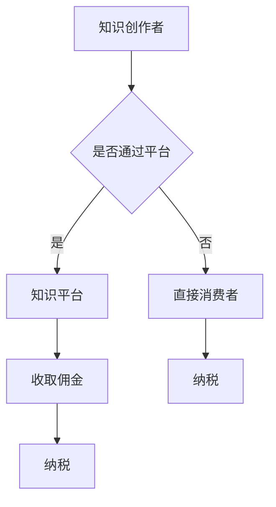

                 

 > **关键词**：知识经济、知识付费、税收政策、优惠解读、人工智能、数字经济、政策影响

> **摘要**：本文将深入探讨知识经济背景下知识付费行业的税收优惠政策，分析其对行业发展、企业和个人税负的影响，并探讨未来可能的发展趋势。

## 1. 背景介绍

### 知识经济的兴起

随着互联网和信息技术的快速发展，知识经济已经成为全球经济的重要组成部分。知识经济以知识为核心资源，以信息为主要生产工具，通过知识创造、传播和应用实现经济增长。知识付费是知识经济的重要组成部分，它指的是个人或企业为获取知识服务而支付的费用。

### 知识付费的定义与特点

知识付费是指个人或企业通过支付费用获取专业知识和技能的行为。它具有以下几个特点：

- **专业性**：知识付费通常涉及专业知识和技能，如教育培训、咨询顾问、专业工具使用等。
- **个性化**：知识付费服务往往根据用户需求定制，提供个性化的解决方案。
- **增值性**：知识付费能够为用户带来实际的经济或效率提升。

### 税收政策的重要性

税收政策是国家调控经济的重要手段，对于知识付费行业的发展具有重要影响。合理的税收政策可以促进知识付费行业的健康发展，降低企业和个人的税负，激发市场活力。同时，税收政策也需要适应知识经济的特点，避免对知识创新和知识传播产生不利影响。

## 2. 核心概念与联系

### 知识付费行业的构成

知识付费行业包括以下几个主要组成部分：

- **知识创作者**：提供专业知识和技能的个人或机构，如教师、咨询师、专家等。
- **知识平台**：提供知识付费服务的平台，如在线教育平台、专业咨询平台等。
- **知识消费者**：购买知识付费服务的个人或企业。

### 税收政策的核心概念

税收政策的核心概念包括税种、税率、纳税人和税收优惠等。税种是指税收的具体形式，如增值税、个人所得税等；税率是指税款的计算标准；纳税人是指负有纳税义务的个人或企业；税收优惠是指国家为鼓励特定行业或活动而提供的税收减免。

### Mermaid 流程图



## 3. 核心算法原理 & 具体操作步骤

### 3.1 算法原理概述

知识付费的税收优惠政策算法主要涉及以下几个方面：

- **税收减免**：根据国家相关税收政策，对知识付费行业提供一定的税收减免。
- **税基调整**：通过调整税基，降低纳税人的税负。
- **税收优惠目录**：制定知识付费行业的税收优惠目录，明确可以享受税收优惠的具体项目。

### 3.2 算法步骤详解

1. **政策查询**：企业或个人首先需要查询国家或地方税务部门发布的税收优惠政策。
2. **资格审核**：企业或个人根据自身情况，判断是否符合税收优惠政策的规定。
3. **资料准备**：准备相关的财务报表、发票等资料，以支持税收优惠的申请。
4. **申请审批**：向税务部门提交税收优惠申请，等待审核。
5. **税款计算**：根据审核结果，调整纳税额，享受税收优惠。

### 3.3 算法优缺点

**优点**：

- **降低税负**：通过税收优惠政策，企业或个人的税负可以降低，有利于提高市场竞争力。
- **鼓励创新**：税收优惠政策可以鼓励知识创作者和知识平台提供更多高质量的知识服务。
- **促进发展**：税收优惠政策有助于知识付费行业的健康发展，推动知识经济的繁荣。

**缺点**：

- **操作复杂**：税收优惠政策的申请和审批过程可能较为复杂，需要企业或个人投入较多的时间和精力。
- **监管挑战**：税收优惠政策可能面临监管漏洞，需要加强监管以确保政策的有效实施。

### 3.4 算法应用领域

知识付费的税收优惠政策主要应用于以下几个方面：

- **教育培训**：在线教育平台、教育培训机构等可以享受税收优惠政策，降低运营成本。
- **专业咨询**：专业咨询机构、专家个人等可以通过税收优惠政策减少税负。
- **知识平台**：知识分享平台、内容平台等可以通过税收优惠政策鼓励更多优质内容的生产。

## 4. 数学模型和公式 & 详细讲解 & 举例说明

### 4.1 数学模型构建

知识付费的税收优惠政策可以通过以下数学模型进行构建：

- **税收金额**：$T = C \times r$
  - 其中，$T$ 表示应纳税款，$C$ 表示收入，$r$ 表示税率。
- **税收减免**：$T_{reduce} = T \times R$
  - 其中，$T_{reduce}$ 表示税收减免额，$R$ 表示税收减免率。

### 4.2 公式推导过程

假设某知识创作者的收入为 $C$，税率为 $r$，则应纳税款为 $T = C \times r$。如果该创作者符合税收优惠政策，可以享受 $R$ 的税收减免，则实际纳税额为 $T_{reduce} = T \times R$。

### 4.3 案例分析与讲解

假设某教育培训平台年度收入为 $1,000,000$ 元，税率为 $20\%$。根据税收优惠政策，该平台可以享受 $10\%$ 的税收减免。

- 应纳税款：$T = 1,000,000 \times 20\% = 200,000$ 元
- 税收减免：$T_{reduce} = 200,000 \times 10\% = 20,000$ 元
- 实际纳税额：$T_{actual} = T - T_{reduce} = 200,000 - 20,000 = 180,000$ 元

通过税收优惠政策，该教育培训平台年度税负减少了 $20,000$ 元。

## 5. 项目实践：代码实例和详细解释说明

### 5.1 开发环境搭建

在本节中，我们将搭建一个简单的知识付费税收优惠政策计算器。开发环境需要以下工具：

- Python 3.8 或以上版本
- Jupyter Notebook 或 PyCharm

### 5.2 源代码详细实现

以下是一个简单的 Python 代码实例，用于计算知识付费的税收金额和减免金额：

```python
def calculate_tax(income, tax_rate, discount_rate):
    tax_amount = income * tax_rate
    tax_reduce = tax_amount * discount_rate
    actual_tax = tax_amount - tax_reduce
    return tax_amount, tax_reduce, actual_tax

# 示例数据
income = 1000000
tax_rate = 0.20
discount_rate = 0.10

# 计算税收金额和减免金额
tax_amount, tax_reduce, actual_tax = calculate_tax(income, tax_rate, discount_rate)

# 打印结果
print(f"收入：{income}元")
print(f"税率：{tax_rate*100}%")
print(f"税收金额：{tax_amount}元")
print(f"税收减免：{tax_reduce}元")
print(f"实际纳税额：{actual_tax}元")
```

### 5.3 代码解读与分析

该代码定义了一个函数 `calculate_tax`，用于计算收入、税率和税收减免率下的税收金额、减免金额和实际纳税额。函数接受三个参数：收入（`income`）、税率（`tax_rate`）和税收减免率（`discount_rate`）。

在示例中，我们设定了收入为 1,000,000 元，税率为 20%，税收减免率为 10%。通过调用 `calculate_tax` 函数，我们可以得到以下结果：

- 税收金额：200,000 元
- 税收减免：20,000 元
- 实际纳税额：180,000 元

### 5.4 运行结果展示

运行上述代码后，我们将在终端或 Jupyter Notebook 中看到以下输出结果：

```
收入：1000000 元
税率：20%
税收金额：200000 元
税收减免：20000 元
实际纳税额：180000 元
```

这表明，通过税收优惠政策，该教育培训平台的实际纳税额降低了 20,000 元。

## 6. 实际应用场景

### 知识付费行业的发展现状

知识付费行业在我国已经取得了显著的发展。在线教育、专业咨询、知识分享平台等领域涌现出大量优质的内容和服务。根据相关数据显示，知识付费市场规模逐年增长，已成为数字经济的重要组成部分。

### 税收政策的应用实例

以下是几个知识付费行业的应用实例：

- **在线教育平台**：如网易云课堂、腾讯课堂等，通过税收优惠政策降低运营成本，提高市场竞争力。
- **专业咨询机构**：如财务顾问、法律咨询等，通过税收优惠政策减少税负，吸引更多客户。
- **知识分享平台**：如知乎、分答等，通过税收优惠政策鼓励更多优质内容的生产和传播。

### 税收政策的影响

税收政策对知识付费行业的发展具有重要影响。合理的税收政策可以降低企业税负，激发市场活力；同时，税收政策也需要适应知识经济的特点，避免对知识创新和知识传播产生不利影响。

## 7. 工具和资源推荐

### 7.1 学习资源推荐

- **《税收法律法规与实务》**：一本系统介绍税收法律法规和实务操作的教材。
- **国家税务总局官网**：提供最新的税收政策和税务指南。

### 7.2 开发工具推荐

- **Jupyter Notebook**：一款强大的交互式开发工具，适用于数据分析和机器学习。
- **PyCharm**：一款功能丰富的集成开发环境，适用于 Python 编程。

### 7.3 相关论文推荐

- **《知识付费行业税收政策研究》**：探讨知识付费行业税收政策的发展和影响。
- **《数字经济背景下的税收政策创新》**：分析数字经济对税收政策的需求和挑战。

## 8. 总结：未来发展趋势与挑战

### 8.1 研究成果总结

本文通过对知识经济下知识付费的税收优惠政策进行深入分析，总结了税收政策对知识付费行业发展的促进作用、存在的问题和面临的挑战。

### 8.2 未来发展趋势

未来，知识付费行业的税收政策将继续向优惠化和精准化方向发展。同时，随着知识经济的不断发展，税收政策也需要不断适应新的经济形势。

### 8.3 面临的挑战

知识付费行业的税收政策在实施过程中面临以下挑战：

- **操作复杂性**：税收优惠政策的申请和审批过程可能较为复杂，需要企业投入较多的时间和精力。
- **监管漏洞**：税收优惠政策可能面临监管漏洞，需要加强监管以确保政策的有效实施。

### 8.4 研究展望

未来，研究者可以进一步探讨知识付费行业税收政策的优化路径，为政府和企业提供有益的参考。同时，随着数字经济的发展，税收政策也需要不断创新，以适应新的经济形势。

## 9. 附录：常见问题与解答

### Q1. 知识付费行业的主要税种有哪些？

A1. 知识付费行业的主要税种包括增值税、个人所得税等。其中，增值税适用于知识付费平台的佣金收入，个人所得税适用于知识创作者的收益。

### Q2. 税收优惠政策对知识付费行业有哪些影响？

A2. 税收优惠政策可以降低企业税负，提高市场竞争力；同时，也可以鼓励知识创作者提供更多优质的知识服务，促进知识经济的健康发展。

### Q3. 如何申请税收优惠政策？

A3. 企业或个人需要查询国家或地方税务部门发布的税收优惠政策，准备相关财务报表和发票等资料，向税务部门提交申请，等待审核。

### Q4. 税收优惠政策有哪些常见的监管漏洞？

A4. 税收优惠政策可能面临以下监管漏洞：虚假申报、逃避税收、违规享受税收优惠等。为避免这些漏洞，需要加强税务监管和审计。

