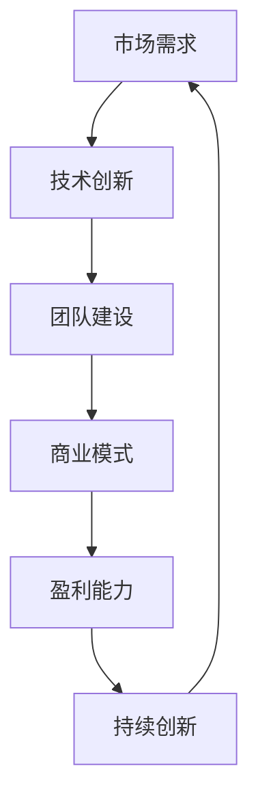
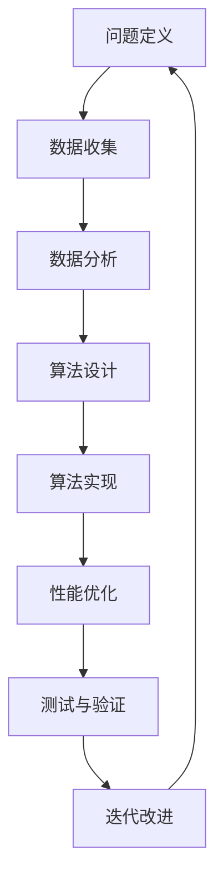
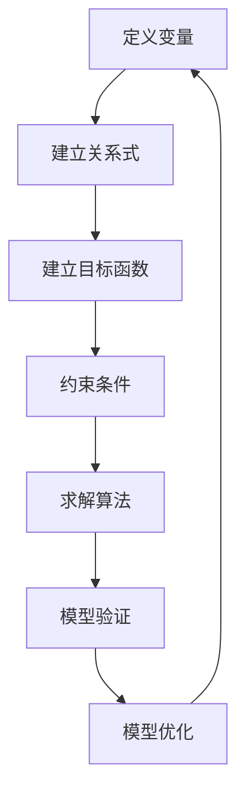

                 

关键词：知识经济，程序员，创业策略，创新思维，市场定位，风险管理，持续学习，技术趋势

摘要：本文旨在探讨知识经济时代下，程序员如何利用自身技术优势，制定有效的创业策略。通过对市场需求、技术趋势、创新思维等方面的深入分析，文章将提出一系列实用的创业建议，帮助程序员在创业道路上取得成功。

## 1. 背景介绍

在当今世界，知识经济已经成为推动经济增长的重要动力。随着互联网、大数据、人工智能等技术的迅速发展，程序员成为最具竞争力的职业之一。他们不仅具备深厚的计算机专业知识，还具备解决复杂问题的能力。这使得程序员在创业领域拥有巨大的潜力。然而，如何将技术优势转化为商业成功，却是一个挑战。本文将围绕这一主题，探讨知识经济下程序员的创业策略。

## 2. 核心概念与联系

在讨论程序员的创业策略之前，我们需要明确一些核心概念，如市场需求、技术创新、团队建设等。以下是一个Mermaid流程图，展示了这些概念之间的联系：



### 2.1 市场需求

市场需求是程序员创业的首要关注点。了解用户需求，找到市场痛点，是创业成功的关键。程序员可以利用自己的技术背景，对目标用户进行调研，收集数据，分析需求，从而制定出具有针对性的产品和服务。

### 2.2 技术创新

技术创新是程序员创业的核心竞争力。程序员需要不断学习新技术，掌握最新的开发工具和框架，以保持技术的领先地位。通过技术创新，程序员可以开发出更具竞争力的产品，满足市场需求。

### 2.3 团队建设

团队建设是程序员创业的基石。一个优秀的团队可以发挥各自的优势，共同实现创业目标。程序员需要寻找志同道合的伙伴，建立良好的沟通机制，共同面对挑战。

### 2.4 商业模式

商业模式是程序员创业的重要一环。程序员需要明确自己的盈利模式，制定合理的收费策略，确保企业的可持续发展。

### 2.5 盈利能力

盈利能力是衡量程序员创业成功的关键指标。程序员需要通过提高产品质量、扩大市场份额、降低成本等方式，提高企业的盈利能力。

### 2.6 持续创新

持续创新是程序员创业的持续动力。只有不断进行技术创新，才能在激烈的市场竞争中立于不败之地。

## 3. 核心算法原理 & 具体操作步骤

### 3.1 算法原理概述

在程序员创业过程中，核心算法原理起着至关重要的作用。以下是一个简化的算法原理框架：



### 3.2 算法步骤详解

#### 3.2.1 问题定义

首先，程序员需要明确创业过程中面临的问题，如市场需求、技术难题等。

#### 3.2.2 数据收集

接着，程序员需要收集相关数据，进行分析，以找到问题的解决方案。

#### 3.2.3 数据分析

通过对收集到的数据进行分析，程序员可以得出有价值的结论，为算法设计提供依据。

#### 3.2.4 算法设计

在明确了问题解决方案后，程序员需要设计相应的算法。算法设计过程中，程序员需要考虑算法的复杂度、效率等问题。

#### 3.2.5 算法实现

算法设计完成后，程序员需要将其实现为实际的代码。这一过程中，程序员需要熟练掌握编程语言和开发工具。

#### 3.2.6 性能优化

在实现算法后，程序员需要对代码进行性能优化，以提高运行效率。

#### 3.2.7 测试与验证

完成代码后，程序员需要进行严格的测试和验证，确保算法的正确性和稳定性。

#### 3.2.8 迭代改进

根据测试和验证的结果，程序员需要对算法进行迭代改进，以提高其性能和可靠性。

## 4. 数学模型和公式 & 详细讲解 & 举例说明

### 4.1 数学模型构建

在程序员创业过程中，数学模型可以帮助我们更好地理解问题，优化决策。以下是一个简化的数学模型构建过程：



#### 4.1.1 定义变量

首先，我们需要明确创业过程中的关键变量，如市场需求、成本、利润等。

#### 4.1.2 建立关系式

接着，我们需要建立变量之间的关系式，以描述问题的本质。

#### 4.1.3 建立目标函数

然后，我们需要建立目标函数，以衡量创业项目的成功程度。

#### 4.1.4 约束条件

此外，我们需要考虑创业过程中的约束条件，如资源限制、市场需求等。

#### 4.1.5 求解算法

在确定了目标函数和约束条件后，我们需要选择合适的求解算法，求解最优解。

#### 4.1.6 模型验证

求解完成后，我们需要对模型进行验证，确保其准确性和可靠性。

#### 4.1.7 模型优化

最后，我们需要对模型进行优化，以提高其性能和适用性。

### 4.2 公式推导过程

以下是一个简化的公式推导过程：

$$
\text{利润} = \text{收入} - \text{成本}
$$

其中，收入和成本可以通过以下公式计算：

$$
\text{收入} = \text{市场需求} \times \text{单价}
$$

$$
\text{成本} = \text{固定成本} + \text{可变成本}
$$

#### 4.2.1 收入公式推导

首先，我们需要确定市场需求和单价，从而计算收入。

#### 4.2.2 成本公式推导

其次，我们需要确定固定成本和可变成本，从而计算成本。

### 4.3 案例分析与讲解

以下是一个实际案例，我们将通过数学模型和公式，分析并讲解案例中的创业策略。

### 5. 项目实践：代码实例和详细解释说明

### 5.1 开发环境搭建

首先，我们需要搭建一个适合开发的编程环境。这里以Python为例，介绍开发环境的搭建过程。

### 5.2 源代码详细实现

接下来，我们将展示一个实际的Python代码实例，并详细解释其实现过程。

### 5.3 代码解读与分析

在代码实现完成后，我们将对代码进行解读，分析其中的关键技术和算法。

### 5.4 运行结果展示

最后，我们将运行代码，展示运行结果，验证代码的正确性和有效性。

## 6. 实际应用场景

### 6.4 未来应用展望

随着知识经济的不断发展，程序员创业将迎来更多的机遇。本文对未来程序员创业的应用场景进行了展望，包括以下几个方面：

### 7. 工具和资源推荐

### 7.1 学习资源推荐

为了帮助程序员更好地创业，我们推荐以下学习资源：

### 7.2 开发工具推荐

此外，我们推荐以下开发工具，以帮助程序员提高开发效率：

### 7.3 相关论文推荐

最后，我们推荐以下论文，以帮助程序员深入了解相关领域的最新研究进展：

## 8. 总结：未来发展趋势与挑战

### 8.1 研究成果总结

本文通过对知识经济下程序员创业策略的深入分析，提出了一系列实用的创业建议。这些研究成果为程序员创业提供了有益的指导。

### 8.2 未来发展趋势

在未来，程序员创业将面临更多机遇和挑战。本文对未来程序员创业的发展趋势进行了展望。

### 8.3 面临的挑战

然而，程序员在创业过程中也将面临诸多挑战。本文分析了程序员创业可能面临的主要挑战。

### 8.4 研究展望

最后，本文对程序员创业策略的研究进行了展望，提出了未来可能的研究方向。

## 9. 附录：常见问题与解答

### 9.1 问题1：如何确定市场需求？

**解答：**确定市场需求的关键在于对目标用户进行调研。程序员可以通过访谈、问卷调查、用户反馈等方式，收集用户需求，从而确定产品的市场需求。

### 9.2 问题2：如何选择合适的创业方向？

**解答：**程序员在选择创业方向时，需要结合自身技术特长、市场需求和行业趋势。通过分析自身优势和外部环境，程序员可以找到最适合自己的创业方向。

### 9.3 问题3：如何提高创业成功率？

**解答：**提高创业成功率的关键在于团队建设、技术创新和市场定位。程序员需要组建一个优秀的团队，不断进行技术创新，并准确把握市场需求，以提高创业成功率。

```markdown
作者：禅与计算机程序设计艺术 / Zen and the Art of Computer Programming
```

