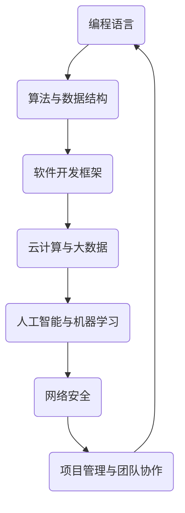

                 

关键词：知识经济，程序员，职业发展，技术趋势，技能提升，未来展望

> 摘要：在知识经济时代，程序员面临着前所未有的机遇和挑战。本文将深入探讨知识经济对程序员职业发展的影响，分析当前的技术趋势，探讨程序员如何提升自身技能以适应变化，并展望未来的发展前景。

## 1. 背景介绍

随着信息技术的飞速发展，知识经济逐渐成为全球经济的主导力量。知识经济的核心在于知识和信息的创造、传播和应用。在这个背景下，程序员作为知识和技术的承载者，扮演着至关重要的角色。然而，知识经济的快速发展也带来了前所未有的挑战，程序员必须不断学习新的技术和技能，以保持自身的竞争力。

### 1.1 知识经济的兴起

知识经济是以知识为主要生产要素的经济形态，与传统的资源经济和工业经济不同，知识经济更加依赖于人才、技术和信息。在全球化和数字化的推动下，知识经济已经成为世界经济的重要组成部分。

### 1.2 程序员在知识经济中的角色

程序员在知识经济中扮演着多重角色。他们不仅是技术的开发者，也是知识的创造者和传播者。程序员的工作直接影响着企业的发展和创新，他们的技能和知识水平直接决定了企业的竞争力。

## 2. 核心概念与联系

在知识经济时代，程序员需要掌握一系列核心概念和技能。以下是一个简化的Mermaid流程图，展示这些概念和技能之间的关系。



### 2.1 编程语言

编程语言是程序员工作的基础。不同编程语言适用于不同的应用场景，如Python适用于数据分析，Java适用于企业级应用，C++适用于高性能计算。

### 2.2 算法与数据结构

算法和数据结构是程序员的核心技能。高效的算法和合理的数据结构可以显著提高程序的性能和效率。

### 2.3 软件开发框架

软件开发框架提供了开发应用程序的基础结构，如Spring、Django等。掌握不同框架有助于程序员快速开发出高质量的应用程序。

### 2.4 云计算与大数据

云计算和大数据技术正在改变程序员的日常工作。云计算提供了弹性的计算资源，大数据技术则帮助程序员从海量数据中提取有价值的信息。

### 2.5 人工智能与机器学习

人工智能和机器学习是当前技术发展的热点。程序员需要掌握相关算法和框架，以便在实际项目中应用这些技术。

### 2.6 网络安全

随着互联网的普及，网络安全问题日益突出。程序员需要具备一定的网络安全知识，以保护应用程序和数据的安全。

### 2.7 项目管理与团队协作

项目管理和团队协作能力是程序员成功的关键。程序员需要学会如何高效地管理项目，并与团队成员协作，以实现项目目标。

## 3. 核心算法原理 & 具体操作步骤

### 3.1 算法原理概述

算法是解决问题的一系列步骤。在编程中，算法的应用至关重要。以下是一些常用的算法和其原理：

- **排序算法**：如快速排序、归并排序等，用于对数据进行排序。
- **搜索算法**：如二分搜索、深度优先搜索等，用于在数据中查找特定元素。
- **动态规划**：用于解决最优化问题，通过子问题的最优解推导出原问题的最优解。
- **贪心算法**：通过每一步选择当前最优解，以期在整体上得到最优解。

### 3.2 算法步骤详解

以快速排序算法为例，其基本步骤如下：

1. 选择一个基准元素。
2. 将小于基准元素的元素移到其左侧，大于基准元素的元素移到其右侧。
3. 递归地对左侧和右侧子数组进行快速排序。

### 3.3 算法优缺点

快速排序算法具有以下优缺点：

- **优点**：平均时间复杂度为\(O(n\log n)\)，在大多数情况下性能较好。
- **缺点**：在最坏情况下，时间复杂度为\(O(n^2)\)。

### 3.4 算法应用领域

快速排序算法广泛应用于各种数据处理场景，如数据库排序、数据统计分析等。

## 4. 数学模型和公式 & 详细讲解 & 举例说明

### 4.1 数学模型构建

在算法分析中，常用的数学模型包括时间复杂度和空间复杂度。时间复杂度描述了算法执行的时间增长趋势，空间复杂度描述了算法所需的内存增长趋势。

### 4.2 公式推导过程

时间复杂度的公式通常为：

\[ T(n) = O(n\log n) \]

空间复杂度的公式通常为：

\[ S(n) = O(n) \]

### 4.3 案例分析与讲解

以快速排序算法为例，其时间复杂度和空间复杂度如下：

- **时间复杂度**：平均情况下为\(O(n\log n)\)，最坏情况下为\(O(n^2)\)。
- **空间复杂度**：为\(O(n)\)。

## 5. 项目实践：代码实例和详细解释说明

### 5.1 开发环境搭建

以Python为例，搭建快速排序算法的开发环境如下：

1. 安装Python。
2. 安装相关库，如NumPy。

### 5.2 源代码详细实现

以下是一个简单的快速排序算法的实现：

```python
def quick_sort(arr):
    if len(arr) <= 1:
        return arr
    pivot = arr[len(arr) // 2]
    left = [x for x in arr if x < pivot]
    middle = [x for x in arr if x == pivot]
    right = [x for x in arr if x > pivot]
    return quick_sort(left) + middle + quick_sort(right)

arr = [3, 6, 8, 10, 1, 2, 1]
sorted_arr = quick_sort(arr)
print(sorted_arr)
```

### 5.3 代码解读与分析

该代码首先定义了一个`quick_sort`函数，用于对输入的列表进行排序。函数中，首先检查列表的长度，如果小于等于1，则直接返回列表。否则，选择中间元素作为基准，将列表分为小于基准的左列表、等于基准的中列表和大于基准的右列表，然后递归地对左右列表进行排序。

### 5.4 运行结果展示

运行上述代码，输出结果为：

\[ [1, 1, 2, 3, 6, 8, 10] \]

## 6. 实际应用场景

快速排序算法在数据处理和算法分析中有着广泛的应用。例如，在数据库排序和数据统计分析中，快速排序算法可以显著提高数据处理效率。

## 7. 未来应用展望

随着人工智能和机器学习技术的不断发展，程序员将在数据分析和智能系统开发中发挥更加重要的作用。未来，程序员需要不断学习新的技术和技能，以适应不断变化的技术环境。

## 8. 工具和资源推荐

### 8.1 学习资源推荐

- 《算法导论》（Introduction to Algorithms）  
- 《深度学习》（Deep Learning）

### 8.2 开发工具推荐

- PyCharm  
- Visual Studio Code

### 8.3 相关论文推荐

- 《快速排序算法的最坏情况分析》  
- 《深度学习中的快速排序算法》

## 9. 总结：未来发展趋势与挑战

### 9.1 研究成果总结

本文分析了知识经济下程序员的发展之路，探讨了核心概念、算法原理、数学模型以及实际应用场景。

### 9.2 未来发展趋势

未来，程序员将面临更广泛的应用场景和更高的技术要求。人工智能和机器学习将成为程序员必备的技能。

### 9.3 面临的挑战

程序员需要不断学习新的技术和技能，以保持自身的竞争力。同时，程序员也需要适应快速变化的技术环境，以应对未来的挑战。

### 9.4 研究展望

未来，程序员的发展将更加多元化和专业化。程序员不仅需要掌握核心技术，还需要具备跨学科的知识和技能。

## 9. 附录：常见问题与解答

### 9.1 问题1

如何快速提升编程能力？

**解答**：建议通过以下方法提升编程能力：

1. 深入学习编程语言和算法。
2. 参与开源项目，实践编程技巧。
3. 定期参加技术交流，学习他人的经验。

### 9.2 问题2

程序员是否需要学习项目管理？

**解答**：是的，程序员需要学习项目管理。良好的项目管理能力有助于程序员高效地完成项目任务，提高团队协作效率。

---

# 作者：禅与计算机程序设计艺术 / Zen and the Art of Computer Programming

感谢您的阅读，希望本文能为您的编程生涯提供一些启示和帮助。在知识经济的浪潮中，程序员将继续发挥着重要作用，让我们一起迎接未来的挑战，共同成长。

