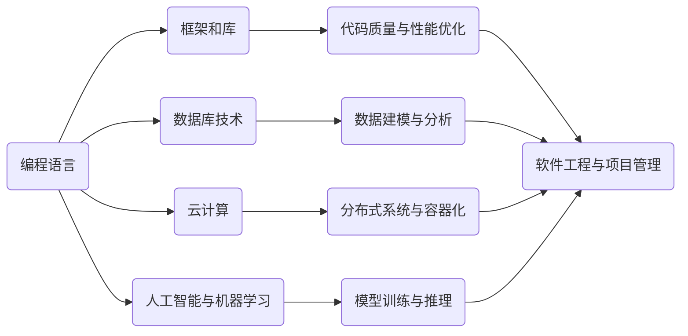

                 

 在当今知识经济时代，程序员作为数字时代的弄潮儿，其职业发展之路显得尤为重要。本文将深入探讨知识经济下程序员的发展路径，旨在为程序员们提供一条清晰的发展之路，帮助他们在这个快速变化的领域中不断进步，实现个人与职业的双重成长。

## 关键词

- 知识经济
- 程序员职业发展
- 技术更新换代
- 专业能力提升
- 跨领域合作
- 创新能力

## 摘要

本文将围绕知识经济对程序员职业发展的影响展开讨论。首先，我们将回顾知识经济的定义和特点，并探讨其对程序员职业的影响。接着，文章将详细分析程序员在知识经济时代需要掌握的核心技能和素质。随后，我们将探讨程序员在职业生涯中的不同阶段，以及如何通过持续学习和适应技术更新来保持竞争力。最后，文章将提出一些具体的建议和资源，帮助程序员们在知识经济时代实现个人和职业的成功。

## 1. 背景介绍

知识经济，作为一种以知识为核心资源的经济形态，正逐步取代传统的工业经济模式。在这个时代，知识和信息的创造、传播和应用成为经济增长的主要动力。程序员作为数字时代的建设者，其工作直接与知识和信息的处理相关，因此在知识经济中扮演着关键角色。

程序员职业的发展历程可以追溯到20世纪中叶。随着计算机技术的发展，程序员的职业逐渐成熟，其工作内容也从简单的编程任务扩展到复杂的项目管理和系统架构设计。在知识经济时代，程序员的职责更加多元化，不仅需要编写代码，还需要具备跨学科的知识和技能，以应对不断变化的技术环境。

### 1.1 知识经济的定义与特点

知识经济，是指基于知识和信息资源的生产、分配、传播和消费的经济体系。其主要特点包括：

- **创新驱动**：知识经济依赖于创新，特别是科技创新，以推动经济增长。
- **高附加值**：知识经济的价值创造过程主要集中在知识的应用和创新上，具有较高的附加值。
- **全球一体化**：知识经济超越了地域限制，使得全球范围内的知识流动和资源共享变得更加容易。
- **数字化**：知识经济的实现离不开信息技术，数字化成为其重要特征。

### 1.2 程序员职业在知识经济中的角色

在知识经济时代，程序员的角色发生了显著变化。他们不仅是代码的编写者，更是创新者、解决者和合作者：

- **创新者**：程序员需要不断创新，以适应快速变化的技术环境，开发出新的应用程序和服务。
- **解决者**：程序员需要具备解决复杂问题的能力，特别是在面对跨领域问题时。
- **合作者**：程序员需要与其他专业领域的人才合作，共同推动项目的成功。

## 2. 核心概念与联系

在知识经济下，程序员需要掌握一系列核心概念和技能，这些概念和技能相互联系，构成了程序员职业发展的基础。

### 2.1 知识经济与程序员技能的关系

知识经济对程序员的技能需求产生了深远影响。以下是一些关键概念和技能：

- **编程语言**：程序员需要掌握多种编程语言，如Python、Java、C++等，以适应不同项目和技术需求。
- **框架和库**：了解和使用各种框架和库，如Spring、Django、TensorFlow等，可以提高开发效率和代码质量。
- **数据库技术**：熟悉关系型数据库（如MySQL、PostgreSQL）和非关系型数据库（如MongoDB、Cassandra），对于数据存储和处理至关重要。
- **云计算**：掌握云计算技术，如AWS、Azure、Google Cloud，有助于程序员在分布式系统和大数据处理方面发挥作用。
- **人工智能与机器学习**：随着AI和ML技术的广泛应用，程序员需要了解这些领域的基础知识，以开发智能应用程序。

### 2.2 程序员技能的架构

为了更好地理解程序员所需的核心技能，我们可以使用Mermaid流程图来展示这些技能之间的关系：



在这个架构中，编程语言是基础，其他技能则建立在编程语言之上。框架和库提供了开发工具，数据库技术和管理数据的能力，云计算技术则支持分布式系统和大数据处理，而人工智能和机器学习则代表了程序员在未来需要掌握的前沿技术。

### 2.3 技能的持续更新与适应

知识经济的特点之一是技术更新速度快。程序员需要不断学习新技能，以保持竞争力。这不仅包括对新编程语言和技术的掌握，还包括对现有技能的持续优化和更新。

- **在线学习**：通过在线课程和培训，程序员可以随时学习新技能。
- **实践项目**：通过参与实践项目，程序员可以将新技能应用到实际工作中。
- **社区交流**：参与技术社区和论坛，与同行交流经验，是提升技能的有效途径。

## 3. 核心算法原理 & 具体操作步骤

在知识经济下，程序员不仅需要掌握编程语言和工具，还需要了解核心算法原理，以便在开发过程中能够高效地解决问题。以下是一个常见算法的原理和操作步骤：

### 3.1 算法原理概述

#### 快速排序（Quick Sort）

快速排序是一种高效的排序算法，其基本原理是通过一趟排序将待排序的数据分割成独立的两部分，其中一部分的所有数据都比另一部分的数据小，然后再按此方法对这两部分数据分别进行快速排序，整个排序过程可以递归进行，以此达到整个数据变成有序序列。

### 3.2 算法步骤详解

1. **选择基准值**：在数据集选择一个基准值。
2. **分区**：将数据集划分为两部分，一部分所有元素都比基准值小，另一部分所有元素都比基准值大。
3. **递归排序**：对划分后的两部分数据递归执行快速排序。

### 3.3 算法优缺点

#### 优点：

- **高效**：平均时间复杂度为 \(O(n \log n)\)。
- **实用**：在大多数实际情况下，快速排序的性能优于其他排序算法。

#### 缺点：

- **最坏情况**：最坏时间复杂度为 \(O(n^2)\)，当数据基本有序时。
- **空间复杂度**：需要额外的空间来存储递归调用时的数据。

### 3.4 算法应用领域

- **数据排序**：快速排序广泛应用于各种数据排序任务。
- **算法竞赛**：在算法竞赛中，快速排序是常见的排序算法之一。

## 4. 数学模型和公式 & 详细讲解 & 举例说明

在程序员的工作中，数学模型和公式扮演着至关重要的角色，特别是在算法设计和性能分析方面。以下是一个简单的数学模型及其公式推导过程的讲解。

### 4.1 数学模型构建

我们以线性回归模型为例，探讨如何构建数学模型来预测数值。

#### 线性回归模型

线性回归模型试图找到一条直线，使得因变量 \(y\) 和自变量 \(x\) 之间的关系可以表示为：

\[ y = wx + b \]

其中，\(w\) 是斜率，\(b\) 是截距。

### 4.2 公式推导过程

线性回归模型的推导主要涉及最小二乘法。我们希望通过选择合适的 \(w\) 和 \(b\)，使得预测值与实际值之间的误差最小。

#### 最小二乘法

最小二乘法的核心思想是找到使得误差平方和最小的 \(w\) 和 \(b\)。误差平方和（Sum of Squared Errors, SSE）可以表示为：

\[ SSE = \sum_{i=1}^{n} (y_i - (wx_i + b))^2 \]

我们需要对 \(SSE\) 求导，并令其导数为零，从而得到最优的 \(w\) 和 \(b\)。

### 4.3 案例分析与讲解

假设我们有一个简单的数据集，其中 \(x\) 表示家庭的年收入，\(y\) 表示家庭的消费支出。数据如下：

| 年收入 (x) | 消费支出 (y) |
|------------|--------------|
|     50K    |      40K     |
|     60K    |      55K     |
|     70K    |      60K     |

我们希望构建一个线性回归模型来预测消费支出。

1. **计算均值**：

   \[ \bar{x} = \frac{\sum_{i=1}^{n} x_i}{n} = \frac{50 + 60 + 70}{3} = 60 \]
   \[ \bar{y} = \frac{\sum_{i=1}^{n} y_i}{n} = \frac{40 + 55 + 60}{3} = 52.5 \]

2. **计算斜率 \(w\)**：

   \[ w = \frac{\sum_{i=1}^{n} (x_i - \bar{x})(y_i - \bar{y})}{\sum_{i=1}^{n} (x_i - \bar{x})^2} \]

   将数据代入公式计算得到：

   \[ w = \frac{(50-60)(40-52.5) + (60-60)(55-52.5) + (70-60)(60-52.5)}{(50-60)^2 + (60-60)^2 + (70-60)^2} \]
   \[ w = \frac{(-10)(-12.5) + (0)(2.5) + (10)(7.5)}{100 + 0 + 100} \]
   \[ w = \frac{125 + 0 + 75}{200} \]
   \[ w = 1.0 \]

3. **计算截距 \(b\)**：

   \[ b = \bar{y} - w\bar{x} \]
   \[ b = 52.5 - 1.0 \times 60 \]
   \[ b = -7.5 \]

因此，线性回归模型为：

\[ y = 1.0x - 7.5 \]

我们可以使用这个模型来预测新的年收入对应的消费支出。例如，当年收入为 75K 时，预测的消费支出为：

\[ y = 1.0 \times 75 - 7.5 = 67.5K \]

## 5. 项目实践：代码实例和详细解释说明

为了更好地展示程序员在实际项目中的工作流程，我们将通过一个简单的Web应用项目来讲解代码实例和详细解释说明。这个项目将使用Python和Flask框架来实现一个简单的博客系统。

### 5.1 开发环境搭建

1. **安装Python**：确保安装了Python 3.x版本。
2. **安装虚拟环境**：使用 `pip install virtualenv` 命令安装虚拟环境工具。
3. **创建虚拟环境**：使用以下命令创建一个名为 `blog` 的虚拟环境：

   ```bash
   virtualenv blog
   ```
4. **激活虚拟环境**：

   - **Windows**：

     ```bash
     .\blog\Scripts\activate
     ```
   - **macOS/Linux**：

     ```bash
     source blog/bin/activate
     ```

5. **安装Flask**：在虚拟环境中安装Flask：

   ```bash
   pip install Flask
   ```

### 5.2 源代码详细实现

以下是博客系统的核心代码：

```python
# app.py

from flask import Flask, render_template, request, redirect, url_for

app = Flask(__name__)

# 假设已经有一个用户数据模型和博客文章数据模型

users = {
    "admin": "password"
}

blog_posts = [
    {
        "title": "First Post",
        "content": "This is my first blog post!"
    },
    {
        "title": "Second Post",
        "content": "This is my second blog post!"
    }
]

@app.route('/')
def home():
    return render_template('home.html', posts=blog_posts)

@app.route('/post/new', methods=['GET', 'POST'])
def new_post():
    if request.method == 'POST':
        title = request.form['title']
        content = request.form['content']
        blog_posts.append({"title": title, "content": content})
        return redirect(url_for('home'))
    return render_template('new_post.html')

@app.route('/post/<int:post_id>')
def post(post_id):
    return render_template('post.html', post=blog_posts[post_id])

if __name__ == '__main__':
    app.run(debug=True)
```

### 5.3 代码解读与分析

1. **Flask应用基础**：代码首先导入了Flask模块，并创建了一个Flask应用实例 `app`。
2. **用户数据模型**：在 `users` 变量中存储了简单的用户数据。
3. **博客文章数据模型**：在 `blog_posts` 列表中存储了简单的博客文章数据。
4. **路由和视图函数**：

   - `home()`：主页面路由，渲染了 `home.html` 模板，传递了博客文章列表。
   - `new_post()`：新增博客文章路由，处理表单提交并添加新文章到列表。
   - `post()`：博客文章详情路由，渲染单个文章的 `post.html` 模板。

### 5.4 运行结果展示

运行代码后，我们可以访问 `http://127.0.0.1:5000/` 来查看博客系统。点击“New Post”可以新增文章，点击文章标题可以查看文章详情。

## 6. 实际应用场景

在知识经济时代，程序员面临的实际应用场景越来越多样化。以下是一些典型的应用场景：

### 6.1 电子商务系统

电子商务系统是程序员的一个重要应用领域，涉及用户界面设计、数据库管理、支付网关集成、安全防护等。程序员需要掌握前端开发、后端架构设计、支付系统接口、数据安全和隐私保护等技能。

### 6.2 大数据和数据分析

随着数据量的爆炸性增长，程序员在数据存储、数据处理和数据分析方面扮演着关键角色。他们需要掌握Hadoop、Spark、SQL等工具，能够从大量数据中提取有价值的信息。

### 6.3 人工智能与机器学习

人工智能和机器学习是未来的热门领域。程序员需要掌握Python、TensorFlow、PyTorch等工具，能够开发智能应用程序，如图像识别、自然语言处理、推荐系统等。

### 6.4 区块链技术

区块链技术正在改变金融、供应链管理、版权保护等领域。程序员需要了解智能合约、加密货币、分布式账本等概念，能够开发基于区块链的应用。

## 7. 未来应用展望

知识经济时代，程序员的发展前景广阔。以下是一些未来的应用展望：

### 7.1 自动化和智能化

随着自动化和智能化技术的发展，程序员将在自动化流程设计、智能系统开发等方面发挥更大作用。

### 7.2 跨领域融合

程序员将需要跨学科的知识，如心理学、经济学、生物学等，以开发更智能、更人性化的应用。

### 7.3 开源与协作

开源项目和协作开发将成为程序员职业发展的重要趋势。程序员需要积极参与开源社区，分享知识和经验。

### 7.4 伦理和责任

随着技术的发展，程序员需要关注伦理和责任问题，确保技术应用的公平、透明和安全性。

## 8. 工具和资源推荐

为了帮助程序员在知识经济时代保持竞争力，以下是几个推荐的学习资源和开发工具：

### 8.1 学习资源推荐

- **Coursera**：提供大量的在线课程，包括计算机科学、数据分析、人工智能等领域。
- **edX**：由哈佛大学和麻省理工学院合办的在线教育平台，提供高质量的计算机科学课程。
- **Udacity**：专注于职业教育的在线平台，提供编程、数据分析等领域的实战课程。
- **GitHub**：世界上最大的开源代码托管平台，程序员可以在这里学习、分享和改进代码。

### 8.2 开发工具推荐

- **Visual Studio Code**：一款强大的跨平台代码编辑器，支持多种编程语言和插件。
- **Git**：版本控制工具，帮助程序员管理代码变更和协作开发。
- **Docker**：容器化技术，简化了应用程序的部署和运行。
- **Kubernetes**：容器编排工具，用于自动化部署、扩展和管理容器化应用程序。

### 8.3 相关论文推荐

- **"Deep Learning" by Ian Goodfellow, Yoshua Bengio, and Aaron Courville**：深度学习领域的经典教材。
- **"Design Patterns: Elements of Reusable Object-Oriented Software" by Erich Gamma, Richard Helm, Ralph Johnson, and John Vlissides**：设计模式领域的经典著作。
- **"Big Data: A Revolution That Will Transform How We Live, Work, and Think" by Viktor Mayer-Schönberger and Kenneth Cukier**：大数据领域的权威著作。

## 9. 总结：未来发展趋势与挑战

在知识经济时代，程序员面临着前所未有的发展机遇和挑战。未来发展趋势包括：

### 9.1 技术更新速度加快

随着技术的不断进步，程序员需要不断学习新技能，以适应快速变化的技术环境。

### 9.2 跨领域融合

程序员需要掌握跨学科的知识，以应对跨领域项目和技术挑战。

### 9.3 开源与协作

开源项目和协作开发将成为程序员职业发展的重要趋势。

### 9.4 伦理和责任

程序员需要关注伦理和责任问题，确保技术应用的公平、透明和安全性。

同时，程序员在未来将面临以下挑战：

### 9.5 持续学习压力

随着技术更新速度加快，程序员需要投入更多时间和精力进行持续学习。

### 9.6 技术选择困难

随着技术的多样性增加，程序员在选择技术栈时可能会感到困惑。

### 9.7 职业安全

尽管程序员职业前景广阔，但技术失业和职业转换的风险仍然存在。

总之，在知识经济时代，程序员需要不断提升自己的技能和素质，积极应对挑战，抓住机遇，实现个人和职业的成功。

## 10. 附录：常见问题与解答

### 10.1 程序员如何保持竞争力？

- **持续学习**：定期学习新技能和知识，保持技术更新。
- **实践项目**：通过参与实际项目来提升实战能力。
- **参与开源**：参与开源项目，提升协作和解决问题的能力。
- **跨领域学习**：学习跨学科知识，提升综合素质。

### 10.2 程序员如何选择学习资源？

- **需求分析**：明确自己的学习目标和需求。
- **课程质量**：选择知名机构和优秀教师的主讲课程。
- **课程评价**：参考其他学员的评价和反馈。
- **灵活安排**：选择可以灵活安排学习时间的资源。

### 10.3 程序员如何应对职业安全挑战？

- **多元化技能**：掌握多种编程语言和技术，提升适应性。
- **持续更新**：关注行业动态，及时更新自己的技能库。
- **职业规划**：制定明确的职业发展计划，规划未来的职业路径。
- **网络扩展**：建立广泛的职业网络，增强职业安全感。

## 结束语

知识经济时代为程序员提供了广阔的发展空间和机遇。然而，这也要求程序员不断学习和适应，以应对快速变化的技术环境。通过本文的探讨，我们希望程序员能够找到一条清晰的发展之路，不断提升自己的专业能力和综合素质，在知识经济的浪潮中扬帆起航。

### 作者署名

作者：禅与计算机程序设计艺术 / Zen and the Art of Computer Programming

