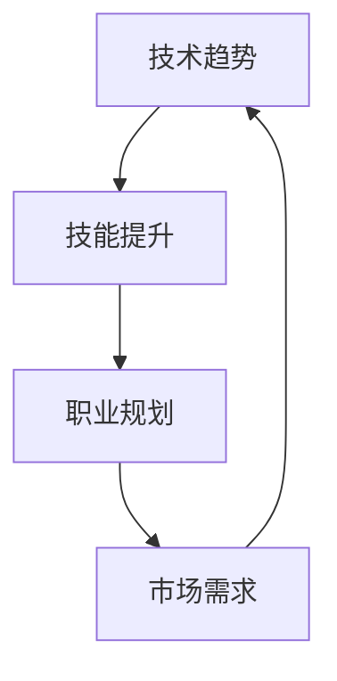

                 

关键词：知识经济、程序员职业、技术趋势、技能提升、职业发展

> 摘要：在知识经济迅速发展的今天，程序员面临着前所未有的职业发展机遇。本文将从技术趋势、技能提升和职业规划三个方面，深入探讨程序员如何在知识经济中把握机遇，实现个人和职业的全面发展。

## 1. 背景介绍

知识经济是一种以知识和信息为核心的经济形态，它依赖于高科技产业和知识型劳动。在知识经济时代，传统的制造业和农业经济的比重逐渐下降，而以信息技术、生物技术、新能源技术为代表的高科技产业迅速崛起。这一变革对各行各业都产生了深远影响，程序员作为知识型劳动者的重要组成部分，自然也面临着前所未有的发展机遇。

### 1.1 程序员职业的兴起

程序员作为现代社会的重要职业之一，其发展可以追溯到20世纪中期。随着计算机技术的飞速发展，程序员这一职业逐渐从边缘走向核心，成为推动科技进步的重要力量。如今，程序员不仅在IT行业占据重要地位，还渗透到金融、医疗、教育等多个领域，成为各行各业创新发展的关键因素。

### 1.2 知识经济对程序员职业的影响

知识经济的兴起，使得程序员职业的重要性更加凸显。一方面，程序员需要掌握更多前沿技术，以适应快速变化的市场需求；另一方面，知识经济的竞争压力，也迫使程序员不断提升自己的技能和知识水平。在这个过程中，程序员不仅需要具备扎实的技术能力，还需要具备良好的沟通能力、团队协作能力和项目管理能力。

## 2. 核心概念与联系

在知识经济下，程序员的职业发展离不开以下几个核心概念：

### 2.1 技术趋势

技术趋势是指某一时期内，某一行业或领域内新兴技术发展的方向和趋势。对于程序员来说，紧跟技术趋势，了解新兴技术，是提升个人竞争力的关键。例如，随着云计算、大数据、人工智能等技术的兴起，程序员需要掌握相应的技术，以适应市场需求。

### 2.2 技能提升

技能提升是指程序员通过学习新技能、掌握新工具，提升自己的专业能力。在知识经济下，程序员需要具备多方面的技能，如编程语言、框架、数据库、算法等。同时，还需要关注软技能的培养，如沟通能力、团队协作能力、问题解决能力等。

### 2.3 职业规划

职业规划是指程序员根据个人兴趣、能力和市场需求，制定长期职业发展目标，并为之努力的过程。在知识经济下，程序员需要具备清晰的职业规划，才能在激烈的竞争中立于不败之地。

### 2.4 Mermaid 流程图



## 3. 核心算法原理 & 具体操作步骤

在程序员职业发展中，掌握核心算法原理和具体操作步骤至关重要。以下是一个简单的算法示例，用于介绍核心算法原理和具体操作步骤：

### 3.1 算法原理概述

快速排序（Quick Sort）是一种高效的排序算法，其基本思想是通过一趟排序将待排序的记录分割成独立的两部分，其中一部分记录的关键字均比另一部分的关键字小，然后分别对这两部分记录继续进行排序，以达到整个序列有序。

### 3.2 算法步骤详解

1. **选择基准元素**：在待排序的序列中，选择一个元素作为基准元素。

2. **划分操作**：将序列划分为两部分，一部分都比基准元素小，另一部分都比基准元素大。

3. **递归排序**：对基准元素左侧和右侧的序列分别进行快速排序。

### 3.3 算法优缺点

- 优点：时间复杂度为 \(O(n \log n)\)，空间复杂度为 \(O(\log n)\)，适用于大规模数据排序。
- 缺点：最坏情况下时间复杂度为 \(O(n^2)\)，可能发生。

### 3.4 算法应用领域

快速排序广泛应用于各种排序场景，如数据库排序、搜索引擎排序等。

## 4. 数学模型和公式 & 详细讲解 & 举例说明

在程序员职业发展中，数学模型和公式是理解和应用各种算法的基础。以下是一个简单的线性回归模型示例，用于介绍数学模型和公式的构建、推导及举例说明：

### 4.1 数学模型构建

线性回归模型的基本形式为：

\[ Y = \beta_0 + \beta_1 X + \varepsilon \]

其中，\(Y\) 为因变量，\(X\) 为自变量，\(\beta_0\) 和 \(\beta_1\) 分别为模型的截距和斜率，\(\varepsilon\) 为随机误差。

### 4.2 公式推导过程

利用最小二乘法，可以推导出线性回归模型的参数估计公式：

\[ \beta_1 = \frac{\sum (X_i - \bar{X})(Y_i - \bar{Y})}{\sum (X_i - \bar{X})^2} \]
\[ \beta_0 = \bar{Y} - \beta_1 \bar{X} \]

其中，\(\bar{X}\) 和 \(\bar{Y}\) 分别为 \(X\) 和 \(Y\) 的样本均值。

### 4.3 案例分析与讲解

假设我们有一个简单的数据集，其中 \(X\) 表示房价，\(Y\) 表示房屋面积。我们可以利用线性回归模型来预测房价。

```latex
\begin{aligned}
    X &= [100, 200, 300, 400, 500] \\
    Y &= [150, 250, 350, 450, 550]
\end{aligned}
```

根据数据集，我们可以计算出：

\[ \bar{X} = 300, \bar{Y} = 350 \]

利用最小二乘法，我们可以计算出斜率 \(\beta_1\) 和截距 \(\beta_0\)：

\[ \beta_1 = \frac{\sum (X_i - \bar{X})(Y_i - \bar{Y})}{\sum (X_i - \bar{X})^2} = \frac{(100-300)(150-350) + (200-300)(250-350) + (300-300)(350-350) + (400-300)(450-350) + (500-300)(550-350)}{(100-300)^2 + (200-300)^2 + (300-300)^2 + (400-300)^2 + (500-300)^2} \approx 1.25 \]
\[ \beta_0 = \bar{Y} - \beta_1 \bar{X} = 350 - 1.25 \times 300 \approx -50 \]

因此，线性回归模型为：

\[ Y = -50 + 1.25X \]

我们可以利用这个模型来预测新的房价，例如，当 \(X = 600\) 时，预测的房价为：

\[ Y = -50 + 1.25 \times 600 \approx 725 \]

## 5. 项目实践：代码实例和详细解释说明

为了更好地理解程序员在知识经济下的职业发展，我们以一个简单的Web开发项目为例，介绍开发环境搭建、源代码实现、代码解读与分析以及运行结果展示。

### 5.1 开发环境搭建

我们选择Python作为开发语言，并使用Flask作为Web框架。在本地环境中，我们需要安装Python和Flask。

```bash
pip install flask
```

### 5.2 源代码详细实现

以下是一个简单的Flask应用程序，用于实现一个简单的Web服务。

```python
from flask import Flask, request, jsonify

app = Flask(__name__)

@app.route('/hello', methods=['GET'])
def hello():
    name = request.args.get('name', 'World')
    return f'Hello, {name}!'

@app.route('/add', methods=['POST'])
def add():
    num1 = float(request.form['num1'])
    num2 = float(request.form['num2'])
    result = num1 + num2
    return jsonify({'result': result})

if __name__ == '__main__':
    app.run(debug=True)
```

### 5.3 代码解读与分析

在这个项目中，我们定义了两个路由：/hello 和 /add。

- /hello 路由接收GET请求，返回一个带有用户名（或默认为World）的欢迎消息。
- /add 路由接收POST请求，接收两个数字参数，返回它们的和。

### 5.4 运行结果展示

运行应用程序后，我们可以在浏览器中访问以下地址：

- http://127.0.0.1:5000/hello?name=John
- http://127.0.0.1:5000/add?num1=5&num2=10

分别会返回以下结果：

- Hello, John!
- {"result": 15}

## 6. 实际应用场景

在知识经济下，程序员的职业发展不仅局限于软件开发，还渗透到各个行业。以下是一些实际应用场景：

### 6.1 金融行业

金融行业是程序员的重要应用领域，包括股票交易、风险管理、支付系统等。程序员可以通过开发量化交易模型、大数据分析平台等，为金融机构提供智能化的解决方案。

### 6.2 医疗行业

医疗行业是知识经济的另一个重要领域。程序员可以开发医疗信息系统、电子病历、健康管理系统等，提高医疗服务的效率和质量。

### 6.3 教育行业

教育行业正逐渐拥抱数字化，程序员可以开发在线教育平台、智能学习系统等，为学生提供个性化的学习体验。

### 6.4 物流行业

物流行业是程序员的另一大应用领域，包括物流管理系统、智能配送系统等。程序员可以通过开发高效、智能的物流解决方案，提高物流行业的整体效率。

## 7. 工具和资源推荐

### 7.1 学习资源推荐

- 《Python编程：从入门到实践》
- 《深入理解计算机系统》
- 《算法导论》

### 7.2 开发工具推荐

- PyCharm
- VSCode
- Git

### 7.3 相关论文推荐

- 《深度学习：人类级别的机器智能的新基石》
- 《云计算：概念、架构与实现》
- 《大数据：一场变革》

## 8. 总结：未来发展趋势与挑战

在知识经济下，程序员的职业发展机遇与挑战并存。未来，程序员需要紧跟技术趋势，提升自身技能，制定清晰的职业规划。同时，还需要关注以下发展趋势和挑战：

### 8.1 研究成果总结

- 云计算、大数据、人工智能等技术的快速发展，为程序员提供了丰富的应用场景。
- 开源社区的繁荣，为程序员提供了丰富的学习资源和工具。
- 程序员在金融、医疗、教育等行业的应用逐渐深入，推动了行业创新。

### 8.2 未来发展趋势

- 程序员将更加注重软技能的培养，如沟通能力、团队协作能力等。
- 程序员将面临更加复杂的技术挑战，如安全、隐私等。
- 程序员将更多地参与到跨领域的项目开发中，推动跨界融合。

### 8.3 面临的挑战

- 技术更新速度快，程序员需要不断学习新技能。
- 竞争激烈，程序员需要不断提升个人竞争力。
- 职业压力增大，程序员需要学会有效管理时间和精力。

### 8.4 研究展望

- 未来，程序员将更加注重创新能力和解决问题的能力。
- 开源社区将继续繁荣，为程序员提供丰富的学习资源和工具。
- 跨领域项目开发将更加普遍，推动程序员在各个行业的深入应用。

## 9. 附录：常见问题与解答

### 9.1 程序员如何提升技能？

- 定期学习新技术，关注行业动态。
- 参与开源项目，实践编程技能。
- 阅读专业书籍，拓宽知识面。
- 加入技术社区，交流学习经验。

### 9.2 程序员如何进行职业规划？

- 了解个人兴趣和优势，确定职业发展方向。
- 设定短期和长期职业目标，制定行动计划。
- 定期评估职业进展，调整规划。

### 9.3 程序员如何保持竞争力？

- 不断学习新技能，提升自身价值。
- 关注行业动态，紧跟技术趋势。
- 建立个人品牌，提高知名度。

## 作者署名

作者：禅与计算机程序设计艺术 / Zen and the Art of Computer Programming
----------------------------------------------------------------


