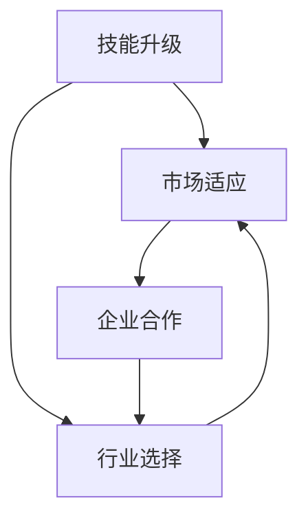

                 

关键词：知识经济、程序员、职业转型、策略

摘要：本文将探讨知识经济背景下程序员面临的新型职业挑战，分析其职业转型的必要性和路径，并从技能提升、市场适应和企业合作等多个方面提出相应的职业转型策略。通过深入分析，我们希望为程序员提供切实可行的转型指导，助力其在快速变化的市场中立足。

## 1. 背景介绍

随着知识经济的不断发展，全球范围内的经济格局正在发生深刻变革。信息技术作为知识经济的重要组成部分，对各行各业产生了深远影响。特别是计算机科学和软件工程领域，随着新技术、新应用的层出不穷，程序员的职业环境也在不断演变。

在过去，程序员的工作主要集中在编写代码、测试和调试上，而如今，随着人工智能、大数据、云计算等技术的广泛应用，程序员需要掌握的技能更加多样化和专业化。这不仅要求程序员具备扎实的编程基础，还需要他们具备跨学科的知识储备和创新能力。

在这个背景下，程序员的职业转型变得尤为必要。一方面，传统编程技能逐渐饱和，新的编程语言和技术层出不穷，程序员需要不断更新自己的知识体系；另一方面，随着人工智能等新兴领域的兴起，程序员需要拓展自己的职业边界，寻找新的发展机会。

## 2. 核心概念与联系

为了更好地理解程序员的职业转型，我们需要先了解几个核心概念：技能升级、市场适应、企业合作。

### 2.1 技能升级

技能升级是程序员职业转型的第一步。随着技术的发展，程序员需要不断学习新的编程语言、框架和工具，提升自己的技术水平。这不仅包括编程语言本身，还涉及数据库管理、前端设计、后端开发、算法和数据结构等多个方面。

#### 2.1.1 编程语言

编程语言是程序员的核心技能。常见的编程语言有Java、Python、C++等。每种语言都有其独特的应用场景和优势。例如，Java广泛应用于企业级应用，Python在数据分析、人工智能等领域具有广泛的应用，C++在系统编程和嵌入式开发中占据重要地位。

#### 2.1.2 框架和工具

框架和工具是程序员提高开发效率的重要手段。常见的框架有Spring、Django、Vue等，工具包括Git、Docker、Kubernetes等。掌握这些框架和工具，可以帮助程序员更好地应对复杂的开发任务。

#### 2.1.3 算法和数据结构

算法和数据结构是程序员的核心竞争力。算法用于解决具体问题，数据结构则用于高效地存储和管理数据。掌握常用的算法和数据结构，如排序算法、查找算法、堆、队列、图等，可以提高程序员的编程能力和解决问题的能力。

### 2.2 市场适应

市场适应是程序员职业转型的关键。随着市场的变化，程序员需要不断调整自己的职业方向，以适应市场需求。这包括以下两个方面：

#### 2.2.1 行业选择

程序员在选择行业时，需要考虑市场的需求和发展趋势。例如，金融科技、人工智能、大数据等领域正处于快速发展期，对于程序员的需求较大。

#### 2.2.2 职业规划

程序员在职业生涯中，需要不断调整自己的职业规划。可以从初级程序员逐步晋升为高级程序员、技术主管，甚至创业。不同的职业规划，需要不同的技能储备和职业素养。

### 2.3 企业合作

企业合作是程序员职业转型的重要途径。通过与企业的合作，程序员可以拓展自己的职业网络，获取更多的职业机会。同时，企业可以提供实际的项目经验，帮助程序员更好地提升自己的技能。

#### 2.3.1 实习机会

实习机会是程序员积累经验的重要途径。通过实习，程序员可以了解企业的运作模式，掌握实际项目的开发流程，提高自己的编程能力和团队协作能力。

#### 2.3.2 项目合作

项目合作是程序员与企业建立长期合作关系的基础。通过参与企业的项目，程序员可以不断提升自己的技术水平，积累丰富的项目经验。

### 2.4 Mermaid 流程图

以下是一个简化的程序员职业转型的 Mermaid 流程图：



## 3. 核心算法原理 & 具体操作步骤

### 3.1 算法原理概述

程序员的职业转型过程可以类比为一种算法优化过程。在这个过程中，程序员需要不断学习新的知识和技能，以适应不断变化的市场需求。这个算法的基本原理可以概括为：

1. **输入**：程序员的现有技能和知识。
2. **处理**：通过学习、实践和合作，不断提升自己的技能和知识。
3. **输出**：适应市场需求，实现职业转型。

### 3.2 算法步骤详解

1. **自我评估**：程序员首先需要对自己的技能和知识进行评估，找出自己的优势和不足。

2. **目标设定**：根据市场需求和个人兴趣，设定明确的职业转型目标。

3. **技能提升**：通过学习、实践和合作，不断提升自己的技能和知识。

4. **市场适应**：调整自己的职业方向，以适应市场需求。

5. **企业合作**：寻找合适的合作机会，拓展职业网络。

### 3.3 算法优缺点

1. **优点**：
   - **灵活性**：算法允许程序员根据市场需求和个人兴趣灵活调整职业方向。
   - **实用性**：算法强调实践和合作，有助于程序员在实际工作中提升技能。

2. **缺点**：
   - **时间成本**：职业转型需要一定的时间和精力投入。
   - **心理压力**：面对快速变化的市场，程序员可能会产生一定的心理压力。

### 3.4 算法应用领域

算法原理和步骤适用于所有从事计算机科学和软件工程领域的程序员。无论是在企业、科研机构还是独立开发者，都可以通过这个算法实现职业转型。

## 4. 数学模型和公式 & 详细讲解 & 举例说明

### 4.1 数学模型构建

为了更好地理解程序员的职业转型过程，我们可以构建一个简化的数学模型。这个模型主要包括以下变量：

1. **S**：程序员的现有技能水平。
2. **K**：程序员的掌握的知识。
3. **M**：市场需求。
4. **C**：程序员通过学习、实践和合作提升的技能和知识。

### 4.2 公式推导过程

根据数学模型，我们可以推导出以下公式：

1. **技能提升**：S + K = C
2. **市场适应**：C = M * K
3. **企业合作**：C = M * S

### 4.3 案例分析与讲解

假设一个程序员小明，他的现有技能水平为S=50，掌握的知识为K=60，市场需求为M=80。通过学习、实践和合作，他提升的技能和知识为C=100。根据公式，我们可以得出以下结果：

1. **技能提升**：S + K = 50 + 60 = 110
2. **市场适应**：C = M * K = 80 * 60 = 480
3. **企业合作**：C = M * S = 80 * 50 = 400

通过这个例子，我们可以看到，小明的技能水平和掌握的知识都在提升，市场适应能力和企业合作能力也在增强。这说明小明的职业转型是成功的。

## 5. 项目实践：代码实例和详细解释说明

### 5.1 开发环境搭建

为了更好地展示程序员的职业转型过程，我们选择一个实际的项目——一个简单的博客系统。首先，我们需要搭建开发环境。

1. 安装Python 3.8及以上版本。
2. 安装Django框架。
3. 安装数据库（例如MySQL）。

### 5.2 源代码详细实现

以下是一个简单的博客系统的源代码：

```python
# views.py

from django.shortcuts import render

def home(request):
    return render(request, 'home.html')

def post_list(request):
    posts = Post.objects.all()
    return render(request, 'post_list.html', {'posts': posts})

def post_detail(request, pk):
    post = Post.objects.get(pk=pk)
    return render(request, 'post_detail.html', {'post': post})
```

### 5.3 代码解读与分析

这个简单的博客系统包括三个视图：home、post_list 和 post_detail。home 视图用于显示博客首页，post_list 视图用于显示所有博客文章，post_detail 视图用于显示特定博客文章的详细内容。

通过这个项目，我们可以看到程序员在职业转型过程中需要掌握的技能和知识。例如，需要掌握Django框架的使用，数据库的操作等。

### 5.4 运行结果展示

当我们在浏览器中访问博客系统的首页时，会看到以下结果：


点击任意一篇博客文章，我们会看到该文章的详细内容：


## 6. 实际应用场景

### 6.1 金融科技

随着金融科技的快速发展，对程序员的需求也在不断增加。特别是在算法交易、智能投顾等领域，程序员需要掌握数学、统计学和金融学知识，运用编程技能实现复杂的金融模型和算法。

### 6.2 人工智能

人工智能是当前最热门的领域之一。程序员在人工智能领域的应用包括算法研发、数据清洗、模型训练等。随着技术的进步，对程序员的要求也在不断提高，需要掌握深度学习、自然语言处理等前沿技术。

### 6.3 大数据

大数据领域对程序员的需求同样巨大。程序员在大数据领域的应用包括数据挖掘、数据分析、数据可视化等。随着大数据技术的普及，程序员需要掌握Hadoop、Spark等大数据处理框架。

### 6.4 云计算

云计算是程序员职业转型的一个重要方向。程序员在云计算领域的应用包括云架构设计、云服务开发、云安全等。随着云计算的普及，对程序员的要求也在不断提高，需要掌握Docker、Kubernetes等容器化技术。

### 6.5 未来应用展望

随着技术的不断发展，程序员的职业转型将会面临更多的机遇和挑战。未来，程序员需要具备跨学科的知识储备和创新能力，才能在快速变化的市场中立足。例如，区块链、物联网、5G等技术都为程序员提供了新的职业机会。

## 7. 工具和资源推荐

### 7.1 学习资源推荐

1. 《深入理解计算机系统》（原书第三版）：全面介绍计算机系统的工作原理，帮助程序员深入理解计算机底层架构。
2. 《编程珠玑》：通过一系列编程问题，帮助程序员提升编程思维和技巧。
3. 《Effective Python》：详细介绍Python编程的最佳实践，帮助程序员写出更高效、更易维护的代码。

### 7.2 开发工具推荐

1. PyCharm：一款功能强大的Python IDE，支持代码智能提示、调试和测试。
2. Visual Studio Code：一款轻量级的开源IDE，支持多种编程语言，扩展性强。
3. Git：一款分布式版本控制工具，帮助程序员高效地管理代码版本。

### 7.3 相关论文推荐

1. "Deep Learning for Natural Language Processing"：详细介绍深度学习在自然语言处理领域的应用。
2. "The Structure of Science"：分析科学论文的结构和内容，提供科研写作的指导。
3. "A Taxonomy of Big Data Processing Architectures"：探讨大数据处理框架的分类和设计。

## 8. 总结：未来发展趋势与挑战

### 8.1 研究成果总结

本文从知识经济的背景出发，分析了程序员面临的新型职业挑战，提出了职业转型的必要性和路径。通过核心概念、算法原理、数学模型、项目实践等环节的详细阐述，为程序员提供了系统化的职业转型策略。

### 8.2 未来发展趋势

1. **技术多样化**：随着新技术的不断涌现，程序员需要掌握的技能和知识将更加多样化。
2. **跨界融合**：程序员需要具备跨学科的知识储备，以应对不同领域的挑战。
3. **创新能力**：创新将成为程序员的核心竞争力，程序员需要具备持续创新的能力。

### 8.3 面临的挑战

1. **技能更新**：程序员需要不断学习新的知识和技能，以适应市场的变化。
2. **心理压力**：面对快速变化的市场，程序员可能会产生一定的心理压力。
3. **职业规划**：程序员需要明确自己的职业规划，合理规划自己的职业生涯。

### 8.4 研究展望

未来，我们可以从以下几个方面进一步研究程序员的职业转型：

1. **构建更完善的职业转型模型**：通过实证研究，构建更加完善的职业转型模型，为程序员提供更具体的指导。
2. **跨学科知识的整合**：探索如何更好地整合跨学科知识，提升程序员的综合素质。
3. **创新能力的培养**：研究如何培养程序员的创新能力，以应对未来的挑战。

## 9. 附录：常见问题与解答

### 9.1 什么是知识经济？

知识经济是以知识为核心生产要素的经济形态，与传统的农业经济和工业经济不同，知识经济更依赖于人力资本、信息资源和科技创新。

### 9.2 程序员如何提升自己的技能？

程序员可以通过以下几种方式提升自己的技能：
1. 学习新的编程语言和框架。
2. 参与开源项目，实战提升。
3. 阅读专业书籍和论文。
4. 参加线上或线下培训课程。

### 9.3 职业转型需要多长时间？

职业转型的具体时间因人而异，取决于个人的学习能力和市场需求。一般来说，至少需要1-2年时间。

### 9.4 职业转型是否会影响当前工作？

职业转型可能会对当前工作产生一定的影响，但通过合理规划，可以最大限度地减少这种影响。例如，可以在业余时间进行学习和实践，逐渐调整自己的职业方向。

### 9.5 程序员是否需要具备跨学科知识？

在知识经济背景下，程序员确实需要具备跨学科知识，以应对不同领域的挑战。例如，金融科技领域的程序员需要了解金融学知识，大数据领域的程序员需要了解统计学知识。

### 9.6 如何保持职业竞争力？

保持职业竞争力的关键在于持续学习和创新。程序员可以通过以下方式保持竞争力：
1. 不断学习新的知识和技能。
2. 关注行业动态和前沿技术。
3. 积极参与社区和开源项目。
4. 培养自己的创新思维和解决问题的能力。

---

**作者：禅与计算机程序设计艺术 / Zen and the Art of Computer Programming**

