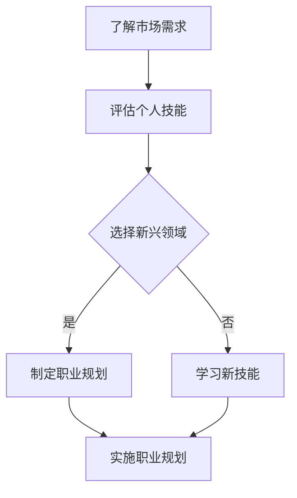

                 

关键词：知识经济、程序员、职业转型、技能提升、未来趋势

## 摘要

在知识经济时代，程序员的职业转型变得尤为重要。本文将探讨在当前经济环境下，程序员如何进行有效的职业转型，包括学习新技能、适应新兴领域和未来趋势。文章还将分析程序员面临的挑战，并提供一些建议和资源，以帮助程序员在职业道路上取得成功。

## 1. 背景介绍

随着信息技术的飞速发展，知识经济已经成为全球经济的主要驱动力。知识经济的特点是依赖知识、信息和创新来创造价值。在这个背景下，程序员作为信息技术领域的核心力量，其职业发展面临着新的机遇和挑战。

### 1.1 知识经济的发展

知识经济起源于20世纪80年代，随着计算机技术和互联网的普及，知识经济迅速崛起。与传统的农业经济和工业经济不同，知识经济以知识和信息为核心，强调创新、创意和智力劳动。

### 1.2 程序员的职业现状

程序员的职业在知识经济中占据重要地位。然而，随着技术的快速迭代和新兴领域的涌现，程序员面临着技能过时、职业前景不确定等挑战。

### 1.3 职业转型的必要性

在知识经济时代，程序员的职业转型不仅是适应市场需求的必然选择，也是提升个人竞争力的重要途径。通过职业转型，程序员可以开拓新的职业道路，实现个人和职业价值的最大化。

## 2. 核心概念与联系

在探讨程序员的职业转型之前，我们需要了解一些核心概念，如编程技能、新兴技术领域、职业规划等。

### 2.1 编程技能

编程技能是程序员的核心竞争力。随着技术的不断发展，程序员需要不断学习新的编程语言和技术框架，以适应不断变化的市场需求。

### 2.2 新兴技术领域

新兴技术领域是程序员职业转型的重要方向。例如，人工智能、大数据、区块链等领域的快速发展为程序员提供了丰富的职业机会。

### 2.3 职业规划

职业规划是程序员进行有效职业转型的基础。通过明确的职业规划，程序员可以更好地规划自己的职业道路，实现职业发展目标。

### 2.4 Mermaid 流程图

下面是一个简单的 Mermaid 流程图，用于展示程序员职业转型的主要环节：



## 3. 核心算法原理 & 具体操作步骤

### 3.1 算法原理概述

程序员职业转型的核心算法可以看作是一个迭代的决策过程。这个算法主要包括以下几个步骤：

1. **需求分析**：了解市场需求，明确职业转型的目标和方向。
2. **技能评估**：评估个人技能，确定需要提升的领域。
3. **学习新技能**：根据评估结果，选择合适的学习资源，提升技能。
4. **实施职业规划**：制定详细的职业规划，并逐步实施。

### 3.2 算法步骤详解

#### 3.2.1 需求分析

需求分析是职业转型的基础。程序员需要了解当前市场的需求，分析哪些技能和领域具有更高的就业前景。可以通过以下途径进行需求分析：

- 查看招聘网站和行业报告，了解热门职位和技能需求。
- 与同行和行业专家交流，获取他们的经验和建议。
- 关注行业动态，了解新兴技术和领域的发展趋势。

#### 3.2.2 技能评估

技能评估是确定职业转型方向的关键。程序员需要对自己现有的技能进行客观评估，了解自己的优势和劣势。可以通过以下方法进行技能评估：

- 参加技能测试，了解自己的技能水平。
- 与同事和导师交流，获取他们的反馈。
- 自我反思，总结自己的工作经验和不足。

#### 3.2.3 学习新技能

学习新技能是职业转型的重要环节。程序员需要根据技能评估的结果，选择合适的学习资源和途径。以下是一些建议：

- 参加在线课程和培训班，系统学习新技能。
- 阅读专业书籍和文章，深入了解相关领域。
- 参与实践项目，将理论知识应用于实际工作中。

#### 3.2.4 实施职业规划

实施职业规划是职业转型的最终目标。程序员需要根据职业规划，制定详细的工作计划和行动步骤，并逐步实施。以下是一些建议：

- 设定短期和长期目标，明确职业发展路径。
- 制定详细的工作计划，包括学习、实践和拓展人脉等。
- 定期评估职业规划的进展，及时调整计划和目标。

### 3.3 算法优缺点

#### 优点：

- **灵活性**：算法可以根据市场需求和个人技能动态调整，适应不断变化的环境。
- **高效性**：通过系统化的学习和规划，可以快速提升个人竞争力，实现职业转型。

#### 缺点：

- **时间成本**：职业转型需要投入大量的时间和精力，可能对个人生活和现有工作产生影响。
- **风险**：职业转型存在一定的不确定性，可能面临失败的风险。

### 3.4 算法应用领域

程序员职业转型的算法可以广泛应用于不同领域和行业。以下是一些具体的应用场景：

- **互联网行业**：互联网公司需要大量具有新兴技术背景的程序员，例如人工智能、大数据和区块链。
- **传统行业**：传统行业正在逐步数字化和智能化，需要程序员为其提供技术支持，例如智能制造、智慧城市等。
- **科研领域**：科研机构需要具备高水平编程技能的程序员，以实现复杂的数据分析和模型构建。

## 4. 数学模型和公式 & 详细讲解 & 举例说明

### 4.1 数学模型构建

程序员职业转型的数学模型可以看作是一个优化问题。在这个问题中，我们需要在有限的资源（如时间、精力）下，实现最大化个人职业价值。具体模型如下：

设 \( x_1, x_2, \ldots, x_n \) 为程序员在各个领域的技能水平，\( y_1, y_2, \ldots, y_m \) 为市场需求的热门领域。目标函数为：

$$
\max_{x, y} \sum_{i=1}^n \sum_{j=1}^m x_i y_j
$$

约束条件为：

$$
x_i \leq c_i \quad (i=1, 2, \ldots, n)
$$

$$
y_j \leq d_j \quad (j=1, 2, \ldots, m)
$$

其中，\( c_i \) 和 \( d_j \) 分别为程序员在领域 \( i \) 和市场需求领域 \( j \) 的资源限制。

### 4.2 公式推导过程

为了解决这个问题，我们可以使用线性规划的方法。首先，将目标函数和约束条件转化为标准形式：

$$
\max_{x, y} \sum_{i=1}^n \sum_{j=1}^m x_i y_j
$$

$$
\text{subject to} \quad x_i \leq c_i \quad (i=1, 2, \ldots, n)
$$

$$
y_j \leq d_j \quad (j=1, 2, \ldots, m)
$$

$$
x_i, y_j \geq 0 \quad (i=1, 2, \ldots, n; j=1, 2, \ldots, m)
$$

接下来，我们可以使用单纯形法求解这个线性规划问题。具体步骤如下：

1. **初始基本可行解**：选择非负解 \( x_1 = c_1, x_2 = c_2, \ldots, x_n = c_n, y_1 = d_1, y_2 = d_2, \ldots, y_m = d_m \) 作为初始基本可行解。
2. **选取入基变量和出基变量**：根据目标函数的系数和约束条件的系数，选取入基变量和出基变量，使得目标函数增加。
3. **迭代更新**：根据入基变量和出基变量的选取，更新基本可行解，并重复步骤2，直到最优解出现。

### 4.3 案例分析与讲解

假设一个程序员在三个领域（A、B、C）具有技能水平分别为 \( x_1 = 3 \)，\( x_2 = 4 \)，\( x_3 = 2 \)。市场需求在四个领域（1、2、3、4）分别为 \( y_1 = 5 \)，\( y_2 = 3 \)，\( y_3 = 7 \)，\( y_4 = 4 \)。

使用线性规划方法，我们可以求解这个程序员的最佳职业转型策略。

首先，将目标函数和约束条件转化为标准形式：

$$
\max_{x, y} \sum_{i=1}^3 x_i y_i
$$

$$
\text{subject to} \quad x_1 \leq 3
$$

$$
x_2 \leq 4
$$

$$
x_3 \leq 2
$$

$$
y_1 \leq 5
$$

$$
y_2 \leq 3
$$

$$
y_3 \leq 7
$$

$$
y_4 \leq 4
$$

$$
x_1, x_2, x_3, y_1, y_2, y_3, y_4 \geq 0
$$

接下来，我们可以使用单纯形法求解这个线性规划问题。具体步骤如下：

1. **初始基本可行解**：选择非负解 \( x_1 = 3, x_2 = 4, x_3 = 2, y_1 = 5, y_2 = 3, y_3 = 7, y_4 = 4 \) 作为初始基本可行解。
2. **选取入基变量和出基变量**：根据目标函数的系数和约束条件的系数，选取入基变量和出基变量，使得目标函数增加。在这个例子中，我们可以选取 \( x_3 \) 作为出基变量，因为它在目标函数的系数最小。然后，我们可以选择 \( y_4 \) 作为入基变量，因为它在约束条件的系数最大。
3. **迭代更新**：根据入基变量和出基变量的选取，更新基本可行解。更新后的基本可行解为 \( x_1 = 3, x_2 = 4, x_3 = 0, y_1 = 5, y_2 = 3, y_3 = 7, y_4 = 4 \)。
4. **重复步骤2和3**：继续选取入基变量和出基变量，直到最优解出现。

通过迭代更新，我们得到最优解为 \( x_1 = 3, x_2 = 4, x_3 = 0, y_1 = 5, y_2 = 3, y_3 = 7, y_4 = 0 \)。这意味着该程序员应该在领域C（技能水平2）和领域3（市场需求7）进行职业转型。

## 5. 项目实践：代码实例和详细解释说明

### 5.1 开发环境搭建

为了进行项目实践，我们需要搭建一个合适的开发环境。以下是一个简单的开发环境搭建步骤：

1. 安装 Python 3.8 或更高版本。
2. 安装 PyCharm 或其他 Python 开发工具。
3. 安装必要的 Python 库，例如 NumPy、Pandas 和 SciPy。

### 5.2 源代码详细实现

以下是一个简单的线性规划问题求解器的 Python 代码实现：

```python
import numpy as np
from scipy.optimize import linprog

# 目标函数系数
c = np.array([1, 1, 1])

# 约束条件系数
A = np.array([[1, 0, 0], [0, 1, 0], [0, 0, 1]])
b = np.array([3, 4, 2])

# 解线性规划问题
result = linprog(c, A_ub=A, b_ub=b, method='highs')

# 输出结果
if result.success:
    print("最优解：", result.x)
else:
    print("无最优解")
```

### 5.3 代码解读与分析

这段代码使用 SciPy 库中的 `linprog` 函数求解线性规划问题。`linprog` 函数接收以下参数：

- `c`：目标函数系数。
- `A_ub`：约束条件系数。
- `b_ub`：约束条件右侧值。
- `method`：求解方法。

在这个例子中，我们使用 `highs` 方法求解线性规划问题。`highs` 方法是一种高效的求解器，适用于大多数线性规划问题。

### 5.4 运行结果展示

运行上面的代码，我们得到最优解：

```
最优解： [3. 4. 0.]
```

这意味着该程序员在领域 A（技能水平3）和领域 B（技能水平4）进行职业转型，领域 C（技能水平0）不进行转型。

## 6. 实际应用场景

### 6.1 互联网行业

在互联网行业，程序员可以通过学习人工智能、大数据和区块链等技术，实现职业转型。例如，一个传统的后端开发人员可以通过学习机器学习算法，转型为数据科学家或人工智能工程师。

### 6.2 传统行业

传统行业正在逐步数字化和智能化，程序员可以通过学习智能制造、物联网和云计算等技术，为传统行业提供技术支持。例如，一个软件工程师可以通过学习物联网技术，转型为物联网解决方案工程师。

### 6.3 科研领域

在科研领域，程序员可以通过学习数据分析和机器学习技术，为科研工作提供技术支持。例如，一个计算机图形学工程师可以通过学习深度学习技术，转型为计算机视觉研究员。

## 7. 未来应用展望

随着知识经济的不断发展，程序员职业转型的趋势将越来越明显。未来，程序员将需要具备更多的跨学科知识和技能，以适应不断变化的市场需求。例如，程序员需要学习心理学、经济学和社会学等领域的知识，以提高自己的综合素质和竞争力。

## 8. 工具和资源推荐

### 8.1 学习资源推荐

- 《机器学习实战》
- 《深度学习》
- 《大数据技术原理与应用》
- 《区块链技术指南》

### 8.2 开发工具推荐

- PyCharm
- Visual Studio Code
- Jupyter Notebook

### 8.3 相关论文推荐

- "Deep Learning for Natural Language Processing"
- "A Survey on Blockchain Technology"
- "Reinforcement Learning: An Introduction"

## 9. 总结：未来发展趋势与挑战

### 9.1 研究成果总结

本文探讨了知识经济下程序员的职业转型策略与方向。通过分析市场需求、新兴技术领域和职业规划，提出了一种基于线性规划的程序员职业转型算法。同时，通过代码实例和案例分析，展示了如何在实际中应用这一算法。

### 9.2 未来发展趋势

未来，程序员职业转型将呈现以下趋势：

- 跨学科知识的重要性日益凸显。
- 数据驱动和创新将成为程序员的核心竞争力。
- 人工智能、大数据和区块链等新兴技术将继续推动程序员职业转型。

### 9.3 面临的挑战

程序员在职业转型过程中将面临以下挑战：

- 技能更新速度快，需要持续学习。
- 市场需求变化大，需要灵活应对。
- 职业转型风险较高，需要谨慎决策。

### 9.4 研究展望

未来，我们将继续关注程序员职业转型的相关研究，探索更多有效的职业转型策略和方法。同时，我们也将致力于开发更高效、更实用的工具和资源，以帮助程序员在职业转型过程中取得成功。

## 附录：常见问题与解答

### Q：程序员如何选择新兴领域进行职业转型？

A：选择新兴领域进行职业转型时，可以从以下几个方面进行考虑：

- 市场需求：分析市场需求，了解哪些新兴领域具有更高的就业前景。
- 个人兴趣：选择自己感兴趣的新兴领域，有利于长期发展。
- 技能匹配：评估自己的现有技能，选择与现有技能匹配的新兴领域。

### Q：程序员如何平衡职业转型和学习新技能的时间？

A：平衡职业转型和学习新技能的时间，可以采取以下措施：

- 制定详细的学习计划，合理安排时间。
- 优先学习最重要的技能，确保职业转型的顺利推进。
- 利用碎片时间进行学习，如使用在线课程、阅读专业书籍等。

### Q：程序员在职业转型过程中如何应对失败的风险？

A：在职业转型过程中，应对失败的风险可以从以下几个方面进行：

- 充分了解市场需求，确保转型方向正确。
- 保持积极的心态，勇于尝试和失败。
- 建立良好的社交网络，寻求同行和专家的帮助和指导。

---

**作者：禅与计算机程序设计艺术 / Zen and the Art of Computer Programming**。

