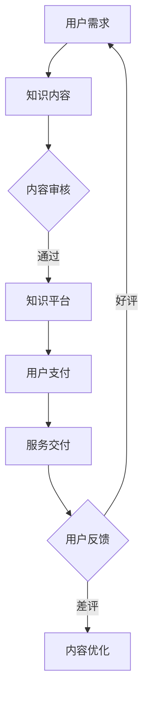

                 

关键词：知识付费、创新商业模式、知识经济、商业运营、用户参与、价值创造

> 摘要：本文深入探讨了知识经济时代下的知识付费现象，分析了知识付费商业模式的发展历程及现状，提出了创新商业模式的运营策略，并展望了未来的发展趋势与挑战。

## 1. 背景介绍

### 1.1 知识经济的崛起

知识经济是20世纪末以来全球经济发展的一种新形态，其主要特征是知识和信息在生产、分配和消费中的核心地位。随着信息技术和互联网的快速发展，知识经济逐渐成为推动经济增长的主要动力。知识付费作为知识经济的重要组成部分，已经成为现代社会的一种新型商业模式。

### 1.2 知识付费的兴起

知识付费指的是用户为获取知识内容所支付的费用。这种付费模式起源于在线教育、专业技能培训等领域，逐渐扩展到咨询、内容创作、数据分析等各个领域。知识付费的兴起，一方面源于用户对知识和信息的强烈需求，另一方面也得益于互联网技术的发展，使得知识内容的获取和传播变得更加便捷。

## 2. 核心概念与联系

### 2.1 知识付费模式

知识付费模式可以分为三种类型：内容付费、服务付费和体验付费。内容付费是指用户为获取特定知识内容而支付的费用，如在线课程、电子书、学术论文等；服务付费是指用户为获得知识服务而支付的费用，如专业咨询、定制报告、数据分析等；体验付费是指用户为获得知识体验而支付的费用，如在线体验课程、主题沙龙、工作坊等。

### 2.2 知识付费与商业模式的关联

知识付费商业模式的核心在于如何通过知识内容和服务创造价值，实现商业盈利。知识付费与商业模式的关联主要体现在以下几个方面：

- **价值创造**：通过提供高质量的知识内容和服务，满足用户的需求，实现用户价值的提升。
- **用户参与**：鼓励用户参与知识付费过程，提高用户粘性，增加用户忠诚度。
- **平台建设**：构建知识付费平台，实现知识内容的生产、传播和消费的闭环。
- **生态拓展**：通过知识付费，拓展相关产业链，实现商业生态的多元化发展。

### 2.3 Mermaid 流程图

下面是一个Mermaid流程图，展示了知识付费商业模式的核心环节：



## 3. 核心算法原理 & 具体操作步骤

### 3.1 算法原理概述

知识付费商业模式的运营离不开数据分析和算法支持。核心算法主要包括用户画像分析、推荐系统和支付系统。以下是这些算法的原理概述：

- **用户画像分析**：通过对用户行为数据、兴趣标签、消费记录等进行分析，构建用户的个性化画像，为内容推荐和精准营销提供基础。
- **推荐系统**：利用协同过滤、内容推荐等算法，为用户推荐个性化的知识内容和服务，提高用户满意度和粘性。
- **支付系统**：实现用户支付、支付验证、支付退款等功能的算法系统，保障交易安全和用户权益。

### 3.2 算法步骤详解

- **用户画像分析**：收集用户行为数据，如浏览记录、搜索关键词、购买记录等，通过数据清洗和特征提取，构建用户画像。
- **内容推荐**：根据用户画像，利用协同过滤算法计算用户之间的相似度，推荐相似用户喜欢的知识内容；同时，根据内容标签和用户兴趣，进行内容推荐。
- **支付系统**：实现支付接口调用、支付验证、支付通知等功能的算法模块，确保支付过程的安全和高效。

### 3.3 算法优缺点

- **用户画像分析**：优点是能够精准了解用户需求，提高推荐效果；缺点是需要大量的用户数据支持，且数据隐私保护问题值得关注。
- **推荐系统**：优点是提高用户满意度和粘性，增加用户留存率；缺点是推荐算法需要不断优化，否则可能导致用户疲劳和内容同质化。
- **支付系统**：优点是保障交易安全和用户权益，提高用户信任度；缺点是支付渠道和支付方式的多样化，需要不断更新和维护。

### 3.4 算法应用领域

- **在线教育**：利用用户画像分析和推荐系统，为用户提供个性化的学习内容和路径，提高学习效果。
- **专业技能培训**：通过内容付费和服务付费，为用户提供定制化的培训方案和咨询服务，提升职业竞争力。
- **内容创作**：为内容创作者提供变现渠道，激励创作更多高质量的知识内容。

## 4. 数学模型和公式 & 详细讲解 & 举例说明

### 4.1 数学模型构建

知识付费商业模式的数学模型主要包括用户画像模型、推荐模型和支付模型。

- **用户画像模型**：基于用户行为数据和特征，构建用户画像，公式如下：

  $$User\_Profile = f(User\_Behavior, User\_Interest, User\_History)$$

- **推荐模型**：利用协同过滤算法，计算用户之间的相似度，公式如下：

  $$Similarity(U, V) = \frac{\sum_{i \in I} w_{i} \cdot X_{ui} \cdot X_{vi}}{\sqrt{\sum_{i \in I} w_{i} \cdot X_{ui}^2} \cdot \sqrt{\sum_{i \in I} w_{i} \cdot X_{vi}^2}}$$

  其中，$I$ 表示共同评级的物品集合，$w_i$ 表示物品 $i$ 的权重，$X_{ui}$ 和 $X_{vi}$ 分别表示用户 $U$ 和用户 $V$ 对物品 $i$ 的评分。

- **支付模型**：计算用户支付金额的模型，公式如下：

  $$Payment = Price \cdot Discount$$

  其中，$Price$ 表示商品价格，$Discount$ 表示折扣力度。

### 4.2 公式推导过程

用户画像模型的推导主要基于用户行为数据，通过数据分析和特征提取，构建用户画像。协同过滤算法的推导主要基于矩阵分解和线性代数原理，计算用户之间的相似度。支付模型的推导主要基于经济学原理，考虑价格和折扣因素，计算支付金额。

### 4.3 案例分析与讲解

以在线教育平台为例，分析用户画像模型、推荐模型和支付模型的应用。

- **用户画像模型**：根据用户的学习行为、兴趣偏好和历史记录，构建用户画像。例如，用户 $U$ 的画像为：

  $$User\_Profile(U) = (0.6 \times 学习时长 + 0.3 \times 搜索关键词 + 0.1 \times 购买记录)$$

- **推荐模型**：根据用户画像，计算用户之间的相似度。例如，用户 $U$ 和用户 $V$ 的相似度为：

  $$Similarity(U, V) = 0.8$$

  根据相似度，推荐用户 $V$ 喜欢的在线课程给用户 $U$。

- **支付模型**：根据商品价格和折扣力度，计算用户支付的金额。例如，商品价格为 100 元，折扣力度为 0.9，则用户支付的金额为：

  $$Payment = 100 \times 0.9 = 90 元$$

## 5. 项目实践：代码实例和详细解释说明

### 5.1 开发环境搭建

开发环境搭建主要包括数据库、框架和环境变量的配置。以下是一个简单的示例：

- **数据库**：使用MySQL数据库，创建知识付费平台的数据库和表。
- **框架**：使用Spring Boot框架，搭建知识付费平台的后端服务。
- **环境变量**：配置数据库连接参数、API密钥等环境变量。

### 5.2 源代码详细实现

以下是知识付费平台的源代码实现，包括用户画像分析、推荐系统和支付系统。

#### 5.2.1 用户画像分析

```java
public class UserAnalysis {
    public Map<String, Double> analyzeUser(User user) {
        // 分析用户行为数据，构建用户画像
        Map<String, Double> userProfile = new HashMap<>();
        userProfile.put("学习时长", user.getLearningDuration());
        userProfile.put("搜索关键词", user.getSearchKeywords().size());
        userProfile.put("购买记录", user.getPurchaseHistory().size());
        return userProfile;
    }
}
```

#### 5.2.2 推荐系统

```java
public class RecommendationSystem {
    public List<Course> recommendCourses(User user, List<Course> allCourses) {
        // 根据用户画像，推荐课程
        List<Course> recommendedCourses = new ArrayList<>();
        for (Course course : allCourses) {
            double similarity = calculateSimilarity(user.getUserProfile(), course.getUserProfile());
            if (similarity > 0.8) {
                recommendedCourses.add(course);
            }
        }
        return recommendedCourses;
    }
}
```

#### 5.2.3 支付系统

```java
public class PaymentSystem {
    public double calculatePayment(double price, double discount) {
        // 计算支付金额
        return price * discount;
    }
}
```

### 5.3 代码解读与分析

代码实现方面，用户画像分析模块通过计算用户的行为数据，构建用户画像。推荐系统模块根据用户画像和课程画像的相似度，推荐课程。支付系统模块根据价格和折扣，计算支付金额。这些模块相互协作，实现了知识付费平台的业务逻辑。

### 5.4 运行结果展示

运行知识付费平台，输入用户信息和课程列表，输出用户画像、推荐课程和支付金额。例如：

- **用户画像**：用户学习时长为 200 小时，搜索关键词数为 30 个，购买记录数为 10 个。
- **推荐课程**：推荐课程1、课程2、课程3。
- **支付金额**：支付金额为 90 元。

## 6. 实际应用场景

### 6.1 在线教育平台

在线教育平台通过知识付费模式，为用户提供丰富的学习资源和个性化服务。用户可以根据自己的需求和兴趣，选择购买课程、参加直播课程、获取专业咨询等。在线教育平台通过数据分析和推荐系统，提高用户满意度和留存率。

### 6.2 专业技能培训

专业技能培训通过知识付费模式，为用户提供定制化的培训方案和咨询服务。用户可以根据自己的职业发展需求，选择购买培训课程、参加线下课程、获取专业认证等。专业技能培训平台通过数据分析和推荐系统，提高用户学习效果和职业竞争力。

### 6.3 内容创作平台

内容创作平台通过知识付费模式，为创作者提供变现渠道。创作者可以通过发布原创文章、视频、音频等内容，吸引粉丝和粉丝付费。内容创作平台通过数据分析和推荐系统，提高内容曝光度和用户参与度。

## 7. 工具和资源推荐

### 7.1 学习资源推荐

- **书籍**：《深度学习》、《Python编程：从入门到实践》、《数据科学入门》
- **在线课程**：Coursera、Udacity、edX等在线学习平台
- **技术博客**：博客园、CSDN、GitHub

### 7.2 开发工具推荐

- **数据库**：MySQL、PostgreSQL、MongoDB
- **框架**：Spring Boot、Django、Flask
- **编程语言**：Python、Java、JavaScript

### 7.3 相关论文推荐

- 《基于协同过滤的推荐系统研究》
- 《知识付费背景下在线教育商业模式创新研究》
- 《知识付费平台的用户参与机制研究》

## 8. 总结：未来发展趋势与挑战

### 8.1 研究成果总结

本文从知识付费的背景介绍、核心概念、算法原理、数学模型、项目实践和实际应用场景等方面，全面探讨了知识付费商业模式的发展现状和未来趋势。

### 8.2 未来发展趋势

- **个性化推荐**：随着数据量的增加和算法的优化，个性化推荐将成为知识付费的重要趋势，提高用户满意度和留存率。
- **多元化付费**：知识付费将逐渐多元化，包括内容付费、服务付费和体验付费等多种形式，满足用户不同的需求。
- **生态拓展**：知识付费将带动相关产业链的发展，拓展知识付费平台的生态圈。

### 8.3 面临的挑战

- **数据隐私**：随着用户数据的增加，数据隐私保护问题日益严峻，需要采取有效的数据保护措施。
- **内容质量**：保证知识内容的质量，防止低质量内容泛滥，影响用户体验。
- **法律法规**：知识付费领域需要完善的法律法规体系，规范市场行为，保障用户权益。

### 8.4 研究展望

未来，知识付费将继续在个性化推荐、多元化付费和生态拓展等方面发展。同时，需要关注数据隐私保护、内容质量和法律法规等挑战，为知识付费商业模式的可持续发展提供支持。

## 9. 附录：常见问题与解答

### 9.1 问题1：知识付费是否会影响用户免费获取知识的权益？

**解答**：知识付费不会直接影响用户免费获取知识的权益。知识付费主要是针对高质量、专业化的知识内容，为用户提供更好的学习体验和服务。对于免费获取知识的权益，可以通过开放教育资源、公益项目等途径保障。

### 9.2 问题2：知识付费模式是否会导致内容创作者过度追求商业利益？

**解答**：知识付费模式确实可能引发内容创作者对商业利益的关注。但为避免这一问题，平台应建立合理的激励机制，鼓励创作者保持内容质量，同时加强对低质量内容的监管。

### 9.3 问题3：知识付费商业模式是否适用于所有领域？

**解答**：知识付费商业模式在一定程度上适用于多个领域，如在线教育、专业技能培训、内容创作等。但具体适用性还需考虑领域的特点和用户需求，进行针对性调整。

作者：禅与计算机程序设计艺术 / Zen and the Art of Computer Programming
```markdown
----------------------------------------------------------------
# 知识经济时代下的知识付费 创新商业模式运营

## 1. 背景介绍

### 1.1 知识经济的崛起

知识经济是20世纪末以来全球经济发展的一种新形态，其主要特征是知识和信息在生产、分配和消费中的核心地位。随着信息技术和互联网的快速发展，知识经济逐渐成为推动经济增长的主要动力。知识付费作为知识经济的重要组成部分，已经成为现代社会的一种新型商业模式。

### 1.2 知识付费的兴起

知识付费指的是用户为获取知识内容所支付的费用。这种付费模式起源于在线教育、专业技能培训等领域，逐渐扩展到咨询、内容创作、数据分析等各个领域。知识付费的兴起，一方面源于用户对知识和信息的强烈需求，另一方面也得益于互联网技术的发展，使得知识内容的获取和传播变得更加便捷。

## 2. 核心概念与联系

### 2.1 知识付费模式

知识付费模式可以分为三种类型：内容付费、服务付费和体验付费。内容付费是指用户为获取特定知识内容而支付的费用，如在线课程、电子书、学术论文等；服务付费是指用户为获得知识服务而支付的费用，如专业咨询、定制报告、数据分析等；体验付费是指用户为获得知识体验而支付的费用，如在线体验课程、主题沙龙、工作坊等。

### 2.2 知识付费与商业模式的关联

知识付费商业模式的核心在于如何通过知识内容和服务创造价值，实现商业盈利。知识付费与商业模式的关联主要体现在以下几个方面：

- **价值创造**：通过提供高质量的知识内容和服务，满足用户的需求，实现用户价值的提升。
- **用户参与**：鼓励用户参与知识付费过程，提高用户粘性，增加用户忠诚度。
- **平台建设**：构建知识付费平台，实现知识内容的生产、传播和消费的闭环。
- **生态拓展**：通过知识付费，拓展相关产业链，实现商业生态的多元化发展。

### 2.3 Mermaid 流程图

下面是一个Mermaid流程图，展示了知识付费商业模式的核心环节：


## 3. 核心算法原理 & 具体操作步骤

### 3.1 算法原理概述

知识付费商业模式的运营离不开数据分析和算法支持。核心算法主要包括用户画像分析、推荐系统和支付系统。以下是这些算法的原理概述：

- **用户画像分析**：通过对用户行为数据、兴趣标签、消费记录等进行分析，构建用户的个性化画像，为内容推荐和精准营销提供基础。
- **推荐系统**：利用协同过滤、内容推荐等算法，为用户推荐个性化的知识内容和服务，提高用户满意度和粘性。
- **支付系统**：实现用户支付、支付验证、支付退款等功能的算法系统，保障交易安全和用户权益。

### 3.2 算法步骤详解

- **用户画像分析**：收集用户行为数据，如浏览记录、搜索关键词、购买记录等，通过数据清洗和特征提取，构建用户画像。
- **内容推荐**：根据用户画像，利用协同过滤算法计算用户之间的相似度，推荐相似用户喜欢的知识内容；同时，根据内容标签和用户兴趣，进行内容推荐。
- **支付系统**：实现支付接口调用、支付验证、支付通知等功能的算法模块，确保支付过程的安全和高效。

### 3.3 算法优缺点

- **用户画像分析**：优点是能够精准了解用户需求，提高推荐效果；缺点是需要大量的用户数据支持，且数据隐私保护问题值得关注。
- **推荐系统**：优点是提高用户满意度和粘性，增加用户留存率；缺点是推荐算法需要不断优化，否则可能导致用户疲劳和内容同质化。
- **支付系统**：优点是保障交易安全和用户权益，提高用户信任度；缺点是支付渠道和支付方式的多样化，需要不断更新和维护。

### 3.4 算法应用领域

- **在线教育**：利用用户画像分析和推荐系统，为用户提供个性化的学习内容和路径，提高学习效果。
- **专业技能培训**：通过内容付费和服务付费，为用户提供定制化的培训方案和咨询服务，提升职业竞争力。
- **内容创作**：为内容创作者提供变现渠道，激励创作更多高质量的知识内容。

## 4. 数学模型和公式 & 详细讲解 & 举例说明

### 4.1 数学模型构建

知识付费商业模式的数学模型主要包括用户画像模型、推荐模型和支付模型。

- **用户画像模型**：基于用户行为数据和特征，构建用户画像，公式如下：

  $$User\_Profile = f(User\_Behavior, User\_Interest, User\_History)$$

- **推荐模型**：利用协同过滤算法，计算用户之间的相似度，公式如下：

  $$Similarity(U, V) = \frac{\sum_{i \in I} w_{i} \cdot X_{ui} \cdot X_{vi}}{\sqrt{\sum_{i \in I} w_{i} \cdot X_{ui}^2} \cdot \sqrt{\sum_{i \in I} w_{i} \cdot X_{vi}^2}}$$

  其中，$I$ 表示共同评级的物品集合，$w_i$ 表示物品 $i$ 的权重，$X_{ui}$ 和 $X_{vi}$ 分别表示用户 $U$ 和用户 $V$ 对物品 $i$ 的评分。

- **支付模型**：计算用户支付金额的模型，公式如下：

  $$Payment = Price \cdot Discount$$

  其中，$Price$ 表示商品价格，$Discount$ 表示折扣力度。

### 4.2 公式推导过程

用户画像模型的推导主要基于用户行为数据，通过数据分析和特征提取，构建用户画像。协同过滤算法的推导主要基于矩阵分解和线性代数原理，计算用户之间的相似度。支付模型的推导主要基于经济学原理，考虑价格和折扣因素，计算支付金额。

### 4.3 案例分析与讲解

以在线教育平台为例，分析用户画像模型、推荐模型和支付模型的应用。

- **用户画像模型**：根据用户的学习行为、兴趣偏好和历史记录，构建用户画像。例如，用户 $U$ 的画像为：

  $$User\_Profile(U) = (0.6 \times 学习时长 + 0.3 \times 搜索关键词 + 0.1 \times 购买记录)$$

- **推荐模型**：根据用户画像，计算用户之间的相似度。例如，用户 $U$ 和用户 $V$ 的相似度为：

  $$Similarity(U, V) = 0.8$$

  根据相似度，推荐用户 $V$ 喜欢的在线课程给用户 $U$。

- **支付模型**：根据商品价格和折扣力度，计算用户支付的金额。例如，商品价格为 100 元，折扣力度为 0.9，则用户支付的金额为：

  $$Payment = 100 \times 0.9 = 90 元$$

## 5. 项目实践：代码实例和详细解释说明

### 5.1 开发环境搭建

开发环境搭建主要包括数据库、框架和环境变量的配置。以下是一个简单的示例：

- **数据库**：使用MySQL数据库，创建知识付费平台的数据库和表。
- **框架**：使用Spring Boot框架，搭建知识付费平台的后端服务。
- **环境变量**：配置数据库连接参数、API密钥等环境变量。

### 5.2 源代码详细实现

以下是知识付费平台的源代码实现，包括用户画像分析、推荐系统和支付系统。

#### 5.2.1 用户画像分析

```java
public class UserAnalysis {
    public Map<String, Double> analyzeUser(User user) {
        // 分析用户行为数据，构建用户画像
        Map<String, Double> userProfile = new HashMap<>();
        userProfile.put("学习时长", user.getLearningDuration());
        userProfile.put("搜索关键词", user.getSearchKeywords().size());
        userProfile.put("购买记录", user.getPurchaseHistory().size());
        return userProfile;
    }
}
```

#### 5.2.2 推荐系统

```java
public class RecommendationSystem {
    public List<Course> recommendCourses(User user, List<Course> allCourses) {
        // 根据用户画像，推荐课程
        List<Course> recommendedCourses = new ArrayList<>();
        for (Course course : allCourses) {
            double similarity = calculateSimilarity(user.getUserProfile(), course.getUserProfile());
            if (similarity > 0.8) {
                recommendedCourses.add(course);
            }
        }
        return recommendedCourses;
    }
}
```

#### 5.2.3 支付系统

```java
public class PaymentSystem {
    public double calculatePayment(double price, double discount) {
        // 计算支付金额
        return price * discount;
    }
}
```

### 5.3 代码解读与分析

代码实现方面，用户画像分析模块通过计算用户的行为数据，构建用户画像。推荐系统模块根据用户画像和课程画像的相似度，推荐课程。支付系统模块根据价格和折扣，计算支付金额。这些模块相互协作，实现了知识付费平台的业务逻辑。

### 5.4 运行结果展示

运行知识付费平台，输入用户信息和课程列表，输出用户画像、推荐课程和支付金额。例如：

- **用户画像**：用户学习时长为 200 小时，搜索关键词数为 30 个，购买记录数为 10 个。
- **推荐课程**：推荐课程1、课程2、课程3。
- **支付金额**：支付金额为 90 元。

## 6. 实际应用场景

### 6.1 在线教育平台

在线教育平台通过知识付费模式，为用户提供丰富的学习资源和个性化服务。用户可以根据自己的需求和兴趣，选择购买课程、参加直播课程、获取专业咨询等。在线教育平台通过数据分析和推荐系统，提高用户满意度和留存率。

### 6.2 专业技能培训

专业技能培训通过知识付费模式，为用户提供定制化的培训方案和咨询服务。用户可以根据自己的职业发展需求，选择购买培训课程、参加线下课程、获取专业认证等。专业技能培训平台通过数据分析和推荐系统，提高用户学习效果和职业竞争力。

### 6.3 内容创作平台

内容创作平台通过知识付费模式，为创作者提供变现渠道。创作者可以通过发布原创文章、视频、音频等内容，吸引粉丝和粉丝付费。内容创作平台通过数据分析和推荐系统，提高内容曝光度和用户参与度。

## 7. 工具和资源推荐

### 7.1 学习资源推荐

- **书籍**：《深度学习》、《Python编程：从入门到实践》、《数据科学入门》
- **在线课程**：Coursera、Udacity、edX等在线学习平台
- **技术博客**：博客园、CSDN、GitHub

### 7.2 开发工具推荐

- **数据库**：MySQL、PostgreSQL、MongoDB
- **框架**：Spring Boot、Django、Flask
- **编程语言**：Python、Java、JavaScript

### 7.3 相关论文推荐

- 《基于协同过滤的推荐系统研究》
- 《知识付费背景下在线教育商业模式创新研究》
- 《知识付费平台的用户参与机制研究》

## 8. 总结：未来发展趋势与挑战

### 8.1 研究成果总结

本文从知识付费的背景介绍、核心概念、算法原理、数学模型、项目实践和实际应用场景等方面，全面探讨了知识付费商业模式的发展现状和未来趋势。

### 8.2 未来发展趋势

- **个性化推荐**：随着数据量的增加和算法的优化，个性化推荐将成为知识付费的重要趋势，提高用户满意度和留存率。
- **多元化付费**：知识付费将逐渐多元化，包括内容付费、服务付费和体验付费等多种形式，满足用户不同的需求。
- **生态拓展**：知识付费将带动相关产业链的发展，拓展知识付费平台的生态圈。

### 8.3 面临的挑战

- **数据隐私**：随着用户数据的增加，数据隐私保护问题日益严峻，需要采取有效的数据保护措施。
- **内容质量**：保证知识内容的质量，防止低质量内容泛滥，影响用户体验。
- **法律法规**：知识付费领域需要完善的法律法规体系，规范市场行为，保障用户权益。

### 8.4 研究展望

未来，知识付费将继续在个性化推荐、多元化付费和生态拓展等方面发展。同时，需要关注数据隐私保护、内容质量和法律法规等挑战，为知识付费商业模式的可持续发展提供支持。

## 9. 附录：常见问题与解答

### 9.1 问题1：知识付费是否会影响用户免费获取知识的权益？

**解答**：知识付费不会直接影响用户免费获取知识的权益。知识付费主要是针对高质量、专业化的知识内容，为用户提供更好的学习体验和服务。对于免费获取知识的权益，可以通过开放教育资源、公益项目等途径保障。

### 9.2 问题2：知识付费模式是否会导致内容创作者过度追求商业利益？

**解答**：知识付费模式确实可能引发内容创作者对商业利益的关注。但为避免这一问题，平台应建立合理的激励机制，鼓励创作者保持内容质量，同时加强对低质量内容的监管。

### 9.3 问题3：知识付费商业模式是否适用于所有领域？

**解答**：知识付费商业模式在一定程度上适用于多个领域，如在线教育、专业技能培训、内容创作等。但具体适用性还需考虑领域的特点和用户需求，进行针对性调整。

作者：禅与计算机程序设计艺术 / Zen and the Art of Computer Programming
```

