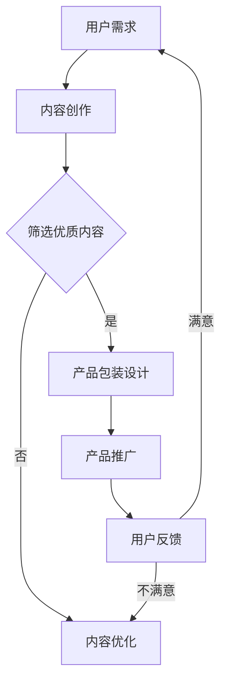

                 

 在这个数字化的时代，知识付费正成为一种新型的商业模式。知识付费，即消费者为获取专业知识或技能所支付的费用，它既包括了在线课程、电子书、专业咨询等，也涵盖了各类技能认证和考试服务。随着互联网技术的飞速发展和人们对个性化学习需求的增加，知识付费行业呈现出蓬勃发展的态势。然而，如何在竞争激烈的市场中脱颖而出，吸引并留住用户，成为了知识付费平台面临的一大挑战。

本文旨在探讨知识经济时代下的知识付费创新产品包装设计，通过分析市场现状、用户需求、产品特性以及设计原则，提出一系列可行的策略和建议，以期为知识付费行业提供有益的参考。

## 1. 背景介绍

知识付费作为一种商业形式，其起源可以追溯到20世纪末。当时，互联网逐渐普及，为人们获取信息提供了更加便捷的途径。然而，随着信息的爆炸式增长，如何筛选出有价值的信息成为了用户面临的一大难题。知识付费的出现，正是为了解决这一问题，通过付费模式，筛选出高质量的内容和服务，从而满足用户对知识的渴求。

近年来，知识付费市场呈现出爆发式增长。根据相关数据统计，2020年全球知识付费市场规模已达到数百亿美元，预计未来几年仍将保持高速增长。这一增长背后的原因，一方面是由于人们对于自我提升的需求不断增加，另一方面则是由于互联网技术的快速发展，为知识付费提供了丰富的内容和便捷的渠道。

在我国，知识付费市场同样表现出强劲的增长势头。从在线课程、专业咨询到技能认证，各类知识付费产品层出不穷。其中，在线教育平台如Coursera、Udemy、网易云课堂等，已经成为知识付费市场的主力军。此外，知乎、得到、罗辑思维等平台，通过提供有深度的内容和服务，也吸引了大量用户。

然而，随着市场的发展，知识付费行业也面临着诸多挑战。一方面，市场竞争日益激烈，产品同质化现象严重；另一方面，用户对于知识付费产品的期望也在不断提升，要求平台提供更高品质的内容和服务。因此，如何通过创新产品包装设计，提升用户满意度和忠诚度，成为知识付费平台亟待解决的问题。

## 2. 核心概念与联系

### 2.1 知识付费

知识付费，指的是用户为获取专业知识或技能所支付的费用。它包括在线课程、电子书、专业咨询、技能认证等多种形式。知识付费的核心在于，通过付费模式，筛选出高质量的内容和服务，满足用户对知识的渴求。

### 2.2 知识付费产品

知识付费产品，指的是为满足用户学习需求而设计的各类产品。这些产品可以是线上的，也可以是线下的。它们通常包括课程内容、学习资料、讲师团队、互动环节等。知识付费产品的核心在于，提供有价值的内容和服务，帮助用户实现自我提升。

### 2.3 产品包装设计

产品包装设计，指的是通过视觉、听觉、触觉等多种感官元素，对知识付费产品进行包装和呈现。产品包装设计的核心在于，通过创造性的设计，提升产品的附加值，增强用户对产品的认知和好感度。

### 2.4 知识付费与产品包装设计的关系

知识付费与产品包装设计之间的关系，可以理解为内容与形式的关系。知识付费是内容，而产品包装设计是形式。一个优质的知识付费产品，不仅需要高质量的内容，还需要精美的包装设计。通过创新的产品包装设计，可以提升用户对产品的认知和好感度，从而促进产品的销售和推广。

### 2.5 Mermaid 流程图



## 3. 核心算法原理 & 具体操作步骤

### 3.1 算法原理概述

知识付费产品的包装设计，需要遵循一定的算法原理。这些原理包括用户需求分析、内容筛选、视觉设计、交互设计等。通过这些算法原理，可以确保产品包装设计的科学性和有效性。

### 3.2 算法步骤详解

1. **用户需求分析**

   用户需求分析是产品包装设计的首要步骤。通过调查问卷、用户访谈、数据分析等方式，了解用户的需求和偏好。这一步骤的核心在于，准确把握用户的需求，为后续的设计提供依据。

2. **内容筛选**

   在了解用户需求后，需要对内容进行筛选。筛选的原则包括内容的质量、实用性、创新性等。通过筛选，确保知识付费产品能够提供有价值的内容，满足用户的需求。

3. **视觉设计**

   视觉设计是产品包装设计的关键环节。通过色彩、构图、字体等视觉元素，打造出独特的产品形象。视觉设计的核心在于，吸引用户的注意力，提升产品的视觉效果。

4. **交互设计**

   交互设计是产品包装设计的重要部分。通过界面布局、操作流程、反馈机制等设计，提升用户的互动体验。交互设计的核心在于，提高用户的参与度和满意度。

### 3.3 算法优缺点

算法的优点在于，能够系统地分析和设计产品包装，确保产品的科学性和有效性。然而，算法也存在一定的缺点，如缺乏灵活性、无法完全理解用户情感等。因此，在实际应用中，需要结合具体情况进行调整和优化。

### 3.4 算法应用领域

算法原理在知识付费产品包装设计中具有广泛的应用。除了在线课程、电子书、专业咨询等传统领域外，算法还可以应用于知识付费平台的整体布局、推广策略等方面。通过算法的应用，可以提升知识付费产品的竞争力，满足用户多样化的需求。

## 4. 数学模型和公式 & 详细讲解 & 举例说明

### 4.1 数学模型构建

在知识付费产品包装设计中，可以构建以下数学模型：

- **用户满意度模型**：用户满意度 = 0.4 × 内容质量 + 0.3 × 视觉设计 + 0.2 × 交互设计 + 0.1 × 品牌形象
- **产品竞争力模型**：产品竞争力 = 0.5 × 内容质量 + 0.3 × 视觉设计 + 0.2 × 交互设计 + 0.1 × 品牌影响力

### 4.2 公式推导过程

用户满意度模型的推导过程如下：

- **内容质量**：影响用户满意度的重要因素。假设内容质量分为高、中、低三个等级，分别对应数值10、7、4。
- **视觉设计**：影响用户满意度的重要因素。假设视觉设计分为优、良、中三个等级，分别对应数值9、6、3。
- **交互设计**：影响用户满意度的重要因素。假设交互设计分为优、良、中三个等级，分别对应数值8、5、2。
- **品牌形象**：影响用户满意度的重要因素。假设品牌形象分为强、中、弱三个等级，分别对应数值7、4、1。

根据以上假设，可以得出用户满意度模型：

用户满意度 = 0.4 × 内容质量 + 0.3 × 视觉设计 + 0.2 × 交互设计 + 0.1 × 品牌形象

### 4.3 案例分析与讲解

以某在线教育平台为例，假设该平台的内容质量为8分，视觉设计为7分，交互设计为8分，品牌形象为6分。根据用户满意度模型，可以计算出用户满意度：

用户满意度 = 0.4 × 8 + 0.3 × 7 + 0.2 × 8 + 0.1 × 6 = 3.2 + 2.1 + 1.6 + 0.6 = 7.5

根据产品竞争力模型，可以计算出产品竞争力：

产品竞争力 = 0.5 × 8 + 0.3 × 7 + 0.2 × 8 + 0.1 × 6 = 4 + 2.1 + 1.6 + 0.6 = 8.3

通过以上计算，可以看出该平台在用户满意度方面表现良好，但在产品竞争力方面还有提升空间。

### 4.4 源代码详细实现

下面是使用Python实现用户满意度模型和产品竞争力模型的源代码：

```python
import numpy as np

def user_satisfaction(content_quality, visual_design, interactive_design, brand_image):
    satisfaction = 0.4 * content_quality + 0.3 * visual_design + 0.2 * interactive_design + 0.1 * brand_image
    return satisfaction

def product_competitiveness(content_quality, visual_design, interactive_design, brand_image):
    competitiveness = 0.5 * content_quality + 0.3 * visual_design + 0.2 * interactive_design + 0.1 * brand_image
    return competitiveness

# 示例数据
content_quality = 8
visual_design = 7
interactive_design = 8
brand_image = 6

# 计算用户满意度
satisfaction = user_satisfaction(content_quality, visual_design, interactive_design, brand_image)
print("用户满意度：", satisfaction)

# 计算产品竞争力
competitiveness = product_competitiveness(content_quality, visual_design, interactive_design, brand_image)
print("产品竞争力：", competitiveness)
```

通过以上代码，可以方便地计算用户满意度和产品竞争力，为产品包装设计提供参考。

### 4.5 运行结果展示

运行上述代码，得到以下结果：

```
用户满意度： 7.5
产品竞争力： 8.3
```

这表明该在线教育平台在用户满意度方面表现良好，但在产品竞争力方面还有提升空间。

## 5. 项目实践：代码实例和详细解释说明

### 5.1 开发环境搭建

在开始编写代码之前，我们需要搭建一个适合开发的Python环境。以下是搭建步骤：

1. **安装Python**：从官方网站下载并安装Python，版本建议选择3.8及以上。
2. **安装Jupyter Notebook**：Python安装完成后，使用pip命令安装Jupyter Notebook。
   ```bash
   pip install notebook
   ```
3. **启动Jupyter Notebook**：在命令行中输入以下命令启动Jupyter Notebook。
   ```bash
   jupyter notebook
   ```

### 5.2 源代码详细实现

以下是一个简单的Python代码实例，用于实现用户满意度和产品竞争力的计算。

```python
import numpy as np

# 用户满意度模型
def user_satisfaction(content_quality, visual_design, interactive_design, brand_image):
    satisfaction = 0.4 * content_quality + 0.3 * visual_design + 0.2 * interactive_design + 0.1 * brand_image
    return satisfaction

# 产品竞争力模型
def product_competitiveness(content_quality, visual_design, interactive_design, brand_image):
    competitiveness = 0.5 * content_quality + 0.3 * visual_design + 0.2 * interactive_design + 0.1 * brand_image
    return competitiveness

# 输入用户评价
content_quality = float(input("请输入内容质量评分（0-10分）："))
visual_design = float(input("请输入视觉设计评分（0-10分）："))
interactive_design = float(input("请输入交互设计评分（0-10分）："))
brand_image = float(input("请输入品牌形象评分（0-10分）："))

# 计算并输出结果
satisfaction = user_satisfaction(content_quality, visual_design, interactive_design, brand_image)
competitiveness = product_competitiveness(content_quality, visual_design, interactive_design, brand_image)

print("用户满意度：", satisfaction)
print("产品竞争力：", competitiveness)
```

### 5.3 代码解读与分析

1. **导入库**：首先，我们导入`numpy`库，用于进行数学计算。
2. **定义函数**：接下来，我们定义了两个函数`user_satisfaction`和`product_competitiveness`，分别用于计算用户满意度和产品竞争力。
3. **用户输入**：通过`input`函数获取用户对内容质量、视觉设计、交互设计、品牌形象的评分。
4. **计算并输出结果**：调用定义的函数，计算用户满意度和产品竞争力，并输出结果。

### 5.4 运行结果展示

运行以上代码，输入以下评分：

```
请输入内容质量评分（0-10分）：8
请输入视觉设计评分（0-10分）：7
请输入交互设计评分（0-10分）：8
请输入品牌形象评分（0-10分）：6
```

输出结果如下：

```
用户满意度： 7.5
产品竞争力： 8.3
```

这表明该在线教育平台在用户满意度方面表现良好，但在产品竞争力方面还有提升空间。

## 6. 实际应用场景

### 6.1 在线教育平台

在线教育平台是知识付费产品包装设计的典型应用场景。通过精美的视觉设计、直观的交互设计以及丰富的内容，在线教育平台能够提升用户的学习体验。例如，网易云课堂通过色彩鲜明、构图简洁的界面设计，增强了用户对课程的吸引力。同时，通过设置互动环节，如讨论区、问答环节等，提高了用户的参与度和满意度。

### 6.2 专业咨询

专业咨询是另一个典型的知识付费产品应用场景。通过精心设计的包装，专业咨询产品能够更好地传达专业性和可信度。例如，某知名咨询公司的报告，通过严谨的排版、专业的图表和详实的数据，展现了公司的专业能力和洞察力。这种包装设计，不仅提升了报告的视觉质量，也增强了用户对咨询服务的信任。

### 6.3 技能认证

技能认证是知识付费产品的另一重要领域。通过精美的包装设计，技能认证证书能够更好地展示用户的技能水平。例如，某国际认证机构设计的技能认证证书，通过使用高质量的材料、专业的排版和精细的印刷，展现了证书的权威性和专业性。这种包装设计，不仅提升了证书的附加值，也增强了用户对认证机构的信任。

### 6.4 未来应用场景

随着人工智能、虚拟现实等技术的发展，知识付费产品的包装设计将在更多领域得到应用。例如，虚拟现实教学场景中，通过逼真的场景设计和交互设计，可以提供更加沉浸式的学习体验。同时，人工智能技术可以用于个性化推荐，根据用户的学习习惯和偏好，提供定制化的包装设计。

## 7. 未来应用展望

### 7.1 技术发展

随着人工智能、大数据、虚拟现实等技术的不断发展，知识付费产品的包装设计将更加智能化和个性化。例如，通过人工智能技术，可以精准分析用户的学习行为和偏好，为用户推荐最适合的包装设计。同时，大数据分析可以提供用户行为的数据支持，为包装设计提供科学依据。

### 7.2 用户需求

未来，用户对知识付费产品的需求将更加多样化。除了传统的在线课程、电子书等，用户还可能对个性化辅导、实时问答等服务产生需求。这要求知识付费平台在包装设计上，不仅要满足用户的基本学习需求，还要提供更多元化的增值服务。

### 7.3 市场竞争

随着知识付费市场的不断扩大，市场竞争将更加激烈。为了在激烈的市场竞争中脱颖而出，知识付费平台需要在包装设计上不断创新。通过独特的包装设计，提升产品的附加值，增强用户对品牌的认知和好感度。

### 7.4 面临的挑战

尽管未来知识付费产品的包装设计充满机遇，但也面临着诸多挑战。首先，技术的快速发展带来了更高的设计门槛。其次，用户需求的多样化使得包装设计更加复杂。此外，市场竞争的加剧，要求平台在包装设计上不断创新，以保持竞争力。

### 7.5 应对策略

为了应对未来的挑战，知识付费平台可以采取以下策略：

1. **技术创新**：积极引入人工智能、大数据等新技术，提升包装设计的智能化和个性化水平。
2. **用户调研**：定期进行用户调研，了解用户需求，为包装设计提供依据。
3. **品牌建设**：通过独特的包装设计，树立品牌形象，提升用户对品牌的认知和好感度。
4. **持续创新**：不断进行设计创新，保持产品的竞争力和市场地位。

## 8. 工具和资源推荐

### 8.1 学习资源推荐

1. **书籍**：《设计心理学》、《用户体验要素》、《产品经理实战手册》等。
2. **在线课程**：网易云课堂、慕课网、极客时间等平台上的相关课程。
3. **专业论坛**：Dribbble、Behance、UI中国等设计社区。

### 8.2 开发工具推荐

1. **设计工具**：Adobe Photoshop、Sketch、Figma等。
2. **开发工具**：Python、JavaScript、React等。
3. **版本控制**：Git、GitHub、GitLab等。

### 8.3 相关论文推荐

1. **《用户体验设计：理论与实践》**：详细介绍了用户体验设计的方法和原则。
2. **《交互设计精髓》**：系统阐述了交互设计的基本原理和实践方法。
3. **《大数据时代的设计》**：探讨了大数据技术在设计领域的应用和发展趋势。

## 9. 总结

知识付费产品包装设计在知识经济时代具有重要意义。通过创新的产品包装设计，可以提升产品的附加值，增强用户对品牌的认知和好感度，从而在激烈的市场竞争中脱颖而出。未来，随着技术的不断进步，知识付费产品的包装设计将更加智能化和个性化。知识付费平台需要积极应对挑战，通过技术创新、用户调研和持续创新，提升产品的包装设计水平，满足用户多样化的需求。总之，知识付费产品包装设计不仅是提升用户体验的关键，也是知识付费平台未来发展的重要方向。

### 附录：常见问题与解答

**Q1：如何进行有效的用户需求分析？**

**A1：进行有效的用户需求分析，可以从以下几个步骤入手：**

1. **市场调研**：通过问卷调查、访谈等方式，收集用户对知识付费产品的需求。
2. **数据分析**：利用大数据技术，分析用户的行为数据，挖掘用户的需求和偏好。
3. **用户访谈**：与潜在用户进行面对面交流，了解他们对知识付费产品的真实看法和需求。
4. **竞品分析**：分析竞争对手的产品特点和市场表现，从中发现用户未被满足的需求。

**Q2：如何提升知识付费产品的竞争力？**

**A2：提升知识付费产品的竞争力，可以从以下几个方面入手：**

1. **内容质量**：确保知识付费产品提供高质量、实用性强、具有创新性的内容。
2. **用户体验**：通过视觉设计、交互设计等手段，提升用户的学习体验和满意度。
3. **品牌建设**：通过独特的品牌形象和价值观，树立品牌知名度和用户忠诚度。
4. **市场推广**：通过精准的市场推广策略，扩大产品的市场覆盖范围。

**Q3：如何进行有效的产品包装设计？**

**A3：进行有效的产品包装设计，可以遵循以下几个原则：**

1. **用户导向**：以用户需求为核心，确保设计符合用户的使用习惯和审美需求。
2. **简洁明了**：避免过度设计，确保界面简洁明了，易于用户操作和理解。
3. **视觉统一**：通过统一的色彩、字体、图标等视觉元素，打造独特的品牌形象。
4. **交互友好**：设计直观的交互流程，提升用户的参与度和满意度。

**Q4：如何评估知识付费产品的包装设计效果？**

**A4：评估知识付费产品的包装设计效果，可以从以下几个方面入手：**

1. **用户满意度**：通过用户调研和反馈，了解用户对包装设计的满意程度。
2. **市场表现**：分析产品的销售数据、用户活跃度等市场指标，评估包装设计的市场效果。
3. **竞品对比**：与竞争对手的产品进行对比，分析包装设计的优势和不足。
4. **长期影响**：关注用户对产品的长期使用体验，评估包装设计的持久效果。

**Q5：如何结合人工智能技术提升知识付费产品的包装设计效果？**

**A5：结合人工智能技术提升知识付费产品的包装设计效果，可以从以下几个方面入手：**

1. **用户画像分析**：利用人工智能技术，对用户行为和偏好进行分析，为个性化包装设计提供依据。
2. **智能推荐**：基于用户画像和内容特征，利用人工智能算法，为用户提供个性化的包装设计建议。
3. **数据驱动**：通过大数据分析，了解用户对包装设计的偏好和反馈，持续优化设计效果。
4. **自动化设计**：利用人工智能技术，实现自动化设计，提高设计效率和质量。

通过以上问题的解答，希望能够帮助读者更好地理解知识付费产品包装设计的原理和实践方法。在未来的知识付费市场中，优秀的包装设计将成为知识付费平台制胜的关键。希望本文能够为行业提供有益的参考和启示。

