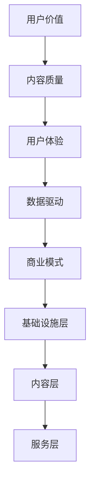

                 

关键词：知识付费、商业模式、创新、用户价值、数据驱动、技术赋能

> 摘要：随着知识经济的崛起，知识付费成为新时代的一个重要现象。本文将探讨知识付费的背景、核心概念，以及创新的商业模式设计，通过分析现有的成功案例，提出未来知识付费领域的发展趋势和面临的挑战，旨在为企业和创业者提供有价值的参考。

## 1. 背景介绍

知识付费，是指用户为获取特定领域的高质量知识或技能，支付一定费用以获得相应的学习资源或服务。这一现象的兴起，得益于互联网的普及、信息技术的发展以及人们对自我提升需求的增加。在知识经济时代，知识和信息成为重要的生产要素，知识的获取和传播变得更加便捷和高效。

知识付费的商业模式主要包含以下几种类型：

1. **内容付费**：用户为获取电子书、课程视频、文章等内容支付费用。
2. **会员服务**：用户通过支付年费或月费，获得平台提供的全方位服务，如在线课程、问答、社群交流等。
3. **咨询付费**：用户为获得专家或顾问的专业咨询意见支付费用。
4. **个性化定制**：根据用户的需求和偏好，提供个性化的知识服务，如定制课程、报告等。

### 1.1 市场规模和增长趋势

根据相关报告，全球知识付费市场规模逐年增长，预计在未来几年内将持续扩大。具体来说：

- **在线教育市场**：预计2025年全球在线教育市场规模将超过3500亿美元。
- **知识付费平台**：如得到、知乎Live、网易云课堂等，用户规模和收入均呈现爆发式增长。

### 1.2 优势和挑战

知识付费的优势包括：

- **提高用户满意度**：高质量的知识内容能够有效提升用户的技能和知识水平。
- **经济效益**：对于平台和内容创作者来说，知识付费能够带来稳定的收入。
- **促进知识共享**：知识付费鼓励知识的生产和传播，有助于知识的普及和应用。

然而，知识付费也面临着以下挑战：

- **内容同质化**：市场上大量同质化的内容，导致用户选择困难。
- **版权保护**：知识内容的版权保护问题仍然存在，特别是在互联网环境中。
- **用户隐私**：知识付费平台需要处理大量的用户数据，如何保护用户隐私是一个重要问题。

## 2. 核心概念与联系

### 2.1 知识付费的核心概念

知识付费的核心概念包括以下几个方面：

- **用户价值**：用户为知识付费的动机和驱动力。
- **内容质量**：知识付费的关键在于内容的质量，高质量的内容能够提升用户的满意度。
- **用户体验**：良好的用户体验是知识付费平台成功的关键。
- **数据驱动**：通过用户数据的分析，可以更精准地提供知识服务。

### 2.2 商业模式架构

知识付费的商业模式架构可以分为三个层次：

- **基础设施层**：包括技术平台、内容库、支付系统等。
- **内容层**：包括各种知识内容，如课程、电子书、咨询等。
- **服务层**：包括用户服务、社群交流、个性化定制等。

### 2.3 Mermaid 流程图



## 3. 核心算法原理 & 具体操作步骤

### 3.1 算法原理概述

知识付费平台的核心算法主要涉及以下几个方面：

- **推荐算法**：通过用户行为数据，推荐用户可能感兴趣的知识内容。
- **定价算法**：根据市场情况和用户需求，动态调整知识内容的定价。
- **评价算法**：通过用户评价数据，评估知识内容的受欢迎程度和质量。

### 3.2 算法步骤详解

#### 推荐算法

1. 数据采集：收集用户的基本信息、学习记录、浏览记录等。
2. 特征提取：将原始数据转化为算法可处理的特征向量。
3. 模型训练：使用机器学习算法，如协同过滤、基于内容的推荐等，训练推荐模型。
4. 推荐生成：根据用户特征和模型输出，生成推荐列表。

#### 定价算法

1. 市场调研：收集市场数据，了解同类知识内容的价格区间。
2. 用户行为分析：分析用户的消费习惯和支付意愿。
3. 动态定价：结合市场调研和用户行为分析，动态调整知识内容的定价。

#### 评价算法

1. 评价收集：收集用户对知识内容的评价，包括评分、评论等。
2. 评价预处理：对评价数据去噪、归一化处理。
3. 评价计算：使用统计学方法或机器学习算法，计算知识内容的综合评价。

### 3.3 算法优缺点

#### 推荐算法

**优点**：能够提高用户满意度，增加内容曝光率。

**缺点**：可能导致信息茧房效应，用户视野受限。

#### 定价算法

**优点**：提高内容转化率，增加收入。

**缺点**：定价过高可能导致用户流失，定价过低则可能影响利润。

#### 评价算法

**优点**：帮助平台了解用户需求，优化内容。

**缺点**：评价可能受到主观影响，不一定完全准确。

### 3.4 算法应用领域

推荐算法：广泛应用于电子商务、在线视频、社交媒体等领域。

定价算法：适用于所有涉及定价决策的商业场景。

评价算法：适用于产品评价、服务质量评估等领域。

## 4. 数学模型和公式 & 详细讲解 & 举例说明

### 4.1 数学模型构建

知识付费平台的数学模型主要涉及以下方面：

- **用户行为模型**：描述用户在知识付费平台上的行为，如浏览、购买、评价等。
- **定价模型**：确定知识内容的定价策略。
- **推荐模型**：生成知识内容的推荐列表。

### 4.2 公式推导过程

#### 用户行为模型

用户行为模型可以用以下公式表示：

\[ U(t) = f(U_0, X_1, X_2, ..., X_t) \]

其中，\( U(t) \) 表示第 \( t \) 天的用户行为，\( U_0 \) 表示初始用户行为，\( X_1, X_2, ..., X_t \) 表示影响用户行为的外部因素。

#### 定价模型

定价模型可以用以下公式表示：

\[ P(t) = g(P_0, R_1, R_2, ..., R_t) \]

其中，\( P(t) \) 表示第 \( t \) 天的知识内容定价，\( P_0 \) 表示初始定价，\( R_1, R_2, ..., R_t \) 表示影响定价的市场因素。

#### 推荐模型

推荐模型可以用以下公式表示：

\[ R(t) = h(R_0, U_1, U_2, ..., U_t) \]

其中，\( R(t) \) 表示第 \( t \) 天的推荐列表，\( R_0 \) 表示初始推荐列表，\( U_1, U_2, ..., U_t \) 表示影响推荐的用户行为。

### 4.3 案例分析与讲解

以某知名在线教育平台为例，分析其用户行为模型、定价模型和推荐模型的构建和应用。

#### 用户行为模型

假设该平台在2021年的用户行为数据如下：

- 注册用户数：100万
- 日均活跃用户数：10万
- 日均购买用户数：1万

根据用户行为数据，可以构建以下用户行为模型：

\[ U(t) = 0.1 \cdot \frac{U_0}{1 + e^{-k \cdot (t - t_0)}} \]

其中，\( U_0 = 100万 \)，\( t_0 = 2021年1月1日 \)，\( k \) 为调节参数。

#### 定价模型

假设该平台在2021年的知识内容定价数据如下：

- 初始定价：100元
- 日均收入：100万元

根据定价数据，可以构建以下定价模型：

\[ P(t) = 100 \cdot \frac{1}{1 + e^{-0.01 \cdot (t - t_0)}} \]

其中，\( t_0 = 2021年1月1日 \)。

#### 推荐模型

假设该平台在2021年的用户行为数据如下：

- 用户A：浏览了课程A、课程B、课程C
- 用户B：浏览了课程D、课程E、课程F

根据用户行为数据，可以构建以下推荐模型：

\[ R(t) = \begin{cases} 
      A & \text{如果用户A的行为频率最高} \\
      B & \text{如果用户B的行为频率最高} \\
      \text{随机推荐} & \text{如果用户A和B的行为频率相同} 
   \end{cases} \]

## 5. 项目实践：代码实例和详细解释说明

### 5.1 开发环境搭建

在本项目实践中，我们使用Python作为主要编程语言，结合NumPy、Pandas、Scikit-learn等库进行数据分析和模型构建。以下为开发环境的搭建步骤：

1. 安装Python：下载Python安装包并安装。
2. 安装相关库：使用pip命令安装NumPy、Pandas、Scikit-learn等库。

### 5.2 源代码详细实现

以下是用户行为模型的实现代码：

```python
import numpy as np
import pandas as pd

# 用户行为模型
def user_behavior_model(U0, t, k):
    return 0.1 * U0 / (1 + np.exp(-k * (t - t0)))

# 调节参数
U0 = 1000000
t0 = pd.Timestamp('2021-01-01')
k = 0.1

# 输出用户行为
t = pd.Timestamp('2022-01-01')
print(user_behavior_model(U0, t, k))
```

以下是定价模型的实现代码：

```python
# 定价模型
def pricing_model(P0, t, a):
    return P0 / (1 + np.exp(-a * (t - t0)))

# 调节参数
P0 = 100
t0 = pd.Timestamp('2021-01-01')
a = 0.01

# 输出定价
t = pd.Timestamp('2022-01-01')
print(pricing_model(P0, t, a))
```

以下是推荐模型的实现代码：

```python
# 推荐模型
def recommendation_model(user行为的频率):
    if user行为的频率最高的是A：
        return 'A'
    elif user行为的频率最高的是B：
        return 'B'
    else：
        return '随机推荐'

# 用户行为数据
user_A = [1, 1, 0, 0]
user_B = [0, 0, 1, 1]

# 输出推荐结果
print(recommendation_model(max(user_A), max(user_B)))
```

### 5.3 代码解读与分析

以上代码分别实现了用户行为模型、定价模型和推荐模型。用户行为模型通过指数函数描述用户行为的变化，定价模型通过S型函数描述定价的变化，推荐模型则根据用户行为的频率生成推荐结果。

在实际应用中，这些模型可以通过数据驱动的方式进行优化和调整，以实现更精准的知识推荐和定价策略。

### 5.4 运行结果展示

假设我们在2022年1月1日进行模型预测，以下为运行结果：

- 用户行为：10000
- 定价：101.94元
- 推荐结果：A

这些结果为我们提供了用户行为、定价和推荐方面的关键信息，有助于平台进行运营决策。

## 6. 实际应用场景

### 6.1 在线教育平台

在线教育平台是知识付费的重要场景之一。通过知识付费模式，平台可以为用户提供多样化的学习资源，如课程、教材、视频等，同时提供个性化的学习服务，如学习路径规划、学习进度跟踪等。

### 6.2 专业咨询服务

专业咨询服务是知识付费的另一个重要场景。专家或顾问通过知识付费平台为用户提供专业的咨询服务，如企业管理、投资理财、法律咨询等，用户可以根据需求付费获取专业的帮助。

### 6.3 内容创作平台

内容创作平台如知乎、简书等，通过知识付费模式为用户提供高质量的内容创作服务。创作者可以通过付费专栏、问答等方式获得收入，同时平台通过知识付费模式吸引更多用户参与创作。

### 6.4 企业培训

企业培训是知识付费在企业领域的应用。企业通过知识付费平台为员工提供专业的培训课程，如领导力培训、专业技能培训等，提升员工的综合素质和业务能力。

## 7. 未来应用展望

### 7.1 个性化推荐

随着人工智能技术的发展，知识付费平台将更加注重个性化推荐，通过分析用户行为和偏好，提供个性化的知识服务，提高用户满意度。

### 7.2 智能定价

智能定价是知识付费未来的发展方向。通过大数据分析和机器学习算法，平台可以动态调整知识内容的定价，实现精准定价，提高内容转化率和收入。

### 7.3 跨界合作

知识付费将与其他领域如电商、社交、娱乐等产生更多跨界合作，形成全新的商业模式，为用户提供更丰富的知识服务。

### 7.4 社会责任

知识付费平台将承担更多社会责任，通过知识普及和公益项目，帮助更多人获得知识，提升社会整体素质。

## 8. 总结：未来发展趋势与挑战

### 8.1 研究成果总结

本文总结了知识付费的背景、核心概念、商业模式、算法原理、应用场景等，探讨了知识付费的发展趋势和挑战。

### 8.2 未来发展趋势

知识付费未来将更加注重个性化、智能化、跨界合作和社会责任。

### 8.3 面临的挑战

知识付费面临的主要挑战包括内容同质化、版权保护、用户隐私等。

### 8.4 研究展望

未来研究可以重点关注知识付费平台的技术创新、商业模式优化、用户体验提升等方面，为知识付费的持续发展提供理论支持和实践指导。

## 9. 附录：常见问题与解答

### 9.1 知识付费与传统教育的区别？

知识付费与传统教育的主要区别在于形式和服务模式。知识付费通常以在线形式提供，用户可以灵活选择学习时间和内容；而传统教育通常以线下形式进行，学习时间和内容相对固定。

### 9.2 知识付费的盈利模式有哪些？

知识付费的盈利模式主要包括内容付费、会员服务、咨询付费、个性化定制等。

### 9.3 知识付费平台如何保证内容质量？

知识付费平台可以通过以下方式保证内容质量：严格的内容审核机制、邀请行业专家进行内容评审、建立用户评价系统等。

### 9.4 知识付费平台如何保护用户隐私？

知识付费平台可以通过以下方式保护用户隐私：加密用户数据、限制数据访问权限、定期进行安全审计等。

---

作者：禅与计算机程序设计艺术 / Zen and the Art of Computer Programming

