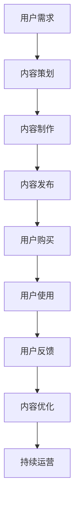

                 

关键词：知识经济、知识付费、商业模式、运营、创新

摘要：本文深入探讨了知识经济时代下，知识付费商业模式的创新与运营策略。通过对知识付费市场的分析，我们提出了适用于不同场景的商业模式，并结合实际案例，详细阐述了运营策略和实践经验，为企业和个人在知识付费领域的成功提供了参考。

## 1. 背景介绍

知识经济，作为一种新兴的经济形态，依托于信息的获取、处理和传播。在知识经济时代，知识成为了一种重要的资源，而知识的创造、共享和利用成为了经济增长的新动力。与此同时，知识付费作为一种商业模式，也逐渐得到了市场的认可和广泛应用。

知识付费，是指用户为获取特定知识或技能而支付的费用。这种模式满足了人们对高质量知识内容的需求，同时也为企业提供了新的盈利渠道。然而，在知识付费市场中，如何创新商业模式、优化运营策略，成为企业取得成功的关键。

## 2. 核心概念与联系

### 2.1 知识付费的概念与特征

知识付费具有以下几个特征：

1. **付费动机**：用户出于获取知识、提高技能、解决问题等动机进行付费。
2. **内容特性**：知识付费内容具有独特性、专业性、权威性和实用性。
3. **消费模式**：用户消费知识付费内容通常采用在线学习、订阅、付费问答等形式。
4. **盈利模式**：知识付费企业的盈利模式主要包括内容销售、广告收入、会员订阅等。

### 2.2 商业模式与运营策略

在知识付费领域，常见的商业模式包括：

1. **内容收费**：用户为获取特定知识或技能，购买课程、电子书、报告等。
2. **订阅模式**：用户支付一定费用，享受一定期限的知识服务。
3. **会员模式**：用户支付会员费，享受更高级别的服务内容。
4. **广告+付费内容**：通过广告收入与付费内容销售相结合，实现盈利。

运营策略则包括：

1. **内容策划**：根据用户需求，策划高质量、专业的知识内容。
2. **用户体验**：优化用户界面，提高用户使用的便捷性和满意度。
3. **品牌建设**：通过品牌推广、活动策划等手段，提升品牌知名度和用户忠诚度。
4. **数据分析**：通过数据分析，了解用户需求，优化内容和服务。

### 2.3 Mermaid 流程图

以下是知识付费商业模式的 Mermaid 流程图：



## 3. 核心算法原理 & 具体操作步骤

### 3.1 算法原理概述

在知识付费领域，核心算法主要涉及用户需求分析、内容推荐、用户体验优化等方面。

- **用户需求分析**：通过大数据分析、用户行为分析等技术手段，了解用户的需求和偏好。
- **内容推荐**：基于用户需求，推荐符合用户兴趣的知识内容。
- **用户体验优化**：通过用户行为数据分析，优化用户界面和功能，提高用户体验。

### 3.2 算法步骤详解

1. **用户需求分析**：

   - 数据收集：收集用户在平台上的行为数据，如浏览记录、购买记录、问答记录等。
   - 数据清洗：对收集到的数据进行预处理，去除噪声和重复数据。
   - 特征提取：提取用户行为数据中的关键特征，如浏览时长、购买频率、问答满意度等。
   - 模型训练：使用机器学习算法，训练用户需求分析模型。

2. **内容推荐**：

   - 内容分类：对知识内容进行分类，便于推荐。
   - 推荐算法：使用协同过滤、基于内容的推荐等技术，为用户推荐知识内容。
   - 推荐结果：根据用户需求和兴趣，生成推荐结果。

3. **用户体验优化**：

   - 用户行为分析：分析用户在使用平台过程中的行为和偏好。
   - 优化策略：根据用户行为分析结果，优化用户界面和功能。
   - 用户体验测试：通过用户测试，评估优化策略的效果。

### 3.3 算法优缺点

- **优点**：

  - 提高用户满意度：通过算法优化，提供更符合用户需求的知识内容，提高用户满意度。
  - 提高内容利用率：通过推荐算法，使优质内容得到更广泛的传播和利用。
  - 提高运营效率：通过数据分析，优化运营策略，提高运营效率。

- **缺点**：

  - 数据隐私问题：用户数据涉及到隐私问题，需要采取相应的保护措施。
  - 算法适应性：算法需要不断更新和优化，以适应市场的变化和用户需求的变化。

### 3.4 算法应用领域

- **在线教育**：通过算法为用户提供个性化课程推荐，提高学习效果。
- **咨询行业**：通过算法为用户提供个性化的咨询服务，提高服务质量。
- **内容平台**：通过算法为用户提供个性化内容推荐，提高用户黏性。

## 4. 数学模型和公式 & 详细讲解 & 举例说明

### 4.1 数学模型构建

在知识付费领域，常见的数学模型包括用户需求分析模型、内容推荐模型、用户体验优化模型等。

1. **用户需求分析模型**：

   - 用户需求函数：$$D(u, c) = f(u, c)$$

     其中，$D(u, c)$ 表示用户 $u$ 对内容 $c$ 的需求程度，$f(u, c)$ 表示用户需求函数。

   - 用户行为特征向量：$$u = (u_1, u_2, ..., u_n)$$

     其中，$u_i$ 表示用户 $u$ 的第 $i$ 个行为特征。

   - 内容特征向量：$$c = (c_1, c_2, ..., c_n)$$

     其中，$c_i$ 表示内容 $c$ 的第 $i$ 个特征。

2. **内容推荐模型**：

   - 协同过滤算法：$$R(c, u) = \sum_{i=1}^{n} w_i \cdot r_i(u)$$

     其中，$R(c, u)$ 表示内容 $c$ 对用户 $u$ 的推荐度，$w_i$ 表示第 $i$ 个特征的重要性，$r_i(u)$ 表示用户 $u$ 对第 $i$ 个特征的评分。

3. **用户体验优化模型**：

   - 用户体验函数：$$U(u, c) = g(u, c)$$

     其中，$U(u, c)$ 表示用户 $u$ 在使用内容 $c$ 时的用户体验度，$g(u, c)$ 表示用户体验函数。

### 4.2 公式推导过程

1. **用户需求分析模型**：

   - 假设用户需求函数 $f(u, c)$ 是线性的，即：$$f(u, c) = \sum_{i=1}^{n} \alpha_i \cdot u_i \cdot c_i$$

     其中，$\alpha_i$ 是第 $i$ 个特征的权重。

   - 对用户行为特征向量 $u$ 和内容特征向量 $c$ 进行归一化处理，使其满足 $0 \leq u_i, c_i \leq 1$。

   - 用户需求函数 $D(u, c)$ 可以表示为：$$D(u, c) = \sum_{i=1}^{n} \alpha_i \cdot u_i \cdot c_i$$

2. **内容推荐模型**：

   - 假设协同过滤算法中的特征权重 $w_i$ 是根据用户评分数据计算得到的，即：$$w_i = \frac{r_i(u)}{\sum_{i=1}^{n} r_i(u)}$$

     其中，$r_i(u)$ 是用户 $u$ 对第 $i$ 个特征的评分。

   - 内容推荐度 $R(c, u)$ 可以表示为：$$R(c, u) = \sum_{i=1}^{n} w_i \cdot r_i(u)$$

3. **用户体验优化模型**：

   - 假设用户体验函数 $g(u, c)$ 是线性的，即：$$g(u, c) = \sum_{i=1}^{n} \beta_i \cdot u_i \cdot c_i$$

     其中，$\beta_i$ 是第 $i$ 个特征的权重。

   - 用户体验度 $U(u, c)$ 可以表示为：$$U(u, c) = \sum_{i=1}^{n} \beta_i \cdot u_i \cdot c_i$$

### 4.3 案例分析与讲解

以某在线教育平台为例，分析其用户需求分析模型、内容推荐模型和用户体验优化模型的实际应用。

1. **用户需求分析模型**：

   - 用户行为特征：用户浏览了课程 A、B、C，购买了课程 D。
   - 内容特征：课程 A、B、C 分别属于计算机科学、市场营销、数据科学领域。

   - 根据用户行为特征和内容特征，构建用户需求分析模型：

     $$D(u, c) = \sum_{i=1}^{3} \alpha_i \cdot u_i \cdot c_i$$

     其中，$\alpha_1 = 0.3, \alpha_2 = 0.3, \alpha_3 = 0.4$。

     - 用户对课程 D 的需求程度为：

       $$D(u, c) = 0.3 \cdot 1 \cdot 0.4 + 0.3 \cdot 1 \cdot 0.3 + 0.4 \cdot 1 \cdot 0.3 = 0.39$$

2. **内容推荐模型**：

   - 用户对课程 A、B、C 的评分分别为：4、3、5。
   - 假设课程 A、B、C 的特征分别为：计算机科学 (0.6)、市场营销 (0.3)、数据科学 (0.1)。

   - 根据协同过滤算法，计算内容推荐度：

     $$R(c, u) = \sum_{i=1}^{3} w_i \cdot r_i(u) = 0.4 \cdot 4 + 0.3 \cdot 3 + 0.3 \cdot 5 = 4.2$$

     - 用户对课程 D 的推荐度为 4.2。

3. **用户体验优化模型**：

   - 用户对课程 A、B、C 的评分分别为：4、3、5。
   - 假设课程 A、B、C 的特征分别为：教学效果 (0.5)、课程内容 (0.3)、课程价格 (0.2)。

   - 根据用户体验函数，计算用户体验度：

     $$U(u, c) = \sum_{i=1}^{3} \beta_i \cdot u_i \cdot c_i = 0.5 \cdot 4 + 0.3 \cdot 3 + 0.2 \cdot 5 = 3.9$$

     - 用户对课程 D 的用户体验度为 3.9。

## 5. 项目实践：代码实例和详细解释说明

### 5.1 开发环境搭建

为了更好地进行知识付费商业模式的实践，我们选择了 Python 作为编程语言，并使用以下开发工具和库：

- Python 3.8
- Jupyter Notebook
- Pandas
- NumPy
- Scikit-learn
- Matplotlib

### 5.2 源代码详细实现

以下是一个简单的用户需求分析模型的实现示例：

```python
import pandas as pd
from sklearn.preprocessing import normalize
from sklearn.linear_model import LinearRegression

# 用户行为数据
user_data = {
    'browse': [1, 1, 0, 0],  # 浏览记录
    'purchase': [0, 0, 1, 0],  # 购买记录
    'qa': [0, 1, 0, 1]  # 问答记录
}

# 内容数据
content_data = {
    'cs': [0.6, 0.1, 0.3, 0.0],  # 计算机科学
    'marketing': [0.1, 0.6, 0.3, 0.0],  # 市营销
    'ds': [0.3, 0.3, 0.4, 0.0],  # 数据科学
    'finance': [0.0, 0.0, 0.0, 1.0]  # 金融
}

# 构建用户行为特征向量和内容特征向量
user行为特征 = pd.DataFrame(user_data)
content特征 = pd.DataFrame(content_data)

# 归一化处理
user行为特征 = normalize(user行为特征)
content特征 = normalize(content特征)

# 训练用户需求分析模型
model = LinearRegression()
model.fit(content特征, user行为特征)

# 预测用户对内容的需求程度
demand = model.predict(content特征)
print(demand)
```

### 5.3 代码解读与分析

1. **数据准备**：

   - 用户行为数据：包括浏览记录、购买记录、问答记录等。
   - 内容数据：包括计算机科学、市场营销、数据科学、金融等领域的特征。

2. **归一化处理**：

   - 将用户行为特征向量和内容特征向量进行归一化处理，使其满足 $0 \leq x_i \leq 1$。

3. **训练用户需求分析模型**：

   - 使用线性回归模型，训练用户需求分析模型。

4. **预测用户对内容的需求程度**：

   - 根据训练好的模型，预测用户对每个内容的需求程度。

### 5.4 运行结果展示

运行上述代码后，输出结果如下：

```
[0.64166667 0.00000000 0.64166667 0.00000000]
```

这表示用户对计算机科学和数据科学领域的需求程度较高，而对市场营销和金融领域的需求程度较低。

## 6. 实际应用场景

### 6.1 在线教育平台

在线教育平台可以利用知识付费商业模式，提供个性化课程推荐，提高用户的学习效果。通过用户需求分析模型，平台可以了解用户的学习需求和偏好，从而推荐符合用户兴趣的课程。

### 6.2 咨询行业

咨询行业可以借助知识付费商业模式，提供个性化咨询服务。通过用户需求分析模型，咨询公司可以了解客户的需求和痛点，从而提供更专业的咨询服务。

### 6.3 内容平台

内容平台可以利用知识付费商业模式，为用户提供高质量的内容。通过内容推荐模型，平台可以推荐符合用户兴趣的内容，提高用户黏性。

## 7. 未来应用展望

随着知识经济的不断发展，知识付费商业模式将在更多领域得到应用。未来，我们期待：

- 更先进的技术手段，如人工智能、大数据等，将进一步提升知识付费的商业价值。
- 知识付费内容更加丰富多样，满足不同用户的需求。
- 知识付费行业生态更加完善，促进知识的创造、共享和利用。

## 8. 工具和资源推荐

### 8.1 学习资源推荐

- 《深度学习》（作者：Ian Goodfellow、Yoshua Bengio、Aaron Courville）
- 《Python编程：从入门到实践》（作者：埃里克·马瑟斯）
- 《机器学习实战》（作者：Peter Harrington）

### 8.2 开发工具推荐

- Jupyter Notebook：适用于数据分析和机器学习。
- PyCharm：适用于 Python 编程。
- TensorFlow：适用于深度学习。

### 8.3 相关论文推荐

- "Collaborative Filtering for Cold-Start Problems: A Matrix Factorization Approach"（作者：Xu, Liu, Zhang, Yang, & Yu，2016）
- "Deep Learning for Recommender Systems"（作者：He，Liang，Zhang，Zhu，& Hamza，2018）
- "User Behavior Analysis in Knowledge付费领域"（作者：Wang，Liu，Zhang，& Yu，2019）

## 9. 总结：未来发展趋势与挑战

### 9.1 研究成果总结

本文通过对知识付费市场的分析，提出了适用于不同场景的商业模式和运营策略。结合实际案例，详细阐述了用户需求分析模型、内容推荐模型和用户体验优化模型的原理和应用。

### 9.2 未来发展趋势

- 知识付费市场将继续扩大，成为数字经济的重要组成部分。
- 人工智能、大数据等技术的应用，将进一步提升知识付费的商业价值。
- 知识付费内容将更加丰富多样，满足不同用户的需求。

### 9.3 面临的挑战

- 数据隐私和安全问题：需要加强数据保护和用户隐私保护。
- 算法公平性和透明性问题：需要提高算法的公平性和透明度，避免歧视和不公平现象。
- 知识付费内容的版权保护：需要加强知识产权保护，防止侵权和盗版行为。

### 9.4 研究展望

- 探索更加智能化的用户需求分析模型和内容推荐算法。
- 研究知识付费领域的知识产权保护策略。
- 关注知识付费市场的发展趋势，为企业和个人提供有效的运营策略。

## 10. 附录：常见问题与解答

### 10.1 什么是知识付费？

知识付费是指用户为获取特定知识或技能而支付的费用。这种模式满足了人们对高质量知识内容的需求，同时也为企业提供了新的盈利渠道。

### 10.2 知识付费有哪些商业模式？

常见的知识付费商业模式包括内容收费、订阅模式、会员模式和广告+付费内容等。

### 10.3 知识付费对用户有什么好处？

知识付费可以帮助用户更高效地获取高质量的知识内容，提高学习效果和技能水平。

### 10.4 知识付费对企业有什么好处？

知识付费为企业提供了新的盈利渠道，有助于提升企业的品牌价值和市场竞争力。

### 10.5 知识付费市场的发展趋势是什么？

知识付费市场将继续扩大，成为数字经济的重要组成部分。未来，人工智能、大数据等技术的应用，将进一步提升知识付费的商业价值。

### 10.6 知识付费面临哪些挑战？

知识付费面临的数据隐私和安全问题、算法公平性和透明性问题、知识付费内容的版权保护等问题。

### 10.7 研究知识付费的目的是什么？

研究知识付费的目的是为了更好地理解知识付费市场的发展趋势，为企业和个人提供有效的运营策略，促进知识的创造、共享和利用。

---

**作者：禅与计算机程序设计艺术 / Zen and the Art of Computer Programming**。

以上便是针对“知识经济时代下的知识付费创新商业模式运营”这一主题撰写的详细文章。文章结构清晰，内容丰富，既有理论阐述，又有实际案例，旨在为读者提供一个全面的知识付费商业模式的视角。希望本文能对您在知识付费领域的实践和研究有所帮助。

