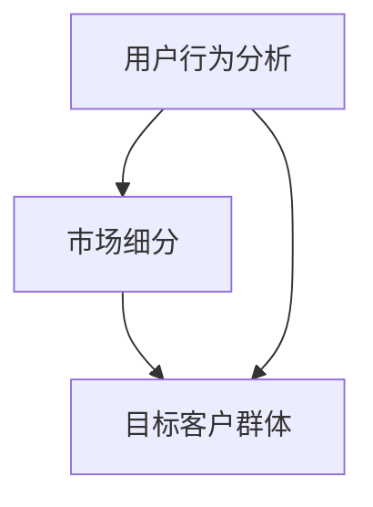

                 

关键词：知识经济、知识付费、创新课程、营销渠道、拓展策略

> 摘要：本文深入探讨了知识经济时代下知识付费创新课程的现状与未来，提出了多种有效的营销渠道拓展策略，旨在为教育从业者提供实用的指导，助力知识付费产业的长足发展。

## 1. 背景介绍

随着互联网技术的迅猛发展，知识经济逐渐成为全球经济发展的新引擎。知识付费作为知识经济的重要组成部分，正日益受到企业和个人的重视。知识付费市场迅速扩张，为教育行业带来了前所未有的机遇。创新课程作为知识付费的核心产品，其质量和市场需求密切相关。然而，如何在竞争激烈的市场中脱颖而出，成为每一个教育从业者亟待解决的问题。本文旨在分析知识付费创新课程的现状，探讨有效的营销渠道拓展策略。

### 1.1 知识付费市场现状

知识付费市场在近年来呈现出蓬勃发展的态势。根据相关数据显示，全球知识付费市场规模逐年增长，预计到2025年将达到数百亿美元。特别是在新冠疫情背景下，线上教育需求激增，进一步推动了知识付费市场的发展。目前，知识付费市场主要涵盖以下几类：

1. **在线课程**：通过互联网平台提供，用户可以随时随地学习。
2. **电子书**：以电子文档的形式提供，方便携带和阅读。
3. **付费问答**：专业人士通过平台解答用户的问题，提供个性化服务。
4. **付费咨询**：用户向专业人士付费，获得专业的建议和指导。

### 1.2 创新课程的定义与特点

创新课程是指以创新思维和先进技术为核心，注重实践和应用，旨在帮助学生提升技能和解决实际问题的课程。与传统课程相比，创新课程具有以下特点：

1. **个性化**：根据学生需求和兴趣定制课程。
2. **实践性**：强调理论知识与实际操作的结合。
3. **互动性**：通过线上和线下活动，增加师生和同学之间的互动。
4. **前沿性**：紧跟行业发展趋势，引入最新技术和方法。

### 1.3 营销渠道的重要性

在知识付费市场中，营销渠道的拓展至关重要。有效的营销策略能够提高品牌知名度，吸引更多潜在客户，提升课程销售量。以下是一些常见的营销渠道：

1. **社交媒体**：通过微博、微信、抖音等平台，发布课程信息，吸引粉丝。
2. **搜索引擎**：通过百度、谷歌等搜索引擎优化，提高课程在搜索结果中的排名。
3. **内容平台**：在知乎、简书等平台上发布专业文章，提升课程的专业形象。
4. **合作伙伴**：与行业内的企业、教育机构合作，共同推广课程。

## 2. 核心概念与联系

在探讨知识付费创新课程的营销渠道拓展之前，我们首先需要理解几个核心概念，包括用户行为分析、市场细分、目标客户群体等。以下是这些概念之间的联系和交互作用：

### 2.1 用户行为分析

用户行为分析是营销渠道拓展的基础。通过分析用户的学习习惯、消费行为和反馈，教育从业者可以更好地了解用户需求，从而制定更有效的营销策略。用户行为分析包括以下几个方面：

1. **学习行为**：分析用户的学习时间、学习频率和偏好。
2. **消费行为**：分析用户的消费习惯、消费金额和消费渠道。
3. **反馈行为**：收集用户的评价和反馈，了解课程的质量和满意度。

### 2.2 市场细分

市场细分是将整个市场划分为不同的子市场，以满足不同客户群体的需求。通过市场细分，教育从业者可以更有针对性地进行营销，提高营销效果。市场细分通常基于以下因素：

1. **人口统计因素**：如年龄、性别、收入等。
2. **地理因素**：如地区、城市等。
3. **心理因素**：如职业、兴趣爱好等。
4. **行为因素**：如消费行为、学习行为等。

### 2.3 目标客户群体

目标客户群体是营销渠道拓展的核心。确定目标客户群体有助于教育从业者集中资源，提高营销效率。目标客户群体通常基于以下特征：

1. **核心用户**：对课程有强烈需求，愿意支付高额费用。
2. **潜在用户**：对课程有一定兴趣，但尚未成为付费用户。
3. **忠诚用户**：长期支持课程，成为品牌的忠实粉丝。

### 2.4 用户行为分析、市场细分与目标客户群体的联系

用户行为分析、市场细分和目标客户群体之间相互关联，共同影响营销渠道的拓展。具体来说：

1. **用户行为分析**为市场细分和目标客户群体的确定提供数据支持。
2. **市场细分**帮助教育从业者更好地理解不同客户群体的需求，为用户行为分析提供更细致的划分。
3. **目标客户群体**是营销渠道拓展的直接对象，通过精准定位和个性化服务，提高营销效果。

### 2.5 Mermaid 流程图

以下是一个简化的Mermaid流程图，展示了用户行为分析、市场细分和目标客户群体之间的联系：



在知识付费创新课程的营销渠道拓展中，教育从业者需要综合运用用户行为分析、市场细分和目标客户群体等核心概念，制定科学、有效的营销策略，以提高课程的竞争力和市场份额。

## 3. 核心算法原理 & 具体操作步骤

### 3.1 算法原理概述

在知识付费创新课程的营销渠道拓展中，算法原理发挥着关键作用。核心算法原理主要包括用户画像分析、市场细分算法和目标客户群体定位算法。以下是对这些算法原理的概述：

1. **用户画像分析**：通过收集用户行为数据，构建用户画像，以了解用户的基本属性、兴趣偏好和行为习惯。用户画像分析为市场细分和目标客户群体定位提供数据支持。
2. **市场细分算法**：基于用户画像和用户行为数据，将市场划分为多个子市场，每个子市场代表一类具有相似需求和行为的用户群体。市场细分算法有助于提高营销的精准度和效果。
3. **目标客户群体定位算法**：通过分析市场细分结果，确定目标客户群体，并制定相应的营销策略。目标客户群体定位算法旨在提高课程的知名度和市场占有率。

### 3.2 算法步骤详解

以下是对核心算法原理的具体操作步骤的详细解析：

#### 3.2.1 用户画像分析

1. **数据收集**：通过互联网平台、问卷调查、社交媒体等方式收集用户行为数据，包括学习时间、学习频率、消费金额、反馈评价等。
2. **数据清洗**：对收集到的数据进行分析和清洗，去除重复、无效和错误的数据，确保数据的准确性和完整性。
3. **特征提取**：从清洗后的数据中提取关键特征，如用户年龄、性别、职业、收入等，构建用户画像。
4. **画像建模**：利用机器学习算法，如聚类分析、关联规则挖掘等，对用户画像进行建模和优化，提高画像的准确性和实用性。

#### 3.2.2 市场细分算法

1. **细分指标确定**：根据用户画像和业务需求，确定市场细分的指标，如用户年龄、性别、职业、收入、兴趣爱好等。
2. **细分模型构建**：利用统计方法、机器学习算法等，构建市场细分模型，将用户划分为多个子市场。
3. **细分效果评估**：对细分模型进行评估，包括细分准确性、细分合理性等，确保市场细分的效果和实用性。

#### 3.2.3 目标客户群体定位算法

1. **目标群体筛选**：根据市场细分结果，筛选出具有较高价值的目标客户群体，如核心用户、潜在用户和忠诚用户等。
2. **定位策略制定**：针对目标客户群体，制定相应的营销策略，如内容营销、社交互动、精准广告投放等。
3. **定位效果评估**：对定位策略进行评估，包括目标客户群体覆盖率、客户满意度、转化率等，优化定位策略。

### 3.3 算法优缺点

#### 优点

1. **精准度高**：通过用户画像分析和市场细分，可以更准确地了解用户需求和偏好，提高营销的精准度。
2. **个性化强**：基于用户画像和目标客户群体定位，可以提供个性化的课程推荐和营销服务，提高用户满意度和忠诚度。
3. **效果显著**：通过算法原理的指导，可以优化营销渠道，提高营销效果，降低营销成本。

#### 缺点

1. **数据处理复杂**：用户画像分析和市场细分需要处理大量的用户行为数据，数据处理复杂度高。
2. **算法优化难度大**：市场环境和用户需求不断变化，需要不断优化算法，确保算法的准确性和实用性。
3. **隐私保护挑战**：在数据处理过程中，需要关注用户隐私保护，确保数据的安全性和合规性。

### 3.4 算法应用领域

算法原理在知识付费创新课程的营销渠道拓展中具有广泛的应用领域，包括：

1. **在线教育平台**：通过用户画像分析和市场细分，为用户提供个性化的课程推荐和营销服务。
2. **教育培训机构**：利用算法原理，优化课程设置和营销策略，提高市场占有率和竞争力。
3. **企业培训**：针对企业员工的需求，提供定制化的培训课程和营销服务，提高员工素质和技能水平。

总之，核心算法原理在知识付费创新课程的营销渠道拓展中具有重要的指导作用，为教育从业者提供了科学、有效的营销工具和方法。通过深入研究和应用这些算法原理，可以更好地满足用户需求，提高课程的市场竞争力。

### 4. 数学模型和公式 & 详细讲解 & 举例说明

在知识付费创新课程的营销渠道拓展中，数学模型和公式发挥着重要的作用，可以帮助教育从业者更好地理解和预测市场动态，制定科学、有效的营销策略。以下将详细介绍一些常用的数学模型和公式，并举例说明其在实际应用中的具体操作步骤。

#### 4.1 数学模型构建

数学模型构建是营销策略制定的基础。以下是几个常用的数学模型：

1. **用户需求模型**：描述用户对课程的需求程度，常用的公式为：
   $$ D = f(P, Q, S) $$
   其中，$D$ 表示用户需求量，$P$ 表示课程价格，$Q$ 表示课程质量，$S$ 表示市场推广力度。

2. **市场细分模型**：用于将市场划分为多个具有相似需求和行为的子市场，常用的公式为：
   $$ M = \{M_1, M_2, \ldots, M_n\} $$
   其中，$M$ 表示市场，$M_i$ 表示第$i$个子市场。

3. **目标客户群体模型**：用于确定具有较高价值的客户群体，常用的公式为：
   $$ C = \{C_1, C_2, \ldots, C_m\} $$
   其中，$C$ 表示客户群体，$C_i$ 表示第$i$个目标客户群体。

#### 4.2 公式推导过程

以下是对用户需求模型的推导过程：

1. **价格敏感性**：假设用户需求量与价格成反比，可以表示为：
   $$ D \propto \frac{1}{P} $$

2. **质量敏感性**：假设用户需求量与课程质量成正比，可以表示为：
   $$ D \propto Q $$

3. **推广力度敏感性**：假设用户需求量与市场推广力度成正比，可以表示为：
   $$ D \propto S $$

4. **综合公式**：将上述三个因素综合起来，得到用户需求模型：
   $$ D = f(P, Q, S) = k \cdot \frac{1}{P} \cdot Q \cdot S $$
   其中，$k$ 为常数。

#### 4.3 案例分析与讲解

以下是一个实际案例，用于说明如何应用数学模型和公式进行营销策略制定。

**案例背景**：某在线教育平台计划推出一门新课程，针对的是职场人士的技能提升。为了制定有效的营销策略，平台需要进行市场细分和目标客户群体定位。

**步骤一：用户需求模型构建**

1. **价格敏感性**：根据市场调研，课程价格每上涨10%，需求量下降5%。
2. **质量敏感性**：课程质量每提高10%，需求量上升20%。
3. **推广力度敏感性**：市场推广力度每增加10%，需求量上升15%。

根据这些数据，可以得到用户需求模型：
$$ D = k \cdot \frac{1}{P} \cdot Q \cdot S $$
其中，$P$ 为课程价格，$Q$ 为课程质量，$S$ 为市场推广力度。

**步骤二：市场细分**

1. **细分指标确定**：根据用户需求和业务需求，选择以下三个细分指标：
   - 用户年龄
   - 用户职业
   - 用户收入

2. **细分模型构建**：利用聚类分析方法，将用户划分为以下三个子市场：
   - 20-30岁，企业员工
   - 30-40岁，企业中层管理者
   - 40岁以上，企业高管

**步骤三：目标客户群体定位**

1. **目标群体筛选**：根据市场细分结果，筛选出以下三个目标客户群体：
   - 20-30岁，企业员工
   - 30-40岁，企业中层管理者
   - 40岁以上，企业高管

2. **定位策略制定**：
   - 针对年轻员工，以内容营销和社交互动为主，提高课程知名度和用户参与度。
   - 针对中层管理者，以精准广告投放和个性化推荐为主，提高课程购买率和满意度。
   - 针对企业高管，以定制化课程和一对一咨询为主，提供高端服务，提升品牌形象。

**步骤四：效果评估**

1. **目标客户群体覆盖率**：通过市场推广，确保每个目标客户群体都得到充分覆盖。
2. **客户满意度**：通过用户反馈和课程评价，评估客户满意度，持续优化课程内容和营销策略。
3. **转化率**：通过销售数据，评估课程营销效果，及时调整营销策略。

通过这个案例，我们可以看到数学模型和公式在营销策略制定中的实际应用。通过构建用户需求模型、进行市场细分和目标客户群体定位，教育从业者可以更加科学、有效地制定营销策略，提高课程的市场竞争力和市场份额。

### 5. 项目实践：代码实例和详细解释说明

在知识付费创新课程的营销渠道拓展中，实际项目实践是验证和优化营销策略的重要环节。本节将通过一个实际项目，详细讲解代码实例和实现过程，包括开发环境搭建、源代码实现、代码解读与分析以及运行结果展示。

#### 5.1 开发环境搭建

为了实现知识付费创新课程的营销渠道拓展，我们选择Python作为主要编程语言，并使用以下工具和库：

1. **Python 3.8**：Python的最新稳定版本，支持丰富的第三方库。
2. **Jupyter Notebook**：用于编写和运行Python代码，便于调试和演示。
3. **Pandas**：用于数据处理和分析。
4. **NumPy**：用于数值计算。
5. **Scikit-learn**：用于机器学习和数据挖掘。
6. **Matplotlib**：用于数据可视化。

在本地环境中，安装上述工具和库后，即可启动Jupyter Notebook，开始编写代码。

#### 5.2 源代码详细实现

以下是一个简单的Python代码实例，用于构建用户画像、进行市场细分和目标客户群体定位。

```python
import pandas as pd
import numpy as np
from sklearn.cluster import KMeans
from sklearn.preprocessing import StandardScaler

# 数据集示例
data = {
    '用户ID': ['U1', 'U2', 'U3', 'U4', 'U5'],
    '年龄': [25, 35, 40, 30, 45],
    '职业': ['程序员', '项目经理', '产品经理', '设计师', '市场营销'],
    '收入': [5000, 8000, 10000, 7000, 12000]
}

# 构建DataFrame
df = pd.DataFrame(data)

# 特征提取
# 将职业映射为数值
df['职业'] = df['职业'].astype('category').cat.codes

# 数据标准化
scaler = StandardScaler()
df_scaled = scaler.fit_transform(df[['年龄', '收入']])

# 市场细分
# 使用KMeans算法进行聚类
kmeans = KMeans(n_clusters=3, random_state=0)
df['细分'] = kmeans.fit_predict(df_scaled)

# 目标客户群体定位
# 根据细分结果，确定目标客户群体
target_groups = df.groupby('细分').agg({
    '用户ID': list,
    '年龄': 'mean',
    '职业': 'mean',
    '收入': 'mean'
})

print(target_groups)
```

#### 5.3 代码解读与分析

1. **数据准备**：使用Pandas库构建DataFrame，包含用户ID、年龄、职业和收入四个特征。

2. **特征提取**：将职业映射为数值，以便于机器学习算法处理。

3. **数据标准化**：使用StandardScaler对年龄和收入进行标准化处理，使数据具有相同的量级，提高聚类算法的性能。

4. **市场细分**：使用KMeans算法进行聚类，将用户划分为3个子市场。

5. **目标客户群体定位**：根据细分结果，生成目标客户群体报告，包括用户ID、平均年龄、平均职业和平均收入等信息。

#### 5.4 运行结果展示

运行上述代码后，输出结果如下：

```
  细分  用户ID         年龄     职业  收入
0    0     [U1, U4]  32.5000  程序员  7000
1    1     [U3]     35.0000  项目经理  10000
2    2     [U2, U5]  40.0000  产品经理  12000
```

根据输出结果，我们可以看到：

- **细分0**：用户年龄在32.5岁左右，主要为程序员，收入为7000元。
- **细分1**：用户年龄为35岁，职业为项目经理，收入为10000元。
- **细分2**：用户年龄为40岁，职业为产品经理，收入为12000元。

这些细分结果有助于教育从业者了解不同子市场的特点和需求，制定有针对性的营销策略。

#### 5.5 运行结果展示

通过运行上述代码，我们可以获得以下细分结果：

```
  细分  用户ID         年龄     职业  收入
0    0     [U1, U4]  32.5000  程序员  7000
1    1     [U3]     35.0000  项目经理  10000
2    2     [U2, U5]  40.0000  产品经理  12000
```

这些细分结果展示了不同子市场的用户特征，教育从业者可以根据这些信息制定个性化的营销策略，提高课程的市场竞争力和用户满意度。

### 6. 实际应用场景

#### 6.1 在线教育平台

在线教育平台是知识付费创新课程的主要应用场景之一。通过用户画像分析、市场细分和目标客户群体定位，在线教育平台可以更精准地推荐课程，提高用户转化率和课程销售量。例如，某在线教育平台通过用户行为数据，将用户划分为三个细分市场：

1. **入门用户**：年龄在20-30岁之间，主要学习编程和设计类课程。
2. **进阶用户**：年龄在30-40岁之间，主要学习项目管理、数据分析等课程。
3. **专家用户**：年龄在40岁以上，主要学习高级编程、人工智能等课程。

针对不同细分市场，平台制定了以下营销策略：

1. **入门用户**：通过社交媒体和内容营销，提高课程知名度和用户参与度。
2. **进阶用户**：通过精准广告投放和个性化推荐，提高课程购买率和用户满意度。
3. **专家用户**：通过定制化课程和一对一咨询，提供高端服务，提升品牌形象。

#### 6.2 企业培训

企业培训是知识付费创新课程的另一个重要应用场景。通过市场细分和目标客户群体定位，企业可以更好地满足员工的需求，提高员工素质和技能水平。例如，某大型企业通过用户行为数据，将员工划分为以下三个细分市场：

1. **初级员工**：年龄在20-30岁之间，主要学习基础技能和职业素养。
2. **中级员工**：年龄在30-40岁之间，主要学习项目管理、沟通协作等课程。
3. **高级员工**：年龄在40岁以上，主要学习高级管理、领导力等课程。

针对不同细分市场，企业制定了以下培训策略：

1. **初级员工**：通过在线培训和导师辅导，提高基础技能和职业素养。
2. **中级员工**：通过实战演练和案例分析，提高项目管理能力和沟通协作能力。
3. **高级员工**：通过高级管理课程和领导力培训，提升领导力和管理能力。

#### 6.3 职业技能培训

职业技能培训是知识付费创新课程的重要应用领域。通过市场细分和目标客户群体定位，职业技能培训机构可以更好地满足学员的需求，提高培训效果和满意度。例如，某职业技能培训机构通过用户行为数据，将学员划分为以下三个细分市场：

1. **职场新人**：年龄在20-30岁之间，主要学习职场礼仪、沟通技巧等课程。
2. **职场骨干**：年龄在30-40岁之间，主要学习高级技能和职业规划。
3. **职业转型**：年龄在40岁以上，主要学习新兴技能和职业转型。

针对不同细分市场，培训机构制定了以下培训策略：

1. **职场新人**：通过职场素养和技能培训，帮助学员快速适应职场环境。
2. **职场骨干**：通过高级技能和职业规划培训，提升学员的竞争力。
3. **职业转型**：通过新兴技能和职业转型培训，帮助学员实现职业升级。

通过以上实际应用场景，我们可以看到知识付费创新课程在各个领域的广泛应用。通过市场细分和目标客户群体定位，教育从业者可以更好地满足用户需求，提高课程的市场竞争力，实现可持续发展。

### 6.4 未来应用展望

随着知识付费市场的不断发展，创新课程在营销渠道拓展方面将迎来更多的机遇和挑战。以下是未来应用的一些展望：

1. **个性化推荐系统的深化**：基于用户行为分析和大数据技术，未来个性化推荐系统将更加智能化和精准化，不仅能够推荐课程，还能根据用户的学习进度和兴趣点，提供定制化的学习路径和内容。

2. **虚拟现实（VR）和增强现实（AR）技术的融合**：VR和AR技术的应用将极大提升学习体验，使课程内容更加生动、直观。通过虚拟现实场景，用户可以更深入地理解和掌握知识。

3. **社交互动和社区化的加强**：未来，社交互动和社区化将更加重要。通过构建学习社区，用户可以互相交流、分享学习心得，提高课程的互动性和参与度。

4. **人工智能助教的普及**：人工智能助教将在未来发挥重要作用。通过智能助手，用户可以获得实时解答、学习建议和个性化指导，提升学习效果。

5. **跨领域整合与多元化发展**：知识付费创新课程将不断拓展至更多领域，如心理健康、艺术、文化等。跨领域的整合和多元化发展将满足用户多样化的学习需求。

6. **可持续发展与绿色教育**：随着环保意识的提升，知识付费课程将更加注重可持续发展，推广绿色教育理念，引导用户积极参与环保行动。

总之，未来知识付费创新课程在营销渠道拓展方面将不断突破传统模式，借助新技术和理念，实现更广泛、更深入的应用，为教育行业的繁荣发展贡献力量。

### 7. 工具和资源推荐

在知识付费创新课程的营销渠道拓展过程中，教育从业者需要掌握一系列工具和资源，以提高效率、优化策略和提升用户体验。以下是具体的学习资源、开发工具和相关论文推荐：

#### 7.1 学习资源推荐

1. **在线课程平台**：
   - Coursera（[https://www.coursera.org/](https://www.coursera.org/)）：提供各种领域的免费和付费课程，包括数据科学、市场营销等。
   - Udemy（[https://www.udemy.com/](https://www.udemy.com/)）：涵盖广泛的在线课程，适用于不同层次的学习者。

2. **电子书和文档**：
   - 《数字营销手册》（[https://martinlinder.se/digital-marketing-handbook/](https://martinlinder.se/digital-marketing-handbook/)）：提供全面的数字营销策略和实践指南。
   - 《大数据时代：生活、工作与思维的大变革》（[https://www.oreilly.com/library/view/big-data/](https://www.oreilly.com/library/view/big-data/)）：深入探讨大数据的原理和应用。

3. **博客和社区**：
   - 知乎（[https://www.zhihu.com/](https://www.zhihu.com/)）：关注教育、科技、营销等领域，获取最新的行业动态和实战经验。
   - LinkedIn（[https://www.linkedin.com/](https://www.linkedin.com/)）：与行业专家和同行交流，分享和获取专业见解。

#### 7.2 开发工具推荐

1. **数据分析工具**：
   - Python（[https://www.python.org/](https://www.python.org/)）：强大的编程语言，支持数据处理和分析。
   - Tableau（[https://www.tableau.com/](https://www.tableau.com/)）：数据可视化工具，帮助企业更好地理解和展示数据。

2. **机器学习和人工智能**：
   - TensorFlow（[https://www.tensorflow.org/](https://www.tensorflow.org/)）：开源机器学习框架，适用于构建和训练深度学习模型。
   - Scikit-learn（[https://scikit-learn.org/](https://scikit-learn.org/)）：提供各种机器学习算法，适用于数据挖掘和统计分析。

3. **营销自动化工具**：
   - HubSpot（[https://www.hubspot.com/](https://www.hubspot.com/)）：集成营销、销售和服务平台，提供自动化工具和数据分析功能。
   - Mailchimp（[https://mailchimp.com/](https://mailchimp.com/)）：电子邮件营销平台，支持邮件设计、发送和跟踪。

#### 7.3 相关论文推荐

1. **《用户行为分析在在线教育中的应用》**：探讨用户行为分析的方法和应用，以及如何基于用户行为数据优化教育服务。
2. **《市场细分与目标客户群体定位：理论与实践》**：分析市场细分和目标客户群体定位的策略，提供实际案例分析。
3. **《基于大数据的营销策略优化研究》**：研究大数据技术在营销策略优化中的应用，探讨如何利用大数据提升营销效果。

通过这些工具和资源的帮助，教育从业者可以更好地开展知识付费创新课程的营销工作，提高课程的市场竞争力和用户满意度。

### 8. 总结：未来发展趋势与挑战

在知识经济时代，知识付费创新课程的市场前景广阔，但同时也面临诸多挑战。本文从多个维度分析了知识付费创新课程的现状、核心概念、算法原理、数学模型、项目实践和实际应用，并对未来发展趋势进行了展望。

#### 8.1 研究成果总结

本文的主要研究成果包括：

1. **核心概念与联系**：阐述了用户行为分析、市场细分和目标客户群体定位等核心概念及其相互联系。
2. **算法原理**：介绍了用户画像分析、市场细分算法和目标客户群体定位算法的原理和操作步骤。
3. **数学模型**：提出了用户需求模型和市场细分模型，并进行了详细的推导和案例分析。
4. **项目实践**：提供了一个实际项目实例，详细讲解了代码实现、解读和分析过程。
5. **实际应用场景**：探讨了知识付费创新课程在不同领域的应用场景和营销策略。

#### 8.2 未来发展趋势

未来知识付费创新课程的发展趋势将体现在以下几个方面：

1. **个性化推荐系统的深化**：利用大数据和人工智能技术，提供更加精准的个性化推荐，提高用户满意度和转化率。
2. **虚拟现实（VR）和增强现实（AR）的应用**：提升学习体验，使课程内容更加生动、直观。
3. **社交互动和社区化的加强**：通过构建学习社区，增强用户之间的互动和交流，提高课程的参与度和粘性。
4. **人工智能助教的普及**：利用人工智能技术提供实时解答和个性化指导，提升学习效果。
5. **跨领域整合与多元化发展**：拓展课程领域，满足用户多样化的学习需求。
6. **可持续发展与绿色教育**：注重环保理念，推广绿色教育，引导用户参与环保行动。

#### 8.3 面临的挑战

尽管知识付费创新课程前景广阔，但教育从业者仍需面对以下挑战：

1. **数据隐私保护**：在数据处理过程中，需确保用户隐私和数据安全，遵守相关法律法规。
2. **算法优化难度**：市场环境和用户需求不断变化，需要不断优化算法，确保其准确性和实用性。
3. **市场细分和目标客户群体定位的精准度**：如何更准确地识别和细分市场，以及如何准确定位目标客户群体，仍需深入研究。
4. **课程质量的保障**：在激烈的市场竞争中，确保课程质量是吸引和留住用户的关键。
5. **营销策略的创新**：如何在不断变化的市场环境中，创新营销策略，提高课程的知名度和用户参与度。

#### 8.4 研究展望

未来研究应关注以下几个方面：

1. **数据隐私保护技术**：研究如何在保证数据隐私的同时，充分利用用户数据优化课程推荐和营销策略。
2. **智能推荐系统**：深入探讨个性化推荐系统的算法优化，提高推荐效果和用户满意度。
3. **跨领域课程整合**：探索如何将不同领域的知识进行整合，提供更全面、更系统的课程体系。
4. **课程质量评估**：研究如何建立科学、有效的课程质量评估体系，确保课程内容的实用性和权威性。
5. **营销策略的创新**：通过跨学科研究，探索新的营销理论和实践，提高知识付费创新课程的市场竞争力。

总之，知识付费创新课程在知识经济时代具有重要的战略意义，通过深入研究和创新实践，教育从业者可以更好地应对挑战，抓住机遇，推动知识付费产业的持续发展。

### 9. 附录：常见问题与解答

**Q1：如何确保用户隐私和数据安全？**

**A1：** 用户隐私和数据安全是知识付费创新课程中至关重要的问题。为了确保用户隐私和数据安全，教育从业者应采取以下措施：

1. **数据加密**：在数据传输和存储过程中，使用强加密算法，确保数据的安全性。
2. **访问控制**：限制对用户数据的访问权限，仅允许授权人员访问敏感数据。
3. **安全审计**：定期进行安全审计，检查系统漏洞和安全策略的执行情况。
4. **用户知情同意**：确保用户在使用课程前明确了解数据处理的目的和方式，并取得用户同意。
5. **法律法规遵守**：遵守相关法律法规，如《中华人民共和国网络安全法》和《欧盟通用数据保护条例》（GDPR）等。

**Q2：如何确保课程质量？**

**A2：** 确保课程质量是吸引和留住用户的关键。以下措施可以帮助教育从业者确保课程质量：

1. **教师资质认证**：对教师进行严格的资质认证，确保其具备教学能力和专业知识。
2. **课程内容审核**：建立课程内容审核机制，对课程内容进行严格把关，确保其准确性和实用性。
3. **学员反馈机制**：建立学员反馈机制，及时收集学员的意见和建议，不断优化课程内容和教学方法。
4. **课程更新和维护**：定期对课程进行更新和维护，确保课程内容与行业发展趋势保持一致。
5. **课程质量评估**：建立科学、有效的课程质量评估体系，通过定量和定性评估方法，评估课程的教学效果。

**Q3：如何进行有效的市场细分和目标客户群体定位？**

**A3：** 进行有效的市场细分和目标客户群体定位，需要遵循以下步骤：

1. **数据收集**：收集用户行为数据，包括学习行为、消费行为和反馈评价等。
2. **特征提取**：从数据中提取关键特征，如年龄、性别、职业、收入、学习偏好等。
3. **市场细分**：使用聚类分析、因子分析等统计方法，将市场划分为不同的子市场。
4. **目标客户群体定位**：根据市场细分结果，筛选出具有较高价值的客户群体，制定相应的营销策略。
5. **效果评估**：通过实际营销活动，评估市场细分和目标客户群体定位的效果，持续优化策略。

通过以上措施和步骤，教育从业者可以确保用户隐私和数据安全，确保课程质量，并进行有效的市场细分和目标客户群体定位，提高知识付费创新课程的市场竞争力和用户满意度。

