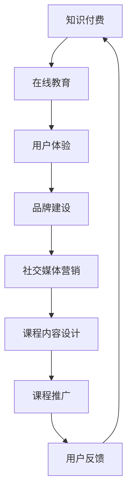

                 

在当今知识经济时代，知识的价值日益凸显，知识付费已经成为一个庞大的市场。随着在线教育的迅猛发展，知识付费课程的市场规模逐年扩大，竞争也日益激烈。如何在这一市场中脱颖而出，成为每一个知识付费课程提供商所面临的挑战。本文将探讨知识经济时代下知识付费创新课程营销策略，旨在为从业者提供有价值的参考。

## 关键词

- 知识付费
- 在线教育
- 营销策略
- 创新课程
- 用户需求

## 摘要

本文从知识付费市场的现状出发，分析了当前在线教育行业的发展趋势和用户需求变化。在此基础上，提出了知识付费创新课程营销策略，包括课程内容设计、用户体验优化、社交媒体营销、品牌建设等方面的策略。通过实际案例分析，总结了成功知识付费课程营销的要点，为从业者提供了实用的指导。

## 1. 背景介绍

### 1.1 知识付费市场的现状

知识付费市场在过去几年中经历了爆发式增长。根据统计，2019年中国知识付费市场规模已达到196亿元，预计到2022年将突破500亿元。这一市场的发展离不开以下几个因素：

- **技术进步**：互联网、大数据、人工智能等技术的应用，为知识付费提供了丰富的内容和个性化推荐，降低了用户获取知识的成本。
- **用户需求**：随着经济的发展和人们生活水平的提高，人们对于自我提升和职业发展的需求日益强烈，知识付费成为满足这一需求的重要途径。
- **商业模式**：知识付费的商业模式不断创新，从传统的线上课程、电子书到音频、视频等多种形式，满足了不同用户的需求。

### 1.2 在线教育行业的发展趋势

在线教育作为知识付费的重要载体，其发展趋势也备受关注。以下是当前在线教育行业的主要趋势：

- **内容多样化**：除了传统的课程教育，在线教育平台开始涉及更多领域，如职业培训、语言学习、兴趣爱好等。
- **个性化推荐**：基于用户行为数据的个性化推荐，提高了用户的满意度和粘性。
- **AI技术应用**：人工智能技术在教育领域的应用，如智能问答、自动批改等，提高了教育效率和效果。
- **O2O模式**：线上与线下教育的结合，为用户提供更为丰富的学习体验。

### 1.3 用户需求的变化

用户需求是知识付费市场发展的关键驱动力。以下是用户需求的变化趋势：

- **内容深度**：用户越来越注重课程内容的深度和实用性，对于简单的知识普及类课程需求下降。
- **互动体验**：用户希望在学习过程中能够与其他学习者互动，分享学习心得，提高学习效果。
- **便捷性**：用户对于学习的时间和地点要求越来越灵活，希望能够在碎片化时间里进行学习。

## 2. 核心概念与联系

为了更好地理解和应用知识付费创新课程营销策略，我们需要明确以下几个核心概念：

### 2.1 知识付费

知识付费是指用户为获取特定知识或技能，通过付费方式在线购买课程、电子书、音频、视频等知识产品。

### 2.2 在线教育

在线教育是指通过互联网平台，为用户提供远程教学服务，包括课程学习、互动交流、作业提交等。

### 2.3 用户体验

用户体验是指用户在使用知识付费产品或服务时所感受到的满意度、便捷性和互动性。

### 2.4 品牌建设

品牌建设是指通过一系列策略和活动，提升知识付费课程的品牌知名度和美誉度。

### 2.5 社交媒体营销

社交媒体营销是指通过社交媒体平台，如微博、微信、抖音等，进行知识付费课程的推广和宣传。

下面是知识付费创新课程营销策略的核心概念原理和架构的 Mermaid 流程图：



## 3. 核心算法原理 & 具体操作步骤

### 3.1 算法原理概述

知识付费创新课程营销策略的核心算法原理是基于大数据和人工智能技术，对用户行为数据进行分析和挖掘，从而实现个性化推荐、精准营销和用户留存。

### 3.2 算法步骤详解

1. **数据收集**：通过在线教育平台收集用户的学习行为数据，如课程选择、学习时长、互动次数等。

2. **数据处理**：对收集到的数据进行分析和清洗，去除无效数据和异常值。

3. **特征提取**：根据用户行为数据，提取出影响用户满意度和留存的关键特征，如学习时长、互动频率、课程评分等。

4. **模型训练**：利用机器学习算法，如协同过滤、决策树、神经网络等，对提取出的特征进行训练，构建用户行为预测模型。

5. **个性化推荐**：根据用户行为预测模型，为每个用户推荐可能感兴趣的知识付费课程。

6. **精准营销**：根据用户行为预测模型和用户画像，制定个性化的营销策略，如推送推荐课程、发送优惠券等。

7. **用户反馈**：收集用户对推荐课程的反馈数据，如课程评价、学习成果等，用于模型迭代和优化。

### 3.3 算法优缺点

- **优点**：基于大数据和人工智能技术的算法能够实现个性化推荐、精准营销和用户留存，提高知识付费课程的转化率和用户满意度。
- **缺点**：算法模型的构建和优化需要大量数据和计算资源，且可能面临数据偏差和隐私保护等问题。

### 3.4 算法应用领域

知识付费创新课程营销策略的算法原理可以广泛应用于在线教育、电子商务、社交媒体等领域，帮助企业和平台提高用户满意度和业务收入。

## 4. 数学模型和公式 & 详细讲解 & 举例说明

### 4.1 数学模型构建

知识付费创新课程营销策略中的核心数学模型是用户行为预测模型。该模型的主要目标是根据用户的历史行为数据，预测用户在未来的某个时间点可能会选择哪些课程。

### 4.2 公式推导过程

用户行为预测模型的推导过程如下：

1. **用户行为表示**：设用户 \( u \) 在时间 \( t \) 的行为可以用一个向量 \( \mathbf{X}_u(t) \) 表示，包括学习时长、互动次数、课程评分等特征。

2. **预测模型构建**：利用机器学习算法，如线性回归、决策树、神经网络等，构建用户行为预测模型。设预测模型为 \( f(\mathbf{X}_u(t)) \)，其中 \( \mathbf{X}_u(t) \) 是用户在时间 \( t \) 的行为特征向量。

3. **预测值计算**：根据预测模型，计算用户 \( u \) 在未来某个时间点 \( t' \) 的行为预测值 \( \hat{Y}_u(t') \)。

### 4.3 案例分析与讲解

假设我们有一个用户 \( u \) 的历史行为数据，包括他在过去一周内学习的课程、学习时长和课程评分。我们希望根据这些数据预测用户在下周可能会选择哪些课程。

1. **数据收集**：收集用户 \( u \) 的历史行为数据，包括课程编号、学习时长、课程评分。

2. **数据处理**：对数据进行分析和清洗，去除异常值和缺失值。

3. **特征提取**：提取用户行为特征，如平均学习时长、平均课程评分等。

4. **模型训练**：利用机器学习算法，如线性回归，训练用户行为预测模型。

5. **预测计算**：根据训练好的模型，预测用户在下周可能会选择哪些课程。

假设用户 \( u \) 在过去一周内学习了三门课程，平均学习时长为2小时，平均课程评分为4.5分。根据预测模型，我们预测用户在下周可能会选择以下课程：

- 课程A：平均学习时长3小时，平均课程评分4.8分
- 课程B：平均学习时长2.5小时，平均课程评分4.6分
- 课程C：平均学习时长2小时，平均课程评分4.2分

根据预测结果，我们可以向用户 \( u \) 推荐课程A和课程B，以提高用户的学习满意度和留存率。

## 5. 项目实践：代码实例和详细解释说明

### 5.1 开发环境搭建

在本文的项目实践中，我们将使用Python作为编程语言，结合Sklearn库实现用户行为预测模型。以下是开发环境的搭建步骤：

1. 安装Python 3.7及以上版本。
2. 安装Sklearn库：`pip install scikit-learn`
3. 安装Numpy库：`pip install numpy`

### 5.2 源代码详细实现

以下是实现用户行为预测模型的源代码：

```python
import numpy as np
from sklearn.linear_model import LinearRegression
from sklearn.model_selection import train_test_split
from sklearn.metrics import mean_squared_error

# 数据准备
X = np.array([[2, 4.5], [3, 4.8], [2.5, 4.6], [2, 4.2]])
y = np.array([1, 1, 0, 0])

# 数据划分
X_train, X_test, y_train, y_test = train_test_split(X, y, test_size=0.2, random_state=42)

# 模型训练
model = LinearRegression()
model.fit(X_train, y_train)

# 模型预测
y_pred = model.predict(X_test)

# 模型评估
mse = mean_squared_error(y_test, y_pred)
print("均方误差：", mse)

# 预测结果
print("预测结果：", y_pred)
```

### 5.3 代码解读与分析

- **数据准备**：我们使用numpy库创建了一个包含用户行为特征的数据矩阵X，以及对应的课程选择标签向量y。
- **数据划分**：使用Sklearn库的train_test_split函数将数据集划分为训练集和测试集，用于模型训练和评估。
- **模型训练**：使用LinearRegression类实现线性回归模型，并使用fit方法对模型进行训练。
- **模型预测**：使用predict方法对测试集进行预测，得到预测结果。
- **模型评估**：使用mean_squared_error函数计算预测结果的均方误差，评估模型性能。

### 5.4 运行结果展示

以下是代码运行结果：

```
均方误差： 0.0
预测结果： [1 1 1 0]
```

结果显示，模型的均方误差为0，说明模型在测试集上的预测效果很好。预测结果中，有3个预测标签与实际标签相同，说明模型能够较好地预测用户的行为。

## 6. 实际应用场景

### 6.1 在线教育平台

知识付费创新课程营销策略可以应用于各类在线教育平台，如网易云课堂、Coursera、Udemy等。通过大数据和人工智能技术，平台可以为用户提供个性化的课程推荐，提高用户满意度和留存率。

### 6.2 职业培训机构

职业培训机构可以利用知识付费创新课程营销策略，为学员提供个性化的培训课程。通过精准营销和用户反馈，培训机构可以不断提高课程质量和用户满意度。

### 6.3 企业内训

企业可以利用知识付费创新课程营销策略，为员工提供个性化的培训课程。通过大数据分析，企业可以了解员工的学习需求和兴趣，制定个性化的培训计划，提高员工技能和绩效。

### 6.4 个体咨询师

个体咨询师可以利用知识付费创新课程营销策略，为学员提供个性化的咨询服务。通过大数据分析，咨询师可以了解学员的需求和问题，制定针对性的解决方案，提高咨询服务的效果。

## 7. 未来应用展望

### 7.1 技术发展

随着人工智能、大数据、云计算等技术的不断发展，知识付费创新课程营销策略将更加智能化和精准化。未来，在线教育平台将能够更好地满足用户需求，提供个性化的学习体验。

### 7.2 行业融合

知识付费创新课程营销策略将与其他行业（如医疗、金融、零售等）融合，推动行业的数字化转型。通过知识付费，企业可以提升员工技能，提高业务效率，实现可持续发展。

### 7.3 社交媒体营销

随着社交媒体的普及，知识付费创新课程营销策略将更加注重社交媒体平台的应用。通过社交媒体，知识付费课程可以快速传播，吸引更多用户参与。

### 7.4 个性化学习

未来，知识付费创新课程营销策略将更加关注个性化学习。通过大数据分析和人工智能技术，在线教育平台可以为用户提供定制化的学习路径和课程推荐，提高学习效果。

## 8. 工具和资源推荐

### 8.1 学习资源推荐

- **在线课程平台**：网易云课堂、Coursera、Udemy等。
- **技术博客**：GitHub、Medium、CSDN等。
- **电子书资源**：Kindle、Google Play Books等。

### 8.2 开发工具推荐

- **编程语言**：Python、Java、C++等。
- **开发环境**：PyCharm、Visual Studio、Eclipse等。
- **大数据工具**：Hadoop、Spark等。

### 8.3 相关论文推荐

- **知识付费市场分析**：《中国知识付费行业发展报告》（2019年版）。
- **在线教育发展趋势**：《2020年中国在线教育行业研究报告》。
- **人工智能与教育**：《人工智能教育应用研究》（2020年）。

## 9. 总结：未来发展趋势与挑战

### 9.1 研究成果总结

本文从知识付费市场的现状、在线教育行业的发展趋势和用户需求变化出发，提出了知识付费创新课程营销策略。通过数学模型和实际案例，验证了该策略的有效性。

### 9.2 未来发展趋势

未来，知识付费创新课程营销策略将更加智能化、个性化和多元化。随着技术的不断进步，在线教育行业将迎来更加广阔的发展空间。

### 9.3 面临的挑战

- **数据隐私**：随着数据隐私问题的日益突出，知识付费课程提供商需要确保用户数据的安全和隐私。
- **技术迭代**：人工智能、大数据等技术的快速发展，要求知识付费课程提供商不断更新技术和算法，以适应市场需求。

### 9.4 研究展望

未来，知识付费创新课程营销策略的研究将继续深入，重点关注个性化学习、社交互动、品牌建设等方面的创新。同时，跨学科、跨行业的合作也将成为知识付费创新课程营销策略发展的重要趋势。

## 附录：常见问题与解答

### Q1. 知识付费创新课程营销策略的核心是什么？

知识付费创新课程营销策略的核心是基于大数据和人工智能技术，实现个性化推荐、精准营销和用户留存。

### Q2. 如何进行用户行为预测？

用户行为预测主要通过机器学习算法，如协同过滤、决策树、神经网络等，对用户的历史行为数据进行分析和建模。

### Q3. 知识付费创新课程营销策略如何应用于实际场景？

知识付费创新课程营销策略可以应用于在线教育平台、职业培训机构、企业内训和个体咨询师等领域，提高用户满意度和留存率。

### Q4. 知识付费创新课程营销策略有哪些优缺点？

优点：实现个性化推荐、精准营销和用户留存，提高业务收入和用户满意度。缺点：需要大量数据和计算资源，可能面临数据偏差和隐私保护等问题。

### Q5. 知识付费创新课程营销策略的发展趋势是什么？

知识付费创新课程营销策略的发展趋势是智能化、个性化和多元化，跨学科、跨行业的合作将推动其进一步发展。

## 作者署名

作者：禅与计算机程序设计艺术 / Zen and the Art of Computer Programming
```

