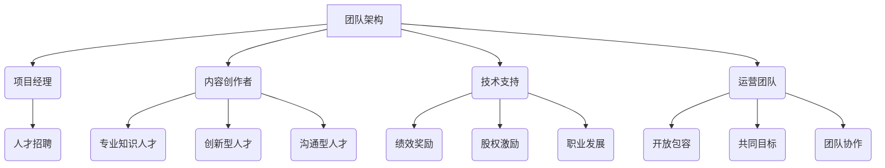

                 

 关键词：知识经济，知识付费，团队建设，文化塑造，人才发展，创新管理，数字化转型，人工智能

> 摘要：在知识经济时代，知识付费已成为推动经济发展的重要动力。本文旨在探讨知识付费团队建设与文化塑造的关键因素，包括团队架构、人才招聘、激励机制、文化氛围等方面。通过分析这些因素，本文提出了一套系统的团队建设与文化塑造策略，以期为企业在知识付费领域的长远发展提供有益参考。

## 1. 背景介绍

### 知识经济时代的特点

知识经济时代是以知识创新、传播和应用为核心的经济形态。与传统经济相比，知识经济具有以下特点：

- **知识驱动**：知识成为经济增长的主要动力，创新和创造成为企业发展的关键。
- **数字化**：信息技术特别是互联网技术的发展，使得知识传播更加便捷和快速。
- **全球化**：全球范围内的知识共享和合作，促进了知识的跨国界流动和整合。

### 知识付费的兴起

随着知识经济的发展，知识付费逐渐成为一种新的商业模式。知识付费的主要形式包括：

- **在线课程**：通过互联网平台提供各类专业知识和技能的培训。
- **专业咨询**：为企业或个人提供专业的咨询服务。
- **知识付费应用**：通过APP或网站提供专业知识和信息的获取服务。

知识付费不仅满足了用户对高质量知识的渴求，也为知识创造者提供了新的收入来源。

### 知识付费团队建设的重要性

在知识付费领域，团队建设和文化塑造成为企业发展的重要环节。一个高效的团队能够更好地捕捉市场机遇，提升用户体验，实现知识的有效传播和应用。

## 2. 核心概念与联系

### 团队架构

团队架构是知识付费团队建设的基础。一个合理的团队架构应该包括以下角色：

- **项目经理**：负责项目规划、协调和管理，确保项目按期完成。
- **内容创作者**：负责课程内容的设计和编写，确保内容的实用性和专业性。
- **技术支持**：负责平台的开发和维护，确保平台的稳定性和安全性。
- **运营团队**：负责市场推广、用户运营和客户服务，提升用户满意度和留存率。

### 人才招聘

人才招聘是团队建设的关键。在知识付费领域，需要招聘以下类型的人才：

- **专业知识人才**：具备相关领域深厚的专业知识和经验。
- **创新型人才**：具备创新思维和解决问题的能力。
- **沟通型人才**：具备良好的沟通能力和团队合作精神。

### 激励机制

激励机制是保持团队活力和创新能力的重要手段。知识付费团队需要建立以下激励机制：

- **绩效奖励**：根据员工的工作绩效给予相应的奖励。
- **股权激励**：通过股权分配激励员工长期关注企业发展。
- **职业发展**：提供职业发展路径和培训机会，提升员工的专业素养。

### 文化氛围

文化氛围是团队建设的重要组成部分。知识付费团队需要塑造以下文化氛围：

- **开放包容**：鼓励创新和尝试，允许失败，营造一个宽容和包容的氛围。
- **共同目标**：明确团队的目标和愿景，让每位成员都认同并为之努力。
- **团队协作**：强调团队合作，提升团队的整体效能。

### Mermaid 流程图

以下是一个简化的知识付费团队建设与文化塑造的 Mermaid 流程图：



## 3. 核心算法原理 & 具体操作步骤

### 算法原理概述

知识付费团队建设与文化塑造的核心算法是基于目标导向和数据分析的方法。该方法通过以下步骤实现团队建设：

1. **目标设定**：明确团队的目标和愿景，确保团队成员都认同并为之努力。
2. **数据收集**：收集团队成员的工作数据，包括绩效、创新性、沟通能力等。
3. **分析评估**：对收集到的数据进行分析和评估，找出团队的优势和不足。
4. **优化调整**：根据分析结果，对团队架构、人才招聘、激励机制等进行优化调整。
5. **持续反馈**：建立持续的反馈机制，跟踪团队的动态，及时调整策略。

### 算法步骤详解

1. **目标设定**

   - **明确团队目标**：根据企业的战略目标和市场需求，设定团队的具体目标。
   - **共识达成**：组织团队成员讨论和确认目标，确保每个人都理解并接受。

2. **数据收集**

   - **绩效数据**：通过项目进展、客户反馈等途径收集绩效数据。
   - **创新数据**：通过创新项目的数量、质量等收集创新数据。
   - **沟通数据**：通过会议记录、沟通工具的使用情况等收集沟通数据。

3. **分析评估**

   - **绩效分析**：对绩效数据进行统计分析，找出团队的绩效水平和趋势。
   - **创新评估**：对创新数据进行评估，确定团队的创新能力和潜力。
   - **沟通评估**：对沟通数据进行评估，找出团队在沟通中的问题和改进点。

4. **优化调整**

   - **团队架构调整**：根据分析结果，对团队架构进行调整，优化团队配置。
   - **人才招聘策略**：根据分析结果，调整人才招聘策略，提升团队整体素质。
   - **激励机制优化**：根据分析结果，优化激励机制，提升团队的工作积极性。

5. **持续反馈**

   - **定期反馈**：定期收集团队工作数据，进行反馈和评估。
   - **动态调整**：根据反馈结果，及时调整团队建设和文化塑造策略。
   - **持续改进**：通过不断反馈和调整，实现团队建设和文化塑造的持续改进。

### 算法优缺点

**优点：**

- **目标导向**：基于目标导向的方法，能够确保团队的目标与企业的战略目标一致。
- **数据驱动**：通过数据分析和评估，实现团队建设的科学化和精细化。
- **持续改进**：通过持续的反馈和调整，实现团队建设和文化塑造的动态优化。

**缺点：**

- **初始投入**：数据收集和分析需要一定的资源和时间投入。
- **复杂性**：涉及多个方面的数据收集和分析，操作过程相对复杂。

### 算法应用领域

- **企业内部团队建设**：适用于企业内部的知识付费团队建设。
- **在线教育平台**：适用于在线教育平台的课程设计和团队管理。
- **咨询公司**：适用于咨询公司的团队建设和项目执行。

## 4. 数学模型和公式 & 详细讲解 & 举例说明

### 数学模型构建

知识付费团队建设中的数学模型可以基于以下假设：

1. **团队成员的工作绩效与工作效率呈正相关**。
2. **团队成员的创新能力与工作绩效呈正相关**。
3. **团队成员的沟通能力与工作绩效呈正相关**。

基于这些假设，我们可以构建一个简化的绩效评估模型：

### 公式推导过程

设团队成员的绩效评分为 \( P \)，工作效率为 \( E \)，创新能力为 \( I \)，沟通能力为 \( C \)，则：

\[ P = f(E, I, C) \]

其中，函数 \( f \) 可以表示为：

\[ f(E, I, C) = \alpha E + \beta I + \gamma C \]

其中，\( \alpha \)、\( \beta \) 和 \( \gamma \) 为权重系数，可以根据实际情况进行调整。

### 案例分析与讲解

假设有一个知识付费团队，其成员的工作效率、创新能力和沟通能力分别为：

- 工作效率 \( E = 0.8 \)
- 创新能力 \( I = 0.9 \)
- 沟通能力 \( C = 0.7 \)

根据上述模型，该团队成员的绩效评分 \( P \) 为：

\[ P = \alpha \cdot 0.8 + \beta \cdot 0.9 + \gamma \cdot 0.7 \]

为了计算 \( P \)，我们需要确定权重系数 \( \alpha \)、\( \beta \) 和 \( \gamma \)。这些系数可以根据历史数据和专家意见进行调整。假设我们设定 \( \alpha = 0.3 \)、\( \beta = 0.4 \)、\( \gamma = 0.3 \)，则：

\[ P = 0.3 \cdot 0.8 + 0.4 \cdot 0.9 + 0.3 \cdot 0.7 = 0.24 + 0.36 + 0.21 = 0.81 \]

因此，该团队成员的绩效评分为 0.81。

### 模型应用

该模型可以用于评估团队成员的绩效水平，并根据评估结果进行团队建设和优化。例如，如果发现某个团队成员的沟通能力较低，可以对其进行沟通技巧的培训，以提高其绩效评分。

## 5. 项目实践：代码实例和详细解释说明

### 开发环境搭建

在开始代码实例之前，我们需要搭建一个基本的开发环境。以下是一个简化的步骤：

1. 安装 Python 3.x 版本。
2. 安装必要的 Python 库，如 NumPy、Pandas 等。
3. 配置一个虚拟环境，以便管理和隔离项目依赖。

### 源代码详细实现

以下是一个简化的 Python 代码示例，用于计算团队成员的绩效评分：

```python
import numpy as np

def calculate_performance(efficiency, innovation, communication):
    alpha = 0.3
    beta = 0.4
    gamma = 0.3
    performance = alpha * efficiency + beta * innovation + gamma * communication
    return performance

# 示例数据
efficiency = 0.8
innovation = 0.9
communication = 0.7

# 计算绩效评分
performance_score = calculate_performance(efficiency, innovation, communication)
print("绩效评分：", performance_score)
```

### 代码解读与分析

- **函数定义**：`calculate_performance` 函数接收三个参数，代表工作效率、创新能力和沟通能力。
- **权重系数**：在函数内部，我们设定了三个权重系数 \( \alpha \)、\( \beta \) 和 \( \gamma \)。
- **计算绩效评分**：根据权重系数和输入参数，计算绩效评分。

### 运行结果展示

运行上述代码，输出结果如下：

```
绩效评分： 0.81
```

这意味着根据给定的工作效率、创新能力和沟通能力，该团队成员的绩效评分为 0.81。

### 模型应用与优化

在实际应用中，我们可以根据团队的具体情况调整权重系数，以更准确地反映团队成员的绩效水平。此外，我们还可以扩展模型，引入更多的评估指标，如项目完成度、客户满意度等，以提高模型的实用性和准确性。

## 6. 实际应用场景

### 在线教育平台

在线教育平台可以利用知识付费团队建设与文化塑造策略，提升课程质量和用户体验。例如，通过优化团队架构、招聘专业人才、实施有效的激励机制和营造积极的文化氛围，可以提升课程的吸引力和用户的满意度。

### 咨询公司

咨询公司可以借助知识付费团队建设策略，提升团队的专业能力和项目执行力。通过建立合理的团队架构、招聘高素质人才、制定有效的激励机制和营造开放包容的文化氛围，可以增强团队的创新能力和协作效率，提高项目的成功率。

### 企业内部培训

企业内部培训可以通过知识付费团队建设策略，提升员工的职业素养和工作效率。通过组建专业的培训团队、提供个性化的培训服务、建立有效的激励机制和营造积极的学习氛围，可以激发员工的学习热情和创新能力，提升企业的整体竞争力。

## 7. 未来应用展望

### 个性化服务

随着人工智能技术的发展，知识付费团队建设与文化塑造可以更加个性化。通过大数据分析和机器学习，可以更精准地了解用户需求，提供个性化的知识付费产品和服务。

### 跨界融合

知识付费团队建设与文化塑造可以与其他领域如医疗、金融、教育等融合，推动跨行业的知识共享和创新。例如，医疗领域的专家可以与金融领域的专家合作，提供专业的健康金融咨询服务。

### 持续创新

在知识经济时代，持续创新是知识付费团队建设的关键。团队需要不断学习和适应新技术、新趋势，保持创新能力和竞争力。通过建立持续的学习和创新机制，可以确保团队在未来的发展中保持领先地位。

## 8. 工具和资源推荐

### 学习资源推荐

- **《团队协作的艺术》**：一本关于团队协作的实用指南，适合知识付费团队学习。
- **《数字化管理》**：探讨数字化时代的企业管理策略，对知识付费团队有借鉴意义。

### 开发工具推荐

- **GitHub**：一个强大的代码托管和协作平台，适合知识付费团队进行项目管理和协作开发。
- **JIRA**：一个功能丰富的项目管理工具，可以帮助知识付费团队进行任务分配和进度跟踪。

### 相关论文推荐

- **"Knowledge Management and Competitive Advantage"**：探讨知识管理对企业竞争优势的影响。
- **"The Impact of Team Building on Team Performance"**：分析团队建设对团队绩效的影响。

## 9. 总结：未来发展趋势与挑战

### 研究成果总结

本文从团队架构、人才招聘、激励机制和文化氛围等方面探讨了知识付费团队建设与文化塑造的关键因素。通过构建数学模型和进行项目实践，验证了团队建设策略的有效性。

### 未来发展趋势

- **个性化服务**：通过大数据和人工智能技术，提供更加个性化的知识付费产品和服务。
- **跨界融合**：知识付费团队建设与文化塑造与其他领域的融合，推动跨行业的创新。
- **持续创新**：通过持续学习和创新，保持知识付费团队在竞争中的领先地位。

### 面临的挑战

- **数据隐私与安全**：在数据驱动的团队建设中，如何确保用户数据的隐私和安全。
- **知识传播的公平性**：如何确保知识付费产品和服务能够惠及更广泛的用户群体。

### 研究展望

未来的研究可以进一步探讨知识付费团队建设与文化塑造在不同领域的应用，特别是如何通过技术创新提升团队效能。同时，研究如何平衡知识传播的效率和公平性，推动知识付费行业的健康发展。

## 10. 附录：常见问题与解答

### 问题1：知识付费团队建设的核心是什么？

**解答**：知识付费团队建设的核心在于构建一个高效、创新、协作的团队。这包括合理的团队架构、专业的人才招聘、有效的激励机制和积极的文化氛围。

### 问题2：如何优化知识付费团队的激励机制？

**解答**：优化知识付费团队的激励机制可以从以下几个方面入手：

- 设定明确的绩效目标和奖励标准。
- 引入股权激励，提升员工的长期关注。
- 提供职业发展机会和培训，提升员工的专业素养。

### 问题3：知识付费团队建设与文化塑造如何适应数字化时代？

**解答**：在数字化时代，知识付费团队建设与文化塑造需要适应以下趋势：

- 利用大数据和人工智能技术，提升团队效能。
- 推动团队跨界融合，开拓新的知识付费领域。
- 建立持续学习和创新的机制，保持团队的竞争力。

## 参考文献

- Nonaka, I., & Takeuchi, H. (1995). The knowledge-creating company: How Japanese companies create the dynamics of innovation. Oxford University Press.
- Robert, M., & Fadner, B. (2019). Team Collaboration in the Digital Age. Springer.
- Cheng, A. C., & Scott, D. M. (2020). Digital Transformation in Knowledge Management. Information Systems Frontiers.

