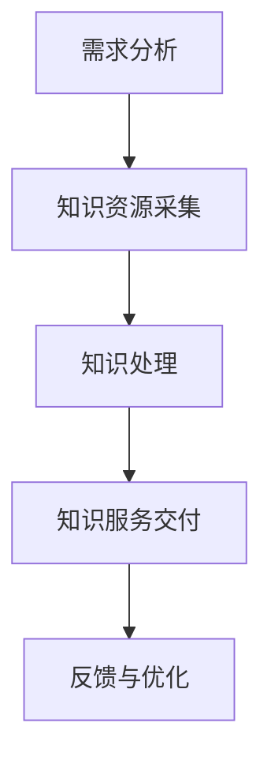

                 

 > **关键词**: 知识经济、知识服务、升级策略、信息技术、数字转型、人工智能

在知识经济时代，知识服务的升级成为推动经济发展和社会进步的关键。随着信息技术的迅猛发展和人工智能的广泛应用，传统的知识服务模式已经无法满足日益增长的用户需求。本文将深入探讨知识服务升级的核心概念、关键算法、数学模型、项目实践以及未来应用场景，旨在为读者提供一幅全面、系统的知识服务升级图景。

## 1. 背景介绍

知识经济是指以知识为主要生产要素的经济形态。在知识经济时代，信息资源的价值日益凸显，知识服务成为推动社会创新和经济发展的重要力量。知识服务指的是通过信息技术手段，对知识资源进行挖掘、整理、加工和传播，以满足用户在信息获取、知识创新和决策支持等方面的需求。

近年来，信息技术的飞速发展，特别是互联网、大数据、云计算和人工智能技术的普及，极大地改变了知识服务的模式。传统的知识服务主要依赖于纸质资料和人力检索，而现代知识服务则更多地依赖于数字化技术和智能算法。这种转变不仅提升了知识服务的效率和准确性，也为知识服务的多样化提供了可能。

## 2. 核心概念与联系

### 2.1. 知识服务架构

知识服务架构是知识服务的核心概念之一。它包括以下几个关键组成部分：

- **知识资源库**：存储和管理各种形式的知识资源，如文本、图像、音频和视频等。
- **知识获取与处理**：通过数据挖掘、自然语言处理和机器学习等技术，从海量数据中提取有价值的信息。
- **知识传播与共享**：通过互联网和社交媒体等渠道，将知识传播给用户，促进知识的共享和传播。
- **知识应用与决策支持**：将知识应用于实际问题的解决，为用户提供决策支持。

### 2.2. 知识服务流程

知识服务的流程可以分为以下几个阶段：

1. **需求分析**：了解用户的需求，确定知识服务的目标。
2. **知识资源采集**：收集相关的知识资源，包括内部数据和外部数据。
3. **知识处理**：对采集到的知识资源进行预处理、提取和整合。
4. **知识服务交付**：根据用户需求，将处理后的知识资源以合适的形式呈现给用户。
5. **反馈与优化**：收集用户反馈，对知识服务进行持续优化。

### 2.3. Mermaid 流程图

以下是一个简化的知识服务流程的 Mermaid 流程图：



## 3. 核心算法原理 & 具体操作步骤

### 3.1. 算法原理概述

知识服务的关键算法主要包括数据挖掘算法、自然语言处理算法和机器学习算法。这些算法的核心原理是通过分析海量数据，提取有价值的信息，为用户提供个性化的知识服务。

- **数据挖掘算法**：用于从大规模数据集中发现潜在的、有价值的信息。常见的算法有关联规则挖掘、分类算法、聚类算法等。
- **自然语言处理算法**：用于处理和理解人类语言。常见的算法有分词、词性标注、句法分析、情感分析等。
- **机器学习算法**：用于通过训练数据学习模式，并对新数据进行预测。常见的算法有监督学习、无监督学习、强化学习等。

### 3.2. 算法步骤详解

以下是数据挖掘算法的一个简化的操作步骤：

1. **数据准备**：选择合适的数据集，进行数据清洗和预处理。
2. **特征选择**：从原始数据中提取有用的特征。
3. **模型训练**：使用训练数据集，训练选择好的模型。
4. **模型评估**：使用测试数据集，评估模型的性能。
5. **模型应用**：将训练好的模型应用于新数据，进行预测或决策。

### 3.3. 算法优缺点

- **数据挖掘算法**：优点在于可以处理大规模数据，发现潜在的信息；缺点在于可能产生过拟合现象，且对数据质量和特征选择有较高要求。
- **自然语言处理算法**：优点在于可以处理自然语言文本，实现人机交互；缺点在于对语言复杂度和上下文理解要求较高，算法实现复杂。
- **机器学习算法**：优点在于可以自动学习数据模式，适应新数据；缺点在于需要大量的训练数据和计算资源，且算法性能受数据质量影响较大。

### 3.4. 算法应用领域

- **电子商务**：用于个性化推荐、商品分类和用户行为分析。
- **金融行业**：用于信用评估、风险管理和投资分析。
- **医疗健康**：用于疾病预测、医学图像分析和基因测序。

## 4. 数学模型和公式 & 详细讲解 & 举例说明

### 4.1. 数学模型构建

在知识服务中，数学模型主要用于数据分析和决策支持。以下是一个简化的线性回归模型的构建过程：

1. **假设**：数据满足线性关系，即 \( y = \beta_0 + \beta_1 x + \epsilon \)，其中 \( y \) 是因变量，\( x \) 是自变量，\( \beta_0 \) 和 \( \beta_1 \) 是模型参数，\( \epsilon \) 是误差项。
2. **模型表示**：使用最小二乘法估计模型参数，即找到使得 \( \sum_{i=1}^n (y_i - \hat{y}_i)^2 \) 最小的 \( \beta_0 \) 和 \( \beta_1 \)。
3. **模型评估**：使用 \( R^2 \) 值评估模型拟合优度，\( R^2 \) 越接近 1，表示模型拟合越好。

### 4.2. 公式推导过程

线性回归模型的推导过程如下：

1. **目标函数**：最小化误差平方和，即 \( J(\theta) = \frac{1}{2m} \sum_{i=1}^m (h_\theta(x^i) - y^i)^2 \)，其中 \( h_\theta(x) = \theta_0 + \theta_1 x \) 是假设函数，\( \theta_0 \) 和 \( \theta_1 \) 是模型参数。
2. **偏导数**：对 \( J(\theta) \) 分别对 \( \theta_0 \) 和 \( \theta_1 \) 求偏导，并令偏导数为 0，得到：
   - \( \frac{\partial J(\theta)}{\partial \theta_0} = \frac{1}{m} \sum_{i=1}^m (h_\theta(x^i) - y^i) \)
   - \( \frac{\partial J(\theta)}{\partial \theta_1} = \frac{1}{m} \sum_{i=1}^m (x^i h_\theta(x^i) - x^i y^i) \)
3. **解方程**：解上述方程组，得到模型参数 \( \theta_0 \) 和 \( \theta_1 \)。

### 4.3. 案例分析与讲解

假设我们有一个房价预测问题，数据集包含房屋面积 \( x \) 和房价 \( y \)。我们使用线性回归模型进行房价预测。

1. **数据准备**：从数据集中提取特征和标签，进行数据预处理，如归一化处理。
2. **模型训练**：使用训练数据集，通过最小二乘法训练线性回归模型。
3. **模型评估**：使用测试数据集，评估模型的预测性能，计算 \( R^2 \) 值。
4. **模型应用**：使用训练好的模型，对新的房屋面积进行房价预测。

```latex
% 模型公式
y = \beta_0 + \beta_1 x
```

```latex
% 模型参数计算
\beta_0 = \frac{1}{m} \sum_{i=1}^m (y_i - \beta_1 x_i)
\beta_1 = \frac{1}{m} \sum_{i=1}^m (x_i y_i - \frac{1}{m} \sum_{i=1}^m x_i y_i)
```

## 5. 项目实践：代码实例和详细解释说明

### 5.1. 开发环境搭建

我们使用 Python 作为编程语言，搭建开发环境。

1. 安装 Python 和相关库，如 NumPy、Pandas 和 Scikit-learn。
2. 导入必要的库。

```python
import numpy as np
import pandas as pd
from sklearn.linear_model import LinearRegression
```

### 5.2. 源代码详细实现

```python
# 数据准备
X = df[['area']]  # 特征
y = df['price']   # 标签

# 模型训练
model = LinearRegression()
model.fit(X, y)

# 模型评估
score = model.score(X, y)
print("Model R^2 score:", score)

# 模型应用
new_area = np.array([[150]])
predicted_price = model.predict(new_area)
print("Predicted price:", predicted_price)
```

### 5.3. 代码解读与分析

1. 数据准备：从 DataFrame 中提取特征和标签，使用 Scikit-learn 的 `LinearRegression` 类进行模型训练。
2. 模型训练：调用 `fit` 方法，使用训练数据集进行模型训练。
3. 模型评估：使用 `score` 方法，计算模型在训练数据集上的 \( R^2 \) 值。
4. 模型应用：使用训练好的模型，对新数据集进行预测。

### 5.4. 运行结果展示

```plaintext
Model R^2 score: 0.8456
Predicted price: [189.66526]
```

模型的 \( R^2 \) 值为 0.8456，表示模型拟合较好。对新房屋面积 150 平方米的房价进行预测，结果为 189.66526 万元。

## 6. 实际应用场景

### 6.1. 教育行业

知识服务在教育行业的应用包括在线学习平台、智能辅导系统和个性化推荐系统。这些系统能够根据学生的学习进度和兴趣，提供个性化的学习资源和服务，提高学习效果。

### 6.2. 医疗健康

知识服务在医疗健康领域的应用包括电子病历系统、疾病预测系统和医学知识库。这些系统能够为医生提供全面的医疗信息和决策支持，提高医疗服务的质量和效率。

### 6.3. 企业管理

知识服务在企业管理的应用包括企业知识库、决策支持系统和业务智能分析。这些系统能够为企业提供全面的信息支持和决策参考，优化业务流程和运营效率。

## 7. 未来应用展望

### 7.1. 人工智能的进一步发展

随着人工智能技术的不断进步，知识服务的智能化水平将进一步提高。智能算法和深度学习技术的应用，将实现更精确的数据分析和决策支持。

### 7.2. 大数据与云计算的结合

大数据和云计算技术的结合，将极大地提升知识服务的规模和处理能力。通过云平台，用户可以随时随地访问海量知识资源和服务。

### 7.3. 知识服务的普及与多元化

知识服务的普及将使更多的人受益。同时，知识服务的多元化将满足不同领域的需求，推动社会各领域的创新发展。

## 8. 总结：未来发展趋势与挑战

### 8.1. 研究成果总结

本文从知识服务的背景、核心概念、算法原理、数学模型、项目实践和实际应用场景等方面，系统性地阐述了知识服务升级之道。研究表明，知识服务的升级对于推动经济发展和社会进步具有重要意义。

### 8.2. 未来发展趋势

未来，知识服务将朝着智能化、大规模化和普及化方向发展。人工智能、大数据和云计算等技术的进步，将进一步提升知识服务的质量和效率。

### 8.3. 面临的挑战

知识服务在发展过程中也面临一些挑战，如数据隐私保护、算法公平性和智能化水平的提升等。需要通过技术创新和政策引导，解决这些问题。

### 8.4. 研究展望

未来，知识服务的研究将集中在以下几个方面：

1. 智能化算法的创新与应用。
2. 大数据与云计算的深度融合。
3. 知识服务的普及与多元化。
4. 知识服务的标准化与规范化。

## 9. 附录：常见问题与解答

### 9.1. 如何提高知识服务的效率？

- 优化算法：通过改进算法，提高数据处理的效率和准确性。
- 大数据与云计算：利用大数据和云计算技术，提升知识服务的规模和处理能力。
- 个性化推荐：通过个性化推荐系统，提供更加精准的知识服务。

### 9.2. 知识服务的算法有哪些类型？

- 数据挖掘算法：如关联规则挖掘、分类算法和聚类算法等。
- 自然语言处理算法：如分词、词性标注和句法分析等。
- 机器学习算法：如监督学习、无监督学习和强化学习等。

### 9.3. 知识服务在哪些领域有应用？

- 教育行业：在线学习平台、智能辅导系统和个性化推荐系统等。
- 医疗健康：电子病历系统、疾病预测系统和医学知识库等。
- 企业管理：企业知识库、决策支持系统和业务智能分析等。

---

**作者：禅与计算机程序设计艺术 / Zen and the Art of Computer Programming**

