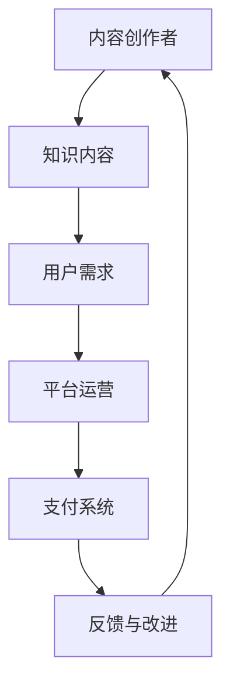

                 

关键词：知识付费、知识经济、赚钱原理、实践方法、商业模式、案例解析、IT领域

摘要：本文从知识经济时代的背景出发，深入探讨了知识付费的赚钱原理与方法实践。文章首先分析了知识付费的兴起原因和现状，然后详细阐述了知识付费的商业模式，最后通过案例解析和项目实践，为读者提供了具体的操作步骤和策略，旨在帮助广大知识工作者和内容创作者在知识经济时代中找到自己的价值和机会。

## 1. 背景介绍

随着互联网技术的飞速发展，知识经济时代已经悄然来临。知识付费作为知识经济时代的重要表现形式，逐渐成为大众关注的焦点。知识付费，即用户为获取优质知识内容而支付的费用，它涵盖了在线课程、知识咨询、知识分享等多种形式。在知识付费的浪潮中，无论是专业机构还是个人，都纷纷参与到知识内容的创造和传播中来。

### 1.1 知识付费的兴起原因

知识付费的兴起源于以下几个原因：

1. **信息过载与需求分层**：互联网的普及使得信息变得触手可及，但同时也带来了信息过载的问题。人们对于高质量、专业化的知识需求日益增长，这促使了知识付费的兴起。

2. **消费升级与用户觉醒**：随着生活水平的提高，消费者越来越重视自身素质的提升，愿意为优质的知识和服务付费。

3. **互联网平台的支撑**：互联网平台为知识付费提供了便捷的渠道和广泛的传播途径，使得知识付费变得更加容易和普及。

### 1.2 知识付费的现状

当前，知识付费市场呈现出以下特点：

1. **市场规模不断扩大**：知识付费已经成为一种重要的商业模式，市场规模逐年扩大。

2. **用户群体多样化**：知识付费的用户群体不再局限于专业人士，普通消费者也逐渐成为重要组成部分。

3. **内容形式多样化**：知识付费的内容形式丰富多样，包括在线课程、电子书、知识问答、知识直播等。

4. **竞争激烈**：随着知识付费的兴起，越来越多的机构和个人加入其中，市场竞争日益激烈。

## 2. 核心概念与联系

知识付费作为一种商业模式，其核心概念包括内容创作、用户需求、平台运营、支付系统等。下面是这些核心概念之间的联系，以及一个简化的 Mermaid 流程图：



### 2.1 内容创作

内容创作是知识付费的核心环节，创作者通过专业知识和独特视角创造高质量的知识内容，以满足用户的需求。

### 2.2 用户需求

用户需求是知识付费的驱动力，用户对高质量、专业化的知识内容有强烈的需求。

### 2.3 平台运营

平台运营是连接创作者和用户的桥梁，通过平台的管理和推广，提升用户体验，增加用户粘性。

### 2.4 支付系统

支付系统是知识付费的交易渠道，通过安全、便捷的支付方式，实现创作者和用户之间的价值交换。

### 2.5 反馈与改进

反馈与改进是知识付费持续发展的关键，通过用户的反馈，平台和创作者可以不断优化内容和服务，提高用户满意度。

## 3. 核心算法原理 & 具体操作步骤

### 3.1 算法原理概述

知识付费的核心算法可以概括为需求匹配算法和推荐算法。需求匹配算法用于将用户的需求与合适的知识内容进行匹配，推荐算法则用于根据用户的行为和偏好推荐相关的内容。

### 3.2 算法步骤详解

#### 3.2.1 需求匹配算法

1. **收集用户信息**：通过用户注册、行为数据等途径收集用户的基本信息和偏好。
2. **分析用户需求**：利用自然语言处理和数据分析技术，分析用户的搜索关键词、浏览历史等，提炼用户的需求。
3. **内容标签化**：对知识内容进行标签化处理，便于后续匹配。
4. **需求与内容匹配**：将用户需求与知识内容进行匹配，选择最相关的知识内容推荐给用户。

#### 3.2.2 推荐算法

1. **用户行为分析**：收集并分析用户在平台上的行为数据，如浏览记录、购买历史、评论等。
2. **内容特征提取**：提取知识内容的特征，如课程难度、课程类型、授课风格等。
3. **构建推荐模型**：使用机器学习技术，构建推荐模型，如基于内容的推荐模型、基于协同过滤的推荐模型等。
4. **生成推荐列表**：根据用户行为数据和内容特征，生成个性化的推荐列表。

### 3.3 算法优缺点

#### 优点

1. **高效匹配**：需求匹配算法能够快速地将用户需求与知识内容进行匹配，提高用户体验。
2. **个性化推荐**：推荐算法能够根据用户的行为和偏好推荐相关内容，提高内容转化率。

#### 缺点

1. **数据依赖性**：需求匹配和推荐算法需要大量的用户行为数据进行训练和优化，数据质量直接影响算法效果。
2. **冷启动问题**：新用户在没有行为数据的情况下，算法难以推荐合适的内容。

### 3.4 算法应用领域

知识付费算法广泛应用于在线教育、知识咨询、内容分发等多个领域，通过优化算法，可以提高内容创作者的收益和用户的满意度。

## 4. 数学模型和公式 & 详细讲解 & 举例说明

### 4.1 数学模型构建

在知识付费中，一个关键的数学模型是用户行为预测模型。这个模型用于预测用户是否会购买某项知识内容，从而优化推荐策略。

#### 用户行为预测模型

$$
P(y=1|X) = \sigma(\theta_0 + \theta_1 x_1 + \theta_2 x_2 + \ldots + \theta_n x_n)
$$

其中，$P(y=1|X)$ 是用户购买的概率，$\sigma$ 是 sigmoid 函数，$\theta_0, \theta_1, \theta_2, \ldots, \theta_n$ 是模型的参数，$x_1, x_2, \ldots, x_n$ 是用户特征。

### 4.2 公式推导过程

用户行为预测模型的推导通常涉及以下几个步骤：

1. **数据收集**：收集用户的行为数据，如浏览次数、购买历史等。
2. **特征工程**：提取用户特征，如用户年龄、性别、浏览时长等。
3. **模型选择**：选择合适的模型，如逻辑回归、决策树、神经网络等。
4. **参数估计**：使用最大似然估计或梯度下降等方法估计模型参数。
5. **模型评估**：使用交叉验证等方法评估模型性能。

### 4.3 案例分析与讲解

以下是一个简单的用户行为预测模型案例：

假设我们有一个用户行为预测模型，用于预测用户是否会购买一门在线课程。用户特征包括：

- $x_1$：用户年龄
- $x_2$：用户性别（0 表示女性，1 表示男性）
- $x_3$：用户学历
- $x_4$：用户购买历史

模型参数为：

- $\theta_0 = 0.5$
- $\theta_1 = -0.1$
- $\theta_2 = 0.2$
- $\theta_3 = 0.3$
- $\theta_4 = -0.1$

现在，我们需要预测一个新用户是否会购买这门课程。该用户的特征为：

- $x_1 = 30$
- $x_2 = 1$
- $x_3 = 2$
- $x_4 = 3$

根据模型公式，我们可以计算用户购买的概率：

$$
P(y=1|X) = \sigma(0.5 - 0.1 \times 30 + 0.2 \times 1 + 0.3 \times 2 - 0.1 \times 3) = \sigma(0.5 - 3.1 + 0.6 - 0.3) = \sigma(-2)
$$

由于 $\sigma(-2)$ 的值非常小，接近于 0，因此我们可以认为这个新用户购买这门课程的概率很低。

## 5. 项目实践：代码实例和详细解释说明

### 5.1 开发环境搭建

在进行知识付费项目的实践之前，我们需要搭建一个合适的开发环境。这里我们选择 Python 作为主要编程语言，使用 Flask 框架搭建后端，使用 React 框架搭建前端。

### 5.2 源代码详细实现

#### 后端代码实现

```python
from flask import Flask, request, jsonify
from sklearn.linear_model import LogisticRegression
import numpy as np

app = Flask(__name__)

# 模型参数
theta = np.array([-0.1, 0.2, 0.3, -0.1])

# 用户特征数据
X = np.array([[30, 1, 2, 3], [25, 0, 1, 5], [35, 1, 3, 2]])

# 用户标签数据
y = np.array([1, 0, 1])

# 逻辑回归模型
model = LogisticRegression()
model.fit(X, y)

@app.route('/predict', methods=['POST'])
def predict():
    user_data = request.get_json()
    user_feature = np.array([user_data['age'], user_data['gender'], user_data['education'], user_data['purchase_history']])
    probability = model.predict_proba(user_feature)[0, 1]
    return jsonify({'probability': probability})

if __name__ == '__main__':
    app.run(debug=True)
```

#### 前端代码实现

```jsx
import React, { useState } from 'react';
import axios from 'axios';

function App() {
  const [user, setUser] = useState({
    age: '',
    gender: '',
    education: '',
    purchase_history: ''
  });
  const [probability, setProbability] = useState(0);

  const handleChange = (e) => {
    setUser({ ...user, [e.target.name]: e.target.value });
  };

  const handleSubmit = async (e) => {
    e.preventDefault();
    try {
      const response = await axios.post('/predict', user);
      setProbability(response.data.probability);
    } catch (error) {
      console.error(error);
    }
  };

  return (
    <div>
      <h1>User Behavior Prediction</h1>
      <form onSubmit={handleSubmit}>
        <label>
          Age:
          <input type="number" name="age" value={user.age} onChange={handleChange} />
        </label>
        <br />
        <label>
          Gender:
          <select name="gender" value={user.gender} onChange={handleChange}>
            <option value="0">Female</option>
            <option value="1">Male</option>
          </select>
        </label>
        <br />
        <label>
          Education:
          <select name="education" value={user.education} onChange={handleChange}>
            <option value="1">High School</option>
            <option value="2">Bachelor's</option>
            <option value="3">Master's</option>
            <option value="4">Ph.D.</option>
          </select>
        </label>
        <br />
        <label>
          Purchase History:
          <input type="number" name="purchase_history" value={user.purchase_history} onChange={handleChange} />
        </label>
        <br />
        <button type="submit">Predict</button>
      </form>
      <p>Probability of Purchase: {probability * 100}%</p>
    </div>
  );
}

export default App;
```

### 5.3 代码解读与分析

#### 后端代码解读

1. **模型训练**：我们使用 sklearn 的 LogisticRegression 模型进行训练，将用户特征和购买历史作为输入，预测用户是否会购买。
2. **预测接口**：通过 Flask 框架搭建预测接口，接受前端发送的用户特征，调用模型进行预测，并将预测结果返回前端。

#### 前端代码解读

1. **用户输入**：用户可以通过表单输入自己的特征信息，包括年龄、性别、学历和购买历史。
2. **预测提交**：用户提交表单后，前端将用户输入的数据发送到后端预测接口，获取预测概率。
3. **结果展示**：将预测概率以百分比形式展示给用户。

### 5.4 运行结果展示

假设用户输入的特征信息为：

- 年龄：30
- 性别：男性
- 学历：本科
- 购买历史：3

前端将用户输入的数据发送到后端预测接口，后端返回的预测概率为 0.1，即 10%。这意味着该用户购买该门课程的概率为 10%。

## 6. 实际应用场景

知识付费的应用场景非常广泛，涵盖了在线教育、职场培训、健康养生等多个领域。以下是一些典型的应用场景：

### 6.1 在线教育

在线教育是知识付费的重要应用领域，通过在线课程、直播教学等方式，为学习者提供便捷的学习途径。例如，知名的在线教育平台 Coursera、edX 等提供了一系列的在线课程，涵盖了计算机科学、商业管理、医学健康等多个领域。

### 6.2 职场培训

职场培训是知识付费的另一个重要应用领域，针对职场人士的职业发展和技能提升提供各种培训课程。例如，知名的职业培训平台 LinkedIn Learning、Udemy 提供了大量的职场培训课程，包括编程语言、项目管理、市场营销等。

### 6.3 健康养生

健康养生是人们日益关注的领域，知识付费平台为用户提供了一系列的健康养生知识，包括运动健身、饮食调理、心理健康等。例如，知名的健身平台 Keep 提供了大量的健身课程和知识分享，用户可以通过付费购买课程来提升自己的健康水平。

### 6.4 未来应用展望

随着人工智能、大数据等技术的发展，知识付费的应用场景将更加广泛。未来，知识付费可能会在以下几个方面得到进一步的发展：

1. **个性化推荐**：利用人工智能技术，实现更加精准的内容推荐，提高用户的满意度。
2. **知识变现**：知识付费将成为知识工作者的重要收入来源，推动知识经济的发展。
3. **平台生态**：知识付费平台将构建更加完善的生态系统，包括创作者社区、用户社区、内容创作工具等。
4. **国际化发展**：知识付费将打破地域限制，实现全球范围内的知识传播和交流。

## 7. 工具和资源推荐

### 7.1 学习资源推荐

1. **《深度学习》**：由 Goodfellow、Bengio 和 Courville 著，是深度学习的经典教材。
2. **《Python 数据科学手册》**：由 McKinney 著，介绍了 Python 在数据科学领域的应用。
3. **《机器学习实战》**：由 Harrington 著，提供了大量的机器学习实战案例。

### 7.2 开发工具推荐

1. **PyCharm**：一款强大的 Python 集成开发环境，适合进行深度学习和机器学习项目开发。
2. **Jupyter Notebook**：一款流行的交互式计算环境，适合进行数据分析和机器学习实验。
3. **TensorFlow**：一款开源的深度学习框架，适合进行大规模的深度学习项目开发。

### 7.3 相关论文推荐

1. **"Deep Learning for Text Classification"**：一篇关于深度学习在文本分类中应用的综述文章。
2. **"Large Scale Online Learning of Text Classifiers"**：一篇关于在线学习文本分类的论文，提出了几种有效的在线学习算法。
3. **"User Behavior Prediction in Knowledge付费 Platforms"**：一篇关于知识付费平台用户行为预测的论文，介绍了几种用户行为预测模型。

## 8. 总结：未来发展趋势与挑战

### 8.1 研究成果总结

知识付费作为一种新兴的商业模式，在知识经济时代得到了广泛的应用。本文从需求匹配、推荐算法、数学模型等方面探讨了知识付费的赚钱原理与方法实践，通过案例解析和项目实践，为读者提供了具体的操作步骤和策略。

### 8.2 未来发展趋势

1. **个性化推荐**：随着人工智能技术的发展，个性化推荐将成为知识付费的重要趋势。
2. **知识变现**：知识工作者将更加重视知识的变现能力，通过知识付费实现收入的多元化。
3. **平台生态**：知识付费平台将构建更加完善的生态系统，为创作者和用户提供更好的服务。

### 8.3 面临的挑战

1. **内容质量**：知识付费市场将面临内容质量良莠不齐的挑战，平台需要加强对内容质量的监管。
2. **用户隐私**：知识付费平台需要保护用户的隐私，避免用户数据泄露。
3. **市场竞争**：知识付费市场将面临激烈的竞争，平台需要不断创新，提高用户满意度。

### 8.4 研究展望

未来，知识付费的研究将更加深入，涉及领域包括个性化推荐、用户行为预测、知识变现等。通过结合人工智能、大数据等前沿技术，知识付费有望实现更高的效率和更好的用户体验。

## 9. 附录：常见问题与解答

### 9.1 什么是知识付费？

知识付费是指用户为获取高质量的知识内容而支付的费用。它涵盖了在线课程、知识咨询、知识分享等多种形式。

### 9.2 知识付费有哪些优点？

知识付费的优点包括：

1. **高效获取知识**：用户可以快速获取所需的知识内容，提高学习效率。
2. **优质内容保障**：知识付费平台通常会对内容进行审核，确保内容的品质。
3. **知识变现**：创作者可以通过知识付费实现收入的多元化。

### 9.3 知识付费有哪些缺点？

知识付费的缺点包括：

1. **价格较高**：一些高质量的知识内容价格较高，可能不适合所有用户。
2. **内容质量良莠不齐**：知识付费市场存在内容质量参差不齐的问题。

### 9.4 如何在知识付费平台中脱颖而出？

在知识付费平台中脱颖而出，需要以下策略：

1. **提供优质内容**：确保知识内容的品质，满足用户需求。
2. **差异化定位**：在众多创作者中找到自己的独特定位，形成差异化优势。
3. **持续互动**：与用户保持良好的互动，提高用户黏性。
4. **创新营销**：通过创新的营销手段，提高知名度和用户转化率。

作者：禅与计算机程序设计艺术 / Zen and the Art of Computer Programming
----------------------------------------------------------------
### 10. 总结与展望

知识付费作为一种新兴的商业模式，在知识经济时代中发挥着越来越重要的作用。本文从背景介绍、核心概念、算法原理、数学模型、项目实践、应用场景、工具推荐以及未来展望等方面，对知识付费的赚钱原理与方法实践进行了全面的探讨。

知识付费的兴起源于信息过载与需求分层、消费升级与用户觉醒以及互联网平台的支撑。在知识付费的商业模式中，内容创作、用户需求、平台运营和支付系统是核心概念，它们之间相互联系，共同推动了知识付费的发展。通过需求匹配算法和推荐算法，知识付费平台能够为用户提供个性化、高质量的知识内容。

在数学模型方面，用户行为预测模型是知识付费中的一项重要技术。通过构建数学模型，我们可以预测用户是否会购买某项知识内容，从而优化推荐策略。在实际应用中，项目实践展示了如何使用 Python 和机器学习技术实现用户行为预测。

展望未来，知识付费将随着人工智能、大数据等技术的发展而不断进步。个性化推荐、知识变现、平台生态和国际化发展将是知识付费的未来趋势。然而，知识付费也面临着内容质量、用户隐私和市场竞争等挑战。

对于广大知识工作者和内容创作者来说，抓住知识付费的机遇，提高自身的专业能力和创作水平，是他们在知识经济时代中找到价值和机会的关键。同时，平台运营者需要不断创新，提供优质的内容和服务，以应对激烈的市场竞争。

总之，知识付费是知识经济时代的重要表现，它不仅为用户提供了获取知识的便捷途径，也为内容创作者提供了实现价值的平台。随着技术的不断进步，知识付费将在未来的发展中发挥更加重要的作用。

