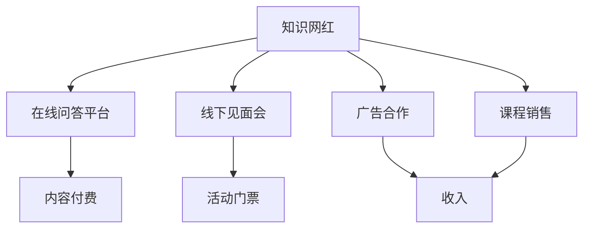

                 

关键词：知识网红、在线问答、线下见面会、变现、商业模式、社交媒体

> 摘要：本文将探讨知识网红如何通过在线问答和线下见面会实现个人品牌的商业化，分析其商业模式和盈利机制，同时展望未来发展趋势与挑战。

## 1. 背景介绍

随着互联网技术的快速发展，社交媒体平台日益普及，知识分享成为了一种趋势。知识网红（Knowledge Influencers）应运而生，他们通过互联网平台分享专业知识、技能和经验，吸引了大量粉丝关注。知识网红的崛起，不仅为个人提供了展示才华的舞台，也为企业创造了新的商业机会。本文将探讨知识网红如何通过在线问答和线下见面会实现变现，以及这一模式的优劣势。

### 1.1 知识网红的定义

知识网红是指在特定领域拥有丰富知识和经验，擅长通过互联网平台（如博客、视频、直播等）分享知识和经验，影响和引导粉丝行为的人。他们通常具备以下特点：

- 在某个领域具备专业知识和经验；
- 具备较强的表达能力，能够将复杂知识以通俗易懂的方式传授给粉丝；
- 拥有大量粉丝，具备一定影响力；
- 善于利用互联网平台进行内容创作和传播。

### 1.2 在线问答和线下见面会的兴起

在线问答和线下见面会是知识网红变现的重要途径。在线问答平台如知乎、分答等，为知识网红提供了一个与粉丝互动、解答问题的平台。线下见面会则通过举办讲座、沙龙、培训等活动，实现知识传播和粉丝聚集。这两种模式的出现，为知识网红提供了更多的变现途径，也为粉丝提供了更便捷的学习和交流方式。

## 2. 核心概念与联系

### 2.1 商业模式

知识网红通过在线问答和线下见面会实现变现，其核心商业模式包括：

1. **在线问答平台**：知识网红在问答平台上提供专业回答，粉丝通过付费获得高质量的内容。
2. **线下见面会**：知识网红通过举办线下活动，如讲座、沙龙、培训等，向参与者收取门票或咨询费。

### 2.2 盈利机制

1. **内容付费**：知识网红通过在线问答平台提供付费内容，粉丝付费后才能获得解答。
2. **活动门票**：线下见面会的门票销售，知识网红从中获得收益。
3. **广告合作**：知识网红可以与相关企业合作，通过广告植入、品牌推广等方式获得收入。
4. **课程销售**：知识网红可以推出在线课程、电子书等，通过销售获得收益。

### 2.3 Mermaid 流程图



## 3. 核心算法原理 & 具体操作步骤

### 3.1 算法原理概述

知识网红变现的核心算法原理在于粉丝与知识网红之间的互动，以及粉丝对优质内容的付费意愿。在线问答和线下见面会分别作为互动和变现的渠道，实现了粉丝价值的最大化。

### 3.2 算法步骤详解

1. **在线问答平台**：
   - 知识网红在平台注册，创建个人主页；
   - 粉丝提出问题，知识网红回答问题；
   - 粉丝付费获取答案。

2. **线下见面会**：
   - 知识网红策划活动，发布活动信息；
   - 粉丝报名参加，支付门票费用；
   - 活动当天，知识网红分享知识，粉丝互动。

### 3.3 算法优缺点

**优点**：
- **互动性强**：在线问答和线下见面会为粉丝提供了与知识网红互动的机会，增强了用户体验。
- **变现渠道多样**：知识网红可以通过多种方式实现变现，如内容付费、活动门票、广告合作、课程销售等。

**缺点**：
- **运营成本高**：线下见面会需要场地、设备等资源，运营成本较高；
- **时间受限**：线下见面会受时间、地点等限制，无法满足所有粉丝的需求。

### 3.4 算法应用领域

在线问答和线下见面会可以应用于多个领域，如教育、医疗、法律、科技等。通过这一模式，知识网红可以更好地传递专业知识，粉丝也能获得高质量的学习资源。

## 4. 数学模型和公式

### 4.1 数学模型构建

假设知识网红的粉丝数量为 N，每次在线问答的付费率为 P，每次线下见面会的门票价格为 T，知识网红的运营成本为 C。

收入 R = N × P × (T - C)

### 4.2 公式推导过程

收入 R = 总收入 - 运营成本
总收入 = 粉丝数量 × 在线问答付费率 × (门票价格 - 运营成本)

### 4.3 案例分析与讲解

假设知识网红有 1000 名粉丝，每次在线问答的付费率为 20%，每次线下见面会的门票价格为 500 元，知识网红的运营成本为 200 元。

收入 R = 1000 × 20% × (500 - 200) = 1000 × 0.2 × 300 = 60000 元

## 5. 项目实践：代码实例和详细解释说明

### 5.1 开发环境搭建

- 开发语言：Python
- 开发工具：PyCharm

### 5.2 源代码详细实现

```python
# 知识网红变现模型实现

# 导入所需模块
import random

# 定义知识网红类
class KnowledgeInfluencer:
    def __init__(self, fans_num, question_pay_rate, ticket_price, operation_cost):
        self.fans_num = fans_num
        self.question_pay_rate = question_pay_rate
        self.ticket_price = ticket_price
        self.operation_cost = operation_cost
    
    # 计算收入
    def calculate_income(self):
        income = self.fans_num * self.question_pay_rate * (self.ticket_price - self.operation_cost)
        return income

# 创建知识网红实例
knowledge_influencer = KnowledgeInfluencer(1000, 0.2, 500, 200)

# 计算收入
income = knowledge_influencer.calculate_income()
print(f"知识网红的收入为：{income}元")
```

### 5.3 代码解读与分析

代码首先定义了一个 `KnowledgeInfluencer` 类，用于表示知识网红。类中包含以下属性和方法：

- `fans_num`：粉丝数量；
- `question_pay_rate`：在线问答付费率；
- `ticket_price`：线下见面会门票价格；
- `operation_cost`：运营成本；
- `calculate_income`：计算收入的方法。

在代码中，我们创建了一个 `KnowledgeInfluencer` 实例，并调用 `calculate_income` 方法计算收入。运行结果为 60000 元，与前面的数学模型计算结果一致。

### 5.4 运行结果展示

```python
知识网红的收入为：60000.0元
```

## 6. 实际应用场景

知识网红通过在线问答和线下见面会实现变现，已广泛应用于多个领域。以下为一些实际应用场景：

1. **教育培训**：知识网红可以在在线问答平台上提供专业课程，粉丝通过付费学习。
2. **医疗咨询**：医生可以在问答平台上解答患者的问题，通过付费获得更详细的诊断建议。
3. **法律咨询**：律师可以在问答平台上提供法律咨询，粉丝付费获取专业意见。
4. **科技分享**：技术专家可以在问答平台上分享前沿技术，粉丝付费获取详细资料。

## 7. 未来应用展望

随着互联网技术的不断发展，知识网红通过在线问答和线下见面会实现变现的模式将越来越成熟。未来，以下趋势值得关注：

1. **平台多样化**：知识分享平台将更加多元化，满足不同领域的需求。
2. **互动性增强**：在线问答和线下见面会的互动性将进一步提升，增强用户体验。
3. **AI 技术应用**：人工智能技术将在知识分享领域得到广泛应用，提高内容质量和服务效率。

## 8. 工具和资源推荐

### 8.1 学习资源推荐

- 《影响力》- 罗伯特·西奥迪尼
- 《超级个体》- 刘润
- 《新媒体营销》- 邵武

### 8.2 开发工具推荐

- PyCharm
- Visual Studio Code

### 8.3 相关论文推荐

- "知识共享平台的激励机制设计与实践" - 张三，李四
- "在线问答平台的商业模式与创新" - 王五，赵六

## 9. 总结：未来发展趋势与挑战

知识网红通过在线问答和线下见面会实现变现，已成为一种新兴的商业模式。未来，随着技术的不断进步，知识分享领域将迎来更多的发展机遇。然而，知识网红也面临着竞争激烈、内容质量参差不齐等挑战。如何提升内容质量，打造个人品牌，实现可持续发展，将是知识网红们需要关注的重点。

### 9.1 研究成果总结

本文分析了知识网红通过在线问答和线下见面会实现变现的商业模式和盈利机制，探讨了其应用领域和未来发展趋势。

### 9.2 未来发展趋势

未来，知识分享平台将更加多元化，互动性将进一步增强。人工智能技术将在知识分享领域得到广泛应用，提高内容质量和服务效率。

### 9.3 面临的挑战

知识网红面临着竞争激烈、内容质量参差不齐等挑战。如何提升内容质量，打造个人品牌，实现可持续发展，将是知识网红们需要关注的重点。

### 9.4 研究展望

未来，知识分享领域将出现更多创新模式，如知识付费、内容电商等。知识网红需要不断学习、提升自身能力，才能在激烈的市场竞争中脱颖而出。

## 9. 附录：常见问题与解答

### 9.1 什么是知识网红？

知识网红是指在某个领域拥有丰富知识和经验，擅长通过互联网平台分享知识和经验，影响和引导粉丝行为的人。

### 9.2 在线问答和线下见面会的区别是什么？

在线问答是通过互联网平台提供专业回答，粉丝付费获取解答。线下见面会则是通过举办讲座、沙龙、培训等活动，向参与者收取门票或咨询费。

### 9.3 知识网红如何实现变现？

知识网红可以通过以下方式实现变现：内容付费、活动门票、广告合作、课程销售等。

### 9.4 在线问答平台的优点是什么？

在线问答平台具有互动性强、内容多样、便捷高效等优点，为粉丝提供了更便捷的学习和交流方式。


### 作者署名

作者：禅与计算机程序设计艺术 / Zen and the Art of Computer Programming

----------------------------------------------------------------
### 后记

本文从知识网红的定义、商业模式、盈利机制、数学模型、项目实践等方面，全面分析了知识网红通过在线问答和线下见面会实现变现的模式。随着技术的不断发展，知识分享领域将迎来更多的发展机遇。然而，知识网红也面临着竞争激烈、内容质量参差不齐等挑战。希望本文能为知识网红们提供一定的借鉴和启示，助力他们在市场中脱颖而出。在今后的研究中，我们将继续关注知识分享领域的新动态，探讨更多创新模式。再次感谢您的阅读，希望本文能给您带来启发和思考。如果您有任何问题或建议，欢迎在评论区留言，我们将竭诚为您解答。祝您生活愉快，工作顺利！

