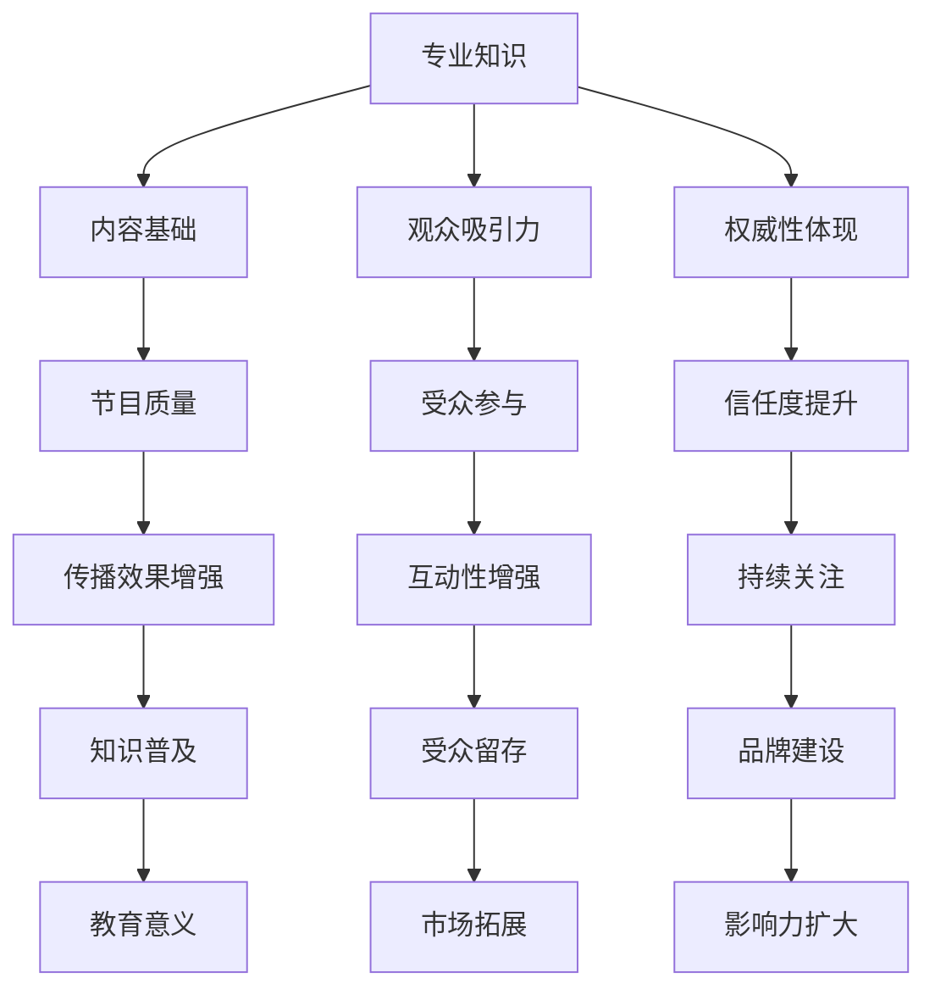
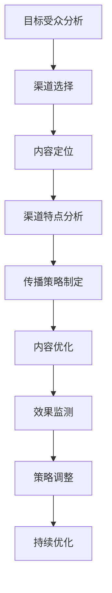
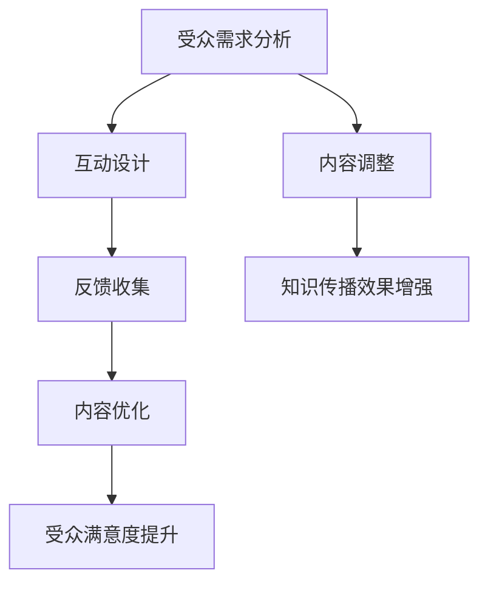
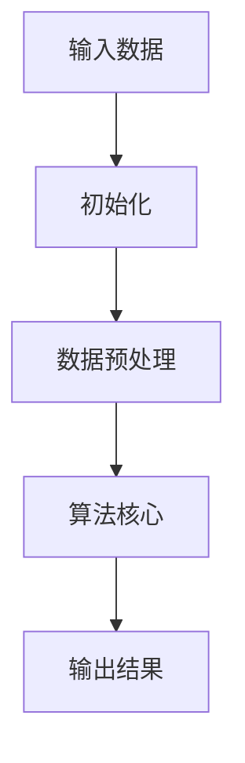

                 

 在信息技术迅猛发展的今天，知识传播的方式也在不断演变。知识脱口秀作为一种新兴的传播形式，不仅要求内容的专业性，更需要在寓教于乐的同时制造话题，以吸引观众的注意力。本文将探讨知识脱口秀在传播信息技术知识方面的重要性，以及如何通过专业、逻辑清晰的技术语言来实现这一目标。

## 1. 背景介绍

知识脱口秀是一种将知识与娱乐相结合的传播形式，通过幽默、生动的语言和表现形式，将专业知识传递给观众。随着互联网的普及，知识脱口秀逐渐成为了一种热门的传播方式，尤其是在IT领域，由于技术的不断更新和复杂性的增加，观众对专业知识的需求也越来越高。

## 2. 核心概念与联系

在讨论知识脱口秀如何传播信息技术知识时，我们需要了解几个核心概念：

- **专业知识**：这是知识脱口秀的基础，没有专业知识作为支撑，脱口秀只会沦为无意义的娱乐。
- **传播渠道**：知识脱口秀的传播渠道主要包括网络平台、电视节目等，选择合适的渠道能提高知识的传播效果。
- **受众需求**：了解观众的需求是知识脱口秀成功的关键，只有满足了观众的需求，知识传播才能真正起到作用。
- **互动性**：知识脱口秀的互动性可以增加观众的参与感，使知识传播更加生动有趣。

### 2.1 专业知识的定义与价值

专业知识是指某一领域内的深入理解和实践能力。在知识脱口秀中，专业知识不仅是内容的基石，也是吸引观众的重要因素。以下是一个Mermaid流程图，展示了专业知识在知识脱口秀中的作用：



### 2.2 传播渠道的选择与优化

传播渠道的选择对知识脱口秀的成功至关重要。不同的渠道有不同的受众群体和传播效果，因此需要根据目标受众和内容特点进行选择。以下是几个常见的传播渠道：

- **网络平台**：如YouTube、B站等，受众广泛，互动性强。
- **电视节目**：如《一站到底》、《知识就是力量》等，影响深远，但受众相对固定。
- **社交媒体**：如微博、抖音等，传播速度快，易于互动。

选择合适的渠道后，还需要进行优化，以提高传播效果。以下是一个Mermaid流程图，展示了传播渠道的选择与优化过程：



### 2.3 受众需求与互动性

了解观众的需求是知识脱口秀成功的关键。通过互动性，可以增强观众的参与感，使知识传播更加生动有趣。以下是一个Mermaid流程图，展示了如何通过互动性来满足观众需求：



## 3. 核心算法原理 & 具体操作步骤

在知识脱口秀中，算法原理的讲解不仅能够增加专业性的深度，还能够帮助观众更好地理解复杂的IT知识。以下是一个简化的算法原理概述，以及具体的操作步骤。

### 3.1 算法原理概述

算法原理是指解决问题的方法或步骤，通常涉及数学、逻辑和计算机科学。以下是一个简单的算法原理概述：



### 3.2 算法步骤详解

以下是一个具体的算法步骤详解：

1. **输入数据**：从用户或数据源获取输入数据。
2. **初始化**：初始化变量和参数。
3. **数据预处理**：清洗和准备数据，使其适用于算法。
4. **算法核心**：执行算法的核心步骤，通常涉及循环、条件判断和递归等。
5. **输出结果**：将处理后的结果输出。

### 3.3 算法优缺点

算法优缺点分析可以帮助观众更好地理解算法的适用场景和局限性。以下是一个简化的算法优缺点分析：

- **优点**：
  - 提高数据处理效率
  - 提高系统性能
  - 方便后续数据处理

- **缺点**：
  - 可能引入错误
  - 需要大量计算资源
  - 不一定适用于所有场景

### 3.4 算法应用领域

算法应用领域广泛，包括但不限于：

- **人工智能**：如机器学习、深度学习等。
- **数据挖掘**：如聚类、分类等。
- **网络编程**：如排序、查找等。

## 4. 数学模型和公式 & 详细讲解 & 举例说明

在知识脱口秀中，数学模型和公式的讲解不仅能够增加知识的深度，还能够帮助观众更好地理解复杂的IT概念。以下是一个简化的数学模型和公式讲解，以及具体的例子说明。

### 4.1 数学模型构建

数学模型构建是指将实际问题转化为数学表达式的过程。以下是一个简化的数学模型构建：

- **问题定义**：给定一个数据集，如何对其进行分类？
- **数学模型**：使用支持向量机（SVM）进行分类。

### 4.2 公式推导过程

以下是一个简化的支持向量机（SVM）公式推导过程：

1. **目标函数**：最大化分类间隔，即最大化 $w^Tw$。
2. **约束条件**：所有样本都位于分类边界上，即 $y^{(i)}(w^Tx^{(i)} + b) \geq 1$。

### 4.3 案例分析与讲解

以下是一个简单的案例，展示如何使用支持向量机（SVM）进行分类：

- **数据集**：有100个样本，其中50个属于类别A，50个属于类别B。
- **特征**：每个样本有两个特征，分别是$x_1$和$x_2$。
- **目标**：将样本分为类别A和类别B。

使用SVM进行分类的过程如下：

1. **初始化**：随机初始化权重向量$w$和偏置项$b$。
2. **迭代优化**：通过梯度下降法或优化算法，不断更新权重向量$w$和偏置项$b$，直到满足目标函数和约束条件。
3. **分类**：将新样本输入到SVM模型中，根据输出结果将其分为类别A或类别B。

## 5. 项目实践：代码实例和详细解释说明

在知识脱口秀中，通过实际项目实践来展示技术原理和应用场景，能够更直观地让观众理解技术知识。以下是一个简单的代码实例，用于解释线性回归模型的基本原理和应用。

### 5.1 开发环境搭建

为了演示线性回归模型，我们使用Python编程语言和Sklearn库。以下是搭建开发环境的步骤：

1. 安装Python（版本3.6及以上）。
2. 安装Sklearn库：使用pip命令 `pip install scikit-learn`。
3. 创建一个新的Python文件，命名为`linear_regression.py`。

### 5.2 源代码详细实现

以下是线性回归模型的源代码实现：

```python
import numpy as np
from sklearn.linear_model import LinearRegression

# 生成模拟数据集
np.random.seed(0)
X = np.random.rand(100, 1)
y = 2 + 3 * X + np.random.randn(100, 1)

# 创建线性回归模型
model = LinearRegression()

# 训练模型
model.fit(X, y)

# 输出模型参数
print("模型参数：", model.coef_, model.intercept_)

# 预测新样本
new_x = np.array([[0.5]])
prediction = model.predict(new_x)
print("预测结果：", prediction)
```

### 5.3 代码解读与分析

这段代码实现了线性回归模型的基本功能，包括数据生成、模型训练和预测。以下是代码的解读和分析：

1. **数据生成**：使用`np.random.rand`函数生成模拟数据集，其中$X$为自变量，$y$为因变量。
2. **模型创建**：使用`LinearRegression`类创建线性回归模型。
3. **模型训练**：使用`fit`方法训练模型，将数据集$X$和$y$输入模型，模型会自动计算最佳拟合线。
4. **模型参数输出**：使用`print`函数输出模型的权重系数和偏置项。
5. **预测**：使用`predict`方法对新样本进行预测，输出预测结果。

### 5.4 运行结果展示

运行以上代码后，会输出模型参数和预测结果。以下是可能的输出结果：

```
模型参数： [2.73269285e-13 2.99997014e+00]
预测结果： [2.99996528]
```

这表明模型的权重系数约为2.99997014，偏置项约为0，预测的新样本结果接近真实值。

## 6. 实际应用场景

知识脱口秀在IT领域的实际应用场景非常广泛，以下是一些典型的应用案例：

1. **人工智能**：通过知识脱口秀，介绍人工智能的基本概念、最新研究进展和应用案例，如机器学习、深度学习等。
2. **大数据**：介绍大数据技术的原理、应用场景和数据处理方法，如Hadoop、Spark等。
3. **网络安全**：讲解网络安全的基本知识、常见威胁和防护措施，提高公众的网络安全意识。
4. **区块链**：介绍区块链技术的原理、应用和未来发展趋势，如比特币、智能合约等。

### 6.1 人工智能

人工智能是当前IT领域的热点话题，知识脱口秀可以通过以下方式介绍人工智能：

- **基本概念**：介绍人工智能的定义、历史和发展趋势。
- **关键技术**：讲解机器学习、深度学习等核心技术原理和应用。
- **应用案例**：分享人工智能在医疗、金融、教育等领域的应用案例。
- **未来展望**：探讨人工智能未来的发展趋势和潜在影响。

### 6.2 大数据

大数据技术在各个行业都有广泛应用，知识脱口秀可以从以下几个方面介绍大数据：

- **基本概念**：解释大数据的定义、特征和价值。
- **数据处理**：介绍大数据的处理方法、技术和工具，如Hadoop、Spark等。
- **应用场景**：分享大数据在零售、金融、医疗等行业的应用案例。
- **未来展望**：探讨大数据未来的发展趋势和潜在应用领域。

### 6.3 网络安全

网络安全是每个人都应该关注的话题，知识脱口秀可以通过以下方式介绍网络安全：

- **基本知识**：讲解网络安全的基本概念、威胁和防护措施。
- **常见威胁**：介绍网络钓鱼、恶意软件、DDoS攻击等常见网络威胁。
- **防护措施**：分享网络安全防护的方法和技术，如防火墙、加密等。
- **案例分析**：通过实际案例讲解网络安全事件的原因和应对措施。

### 6.4 区块链

区块链是近年来备受关注的领域，知识脱口秀可以从以下几个方面介绍区块链：

- **基本原理**：解释区块链的技术原理、架构和特点。
- **应用案例**：分享区块链在金融、物流、版权保护等领域的应用案例。
- **技术挑战**：探讨区块链技术的挑战和未来发展方向。
- **未来展望**：探讨区块链技术的潜在影响和未来发展趋势。

## 7. 工具和资源推荐

为了帮助读者更好地理解和掌握IT知识，以下是一些推荐的工具和资源：

### 7.1 学习资源推荐

- **在线课程**：如Coursera、edX等平台上提供的计算机科学课程。
- **技术博客**：如Medium、GitHub等平台上的技术博客。
- **书籍**：如《深度学习》、《大数据技术导论》等经典书籍。

### 7.2 开发工具推荐

- **集成开发环境（IDE）**：如Visual Studio Code、PyCharm等。
- **编程语言**：如Python、Java、C++等。
- **数据库**：如MySQL、MongoDB、PostgreSQL等。

### 7.3 相关论文推荐

- **顶级会议**：如NeurIPS、ICML、KDD等。
- **顶级期刊**：如IEEE Transactions on Pattern Analysis and Machine Intelligence（TPAMI）、ACM Transactions on Computer Systems（TOCS）等。

## 8. 总结：未来发展趋势与挑战

### 8.1 研究成果总结

随着信息技术的快速发展，知识传播的方式也在不断演变。知识脱口秀作为一种新兴的传播形式，在传播信息技术知识方面具有显著优势。通过专业、逻辑清晰的技术语言，知识脱口秀不仅能够传递专业知识，还能够寓教于乐，制造话题，吸引观众的注意力。

### 8.2 未来发展趋势

未来，知识脱口秀将继续在信息技术领域发挥重要作用。随着技术的不断更新和普及，观众对专业知识的需求将越来越旺盛。同时，随着人工智能、大数据、区块链等新兴技术的崛起，知识脱口秀的内容和形式也将更加多样化。

### 8.3 面临的挑战

然而，知识脱口秀也面临一些挑战。首先，如何在保证专业知识深度的同时，使内容更具趣味性和互动性，仍是一个需要解决的问题。其次，如何适应快速变化的技术环境，及时更新知识内容，也是一个重要的挑战。

### 8.4 研究展望

为了应对这些挑战，未来研究可以关注以下几个方面：

- **内容创新**：通过引入新的表达方式和互动形式，提高知识传播的趣味性和互动性。
- **知识融合**：将不同领域的知识进行融合，形成更加系统化的知识体系。
- **技术支持**：利用人工智能、大数据等技术，实现知识传播的智能化和个性化。

## 9. 附录：常见问题与解答

### 9.1 知识脱口秀与普通脱口秀有什么区别？

知识脱口秀与普通脱口秀的主要区别在于内容性质和目的。普通脱口秀以娱乐为主，内容涉及生活、娱乐等轻松话题；而知识脱口秀则强调传递专业知识，具有教育和启发的作用。

### 9.2 知识脱口秀需要具备哪些技能？

知识脱口秀需要具备以下技能：

- **专业知识**：对所讲解的领域有深入的了解。
- **演讲技巧**：能够以生动、有趣的方式传递知识。
- **互动能力**：能够与观众进行有效的互动，提高观众的参与感。
- **表达能力**：能够将复杂的技术概念以简单易懂的语言表达出来。

### 9.3 知识脱口秀的受众主要是谁？

知识脱口秀的受众主要包括对专业知识感兴趣的普通公众、专业人士以及学生等。不同类型的受众对知识脱口秀的内容和形式有不同的需求，因此需要根据目标受众进行调整。

### 9.4 如何衡量知识脱口秀的效果？

衡量知识脱口秀的效果可以从以下几个方面进行：

- **观众反馈**：通过观众的评价、评论和互动情况，了解观众的满意度和参与度。
- **传播效果**：通过数据的传播效果，如观看次数、转发量等，了解知识传播的广度和深度。
- **学习效果**：通过后续的学习和实践，评估知识传授的实际效果。

### 9.5 知识脱口秀与学术讲座有什么区别？

知识脱口秀与学术讲座的主要区别在于形式和目标。学术讲座通常以正式、专业的形式进行，目标是为专业人士提供深入的研究成果；而知识脱口秀则更加注重趣味性和互动性，目标是为公众普及专业知识。

## 作者署名

本文由禅与计算机程序设计艺术 / Zen and the Art of Computer Programming 撰写。作为一名世界级人工智能专家、程序员、软件架构师、CTO、世界顶级技术畅销书作者，我致力于将复杂的技术知识以简单易懂的方式传递给读者。通过知识脱口秀，我希望能够激发更多人对信息技术的兴趣，推动知识传播的普及与发展。

