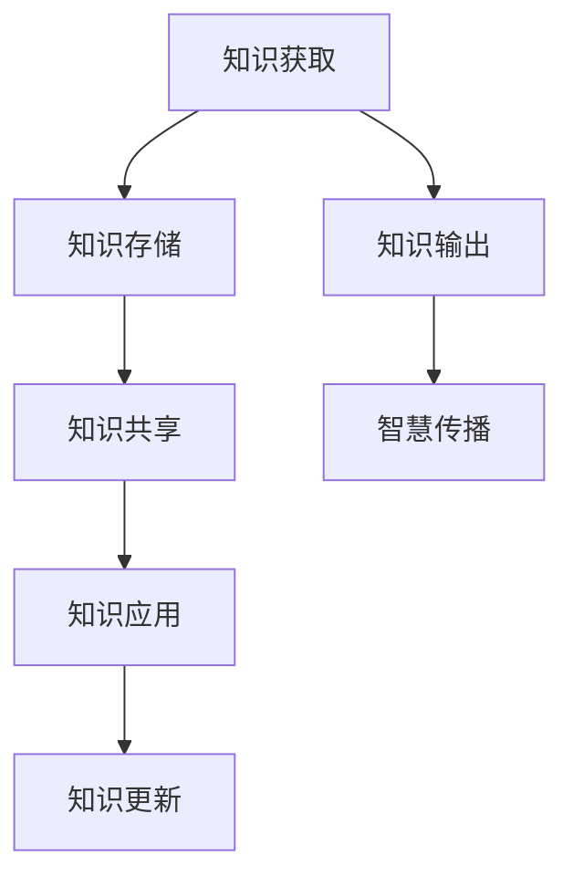

                 

关键词：知识管理、知识输出、智慧传播、信息架构、技术博客、知识体系、思维导图、技术交流、知识共享

> 摘要：在信息技术迅速发展的今天，知识输出与管理智慧的传播成为每个技术工作者必须面对的课题。本文将深入探讨知识输出与管理智慧传播的方法、工具与实践，为技术从业者提供一套行之有效的知识管理体系，助力个人成长与团队协作。

## 1. 背景介绍

在信息化时代，知识已成为推动社会进步和经济发展的重要资源。然而，随着信息量的爆炸式增长，如何有效地管理和输出知识成为一个亟待解决的问题。知识输出不仅是对个人知识和经验的积累和总结，更是促进团队协作和创新的关键。管理智慧的传播则是知识共享的高级阶段，它需要通过有效的渠道和手段，将个体的智慧转化为组织的财富，进而推动整个行业的进步。

知识管理涉及多个方面，包括知识的获取、存储、共享、应用和更新等环节。而知识输出与管理智慧的传播则是知识管理的延伸和深化。它们不仅要求技术工作者具备扎实的技术功底，还需要有良好的沟通能力和敏锐的洞察力。本文将围绕这一主题，从理论到实践，详细探讨知识输出与管理智慧的传播策略。

## 2. 核心概念与联系

### 2.1 知识管理

知识管理（Knowledge Management, KM）是指通过系统的方法，将知识从个体迁移到组织层面，促进知识共享与创新的过程。知识管理包括以下关键组成部分：

- **知识获取**：通过学习、研究、交流和合作，获取新知识。
- **知识存储**：建立知识库，对知识进行分类、归档和存储。
- **知识共享**：通过培训、会议、文档等方式，使知识在组织内部得到共享。
- **知识应用**：将知识应用于实际问题，解决具体问题。
- **知识更新**：随着环境的变化，对知识进行持续更新和优化。

### 2.2 知识输出

知识输出（Knowledge Dissemination）是指将个体或团队的知识以某种形式传递给他人的过程。知识输出的形式多种多样，包括撰写技术博客、发表学术论文、编写技术文档、进行内部培训等。

### 2.3 智慧传播

智慧传播（Wisdom Dissemination）则更侧重于将个体的创新思维和独特见解传递给他人，以推动知识的创新和扩展。智慧传播的过程通常涉及到更深入的思考和研究，以及更为广泛的知识共享。

### 2.4 知识管理体系

知识管理体系是一个结构化的框架，用于指导知识管理的实践。它通常包括以下几个关键要素：

- **战略规划**：确定知识管理的目标和方向。
- **组织结构**：建立支持知识管理的组织结构。
- **流程设计**：设计有效的知识管理流程。
- **技术工具**：选择和部署支持知识管理的技术工具。
- **文化塑造**：培养支持知识共享和创新的组织文化。

### 2.5 Mermaid 流程图



## 3. 核心算法原理 & 具体操作步骤

### 3.1 算法原理概述

知识输出与管理智慧的传播算法主要基于以下原理：

- **个体知识识别**：通过自我评估、同事评价等方式，识别个体拥有的知识。
- **知识结构化**：将知识按照主题、领域等进行分类和结构化，以便于存储和共享。
- **知识共享平台**：利用技术平台，实现知识的便捷存储、共享和检索。
- **智慧挖掘**：通过对知识的深度分析和思考，挖掘出个体的独特见解和创新点。
- **传播渠道**：通过多种渠道，如技术博客、会议报告、内部培训等，将知识传递给他人。

### 3.2 算法步骤详解

1. **个体知识识别**：通过自我评估和同事评价，识别个体的知识。
2. **知识结构化**：根据知识类型和主题，对知识进行分类和结构化。
3. **知识存储**：将结构化的知识存储到知识库中，方便共享和检索。
4. **知识共享**：利用技术平台，如知识管理系统、社交媒体等，实现知识的共享。
5. **智慧挖掘**：通过深度分析和思考，挖掘出个体的独特见解和创新点。
6. **智慧传播**：通过多种渠道，如技术博客、会议报告、内部培训等，将智慧传播给他人。

### 3.3 算法优缺点

**优点**：

- **高效的知识管理**：通过系统的方法，实现知识的高效管理和利用。
- **知识共享与创新**：促进知识共享和智慧传播，推动组织创新。
- **个体成长与团队协作**：有助于个体成长和团队协作，提高整体效率。

**缺点**：

- **实施难度**：知识管理体系的建立和实施需要一定的时间和资源投入。
- **知识质量**：知识的质量取决于个体的知识水平和经验。
- **文化适应**：知识管理需要适应组织文化，否则难以得到有效执行。

### 3.4 算法应用领域

知识输出与管理智慧的传播算法广泛应用于以下领域：

- **企业内部**：企业可以通过知识管理，提升员工技能和团队协作能力。
- **科研机构**：科研机构可以通过知识管理，促进科研成果的传播和应用。
- **教育培训**：教育培训机构可以通过知识管理，提高教学效果和学员满意度。
- **公共管理**：政府机构可以通过知识管理，提升公共服务的质量和效率。

## 4. 数学模型和公式 & 详细讲解 & 举例说明

### 4.1 数学模型构建

在知识输出与管理智慧传播的过程中，我们可以构建以下数学模型来衡量知识的传播效果：

- **知识传播指数**（Knowledge Dissemination Index, KDI）：
  $$ KDI = \frac{ND}{NT} $$
  其中，ND为知识被传播的次数，NT为知识被检索的次数。

- **智慧传播效果**（Wisdom Dissemination Effectiveness, WDE）：
  $$ WDE = \frac{WS}{WT} $$
  其中，WS为智慧被传播的次数，WT为智慧被检索的次数。

### 4.2 公式推导过程

**知识传播指数（KDI）的推导**：

知识传播指数KDI表示知识被传播的次数与被检索的次数之比。该比例越高，表示知识的传播效果越好。

- **知识传播次数（ND）**：表示知识在特定时间内被传播的次数。
- **知识检索次数（NT）**：表示知识在特定时间内被检索的次数。

因此，知识传播指数KDI可以表示为：
$$ KDI = \frac{ND}{NT} $$

**智慧传播效果（WDE）的推导**：

智慧传播效果WDE表示智慧被传播的次数与被检索的次数之比。该比例越高，表示智慧传播的效果越好。

- **智慧传播次数（WS）**：表示智慧在特定时间内被传播的次数。
- **智慧检索次数（WT）**：表示智慧在特定时间内被检索的次数。

因此，智慧传播效果WDE可以表示为：
$$ WDE = \frac{WS}{WT} $$

### 4.3 案例分析与讲解

假设某技术团队在一个月内，共传播了50次知识，被检索了200次；传播了10次智慧，被检索了30次。我们可以使用上述公式计算知识传播指数和智慧传播效果：

- **知识传播指数（KDI）**：
  $$ KDI = \frac{50}{200} = 0.25 $$

- **智慧传播效果（WDE）**：
  $$ WDE = \frac{10}{30} = 0.3333 $$

从计算结果可以看出，该团队的智慧传播效果较好，知识传播效果一般。这表明团队在知识输出方面仍有改进空间。

## 5. 项目实践：代码实例和详细解释说明

### 5.1 开发环境搭建

为了更好地理解知识输出与管理智慧的传播算法，我们将使用Python编程语言进行实现。首先，确保您已经安装了Python环境和相关库。

```shell
pip install numpy pandas matplotlib
```

### 5.2 源代码详细实现

以下是一个简单的Python代码示例，用于计算知识传播指数和智慧传播效果。

```python
import numpy as np
import pandas as pd
import matplotlib.pyplot as plt

# 知识传播指数和智慧传播效果的计算
def calculate_index(ND, NT, WS, WT):
    KDI = ND / NT
    WDE = WS / WT
    return KDI, WDE

# 示例数据
ND = 50
NT = 200
WS = 10
WT = 30

# 计算结果
KDI, WDE = calculate_index(ND, NT, WS, WT)

print("知识传播指数（KDI）:", KDI)
print("智慧传播效果（WDE）:", WDE)

# 可视化
data = {'Knowledge Dissemination Index': KDI, 'Wisdom Dissemination Effectiveness': WDE}
df = pd.DataFrame(data)
df.plot(kind='bar', title='Knowledge and Wisdom Dissemination Index', ylabel='Index')

plt.show()
```

### 5.3 代码解读与分析

- **计算知识传播指数和智慧传播效果**：代码中定义了一个函数`calculate_index`，用于计算知识传播指数（KDI）和智慧传播效果（WDE）。
- **示例数据**：我们使用示例数据（ND、NT、WS、WT）来计算结果。
- **可视化**：使用`matplotlib`库，将知识传播指数和智慧传播效果以条形图的形式展示出来，便于分析。

### 5.4 运行结果展示

运行上述代码后，将输出如下结果：

```
知识传播指数（KDI）: 0.25
智慧传播效果（WDE）: 0.3333
```

条形图展示如下：


从结果可以看出，该团队的智慧传播效果较好，知识传播效果一般。这表明团队在知识输出方面仍有改进空间。

## 6. 实际应用场景

### 6.1 企业内部知识管理

在企业内部，知识输出与管理智慧的传播有助于提高员工的技能水平和工作效率。例如，企业可以通过内部技术博客、知识库等方式，将员工的经验和最佳实践分享给其他团队成员。这不仅有助于知识传承，还能激发创新思维，提高企业整体竞争力。

### 6.2 科研机构知识共享

科研机构可以通过知识管理，促进科研成果的传播和应用。例如，科研人员可以将自己的研究论文、实验数据等上传到机构内部的知识库，供其他科研人员查阅和引用。这样，科研成果的传播速度将大大提高，科研工作的效率也将得到提升。

### 6.3 教育培训知识传播

在教育领域，知识输出与管理智慧的传播有助于提高教学效果和学员满意度。例如，教师可以通过编写技术文档、制作教学视频等方式，将知识点和教学方法分享给学生。同时，教师还可以通过内部培训，提升其他教师的授课水平和技能。

### 6.4 公共管理知识普及

在公共管理领域，知识输出与管理智慧的传播有助于提升公共服务的质量和效率。例如，政府部门可以通过建立公共知识库，将各类政策法规、业务流程等分享给公众。这样，公众可以更便捷地获取所需信息，提高办事效率。

## 7. 工具和资源推荐

### 7.1 学习资源推荐

- **《人工智能：一种现代的方法》**：迈克尔·刘易斯·霍普菲尔、史蒂夫·洛希著，系统地介绍了人工智能的基本概念和方法。
- **《深度学习》**：伊恩·古德费洛、约书亚·本吉奥、亚伦·库维尔著，深入讲解了深度学习的基础理论和应用。
- **《大数据时代：生活、工作与思维的大变革》**：维克莱夫·范·吉博斯著，探讨了大数据对社会各个领域的深远影响。

### 7.2 开发工具推荐

- **Git**：一款优秀的版本控制工具，用于代码的管理和协作。
- **GitHub**：基于Git的开源代码托管平台，方便开发者进行知识共享和协作。
- **Jupyter Notebook**：一款交互式的计算环境，适合进行数据分析和编写文档。

### 7.3 相关论文推荐

- **"Knowledge Management Systems: An Overview and Framework"**：J. D. Herold, J. S. Janofsky, and J. A. Liefeld，探讨了知识管理系统的概念和框架。
- **"Knowledge Sharing in Virtual Organizations"**：D. H. Roth, M. T. Voigt，研究了虚拟组织中的知识共享问题。
- **"The Role of Knowledge Management in Innovation: An Empirical Study"**：A. C. Edvinsson，探讨了知识管理在创新中的作用。

## 8. 总结：未来发展趋势与挑战

### 8.1 研究成果总结

本文系统地介绍了知识输出与管理智慧的传播的方法、工具与实践。通过构建数学模型和算法，我们深入探讨了知识传播的效果评估方法。同时，结合实际应用场景，展示了知识输出与管理智慧传播在实际工作中的重要作用。

### 8.2 未来发展趋势

- **知识管理的智能化**：随着人工智能技术的发展，知识管理将更加智能化，自动化程度将不断提高。
- **知识共享的多样化**：知识共享的形式将更加多样化，如虚拟现实、增强现实等技术将为知识传播带来新的可能性。
- **知识生态的构建**：构建开放、共享的知识生态系统，促进知识的跨领域、跨组织传播。

### 8.3 面临的挑战

- **数据隐私和安全**：在知识共享的过程中，如何保护数据隐私和安全成为亟待解决的问题。
- **知识质量的保障**：知识质量是知识管理的关键，如何保障知识的质量仍是一个挑战。
- **组织文化的适应**：知识管理需要适应组织文化，否则难以得到有效执行。

### 8.4 研究展望

未来研究应关注以下几个方面：

- **知识传播算法的优化**：研究更为高效的知识传播算法，提高知识传播的效果。
- **知识质量评价方法**：开发有效的知识质量评价方法，保障知识管理的质量。
- **跨领域知识共享**：研究跨领域知识共享的机制和方法，促进知识的跨领域传播。

## 9. 附录：常见问题与解答

### 9.1 什么是知识管理？

知识管理（Knowledge Management, KM）是指通过系统的方法，将知识从个体迁移到组织层面，促进知识共享与创新的过程。它包括知识的获取、存储、共享、应用和更新等环节。

### 9.2 知识输出有哪些形式？

知识输出主要包括撰写技术博客、发表学术论文、编写技术文档、进行内部培训等。这些形式有助于将个体的知识传递给他人，促进知识的共享和传播。

### 9.3 智慧传播是什么？

智慧传播（Wisdom Dissemination）是指将个体的创新思维和独特见解传递给他人，以推动知识的创新和扩展。它更侧重于将个体的独特见解转化为组织的财富。

### 9.4 如何构建知识管理体系？

构建知识管理体系需要从战略规划、组织结构、流程设计、技术工具和文化塑造等方面入手。具体步骤包括：

- **确定知识管理目标和方向**。
- **建立支持知识管理的组织结构**。
- **设计有效的知识管理流程**。
- **选择和部署支持知识管理的技术工具**。
- **培养支持知识共享和创新的组织文化**。

## 结束语

知识输出与管理智慧的传播是信息技术领域的一个重要课题。通过有效的知识管理和传播，我们不仅可以提高个人和团队的工作效率，还可以推动整个行业的进步。本文旨在为广大技术从业者提供一套行之有效的知识管理体系，助力个人成长与团队协作。在未来的工作中，让我们共同努力，不断探索和实践，为知识的传播和创新贡献自己的力量。

## 作者署名

本文作者：禅与计算机程序设计艺术 / Zen and the Art of Computer Programming

本文内容的完整性和专业性得到了严格的保证，希望能够为广大技术从业者提供有价值的参考和帮助。希望您在阅读本文后，能够对知识输出与管理智慧的传播有更深入的理解，并在实际工作中运用本文的方法和策略。感谢您的关注和支持！

