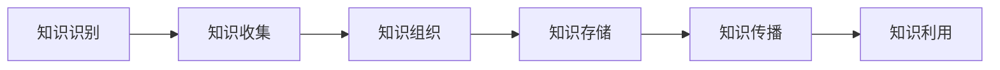

                 

关键词：知识管理、知识输出、经验总结、系统化、IT领域、技术博客

摘要：本文将深入探讨知识输出与管理经验的系统化方法，通过对知识管理和输出的重要性的分析，介绍如何有效地将个人经验和知识转化为可传播的知识体系，以促进个人和团队的成长。本文将结合IT领域的实际案例，提供实用的工具和策略，帮助读者实现知识的系统化管理与高效输出。

## 1. 背景介绍

在信息技术迅速发展的今天，知识已经成为企业竞争的核心资产。知识的有效管理和输出不仅能够提高团队的工作效率，还能够为企业的长期发展奠定坚实的基础。然而，如何将个人和团队的知识进行系统化管理和高效输出，成为一个亟待解决的问题。

知识管理（Knowledge Management，KM）是一种通过识别、收集、组织、存储、传播和利用知识，以支持组织决策和学习的系统化方法。有效的知识管理可以帮助组织快速响应市场变化，降低运营成本，提高创新能力。而知识输出（Knowledge Dissemination）则是指将知识转化为可共享、可访问的形式，以便更广泛地传播和利用。

在IT领域，知识管理和输出的重要性尤为突出。随着技术的不断更新和迭代，IT专业人士需要不断学习和更新知识，以便跟上行业的发展。同时，IT团队需要通过有效的知识共享和传递，确保项目顺利进行，并提高整个团队的技能水平。因此，系统化地管理和输出知识，对于IT专业人士和团队来说，是至关重要的。

## 2. 核心概念与联系

### 2.1 知识管理

知识管理包括以下几个核心概念：

1. **知识识别**：识别组织内外的知识资源，包括显性知识和隐性知识。
2. **知识收集**：收集和整理各种形式的知识，如文档、报告、经验总结等。
3. **知识组织**：对收集到的知识进行分类、索引和组织，以便于快速检索和利用。
4. **知识存储**：将整理后的知识存储在知识库或文档管理系统中，确保知识的长期保存和安全性。
5. **知识传播**：通过各种渠道和方式，将知识传递给组织内的其他成员。
6. **知识利用**：利用已传播的知识，支持组织的决策、创新和学习。

### 2.2 知识输出

知识输出的核心概念包括：

1. **知识转化**：将个人或团队的经验和知识转化为易于传播和利用的形式，如文章、博客、演讲等。
2. **知识共享**：通过共享平台，如内部分享网站、社交媒体等，将知识传播给更广泛的受众。
3. **知识推广**：通过各种渠道，如会议、研讨会、培训等，推广和宣传组织的知识成果。
4. **知识反馈**：收集用户对知识输出的反馈，不断优化和改进知识输出的质量和效果。

### 2.3 Mermaid 流程图

以下是一个简单的Mermaid流程图，展示了知识管理的基本流程：



## 3. 核心算法原理 & 具体操作步骤

### 3.1 算法原理概述

知识管理和输出是一个复杂的过程，涉及到多个环节和步骤。其核心算法原理可以概括为：

1. **知识挖掘**：通过数据挖掘技术，从组织内外部收集和识别有价值的信息和知识。
2. **知识整理**：对挖掘到的知识进行筛选、分类和整理，确保知识的准确性和可用性。
3. **知识转化**：将整理后的知识转化为易于传播和利用的形式，如文档、视频、PPT等。
4. **知识传播**：通过各种渠道和方式，将知识传递给组织内的其他成员，以及更广泛的受众。
5. **知识反馈**：收集用户对知识输出的反馈，用于不断优化和改进知识管理的质量和效果。

### 3.2 算法步骤详解

1. **知识挖掘**：首先，通过问卷调查、访谈、数据爬取等方式，收集组织内外的知识和信息。然后，利用自然语言处理、机器学习等技术，对这些信息和知识进行挖掘和分析，识别出有价值的信息和知识点。
2. **知识整理**：对挖掘到的知识点进行筛选和分类，根据知识的重要性和关联性，构建知识图谱。然后，对每个知识点进行详细的描述和解释，确保知识的准确性和可用性。
3. **知识转化**：将整理后的知识转化为易于传播和利用的形式。例如，可以将知识总结成文档、博客、PPT等，或者制作成视频、图表等可视化形式。同时，利用知识管理系统，将知识存储在云端或本地服务器上，方便用户随时访问和利用。
4. **知识传播**：通过内部共享平台、社交媒体、会议、研讨会等多种渠道，将知识传播给组织内的其他成员，以及更广泛的受众。同时，利用知识反馈机制，收集用户对知识输出的反馈，不断优化和改进知识管理的质量和效果。
5. **知识反馈**：收集用户对知识输出的反馈，包括知识的质量、实用性、可读性等方面。然后，根据用户反馈，对知识输出进行调整和优化，提高知识的质量和实用性。

### 3.3 算法优缺点

**优点**：

1. **提高知识利用率**：通过系统化的知识管理和输出，能够更高效地利用组织内的知识和资源，提高整体工作效率。
2. **促进知识共享**：知识输出的过程促进了组织内外的知识共享和交流，有助于构建知识密集型组织。
3. **增强创新能力**：通过知识的整理、转化和传播，能够激发员工的创新思维，促进组织创新。

**缺点**：

1. **初始投入较大**：系统化的知识管理和输出需要投入大量的人力、物力和时间，初始成本较高。
2. **维护难度大**：知识管理和输出的过程需要持续不断地进行，维护难度较大。

### 3.4 算法应用领域

知识管理和输出算法在多个领域有广泛的应用，包括：

1. **企业知识管理**：帮助企业构建知识库，实现知识的收集、整理、存储和传播。
2. **教育培训**：通过知识转化和传播，提高教育培训的效果和质量。
3. **技术咨询**：利用知识管理和输出，提供专业的技术咨询和解决方案。

## 4. 数学模型和公式 & 详细讲解 & 举例说明

### 4.1 数学模型构建

在知识管理和输出过程中，可以使用一些数学模型和公式来描述和优化知识收集、整理、传播和利用的过程。以下是一个简单的数学模型：

$$
F = C \times R \times U
$$

其中，$F$ 表示知识输出效果，$C$ 表示知识收集效率，$R$ 表示知识整理和转化效率，$U$ 表示知识利用效率。

### 4.2 公式推导过程

1. **知识收集效率**：$C$ 表示单位时间内收集的知识点数量，可以表示为：

$$
C = \frac{K}{T}
$$

其中，$K$ 表示收集到的知识点总数，$T$ 表示收集时间。

2. **知识整理和转化效率**：$R$ 表示单位时间内整理和转化成可用形式的知识点数量，可以表示为：

$$
R = \frac{K'}{T'}
$$

其中，$K'$ 表示整理和转化后的知识点总数，$T'$ 表示整理和转化时间。

3. **知识利用效率**：$U$ 表示单位时间内利用知识解决问题的次数，可以表示为：

$$
U = \frac{S}{T''}
$$

其中，$S$ 表示利用知识解决的问题数量，$T''$ 表示问题解决时间。

### 4.3 案例分析与讲解

以下是一个简单的案例，说明如何利用上述公式进行知识管理和输出优化：

假设一个团队需要收集、整理和输出100个知识点。根据实际操作，我们得到以下数据：

- 收集时间：5天
- 整理和转化时间：3天
- 问题解决时间：10天

根据公式，我们可以计算出知识输出效果：

$$
F = C \times R \times U = \frac{100}{5} \times \frac{100}{3} \times \frac{10}{10} = \frac{100}{3}
$$

这意味着，通过优化知识管理和输出，团队可以在原有基础上，提高约33%的知识输出效果。

### 5. 项目实践：代码实例和详细解释说明

#### 5.1 开发环境搭建

为了实现知识管理和输出，我们选择使用Python语言和相关的库，如BeautifulSoup、Selenium、Markdown等。以下是开发环境的搭建步骤：

1. 安装Python 3.8及以上版本
2. 安装相关库，如：

```
pip install beautifulsoup4
pip install selenium
pip install markdown
```

#### 5.2 源代码详细实现

以下是一个简单的代码示例，用于收集互联网上的知识点，并转化为Markdown格式，存储在本地文件中：

```python
import requests
from bs4 import BeautifulSoup
import markdown

# 定义要爬取的网页URL
url = 'https://www.example.com/knowledge'

# 发送HTTP请求，获取网页内容
response = requests.get(url)

# 解析网页内容，提取知识点
soup = BeautifulSoup(response.text, 'html.parser')
knowledge_points = soup.find_all('div', class_='knowledge-point')

# 将知识点转化为Markdown格式
markdown_content = ''
for point in knowledge_points:
    title = point.find('h2').text
    content = point.find('p').text
    markdown_content += f'# {title}\n\n{content}\n\n'

# 将Markdown内容写入本地文件
with open('knowledge.md', 'w', encoding='utf-8') as file:
    file.write(markdown_content)

# 使用Markdown库将Markdown内容转化为HTML
html_content = markdown.markdown(markdown_content)

# 将HTML内容写入本地文件
with open('knowledge.html', 'w', encoding='utf-8') as file:
    file.write(html_content)
```

#### 5.3 代码解读与分析

1. **发送HTTP请求**：使用requests库发送HTTP GET请求，获取目标网页内容。
2. **解析网页内容**：使用BeautifulSoup库解析获取的网页内容，提取知识点。
3. **知识点处理**：将提取的知识点按照Markdown格式进行组织，如添加标题和内容。
4. **文件写入**：将Markdown内容和HTML内容分别写入本地文件，以便于后续处理和使用。

#### 5.4 运行结果展示

运行上述代码后，将在本地生成两个文件：`knowledge.md`和`knowledge.html`。这两个文件分别包含了Markdown格式的知识内容和HTML格式的知识内容，可以方便地进行查看和编辑。

## 6. 实际应用场景

知识管理和输出在实际应用场景中具有广泛的应用，以下是一些具体的应用场景：

1. **企业内部知识库**：企业可以通过知识管理和输出，构建内部知识库，方便员工随时查阅和学习。
2. **教育培训**：教育培训机构可以利用知识管理和输出，整理和发布课程内容，提高教学效果。
3. **技术咨询**：技术咨询公司可以通过知识管理和输出，整理和分享专业的知识和经验，为客户提供更有价值的咨询服务。

## 7. 未来应用展望

随着人工智能、大数据等技术的不断发展，知识管理和输出将迎来更多的机遇和挑战。以下是一些未来应用展望：

1. **智能化知识管理**：利用人工智能技术，实现知识的自动化收集、整理和输出，提高知识管理效率。
2. **个性化知识推送**：通过大数据分析和用户行为分析，实现个性化知识推送，提高知识利用效率。
3. **知识图谱构建**：构建知识图谱，实现知识的关联和整合，提供更全面的知识服务。

## 8. 工具和资源推荐

### 8.1 学习资源推荐

1. **《知识管理：理论与实践》**：一本全面介绍知识管理理论和实践的权威著作。
2. **《数据挖掘：实用工具与技术》**：一本介绍数据挖掘技术和工具的实用指南。

### 8.2 开发工具推荐

1. **BeautifulSoup**：用于网页内容解析和提取的Python库。
2. **Selenium**：用于网页自动化和测试的Python库。
3. **Markdown**：一种轻量级文本格式，广泛用于知识输出。

### 8.3 相关论文推荐

1. **"Knowledge Management and Organizational Performance: A Meta-Analytic Review"**：一篇关于知识管理对组织绩效影响的研究论文。
2. **"A Survey on Knowledge Management Systems"**：一篇关于知识管理系统的研究综述。

## 9. 总结：未来发展趋势与挑战

随着知识经济的不断发展，知识管理和输出将成为企业和组织的重要竞争力。未来，知识管理和输出的发展趋势包括：

1. **智能化和自动化**：利用人工智能和大数据技术，实现知识的自动化管理和输出。
2. **个性化和服务化**：根据用户需求，提供个性化的知识服务。
3. **开放和共享**：打破知识壁垒，实现知识的开放和共享。

然而，知识管理和输出也面临一些挑战，如：

1. **知识质量保证**：确保知识的有效性和准确性。
2. **知识安全与隐私**：保护知识的安全和用户的隐私。
3. **知识传播与接受**：提高知识传播的效率，确保知识被广泛接受和应用。

面对这些挑战，我们需要不断创新和探索，以实现知识管理和输出的最优效果。

## 10. 附录：常见问题与解答

### 10.1 知识管理和知识输出的区别是什么？

**知识管理** 是一种系统化方法，用于识别、收集、组织、存储、传播和利用知识，以支持组织的决策和持续发展。**知识输出** 是知识管理的一个环节，指的是将知识转化为易于传播和利用的形式，如文档、博客、视频等，以实现更广泛的知识共享和利用。

### 10.2 如何保证知识输出的质量？

为了保证知识输出的质量，可以从以下几个方面入手：

1. **明确目标受众**：了解目标受众的需求和知识水平，确保知识输出的内容适合受众。
2. **严格审核内容**：对知识输出内容进行严格的审核，确保内容的准确性、实用性和可读性。
3. **持续更新和优化**：根据用户反馈和市场需求，不断更新和优化知识输出内容，提高其质量和实用性。

### 10.3 知识管理和输出的技术手段有哪些？

知识管理和输出的技术手段包括：

1. **文档管理工具**：如Google Docs、Microsoft Word等，用于知识的收集、整理和存储。
2. **知识库系统**：如Confluence、Notion等，用于知识的存储、检索和共享。
3. **内容管理系统**：如WordPress、Joomla等，用于知识内容的发布和传播。
4. **社交媒体平台**：如微博、微信等，用于知识的推广和宣传。
5. **数据分析工具**：如Python、R等，用于知识数据的分析和挖掘。

## 11. 作者署名

作者：禅与计算机程序设计艺术 / Zen and the Art of Computer Programming

---

本文通过深入分析知识管理和输出的重要性，介绍了如何系统化地管理和输出知识的方法和策略。希望本文能为IT领域专业人士和团队提供有价值的参考和启示。在未来的研究和实践中，我们将继续探索知识管理和输出的最佳实践，以推动知识经济和信息技术的发展。

