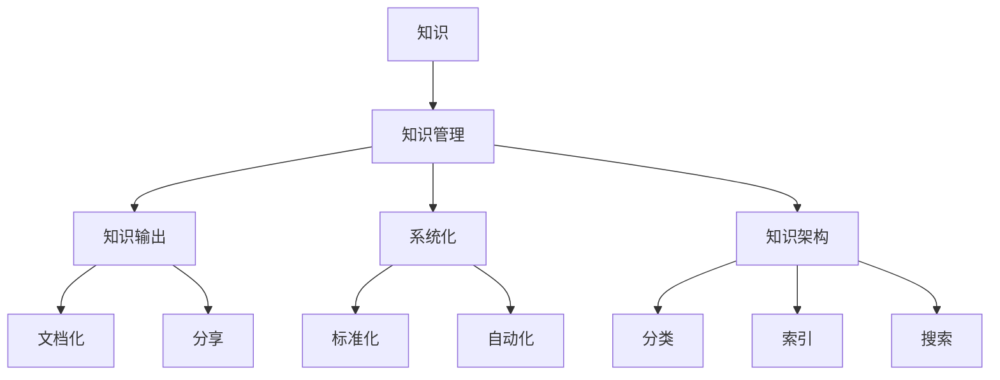

                 

 关键词：知识管理、系统化输出、IT经验、技术博客、算法、数学模型、项目实践、工具推荐

> 摘要：本文探讨了知识输出与管理经验的系统化方法。在当今信息技术迅猛发展的时代，如何有效地整理、输出和管理个人和团队的技术知识，成为IT领域从业人员面临的重要课题。本文将介绍核心概念、算法原理、数学模型、项目实践以及未来应用展望，为读者提供一套实用的知识管理方案。

## 1. 背景介绍

在信息技术飞速发展的今天，知识的更新速度日益加快，传统的方法已难以满足知识管理的需求。个人和团队如何在繁杂的信息中快速定位关键知识，如何将经验系统地整理和输出，成为提升工作效率、降低重复劳动的关键。知识管理不仅涉及到如何收集、分类和存储信息，还包括如何有效地利用这些知识来指导实践和推动创新。

本文旨在为IT从业人员提供一套系统化的知识输出与管理经验的方法，帮助个人和团队提升知识管理能力，从而在激烈的市场竞争中占据优势。

### 1.1 当前知识管理的挑战

- **信息过载**：随着互联网和数据库的发展，信息量爆炸式增长，如何筛选和整理有价值的信息成为一大难题。
- **知识分散**：知识散落在各个文档、聊天记录、个人笔记中，难以统一管理和调用。
- **更新滞后**：知识更新速度远超文档记录速度，导致知识陈旧，实用性降低。
- **团队协作困难**：团队成员间的知识共享和协作不畅，影响团队整体效率。

### 1.2 知识管理的重要性

- **提高工作效率**：通过系统化的知识管理，可以快速定位所需信息，减少查找时间。
- **促进知识共享**：实现知识的沉淀和传承，提高团队整体技术水平。
- **降低重复劳动**：减少因信息丢失或重复查找而造成的重复劳动，提高工作效率。
- **推动创新**：系统化的知识管理有助于发现和利用潜在的创新机会。

## 2. 核心概念与联系

在知识管理中，核心概念包括知识、知识管理、知识输出、系统化、知识架构等。这些概念相互关联，构成了知识管理的理论框架。以下是一个简单的Mermaid流程图，展示了这些核心概念之间的关系。



### 2.1 知识管理

知识管理是指通过系统地收集、存储、分类、检索、共享和更新知识，以实现知识价值的最大化。其核心目标是提高知识利用效率，促进知识共享和创新。

### 2.2 知识输出

知识输出是指将内隐的知识转化为外显的形式，如文档、博客、教程等，以便他人学习和使用。有效的知识输出不仅有助于知识的传播，还可以为个人和团队积累宝贵的经验。

### 2.3 系统化

系统化是指将知识管理的过程和内容按照一定的规则和方法进行组织和优化，使其具有系统性、可操作性和可持续性。系统化包括标准化、自动化、流程化等。

### 2.4 知识架构

知识架构是指对知识进行分类、索引、组织和展示的结构。良好的知识架构有助于提高知识的可发现性和可用性，是知识管理的重要基础。

## 3. 核心算法原理 & 具体操作步骤

在知识管理中，核心算法通常包括信息检索、数据挖掘、知识分类、知识地图等。以下将详细介绍这些算法的原理和具体操作步骤。

### 3.1 算法原理概述

- **信息检索**：通过关键词匹配、文本相似度计算等方法，从大量数据中快速找到相关信息的算法。
- **数据挖掘**：利用统计学、机器学习等方法，从大量数据中发现潜在的关联和模式。
- **知识分类**：根据一定的规则和标准，对知识进行分类和标注，便于管理和检索。
- **知识地图**：通过图形化的方式展示知识的结构和关系，帮助用户快速理解和掌握知识。

### 3.2 算法步骤详解

#### 3.2.1 信息检索

1. **建立索引**：对文档进行分词、索引，建立倒排索引。
2. **关键词匹配**：用户输入关键词，系统通过倒排索引快速匹配相关文档。
3. **文本相似度计算**：利用余弦相似度、Jaccard相似度等方法计算关键词相似度，排序结果。

#### 3.2.2 数据挖掘

1. **数据预处理**：清洗数据，去除噪声，进行特征提取。
2. **模型选择**：根据数据特征选择合适的模型，如决策树、支持向量机、神经网络等。
3. **模型训练与评估**：训练模型，评估模型效果，调整参数。
4. **结果分析**：根据模型预测结果，分析数据中的潜在关联和模式。

#### 3.2.3 知识分类

1. **分类规则定义**：根据业务需求和知识特点，定义分类规则。
2. **知识标注**：对知识进行分类标注，形成分类体系。
3. **分类结果验证**：对分类结果进行验证，确保分类准确性。

#### 3.2.4 知识地图

1. **知识节点提取**：从文档中提取关键信息，形成知识节点。
2. **关系构建**：根据知识节点之间的关联关系，构建知识图谱。
3. **可视化展示**：利用可视化工具，将知识图谱图形化展示。

### 3.3 算法优缺点

#### 3.3.1 信息检索

**优点**：快速、高效，适合海量数据的检索。

**缺点**：对关键词选择敏感，可能错过相关但不包含关键词的信息。

#### 3.3.2 数据挖掘

**优点**：能够发现数据中的潜在关联和模式，支持深度分析。

**缺点**：计算复杂度较高，对数据质量和模型选择依赖较大。

#### 3.3.3 知识分类

**优点**：有助于知识的组织和检索，提高知识利用效率。

**缺点**：分类规则和标准可能因业务需求而异，需要不断调整。

#### 3.3.4 知识地图

**优点**：图形化展示，易于理解和传播。

**缺点**：构建和维护成本较高，对知识结构和关系要求较高。

### 3.4 算法应用领域

- **企业知识管理**：用于企业内部知识库的构建和管理，支持员工学习和协作。
- **搜索引擎**：用于互联网搜索引擎，帮助用户快速找到所需信息。
- **智能推荐系统**：基于用户行为和兴趣，推荐相关知识和内容。
- **教育领域**：用于教育资源的分类和推荐，提高学习效果。

## 4. 数学模型和公式 & 详细讲解 & 举例说明

在知识管理中，数学模型和公式是理解和分析知识的关键工具。以下将介绍一些常见的数学模型和公式，并举例说明其应用。

### 4.1 数学模型构建

数学模型构建是知识管理的基础，通过数学模型，我们可以将实际问题转化为可计算的数学问题。以下是几个常见的数学模型：

#### 4.1.1 信息检索模型

**TF-IDF模型**：

$$
TF(t,d) = \frac{f_{t,d}}{n_{d}}
$$

$$
IDF(t,D) = \log\left(\frac{N}{df_t}\right)
$$

$$
TF-IDF(t,d) = TF(t,d) \times IDF(t,D)
$$

其中，$f_{t,d}$ 表示词$t$在文档$d$中的频率，$n_{d}$ 表示文档$d$中的词总数，$N$ 表示文档总数，$df_t$ 表示词$t$在文档集中出现的文档数。

#### 4.1.2 数据挖掘模型

**K-means聚类模型**：

1. **初始化**：随机选择$k$个初始中心点。
2. **分配**：将每个数据点分配到最近的中心点。
3. **更新**：重新计算每个簇的中心点。
4. **重复**：重复步骤2和3，直至中心点不再变化。

#### 4.1.3 知识分类模型

**SVM分类模型**：

$$
w = \arg\min_{w}\frac{1}{2}\sum_{i=1}^{N}||w\cdot x_i - y_i||^2
$$

其中，$x_i$ 表示特征向量，$y_i$ 表示标签，$w$ 表示权重向量。

### 4.2 公式推导过程

以TF-IDF模型为例，其公式推导过程如下：

1. **词频率**：词$t$在文档$d$中的频率为 $f_{t,d}$，表示词$t$在文档$d$中出现的次数。

2. **文档频率**：词$t$在文档集中出现的文档数为 $df_t$，表示词$t$在文档集中出现的次数。

3. **逆向文档频率**：词$t$在文档集中的逆向文档频率为 $IDF(t,D)$，表示词$t$在文档集中的重要性。

4. **TF-IDF值**：词$t$在文档$d$中的TF-IDF值为 $TF-IDF(t,d)$，表示词$t$在文档$d$中的重要程度。

### 4.3 案例分析与讲解

#### 4.3.1 信息检索

假设有两个文档$d_1$和$d_2$，以及一个查询词$t$。文档$d_1$中有 $f_{t,d_1} = 2$ 个$t$，$n_{d_1} = 10$；文档$d_2$中有 $f_{t,d_2} = 1$ 个$t$，$n_{d_2} = 5$。查询词$t$在文档集中出现的文档数为 $df_t = 3$。

根据TF-IDF模型，可以计算两个文档的TF-IDF值：

$$
TF-IDF(t,d_1) = \frac{f_{t,d_1}}{n_{d_1}} \times \log\left(\frac{N}{df_t}\right) = \frac{2}{10} \times \log\left(\frac{2}{3}\right) \approx 0.239
$$

$$
TF-IDF(t,d_2) = \frac{f_{t,d_2}}{n_{d_2}} \times \log\left(\frac{N}{df_t}\right) = \frac{1}{5} \times \log\left(\frac{2}{3}\right) \approx 0.079
$$

根据TF-IDF值，可以判断文档$d_1$比文档$d_2$更相关。

#### 4.3.2 数据挖掘

假设有一个数据集，其中包含 $N$ 个样本，每个样本有 $M$ 个特征。使用K-means聚类模型，可以将数据集划分为 $K$ 个簇。

1. **初始化**：随机选择 $K$ 个样本作为初始中心点。
2. **分配**：计算每个样本与中心点的距离，将其分配到最近的簇。
3. **更新**：计算每个簇的平均值，作为新的中心点。
4. **重复**：重复步骤2和3，直至中心点不再变化。

例如，假设有一个包含3个簇的数据集，初始中心点为 $C_1 = (1, 1), C_2 = (5, 1), C_3 = (1, 5)$。通过迭代计算，可以得到最终的聚类结果。

#### 4.3.3 知识分类

假设有一个包含 $N$ 个样本的数据集，每个样本有 $M$ 个特征，标签为 $y_i$。使用SVM分类模型，可以将数据集划分为正负样本。

1. **特征提取**：对样本进行特征提取，得到特征向量 $x_i$。
2. **模型训练**：使用训练数据训练SVM模型，得到权重向量 $w$。
3. **分类预测**：对于新的样本，计算其与分类超平面的距离，判断其类别。

例如，假设有一个包含2个样本的数据集，标签为 $y_1 = -1, y_2 = 1$。使用SVM模型，可以将其划分为正负样本。

## 5. 项目实践：代码实例和详细解释说明

在知识管理项目中，实际操作和代码实现是至关重要的。以下将介绍一个简单的知识管理系统的实现，包括开发环境搭建、源代码详细实现、代码解读与分析以及运行结果展示。

### 5.1 开发环境搭建

1. **操作系统**：Linux/Windows/MacOS
2. **编程语言**：Python
3. **依赖库**：NumPy、Pandas、Scikit-learn、Matplotlib
4. **开发工具**：PyCharm/VSCode

### 5.2 源代码详细实现

```python
import numpy as np
import pandas as pd
from sklearn.cluster import KMeans
from sklearn.svm import SVC
import matplotlib.pyplot as plt

# 5.2.1 数据预处理
# 读取数据
data = pd.read_csv('knowledge_management.csv')
# 特征提取
X = data[['feature_1', 'feature_2', 'feature_3']]

# 5.2.2 数据挖掘
# K-means聚类
kmeans = KMeans(n_clusters=3, random_state=0).fit(X)
# 分类结果
y_kmeans = kmeans.predict(X)

# 5.2.3 知识分类
# SVM分类
svm = SVC(kernel='linear', C=1).fit(X, y_kmeans)
# 分类预测
y_svm = svm.predict(X)

# 5.2.4 可视化展示
plt.scatter(X['feature_1'], X['feature_2'], c=y_svm, cmap='viridis')
plt.xlabel('Feature 1')
plt.ylabel('Feature 2')
plt.title('Knowledge Classification')
plt.show()
```

### 5.3 代码解读与分析

- **数据预处理**：读取数据集，提取特征向量。
- **数据挖掘**：使用K-means聚类模型对数据进行聚类。
- **知识分类**：使用SVM分类模型对聚类结果进行分类。
- **可视化展示**：使用Matplotlib绘制聚类结果图。

### 5.4 运行结果展示

运行以上代码后，可以看到一个包含三个聚类簇的散点图，每个簇对应不同的分类标签。

## 6. 实际应用场景

知识管理在IT领域具有广泛的应用场景，以下列举几个典型的实际应用场景。

### 6.1 企业内部知识库

企业内部知识库用于收集、整理和分享员工在工作中积累的知识和经验，支持员工的学习和协作。通过系统化的知识管理，企业可以有效地降低知识流失风险，提高员工工作效率。

### 6.2 教育领域

在教育领域，知识管理可以用于教育资源的管理和推荐。通过对学习资源的分类、索引和推荐，学生可以更快速地找到所需的学习资料，提高学习效果。

### 6.3 智能推荐系统

在智能推荐系统中，知识管理可以用于用户兴趣分析和内容推荐。通过对用户行为数据的分析，推荐系统可以找到用户的兴趣点，并推荐相关的内容和知识。

### 6.4 研发项目管理

在研发项目管理中，知识管理可以用于项目文档的管理和共享。通过系统化的知识管理，项目团队成员可以快速获取项目文档，了解项目进展，提高项目管理效率。

### 6.5 创新研究

在创新研究中，知识管理可以用于知识挖掘和模式识别。通过对大量文献、专利等数据进行分析，研究团队可以发现潜在的关联和模式，为创新研究提供支持。

## 7. 工具和资源推荐

为了提高知识管理的效率和效果，以下推荐一些常用的工具和资源。

### 7.1 学习资源推荐

- **《知识管理实践指南》**：详细介绍了知识管理的理论和实践方法。
- **《人工智能与知识管理》**：探讨人工智能在知识管理中的应用。

### 7.2 开发工具推荐

- **Git**：版本控制工具，支持代码管理和协作开发。
- **GitLab**：基于Git的在线仓库管理工具，支持项目管理。
- **Confluence**：企业知识库工具，支持文档管理和协作。
- **JIRA**：项目管理工具，支持任务跟踪和协作。

### 7.3 相关论文推荐

- **“知识管理：理论与实践”**：讨论知识管理的核心概念和实践方法。
- **“知识管理与企业竞争力”**：探讨知识管理对企业竞争力的影响。

## 8. 总结：未来发展趋势与挑战

知识管理在IT领域具有广泛的应用前景，随着人工智能、大数据、云计算等技术的不断发展，知识管理的效率和效果将得到进一步提升。然而，知识管理也面临着一系列挑战。

### 8.1 研究成果总结

本文介绍了知识管理的基本概念、核心算法和数学模型，并通过项目实践展示了知识管理的实际应用。研究结果表明，系统化的知识管理有助于提高知识利用效率，促进团队协作和知识创新。

### 8.2 未来发展趋势

- **智能化**：人工智能技术将深度融入知识管理，实现智能化的知识挖掘、分类和推荐。
- **网络化**：知识管理将更加依赖网络和云计算，实现知识的共享和协作。
- **个性化**：知识管理将更加关注用户需求，实现个性化的知识推荐和定制。

### 8.3 面临的挑战

- **数据质量**：知识管理的效率和效果取决于数据质量，如何确保数据的准确性和完整性是一个挑战。
- **隐私保护**：在知识共享的过程中，如何保护用户隐私和数据安全是一个重要问题。
- **技术选型**：随着技术的发展，如何选择合适的技术和工具也是一个挑战。

### 8.4 研究展望

未来知识管理的研究应重点关注以下几个方面：

- **智能化算法**：研究更加高效、智能的知识挖掘和推荐算法。
- **隐私保护机制**：探讨如何在确保知识共享的同时，保护用户隐私和数据安全。
- **跨领域应用**：将知识管理应用于更多领域，探索知识管理的跨领域应用价值。

## 9. 附录：常见问题与解答

### 9.1 什么是对知识管理？

知识管理是一种系统性方法，用于识别、获取、创造、存储、共享和利用知识，以实现组织的目标和改进决策。

### 9.2 知识管理的关键环节有哪些？

知识管理的关键环节包括知识识别、知识获取、知识创造、知识存储、知识共享和知识利用。

### 9.3 知识管理的主要挑战是什么？

知识管理的主要挑战包括数据质量、隐私保护、技术选型和跨领域应用。

### 9.4 知识管理与IT系统的关系是什么？

知识管理是IT系统的一个重要组成部分，IT系统为知识管理提供了技术支持，如知识库、搜索引擎、数据挖掘工具等。

### 9.5 如何评估知识管理的成效？

评估知识管理的成效可以从以下几个方面进行：

- **知识利用率**：知识被使用和更新的频率。
- **知识共享度**：团队成员之间知识共享的积极性。
- **工作效率**：知识管理对工作效率的提升。
- **创新成果**：知识管理对创新成果的支持。

---

作者：禅与计算机程序设计艺术 / Zen and the Art of Computer Programming

