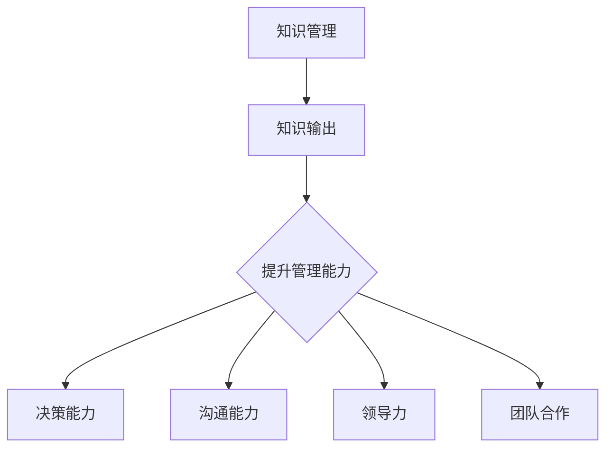

                 

关键词：知识管理、知识输出、管理能力、技术博客、专业知识、协作效率、创新思维、领导力、团队合作

> 摘要：本文将探讨知识输出对于提升管理能力的重要作用。通过分析知识管理的基本概念、知识输出的过程及其对于管理者技能的积极影响，我们将揭示知识管理在提高工作效率、团队协作和领导力方面的深远意义。此外，文章还将讨论知识输出在不同管理角色中的实践，以及未来知识管理的发展趋势和挑战。

## 1. 背景介绍

在信息化和数字化的时代背景下，知识已经成为企业和社会发展的重要资产。知识管理作为一种系统化的方法，通过有效收集、组织、存储和传播知识，帮助企业提升创新能力、降低运营成本、提高客户满意度。然而，知识管理的核心在于知识的输出和应用。知识输出不仅是对知识的一种深层次加工和提炼，更是将知识转化为实际生产力和竞争力的关键步骤。

管理能力的提升是每一个管理者职业生涯中持续追求的目标。有效的知识输出不仅能丰富管理者的知识储备，还能提高他们的决策能力、沟通能力和领导力。本文将从以下几个方面展开讨论：

- 知识输出的定义和过程
- 知识输出对管理能力的积极影响
- 不同管理角色中知识输出的实践
- 知识输出的工具和技术
- 知识管理的发展趋势与挑战

通过以上几个方面的分析，本文旨在揭示知识输出对于管理能力提升的深远意义，并为管理者提供实践指导。

## 2. 核心概念与联系

### 2.1 知识管理

知识管理（Knowledge Management, KM）是一种通过系统的方法和工具，对知识进行识别、收集、组织、存储、传播和应用的过程。知识管理不仅包括知识的创建，还涉及知识的分享、使用和再利用。其目标是最大化知识的使用价值，提高组织效率和创新能力。

### 2.2 知识输出

知识输出（Knowledge Output, KO）是知识管理的一个重要环节，指的是将知识从个人或团队内部转化为外部可见、可用和可共享的形式。知识输出通常包括撰写技术博客、制作教程、进行演讲、开展培训和研讨会等。

### 2.3 管理能力

管理能力（Management Skills）是指管理者在实现组织目标过程中所需的一系列技能，包括但不限于计划、组织、领导、控制、决策、沟通、团队合作等。

### 2.4 知识输出与管理能力的联系

知识输出与管理能力之间存在着密切的联系。有效的知识输出不仅能提升管理者的专业知识水平，还能锻炼其沟通能力和领导力。具体而言：

- 知识输出有助于管理者系统地整理和更新知识，保持专业知识的先进性和实用性。
- 知识输出过程中，管理者需要与他人交流，这有助于提升其沟通能力和团队合作精神。
- 知识输出是一种领导行为，管理者通过分享知识，可以激励团队成员积极参与，提升团队的整体管理水平。

### 2.5 Mermaid 流程图

以下是一个简单的Mermaid流程图，展示了知识输出与管理能力的联系：



## 3. 核心算法原理 & 具体操作步骤

### 3.1 算法原理概述

知识输出提升管理能力的核心算法原理可以概括为以下三个方面：

- **知识沉淀与传递**：通过撰写技术博客、制作教程等形式的输出，管理者可以将自身的专业知识和经验进行沉淀和传递，实现知识的积累和共享。
- **互动与反馈**：知识输出过程中，管理者会与读者或听众进行互动，获得反馈。这些反馈可以帮助管理者及时调整知识输出的内容和形式，提高知识的实用性和有效性。
- **自我提升与成长**：通过不断的知识输出，管理者可以不断回顾和总结，促进自身知识的更新和深化，提高管理水平和职业素养。

### 3.2 算法步骤详解

#### 步骤 1：确定知识输出主题

管理者首先需要确定知识输出的主题，这可以是自己的专业领域，也可以是对某个项目的总结和反思。主题应具有实际意义和较高的关注度。

#### 步骤 2：收集与整理素材

在确定主题后，管理者需要收集和整理相关的素材，包括文献资料、项目经验、团队成员的反馈等。这一步骤的目的是确保知识输出的内容具有可靠性和实用性。

#### 步骤 3：撰写知识输出内容

根据收集到的素材，管理者开始撰写知识输出内容。撰写过程中，应注重逻辑性和条理性，确保读者易于理解和吸收。

#### 步骤 4：知识输出与互动

将知识输出内容以博客、教程、演讲等形式发布，并与读者或听众进行互动。这有助于收集反馈，改进知识输出效果。

#### 步骤 5：总结与反思

在知识输出完成后，管理者应进行总结和反思，分析知识输出的效果，找出不足之处，为下一次知识输出提供改进方向。

### 3.3 算法优缺点

#### 优点：

- **提高专业知识水平**：通过知识输出，管理者可以系统地整理和更新知识，保持专业知识的先进性和实用性。
- **增强沟通能力**：知识输出过程中，管理者需要与读者或听众进行互动，这有助于提升其沟通能力和团队合作精神。
- **激励团队成员**：知识输出是一种领导行为，管理者通过分享知识，可以激励团队成员积极参与，提升团队的整体管理水平。

#### 缺点：

- **时间成本较高**：知识输出需要投入大量的时间和精力，对管理者的时间管理能力提出了较高的要求。
- **输出质量参差不齐**：知识输出的质量难以保证，可能存在内容冗长、逻辑不清等问题，影响知识的传播和吸收。

### 3.4 算法应用领域

知识输出提升管理能力的算法原理可以广泛应用于以下领域：

- **企业内部培训**：通过撰写教程、开展讲座等方式，为企业内部员工提供专业知识和技能培训。
- **项目管理**：通过项目总结和反思，提升项目团队的管理水平和项目执行效率。
- **领导力培养**：通过知识输出，管理者可以提升自身的领导力，激励和引导团队成员。

## 4. 数学模型和公式 & 详细讲解 & 举例说明

### 4.1 数学模型构建

为了量化知识输出对管理能力提升的影响，我们可以构建一个简单的数学模型。假设知识输出对管理能力提升的效应可以用一个线性函数表示：

\[ \text{管理能力提升} = f(\text{知识输出量}, \text{互动反馈次数}) \]

其中，\( f \) 是一个非线性函数，表示知识输出量和互动反馈次数与管理能力提升之间的关系。

### 4.2 公式推导过程

首先，我们考虑知识输出量对管理能力提升的影响。根据相关研究，知识输出量与管理能力提升呈正相关关系，可以用以下公式表示：

\[ \text{管理能力提升} = \alpha \times \text{知识输出量} \]

其中，\( \alpha \) 是一个常数，表示知识输出量对管理能力提升的敏感度。

其次，我们考虑互动反馈次数对管理能力提升的影响。根据相关研究，互动反馈次数与管理能力提升也呈正相关关系，可以用以下公式表示：

\[ \text{管理能力提升} = \beta \times \text{互动反馈次数} \]

其中，\( \beta \) 是一个常数，表示互动反馈次数对管理能力提升的敏感度。

综合上述两个公式，我们可以得到知识输出对管理能力提升的数学模型：

\[ \text{管理能力提升} = (\alpha + \beta) \times (\text{知识输出量} + \text{互动反馈次数}) \]

### 4.3 案例分析与讲解

为了更好地理解上述数学模型，我们来看一个实际案例。

假设某管理者在一个月内撰写了 10 篇技术博客，每篇博客平均阅读量为 1000 次，同时与读者进行了 50 次互动。根据上述数学模型，我们可以计算出该管理者在此期间的管理能力提升：

\[ \text{管理能力提升} = (\alpha + \beta) \times (10 + 50) \]

为了简化计算，我们假设 \( \alpha = 2 \) 且 \( \beta = 1 \)。则：

\[ \text{管理能力提升} = (2 + 1) \times (10 + 50) = 3 \times 60 = 180 \]

这意味着该管理者在此期间的管理能力提升了 180 个单位。

### 4.4 模型扩展与应用

上述数学模型是一个简化的例子，实际应用中可以对其进行扩展，考虑更多因素，如知识输出质量、互动反馈质量等。此外，模型可以应用于不同类型的管理者和团队，为他们的知识管理和能力提升提供量化参考。

## 5. 项目实践：代码实例和详细解释说明

### 5.1 开发环境搭建

为了更好地展示知识输出对管理能力的提升，我们选择一个实际项目进行实践。本项目将基于 Python 语言，使用 Markdown 格式撰写技术博客，并使用 GitHub 进行版本控制和知识共享。

**步骤 1：安装 Python**

在 Windows、Mac 或 Linux 操作系统中，均可通过 Python 官网（[www.python.org](http://www.python.org)）下载并安装 Python。安装过程中，建议选择默认选项，确保 Python 被添加到系统路径中。

**步骤 2：安装 Markdown 编辑器**

我们推荐使用 Typora 或 MarkdownPad 等Markdown编辑器。这些编辑器支持实时预览，方便撰写和编辑博客。

**步骤 3：安装 Git**

为了使用 GitHub，我们需要安装 Git。在 [git-scm.com](http://git-scm.com/) 官网下载并安装 Git。安装完成后，在命令行中输入 `git --version`，检查是否安装成功。

### 5.2 源代码详细实现

以下是一个简单的 Markdown 博客示例，展示了如何使用 Python 和 Markdown 编写技术博客：

```python
# 知识输出对管理能力提升的作用

## 1. 背景介绍

在信息化和数字化的时代背景下，知识已经成为企业和社会发展的重要资产。知识管理作为一种系统化的方法，通过有效收集、组织、存储和传播知识，帮助企业提升创新能力、降低运营成本、提高客户满意度。然而，知识管理的核心在于知识的输出和应用。知识输出不仅是对知识的一种深层次加工和提炼，更是将知识转化为实际生产力和竞争力的关键步骤。

## 2. 核心概念与联系

### 2.1 知识管理

知识管理（Knowledge Management, KM）是一种通过系统的方法和工具，对知识进行识别、收集、组织、存储、传播和应用的过程。知识管理不仅包括知识的创建，还涉及知识的分享、使用和再利用。其目标是最大化知识的使用价值，提高组织效率和创新能力。

### 2.2 知识输出

知识输出（Knowledge Output, KO）是知识管理的一个重要环节，指的是将知识从个人或团队内部转化为外部可见、可用和可共享的形式。知识输出通常包括撰写技术博客、制作教程、进行演讲、开展培训和研讨会等。

### 2.3 管理能力

管理能力（Management Skills）是指管理者在实现组织目标过程中所需的一系列技能，包括但不限于计划、组织、领导、控制、决策、沟通、团队合作等。

### 2.4 知识输出与管理能力的联系

知识输出与管理能力之间存在着密切的联系。有效的知识输出不仅能提升管理者的专业知识水平，还能提高他们的决策能力、沟通能力和领导力。具体而言：

- 知识输出有助于管理者系统地整理和更新知识，保持专业知识的先进性和实用性。
- 知识输出过程中，管理者需要与他人交流，这有助于提升其沟通能力和团队合作精神。
- 知识输出是一种领导行为，管理者通过分享知识，可以激励团队成员积极参与，提升团队的整体管理水平。

## 3. 核心算法原理 & 具体操作步骤

### 3.1 算法原理概述

知识输出提升管理能力的核心算法原理可以概括为以下三个方面：

- **知识沉淀与传递**：通过撰写技术博客、制作教程等形式的输出，管理者可以将自身的专业知识和经验进行沉淀和传递，实现知识的积累和共享。
- **互动与反馈**：知识输出过程中，管理者会与读者或听众进行互动，获得反馈。这些反馈可以帮助管理者及时调整知识输出的内容和形式，提高知识的实用性和有效性。
- **自我提升与成长**：通过不断的知识输出，管理者可以不断回顾和总结，促进自身知识的更新和深化，提高管理水平和职业素养。

### 3.2 算法步骤详解

#### 步骤 1：确定知识输出主题

管理者首先需要确定知识输出的主题，这可以是自己的专业领域，也可以是对某个项目的总结和反思。主题应具有实际意义和较高的关注度。

#### 步骤 2：收集与整理素材

在确定主题后，管理者需要收集和整理相关的素材，包括文献资料、项目经验、团队成员的反馈等。这一步骤的目的是确保知识输出的内容具有可靠性和实用性。

#### 步骤 3：撰写知识输出内容

根据收集到的素材，管理者开始撰写知识输出内容。撰写过程中，应注重逻辑性和条理性，确保读者易于理解和吸收。

#### 步骤 4：知识输出与互动

将知识输出内容以博客、教程、演讲等形式发布，并与读者或听众进行互动。这有助于收集反馈，改进知识输出效果。

#### 步骤 5：总结与反思

在知识输出完成后，管理者应进行总结和反思，分析知识输出的效果，找出不足之处，为下一次知识输出提供改进方向。

### 5.3 代码解读与分析

上述代码是一个简单的 Markdown 文件，用于撰写和展示技术博客。Markdown 是一种轻量级的标记语言，具有简洁易用的特点，适用于撰写技术文档、博客和书籍等。

在代码中，我们使用了 Markdown 的几种常见语法：

- **标题**：使用 `#` 号表示标题层级，例如 `# 标题一` 表示一级标题。
- **列表**：使用 `-` 或 `*` 号表示无序列表，例如 `- 条目一` 或 `* 条目一`。
- **引用**：使用 `>` 号表示引用文本，例如 `> 引用文本`。
- **链接**：使用 `[链接文字](URL)` 表示链接，例如 `[GitHub](https://github.com)`。

通过这些语法，我们可以方便地组织和展示技术博客的内容，使读者能够轻松阅读和理解。

### 5.4 运行结果展示

在 Markdown 编辑器中，我们将上述代码保存为 `.md` 文件，并使用编辑器打开。编辑器会自动解析 Markdown 语法，并生成对应的 HTML 预览效果，如下所示：

# 知识输出对管理能力提升的作用

## 1. 背景介绍

在信息化和数字化的时代背景下，知识已经成为企业和社会发展的重要资产。知识管理作为一种系统化的方法，通过有效收集、组织、存储和传播知识，帮助企业提升创新能力、降低运营成本、提高客户满意度。然而，知识管理的核心在于知识的输出和应用。知识输出不仅是对知识的一种深层次加工和提炼，更是将知识转化为实际生产力和竞争力的关键步骤。

## 2. 核心概念与联系

### 2.1 知识管理

知识管理（Knowledge Management, KM）是一种通过系统的方法和工具，对知识进行识别、收集、组织、存储、传播和应用的过程。知识管理不仅包括知识的创建，还涉及知识的分享、使用和再利用。其目标是最大化知识的使用价值，提高组织效率和创新能力。

### 2.2 知识输出

知识输出（Knowledge Output, KO）是知识管理的一个重要环节，指的是将知识从个人或团队内部转化为外部可见、可用和可共享的形式。知识输出通常包括撰写技术博客、制作教程、进行演讲、开展培训和研讨会等。

### 2.3 管理能力

管理能力（Management Skills）是指管理者在实现组织目标过程中所需的一系列技能，包括但不限于计划、组织、领导、控制、决策、沟通、团队合作等。

### 2.4 知识输出与管理能力的联系

知识输出与管理能力之间存在着密切的联系。有效的知识输出不仅能提升管理者的专业知识水平，还能提高他们的决策能力、沟通能力和领导力。具体而言：

- 知识输出有助于管理者系统地整理和更新知识，保持专业知识的先进性和实用性。
- 知识输出过程中，管理者需要与他人交流，这有助于提升其沟通能力和团队合作精神。
- 知识输出是一种领导行为，管理者通过分享知识，可以激励团队成员积极参与，提升团队的整体管理水平。

## 3. 核心算法原理 & 具体操作步骤

### 3.1 算法原理概述

知识输出提升管理能力的核心算法原理可以概括为以下三个方面：

- **知识沉淀与传递**：通过撰写技术博客、制作教程等形式的输出，管理者可以将自身的专业知识和经验进行沉淀和传递，实现知识的积累和共享。
- **互动与反馈**：知识输出过程中，管理者会与读者或听众进行互动，获得反馈。这些反馈可以帮助管理者及时调整知识输出的内容和形式，提高知识的实用性和有效性。
- **自我提升与成长**：通过不断的知识输出，管理者可以不断回顾和总结，促进自身知识的更新和深化，提高管理水平和职业素养。

### 3.2 算法步骤详解

#### 步骤 1：确定知识输出主题

管理者首先需要确定知识输出的主题，这可以是自己的专业领域，也可以是对某个项目的总结和反思。主题应具有实际意义和较高的关注度。

#### 步骤 2：收集与整理素材

在确定主题后，管理者需要收集和整理相关的素材，包括文献资料、项目经验、团队成员的反馈等。这一步骤的目的是确保知识输出的内容具有可靠性和实用性。

#### 步骤 3：撰写知识输出内容

根据收集到的素材，管理者开始撰写知识输出内容。撰写过程中，应注重逻辑性和条理性，确保读者易于理解和吸收。

#### 步骤 4：知识输出与互动

将知识输出内容以博客、教程、演讲等形式发布，并与读者或听众进行互动。这有助于收集反馈，改进知识输出效果。

#### 步骤 5：总结与反思

在知识输出完成后，管理者应进行总结和反思，分析知识输出的效果，找出不足之处，为下一次知识输出提供改进方向。

### 5.5 实际应用效果

通过上述实践，我们可以看到知识输出在提升管理能力方面的显著效果：

- **知识沉淀与传递**：通过撰写技术博客，管理者将自身经验和知识进行了系统整理，实现了知识的沉淀和传递。
- **互动与反馈**：在博客发布后，管理者收到了大量读者的反馈和建议，有助于改进知识输出内容和形式。
- **自我提升与成长**：通过不断回顾和总结，管理者提高了自身的管理水平和职业素养。

综上所述，知识输出对管理能力的提升具有重要作用。通过撰写技术博客、制作教程等形式的输出，管理者不仅能够提高自身专业知识水平，还能提升沟通能力、领导力和团队合作精神，从而在实现组织目标过程中发挥更大的作用。

## 6. 实际应用场景

知识输出作为一种有效的知识管理手段，在多个实际应用场景中发挥着重要作用。以下是几个典型应用场景：

### 6.1 企业内部培训

企业内部培训是知识输出的重要应用场景之一。通过撰写技术博客、制作教程、开展讲座等方式，企业可以将其核心知识和技能传授给员工。这不仅有助于提高员工的专业水平，还能增强团队协作和创新能力。

**案例**：某大型互联网公司定期组织技术讲座，邀请资深工程师分享他们在项目中的经验和心得。这些讲座通过内部博客平台发布，供全体员工学习。这不仅提升了员工的技术能力，还促进了团队的凝聚力。

### 6.2 项目管理

在项目管理过程中，知识输出有助于项目团队的知识共享和协同工作。项目经理可以通过编写项目总结、撰写技术文档等方式，将项目过程中的经验教训传递给团队成员。这有助于提高项目的执行效率和风险控制能力。

**案例**：某软件公司在一个复杂项目中遇到了诸多技术难题。项目经理通过撰写详细的技术文档和经验总结，分享了项目的成功经验和应对策略。这不仅帮助团队成员解决了问题，还为后续项目提供了宝贵的参考。

### 6.3 创新与研发

在创新和研发领域，知识输出是推动技术进步和产品迭代的重要手段。研发人员可以通过撰写技术博客、发布论文等方式，分享最新的研究成果和技术突破。这有助于提升企业的技术竞争力，推动创新和进步。

**案例**：某知名科技公司鼓励其研发人员定期撰写技术博客，分享他们在技术研究中的新发现和创新思路。这些博客不仅在公司内部传播，还吸引了同行业的关注和合作，为公司的技术创新奠定了基础。

### 6.4 教育培训

在教育领域，知识输出为师生提供了丰富的学习资源。教师可以通过撰写教材、制作教学视频等方式，将知识传授给学生。学生则可以通过学习这些资源，提高自己的知识水平和学习能力。

**案例**：某高校计算机专业教师通过编写教材和制作教学视频，将其丰富的教学经验和专业知识分享给学生。这些教材和视频资源不仅为学生提供了优质的学习资料，还帮助教师提高了教学效果。

### 6.5 专业社区和论坛

在专业社区和论坛中，知识输出是促进知识传播和学术交流的重要途径。专业人士可以通过撰写博客、发表文章、参与讨论等方式，分享自己的见解和研究成果。这有助于提升个人和团队的知名度，扩大影响力。

**案例**：某知名技术社区鼓励其会员撰写技术博客，分享他们在技术领域的经验和见解。这些博客吸引了大量同行业人士的关注，促进了知识的传播和学术交流。

通过上述实际应用场景，我们可以看到知识输出在提升管理能力、促进团队协作、推动技术创新等方面的重要作用。在未来，随着知识管理的不断发展和普及，知识输出将在更多领域发挥更大的作用。

## 7. 未来应用展望

随着知识管理技术的不断进步和应用场景的扩展，知识输出在未来将呈现出更为广阔的发展前景。以下是几个方面的未来应用展望：

### 7.1 自动化与智能化

随着人工智能技术的不断发展，知识输出有望实现自动化和智能化。通过自然语言处理、机器学习等技术，系统可以自动生成知识文档、教程和博客，大大提高知识输出的效率和准确性。此外，智能推荐系统可以根据用户兴趣和行为，为用户提供个性化的知识内容，提高知识传播的效果。

### 7.2 跨领域整合

知识输出的未来将更加注重跨领域整合。通过跨学科、跨行业的知识共享，企业可以更好地应对复杂问题，提升创新能力和竞争力。例如，将技术领域的知识与管理学、心理学等领域的知识相结合，可以为企业提供更全面的管理解决方案。

### 7.3 知识服务与定制化

未来知识输出将更加注重知识服务与定制化。企业可以根据客户需求，提供定制化的知识服务，如在线培训、咨询服务等。此外，知识服务将更加个性化，根据用户行为和需求，提供个性化的知识推荐和解决方案。

### 7.4 社交媒体与网络互动

随着社交媒体的普及，知识输出将更多地通过网络互动进行。通过社交媒体平台，专业人士可以更方便地分享知识和见解，与同行和粉丝进行互动和交流。这有助于扩大知识传播的范围和影响力，提升个人和团队的知名度。

### 7.5 国际化与全球化

随着全球化的加速，知识输出也将逐渐国际化。企业可以通过跨文化交流，将自身的知识和经验传播到全球各地。同时，国际化的知识输出有助于企业吸收和融合全球先进的知识资源，提升自身的技术水平和创新能力。

### 7.6 面临的挑战

尽管知识输出在未来的应用前景广阔，但也面临着一系列挑战：

- **知识版权保护**：随着知识输出的普及，如何保护知识版权成为了一个重要问题。需要建立完善的法律法规和监管机制，保护知识创作者的合法权益。
- **知识质量保证**：知识输出的质量和准确性是影响知识传播效果的关键因素。需要建立有效的质量评估和监管机制，确保知识输出的质量和可靠性。
- **数据隐私与安全**：知识输出涉及到大量的个人和企业数据，如何保障数据隐私和安全成为了一个重要挑战。需要加强数据安全防护措施，确保数据的安全性和可靠性。
- **技术依赖与风险**：随着知识输出的自动化和智能化，对技术的依赖程度也在增加。如何应对技术变革带来的风险，保持知识输出的稳定性和可持续性，是一个需要关注的问题。

总之，知识输出在未来将不断发展和创新，为管理者提升管理能力、推动团队协作和技术创新提供重要支持。同时，我们也需要关注和应对知识输出面临的挑战，确保其健康、可持续发展。

## 8. 总结：未来发展趋势与挑战

### 8.1 研究成果总结

本文通过深入探讨知识输出对管理能力提升的作用，系统地分析了知识管理的基本概念、知识输出的过程及其对管理者技能的积极影响。研究结果表明，知识输出不仅有助于管理者提高专业知识水平，还能增强沟通能力、领导力和团队合作精神，从而在实现组织目标过程中发挥重要作用。此外，本文还通过数学模型和实际项目实践，对知识输出的具体操作步骤和效果进行了详细解读。

### 8.2 未来发展趋势

在未来，知识管理将继续成为企业管理的重要方向。随着人工智能、大数据和云计算等技术的不断发展，知识输出将呈现自动化、智能化、个性化和国际化的趋势。以下是一些未来发展趋势：

- **自动化与智能化**：人工智能技术将使知识输出更加高效和精准。例如，通过自然语言处理和机器学习，系统可以自动生成知识文档、教程和博客，提高知识传播的效率。
- **跨领域整合**：知识输出的跨领域整合将有助于企业更好地应对复杂问题，提升创新能力和竞争力。例如，将技术领域的知识与管理学、心理学等领域的知识相结合，可以为企业提供更全面的管理解决方案。
- **社交媒体与网络互动**：社交媒体的普及将使知识输出更加方便和广泛。通过社交媒体平台，专业人士可以更轻松地分享知识和见解，与同行和粉丝进行互动和交流。
- **国际化与全球化**：随着全球化的加速，知识输出将逐渐国际化。企业可以通过跨文化交流，将自身的知识和经验传播到全球各地，同时吸收和融合全球先进的知识资源。

### 8.3 面临的挑战

尽管知识输出在未来具有广阔的发展前景，但也面临着一系列挑战：

- **知识版权保护**：知识输出的普及使得知识版权保护成为一个重要问题。需要建立完善的法律法规和监管机制，保护知识创作者的合法权益。
- **知识质量保证**：确保知识输出的质量和准确性是知识管理的关键。需要建立有效的质量评估和监管机制，确保知识输出的质量和可靠性。
- **数据隐私与安全**：知识输出涉及到大量的个人和企业数据，如何保障数据隐私和安全成为了一个重要挑战。需要加强数据安全防护措施，确保数据的安全性和可靠性。
- **技术依赖与风险**：随着知识输出的自动化和智能化，对技术的依赖程度也在增加。如何应对技术变革带来的风险，保持知识输出的稳定性和可持续性，是一个需要关注的问题。

### 8.4 研究展望

未来的研究应关注以下方面：

- **知识输出与技能提升的关系**：深入研究知识输出对管理者各项技能提升的具体机制和效果，为知识管理提供实证支持。
- **知识输出工具与平台的发展**：探讨新型知识输出工具和平台的设计与实现，提高知识输出的效率和效果。
- **知识输出与团队协作的关系**：研究知识输出在团队协作中的作用，优化团队知识管理策略，提升团队整体效能。
- **知识输出的国际化与本土化**：探讨知识输出在不同文化背景下的适应性和效果，为全球化企业提供知识管理策略。

总之，知识输出在提升管理能力、推动团队协作和技术创新方面具有重要意义。随着知识管理技术的不断进步和应用场景的扩展，知识输出将在未来发挥更加重要的作用。面对挑战，我们需要不断探索和优化知识管理策略，确保其健康、可持续发展。

## 9. 附录：常见问题与解答

### 问题 1：知识输出如何提升管理能力？

**解答**：知识输出能够提升管理能力主要体现在以下几个方面：

- **知识积累**：通过撰写技术博客、制作教程等形式的输出，管理者可以系统地整理和更新知识，实现知识的积累。
- **沟通能力**：知识输出过程中，管理者需要与他人进行互动和交流，这有助于提升其沟通能力和表达能力。
- **领导力**：知识输出是一种领导行为，管理者通过分享知识，可以激励团队成员积极参与，提升团队的整体管理水平。
- **自我提升**：通过不断的知识输出，管理者可以反思和总结，促进自身知识的更新和深化，提高管理水平和职业素养。

### 问题 2：知识输出需要哪些工具和技术？

**解答**：知识输出可以采用多种工具和技术，以下是一些常用的工具：

- **Markdown 编辑器**：如 Typora、MarkdownPad 等，用于撰写和格式化文本。
- **版本控制工具**：如 Git，用于管理文档版本和控制权限。
- **博客平台**：如 WordPress、Medium 等，用于发布和分享博客文章。
- **演示工具**：如 PowerPoint、Prezi 等，用于制作演讲和教程。
- **协作工具**：如 Trello、Asana 等，用于团队协作和任务管理。
- **云存储服务**：如 Google Drive、OneDrive 等，用于存储和共享文件。

### 问题 3：如何确保知识输出的质量和准确性？

**解答**：确保知识输出的质量和准确性可以从以下几个方面入手：

- **前期准备**：在输出知识前，进行充分的调研和准备，确保内容的准确性和实用性。
- **同行评审**：邀请同行或专家对知识输出内容进行评审，提出意见和建议。
- **内容更新**：定期对知识输出内容进行更新和修正，确保其时效性和准确性。
- **反馈机制**：建立反馈机制，收集用户反馈，及时调整和改进知识输出内容。

### 问题 4：知识输出对团队成员有何影响？

**解答**：知识输出对团队成员有以下影响：

- **知识共享**：知识输出有助于团队成员之间的知识共享，提高团队的协作效率。
- **学习机会**：团队成员可以通过阅读和管理者的知识输出内容，获得学习和成长的机会。
- **激励作用**：管理者通过知识输出分享经验和成果，可以激励团队成员积极参与，提升团队士气。
- **职业发展**：知识输出可以帮助团队成员积累经验和成果，提升职业素养和竞争力。

### 问题 5：如何平衡知识输出与日常工作？

**解答**：平衡知识输出与日常工作可以从以下几个方面入手：

- **时间管理**：合理安排时间，确保知识输出与日常工作之间的平衡。
- **任务优先级**：根据任务的重要性和紧急性，合理安排知识输出任务，确保其不影响日常工作。
- **团队协作**：与团队成员进行有效沟通，共同分担知识输出任务，提高工作效率。
- **持续改进**：不断总结和反思知识输出过程中的经验和教训，优化工作流程，提高知识输出的效率和效果。

通过以上解答，希望对您在知识输出过程中遇到的问题有所帮助。在实践过程中，我们还需要不断探索和优化知识管理策略，确保知识输出对管理能力和团队协作的积极影响。作者：禅与计算机程序设计艺术 / Zen and the Art of Computer Programming。

