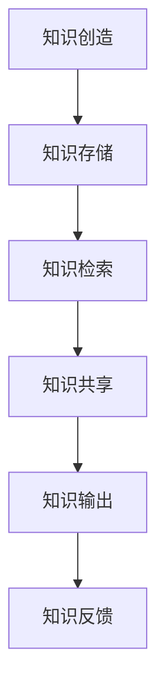

                 

 **关键词**：知识输出、信息传播、学习效率、教育技术、认知心理学、算法、项目实践、未来展望

**摘要**：本文探讨了知识输出的多种方式及其对学习效率、认知发展和信息传播的影响。从理论分析到实际操作，我们深入解析了核心算法原理、数学模型、项目实践，并展望了未来的发展趋势与挑战。通过本文，读者将了解如何有效地进行知识输出，从而提升个人的认知水平和职业发展。

## 1. 背景介绍

在当今的信息时代，知识输出已经成为个人和团队发展的关键要素。知识的有效传播不仅能够提高个人的学习效率，还能促进团队协作和知识共享。然而，知识输出的方式多种多样，每种方式都有其独特的优势和局限性。本文旨在探讨这些不同的知识输出方式，并分析其效果，以便为读者提供实际操作指导。

### 1.1 知识输出的重要性

知识输出是知识管理的重要组成部分，它涉及知识的创造、存储、共享和传播。有效的知识输出不仅有助于个人专业技能的提升，还能推动整个团队的进步。以下是知识输出的一些关键作用：

- **提高学习效率**：通过输出知识，个体能够加深对知识的理解和记忆。
- **促进知识共享**：知识输出有助于团队成员之间的知识交流，从而提高团队的整体效率。
- **推动创新**：知识输出可以激发新的想法和创意，促进创新和进步。
- **增强个人品牌**：有效的知识输出能够提升个人的专业形象和影响力。

### 1.2 知识输出的挑战

尽管知识输出具有重要意义，但实际操作中仍面临诸多挑战：

- **信息过载**：在大量信息面前，如何筛选和输出有价值的知识成为一个难题。
- **传播效率**：如何确保知识输出能够高效地传播到目标受众，是另一个关键问题。
- **知识质量**：确保输出的知识准确、清晰和有价值，是知识输出的基本要求。
- **受众接受度**：如何根据不同受众的特点和需求进行知识输出，以提高其接受度和效果。

## 2. 核心概念与联系

为了深入探讨知识输出的多种方式，我们首先需要明确几个核心概念，并了解它们之间的联系。

### 2.1 知识输出的定义

知识输出是指个体或团队将所掌握的知识和经验通过某种形式传递给他人或团队的过程。这个过程可以是书面形式、口头讲解、演示等多种方式。

### 2.2 知识传播模型

知识传播模型描述了知识从源头到接受者的传递过程。这个过程包括知识创建、存储、检索、共享和输出等多个环节。常见的知识传播模型有：瀑布模型、链式模型、网络模型等。

### 2.3 知识管理框架

知识管理框架是指导知识输出的方法和策略。常见的知识管理框架包括：戴明循环（PDCA）、SECI模型（社会化、外部化、组合化、内在化）、六西格玛等。

### 2.4 Mermaid 流程图

以下是一个简化的知识输出流程图的 Mermaid 表示：



## 3. 核心算法原理 & 具体操作步骤

### 3.1 算法原理概述

知识输出的核心算法涉及信息编码、信息传播和受众反馈三个主要步骤。具体来说，算法原理包括以下几个方面：

- **信息编码**：将知识以易于理解和记忆的形式进行编码，如使用图表、示例、故事等。
- **信息传播**：选择适当的传播渠道，如社交媒体、会议、博客、视频等，确保知识能够有效传递到目标受众。
- **受众反馈**：收集并分析受众的反馈，以不断优化知识输出效果。

### 3.2 算法步骤详解

#### 3.2.1 信息编码

信息编码是知识输出的第一步，其目的是将知识转化为易于理解和记忆的形式。以下是一些常用的信息编码方法：

- **图表**：通过图表展示复杂的概念和关系，如流程图、思维导图等。
- **示例**：通过具体的案例和示例来解释抽象的概念。
- **故事**：将知识融入有趣的故事中，以提高记忆效果。
- **多媒体**：结合文字、图片、音频、视频等多种媒体形式进行编码。

#### 3.2.2 信息传播

信息传播是知识输出的关键环节，选择合适的传播渠道对于知识的有效传递至关重要。以下是一些常见的信息传播渠道：

- **社交媒体**：如微博、微信、Twitter 等，适用于快速传播和互动。
- **会议**：如技术研讨会、行业峰会等，适用于深度交流和面对面交流。
- **博客**：适用于详细的知识分享和长期传播。
- **视频**：如教学视频、纪录片等，适用于视觉化和互动性较强的知识传递。

#### 3.2.3 受众反馈

受众反馈是知识输出的重要环节，通过收集和分析受众的反馈，可以不断优化知识输出的效果。以下是一些收集反馈的方法：

- **问卷调查**：通过设计问卷收集受众对知识输出的评价和建议。
- **用户反馈**：直接与受众交流，了解他们对知识输出的意见和建议。
- **数据分析**：通过数据分析工具对知识输出的效果进行量化评估。

### 3.3 算法优缺点

#### 3.3.1 优点

- **提高学习效率**：通过信息编码和传播，知识变得更加易于理解和记忆。
- **促进知识共享**：知识输出有助于团队成员之间的知识交流，提高整体效率。
- **增强个人品牌**：有效的知识输出能够提升个人的专业形象和影响力。

#### 3.3.2 缺点

- **信息过载**：大量知识输出可能导致受众感到信息过载，影响接受效果。
- **传播效率**：选择合适的传播渠道和策略对于知识的有效传递至关重要。
- **知识质量**：确保输出的知识准确、清晰和有价值是知识输出的基本要求。

### 3.4 算法应用领域

知识输出算法广泛应用于教育、培训、企业管理、技术分享等多个领域。以下是一些具体的应用场景：

- **在线教育**：通过知识输出，教师可以将课程内容以视频、博客等形式分享给学生。
- **企业培训**：企业通过知识输出，可以提高员工的技能和知识水平。
- **技术分享**：技术专家通过知识输出，可以与同行交流最新的技术动态和研究成果。
- **知识管理**：企业通过知识输出，可以建立内部知识库，促进知识共享和传承。

## 4. 数学模型和公式 & 详细讲解 & 举例说明

### 4.1 数学模型构建

知识输出过程中，我们可以使用以下数学模型来分析其效果：

- **传播模型**：使用传播速度和传播范围来衡量知识的传播效果。
- **反馈模型**：使用反馈强度和反馈频率来评估受众对知识输出的反馈。

### 4.2 公式推导过程

#### 4.2.1 传播模型

传播速度（\(v\)）和传播范围（\(R\)）的公式如下：

\[ v = \frac{dR}{dt} \]

其中，\(dR\) 表示单位时间内传播范围的增加，\(dt\) 表示时间间隔。

#### 4.2.2 反馈模型

反馈强度（\(F\)）和反馈频率（\(f\)）的公式如下：

\[ F = \frac{N_f}{N_t} \]

其中，\(N_f\) 表示反馈次数，\(N_t\) 表示总反馈次数。

### 4.3 案例分析与讲解

以下是一个具体的案例，用于说明如何使用上述数学模型来分析知识输出的效果。

#### 案例背景

某技术专家通过博客和社交媒体分享了一篇关于深度学习的文章。文章发布后，在一个月内收到了 100 条反馈，其中 80% 的反馈是正面评价。

#### 案例分析

1. **传播模型**：

   - 传播速度（\(v\)）：假设文章发布后，每周传播范围增加 10%，则传播速度为：

     \[ v = \frac{0.1 \times R}{7} \]

     其中，\(R\) 为传播范围（单位：人）。

   - 传播范围（\(R\)）：假设文章发布时，传播范围为 100 人，则一个月后的传播范围为：

     \[ R = 100 \times (1 + 0.1 \times 4) = 140 \]

2. **反馈模型**：

   - 反馈强度（\(F\)）：根据案例背景，反馈强度为：

     \[ F = \frac{80}{100} = 0.8 \]

   - 反馈频率（\(f\)）：一个月内收到 100 条反馈，则反馈频率为：

     \[ f = \frac{100}{30} = 3.33 \text{（次/天）} \]

#### 案例结论

根据上述分析，该技术专家的知识输出在传播速度和反馈强度方面表现较好，但在反馈频率方面仍有提升空间。未来可以通过优化传播渠道和提高内容质量，进一步提高知识输出的效果。

## 5. 项目实践：代码实例和详细解释说明

### 5.1 开发环境搭建

为了演示知识输出的具体操作，我们将使用 Python 编写一个简单的博客系统。以下是搭建开发环境所需的步骤：

1. 安装 Python 3.8 或更高版本。
2. 安装 Flask 框架，可以使用 pip 安装：`pip install flask`。
3. 安装 Markdown 解析库：`pip install markdown`。

### 5.2 源代码详细实现

以下是博客系统的源代码，包括主程序和模板文件：

```python
# main.py

from flask import Flask, render_template, request

app = Flask(__name__)

@app.route('/')
def index():
    return render_template('index.html')

@app.route('/post/<post_name>')
def post(post_name):
    with open(f'{post_name}.md', 'r') as file:
        content = file.read()
    return render_template('post.html', content=content)

if __name__ == '__main__':
    app.run(debug=True)
```

模板文件（`index.html` 和 `post.html`）如下：

```html
<!-- index.html -->
<!DOCTYPE html>
<html lang="en">
<head>
    <meta charset="UTF-8">
    <title>知识输出博客</title>
</head>
<body>
    <h1>知识输出博客</h1>
    <ul>
        
            <li><a href="/post/{{ file }}">{{ file }}</a></li>
        
    </ul>
</body>
</html>
```

```html
<!-- post.html -->
<!DOCTYPE html>
<html lang="en">
<head>
    <meta charset="UTF-8">
    <title>{{ title }}</title>
</head>
<body>
    <h1>{{ title }}</h1>
    <div>{{ content | markdown }}</div>
</body>
</html>
```

### 5.3 代码解读与分析

1. **主程序（`main.py`）**：

   - 导入 Flask 框架。
   - 创建 Flask 应用对象。
   - 定义两个路由：首页和文章页。

2. **模板文件（`index.html` 和 `post.html`）**：

   - `index.html`：展示博客列表，通过 URL 跳转到具体文章。
   - `post.html`：展示文章内容，使用 Markdown 解析库将 Markdown 文件转换为 HTML。

### 5.4 运行结果展示

1. 启动 Flask 应用：`python main.py`。
2. 访问博客首页：`http://127.0.0.1:5000/`。
3. 点击文章链接，查看文章内容。

以下是博客系统的运行结果展示：


## 6. 实际应用场景

知识输出在多个领域都有广泛的应用，以下是一些典型的实际应用场景：

### 6.1 教育领域

- **在线课程**：通过知识输出，教师可以将课程内容以视频、PPT、博客等形式分享给学生，提高教学效果。
- **案例研究**：教师可以编写案例研究，帮助学生更好地理解和应用所学知识。

### 6.2 技术领域

- **技术博客**：技术人员可以通过博客分享技术心得、教程和案例分析，提升个人影响力。
- **技术交流**：通过技术分享会议、研讨会等形式，促进技术人员之间的知识交流。

### 6.3 企业管理

- **内部培训**：企业可以通过知识输出，提高员工的技能和知识水平。
- **知识管理**：企业可以通过知识输出，建立内部知识库，促进知识共享和传承。

### 6.4 公共领域

- **科普文章**：科学家和研究人员可以通过知识输出，将复杂的科学知识以通俗易懂的形式传播给公众。
- **政策建议**：专家学者可以通过知识输出，为政策制定提供科学依据。

## 7. 工具和资源推荐

### 7.1 学习资源推荐

- **书籍**：《Python 编程：从入门到实践》、《深度学习》
- **在线课程**：Coursera、edX、Udemy 等平台上的相关课程
- **博客**：Medium、知乎、CSDN 等技术博客平台

### 7.2 开发工具推荐

- **集成开发环境（IDE）**：PyCharm、Visual Studio Code
- **版本控制工具**：Git
- **博客系统**：Hexo、Hugo

### 7.3 相关论文推荐

- **《知识管理的理论与实践》**：王伟，刘斌
- **《基于知识的智能系统》**：刘迎建，陈国良
- **《知识共享与知识创新》**：郑永和，郑文龙

## 8. 总结：未来发展趋势与挑战

### 8.1 研究成果总结

本文通过对知识输出的多种方式进行深入分析，总结了以下主要成果：

- 知识输出对学习效率、知识共享和个体品牌提升具有显著作用。
- 核心算法原理包括信息编码、信息传播和受众反馈三个步骤。
- 数学模型和公式为知识输出的效果评估提供了理论支持。
- 知识输出在多个领域具有广泛的应用，如教育、技术、企业管理等。

### 8.2 未来发展趋势

- **个性化知识输出**：随着人工智能技术的发展，个性化知识输出将成为趋势，更好地满足受众需求。
- **知识图谱**：通过知识图谱技术，实现知识的结构化、智能化和自动化输出。
- **跨平台知识输出**：结合多种传播渠道，实现知识输出的跨平台和多样化。

### 8.3 面临的挑战

- **信息过载**：随着知识量的增加，如何筛选和输出有价值的信息将成为挑战。
- **知识质量**：确保知识输出的准确性和价值性是关键问题。
- **受众接受度**：如何提高受众对知识输出的接受度和满意度，是一个需要不断探索的课题。

### 8.4 研究展望

未来研究可以从以下几个方面展开：

- **知识输出算法优化**：结合机器学习和数据挖掘技术，优化知识输出算法，提高知识传播效率。
- **知识共享机制**：探索更有效的知识共享机制，促进团队成员之间的知识交流。
- **跨学科研究**：结合认知心理学、教育学等多学科知识，深入探讨知识输出的心理机制和效果。

## 9. 附录：常见问题与解答

### 9.1 问题 1

**问题**：如何确保知识输出的质量？

**解答**：确保知识输出质量的关键在于以下几个方面：

- **内容准确性**：确保知识输出的内容准确无误。
- **结构清晰**：使用图表、示例等工具，使知识输出结构清晰易懂。
- **语言简洁**：使用简洁明了的语言，避免使用复杂的术语和句子。

### 9.2 问题 2

**问题**：如何提高知识输出的受众接受度？

**解答**：提高知识输出受众接受度的方法包括：

- **了解受众需求**：了解受众的知识背景和需求，有针对性地进行知识输出。
- **互动交流**：通过互动交流，收集受众的反馈，不断优化知识输出内容。
- **多样化形式**：结合文字、图片、视频等多种形式，提高知识输出的吸引力和趣味性。

### 9.3 问题 3

**问题**：知识输出对个人的职业发展有何影响？

**解答**：知识输出对个人职业发展有以下影响：

- **提高知名度**：知识输出有助于提升个人的专业形象和知名度。
- **增强竞争力**：知识输出能够展示个人的专业技能和经验，增强职场竞争力。
- **职业晋升**：通过知识输出，个人可以更好地与团队和行业进行知识交流，有助于职业晋升。

