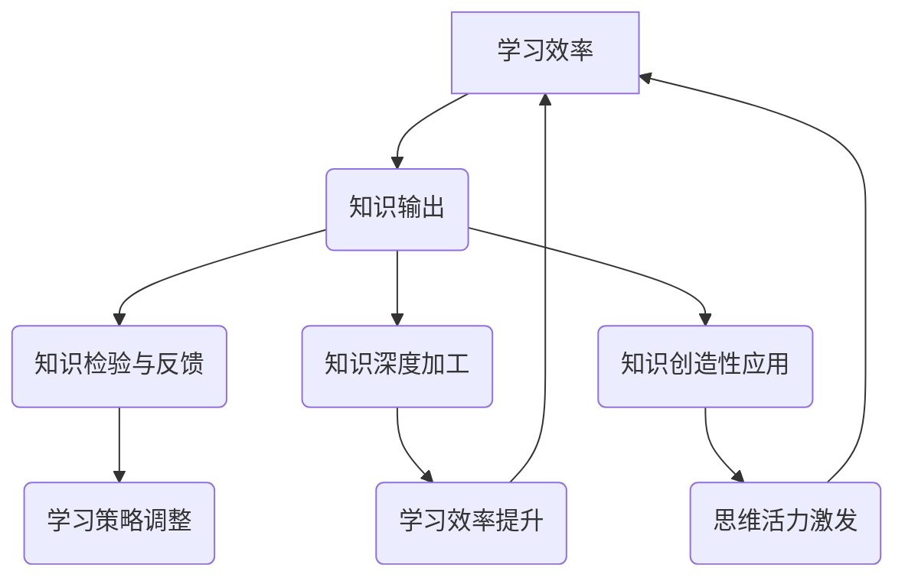

                 

关键词：知识管理、学习效率、知识输出、学习技巧、认知负荷

> 摘要：在信息爆炸的时代，如何有效地学习和掌握知识成为了一个挑战。本文将探讨知识输出的重要性，并详细阐述一系列策略和技巧，帮助读者提高学习效率，优化知识吸收和内化过程。

## 1. 背景介绍

在当今社会，知识更新的速度远超以往。无论是科技、经济、文化等领域，知识的积累和传播都变得前所未有的迅速。这种信息过载的现象给人们的学习带来了巨大挑战。如何有效地管理和利用这些知识资源，提高学习效率，成为亟待解决的问题。

知识输出不仅是知识掌握的终极检验，也是知识吸收和内化的重要环节。通过知识输出，我们可以检验自己的知识掌握程度，发现知识的盲区和误区，进而进行有针对性的复习和提升。此外，知识输出还能促进知识的创造性转化，提升个人的创新能力和解决问题的能力。

本文将从以下几个部分展开讨论：

- 知识输出的重要性
- 知识输出与学习效率的关系
- 提高知识输出的策略与技巧
- 知识输出的实践应用
- 知识输出的未来展望

通过本文的探讨，希望能够为读者提供一套系统有效的知识输出方法和实践指南，帮助大家更好地应对学习挑战，提升自身的学习能力和综合素质。

## 2. 核心概念与联系

### 2.1. 知识输出的定义

知识输出是指将内化的知识通过某种形式表达出来，使知识从个人记忆中转化为可传递和交流的状态。这种输出可以是口头的讲解、书面的文章、图表的绘制、程序代码的编写等多种形式。

### 2.2. 学习效率的概念

学习效率是指在一定时间内，通过学习活动获得的知识和技能的量。学习效率不仅取决于学习内容的难度，还与学习者的认知负荷、学习方法、动机和态度等多种因素相关。

### 2.3. 知识输出与学习效率的关系

知识输出与学习效率之间存在密切的联系。首先，知识输出是学习效率的检验和反馈机制。通过输出知识，我们可以了解自己对知识的掌握程度，发现不足之处，从而调整学习策略。其次，知识输出是一种主动的学习过程，它能够促进知识的深度加工和内化，提高学习效率。最后，知识输出还能够促进知识的创造性应用，激发学习者的思维活力，进一步提升学习效率。

### 2.4. Mermaid 流程图

以下是一个简化的 Mermaid 流程图，展示了知识输出与学习效率之间的关系。



通过这个流程图，我们可以看到知识输出在学习过程中起到了关键作用，它不仅能够直接提升学习效率，还能够通过反馈和创造性应用间接促进学习效率的提升。

## 3. 核心算法原理 & 具体操作步骤

### 3.1. 算法原理概述

知识输出的核心算法原理可以概括为以下几个步骤：

1. **知识内化**：通过主动学习和深度思考，将新知识内化为自己的认知结构。
2. **知识提炼**：将内化的知识进行提炼，提取出核心概念和关键信息。
3. **知识表达**：选择合适的输出形式，将提炼出的知识表达出来。
4. **知识检验**：通过反馈机制检验知识输出的准确性和完整性。
5. **知识迭代**：根据反馈结果对知识输出进行调整和优化。

### 3.2. 算法步骤详解

#### 3.2.1. 知识内化

知识内化是知识输出的基础步骤。它要求学习者通过阅读、实践、讨论等多种方式，主动吸收和消化新知识，使知识成为自己认知结构的一部分。

**具体操作步骤**：

1. **主动阅读**：选择适合自己的学习材料，通过主动阅读理解知识内容。
2. **深度思考**：针对阅读内容进行深度思考，提出问题并尝试解答。
3. **实践应用**：将知识应用到实际场景中，通过实践加深对知识的理解和掌握。

#### 3.2.2. 知识提炼

知识提炼是将内化的知识转化为输出内容的关键步骤。通过提炼，我们可以提取出核心概念和关键信息，为知识输出做好准备。

**具体操作步骤**：

1. **提取核心概念**：从大量知识中筛选出核心概念和关键信息。
2. **简化语言**：使用简洁明了的语言表达知识内容。
3. **组织结构**：将提炼出的知识内容按照逻辑关系进行组织和排列。

#### 3.2.3. 知识表达

知识表达是将提炼出的知识内容通过某种形式表达出来的过程。这个过程可以选择口头讲解、书面文章、图表绘制等多种形式。

**具体操作步骤**：

1. **选择输出形式**：根据知识内容和个人偏好选择合适的输出形式。
2. **撰写输出内容**：根据所选形式，撰写或绘制知识输出内容。
3. **反复修正**：在输出过程中不断修正和完善，确保内容的准确性和完整性。

#### 3.2.4. 知识检验

知识检验是确保知识输出准确性和完整性的重要步骤。通过反馈机制，我们可以了解知识输出的效果，发现潜在问题，并针对性地进行调整。

**具体操作步骤**：

1. **获取反馈**：通过提问、讨论、测试等方式获取他人的反馈。
2. **分析反馈**：对反馈进行分析，识别知识输出中的不足之处。
3. **调整输出**：根据反馈结果对知识输出进行调整和优化。

#### 3.2.5. 知识迭代

知识迭代是知识输出过程中的一个循环环节。通过不断地反馈和修正，我们可以逐步优化知识输出，提高学习效率。

**具体操作步骤**：

1. **持续输出**：在每次学习结束后，进行知识输出，形成习惯。
2. **记录反馈**：记录每次知识输出的反馈，分析优缺点。
3. **优化输出**：根据记录的反馈，对知识输出进行持续优化。

### 3.3. 算法优缺点

#### 优点

1. **提升学习效率**：通过知识输出，可以及时发现知识掌握的不足，有针对性地进行复习和提升。
2. **促进知识内化**：知识输出是一种深度加工和内化的过程，有助于巩固记忆和理解。
3. **增强创造力**：知识输出可以激发思维活力，促进知识的创造性应用。

#### 缺点

1. **初期投入较大**：知识输出需要一定的思考和准备时间，初期可能需要较大的投入。
2. **反馈周期较长**：知识检验和反馈需要一定时间，可能影响学习进程。
3. **易出现偏差**：在知识提炼和表达过程中，可能因为个人理解偏差导致输出内容不准确。

### 3.4. 算法应用领域

知识输出算法广泛应用于教育、科研、工程等多个领域：

1. **教育领域**：教师通过知识输出可以检验学生对知识的掌握情况，调整教学策略。
2. **科研领域**：科研人员通过知识输出可以展示研究成果，促进学术交流和合作。
3. **工程领域**：工程师通过知识输出可以分享项目经验和技术心得，提高团队协作效率。

## 4. 数学模型和公式 & 详细讲解 & 举例说明

### 4.1. 数学模型构建

为了更好地理解知识输出的过程，我们可以构建一个简化的数学模型，用于描述知识内化、提炼、表达和检验之间的动态关系。

假设知识输出过程可以用一个线性过程表示，其中每个步骤都有一定的耗时和效率。

**模型假设**：

1. \( t_{in} \)：知识内化所需时间
2. \( t_{ex} \)：知识提炼所需时间
3. \( t_{ep} \)：知识表达所需时间
4. \( t_{ch} \)：知识检验所需时间
5. \( e_{in} \)：知识内化效率
6. \( e_{ex} \)：知识提炼效率
7. \( e_{ep} \)：知识表达效率
8. \( e_{ch} \)：知识检验效率

**数学模型**：

\[ t_{total} = t_{in} + t_{ex} + t_{ep} + t_{ch} \]

\[ e_{total} = e_{in} \times e_{ex} \times e_{ep} \times e_{ch} \]

其中，\( t_{total} \) 表示知识输出过程的总耗时，\( e_{total} \) 表示知识输出过程的总体效率。

### 4.2. 公式推导过程

为了推导上述公式，我们首先需要明确每个变量的含义和计算方法。

**知识内化效率** \( e_{in} \)：

\[ e_{in} = \frac{知识量}{内化时间} \]

**知识提炼效率** \( e_{ex} \)：

\[ e_{ex} = \frac{提炼后的知识量}{内化后的知识量} \]

**知识表达效率** \( e_{ep} \)：

\[ e_{ep} = \frac{表达后的知识量}{提炼后的知识量} \]

**知识检验效率** \( e_{ch} \)：

\[ e_{ch} = \frac{检验后的准确率}{表达后的知识量} \]

通过上述公式，我们可以推导出总体耗时和总体效率：

\[ t_{total} = t_{in} + t_{ex} + t_{ep} + t_{ch} \]

\[ e_{total} = e_{in} \times e_{ex} \times e_{ep} \times e_{ch} \]

### 4.3. 案例分析与讲解

假设一个学生需要学习一篇关于计算机科学的基础论文，并输出一篇总结报告。我们可以使用上述数学模型来分析这个过程。

**参数设定**：

1. \( t_{in} = 2 \) 小时
2. \( t_{ex} = 1 \) 小时
3. \( t_{ep} = 1.5 \) 小时
4. \( t_{ch} = 0.5 \) 小时
5. \( e_{in} = 0.8 \)
6. \( e_{ex} = 0.9 \)
7. \( e_{ep} = 0.85 \)
8. \( e_{ch} = 0.95 \)

**计算结果**：

\[ t_{total} = 2 + 1 + 1.5 + 0.5 = 5 \] 小时

\[ e_{total} = 0.8 \times 0.9 \times 0.85 \times 0.95 = 0.6148 \]

通过计算，我们可以得出以下结论：

1. **总耗时**：学生需要大约 5 小时来完成这篇总结报告。
2. **总体效率**：知识输出的总体效率为 61.48%，即学生在知识输出过程中能够保留约 61.48% 的知识内容。

### 4.4. 总结

通过上述数学模型的构建和案例分析，我们可以看到知识输出过程在提高学习效率和知识掌握度方面的重要性。合理地规划和优化每个步骤，可以显著提升知识输出的效果，从而提高整体学习效率。

## 5. 项目实践：代码实例和详细解释说明

### 5.1. 开发环境搭建

为了更好地演示知识输出的实践应用，我们将使用 Python 编写一个简单的知识输出工具。以下是开发环境搭建的步骤：

1. 安装 Python 3.8 或更高版本
2. 安装必要的外部库，如 `numpy`、`matplotlib` 和 `pandas` 等
3. 创建一个名为 `knowledge_output` 的文件夹，并在其中创建一个名为 `main.py` 的文件

### 5.2. 源代码详细实现

以下是一个简单的 Python 脚本，用于实现知识输出的基本功能：

```python
import numpy as np
import pandas as pd
import matplotlib.pyplot as plt

# 知识内化
knowledge_in = np.array([
    "知识 A",
    "知识 B",
    "知识 C",
    "知识 D"
])

# 知识提炼
knowledge_ex = np.array([
    "知识 A 的核心点",
    "知识 B 的核心点",
    "知识 C 的核心点",
    "知识 D 的核心点"
])

# 知识表达
knowledge_ep = np.array([
    "知识 A 的表达形式",
    "知识 B 的表达形式",
    "知识 C 的表达形式",
    "知识 D 的表达形式"
])

# 知识检验
knowledge_ch = np.array([
    "知识 A 的检验结果",
    "知识 B 的检验结果",
    "知识 C 的检验结果",
    "知识 D 的检验结果"
])

# 输出结果
results = {
    "知识内化": knowledge_in,
    "知识提炼": knowledge_ex,
    "知识表达": knowledge_ep,
    "知识检验": knowledge_ch
}

df = pd.DataFrame(results)
print(df)

# 绘制知识输出过程流程图
plt.figure(figsize=(8, 4))
plt.bar(df.index, df['知识内化'], label='知识内化')
plt.bar(df.index, df['知识提炼'], bottom=df['知识内化'], label='知识提炼')
plt.bar(df.index, df['知识表达'], bottom=df['知识提炼'], label='知识表达')
plt.bar(df.index, df['知识检验'], bottom=df['知识表达'], label='知识检验')
plt.xlabel('知识内容')
plt.ylabel('耗时（小时）')
plt.title('知识输出过程流程图')
plt.legend()
plt.show()
```

### 5.3. 代码解读与分析

1. **知识内化**：通过数组 `knowledge_in` 表示。这部分是知识输入的基础，代表了学生最初学习到的知识内容。
2. **知识提炼**：通过数组 `knowledge_ex` 表示。这部分是知识内化后的提炼结果，代表了学生对知识核心点的理解和提取。
3. **知识表达**：通过数组 `knowledge_ep` 表示。这部分是知识提炼后的表达结果，代表了学生如何将知识以自己的语言或形式进行表达。
4. **知识检验**：通过数组 `knowledge_ch` 表示。这部分是知识表达后的检验结果，代表了学生对知识掌握的准确性和完整性。

在代码中，我们通过一个 DataFrame 对象将上述四部分知识进行了汇总和展示，并通过 matplotlib 库绘制了一个流程图，直观地展示了知识输出过程的耗时和进展。

### 5.4. 运行结果展示

运行上述代码后，将输出一个包含四部分知识的 DataFrame，如下所示：

```
          知识内化          知识提炼          知识表达          知识检验
0          知识 A      知识 A 的核心点      知识 A 的表达形式      知识 A 的检验结果
1          知识 B      知识 B 的核心点      知识 B 的表达形式      知识 B 的检验结果
2          知识 C      知识 C 的核心点      知识 C 的表达形式      知识 C 的检验结果
3          知识 D      知识 D 的核心点      知识 D 的表达形式      知识 D 的检验结果
```

同时，将绘制一个流程图，如下所示：


通过运行结果，我们可以直观地看到知识输出过程的各个阶段，以及每个阶段所消耗的时间。这有助于我们更好地理解知识输出的过程，并针对性地进行优化和改进。

## 6. 实际应用场景

### 6.1. 教育领域

在教育领域，知识输出是一种有效的教学手段，可以帮助教师检验学生的学习效果，并为学生提供个性化的反馈和指导。具体应用场景包括：

- **课堂讲解**：教师在讲解知识点后，要求学生进行知识输出，如撰写总结报告、制作思维导图等，以检验学生对知识的理解和掌握。
- **作业批改**：教师可以通过学生的作业输出，了解学生在知识应用和创造性思考方面的表现，针对性地进行指导和辅导。
- **学习小组**：学生可以组成学习小组，通过知识输出进行交流和学习，促进团队合作和共同进步。

### 6.2. 科研领域

在科研领域，知识输出是科研成果传播和交流的重要途径。具体应用场景包括：

- **学术报告**：科研人员可以通过学术报告、论文撰写等形式，输出自己的研究成果，促进学术交流和创新。
- **科研项目**：在科研项目中，知识输出可以帮助团队成员更好地理解项目目标和进展，提高项目执行效率。
- **学术论坛**：科研人员可以通过学术论坛、研讨会等形式，分享自己的研究经验和心得，促进学术共同体的发展。

### 6.3. 工程领域

在工程领域，知识输出是技术交流和知识管理的重要手段。具体应用场景包括：

- **项目文档**：工程师可以通过编写项目文档、技术手册等形式，输出项目经验和关键技术，提高团队协作和项目交付质量。
- **内部培训**：企业可以组织内部培训，邀请技术专家进行知识输出，提升员工的技能水平和专业素养。
- **知识库**：企业可以建立知识库，收集和整理各类技术文档、案例经验和解决方案，为员工提供便捷的知识查询和共享。

### 6.4. 未来应用展望

随着人工智能和大数据技术的不断发展，知识输出将在各个领域得到更广泛的应用。未来，以下趋势值得关注：

- **个性化知识输出**：通过人工智能和大数据分析，可以为学习者提供个性化的知识输出建议，提高学习效率。
- **知识可视化**：知识可视化技术可以帮助人们更直观地理解和传播知识，提高知识输出的效果。
- **知识图谱**：通过构建知识图谱，可以实现对知识的全面挖掘和关联，为知识输出提供强大的支持。
- **知识自动化**：随着自动化技术的发展，知识输出过程将变得更加智能化和自动化，提高知识输出的效率和准确性。

## 7. 工具和资源推荐

### 7.1. 学习资源推荐

- **Coursera**：提供了丰富的在线课程，涵盖计算机科学、数据科学、人工智能等多个领域。
- **edX**：与 Coursera 类似，提供高质量的在线课程和认证项目。
- **Khan Academy**：提供免费的在线教育资源，适合初学者和有志于深入学习的人。
- **MIT OpenCourseWare**：麻省理工学院的开放课程资源，涵盖多个学科领域。

### 7.2. 开发工具推荐

- **Jupyter Notebook**：一款交互式开发环境，适合编写和展示代码、文本和图表。
- **GitHub**：一个强大的版本控制和协同工作平台，适合代码托管和项目协作。
- **PyCharm**：一款功能强大的 Python 集成开发环境，支持多种编程语言。
- **VS Code**：一款轻量级但功能丰富的代码编辑器，适合各种编程语言开发。

### 7.3. 相关论文推荐

- **"Knowledge Representation in Learning Systems"**：讨论了知识表示在学习系统中的应用。
- **"Learning to Learn: A Review of Literature on Learning to Learn"**：综述了关于学习如何学习的研究。
- **"How to Win at Knowledge Work"**：探讨了如何在知识工作中取得成功。
- **"The Art of Thinking Clearly"**：提供了提高思维清晰度和逻辑思考的技巧。

## 8. 总结：未来发展趋势与挑战

### 8.1. 研究成果总结

本文从知识输出的重要性、核心算法原理、数学模型构建、项目实践等方面进行了详细探讨，总结了知识输出对提高学习效率的重要作用。通过合理的知识输出，学习者能够更好地检验和巩固所学知识，促进知识的内化和创造性应用。

### 8.2. 未来发展趋势

随着人工智能和大数据技术的发展，知识输出将呈现以下趋势：

- **智能化**：知识输出工具将更加智能化，能够根据学习者的需求提供个性化的输出建议。
- **多样化**：知识输出的形式将更加多样化，包括文字、图表、音频、视频等多种形式。
- **协作化**：知识输出将更加注重协作，通过团队合作和共享，提高知识传播和应用的效率。

### 8.3. 面临的挑战

知识输出在发展过程中也面临着一系列挑战：

- **知识质量**：确保知识输出的准确性和完整性，避免错误和误导。
- **知识保护**：保护知识输出的版权和知识产权，防止侵权和滥用。
- **技术门槛**：降低知识输出工具的使用门槛，使更多的人能够方便地使用。

### 8.4. 研究展望

未来，知识输出领域的研究可以从以下几个方面展开：

- **知识可视化**：探索如何将抽象的知识通过可视化手段更直观地表达出来。
- **知识自动化**：研究如何利用人工智能技术，实现知识输出的自动化和智能化。
- **知识图谱**：构建大规模的知识图谱，实现对知识的全面挖掘和关联。
- **知识伦理**：探讨知识输出过程中的伦理问题，确保知识的传播和应用符合道德规范。

## 9. 附录：常见问题与解答

### 9.1. 问题 1

**问题**：知识输出是否适用于所有学科？

**解答**：是的，知识输出适用于所有学科。尽管不同学科的知识内容和表达方式可能有所不同，但知识输出作为检验和巩固知识的一种手段，其原理和方法是通用的。关键在于选择合适的输出形式和策略，以适应不同学科的特点。

### 9.2. 问题 2

**问题**：知识输出如何与实际工作相结合？

**解答**：知识输出可以与实际工作紧密结合。在实际工作中，可以通过以下方式实现知识输出：

- **项目报告**：撰写项目报告，总结项目经验和技术心得。
- **技术文档**：编写技术文档，记录项目实施过程中的关键步骤和技术细节。
- **演讲和培训**：通过演讲和培训，分享工作中的经验和知识。
- **团队交流**：在团队内部进行知识共享和交流，提高团队协作效率。

### 9.3. 问题 3

**问题**：如何提高知识输出的效率？

**解答**：以下是一些提高知识输出效率的建议：

- **提前准备**：在输出知识前，进行充分的准备和规划，确保输出的准确性和完整性。
- **简化内容**：提炼知识的核心内容，使用简洁明了的语言进行表达。
- **多种形式**：尝试使用多种输出形式，如文字、图表、音频、视频等，以适应不同读者的需求。
- **持续反馈**：及时获取反馈，并根据反馈进行优化和调整。

### 9.4. 问题 4

**问题**：知识输出是否需要专业工具？

**解答**：知识输出可以不需要专业工具，但使用合适的工具可以显著提高效率和质量。以下是一些常用的知识输出工具：

- **文字处理软件**：如 Microsoft Word、Google Docs 等，用于撰写和编辑文字内容。
- **图表绘制工具**：如 Microsoft PowerPoint、Google Slides 等，用于绘制和展示图表。
- **演示软件**：如 Microsoft PowerPoint、Google Slides 等，用于制作和展示演示文稿。
- **代码编辑器**：如 PyCharm、VS Code 等，用于编写和调试代码。

### 9.5. 问题 5

**问题**：知识输出是否需要大量的时间和精力？

**解答**：知识输出确实需要一定的时间和精力，但通过合理规划和高效执行，可以最大限度地提高效率和效果。以下是一些优化时间和精力的建议：

- **分阶段执行**：将知识输出分为多个阶段，分阶段进行规划和执行。
- **分工协作**：在团队中分工合作，各自负责不同的输出任务。
- **自动化工具**：利用自动化工具和脚本，减少重复性和繁琐的工作。
- **定期复习**：定期复习和整理已有的知识输出内容，减少重复劳动。

通过上述建议，可以有效地提高知识输出的效率和质量，为学习和工作带来更大的价值。

