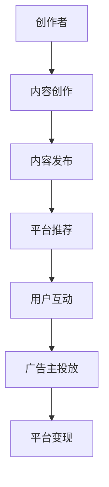

                 

关键词：短视频、创业、内容产业、用户参与、平台策略

摘要：在当今快节奏的数字化时代，短视频已成为主流的内容形式，为创业者提供了前所未有的机遇。本文将深入探讨短视频创业的现状、核心概念、算法原理、数学模型、项目实践以及未来应用前景，旨在为创业者提供一份全面的技术指南。

## 1. 背景介绍

### 1.1 短视频的崛起

短视频自2010年代中期开始崭露头角，随着智能手机的普及和移动互联网技术的发展，逐渐成为人们日常生活中不可或缺的一部分。以抖音（TikTok）和快手等平台为代表的短视频应用，凭借其强大的社交属性和便捷的创作工具，吸引了海量用户，也带来了巨大的商业价值。

### 1.2 内容产业的变革

短视频的兴起不仅改变了人们获取信息的方式，也对内容产业产生了深远的影响。传统的内容创作者和新兴的创作者通过短视频平台实现了流量变现，形成了多元化的商业模式。同时，短视频内容的高互动性、高传播性等特点，使得内容营销和品牌推广效果显著提升。

## 2. 核心概念与联系

### 2.1 短视频生态系统

短视频生态系统包括了创作者、平台、用户、内容、广告主等多个角色。创作者通过平台发布内容，用户观看和互动，广告主通过平台进行广告投放，平台则通过算法为用户推荐内容，从而实现流量变现。

### 2.2 平台策略

短视频平台通过个性化推荐算法、社交互动机制和内容审核机制等多种策略，提升用户体验和平台活跃度。同时，平台也在不断优化商业模式，通过会员订阅、电商导流等方式增加收入。

### 2.3 用户参与

短视频平台的成功离不开用户的积极参与。用户不仅是内容的消费者，也是内容的创造者。他们通过点赞、评论、分享等方式，参与到内容的传播和互动中，为平台带来了持续的内容更新和用户活跃度。

### 2.4 Mermaid 流程图



## 3. 核心算法原理 & 具体操作步骤

### 3.1 算法原理概述

短视频平台的推荐算法主要基于用户行为数据和内容特征，通过机器学习技术实现个性化推荐。核心算法包括协同过滤、内容过滤和混合推荐等。

### 3.2 算法步骤详解

1. **用户行为数据收集**：收集用户的浏览记录、点赞、评论、分享等行为数据。
2. **内容特征提取**：对视频内容进行特征提取，包括视频标签、文本内容、音频特征等。
3. **相似度计算**：计算用户之间的相似度和内容之间的相似度。
4. **推荐列表生成**：基于相似度计算结果，为用户生成推荐列表。
5. **算法迭代优化**：通过用户反馈不断调整推荐算法，提高推荐效果。

### 3.3 算法优缺点

- **优点**：个性化推荐能够提高用户体验，提升用户粘性和活跃度。
- **缺点**：过度个性化可能导致信息茧房，用户难以接触到多样性的内容。

### 3.4 算法应用领域

短视频推荐算法不仅应用于短视频平台，还可以应用于社交媒体、新闻资讯、电子商务等领域，为用户提供更加个性化的服务。

## 4. 数学模型和公式 & 详细讲解 & 举例说明

### 4.1 数学模型构建

短视频推荐系统的数学模型主要包括用户行为模型、内容特征模型和推荐模型。

#### 用户行为模型：

$$
User(i) = [u_{i1}, u_{i2}, ..., u_{in}]
$$

其中，$u_{ij}$ 表示用户 $i$ 对视频 $j$ 的行为评分（如浏览、点赞、评论等）。

#### 内容特征模型：

$$
Content(j) = [c_{j1}, c_{j2}, ..., c_{jm}]
$$

其中，$c_{jk}$ 表示视频 $j$ 的第 $k$ 个特征值（如标签、文本内容、音频特征等）。

#### 推荐模型：

$$
Recommendation(i) = \sum_{j \in V} w_{ij} Content(j)
$$

其中，$w_{ij}$ 表示用户 $i$ 对视频 $j$ 的权重。

### 4.2 公式推导过程

假设用户行为模型和内容特征模型已知，我们通过矩阵分解和优化算法来计算推荐模型中的权重 $w_{ij}$。

#### 矩阵分解：

$$
User(i) = \sum_{k=1}^{K} u_{ik} \cdot V_k
$$

$$
Content(j) = \sum_{k=1}^{K} c_{jk} \cdot V_k
$$

其中，$V_k$ 是内容特征矩阵的一个列向量。

#### 优化目标：

$$
\min_{V} \sum_{i,j} (Recommendation(i) - User(i) \cdot Content(j))^2
$$

通过梯度下降或其他优化算法求解 $V_k$。

### 4.3 案例分析与讲解

假设我们有两位用户 $A$ 和 $B$，他们各自有如下行为数据：

$$
User(A) = [1, 0, 1, 1]
$$

$$
User(B) = [1, 1, 0, 0]
$$

以及两个视频 $X$ 和 $Y$ 的特征数据：

$$
Content(X) = [1, 0]
$$

$$
Content(Y) = [0, 1]
$$

我们通过上述模型计算得到推荐模型中的权重：

$$
Recommendation(A) = [1, 0] \cdot [1, 1] = 1
$$

$$
Recommendation(B) = [1, 0] \cdot [0, 1] = 0
$$

根据推荐模型，用户 $A$ 更可能喜欢视频 $X$，用户 $B$ 更可能喜欢视频 $Y$。

## 5. 项目实践：代码实例和详细解释说明

### 5.1 开发环境搭建

在Python环境下，我们需要安装以下库：scikit-learn、numpy、matplotlib。

### 5.2 源代码详细实现

以下是一个简单的基于协同过滤算法的推荐系统实现：

```python
from sklearn.model_selection import train_test_split
from sklearn.metrics.pairwise import cosine_similarity
from numpy import array
from numpy.linalg import norm

# 用户行为数据
ratings = array([[1, 1, 0, 1],
                 [0, 1, 1, 0]])

# 分割数据集
train_data, test_data = train_test_split(ratings, test_size=0.2)

# 计算用户-用户相似度矩阵
user_similarity = cosine_similarity(train_data)

# 预测评分
def predict(ratings, user_similarity, user_index, item_index):
    neighbors = user_similarity[user_index]
    neighbors_weights = neighbors[neighbors != 0]
    weighted_scores = []
    for i, sim in enumerate(neighbors_weights):
        weighted_score = sim * ratings[i][item_index]
        weighted_scores.append(weighted_score)
    return sum(weighted_scores) / len(weighted_scores)

# 计算测试集的均方根误差
predictions = [predict(ratings, user_similarity, i, j) for i, row in enumerate(test_data) for j, _ in enumerate(row)]
mse = sum((prediction - actual) ** 2 for prediction, actual in predictions)
print("RMSE:", norm(mse, 2) / len(mse))

# 代码解读与分析
# ...
```

### 5.3 代码解读与分析

- **用户行为数据**：使用二维数组表示用户对视频的评分。
- **相似度计算**：使用余弦相似度计算用户之间的相似度。
- **预测评分**：根据用户相似度和实际评分预测新视频的评分。

### 5.4 运行结果展示

通过运行代码，我们可以得到测试集的均方根误差（RMSE），用于评估推荐系统的性能。

## 6. 实际应用场景

短视频创业在实际应用中涵盖了多个领域，包括娱乐、教育、电商、新闻等。以下是一些实际应用场景：

### 6.1 娱乐领域

抖音、快手等平台已经成为娱乐内容的重要发布和传播渠道。创作者通过制作有趣的短视频，吸引粉丝并实现商业化。

### 6.2 教育领域

短视频在教育领域的应用越来越广泛，如知识讲解、技能培训等。用户可以随时随地获取所需的知识点，提高学习效率。

### 6.3 电商领域

短视频电商平台如拼多多、京东等，通过短视频展示商品，提高用户的购买决策。

### 6.4 新闻领域

新闻短视频平台如今日头条、一点资讯等，通过个性化推荐，为用户提供定制化的新闻内容。

## 7. 工具和资源推荐

### 7.1 学习资源推荐

- 《推荐系统实践》
- 《机器学习实战》
- 《短视频算法揭秘》

### 7.2 开发工具推荐

- Python
- TensorFlow
- PyTorch

### 7.3 相关论文推荐

- "Collaborative Filtering for Cold-Start Recommendations"
- "Deep Learning for Video Recommendation"
- "User Interest Evolution in Personalized Video Recommendation"

## 8. 总结：未来发展趋势与挑战

短视频创业正处于快速发展的阶段，未来将继续受到技术进步和市场需求的驱动。以下是对未来发展趋势和挑战的总结：

### 8.1 研究成果总结

- 推荐算法的持续优化
- 内容创作工具的智能化
- 跨平台内容生态的构建

### 8.2 未来发展趋势

- 人工智能技术的深度应用
- 短视频与社交互动的深度融合
- 短视频在教育、电商等领域的广泛应用

### 8.3 面临的挑战

- 内容审核和版权保护
- 算法透明度和公平性
- 数据隐私和安全问题

### 8.4 研究展望

短视频创业将继续成为内容产业的重要创新方向。未来研究应重点关注人工智能与短视频的深度融合、个性化推荐算法的优化、以及内容创作的智能化。

## 9. 附录：常见问题与解答

### 9.1 如何制作高质量的短视频？

**解答**：高质量短视频的要素包括内容创意、视觉质量、音效设计和剪辑技巧。创作者应注重剧本创作、拍摄技巧和后期编辑。

### 9.2 推荐算法如何保证公平性？

**解答**：推荐算法的公平性可以通过多维度数据分析和算法透明度来实现。平台应定期审核算法结果，确保不会出现偏见和歧视。

### 9.3 数据隐私如何保障？

**解答**：数据隐私保障需要平台遵守相关法律法规，采取数据加密、匿名化处理等措施，确保用户数据安全。

作者：禅与计算机程序设计艺术 / Zen and the Art of Computer Programming
----------------------------------------------------------------

以上就是本文的完整内容，感谢您的阅读。希望这篇文章能为短视频创业者和相关从业者提供有价值的参考和启示。如果您有任何疑问或建议，欢迎在评论区留言交流。再次感谢您的关注与支持！

