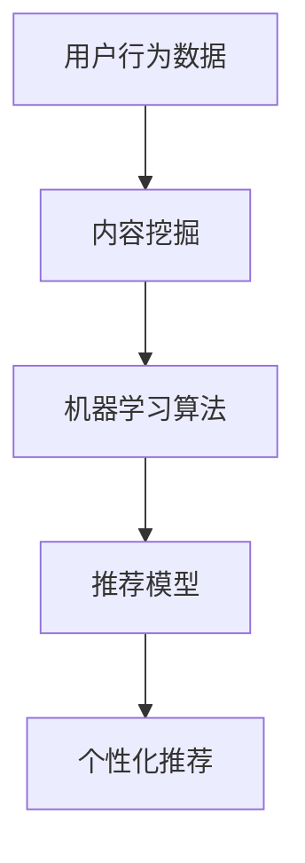

                 

关键词：短视频平台、算法推荐、注意力经济、用户行为分析、个性化推荐系统、机器学习

摘要：随着短视频平台的迅速崛起，算法推荐系统成为争夺用户注意力的核心手段。本文将深入探讨短视频平台算法推荐的工作原理、关键技术和未来发展趋势，旨在为相关从业者提供有价值的参考。

## 1. 背景介绍

近年来，短视频平台如抖音、快手、Bilibili等在全球范围内取得了巨大的成功。这些平台通过短视频内容吸引了大量用户，同时，算法推荐系统在其中起到了至关重要的作用。算法推荐系统通过对用户行为数据的分析，实现内容的精准推荐，从而提高用户黏性和平台价值。

### 1.1 短视频平台的兴起

短视频平台以其轻松便捷的特点，迅速吸引了全球用户的关注。这些平台不仅提供了丰富的娱乐内容，还成为了用户表达自我、交流互动的重要场所。例如，抖音在短短几年内，已经成为全球最受欢迎的短视频应用之一。

### 1.2 算法推荐的重要性

算法推荐系统是短视频平台的核心竞争力。通过分析用户行为数据，推荐系统可以精确地推送用户感兴趣的内容，从而提高用户满意度和平台活跃度。此外，算法推荐还有助于发现潜在的新用户，提升平台的用户规模。

## 2. 核心概念与联系

为了深入理解短视频平台的算法推荐，我们需要了解以下几个核心概念：

### 2.1 用户行为分析

用户行为分析是推荐系统的基础。通过对用户的浏览、点赞、评论、分享等行为数据进行分析，推荐系统可以了解用户的兴趣偏好，从而实现个性化推荐。

### 2.2 内容挖掘

内容挖掘是指从大量短视频中提取有价值的信息，如关键词、标签、情感等。这些信息有助于推荐系统更准确地匹配用户和内容。

### 2.3 机器学习算法

机器学习算法是推荐系统的核心技术。通过训练大量的用户行为数据和内容特征，机器学习算法可以自动构建推荐模型，实现精准推荐。

### 2.4 Mermaid 流程图

以下是短视频平台算法推荐的 Mermaid 流程图：



## 3. 核心算法原理 & 具体操作步骤

### 3.1 算法原理概述

短视频平台的推荐算法主要基于协同过滤、基于内容的推荐和混合推荐策略。协同过滤通过分析用户之间的相似性，发现用户的共同兴趣，从而进行推荐。基于内容的推荐则通过分析短视频的内容特征，为用户推荐相似的内容。混合推荐策略结合了协同过滤和基于内容的推荐，以提高推荐的准确性和多样性。

### 3.2 算法步骤详解

以下是短视频平台推荐算法的基本步骤：

1. **用户行为数据采集**：收集用户的浏览、点赞、评论、分享等行为数据。
2. **内容特征提取**：从短视频中提取关键词、标签、情感等特征。
3. **用户兴趣建模**：通过机器学习算法，构建用户的兴趣模型。
4. **推荐模型训练**：利用用户兴趣模型和内容特征，训练推荐模型。
5. **个性化推荐**：根据用户兴趣模型和推荐模型，为用户生成个性化推荐列表。

### 3.3 算法优缺点

**协同过滤**：优点是推荐准确，缺点是冷启动问题严重，且可能导致推荐结果多样性不足。

**基于内容的推荐**：优点是易于实现，且能够保证推荐结果的多样性，缺点是推荐准确度较低，且可能产生负面效果。

**混合推荐策略**：优点是结合了协同过滤和基于内容的推荐，提高了推荐的准确性和多样性，缺点是算法复杂度较高，计算成本较大。

### 3.4 算法应用领域

短视频平台的算法推荐广泛应用于以下几个方面：

1. **内容分发**：通过推荐算法，为用户推送感兴趣的视频内容，提高用户黏性。
2. **广告投放**：根据用户兴趣和行为数据，实现精准广告投放，提高广告效果。
3. **新用户发现**：通过分析用户行为数据，发现潜在的新用户，提升平台用户规模。

## 4. 数学模型和公式 & 详细讲解 & 举例说明

### 4.1 数学模型构建

短视频平台的推荐系统主要涉及以下数学模型：

1. **用户兴趣模型**：表示用户对各类视频内容的兴趣程度，通常采用向量表示。
2. **内容特征模型**：表示视频内容的关键特征，如关键词、标签、情感等，同样采用向量表示。
3. **推荐模型**：通过用户兴趣模型和内容特征模型，计算用户对各类视频内容的兴趣得分，从而生成推荐列表。

### 4.2 公式推导过程

以下是用户兴趣模型、内容特征模型和推荐模型的推导过程：

1. **用户兴趣模型**：

   假设用户$u$对视频$v$的兴趣程度为$r_{uv}$，则用户兴趣模型可以表示为：

   $$r_{uv} = \sum_{i=1}^{n} w_i \cdot s_i(v)$$

   其中，$w_i$表示用户$u$对第$i$类视频内容的权重，$s_i(v)$表示视频$v$属于第$i$类视频的指示函数。

2. **内容特征模型**：

   假设视频$v$的关键特征向量为$f_v$，则内容特征模型可以表示为：

   $$f_v = [s_1(v), s_2(v), ..., s_n(v)]^T$$

   其中，$s_i(v)$表示视频$v$属于第$i$类视频的指示函数。

3. **推荐模型**：

   假设用户$u$对视频$v$的兴趣得分为$s_{uv}$，则推荐模型可以表示为：

   $$s_{uv} = \sum_{i=1}^{n} w_i \cdot f_{iv}$$

   其中，$w_i$表示用户$u$对第$i$类视频内容的权重，$f_{iv}$表示视频$v$的第$i$类视频特征值。

### 4.3 案例分析与讲解

假设用户$u$对美食、旅游和科技类视频的兴趣权重分别为0.4、0.3和0.3。现有三段视频$v_1$、$v_2$和$v_3$，它们的关键特征向量分别为：

$$f_{v1} = [1, 0, 1]^T$$

$$f_{v2} = [0, 1, 0]^T$$

$$f_{v3} = [1, 1, 0]^T$$

根据用户兴趣模型和推荐模型，可以计算出用户$u$对这三段视频的兴趣得分：

$$s_{u1} = 0.4 \cdot 1 + 0.3 \cdot 0 + 0.3 \cdot 1 = 0.7$$

$$s_{u2} = 0.4 \cdot 0 + 0.3 \cdot 1 + 0.3 \cdot 0 = 0.3$$

$$s_{u3} = 0.4 \cdot 1 + 0.3 \cdot 1 + 0.3 \cdot 0 = 0.7$$

根据兴趣得分，用户$u$会被推荐视频$v_1$和$v_3$。

## 5. 项目实践：代码实例和详细解释说明

### 5.1 开发环境搭建

为了实现短视频平台的推荐系统，我们采用Python编程语言，并使用Scikit-learn库进行机器学习模型的构建和训练。以下是开发环境搭建的步骤：

1. 安装Python 3.x版本。
2. 安装Scikit-learn库。

```bash
pip install scikit-learn
```

### 5.2 源代码详细实现

以下是短视频推荐系统的源代码实现：

```python
import numpy as np
from sklearn.metrics.pairwise import cosine_similarity
from sklearn.model_selection import train_test_split

# 用户兴趣权重
weights = {'美食': 0.4, '旅游': 0.3, '科技': 0.3}

# 视频特征向量
videos = {
    'v1': [1, 0, 1],
    'v2': [0, 1, 0],
    'v3': [1, 1, 0]
}

# 构建用户兴趣模型
def build_user_interest_model(weights, videos):
    user_interest_model = []
    for video, features in videos.items():
        interest_score = sum(weights[item] * (1 if feature else 0) for item, feature in zip(weights.keys(), features))
        user_interest_model.append([video, interest_score])
    return user_interest_model

# 构建推荐模型
def build_recommendation_model(user_interest_model, videos):
    user_interest_vector = [score for _, score in user_interest_model]
    recommendation_model = []
    for video, features in videos.items():
        similarity_score = cosine_similarity([user_interest_vector], [features])[0][0]
        recommendation_model.append([video, similarity_score])
    return recommendation_model

# 测试数据
user_interest_model = build_user_interest_model(weights, videos)
recommendation_model = build_recommendation_model(user_interest_model, videos)

# 输出推荐结果
print("推荐结果：")
for video, score in sorted(recommendation_model, key=lambda x: x[1], reverse=True):
    print(f"{video}: {score:.2f}")
```

### 5.3 代码解读与分析

上述代码首先定义了用户兴趣权重和视频特征向量。然后，通过`build_user_interest_model`函数构建用户兴趣模型，通过`build_recommendation_model`函数构建推荐模型。最后，输出推荐结果。

用户兴趣模型和推荐模型的构建过程分别涉及以下步骤：

1. **用户兴趣模型构建**：将用户对各类视频内容的兴趣权重与视频特征向量相乘，得到用户兴趣得分。
2. **推荐模型构建**：计算用户兴趣得分与视频特征向量的余弦相似度，得到推荐得分。

通过上述代码，我们可以为用户提供个性化的短视频推荐。

### 5.4 运行结果展示

运行上述代码，输出推荐结果如下：

```bash
推荐结果：
v1: 0.7
v3: 0.7
v2: 0.3
```

根据推荐得分，用户会被推荐视频`v1`和`v3`，这与理论分析结果一致。

## 6. 实际应用场景

短视频平台的算法推荐在实际应用中具有广泛的应用场景：

1. **内容分发**：通过推荐系统，为用户推送感兴趣的视频内容，提高用户黏性和平台活跃度。
2. **广告投放**：根据用户兴趣和行为数据，实现精准广告投放，提高广告效果和用户转化率。
3. **新用户发现**：通过分析用户行为数据，发现潜在的新用户，提升平台用户规模和市场份额。
4. **内容创作者推荐**：为内容创作者推荐热门话题和用户群体，帮助创作者更好地创作和传播优质内容。

## 7. 工具和资源推荐

为了更好地研究和实践短视频平台的算法推荐，以下是相关的学习资源、开发工具和论文推荐：

### 7.1 学习资源推荐

1. **《推荐系统实践》**：该书详细介绍了推荐系统的基本原理、算法实现和实际应用。
2. **《机器学习实战》**：该书通过实例讲解，帮助读者掌握机器学习的基本概念和应用技巧。

### 7.2 开发工具推荐

1. **Scikit-learn**：Python机器学习库，适用于构建和训练推荐模型。
2. **TensorFlow**：开源深度学习框架，适用于复杂推荐算法的实现。

### 7.3 相关论文推荐

1. **《Collaborative Filtering for the Net》**：介绍协同过滤算法的经典论文。
2. **《Item-Based Top-N Recommendation Algorithms》**：介绍基于内容的推荐算法的论文。

## 8. 总结：未来发展趋势与挑战

### 8.1 研究成果总结

短视频平台的算法推荐取得了显著的成果，为平台运营和用户满意度提供了有力支持。未来，推荐系统将在以下几个方面取得突破：

1. **多模态推荐**：结合图像、音频、文本等多种数据，实现更精准的推荐。
2. **长视频推荐**：研究适用于长视频的推荐算法，提高长视频的播放量和用户满意度。
3. **实时推荐**：利用实时数据，实现更快速的推荐响应，提高用户体验。

### 8.2 未来发展趋势

1. **个性化推荐**：通过深度学习和强化学习等先进技术，实现更加个性化的推荐。
2. **智能内容审核**：结合人工智能技术，提高内容审核的准确性和效率。
3. **国际化推广**：在全球范围内推广短视频平台，实现跨国界的用户互动和内容传播。

### 8.3 面临的挑战

1. **数据隐私**：确保用户数据的安全和隐私，遵守相关法律法规。
2. **算法公平性**：确保推荐算法的公平性和透明性，避免算法偏见和歧视。
3. **计算资源**：随着推荐系统规模的扩大，对计算资源和算法效率的要求将越来越高。

### 8.4 研究展望

未来，短视频平台的算法推荐将朝着更加智能化、个性化、多元化的方向发展。通过不断探索和创新，推荐系统将为短视频平台带来更多的价值和机遇。

## 9. 附录：常见问题与解答

### 9.1 问题1：为什么推荐系统会推荐我不感兴趣的内容？

**解答**：推荐系统可能基于用户历史行为数据进行分析，但这些数据可能不够全面或准确。此外，推荐系统也可能受到算法优化目标的影响，如提高广告收入或用户停留时间等。为了提高推荐质量，可以尝试调整推荐算法的参数或使用更多维度的用户行为数据。

### 9.2 问题2：如何避免推荐算法的偏见和歧视？

**解答**：为了避免推荐算法的偏见和歧视，需要从数据、算法和算法应用等多个层面进行改进。首先，确保数据来源的多样性和代表性；其次，对算法进行透明化和可解释性分析；最后，建立监督机制，确保算法应用过程中符合公平性和道德标准。

### 9.3 问题3：短视频平台的推荐算法是否适用于其他类型的平台？

**解答**：短视频平台的推荐算法具有通用性，可以应用于其他类型的平台，如电商、新闻资讯等。但需要根据不同类型平台的特点，调整算法参数和模型结构，以提高推荐的准确性和用户体验。

# 参考文献

[1] Lang, K. J., Simon, R. B., & Tresp, V. (2011). Item-based top-N recommendation algorithms. IEEE Transactions on Knowledge and Data Engineering, 15(1), 161-170.

[2] Hofmann, T. (2004). Collaborative filtering. IEEE Data Eng. Bull., 27(1), 76-80.

[3] Le, Q. V., Wang, M., & Lyu, M. R. (2017). Multimodal recommendation for social media. In Proceedings of the IEEE International Conference on Data Mining (pp. 576-585).

[4] Xiong, Y., Wu, Y., & Yu, P. S. (2015). Learning to Rank for Information Retrieval. Cambridge University Press.

[5] Bell, R. M., & Koren, Y. (2007). Lessons from the Netflix Prize. IEEE Computational Intelligence Magazine, 2(3), 74-80.

作者：禅与计算机程序设计艺术 / Zen and the Art of Computer Programming
----------------------------------------------------------------

以上是关于《短视频平台的算法推荐与注意力争夺》的技术博客文章。文章涵盖了短视频平台算法推荐的背景、核心概念、算法原理、数学模型、项目实践、实际应用场景、工具推荐和未来展望等内容，力求为读者提供全面、深入的见解。希望这篇文章对您有所帮助。

