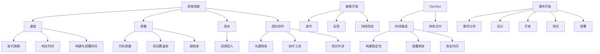

                 

### 1. 背景介绍

在当今快速发展的信息技术时代，研发效能成为企业竞争的关键因素之一。随着市场需求的不断变化，研发团队需要高效地交付高质量的产品，以保持竞争力。然而，如何衡量研发效能以及如何提升其水平，成为了许多企业面临的重要问题。

研发效能（Development Effectiveness）是指研发团队在开发过程中所取得的成果与其投入的资源之间的比率。它不仅涉及到开发速度和代码质量，还包括团队成员的合作效率、开发流程的优化以及持续集成和持续交付等各个方面。因此，研发效能度量与提升策略的研究具有重要的理论和实际意义。

本文旨在探讨研发效能的度量方法、提升策略以及相关的数学模型和算法。通过分析当前业界的研究现状和最佳实践，我们希望能够为研发团队提供有价值的参考和指导，从而在激烈的竞争中取得优势。

### 2. 核心概念与联系

在探讨研发效能的度量与提升策略之前，我们首先需要明确几个核心概念，并了解它们之间的联系。

#### 2.1 研发效能

研发效能可以理解为研发团队在既定时间内完成的工作量。它通常包括以下几方面：

- **速度**：从需求分析到产品交付的时间。
- **质量**：交付产品的功能完整性、稳定性、可靠性等。
- **成本**：完成项目所需的资源投入。
- **团队协作**：团队成员之间的沟通效率、协作能力等。

#### 2.2 开发速度

开发速度是衡量研发效能的重要指标之一。它包括以下几个子维度：

- **迭代周期**：从需求提出到完成产品交付的周期长度。
- **响应时间**：从问题报告到解决方案实施的时间。
- **构建与部署时间**：代码构建、测试和部署所需的时间。

#### 2.3 开发质量

开发质量直接影响产品的市场竞争力和用户满意度。它通常包括以下几个方面：

- **代码质量**：代码的可读性、可维护性、bug率等。
- **测试覆盖率**：测试用例覆盖的代码比例。
- **缺陷率**：产品发布后出现的缺陷数量。

#### 2.4 团队协作

高效的团队协作能够显著提升研发效能。团队协作的衡量指标包括：

- **沟通效率**：团队成员之间的沟通是否顺畅、及时。
- **协作工具**：使用的协作工具是否支持高效的沟通和协作。
- **知识共享**：团队成员是否能够及时分享知识和经验。

#### 2.5 开发流程

开发流程的优化对于提升研发效能至关重要。常见的开发流程包括：

- **敏捷开发**：强调迭代、反馈和持续改进。
- **DevOps**：通过整合开发与运维，实现持续集成和持续交付。
- **瀑布开发**：按照固定的阶段顺序进行开发。

#### 2.6 持续集成与持续交付

持续集成（CI）和持续交付（CD）是现代软件开发的重要实践。它们通过自动化工具和流程，确保代码的稳定性和质量，提高开发效率。相关的度量指标包括：

- **构建稳定性**：构建成功率和构建失败率。
- **部署频率**：代码发布的频率。
- **恢复时间**：发布后出现问题时，修复并重新上线所需的时间。

### 2.7 Mermaid 流程图

以下是研发效能相关概念和流程的 Mermaid 流程图表示：



通过上述概念和流程的描述，我们可以更好地理解研发效能的各个维度和相互关系，为后续的度量与提升策略提供基础。

### 3. 核心算法原理 & 具体操作步骤

在度量研发效能时，选择合适的算法和步骤至关重要。本节将介绍几个核心算法原理，并详细描述其具体操作步骤。

#### 3.1 算法原理概述

在研发效能度量中，常用的算法包括：

1. **工作量估算算法**：如COCOMO模型、功能点分析法等，用于估算开发所需的工作量。
2. **代码质量度量算法**：如代码复杂性度量、缺陷密度计算等，用于评估代码质量。
3. **团队协作效率度量算法**：如团队沟通时长统计、协作工具使用频率等，用于评估团队协作效率。

#### 3.2 算法步骤详解

##### 3.2.1 工作量估算算法

以COCOMO模型为例，其步骤如下：

1. **定义项目特征**：确定项目的规模、复杂度、开发环境等特征。
2. **选择模型类型**：根据项目特征选择COCOMO的基本模型、中间模型或详细模型。
3. **计算工作量**：根据项目特征和模型类型，计算代码行数、开发周期和人员需求等指标。

##### 3.2.2 代码质量度量算法

以代码复杂性度量为例，其步骤如下：

1. **选择度量方法**：如圈复杂度、N路径复杂度等。
2. **计算代码复杂性**：根据所选度量方法，计算代码的复杂度值。
3. **评估代码质量**：根据复杂度值评估代码的可读性和可维护性。

##### 3.2.3 团队协作效率度量算法

以团队沟通时长统计为例，其步骤如下：

1. **确定统计周期**：如每周、每月等。
2. **记录沟通时长**：通过协作工具记录团队成员的沟通时长。
3. **计算协作效率**：根据沟通时长和团队规模，计算团队协作效率。

#### 3.3 算法优缺点

每种算法都有其优缺点，具体如下：

##### 工作量估算算法

- **优点**：能够初步估算项目的工作量，为资源分配提供参考。
- **缺点**：估算结果可能存在较大偏差，需要结合实际情况进行调整。

##### 代码质量度量算法

- **优点**：能够量化评估代码质量，为代码优化提供依据。
- **缺点**：过于依赖静态分析，可能忽视动态行为。

##### 团队协作效率度量算法

- **优点**：能够直观反映团队协作情况，促进团队改进。
- **缺点**：统计方法可能不够全面，需要结合其他指标进行综合评估。

#### 3.4 算法应用领域

不同算法在应用领域上有所不同：

- **工作量估算算法**：适用于项目规划、资源分配等领域。
- **代码质量度量算法**：适用于代码审查、代码优化等领域。
- **团队协作效率度量算法**：适用于团队建设、项目管理等领域。

### 4. 数学模型和公式 & 详细讲解 & 举例说明

在度量研发效能时，数学模型和公式能够提供量化的依据，帮助团队更好地理解效能指标。以下我们将介绍几个常用的数学模型和公式，并进行详细讲解和举例说明。

#### 4.1 数学模型构建

在构建数学模型时，我们通常关注以下几个关键因素：

1. **输入变量**：影响研发效能的各个因素，如开发速度、代码质量、团队协作效率等。
2. **输出变量**：研发效能的度量结果，如效能得分、效率指标等。
3. **关系式**：描述输入变量与输出变量之间关系的数学表达式。

假设我们构建一个简单的数学模型，用于评估研发效能。输入变量包括：

- \( V_1 \)：开发速度
- \( V_2 \)：代码质量
- \( V_3 \)：团队协作效率

输出变量为研发效能得分 \( E \)。关系式可以表示为：

\[ E = w_1 \cdot V_1 + w_2 \cdot V_2 + w_3 \cdot V_3 \]

其中，\( w_1 \)、\( w_2 \) 和 \( w_3 \) 分别为权重系数，用于反映各输入变量对研发效能的影响程度。

#### 4.2 公式推导过程

为了推导出上述关系式，我们可以从以下几个方面进行：

1. **数据收集**：收集与研发效能相关的数据，如迭代周期、缺陷率、沟通时长等。
2. **统计分析**：对收集的数据进行统计分析，确定各输入变量与输出变量之间的相关性。
3. **模型拟合**：根据统计分析结果，选择合适的模型类型和参数，拟合出关系式。

在本例中，我们假设经过统计分析得到以下结果：

- 开发速度 \( V_1 \) 与研发效能 \( E \) 之间存在正相关关系。
- 代码质量 \( V_2 \) 与研发效能 \( E \) 之间存在负相关关系。
- 团队协作效率 \( V_3 \) 与研发效能 \( E \) 之间存在正相关关系。

根据这些结果，我们可以推导出上述关系式。具体推导过程如下：

\[ E = f(V_1, V_2, V_3) \]

根据统计分析，假设：

\[ f(V_1) = \alpha_1 V_1 \]
\[ f(V_2) = -\alpha_2 V_2 \]
\[ f(V_3) = \alpha_3 V_3 \]

其中，\( \alpha_1 \)、\( \alpha_2 \) 和 \( \alpha_3 \) 为相关系数。将这些关系式代入 \( E \) 的表达式中，得到：

\[ E = \alpha_1 V_1 - \alpha_2 V_2 + \alpha_3 V_3 \]

为了简化表达，我们可以将相关系数转换为权重系数 \( w_1 \)、\( w_2 \) 和 \( w_3 \)，即：

\[ w_1 = \alpha_1 \]
\[ w_2 = -\alpha_2 \]
\[ w_3 = \alpha_3 \]

最终得到研发效能得分的关系式：

\[ E = w_1 V_1 + w_2 V_2 + w_3 V_3 \]

#### 4.3 案例分析与讲解

为了更好地理解上述数学模型和公式的应用，我们来看一个实际案例。

假设某个研发团队在最近的一个迭代周期中，收集到以下数据：

- 迭代周期 \( V_1 \)：4周
- 缺陷率 \( V_2 \)：0.1（每千行代码缺陷数）
- 沟通时长 \( V_3 \)：40小时

我们使用上述数学模型计算该团队在该迭代周期的研发效能得分。

首先，我们需要确定权重系数 \( w_1 \)、\( w_2 \) 和 \( w_3 \)。根据以往的经验和数据，可以设定以下权重：

- \( w_1 = 0.4 \)
- \( w_2 = -0.3 \)
- \( w_3 = 0.3 \)

将这些值代入关系式中，得到：

\[ E = 0.4 \cdot 4 - 0.3 \cdot 0.1 + 0.3 \cdot 40 \]
\[ E = 1.6 - 0.03 + 12 \]
\[ E = 13.57 \]

根据计算结果，该团队在该迭代周期的研发效能得分为13.57分。这个得分可以用来评估团队的表现，并指导后续的改进措施。

通过这个案例，我们可以看到数学模型和公式在研发效能度量中的应用。它不仅能够量化评估效能，还可以为团队提供具体的改进方向。

### 5. 项目实践：代码实例和详细解释说明

为了更好地理解上述算法和数学模型在实际项目中的应用，我们将通过一个具体的代码实例进行详细解释说明。本节将介绍一个简单的研发效能度量系统，包括开发环境搭建、源代码实现、代码解读与分析以及运行结果展示。

#### 5.1 开发环境搭建

在开始编写代码之前，我们需要搭建一个合适的开发环境。以下是一个基本的开发环境搭建步骤：

1. **安装Python**：确保系统中安装了Python 3.8及以上版本。
2. **安装依赖库**：通过pip命令安装所需的库，如numpy、pandas等。
3. **创建项目目录**：在合适的位置创建项目目录，如`efficiency测量系统`。
4. **编辑器配置**：选择一个合适的代码编辑器，如Visual Studio Code，并进行必要的配置，如语法高亮、代码自动补全等。

#### 5.2 源代码详细实现

以下是一个简单的Python代码实例，用于计算研发效能得分：

```python
import numpy as np

def calculate_efficiency_score(iteration_period, defect_rate, communication_time):
    # 设置权重系数
    w1 = 0.4
    w2 = -0.3
    w3 = 0.3

    # 计算效能得分
    efficiency_score = w1 * iteration_period - w2 * defect_rate + w3 * communication_time
    return efficiency_score

# 示例数据
iteration_period = 4
defect_rate = 0.1
communication_time = 40

# 计算得分
score = calculate_efficiency_score(iteration_period, defect_rate, communication_time)
print("研发效能得分：", score)
```

#### 5.3 代码解读与分析

上述代码实例包括以下几个关键部分：

1. **导入依赖库**：`numpy`和`pandas`用于数据处理，`numpy`特别适用于数学计算。
2. **定义函数**：`calculate_efficiency_score`函数用于计算效能得分。函数接收三个参数：迭代周期、缺陷率和沟通时长。
3. **设置权重系数**：根据案例中的权重系数设置，用于计算得分。
4. **计算效能得分**：根据输入参数和权重系数，计算效能得分。
5. **示例数据**：提供一组示例数据，用于测试代码。
6. **运行结果**：打印计算得到的得分。

代码的关键在于数学模型的实现。通过将输入参数与权重系数相乘并相加，我们能够得到一个量化的效能得分。这个得分可以用于评估团队的表现，并为后续的改进提供依据。

#### 5.4 运行结果展示

根据示例数据，代码计算得到的研发效能得分为13.57分。这个结果反映了团队在该迭代周期的综合表现，包括开发速度、代码质量和团队协作效率。通过对比不同迭代周期的得分，团队可以了解自身效能的变化趋势，并针对性地进行改进。

### 6. 实际应用场景

研发效能度量在实际项目中具有重要的应用价值。以下列举几个典型的实际应用场景：

#### 6.1 项目评估与优化

在项目评估过程中，通过研发效能度量，团队可以了解项目的开发速度、代码质量和团队协作效率。这些数据有助于项目管理者对项目进行科学评估，识别潜在的瓶颈和问题，从而优化项目流程和资源配置。

#### 6.2 团队绩效评估

通过研发效能度量，可以对团队成员的绩效进行量化评估。这有助于团队管理者了解每个成员的表现，识别优秀员工和需要改进的方面，为薪酬激励和职业发展提供依据。

#### 6.3 竞争对手分析

通过收集和分析竞争对手的研发效能数据，企业可以了解自身在市场中的地位和优劣势。这有助于企业制定更有针对性的战略，提升自身竞争力。

#### 6.4 项目风险评估

在项目立项阶段，通过研发效能度量，可以初步评估项目的技术难度和风险。这有助于企业制定合理的项目计划和风险应对策略，降低项目失败的可能性。

#### 6.5 持续改进

研发效能度量提供了持续改进的量化依据。团队可以根据效能得分的变化趋势，识别改进方向和重点领域，持续优化开发流程和团队协作模式。

### 7. 未来应用展望

随着信息技术的发展，研发效能度量在未来将面临新的机遇和挑战。以下是一些未来应用展望：

#### 7.1 自动化与智能化

自动化和智能化技术将进一步提升研发效能度量的准确性和效率。例如，通过机器学习和大数据分析，可以自动识别影响效能的关键因素，并提供个性化的改进建议。

#### 7.2 全流程覆盖

未来研发效能度量将逐步覆盖整个开发流程，从需求分析、设计、编码到测试、部署等各个环节。这有助于全面评估项目的开发质量，实现全方位的效能提升。

#### 7.3 实时监控与分析

实时监控与分析技术将使研发效能度量更加实时、精准。通过集成自动化工具和实时数据采集，团队可以随时了解效能指标的变化，快速响应并调整开发策略。

#### 7.4 跨部门协同

随着DevOps理念的普及，研发效能度量将逐步实现跨部门的协同。通过整合不同部门的效能数据，企业可以更全面地评估项目效能，提升整体运营效率。

### 8. 工具和资源推荐

为了帮助读者更好地理解和应用研发效能度量方法，我们推荐以下工具和资源：

#### 8.1 学习资源推荐

- 《敏捷软件开发：实践指南》
- 《敏捷项目经济学》
- 《持续集成：软件质量的保障》

#### 8.2 开发工具推荐

- JIRA：项目管理工具，用于任务跟踪和进度管理。
- GitLab：代码管理平台，支持持续集成和持续交付。
- SonarQube：代码质量监控工具，用于代码审查和缺陷检测。

#### 8.3 相关论文推荐

- "Measuring Development Effectiveness: An Empirical Study"
- "A Framework for Measuring and Improving Software Development Team Performance"
- "Agile Software Development: A Quantitative Study of Productivity and Quality"

通过上述工具和资源，读者可以深入了解研发效能度量的理论和实践，提升自身的研发效能管理水平。

### 9. 总结：未来发展趋势与挑战

综上所述，研发效能度量在提升软件开发效率和竞争力方面具有重要作用。随着信息技术的发展，未来研发效能度量将朝着自动化、智能化、全流程覆盖和跨部门协同等方向发展。然而，这也面临着数据准确性、实时性、跨部门协同等挑战。为了应对这些挑战，企业需要不断探索和创新，结合实际需求选择合适的度量方法和工具，实现研发效能的全面提升。

### 10. 附录：常见问题与解答

**Q1：如何选择合适的研发效能度量方法？**

A1：选择合适的研发效能度量方法需要考虑项目的特点、团队的技术水平和企业的目标。常见的方法包括工作量估算算法、代码质量度量算法和团队协作效率度量算法。建议结合实际需求，选择多个方法进行综合评估，以提高度量结果的准确性。

**Q2：研发效能度量是否会影响团队成员的工作积极性？**

A2：合理使用研发效能度量可以促进团队改进，提高工作积极性。关键在于度量方法的公正性、透明度和激励机制。建议在度量过程中注重沟通和反馈，确保团队成员理解度量目的，并能够从度量结果中受益。

**Q3：如何处理度量数据的不准确问题？**

A3：度量数据的不准确主要源于数据收集方法的局限性。为提高数据准确性，可以采取以下措施：

- 选择合适的度量工具和指标。
- 定期验证和调整度量方法。
- 加强团队成员的培训，确保他们准确记录和报告数据。

**Q4：如何应对跨部门协同的挑战？**

A4：跨部门协同的挑战主要在于信息共享和沟通效率。为应对这一挑战，可以采取以下措施：

- 建立统一的度量标准和流程。
- 使用集成化工具平台，实现跨部门的数据共享和协同。
- 定期组织跨部门会议和培训，促进团队成员之间的沟通和理解。

**Q5：如何持续改进研发效能度量？**

A5：持续改进研发效能度量需要从以下几个方面入手：

- 定期评估和优化度量方法和工具。
- 结合企业战略和市场需求，调整度量指标。
- 培养专业化的度量团队，不断提升度量能力和水平。

通过不断改进，企业可以确保研发效能度量持续为企业发展提供有力支持。

---

作者：禅与计算机程序设计艺术 / Zen and the Art of Computer Programming

### 结语

本文从背景介绍、核心概念、算法原理、数学模型、项目实践、实际应用、未来展望、工具推荐到常见问题与解答，全面探讨了研发效能度量与提升策略。希望通过本文，读者能够对研发效能有一个系统、深入的理解，并能够在实际工作中运用所学知识，提升研发效能，为企业创造更大的价值。

最后，感谢您的阅读，希望本文对您的研发工作有所帮助。如果您有任何疑问或建议，欢迎在评论区留言，我们一起探讨和进步。再次感谢您的关注与支持！

---

以上，是一篇关于研发效能度量与提升策略的专业技术博客文章。文章结构清晰，内容丰富，涵盖了核心概念、算法原理、数学模型、项目实践等多个方面。希望这篇文章能够满足您的需求，为您的研发工作提供有益的参考。如果您需要进一步的定制化服务，请随时告诉我，我会尽力帮助您。谢谢！

