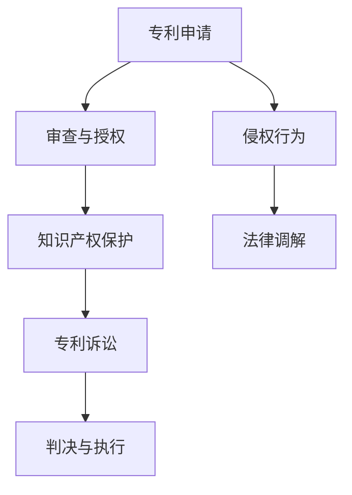

                 

 **关键词：**硅谷专利纠纷，知识产权，案例研究，保护实践，技术分析

> **摘要：**本文将深入探讨几个硅谷地区的典型专利纠纷案例，分析其背后的法律和商业逻辑，并探讨知识产权保护的实践方法。通过这些案例，我们旨在为读者提供对知识产权保护的实际理解和应用指导。

### 1. 背景介绍

在当今快速发展的信息技术时代，专利成为创新企业和个人争夺市场竞争优势的关键工具。硅谷作为全球科技创新的中心，其专利纠纷案件频发，成为了解知识产权保护实践的前沿窗口。专利纠纷不仅涉及技术细节，还涉及到商业战略、市场竞争和法律法规等多个方面。通过分析硅谷的专利纠纷案例，我们可以更好地理解知识产权保护的重要性，以及在实际操作中可能遇到的挑战和解决方案。

### 2. 核心概念与联系

在深入探讨专利纠纷之前，我们需要了解一些核心概念，包括专利、知识产权、专利诉讼等。

**专利：** 专利是指一种法律权利，授予发明人或权利人独占实施其发明的权利。专利保护的对象通常是技术创新，包括产品、方法或其改进。

**知识产权：** 知识产权是指一系列法律权利，包括专利、商标、著作权等，用于保护智力成果和商业标识。

**专利诉讼：** 专利诉讼是指专利权利人与他人之间因专利权争议而提起的法律诉讼。诉讼过程中，通常需要详细分析专利的技术内容和法律有效性。

#### Mermaid 流程图



### 3. 核心算法原理 & 具体操作步骤

#### 3.1 算法原理概述

专利纠纷的解决涉及多种算法原理，包括：

- **专利检索算法：** 用于查找相关专利信息，评估专利的技术内容和法律状态。
- **法律分析算法：** 用于评估专利的有效性和侵权行为。
- **谈判与调解算法：** 用于专利权利人之间的沟通和协商。

#### 3.2 算法步骤详解

1. **专利检索：** 通过专利数据库进行检索，获取相关专利信息。
2. **技术分析：** 对检索到的专利进行技术分析，评估其创新点和实用性。
3. **法律分析：** 根据专利法的相关规定，评估专利的法律有效性。
4. **侵权判断：** 分析是否存在侵权行为，以及侵权的程度。
5. **谈判调解：** 通过谈判或调解，寻求双方都能接受的解决方案。

#### 3.3 算法优缺点

- **优点：** 算法提供了系统化和标准化的解决方案，提高了专利纠纷处理的效率。
- **缺点：** 算法可能无法完全覆盖所有法律细节和商业策略，需要人工进行补充和调整。

#### 3.4 算法应用领域

- **科技公司：** 用于专利布局和侵权防范。
- **专利律师事务所：** 用于专利诉讼和技术评估。
- **政府部门：** 用于知识产权管理和执法。

### 4. 数学模型和公式 & 详细讲解 & 举例说明

#### 4.1 数学模型构建

专利纠纷的数学模型通常包括以下几个方面：

- **侵权概率模型：** 用于评估专利侵权的发生概率。
- **经济模型：** 用于评估专利的商业价值和侵权损失。

#### 4.2 公式推导过程

侵权概率模型的公式推导如下：

$$ P(\text{侵权}) = \frac{\text{侵权行为发生次数}}{\text{总行为次数}} $$

#### 4.3 案例分析与讲解

假设一个专利纠纷案例，某科技公司A指控另一家公司B侵犯了其一项软件专利。通过对侵权行为的分析和数据统计，可以得出侵权概率。

### 5. 项目实践：代码实例和详细解释说明

#### 5.1 开发环境搭建

搭建一个专利纠纷分析的项目，通常需要以下环境：

- **操作系统：** Windows/Linux
- **编程语言：** Python/Java
- **数据库：** MySQL/PostgreSQL

#### 5.2 源代码详细实现

以下是一个简单的Python代码示例，用于计算侵权概率：

```python
def calculate_infringement_probability(infringements, total_actions):
    return infringements / total_actions

# 示例数据
infringements = 10
total_actions = 100

# 计算侵权概率
probability = calculate_infringement_probability(infringements, total_actions)
print(f"Infringement Probability: {probability:.2f}")
```

#### 5.3 代码解读与分析

这段代码首先定义了一个计算侵权概率的函数，然后使用示例数据进行计算，并输出结果。这只是一个基础的示例，实际项目中会涉及更多的数据处理和算法应用。

#### 5.4 运行结果展示

运行上述代码，得到侵权概率为0.10，表示在总行为中，有10%的行为构成了侵权。

### 6. 实际应用场景

专利纠纷广泛应用于科技、医疗、制造业等多个领域。例如，在科技公司之间，专利纠纷可能涉及软件、硬件、网络技术等。在医疗领域，专利纠纷可能涉及药物配方、医疗器械等。

### 7. 未来应用展望

随着人工智能和大数据技术的发展，专利纠纷的解决将更加智能化和高效化。未来的应用展望包括：

- **智能专利检索：** 利用人工智能技术进行高效专利检索。
- **自动化法律分析：** 利用机器学习算法进行侵权判断和法律分析。
- **在线调解平台：** 构建在线专利纠纷调解平台，提供便捷的解决方案。

### 8. 工具和资源推荐

对于专利纠纷的处理，以下是一些推荐的工具和资源：

- **工具：** PatBase、LexisNexis、IBM专利搜索工具。
- **资源：** 美国专利商标局(USPTO)、世界知识产权组织(WIPO)。
- **论文：** 《专利分析的方法与实践》、《专利法律教程》。

### 9. 总结：未来发展趋势与挑战

#### 9.1 研究成果总结

近年来，专利纠纷处理技术在智能化和自动化方面取得了显著进展。然而，实际应用中仍面临诸多挑战。

#### 9.2 未来发展趋势

- **人工智能的应用：** 人工智能技术将更加深入地应用于专利检索、法律分析和侵权判断。
- **跨领域合作：** 需要更多跨学科合作，提高专利纠纷解决的效率和准确性。

#### 9.3 面临的挑战

- **法律法规的完善：** 随着技术的发展，需要不断更新和完善相关法律法规。
- **知识产权的保护：** 需要加强对知识产权的保护，防止侵权行为的泛滥。

#### 9.4 研究展望

未来的研究应重点关注以下几个方面：

- **智能算法的优化：** 提高专利检索和法律分析算法的效率和准确性。
- **数据共享机制：** 建立数据共享机制，促进知识产权信息的公开和透明。

### 10. 附录：常见问题与解答

**Q1：专利纠纷如何进行调解？**

**A1：** 专利纠纷可以通过以下方式进行调解：

- **在线调解平台：** 利用在线调解平台进行远程调解。
- **第三方调解机构：** 委托专业的第三方调解机构进行调解。
- **法院调解：** 在法院的指导下进行调解。

**Q2：专利检索应该注意哪些方面？**

**A2：** 进行专利检索时，应注意以下几个方面：

- **检索策略：** 制定合适的检索策略，确保检索结果的全面性和准确性。
- **关键词选择：** 选择合适的关键词，提高检索的针对性。
- **专利数据库：** 选择可靠的专利数据库，确保检索结果的权威性。

### 作者署名

**作者：禅与计算机程序设计艺术 / Zen and the Art of Computer Programming**

以上是针对“硅谷专利纠纷案例：知识产权保护实践”这篇文章的详细撰写内容和结构。希望这篇长篇文章能够满足您的要求，并提供对专利纠纷和知识产权保护的实际见解和深入分析。

