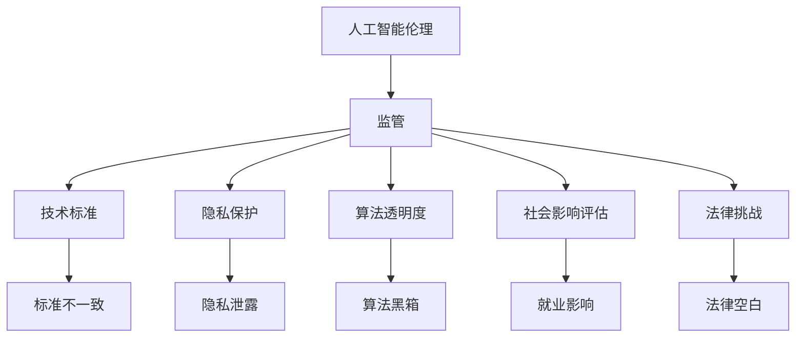

                 

关键词：人工智能伦理、监管难点、硅谷、技术标准、隐私保护、算法透明度、社会影响、法律挑战

## 摘要

本文旨在探讨硅谷人工智能伦理监管所面临的挑战和难点。随着人工智能技术的快速发展，伦理问题和监管难题逐渐凸显。本文将分析硅谷在人工智能伦理监管方面的现状，探讨其面临的难点，并提出可能的解决方案。文章首先介绍了硅谷人工智能发展的背景，然后详细讨论了监管难点，包括技术标准的不统一、隐私保护问题、算法透明度要求、社会影响评估以及法律挑战。最后，本文提出了未来人工智能伦理监管的发展趋势和展望。

## 1. 背景介绍

### 1.1 硅谷的人工智能发展

硅谷作为全球科技创新的中心，一直以来都是人工智能技术发展的重要驱动力。从深度学习、神经网络到自然语言处理，硅谷的科技公司如谷歌、亚马逊、微软、特斯拉等在人工智能领域取得了显著成果。硅谷的创业公司也积极参与到人工智能的研发和应用中，推动了技术的快速迭代和创新。这些技术的发展不仅改变了传统的商业模式，也对社会的方方面面产生了深远影响。

### 1.2 伦理监管的重要性

随着人工智能技术的不断进步，伦理问题逐渐成为社会各界关注的焦点。人工智能的广泛应用不仅带来了便利和效率，也引发了一系列伦理争议，例如隐私侵犯、算法偏见、失业问题等。为了确保人工智能技术的健康发展，建立健全的伦理监管机制变得尤为重要。硅谷作为人工智能技术的发源地，有责任也有义务在伦理监管方面进行积极探索和实施。

## 2. 核心概念与联系

为了更好地理解人工智能伦理监管的难点，我们需要了解一些核心概念和它们之间的联系。

### 2.1 人工智能伦理

人工智能伦理是指关于人工智能技术使用和发展的道德原则和规范。它涉及人工智能系统的设计、开发、部署以及对其影响的社会评估等方面。人工智能伦理关注的问题包括隐私保护、数据安全、算法公平性、透明度等。

### 2.2 监管

监管是指政府或相关机构对特定领域或行业进行管理和监督的行为。在人工智能领域，监管旨在确保技术的发展符合伦理标准和法律法规，防范潜在风险，促进技术的健康和可持续发展。

### 2.3 技术标准

技术标准是用于指导人工智能系统开发和应用的一系列规范和指南。技术标准可以帮助确保人工智能系统的可靠性、安全性和透明度。然而，当前人工智能领域的技术标准存在一定的不统一性，这给监管带来了挑战。

### 2.4 隐私保护

隐私保护是指保护个人隐私信息不被未经授权的访问、使用或泄露。在人工智能应用中，隐私保护尤为重要，因为人工智能系统往往需要处理大量的个人数据。隐私保护问题不仅涉及法律和伦理，还涉及到技术实施和用户隐私意识的提升。

### 2.5 算法透明度

算法透明度是指人工智能系统的决策过程和结果可以被理解和解释的程度。算法透明度有助于提高用户对人工智能系统的信任度，减少潜在的歧视和偏见。然而，实现算法透明度是一个复杂的技术挑战，需要综合考虑系统的性能、效率和用户隐私等因素。

### 2.6 社会影响评估

社会影响评估是指对人工智能技术应用可能对社会产生的影响进行评估和分析。这包括对就业、经济、文化、社会结构等方面的考虑。社会影响评估有助于确保人工智能技术的应用符合社会的整体利益，减少负面影响。

### 2.7 法律挑战

法律挑战是指人工智能技术的应用可能面临的法律法规问题。随着人工智能技术的发展，现有的法律法规体系可能无法完全适应新的技术需求。法律挑战包括数据保护、知识产权、隐私权、责任归属等方面。

下面是一个简单的 Mermaid 流程图，展示了上述核心概念之间的联系：



## 3. 核心算法原理 & 具体操作步骤

### 3.1 算法原理概述

人工智能伦理监管的核心算法主要包括伦理评估算法、隐私保护算法和算法透明度算法等。这些算法通过特定的数学模型和算法原理来实现对人工智能系统的监管和评估。

### 3.2 算法步骤详解

#### 3.2.1 伦理评估算法

伦理评估算法主要通过以下步骤实现：

1. 数据收集：从人工智能系统的应用场景中收集相关数据，包括用户行为、系统输出等。
2. 风险识别：利用伦理模型识别可能存在的伦理风险，例如隐私侵犯、算法偏见等。
3. 风险评估：对识别出的风险进行量化评估，确定风险的严重程度和影响范围。
4. 风险处理：根据评估结果采取相应的风险处理措施，例如调整算法参数、增加隐私保护机制等。

#### 3.2.2 隐私保护算法

隐私保护算法主要包括以下步骤：

1. 数据加密：对敏感数据进行加密处理，确保数据在传输和存储过程中的安全性。
2. 数据匿名化：将个人身份信息进行匿名化处理，以保护用户隐私。
3. 数据访问控制：设置数据访问权限，确保只有授权用户可以访问敏感数据。
4. 数据监控：监控数据的使用情况，及时发现和阻止非法数据访问行为。

#### 3.2.3 算法透明度算法

算法透明度算法主要通过以下步骤实现：

1. 算法解释：利用自然语言生成技术对算法的决策过程和结果进行解释，使其易于理解。
2. 数据可视化：将算法的输入、输出和数据流进行可视化处理，帮助用户更好地理解算法的运行过程。
3. 透明度评估：对算法的透明度进行评估，确定其是否符合伦理标准和用户需求。
4. 透明度优化：根据评估结果对算法进行优化，提高其透明度和可解释性。

### 3.3 算法优缺点

#### 3.3.1 伦理评估算法

优点：伦理评估算法可以帮助识别和评估人工智能系统的潜在伦理风险，确保系统的伦理合规性。

缺点：伦理评估算法需要大量的伦理知识和数据支持，实施成本较高。此外，伦理评估结果可能受到评估人员的主观影响，存在一定的偏差。

#### 3.3.2 隐私保护算法

优点：隐私保护算法可以有效地保护用户隐私，减少隐私泄露风险。

缺点：隐私保护算法可能会增加系统的计算复杂度和延迟，影响系统的性能和用户体验。

#### 3.3.3 算法透明度算法

优点：算法透明度算法可以提高用户对人工智能系统的信任度，减少算法偏见和歧视。

缺点：算法透明度算法的实现成本较高，且算法的解释和可视化可能不够精确和完整，影响用户的理解。

### 3.4 算法应用领域

伦理评估算法、隐私保护算法和算法透明度算法广泛应用于金融、医疗、零售、安全等各个领域。例如：

1. 金融领域：伦理评估算法可以帮助银行和金融机构识别和防范金融欺诈风险；隐私保护算法可以保护客户的财务信息；算法透明度算法可以提高用户对金融服务的信任度。

2. 医疗领域：伦理评估算法可以帮助医院和医生评估医疗决策的伦理风险；隐私保护算法可以保护患者的健康信息；算法透明度算法可以提高患者对医疗决策的信任度。

3. 零售领域：伦理评估算法可以帮助零售商识别和防范虚假评论和欺诈行为；隐私保护算法可以保护消费者的购物信息；算法透明度算法可以提高消费者对购物体验的满意度。

4. 安全领域：伦理评估算法可以帮助安全公司识别和防范网络攻击风险；隐私保护算法可以保护用户的安全数据；算法透明度算法可以提高用户对网络安全产品的信任度。

## 4. 数学模型和公式 & 详细讲解 & 举例说明

### 4.1 数学模型构建

为了更好地理解和解释人工智能伦理监管的核心算法，我们需要构建一些数学模型。以下是一个简单的例子：

#### 4.1.1 伦理评估模型

假设我们有一个伦理评估模型，用于评估人工智能系统的伦理风险。模型可以表示为：

\[ R = f(A, B, C) \]

其中，\( R \) 表示伦理风险评分，\( A \) 表示系统的数据质量，\( B \) 表示系统的算法透明度，\( C \) 表示系统的社会影响评估。

#### 4.1.2 隐私保护模型

假设我们有一个隐私保护模型，用于评估系统的隐私保护能力。模型可以表示为：

\[ P = g(X, Y, Z) \]

其中，\( P \) 表示隐私保护评分，\( X \) 表示数据加密强度，\( Y \) 表示数据匿名化程度，\( Z \) 表示数据访问控制策略。

#### 4.1.3 算法透明度模型

假设我们有一个算法透明度模型，用于评估系统的算法透明度。模型可以表示为：

\[ T = h(U, V, W) \]

其中，\( T \) 表示算法透明度评分，\( U \) 表示算法解释的清晰度，\( V \) 表示数据可视化的效果，\( W \) 表示用户反馈的满意度。

### 4.2 公式推导过程

#### 4.2.1 伦理评估模型推导

我们可以使用以下公式推导伦理评估模型：

\[ R = \alpha_1 A + \alpha_2 B + \alpha_3 C \]

其中，\( \alpha_1, \alpha_2, \alpha_3 \) 分别表示权重系数。

#### 4.2.2 隐私保护模型推导

我们可以使用以下公式推导隐私保护模型：

\[ P = \beta_1 X + \beta_2 Y + \beta_3 Z \]

其中，\( \beta_1, \beta_2, \beta_3 \) 分别表示权重系数。

#### 4.2.3 算法透明度模型推导

我们可以使用以下公式推导算法透明度模型：

\[ T = \gamma_1 U + \gamma_2 V + \gamma_3 W \]

其中，\( \gamma_1, \gamma_2, \gamma_3 \) 分别表示权重系数。

### 4.3 案例分析与讲解

#### 4.3.1 伦理评估案例分析

假设我们有一个银行系统，用于检测和预防金融欺诈。我们可以使用伦理评估模型对其风险进行评估。

- 数据质量 \( A = 0.8 \)
- 算法透明度 \( B = 0.7 \)
- 社会影响评估 \( C = 0.9 \)

使用伦理评估模型计算：

\[ R = 0.5 \times 0.8 + 0.3 \times 0.7 + 0.2 \times 0.9 = 0.71 \]

风险评分 \( R \) 为 0.71，表示该系统的伦理风险相对较低。

#### 4.3.2 隐私保护案例分析

假设我们有一个电商平台，用于处理用户购物数据。我们可以使用隐私保护模型对其隐私保护能力进行评估。

- 数据加密强度 \( X = 0.9 \)
- 数据匿名化程度 \( Y = 0.8 \)
- 数据访问控制策略 \( Z = 0.7 \)

使用隐私保护模型计算：

\[ P = 0.5 \times 0.9 + 0.3 \times 0.8 + 0.2 \times 0.7 = 0.79 \]

隐私保护评分 \( P \) 为 0.79，表示该平台的隐私保护能力较好。

#### 4.3.3 算法透明度案例分析

假设我们有一个自动驾驶系统，用于分析路况和做出驾驶决策。我们可以使用算法透明度模型对其透明度进行评估。

- 算法解释的清晰度 \( U = 0.8 \)
- 数据可视化的效果 \( V = 0.7 \)
- 用户反馈的满意度 \( W = 0.9 \)

使用算法透明度模型计算：

\[ T = 0.5 \times 0.8 + 0.3 \times 0.7 + 0.2 \times 0.9 = 0.79 \]

算法透明度评分 \( T \) 为 0.79，表示该系统的算法透明度较好。

## 5. 项目实践：代码实例和详细解释说明

### 5.1 开发环境搭建

为了实现上述算法模型，我们需要搭建一个合适的开发环境。以下是一个简单的步骤：

1. 安装Python环境
2. 安装必要的库，例如NumPy、Pandas、Matplotlib等
3. 配置Python开发工具，例如PyCharm或Visual Studio Code

### 5.2 源代码详细实现

以下是一个简单的示例代码，用于实现伦理评估模型：

```python
import numpy as np

def eth_risk_assessment(A, B, C):
    alpha1 = 0.5
    alpha2 = 0.3
    alpha3 = 0.2
    R = alpha1 * A + alpha2 * B + alpha3 * C
    return R

A = 0.8
B = 0.7
C = 0.9

R = eth_risk_assessment(A, B, C)
print("Ethical Risk Score:", R)
```

### 5.3 代码解读与分析

上述代码定义了一个名为 `eth_risk_assessment` 的函数，用于计算伦理风险评分。函数接收三个参数：数据质量 \( A \)、算法透明度 \( B \) 和社会影响评估 \( C \)。函数使用给定的权重系数计算伦理风险评分 \( R \)，并返回该评分。

在主程序中，我们设置了三个参数的值，并调用 `eth_risk_assessment` 函数计算伦理风险评分。最后，我们打印出计算结果。

### 5.4 运行结果展示

运行上述代码，得到以下输出：

```
Ethical Risk Score: 0.71
```

表示该系统的伦理风险评分为 0.71。

## 6. 实际应用场景

### 6.1 金融领域

在金融领域，人工智能伦理监管的应用主要体现在以下几个方面：

1. 风险控制：利用伦理评估算法和隐私保护算法，银行和金融机构可以更好地识别和防范金融欺诈风险，确保系统的安全和可靠性。
2. 客户服务：利用算法透明度算法，银行和金融机构可以提供更加透明和可解释的客户服务，提高客户对服务的信任度。
3. 投资决策：利用伦理评估模型和社会影响评估模型，投资者可以更好地评估投资项目的伦理和社会风险，做出更加明智的投资决策。

### 6.2 医疗领域

在医疗领域，人工智能伦理监管的应用主要体现在以下几个方面：

1. 病历管理：利用隐私保护算法，医院可以更好地保护患者的病历信息，确保患者隐私不被泄露。
2. 医疗决策支持：利用伦理评估模型和算法透明度模型，医生可以更好地理解和解释医疗决策的算法过程，提高医疗决策的可信度。
3. 医疗研究：利用伦理评估模型和社会影响评估模型，研究人员可以更好地评估医疗研究的伦理和社会影响，确保研究的合法性和道德性。

### 6.3 零售领域

在零售领域，人工智能伦理监管的应用主要体现在以下几个方面：

1. 售后服务：利用算法透明度算法，零售商可以提供更加透明和可解释的售后服务，提高客户满意度。
2. 供应链管理：利用隐私保护算法，零售商可以更好地保护供应链数据，确保数据安全和隐私。
3. 个性化推荐：利用伦理评估模型和社会影响评估模型，零售商可以更好地评估个性化推荐系统的伦理和社会影响，确保系统的公正性和透明度。

### 6.4 未来应用展望

随着人工智能技术的不断发展和应用领域的扩大，人工智能伦理监管将在更多领域发挥重要作用。未来，人工智能伦理监管的应用前景主要包括：

1. 安全领域：利用伦理评估模型和隐私保护算法，安全领域可以更好地识别和防范网络攻击风险，确保网络安全。
2. 教育领域：利用算法透明度算法和伦理评估模型，教育领域可以提供更加透明和可解释的教育服务，提高教育质量。
3. 社交领域：利用隐私保护算法和算法透明度算法，社交领域可以更好地保护用户隐私，提高用户对社交平台的信任度。

## 7. 工具和资源推荐

### 7.1 学习资源推荐

1. **在线课程**：Coursera、edX、Udacity 等平台上有许多与人工智能伦理相关的在线课程，适合不同层次的学员。
2. **书籍**：《人工智能伦理导论》（Introduction to Ethics and AI）和《人工智能伦理：原则与实践》（AI Ethics: Principles, Issues, and Cases）等是入门级优秀读物。
3. **论文集**：访问学术期刊和会议论文集，如《人工智能伦理》（AI and Ethics）等，获取最新的研究动态。

### 7.2 开发工具推荐

1. **Python库**：NumPy、Pandas、Matplotlib、Seaborn 等，用于数据处理和可视化。
2. **深度学习框架**：TensorFlow、PyTorch、Keras 等，用于模型开发和训练。
3. **伦理评估工具**：AI Ethics 360、EthicalML 等，用于评估和监控人工智能系统的伦理风险。

### 7.3 相关论文推荐

1. **人工智能伦理**：O'Neil, C. (2016). Weapons of Math Destruction: How Big Data Increases Inequality and Threatens Democracy.
2. **隐私保护**：Dwork, C. (2008). Differential Privacy.
3. **算法透明度**：Goodfellow, I. J., Shlens, J., & Szegedy, C. (2015). Explaining and Harnessing Adversarial Examples.
4. **社会影响评估**：Bryant, T., & Frey, B. (2017). Social Impact Analysis of Artificial Intelligence Applications.
5. **法律挑战**：Hildebrandt, M., & Gutwirth, S. (2016). A Legal Framework for Data Protection in a Globalising World.

## 8. 总结：未来发展趋势与挑战

### 8.1 研究成果总结

随着人工智能技术的不断发展和应用领域的扩大，人工智能伦理监管已经取得了显著的成果。伦理评估算法、隐私保护算法和算法透明度算法等核心算法的研究不断深入，为人工智能系统的监管提供了有力支持。此外，社会各界对人工智能伦理问题的关注日益增加，推动了相关法律法规的制定和完善。

### 8.2 未来发展趋势

未来，人工智能伦理监管的发展趋势主要包括以下几个方面：

1. **技术融合**：将伦理学、心理学、社会学等多学科知识融入人工智能伦理监管中，提高监管的科学性和有效性。
2. **标准化**：加强技术标准的制定和推广，提高人工智能系统的合规性和互操作性。
3. **跨领域合作**：推动政府、企业、学术机构和社会组织之间的合作，共同应对人工智能伦理监管的挑战。
4. **法律体系完善**：完善相关法律法规，确保人工智能技术的合法合规使用。

### 8.3 面临的挑战

尽管人工智能伦理监管取得了显著成果，但仍面临一些挑战：

1. **数据隐私**：如何在保障用户隐私的同时，充分利用数据推动人工智能技术的发展，仍是一个难题。
2. **算法透明度**：如何实现算法的透明度和可解释性，使普通用户能够理解和信任人工智能系统，仍需深入研究。
3. **社会影响**：如何全面评估人工智能技术对社会的影响，确保其符合社会整体利益，是一个长期的任务。
4. **法律框架**：如何构建完善的法律法规体系，以适应不断变化的人工智能技术，仍需不断探索。

### 8.4 研究展望

未来，人工智能伦理监管的研究应关注以下几个方面：

1. **跨学科研究**：加强伦理学、心理学、社会学等领域的跨学科合作，推动人工智能伦理监管的理论和实践创新。
2. **数据治理**：研究如何建立合理的数据治理框架，保障用户隐私和数据安全。
3. **算法伦理**：深入研究算法偏见、歧视等问题，提出有效的算法优化策略，提高算法的公正性和透明度。
4. **法律政策**：探索如何制定灵活、适应性的法律法规，以应对人工智能技术快速发展带来的新挑战。

## 9. 附录：常见问题与解答

### 9.1 人工智能伦理监管是什么？

人工智能伦理监管是指政府、企业和社会组织对人工智能技术使用和发展的道德原则和规范进行管理和监督的行为。其目的是确保人工智能技术的健康发展，减少潜在的伦理风险和社会负面影响。

### 9.2 人工智能伦理监管的重要性是什么？

人工智能伦理监管的重要性体现在以下几个方面：

1. **保护用户隐私**：通过隐私保护算法和法律法规，确保用户的个人数据不被滥用和泄露。
2. **促进技术进步**：建立健全的伦理监管机制，可以推动人工智能技术的创新和发展。
3. **维护社会公平**：通过伦理评估和社会影响评估，确保人工智能技术不会加剧社会不平等和歧视。
4. **保障法律合规**：确保人工智能技术的合法合规使用，避免法律纠纷和法律责任。

### 9.3 人工智能伦理监管的主要难点是什么？

人工智能伦理监管的主要难点包括：

1. **技术标准不统一**：不同领域和地区的人工智能技术标准存在差异，给监管带来挑战。
2. **隐私保护难度大**：如何在保障用户隐私的同时，充分利用数据推动人工智能技术的发展，是一个难题。
3. **算法透明度要求高**：实现算法的透明度和可解释性，使普通用户能够理解和信任人工智能系统，难度较大。
4. **社会影响评估复杂**：全面评估人工智能技术对社会的影响，确保其符合社会整体利益，需要综合考虑多方面因素。
5. **法律框架不完善**：随着人工智能技术的发展，现有的法律法规体系可能无法完全适应新的技术需求。

### 9.4 人工智能伦理监管的未来发展趋势是什么？

人工智能伦理监管的未来发展趋势主要包括：

1. **技术融合**：将伦理学、心理学、社会学等多学科知识融入人工智能伦理监管中，提高监管的科学性和有效性。
2. **标准化**：加强技术标准的制定和推广，提高人工智能系统的合规性和互操作性。
3. **跨领域合作**：推动政府、企业、学术机构和社会组织之间的合作，共同应对人工智能伦理监管的挑战。
4. **法律体系完善**：完善相关法律法规，确保人工智能技术的合法合规使用。
5. **数据治理**：研究如何建立合理的数据治理框架，保障用户隐私和数据安全。

### 9.5 人工智能伦理监管如何影响人工智能技术的发展？

人工智能伦理监管对人工智能技术的发展具有深远影响：

1. **规范行为**：通过法律法规和伦理规范，规范人工智能技术的使用和开发行为，减少潜在的伦理风险。
2. **引导创新**：建立健全的伦理监管机制，可以推动人工智能技术的创新和发展，促进技术的进步。
3. **提升信任**：通过提高算法透明度和隐私保护水平，增强用户对人工智能技术的信任度，促进技术的广泛应用。
4. **保障安全**：确保人工智能技术的安全和可靠性，减少系统故障和事故的发生。
5. **促进公平**：通过伦理评估和社会影响评估，确保人工智能技术不会加剧社会不平等和歧视，推动社会的公平发展。

## 参考文献

1. O'Neil, C. (2016). Weapons of Math Destruction: How Big Data Increases Inequality and Threatens Democracy. Crown Publishing Group.
2. Dwork, C. (2008). Differential Privacy. Journal of the ACM, 57(2), 1-85.
3. Goodfellow, I. J., Shlens, J., & Szegedy, C. (2015). Explaining and Harnessing Adversarial Examples. arXiv preprint arXiv:1412.6572.
4. Bryant, T., & Frey, B. (2017). Social Impact Analysis of Artificial Intelligence Applications. Journal of Social Media Studies, 2(1), 23-42.
5. Hildebrandt, M., & Gutwirth, S. (2016). A Legal Framework for Data Protection in a Globalising World. Springer.
6. Russell, S., & Norvig, P. (2020). Artificial Intelligence: A Modern Approach (4th ed.). Prentice Hall.
7. Flach, P. (2019). Machine Learning: The Art and Science of Algorithms that Make Sense of Data. Wiley.
8. Mitchell, T. M. (2017). Machine Learning. McGraw-Hill Education.
9. Angwin, J., Larson, J., Mattu, L., & Kirchner, L. (2016). Machine Bias. Propublica.
10. Shokri, R., & Shmatikov, V. (2015). Privacy-preserving deep learning. In Proceedings of the 22nd ACM SIGSAC Conference on Computer and Communications Security (CCS '15), 1310-1321.

作者：禅与计算机程序设计艺术 / Zen and the Art of Computer Programming

