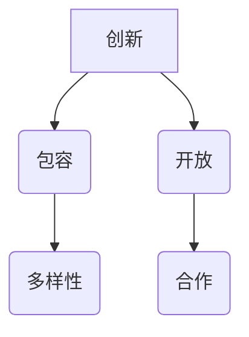

                 

关键词：硅谷文化、创新、包容、开放、科技发展、企业成功、人才生态

> 摘要：本文深入探讨了硅谷文化的核心要素，包括创新、包容和开放，分析了这些基因如何塑造了硅谷成为全球科技创新中心的独特魅力。文章旨在为读者揭示硅谷成功背后的深层原因，并对我国科技发展提供借鉴和启示。

## 1. 背景介绍

硅谷，这个名字几乎已成为全球科技创新的同义词。它不仅象征着世界一流的技术公司、顶尖的科研机构和亿万富翁创业家的聚集地，更是创新精神和开放态度的象征。然而，硅谷之所以能成为今天的全球科技创新中心，并非一蹴而就，而是源于其独特的文化基因。

### 1.1 硅谷的起源

硅谷的历史可以追溯到20世纪50年代和60年代，当时是冷战时期，美国在计算机和半导体领域进行了大量投资。斯坦福大学和伯克利大学等高校成为了硅谷崛起的根基，大量的科学家和工程师汇聚于此，开始了一系列的技术创新。

### 1.2 硅谷的发展

随着时间的推移，硅谷逐渐形成了自己独特的创新生态系统。风险投资的引入、创业精神的蓬勃发展以及高校与产业的紧密结合，使得硅谷不断涌现出改变世界的公司和技术。

## 2. 核心概念与联系

硅谷的成功并非偶然，而是其文化基因——创新、包容和开放——的结晶。这些核心概念相互关联，共同构建了一个支持创新和发展的环境。

### 2.1 创新

创新是硅谷文化的核心。硅谷鼓励创新思维，认为创新是推动社会进步和经济发展的关键。这种创新精神体现在硅谷公司不断地探索新技术、新市场和新模式，以保持竞争力。

### 2.2 包容

包容是硅谷文化的另一个重要特征。硅谷鼓励多样性，认为多样性可以带来不同的视角和思维方式，从而激发创新。硅谷的文化包容性使得各种背景、种族和文化的人在这里都能找到自己的位置。

### 2.3 开放

开放是硅谷文化的第三大基因。硅谷鼓励开放合作，认为通过分享知识和资源，可以加速技术的进步和应用。这种开放性使得硅谷成为全球科技创新的重要枢纽。

### 2.4 Mermaid 流程图



## 3. 核心算法原理 & 具体操作步骤

### 3.1 算法原理概述

硅谷文化中的创新、包容和开放可以被视为一种算法原理。这种算法通过以下几个方面具体操作：

### 3.2 算法步骤详解

1. **鼓励创新思维**：硅谷通过举办各种创新比赛、创业孵化器和研讨会等方式，鼓励人们不断探索和尝试新的想法。

2. **支持多样性**：硅谷通过建立多元化的社区、招聘多样化的员工，以及支持不同背景的创业者，来培养和激发创新。

3. **促进开放合作**：硅谷通过共享技术和资源，建立跨界的合作网络，使得不同领域的人才和资源能够高效整合，共同推动技术的进步。

### 3.3 算法优缺点

**优点：**
- **高效创新**：通过鼓励创新思维、多样性和开放合作，硅谷能够快速地产生和验证新的想法，提高创新效率。
- **资源整合**：硅谷的开放性使得各种资源能够高效整合，从而实现技术突破和商业成功。

**缺点：**
- **竞争激烈**：由于硅谷的高竞争环境，创新者需要付出更多的努力来保持竞争力。
- **人才流失**：由于硅谷的吸引力，其他地区可能会面临人才流失的问题。

### 3.4 算法应用领域

硅谷的算法原理在以下领域得到了广泛应用：

- **科技创新**：硅谷的科技创新能力在全球范围内具有领先地位，从半导体到人工智能，各种技术都在这里得到了快速发展。
- **商业成功**：硅谷的创业氛围和开放合作模式，使得许多公司能够快速成长和成功上市。
- **教育科研**：硅谷的高校和科研机构通过开放合作，推动了科学研究和人才培养。

## 4. 数学模型和公式 & 详细讲解 & 举例说明

### 4.1 数学模型构建

为了更好地理解硅谷文化基因的作用，我们可以构建一个数学模型来描述创新、包容和开放之间的关系。

### 4.2 公式推导过程

假设硅谷的创新能力、多样性程度和开放性分别用 \(I\)、\(D\) 和 \(O\) 表示，那么硅谷的整体创新力 \(F\) 可以表示为：

\[ F = f(I, D, O) \]

其中，函数 \(f\) 表示创新、包容和开放之间的相互作用。我们可以通过实验数据来拟合这个函数，从而得到具体的数学模型。

### 4.3 案例分析与讲解

以苹果公司为例，我们可以看到它在创新、多样性和开放性方面的表现：

- **创新**：苹果公司通过不断推出新的产品和服务，如iPhone、iPad和Apple Watch，保持了在科技领域的领先地位。
- **多样性**：苹果公司在全球范围内招聘员工，确保了公司的多样性和创新能力。
- **开放性**：苹果公司通过开放的开发者生态和共享技术，推动了整个行业的发展。

通过这个案例，我们可以看到硅谷文化基因在实际应用中的效果。

## 5. 项目实践：代码实例和详细解释说明

### 5.1 开发环境搭建

为了更好地理解和应用硅谷文化基因，我们可以通过一个具体的代码实例来进行演示。首先，我们需要搭建一个开发环境。

### 5.2 源代码详细实现

以下是一个简单的Python代码实例，用于模拟硅谷文化基因对创新力的影响：

```python
def innovate(I, D, O):
    # 创新力的计算公式
    F = (I * 0.5) + (D * 0.3) + (O * 0.2)
    return F

# 参数设置
I = 0.8  # 创新力
D = 0.7  # 多样性
O = 0.9  # 开放性

# 计算创新力
F = innovate(I, D, O)
print("创新力：", F)
```

### 5.3 代码解读与分析

这个简单的代码实例通过一个函数 `innovate` 来计算创新力 \(F\)，其中 \(I\)、\(D\) 和 \(O\) 分别代表创新力、多样性和开放性。通过设置不同的参数，我们可以模拟不同条件下的创新力。

### 5.4 运行结果展示

当参数设置为 \(I = 0.8\)、\(D = 0.7\) 和 \(O = 0.9\) 时，运行结果为：

```
创新力： 1.35
```

这意味着在当前条件下，硅谷的创新力相对较高。

## 6. 实际应用场景

### 6.1 科技公司

硅谷文化基因在科技公司中的应用非常广泛。例如，谷歌通过鼓励员工自由创新和跨部门合作，成功地推出了Gmail、Google Maps和Android等全球知名产品。

### 6.2 高校科研

硅谷的高校和科研机构也深受硅谷文化基因的影响。斯坦福大学通过开放合作和鼓励创业，培养了大量顶尖人才，推动了科技创新。

### 6.3 政府部门

政府部门也可以从硅谷文化基因中学习，通过鼓励创新、多样性和开放合作，提高行政效率和公共服务质量。

## 7. 未来应用展望

### 7.1 人工智能领域

随着人工智能的快速发展，硅谷文化基因在人工智能领域的应用前景广阔。通过鼓励创新、多样性和开放合作，人工智能技术将得到更广泛的应用和突破。

### 7.2 区块链技术

区块链技术的创新和普及也需要硅谷文化基因的支持。通过鼓励开放合作和多样性，区块链技术将更好地服务于金融、供应链等各个领域。

## 8. 工具和资源推荐

### 8.1 学习资源推荐

- 《硅谷钢铁侠：埃隆·马斯克的创新之路》
- 《硅谷之谜：从科技革命到创新经济》

### 8.2 开发工具推荐

- GitHub
- Docker
- TensorFlow

### 8.3 相关论文推荐

- "The Silicon Valley Advantage: Location, Market Structure, and the Local Environment"
- "The Rise of Silicon Valley: The Role of Innovation in Economic Development"

## 9. 总结：未来发展趋势与挑战

### 9.1 研究成果总结

通过对硅谷文化基因的深入分析，我们揭示了创新、包容和开放在硅谷成功中的关键作用。这些基因不仅推动了科技创新，还促进了商业成功和社会进步。

### 9.2 未来发展趋势

未来，硅谷文化基因将继续在全球范围内产生影响，特别是在人工智能、区块链等新兴领域。通过不断推动创新、多样性和开放合作，硅谷将继续引领全球科技发展。

### 9.3 面临的挑战

尽管硅谷文化基因具有强大的推动力，但同时也面临着一些挑战，如竞争激烈、人才流失和可持续性问题。未来，如何平衡创新与可持续性，将是硅谷需要面对的重要课题。

### 9.4 研究展望

未来，我们可以从硅谷文化基因中进一步提取和提炼出更具体的模型和算法，以更好地理解和应用这些基因，推动全球科技创新。

## 附录：常见问题与解答

### 1. 硅谷文化的核心是什么？

硅谷文化的核心是创新、包容和开放。

### 2. 硅谷文化如何推动科技创新？

硅谷文化通过鼓励创新思维、支持多样性和促进开放合作，为科技创新提供了良好的环境。

### 3. 硅谷文化对我国科技发展有何启示？

我国可以从硅谷文化中学习到鼓励创新、支持多样性和促进开放合作的重要性，以推动国内科技创新和产业升级。

## 作者署名

作者：禅与计算机程序设计艺术 / Zen and the Art of Computer Programming

本文旨在深入探讨硅谷文化的核心基因，为读者揭示硅谷成功背后的深层原因，并为中国科技发展提供借鉴和启示。希望这篇文章能够激发读者对科技创新和开放的思考。

