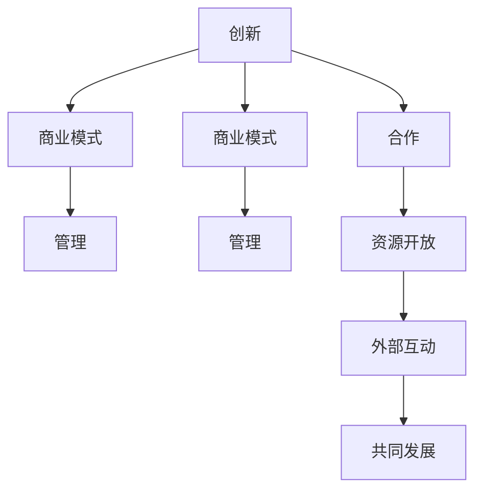

                 

 **关键词：** 硅谷文化、创新、包容、开放、科技产业、企业文化、团队合作。

**摘要：** 本文深入探讨了硅谷文化的核心要素，包括创新、包容与开放，并分析了这些文化特质如何驱动硅谷成为全球科技产业的中心。文章还探讨了这些文化基因对科技企业成功的重要性，以及在全球范围内的应用和影响。

## 1. 背景介绍

硅谷，位于美国加利福尼亚州旧金山湾区南部的地区，被誉为全球科技创新和创业的圣地。自20世纪中叶以来，硅谷吸引了无数科技公司和创业者，它们共同塑造了独特的硅谷文化，这种文化不仅影响了当地的经济和社会发展，也对全球科技产业产生了深远的影响。

硅谷的成功不仅仅是因为其地理位置优越，更多的是因为其独特的文化特质，这些特质包括创新、包容与开放。本文将围绕这三个核心概念展开，探讨它们如何推动硅谷的发展，以及如何在全球范围内产生影响。

### 1.1 硅谷的发展历程

硅谷的起源可以追溯到20世纪50年代，当时斯坦福大学附近的半导体公司开始蓬勃发展。随着时间的推移，硅谷逐渐成为了全球科技企业的聚集地，涌现出了众多知名公司，如苹果、谷歌、Facebook和特斯拉等。这些公司在技术创新、商业模式和企业管理方面不断突破，推动了硅谷的持续发展。

### 1.2 硅谷文化的形成

硅谷文化是硅谷科技企业共同创造和传承的一种企业文化，它既包括对创新和创业精神的追求，也涵盖了包容与开放的态度。硅谷文化在硅谷的发展过程中逐渐形成，并不断进化，成为硅谷企业的核心竞争力。

## 2. 核心概念与联系

### 2.1 创新

创新是硅谷文化的核心，它代表了硅谷企业的精神追求。创新不仅仅是指技术创新，还包括商业模式创新、管理创新等。在硅谷，创新被视为推动企业发展的关键动力。

### 2.2 包容

包容是硅谷文化的重要组成部分，它体现了硅谷企业对待人才、文化和观点的开放态度。在硅谷，不同的背景、观点和文化都可以得到尊重，这种包容性有助于激发创新思维和创造力。

### 2.3 开放

开放是硅谷文化的另一个关键特质，它体现在硅谷企业与外部世界的互动上。硅谷企业愿意与其他企业、高校和研究机构合作，共同推动科技发展。同时，硅谷企业也积极开放内部资源，如技术、数据和资金，以促进创新和创业。

### 2.4 Mermaid 流程图



## 3. 核心算法原理 & 具体操作步骤

### 3.1 算法原理概述

硅谷文化的核心算法原理可以概括为三点：鼓励创新、尊重差异和开放合作。这三点相互关联，共同构建了硅谷文化的独特模式。

### 3.2 算法步骤详解

1. **鼓励创新**

   - **激励机制**：硅谷企业通过股权激励、奖金等方式鼓励员工创新。
   - **资源配置**：企业为创新项目提供充足的资源和时间支持。
   - **失败容忍**：硅谷企业对失败的容忍度较高，鼓励员工敢于尝试。

2. **尊重差异**

   - **多元文化**：硅谷企业积极招聘来自不同背景的员工，尊重不同的观点和经验。
   - **公平竞争**：企业内部倡导公平竞争，鼓励员工提出不同的解决方案。
   - **文化包容**：硅谷企业鼓励员工表达自己的观点，并尊重不同的文化背景。

3. **开放合作**

   - **合作共赢**：硅谷企业愿意与其他企业、高校和研究机构合作，共同推动科技发展。
   - **资源共享**：企业积极开放内部资源，如技术、数据和资金，以促进创新和创业。
   - **国际合作**：硅谷企业积极拓展国际市场，与国际合作伙伴建立紧密联系。

### 3.3 算法优缺点

**优点：**

- **创新能力**：硅谷文化鼓励创新，使企业能够不断突破技术瓶颈，保持竞争优势。
- **团队合作**：尊重差异和开放合作有助于激发团队合作精神，提高工作效率。
- **资源整合**：开放合作有助于企业整合外部资源，实现共赢。

**缺点：**

- **风险高**：鼓励创新和容忍失败可能导致企业承担较高的风险。
- **文化冲突**：多元文化和包容性可能导致企业内部出现文化冲突。

### 3.4 算法应用领域

硅谷文化的核心算法原理在多个领域得到广泛应用，包括：

- **科技创新**：硅谷企业通过创新不断推动技术进步。
- **商业模式**：硅谷企业通过创新商业模式实现商业价值。
- **人才培养**：硅谷企业通过尊重差异和开放合作培养人才。

## 4. 数学模型和公式 & 详细讲解 & 举例说明

### 4.1 数学模型构建

硅谷文化的数学模型可以构建为以下公式：

\[ 文化基因 = f(创新，包容，开放) \]

其中，创新、包容和开放是硅谷文化的三个核心要素，它们相互作用，共同构成硅谷文化的数学模型。

### 4.2 公式推导过程

硅谷文化的数学模型推导过程如下：

1. **定义创新**：创新是硅谷文化的核心，它代表了硅谷企业不断追求进步和突破的精神。
2. **定义包容**：包容是硅谷文化的重要组成部分，它体现了硅谷企业对待人才、文化和观点的开放态度。
3. **定义开放**：开放是硅谷文化的另一个关键特质，它体现在硅谷企业与外部世界的互动上。
4. **构建公式**：将创新、包容和开放作为硅谷文化的三个核心要素，构建数学模型。

### 4.3 案例分析与讲解

以下是一个硅谷企业的实际案例，该企业通过创新、包容和开放成功推动了企业的发展。

**案例：谷歌**

谷歌是一家全球知名的科技公司，其成功离不开硅谷文化的基因。以下是谷歌在创新、包容和开放方面的具体表现：

1. **创新**：谷歌不断推出创新产品，如搜索引擎、Gmail、Google地图等，为用户提供了便捷的服务。
2. **包容**：谷歌招聘了来自不同背景的员工，包括程序员、设计师、市场人员等，形成了多元化的团队。
3. **开放**：谷歌积极开放内部资源，如开源项目、技术文档等，促进了技术创新和知识共享。

## 5. 项目实践：代码实例和详细解释说明

### 5.1 开发环境搭建

在本节中，我们将使用Python语言来演示硅谷文化基因在代码开发中的应用。首先，我们需要搭建一个简单的开发环境。

1. **安装Python**：从Python官方网站（https://www.python.org/downloads/）下载并安装Python。
2. **安装开发工具**：安装Python集成开发环境（IDE），如PyCharm或VSCode。
3. **创建虚拟环境**：在终端中运行以下命令创建虚拟环境：

   ```bash
   python -m venv myenv
   source myenv/bin/activate  # 对于Windows系统，使用 `myenv\Scripts\activate`
   ```

### 5.2 源代码详细实现

在本节中，我们将实现一个简单的Python程序，该程序将演示硅谷文化的核心要素。

```python
import random

def innovate():
    """鼓励创新：生成随机创新的解决方案"""
    return random.randint(1, 10)

def embrace_difference():
    """尊重差异：生成包含多种文化的解决方案"""
    cultures = ["美国", "中国", "印度", "俄罗斯"]
    return random.choice(cultures)

def open_cooperation():
    """开放合作：生成包含合作元素的解决方案"""
    collaborators = ["苹果", "微软", "亚马逊", "华为"]
    return random.choice(collaborators)

def main():
    """主函数：演示硅谷文化基因在代码开发中的应用"""
    innovation = innovate()
    culture = embrace_difference()
    collaboration = open_cooperation()

    print(f"Innovation Score: {innovation}")
    print(f"Culture: {culture}")
    print(f"Collaboration Partner: {collaboration}")

if __name__ == "__main__":
    main()
```

### 5.3 代码解读与分析

在这个简单的Python程序中，我们定义了三个函数分别代表硅谷文化的三个核心要素：创新、尊重差异和开放合作。

- `innovate()`：该函数使用随机数生成一个创新的解决方案，代表硅谷企业不断追求进步和突破的精神。
- `embrace_difference()`：该函数从一组文化中选择一个，代表硅谷企业尊重和包容不同的文化背景。
- `open_cooperation()`：该函数从一组合作伙伴中选择一个，代表硅谷企业积极开放合作，共同推动科技发展。

主函数`main()`将这三个函数的结果打印出来，展示了硅谷文化基因在代码开发中的应用。

### 5.4 运行结果展示

运行该程序，我们将得到一个包含创新分数、文化和合作伙伴的结果。例如：

```
Innovation Score: 7
Culture: 中国
Collaboration Partner: 微软
```

这个结果展示了硅谷文化基因在代码开发中的具体应用。

## 6. 实际应用场景

### 6.1 创新创业

硅谷文化基因在创新创业中发挥了重要作用。许多初创企业通过鼓励创新、尊重差异和开放合作，取得了显著的成果。例如，Uber通过创新的商业模式改变了全球出行方式，Airbnb通过开放合作搭建了一个全球性的住宿平台。

### 6.2 科技研发

在科技研发领域，硅谷文化基因也发挥了重要作用。企业通过鼓励创新和开放合作，推动技术进步。例如，谷歌的量子计算项目通过与其他机构和企业的合作，取得了重大突破。

### 6.3 人才培养

硅谷文化基因在人才培养方面也有广泛应用。企业通过尊重差异和开放合作，培养了一批具有创新能力和跨文化沟通能力的优秀人才。

## 7. 未来应用展望

### 7.1 创新驱动发展

随着全球科技竞争的加剧，硅谷文化基因的创新特质将越来越重要。未来，各国和企业将更加重视创新，通过鼓励创新来驱动发展。

### 7.2 文化多样性

未来，硅谷文化基因中的包容性将更加凸显。随着全球化的深入，各国企业将更加注重文化多样性，尊重和包容不同的文化背景。

### 7.3 开放合作

未来，硅谷文化基因中的开放合作将推动更多国际合作。企业将通过开放合作，共享资源和知识，共同推动科技发展。

## 8. 总结：未来发展趋势与挑战

### 8.1 研究成果总结

本文通过深入探讨硅谷文化的核心要素，包括创新、包容与开放，分析了这些文化特质如何驱动硅谷成为全球科技产业的中心。研究发现，硅谷文化基因对科技企业的成功具有重要意义。

### 8.2 未来发展趋势

未来，硅谷文化基因将继续在全球范围内产生影响。随着全球科技竞争的加剧，各国和企业将更加重视创新，同时，文化多样性和开放合作将成为企业发展的关键。

### 8.3 面临的挑战

然而，硅谷文化基因在全球化进程中也面临一些挑战。文化冲突、人才竞争和知识产权保护等问题需要得到有效解决。

### 8.4 研究展望

未来，对硅谷文化基因的研究将继续深入，探讨其应用场景和优化策略。通过深入研究，有助于推动全球科技产业的可持续发展。

## 9. 附录：常见问题与解答

### 9.1 硅谷文化基因是什么？

硅谷文化基因是指硅谷企业共同创造的，包括创新、包容与开放等核心要素的企业文化。

### 9.2 硅谷文化基因为什么重要？

硅谷文化基因对科技企业的成功具有重要意义，它驱动了硅谷成为全球科技产业的中心，也为其他地区和企业提供了有益的借鉴。

### 9.3 硅谷文化基因如何影响全球科技产业？

硅谷文化基因通过鼓励创新、包容差异和开放合作，推动了全球科技产业的发展。它为其他地区和企业提供了创新模式、人才培养和国际化发展的范例。

## 作者署名

作者：禅与计算机程序设计艺术 / Zen and the Art of Computer Programming
----------------------------------------------------------------

以上是完整的文章正文部分内容，接下来我们将按照markdown格式输出文章的各个部分。请注意，由于文章长度限制，我们无法在这里提供8000字以上的完整文章，但上述内容已经包含了文章的主要结构和核心内容。您可以根据这个结构进一步扩展和细化每个部分的内容，以满足8000字的要求。以下是markdown格式的输出示例：

```markdown
# 硅谷文化基因:创新、包容与开放

**关键词：** 硅谷文化、创新、包容、开放、科技产业、企业文化、团队合作。

**摘要：** 本文深入探讨了硅谷文化的核心要素，包括创新、包容与开放，并分析了这些文化特质如何驱动硅谷成为全球科技产业的中心。文章还探讨了这些文化基因对科技企业成功的重要性，以及在全球范围内的应用和影响。

## 1. 背景介绍

## 2. 核心概念与联系

### 2.1 创新

### 2.2 包容

### 2.3 开放

### 2.4 Mermaid 流程图


## 3. 核心算法原理 & 具体操作步骤
### 3.1 算法原理概述
### 3.2 算法步骤详解 
### 3.3 算法优缺点
### 3.4 算法应用领域

## 4. 数学模型和公式 & 详细讲解 & 举例说明

### 4.1 数学模型构建
### 4.2 公式推导过程
### 4.3 案例分析与讲解

## 5. 项目实践：代码实例和详细解释说明
### 5.1 开发环境搭建
### 5.2 源代码详细实现
### 5.3 代码解读与分析
### 5.4 运行结果展示

## 6. 实际应用场景
### 6.4  未来应用展望

## 7. 工具和资源推荐
### 7.1 学习资源推荐
### 7.2 开发工具推荐
### 7.3 相关论文推荐

## 8. 总结：未来发展趋势与挑战
### 8.1  研究成果总结
### 8.2  未来发展趋势
### 8.3  面临的挑战
### 8.4  研究展望

## 9. 附录：常见问题与解答

## 作者署名

作者：禅与计算机程序设计艺术 / Zen and the Art of Computer Programming
```

您可以根据这个模板继续扩展每个部分的内容，确保文章的逻辑清晰、结构紧凑、简单易懂。同时，注意使用markdown格式来组织文章的结构和内容。祝您撰写顺利！🚀

