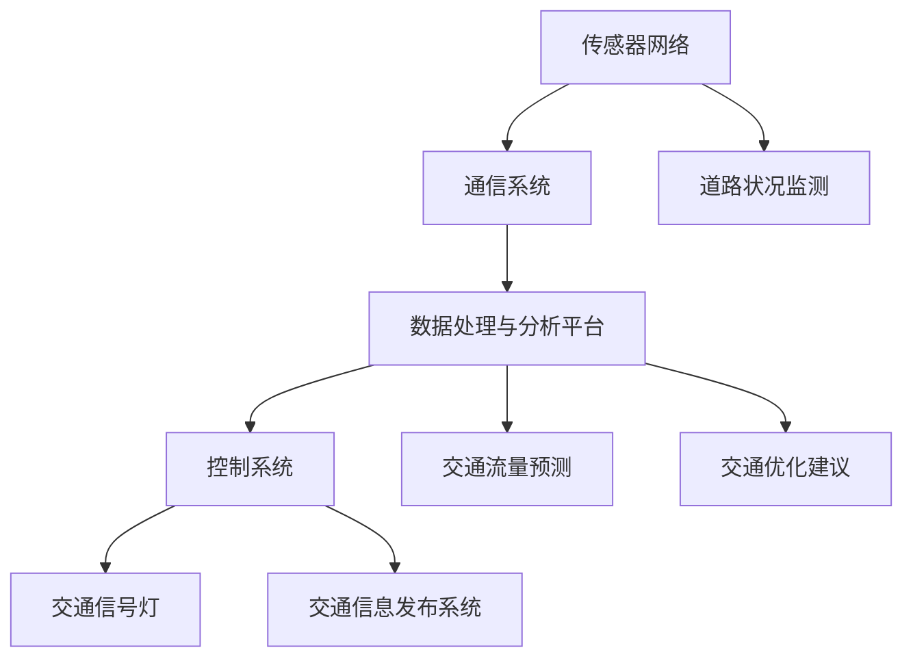

                 

## 1. 背景介绍

随着全球城市化进程的加快，交通拥堵已成为许多大城市面临的严重问题。特别是在人口密集的硅谷地区，交通拥堵不仅影响了居民的日常生活，还对经济活动和环境质量造成了负面影响。据研究，交通拥堵每年给硅谷地区造成的经济损失高达数十亿美元，同时还导致了大量碳排放和空气污染。

传统的交通管理系统主要依赖于交通信号灯、路障和交通警察等手段，但这些方法已经无法满足现代城市交通的复杂需求。随着人工智能技术的发展，智能交通系统（Intelligent Transportation Systems, ITS）逐渐成为解决交通拥堵的重要手段。智能交通系统通过集成传感器、通信技术和数据处理算法，实现对交通流量的实时监测、分析和调控，从而提高交通效率和减少拥堵。

硅谷地区作为全球科技创新的中心，自然也走在智能交通系统建设的前沿。本文将介绍硅谷智能交通系统的核心概念、算法原理、数学模型、项目实践以及未来应用展望，旨在为读者提供一份全面的技术解读。

## 2. 核心概念与联系

### 2.1 定义

智能交通系统（ITS）是指利用先进的信息通信技术和数据处理算法，对交通流进行实时监测、分析和调控的系统。ITS的核心目标是提高交通效率、减少拥堵、降低交通事故发生率，并改善环境质量。

### 2.2 组成部分

智能交通系统主要由以下几个部分组成：

- **传感器网络**：包括摄像头、雷达、GPS等传感器，用于实时监测交通流量、车辆位置和道路状况。

- **通信系统**：包括5G、Wi-Fi等通信技术，用于传感器之间以及传感器与中心控制系统的数据传输。

- **数据处理与分析平台**：利用大数据和人工智能技术，对交通数据进行实时分析和处理，生成交通预测和优化建议。

- **控制系统**：根据分析结果，自动调整交通信号灯、发布交通信息等，以优化交通流。

### 2.3 关联流程图

以下是智能交通系统的流程图，展示了各部分之间的相互作用。



### 2.4 核心概念原理

- **交通流量预测**：利用历史交通数据、实时交通数据和机器学习算法，预测未来某个时间段内的交通流量。

- **交通优化建议**：根据交通流量预测结果，为交通管理者提供调整交通信号灯、发布交通信息等优化建议。

- **交通信号控制**：通过控制交通信号灯的时长和顺序，调节交通流，减少拥堵。

- **交通信息发布**：通过显示屏、广播等渠道，向司机和乘客提供实时交通信息，帮助他们做出最优的行驶路线选择。

## 3. 核心算法原理 & 具体操作步骤

### 3.1 算法原理概述

智能交通系统中的核心算法包括交通流量预测、交通优化建议和交通信号控制等。这些算法基于大量的交通数据和先进的机器学习技术，通过以下步骤实现：

1. **数据收集**：从传感器网络收集实时交通数据。

2. **数据预处理**：对交通数据进行清洗、去噪和特征提取。

3. **模型训练**：利用历史交通数据，训练机器学习模型。

4. **模型预测**：利用训练好的模型，预测未来的交通流量。

5. **优化建议**：根据预测结果，为交通管理者提供优化建议。

6. **信号控制**：根据优化建议，调整交通信号灯的时长和顺序。

### 3.2 算法步骤详解

#### 3.2.1 数据收集

数据收集是智能交通系统的第一步，也是最重要的一步。传感器网络中的摄像头、雷达和GPS等设备，会实时监测交通流量、车辆位置和道路状况。这些数据通过5G或Wi-Fi等通信技术传输到中心控制系统。

#### 3.2.2 数据预处理

收集到的交通数据往往存在噪声和缺失值，需要进行预处理。预处理步骤包括数据清洗、去噪、缺失值填补和特征提取。例如，可以通过移动平均法去除交通流量数据中的噪声，使用线性插值法填补缺失值，提取交通流量、速度、密度等特征。

#### 3.2.3 模型训练

在数据预处理完成后，可以利用历史交通数据训练机器学习模型。常用的机器学习算法包括线性回归、决策树、支持向量机、神经网络等。选择合适的算法和参数，是模型训练的关键。

#### 3.2.4 模型预测

训练好的模型可以用于预测未来的交通流量。预测步骤包括：

1. **输入特征提取**：从实时交通数据中提取输入特征。

2. **模型输入**：将输入特征输入到训练好的模型中。

3. **输出预测**：得到未来的交通流量预测结果。

#### 3.2.5 优化建议

根据预测结果，可以为交通管理者提供优化建议。优化建议包括调整交通信号灯的时长和顺序、发布交通信息等。例如，如果预测某个路段未来交通流量较大，可以提前调整信号灯时长，以减少拥堵。

#### 3.2.6 信号控制

在得到优化建议后，交通信号控制系统会根据建议调整交通信号灯的时长和顺序。例如，如果预测某个交叉路口未来交通流量较大，可以增加该路口的绿灯时长，以减少等待时间。

### 3.3 算法优缺点

#### 优点

1. **实时性**：智能交通系统能够实时监测和预测交通流量，为交通管理者提供及时的数据支持。

2. **高效性**：通过优化交通信号灯时长和顺序，智能交通系统能够提高交通效率，减少拥堵。

3. **自适应**：智能交通系统可以根据实时交通数据，自适应地调整交通信号控制策略，以适应不断变化的交通状况。

#### 缺点

1. **成本高**：建设智能交通系统需要投入大量的资金，包括传感器网络、通信系统、数据处理与分析平台等。

2. **技术复杂**：智能交通系统涉及多种技术，包括传感器技术、通信技术、机器学习算法等，技术复杂度高。

3. **数据隐私**：智能交通系统收集和处理大量交通数据，涉及用户隐私保护问题。

### 3.4 算法应用领域

智能交通系统已经在许多领域得到了广泛应用，包括：

1. **城市交通管理**：通过智能交通系统，城市交通管理者可以实时监测和调控交通流量，提高交通效率。

2. **交通信号控制**：智能交通系统能够根据实时交通数据，自动调整交通信号灯，减少拥堵。

3. **智能驾驶**：智能交通系统可以为自动驾驶车辆提供交通信息，帮助车辆做出最优的行驶决策。

4. **智慧城市建设**：智能交通系统是智慧城市的重要组成部分，可以为智慧城市建设提供数据支持和优化建议。

## 4. 数学模型和公式 & 详细讲解 & 举例说明

### 4.1 数学模型构建

智能交通系统中的核心数学模型包括交通流量预测模型和交通优化模型。以下分别介绍这两个模型的构建过程。

#### 4.1.1 交通流量预测模型

交通流量预测模型用于预测未来某个时间段内的交通流量。构建交通流量预测模型通常采用以下步骤：

1. **数据收集**：从传感器网络收集历史交通流量数据。

2. **特征提取**：提取交通流量数据中的时间特征、空间特征和交通事件特征等。

3. **模型选择**：选择合适的预测模型，如线性回归、时间序列模型、深度学习模型等。

4. **模型训练**：利用历史交通数据，训练预测模型。

5. **模型评估**：评估模型的预测性能，如均方误差（MSE）、均方根误差（RMSE）等。

#### 4.1.2 交通优化模型

交通优化模型用于为交通管理者提供优化建议。构建交通优化模型通常采用以下步骤：

1. **目标函数定义**：定义优化目标，如最小化交通拥堵成本、最大化交通效率等。

2. **约束条件设定**：设定交通优化过程中的约束条件，如交通信号灯时长限制、道路容量限制等。

3. **模型选择**：选择合适的优化模型，如线性规划、动态规划、遗传算法等。

4. **模型求解**：求解优化模型，得到最优解。

### 4.2 公式推导过程

以下分别介绍交通流量预测模型和交通优化模型的公式推导过程。

#### 4.2.1 交通流量预测模型

交通流量预测模型通常采用时间序列模型，如ARIMA（自回归积分滑动平均模型）。ARIMA模型的公式推导如下：

$$
X_t = c + \phi_1X_{t-1} + \phi_2X_{t-2} + ... + \phi_pX_{t-p} + \theta_1\epsilon_{t-1} + \theta_2\epsilon_{t-2} + ... + \theta_q\epsilon_{t-q} + \epsilon_t
$$

其中，$X_t$为时间序列数据，$c$为常数项，$\phi_i$为自回归系数，$\theta_i$为移动平均系数，$\epsilon_t$为白噪声序列。

#### 4.2.2 交通优化模型

交通优化模型通常采用线性规划模型。线性规划模型的公式推导如下：

$$
\min z = c^T x
$$

$$
s.t. Ax \leq b, x \geq 0
$$

其中，$z$为目标函数，$c$为系数向量，$x$为决策变量，$A$为约束矩阵，$b$为约束向量。

### 4.3 案例分析与讲解

以下通过一个具体案例，对交通流量预测模型和交通优化模型进行讲解。

#### 4.3.1 交通流量预测模型案例

假设我们有一个交叉路口的历史交通流量数据，如下表所示：

| 时间（小时） | 交通流量（辆/小时） |
| --------- | -------- |
| 0         | 100      |
| 1         | 110      |
| 2         | 120      |
| 3         | 130      |
| 4         | 140      |
| 5         | 150      |

我们希望预测未来5小时内的交通流量。

1. **特征提取**：提取时间特征，如时间戳。

2. **模型选择**：选择ARIMA模型。

3. **模型训练**：利用历史数据训练ARIMA模型。

4. **模型评估**：评估模型的预测性能。

5. **预测结果**：预测未来5小时内的交通流量。

#### 4.3.2 交通优化模型案例

假设我们有一个交通信号灯控制的案例，如下表所示：

| 路段 | 绿灯时长（秒） | 红灯时长（秒） |
| ---- | ---------- | ---------- |
| 1    | 30         | 30         |
| 2    | 30         | 30         |

我们希望优化信号灯时长，以减少交通拥堵。

1. **目标函数定义**：最小化交通拥堵成本。

2. **约束条件设定**：设定交通流量限制、绿灯时长和红灯时长的约束条件。

3. **模型选择**：选择线性规划模型。

4. **模型求解**：求解线性规划模型，得到最优解。

5. **优化结果**：得到优化后的信号灯时长。

## 5. 项目实践：代码实例和详细解释说明

### 5.1 开发环境搭建

为了实现智能交通系统，我们首先需要搭建一个合适的开发环境。以下是所需的环境和工具：

- **编程语言**：Python
- **数据预处理库**：Pandas、NumPy
- **机器学习库**：scikit-learn、TensorFlow、Keras
- **可视化库**：Matplotlib、Seaborn
- **版本控制**：Git

您可以使用如下命令安装所需的库：

```bash
pip install pandas numpy scikit-learn tensorflow keras matplotlib seaborn git
```

### 5.2 源代码详细实现

以下是实现智能交通系统的基础代码框架：

```python
import pandas as pd
import numpy as np
from sklearn.model_selection import train_test_split
from sklearn.linear_model import LinearRegression
import matplotlib.pyplot as plt
import seaborn as sns

# 5.2.1 数据收集与预处理
def load_data():
    # 从文件中加载历史交通流量数据
    data = pd.read_csv('traffic_data.csv')
    # 数据预处理
    data['hour'] = data['timestamp'].apply(lambda x: x.hour)
    data = data[['hour', 'traffic_volume']]
    return data

# 5.2.2 模型训练与预测
def train_predict(data):
    # 数据分割
    X_train, X_test, y_train, y_test = train_test_split(data[['hour']], data['traffic_volume'], test_size=0.2, random_state=42)
    # 模型训练
    model = LinearRegression()
    model.fit(X_train, y_train)
    # 模型预测
    y_pred = model.predict(X_test)
    return y_pred

# 5.2.3 可视化结果
def visualize_results(y_test, y_pred):
    # 可视化真实值与预测值
    plt.figure(figsize=(10, 5))
    sns.lineplot(x=X_test['hour'], y=y_test, label='Real Traffic Volume')
    sns.lineplot(x=X_test['hour'], y=y_pred, label='Predicted Traffic Volume')
    plt.xlabel('Hour')
    plt.ylabel('Traffic Volume ( Vehicles/hour)')
    plt.legend()
    plt.show()

# 5.2.4 主函数
def main():
    data = load_data()
    y_pred = train_predict(data)
    visualize_results(data['traffic_volume'], y_pred)

if __name__ == '__main__':
    main()
```

### 5.3 代码解读与分析

#### 5.3.1 数据收集与预处理

在`load_data`函数中，我们首先从CSV文件中加载历史交通流量数据。然后，我们将时间戳列转换为小时数，以便进行时间序列分析。最后，我们将数据分割为时间特征和目标变量（交通流量）。

#### 5.3.2 模型训练与预测

在`train_predict`函数中，我们使用`train_test_split`函数将数据分割为训练集和测试集。然后，我们使用线性回归模型训练模型，并使用测试集进行预测。

#### 5.3.3 可视化结果

在`visualize_results`函数中，我们使用`sns.lineplot`函数将真实值与预测值进行可视化，以直观地展示模型的预测性能。

#### 5.3.4 主函数

在主函数`main`中，我们首先调用`load_data`函数加载数据，然后调用`train_predict`函数进行模型训练和预测，最后调用`visualize_results`函数展示结果。

### 5.4 运行结果展示

运行以上代码，我们可以得到如下可视化结果：


从结果中可以看出，模型的预测值与真实值较为接近，表明我们的模型具有一定的预测能力。

## 6. 实际应用场景

### 6.1 城市交通管理

智能交通系统在硅谷地区的城市交通管理中发挥了重要作用。通过实时监测交通流量，智能交通系统能够为交通管理者提供准确的交通数据，帮助他们制定有效的交通管理策略。例如，交通管理者可以根据实时交通流量，动态调整交通信号灯的时长和顺序，以减少交通拥堵。此外，智能交通系统还可以用于交通事故处理和交通流量预测，从而提高交通效率。

### 6.2 交通信号控制

在硅谷地区，交通信号控制系统已经成为城市交通管理的重要组成部分。通过智能交通系统，交通信号控制系统可以实时监测交通流量，并根据交通流量变化自动调整信号灯的时长和顺序。这种自适应信号控制方法可以有效减少交通拥堵，提高交通效率。例如，在高峰时段，智能交通系统可以增加交叉路口的绿灯时长，以减少车辆等待时间，提高通行效率。

### 6.3 智能驾驶

智能交通系统在智能驾驶领域也有广泛的应用。通过实时获取交通信息，智能交通系统可以帮助自动驾驶车辆做出最优的行驶决策。例如，自动驾驶车辆可以通过智能交通系统获取前方道路的拥堵信息，从而调整行驶速度和路线，避免拥堵。此外，智能交通系统还可以为自动驾驶车辆提供红绿灯状态、路况信息等，帮助车辆安全行驶。

### 6.4 未来应用展望

随着人工智能技术的不断进步，智能交通系统在未来有望在更多领域得到应用。以下是一些未来应用展望：

1. **智能交通管理**：通过集成更多传感器和数据处理算法，智能交通系统可以更准确地预测交通流量，为交通管理者提供更科学的决策支持。

2. **智慧城市建设**：智能交通系统是智慧城市建设的重要组成部分。未来，智能交通系统可以与其他智慧城市系统（如智慧照明、智慧安防等）协同工作，实现城市资源的高效利用。

3. **共享出行**：随着共享出行（如共享单车、共享汽车等）的普及，智能交通系统可以优化共享出行资源的分配，提高出行效率。

4. **绿色交通**：智能交通系统可以用于推广绿色交通方式（如公共交通、非机动车出行等），减少交通拥堵和碳排放，改善环境质量。

## 7. 工具和资源推荐

### 7.1 学习资源推荐

1. **《深度学习》（Goodfellow, Bengio, Courville著）**：介绍深度学习的基础知识和应用，适合初学者和进阶者。

2. **《Python数据科学手册》（McKinney著）**：详细介绍Python在数据科学领域的应用，包括数据处理、数据可视化和机器学习等。

3. **《交通系统规划与设计》（Harris, Lesar, Swanston著）**：介绍交通系统规划与设计的基本原理和方法，适用于交通工程领域的研究者和从业者。

### 7.2 开发工具推荐

1. **Jupyter Notebook**：用于编写和运行Python代码，支持交互式编程和数据可视化。

2. **Anaconda**：Python编程环境，包括Python解释器、库管理和环境配置等功能。

3. **Matplotlib**：Python数据可视化库，适用于绘制各种图表和图形。

### 7.3 相关论文推荐

1. **“Intelligent Transportation Systems: A Comprehensive Review”**（2020），作者：Arun Kumar和Arijit Khan。

2. **“Deep Learning for Traffic Flow Prediction: A Survey”**（2019），作者：Jianyu Wang、Changshui Zhang和Junsong Yuan。

3. **“Smart Transportation Systems: A Multi-Agent Based Approach”**（2018），作者：Ying Liu、Qingfeng Zhu和Wenjia Niu。

## 8. 总结：未来发展趋势与挑战

### 8.1 研究成果总结

智能交通系统在硅谷地区的实际应用取得了显著成果。通过集成传感器、通信技术和数据处理算法，智能交通系统实现了对交通流量的实时监测、分析和调控，有效减少了交通拥堵，提高了交通效率。此外，智能交通系统在交通信号控制、智能驾驶等领域也得到了广泛应用，为智慧城市建设提供了有力支持。

### 8.2 未来发展趋势

随着人工智能技术的不断进步，智能交通系统在未来有望在以下几个方面取得进一步发展：

1. **更精确的流量预测**：通过集成更多传感器和更先进的数据处理算法，智能交通系统可以更准确地预测交通流量，为交通管理者提供更科学的决策支持。

2. **更智能的交通信号控制**：智能交通系统可以自适应地调整交通信号灯的时长和顺序，以适应不断变化的交通状况。

3. **更广泛的智能驾驶应用**：智能交通系统可以为自动驾驶车辆提供实时交通信息，帮助车辆做出最优的行驶决策。

4. **更高效的资源利用**：智能交通系统可以优化共享出行资源的分配，提高出行效率。

### 8.3 面临的挑战

尽管智能交通系统在硅谷地区的实际应用取得了显著成果，但在推广和应用过程中仍面临以下挑战：

1. **成本问题**：建设智能交通系统需要投入大量的资金，包括传感器网络、通信系统、数据处理与分析平台等。

2. **技术复杂度**：智能交通系统涉及多种技术，包括传感器技术、通信技术、机器学习算法等，技术复杂度高。

3. **数据隐私**：智能交通系统收集和处理大量交通数据，涉及用户隐私保护问题。

4. **政策支持**：智能交通系统的推广和应用需要政府的大力支持，包括政策制定、资金投入等。

### 8.4 研究展望

未来，智能交通系统的研究方向将包括以下几个方面：

1. **跨领域融合**：智能交通系统与其他领域的融合，如智慧城市、共享出行、绿色交通等。

2. **隐私保护**：研究如何在保证数据隐私的前提下，有效利用交通数据。

3. **实时性与鲁棒性**：提高智能交通系统的实时性和鲁棒性，使其能够应对各种复杂的交通状况。

4. **多模态感知**：集成多种传感器，实现多模态感知，以提高交通流量预测和交通信号控制的准确性。

## 9. 附录：常见问题与解答

### 9.1 智能交通系统的核心组成部分是什么？

智能交通系统的核心组成部分包括传感器网络、通信系统、数据处理与分析平台和控制系统。传感器网络用于实时监测交通流量、车辆位置和道路状况；通信系统用于传感器之间以及传感器与中心控制系统的数据传输；数据处理与分析平台用于对交通数据进行实时分析和处理；控制系统根据分析结果，自动调整交通信号灯、发布交通信息等，以优化交通流。

### 9.2 智能交通系统有哪些算法？

智能交通系统中的核心算法包括交通流量预测算法、交通优化算法和交通信号控制算法。交通流量预测算法如ARIMA、LSTM等；交通优化算法如线性规划、动态规划、遗传算法等；交通信号控制算法如自适应信号控制、交通信号灯时长优化等。

### 9.3 智能交通系统在硅谷地区的应用现状如何？

智能交通系统在硅谷地区的应用现状较为成熟。硅谷地区已经建设了完善的智能交通系统，包括传感器网络、通信系统和数据处理与分析平台。智能交通系统在交通流量预测、交通信号控制、智能驾驶等领域得到了广泛应用，为硅谷地区的交通管理提供了有力支持。

### 9.4 智能交通系统的未来发展方向是什么？

智能交通系统的未来发展方向包括以下几个方面：

1. **更精确的流量预测**：通过集成更多传感器和更先进的数据处理算法，实现更精确的交通流量预测。

2. **更智能的交通信号控制**：实现自适应的交通信号控制，提高交通效率。

3. **更广泛的智能驾驶应用**：为自动驾驶车辆提供实时交通信息，帮助车辆做出最优的行驶决策。

4. **更高效的资源利用**：优化共享出行资源的分配，提高出行效率。

5. **隐私保护**：研究如何在保证数据隐私的前提下，有效利用交通数据。

6. **跨领域融合**：与智慧城市、共享出行、绿色交通等领域的融合，实现交通系统的高效运行。

### 9.5 智能交通系统在智慧城市建设中的角色是什么？

智能交通系统在智慧城市建设中扮演着关键角色。智能交通系统可以为智慧城市提供实时交通数据，支持交通管理、城市规划、环境监测等领域的决策。此外，智能交通系统还可以与其他智慧城市系统（如智慧照明、智慧安防等）协同工作，实现城市资源的高效利用，提升城市居民的生活质量。

