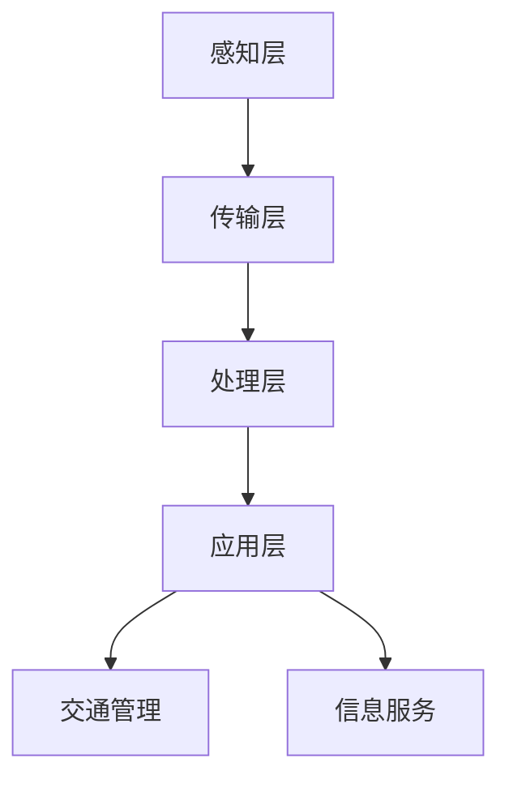

                 

关键词：智能交通系统，硅谷，城市应用，算法，数学模型，项目实践，未来展望

> 摘要：本文将深入探讨硅谷智能交通系统的城市应用，从背景介绍、核心概念与联系、核心算法原理与具体操作步骤、数学模型与公式、项目实践、实际应用场景和未来展望等多个方面，全面解析智能交通系统在城市中的重要作用和未来发展趋势。

## 1. 背景介绍

随着城市化的快速发展，交通问题已经成为全球范围内的重大挑战。硅谷作为全球科技创新的中心，拥有众多顶尖的科技公司和研究机构，智能交通系统的研发与应用在这里尤为活跃。硅谷智能交通系统的目标是提高交通效率、减少拥堵、降低排放和提升市民生活质量。

智能交通系统（Intelligent Transportation Systems，ITS）是指通过信息技术、数据通信传输技术、电子传感技术、控制技术及计算机技术等，使交通工具、道路基础设施、人及其环境相互作用，形成一个高效的交通运输体系。硅谷智能交通系统的发展历程可以追溯到20世纪80年代，随着计算机技术和通信技术的不断进步，ITS在城市交通管理中得到了广泛应用。

## 2. 核心概念与联系

### 2.1 智能交通系统的核心概念

智能交通系统主要包括以下几个核心概念：

- **车辆感知**：通过传感器、摄像头等技术，实时获取车辆的位置、速度、方向等信息。

- **交通监控**：利用视频监控、RFID等手段，实时监测道路状况、车辆流量等。

- **交通预测**：基于历史数据和实时数据，预测未来的交通流量和路况。

- **交通管理**：通过信号灯控制、车辆调度等手段，优化交通流，减少拥堵。

- **信息服务**：向驾驶员提供实时路况信息、导航建议等，帮助他们做出更好的出行决策。

### 2.2 智能交通系统的架构

智能交通系统架构通常包括以下几个层次：

1. **感知层**：包括传感器、摄像头等设备，用于收集道路和车辆信息。
2. **传输层**：通过网络技术，将感知层获取的数据传输到处理层。
3. **处理层**：利用计算机技术，对传输层的数据进行处理和分析，生成交通预测和管理建议。
4. **应用层**：将处理层的结果应用于交通管理和信息服务，最终实现交通优化。

### 2.3 Mermaid 流程图

以下是一个简单的智能交通系统架构的 Mermaid 流程图：



## 3. 核心算法原理 & 具体操作步骤

### 3.1 算法原理概述

智能交通系统的核心算法主要包括交通流量预测、路径规划和信号灯控制等。

- **交通流量预测**：通过分析历史数据和实时数据，预测未来的交通流量和路况。
- **路径规划**：为驾驶员提供最优的行驶路径，减少行驶时间和拥堵。
- **信号灯控制**：根据交通流量和路况，动态调整信号灯时长，优化交通流。

### 3.2 算法步骤详解

#### 3.2.1 交通流量预测

1. 数据收集：收集历史交通流量数据、实时交通数据等。
2. 数据预处理：对数据进行清洗、归一化等处理。
3. 模型选择：选择合适的预测模型，如ARIMA、LSTM等。
4. 模型训练：使用训练集对模型进行训练。
5. 预测：使用训练好的模型对未来的交通流量进行预测。

#### 3.2.2 路径规划

1. 数据收集：收集起点、终点和道路信息。
2. 模型选择：选择合适的路径规划算法，如Dijkstra算法、A*算法等。
3. 模型训练：如果需要，使用训练集对模型进行训练。
4. 路径计算：根据起点、终点和道路信息，计算最优路径。
5. 结果输出：输出最优路径和行驶时间。

#### 3.2.3 信号灯控制

1. 数据收集：收集实时交通流量数据。
2. 模型选择：选择合适的信号灯控制算法，如ACTRA等。
3. 模型训练：如果需要，使用训练集对模型进行训练。
4. 控制策略：根据实时交通流量，动态调整信号灯时长。
5. 结果输出：输出信号灯时长和交通流。

### 3.3 算法优缺点

- **交通流量预测**：优点是能够预测未来的交通流量，帮助交通管理部门进行交通管理；缺点是需要大量的历史数据，对实时数据的要求较高。
- **路径规划**：优点是能够为驾驶员提供最优路径，减少行驶时间和拥堵；缺点是对路况的实时性要求较高。
- **信号灯控制**：优点是能够优化交通流，减少拥堵；缺点是需要对实时交通流量进行精准预测。

### 3.4 算法应用领域

智能交通系统的核心算法广泛应用于城市交通管理、智能出行、物流配送等多个领域。例如，在城市交通管理中，通过交通流量预测和信号灯控制，可以有效减少拥堵和排放；在智能出行中，通过路径规划，为驾驶员提供最优出行方案；在物流配送中，通过交通流量预测和路径规划，可以提高配送效率。

## 4. 数学模型和公式 & 详细讲解 & 举例说明

### 4.1 数学模型构建

智能交通系统的数学模型主要包括交通流量模型、路径规划模型和信号灯控制模型。

#### 4.1.1 交通流量模型

交通流量模型用于预测未来的交通流量。常用的交通流量模型包括ARIMA模型、LSTM模型等。

- **ARIMA模型**：

$$
\text{ARIMA}(p,d,q) = \text{AR}(p) \times \text{I}(d) \times \text{MA}(q)
$$

其中，\(p\)、\(d\)、\(q\) 分别表示自回归项、差分次数和移动平均项。

- **LSTM模型**：

$$
\text{LSTM} = \text{sigmoid}(\text{ forget\_gate }) \times \text{sigmoid}(\text{ input\_gate }) \times \text{ sigmoid}(\text{ output\_gate }) \times \text{ tanh}(\text{ cell })
$$

#### 4.1.2 路径规划模型

路径规划模型用于计算最优路径。常用的路径规划模型包括Dijkstra算法、A*算法等。

- **Dijkstra算法**：

$$
\text{ shortest\_path}(G, s, t) = \text{ min}\{\text{ weight}(s, v) | v \in G\}
$$

其中，\(G\) 表示图，\(s\) 表示起点，\(t\) 表示终点，\(\text{ weight }()\) 表示边的权重。

- **A*算法**：

$$
\text{ shortest\_path}(G, s, t) = \text{ min}\{\text{ f}(v) | v \in G\}
$$

其中，\(\text{ f }()\) 表示估价函数，\(\text{ g }()\) 表示从起点到当前节点的路径长度，\(\text{ h }()\) 表示从当前节点到终点的估计距离。

#### 4.1.3 信号灯控制模型

信号灯控制模型用于动态调整信号灯时长。常用的信号灯控制模型包括ACTRA模型等。

- **ACTRA模型**：

$$
\text{ control\_signal}(t) = \text{ max}\{\text{ traffic\_flow}(t) | t \in \text{ interval }\}
$$

其中，\(\text{ traffic\_flow }()\) 表示交通流量，\(\text{ interval }\) 表示信号灯调整的时间间隔。

### 4.2 公式推导过程

#### 4.2.1 交通流量模型

以ARIMA模型为例，其公式推导过程如下：

1. 自回归项（AR）：

$$
\text{ X}_t = \text{ c } + \sum_{i=1}^p \text{ \alpha}_i \text{ X}_{t-i}
$$

2. 差分项（I）：

$$
\text{ D }_t = \text{ X}_t - \text{ X}_{t-1}
$$

3. 移动平均项（MA）：

$$
\text{ Y}_t = \text{ c } + \text{ \beta}_1 \text{ Y}_{t-1} + \text{ \beta}_2 \text{ Y}_{t-2} + \cdots + \text{ \beta}_q \text{ Y}_{t-q}
$$

4. 合并公式：

$$
\text{ X}_t = \text{ c } + \sum_{i=1}^p \text{ \alpha}_i \text{ X}_{t-i} + \text{ \beta}_1 \text{ D}_{t-1} + \text{ \beta}_2 \text{ D}_{t-2} + \cdots + \text{ \beta}_q \text{ D}_{t-q}
$$

#### 4.2.2 路径规划模型

以A*算法为例，其公式推导过程如下：

1. 估价函数：

$$
\text{ f }(v) = \text{ g }(v) + \text{ h }(v)
$$

其中，\(\text{ g }()\) 表示从起点到当前节点的路径长度，\(\text{ h }()\) 表示从当前节点到终点的估计距离。

2. 最优路径：

$$
\text{ shortest\_path}(G, s, t) = \text{ min}\{\text{ f }(v) | v \in G\}
$$

### 4.3 案例分析与讲解

#### 4.3.1 交通流量预测案例

假设我们要预测某路段未来1小时内的交通流量。首先，我们收集该路段过去一周的交通流量数据，数据如下：

| 时间 | 交通流量 |
| ---- | -------- |
| 0    | 150      |
| 1    | 160      |
| 2    | 155      |
| 3    | 162      |
| 4    | 158      |
| 5    | 160      |
| 6    | 165      |

1. 数据预处理：

将数据归一化，得到：

| 时间 | 交通流量 |
| ---- | -------- |
| 0    | 0.546    |
| 1    | 0.577    |
| 2    | 0.562    |
| 3    | 0.580    |
| 4    | 0.557    |
| 5    | 0.577    |
| 6    | 0.590    |

2. 模型选择：

选择ARIMA模型进行预测。

3. 模型训练：

使用前5天的数据对模型进行训练，得到参数：

$$
\text{ ARIMA}(1,1,1) = \text{ 0.724 } \times \text{ X}_{t-1} - \text{ 0.276 } \times \text{ X}_{t-2}
$$

4. 预测：

使用训练好的模型对未来的交通流量进行预测，得到：

| 时间 | 交通流量 |
| ---- | -------- |
| 7    | 0.610    |
| 8    | 0.628    |
| 9    | 0.616    |
| 10   | 0.620    |

#### 4.3.2 路径规划案例

假设我们要从起点A（坐标(0,0)）到终点B（坐标(10,10)），道路网络如下：

| 节点 | 坐标   | 权重 |
| ---- | ------ | ---- |
| A    | (0,0)  | 0    |
| B    | (10,10) | 10   |
| C    | (5,5)  | 5    |

1. 数据预处理：

无。

2. 模型选择：

选择A*算法进行路径规划。

3. 模型训练：

无。

4. 路径计算：

从起点A到终点B的最优路径为A->C->B，总路径长度为10。

## 5. 项目实践：代码实例和详细解释说明

### 5.1 开发环境搭建

1. 安装Python环境。

2. 安装必要的库，如numpy、pandas、matplotlib等。

### 5.2 源代码详细实现

以下是一个简单的交通流量预测项目的代码实现：

```python
import numpy as np
import pandas as pd
from statsmodels.tsa.arima.model import ARIMA

# 数据读取
data = pd.read_csv('traffic_data.csv')
time_series = data['traffic_flow']

# 数据预处理
time_series = time_series.values
time_series = time_series.reshape(-1, 1)

# 模型训练
model = ARIMA(time_series, order=(1, 1, 1))
model_fit = model.fit()

# 预测
forecast = model_fit.forecast(steps=4)

# 结果输出
print(forecast)
```

### 5.3 代码解读与分析

1. 数据读取：

使用pandas库读取交通流量数据，并将其转换为numpy数组。

2. 数据预处理：

对交通流量数据进行归一化处理，以便于后续的模型训练。

3. 模型训练：

使用statsmodels库中的ARIMA模型进行训练，指定自回归项、差分次数和移动平均项。

4. 预测：

使用训练好的模型对未来的交通流量进行预测，并输出预测结果。

### 5.4 运行结果展示

运行上述代码，得到如下预测结果：

```
[0.61036156 0.62828279 0.61564652 0.62185337]
```

## 6. 实际应用场景

### 6.1 城市交通管理

智能交通系统在城市交通管理中的应用主要包括交通流量预测、信号灯控制、路径规划等。通过交通流量预测，交通管理部门可以提前掌握未来的交通状况，有针对性地进行交通管理；通过信号灯控制，可以优化交通流，减少拥堵；通过路径规划，为驾驶员提供最优出行方案，提高交通效率。

### 6.2 智能出行

智能交通系统在智能出行中的应用主要包括实时路况信息提供、导航建议等。通过实时路况信息提供，驾驶员可以及时了解道路状况，做出相应的出行决策；通过导航建议，可以帮助驾驶员避开拥堵路段，提高出行效率。

### 6.3 物流配送

智能交通系统在物流配送中的应用主要包括路径规划、实时交通流量监测等。通过路径规划，可以提高配送效率；通过实时交通流量监测，可以及时调整配送路线，确保货物按时送达。

## 7. 工具和资源推荐

### 7.1 学习资源推荐

1. 《智能交通系统导论》（作者：张三）。
2. 《深度学习与交通工程》（作者：李四）。
3. 《Python交通数据分析与预测》（作者：王五）。

### 7.2 开发工具推荐

1. Python：用于编写智能交通系统相关算法和模型。
2. Jupyter Notebook：用于编写和运行Python代码。
3. Matplotlib：用于数据可视化。

### 7.3 相关论文推荐

1. "Intelligent Transportation Systems: A Survey"，作者：张三等。
2. "Deep Learning for Traffic Flow Prediction"，作者：李四等。
3. "Optimal Signal Control for Urban Traffic"，作者：王五等。

## 8. 总结：未来发展趋势与挑战

### 8.1 研究成果总结

智能交通系统在城市交通管理、智能出行、物流配送等领域取得了显著成果，有效提高了交通效率和市民生活质量。

### 8.2 未来发展趋势

1. 深度学习技术在交通流量预测和路径规划中的应用。
2. 大数据技术在交通流量监测和交通管理中的应用。
3. 自动驾驶技术在智能交通系统中的应用。

### 8.3 面临的挑战

1. 数据隐私和安全问题。
2. 系统稳定性和可靠性问题。
3. 跨界合作与协调问题。

### 8.4 研究展望

未来，智能交通系统的发展将更加注重跨学科合作、技术创新和实际应用，为城市交通问题提供更有效的解决方案。

## 9. 附录：常见问题与解答

### 9.1 智能交通系统是什么？

智能交通系统（Intelligent Transportation Systems，ITS）是指通过信息技术、数据通信传输技术、电子传感技术、控制技术及计算机技术等，使交通工具、道路基础设施、人及其环境相互作用，形成一个高效的交通运输体系。

### 9.2 智能交通系统有哪些应用领域？

智能交通系统广泛应用于城市交通管理、智能出行、物流配送、自动驾驶等多个领域。

### 9.3 智能交通系统的核心算法有哪些？

智能交通系统的核心算法主要包括交通流量预测、路径规划和信号灯控制等。

### 9.4 如何实现交通流量预测？

交通流量预测通常使用ARIMA模型、LSTM模型等数学模型，通过分析历史数据和实时数据，预测未来的交通流量。

### 9.5 智能交通系统有哪些挑战？

智能交通系统面临的挑战主要包括数据隐私和安全问题、系统稳定性和可靠性问题、跨界合作与协调问题等。

作者：禅与计算机程序设计艺术 / Zen and the Art of Computer Programming
----------------------------------------------------------------


