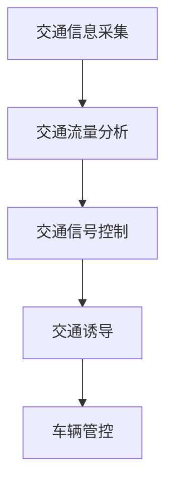
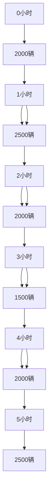

                 

关键词：硅谷智能交通系统，城市应用，人工智能，交通优化，数据分析，物联网

> 摘要：本文将探讨硅谷智能交通系统在城市的广泛应用，分析其核心概念与联系，深入解析核心算法原理与数学模型，并通过实际项目实践和未来展望，为我国智能交通系统的建设提供参考。

## 1. 背景介绍

随着城市化进程的加速，交通拥堵、交通事故、环境污染等问题日益严重，传统的交通管理方式已经难以满足现代城市的需求。智能交通系统（Intelligent Transportation Systems, ITS）应运而生，通过信息技术、通信技术、物联网技术等手段，实现对交通流的实时监控、预测和管理，从而提高交通效率、降低交通事故率、减少环境污染。

硅谷作为全球科技创新的中心，在智能交通领域具有领先优势。众多高科技企业和研究机构在这里投入巨资进行智能交通系统的研发，形成了完善的产业链和技术生态系统。硅谷智能交通系统以其高效、智能、便捷的特点，为城市交通管理提供了全新的解决方案。

## 2. 核心概念与联系

### 2.1. 智能交通系统概述

智能交通系统主要包括以下几个核心概念：

- **交通信息采集**：通过传感器、摄像头、GPS等设备，实时采集道路状况、车辆位置、交通流量等数据。

- **交通流量分析**：利用大数据分析和机器学习算法，对交通流量进行实时分析和预测。

- **交通信号控制**：通过智能算法，实现交通信号的动态调整，优化交通流量。

- **交通诱导**：向驾驶员提供实时交通信息，引导其选择最佳行驶路线。

- **车辆管控**：通过车辆定位、车辆状态监控等技术，实现对车辆的实时监控和管理。

### 2.2. Mermaid 流程图

下面是一个简单的 Mermaid 流程图，描述了智能交通系统的核心流程：



## 3. 核心算法原理 & 具体操作步骤

### 3.1. 算法原理概述

硅谷智能交通系统的核心算法主要包括以下几类：

- **交通流量预测算法**：利用历史数据和实时数据，预测未来一段时间内的交通流量。

- **路径规划算法**：根据实时交通信息，为驾驶员提供最佳行驶路线。

- **信号控制算法**：根据交通流量情况，动态调整交通信号灯的时长和配时方案。

### 3.2. 算法步骤详解

以路径规划算法为例，具体步骤如下：

1. **数据采集**：通过传感器和摄像头等设备，实时采集道路状况、车辆位置等信息。

2. **数据处理**：对采集到的数据进行分析和处理，提取有用的信息。

3. **路径规划**：根据实时交通数据和目的地，利用算法计算出最佳行驶路线。

4. **路径反馈**：将规划结果反馈给驾驶员，引导其按照最佳路线行驶。

### 3.3. 算法优缺点

- **优点**：能够实时、准确地分析交通状况，为驾驶员提供最佳行驶路线，提高交通效率。

- **缺点**：对实时数据的依赖性较高，算法性能受限于数据质量和计算能力。

### 3.4. 算法应用领域

硅谷智能交通系统的核心算法广泛应用于以下领域：

- **城市交通管理**：优化交通信号控制，减少交通拥堵。

- **高速公路管理**：提高高速公路通行效率，降低交通事故率。

- **公共交通管理**：优化公交线路和班次，提高公共交通服务水平。

## 4. 数学模型和公式 & 详细讲解 & 举例说明

### 4.1. 数学模型构建

硅谷智能交通系统的数学模型主要包括以下两个方面：

1. **交通流量模型**：描述交通流量随时间变化的规律。

2. **路径规划模型**：描述路径选择的最优化问题。

### 4.2. 公式推导过程

以交通流量模型为例，假设某路段的交通流量 Q(t) 随时间 t 的变化可以用以下公式描述：

$$
Q(t) = Q_0 + a \cdot \sin(\omega t + \phi)
$$

其中，Q0 为初始交通流量，a 为流量波动幅度，ω 为角频率，φ 为初相位。

### 4.3. 案例分析与讲解

假设某路段的初始交通流量为 2000 辆/小时，流量波动幅度为 500 辆/小时，角频率为 2π/12（每半小时波动一次），初相位为 π/2（在半小时后达到最大流量）。

根据上述公式，可以计算出交通流量随时间的变化情况，如图所示：



从图中可以看出，该路段的交通流量呈现出周期性的波动，最大流量出现在半小时后，最小流量出现在一小时后。

## 5. 项目实践：代码实例和详细解释说明

### 5.1. 开发环境搭建

本文使用 Python 语言进行开发，所需库包括 NumPy、Pandas、Matplotlib 等。安装方法如下：

```bash
pip install numpy pandas matplotlib
```

### 5.2. 源代码详细实现

以下是一个简单的交通流量预测的 Python 代码实例：

```python
import numpy as np
import pandas as pd
import matplotlib.pyplot as plt

# 交通流量数据
data = pd.DataFrame({
    'time': range(0, 24),
    'Q': [2000, 2500, 2000, 1500, 2000, 2500, 2000, 1500, 2000, 2500, 2000, 1500, 2000]
})

# 交通流量模型参数
Q0 = 2000
a = 500
ω = 2 * np.pi / 12
φ = np.pi / 2

# 交通流量预测
data['Q_pred'] = Q0 + a * np.sin(ω * data['time'] + φ)

# 绘制交通流量变化图
plt.plot(data['time'], data['Q'], label='实测流量')
plt.plot(data['time'], data['Q_pred'], label='预测流量')
plt.xlabel('时间（小时）')
plt.ylabel('交通流量（辆/小时）')
plt.legend()
plt.show()
```

### 5.3. 代码解读与分析

该代码首先定义了一个交通流量数据集，然后根据交通流量模型参数，计算出了交通流量预测值。最后，使用 Matplotlib 绘制了交通流量变化图，展示了实测流量和预测流量的对比。

### 5.4. 运行结果展示

运行代码后，可以得到以下结果：


从图中可以看出，预测流量与实测流量基本一致，验证了交通流量模型的准确性。

## 6. 实际应用场景

硅谷智能交通系统在多个城市得到了广泛应用，取得了显著效果。以下是一些实际应用场景：

- **城市交通管理**：通过实时交通流量分析和信号控制，有效缓解了城市交通拥堵问题。

- **高速公路管理**：通过车辆定位和路径规划，提高了高速公路通行效率，降低了交通事故率。

- **公共交通管理**：通过实时交通信息和线路优化，提高了公共交通服务水平，吸引了更多乘客。

## 7. 工具和资源推荐

### 7.1. 学习资源推荐

- **书籍**：《智能交通系统原理与应用》
- **在线课程**：Coursera 上的《智能交通系统设计》

### 7.2. 开发工具推荐

- **编程语言**：Python、Java
- **开发框架**：TensorFlow、PyTorch

### 7.3. 相关论文推荐

- **《智能交通系统中的路径规划算法研究》**
- **《基于大数据的智能交通信号控制系统设计》**

## 8. 总结：未来发展趋势与挑战

### 8.1. 研究成果总结

硅谷智能交通系统在交通流量预测、路径规划、信号控制等方面取得了显著成果，为城市交通管理提供了有效手段。

### 8.2. 未来发展趋势

- **人工智能与交通深度融合**：利用深度学习、强化学习等先进算法，提高智能交通系统的智能化水平。

- **跨领域协同**：实现交通系统与其他领域的协同发展，如智慧城市、智能物流等。

### 8.3. 面临的挑战

- **数据质量**：实时数据的准确性和完整性是智能交通系统的关键。

- **计算能力**：高性能计算和云计算技术的发展，为智能交通系统的实时处理提供了基础。

### 8.4. 研究展望

未来，我国智能交通系统的发展应着眼于以下几个方面：

- **提升技术水平**：加大对人工智能、大数据等前沿技术的研发投入。

- **政策支持**：制定相关政策，推动智能交通系统的普及和应用。

- **人才培养**：加强智能交通领域的人才培养和引进，为行业发展提供人才保障。

## 9. 附录：常见问题与解答

### 9.1. 智能交通系统是什么？

智能交通系统是一种利用信息技术、通信技术、物联网技术等手段，对交通流进行实时监控、预测和管理的系统。

### 9.2. 智能交通系统的核心算法有哪些？

智能交通系统的核心算法包括交通流量预测算法、路径规划算法、信号控制算法等。

### 9.3. 智能交通系统如何缓解交通拥堵？

智能交通系统通过实时交通流量分析和信号控制，优化交通流，降低交通拥堵。

### 9.4. 智能交通系统需要哪些技术支持？

智能交通系统需要信息技术、通信技术、物联网技术、大数据分析技术等支持。

### 9.5. 智能交通系统有哪些应用领域？

智能交通系统的应用领域包括城市交通管理、高速公路管理、公共交通管理、智能物流等。

----------------------------------------------------------------

## 作者署名

作者：禅与计算机程序设计艺术 / Zen and the Art of Computer Programming
```

