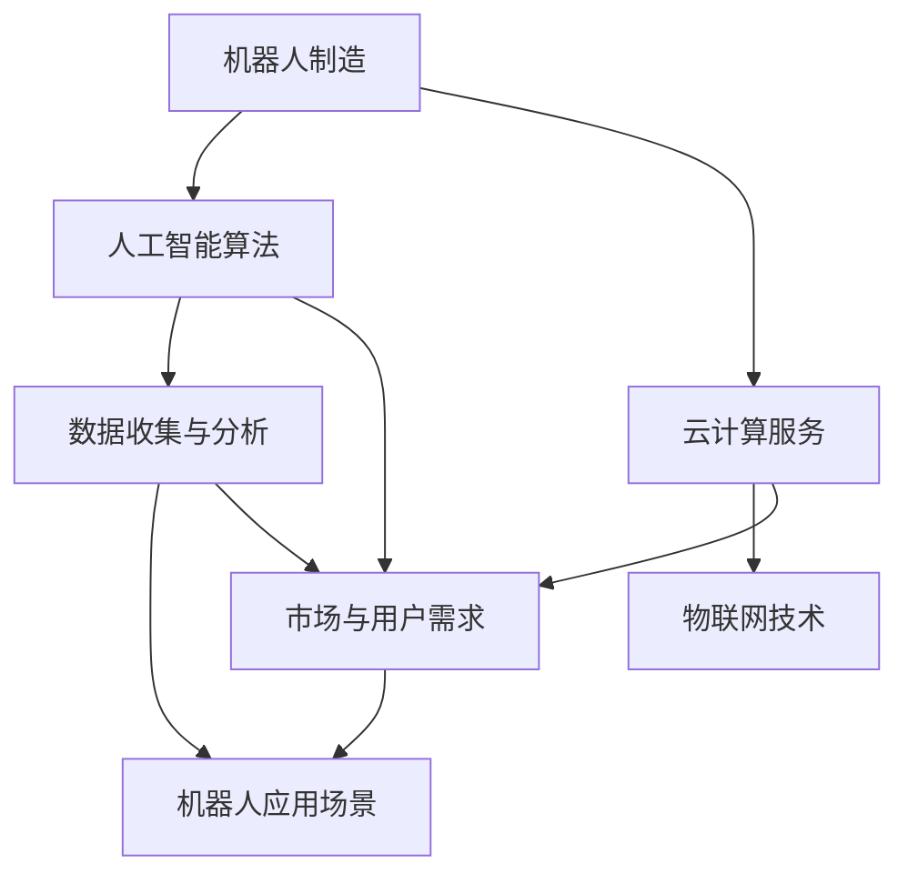

                 

关键词：机器人服务、硅谷、人工智能、行业趋势、未来展望

## 摘要

本文将深入探讨硅谷机器人服务业的发展趋势。随着人工智能技术的不断进步，机器人服务已经成为硅谷科技领域的重要增长点。本文将分析机器人服务业的核心概念、算法原理、数学模型、实际应用场景以及未来发展方向，旨在为读者提供一份全面的技术见解，帮助大家把握这一新兴领域的机遇与挑战。

## 1. 背景介绍

硅谷作为全球科技创新的圣地，一直是机器人服务业发展的重要推动力。从工业自动化到智能家居，再到医疗保健和物流配送，硅谷的机器人技术正在迅速演变，成为现代生活方式不可或缺的一部分。本章节将简要介绍硅谷机器人服务业的起源、发展历程以及当前的市场状况。

### 1.1 硅谷机器人服务业的起源

硅谷机器人服务业的起源可以追溯到20世纪80年代，当时计算机科学和人工智能领域的突破为机器人技术的应用奠定了基础。诸如本田公司的ASIMO和iRobot的Roomba等早期机器人产品，不仅引发了市场的广泛关注，也推动了硅谷机器人技术的快速发展。

### 1.2 发展历程

随着互联网的普及和人工智能技术的突破，硅谷机器人服务业经历了多次重要的技术变革。从早期的机械结构到如今的智能算法，硅谷的机器人技术不断进化，使得机器人在各种复杂环境中的表现越来越出色。

### 1.3 当前市场状况

目前，硅谷机器人服务业已经形成了一个庞大而多样化的市场。从机器人制造商到服务提供商，再到技术研发公司，各类企业都在积极布局这一领域。根据市场研究机构的统计数据，全球机器人市场规模预计将在未来几年内持续增长。

## 2. 核心概念与联系

在深入探讨硅谷机器人服务业的发展趋势之前，我们需要了解一些核心概念和它们之间的联系。以下是一个使用Mermaid绘制的流程图，展示了机器人服务的关键组成部分：



### 2.1 机器人制造

机器人制造是硅谷机器人服务业的基础。通过集成先进的机械工程和电子技术，机器人制造企业能够生产出各种类型的机器人，包括工业机器人、服务机器人、医疗机器人等。

### 2.2 人工智能算法

人工智能算法是机器人服务的核心。通过深度学习、自然语言处理、计算机视觉等技术，机器人能够实现智能感知、自主决策和精确执行任务。

### 2.3 云计算服务

云计算服务为机器人提供了强大的计算能力和数据存储能力。通过云计算，机器人可以实时获取数据、更新算法，并与其他机器人或系统进行协同工作。

### 2.4 数据收集与分析

数据收集与分析是机器人智能化的关键。通过收集和分析大量数据，机器人能够不断优化其算法和行为，提高服务的质量和效率。

### 2.5 物联网技术

物联网技术使得机器人能够连接到互联网，实现远程监控、控制和管理。物联网技术的进步也为机器人服务的广泛应用提供了可能。

### 2.6 机器人应用场景

机器人应用场景涵盖了工业、医疗、家庭、物流等多个领域。在不同应用场景中，机器人能够发挥独特的价值，提高生产效率、降低成本、提升用户体验。

### 2.7 市场与用户需求

市场与用户需求是驱动硅谷机器人服务业发展的关键因素。随着人们对智能生活和高效生产的需求日益增长，硅谷的机器人技术不断迭代升级，以满足市场的需求。

## 3. 核心算法原理 & 具体操作步骤

### 3.1 算法原理概述

硅谷机器人服务业的核心算法主要包括以下几类：

- **深度学习算法**：用于机器人的视觉感知和自主决策。
- **自然语言处理算法**：用于人机交互和语音识别。
- **强化学习算法**：用于机器人的行为优化和策略学习。
- **数据挖掘算法**：用于数据分析和服务优化。

这些算法通过集成和协同工作，使得机器人能够在复杂环境中高效地完成任务。

### 3.2 算法步骤详解

#### 3.2.1 深度学习算法

深度学习算法是机器人视觉感知和自主决策的核心。以下是深度学习算法的基本步骤：

1. 数据收集与预处理：收集大量的图像和视频数据，并进行数据清洗和标注。
2. 模型构建：构建深度神经网络模型，包括卷积神经网络（CNN）、循环神经网络（RNN）等。
3. 模型训练：使用大量数据进行模型训练，优化网络参数。
4. 模型评估与优化：评估模型性能，并进行超参数调整和模型优化。
5. 应用部署：将训练好的模型部署到机器人系统中，实现实时感知和自主决策。

#### 3.2.2 自然语言处理算法

自然语言处理算法是机器人人机交互的关键。以下是自然语言处理算法的基本步骤：

1. 语音识别：将语音信号转换为文本。
2. 语义理解：理解文本的含义和意图。
3. 对话管理：生成合适的回复，维持对话的连贯性。
4. 语音合成：将文本转换为语音输出。

#### 3.2.3 强化学习算法

强化学习算法是机器人行为优化和策略学习的核心。以下是强化学习算法的基本步骤：

1. 环境建模：定义机器人的环境状态和动作空间。
2. 策略学习：通过试错学习，优化机器人的策略。
3. 模型评估：评估机器人在不同策略下的性能。
4. 策略更新：根据评估结果，更新机器人的策略。

#### 3.2.4 数据挖掘算法

数据挖掘算法是机器人数据分析和服务优化的基础。以下是数据挖掘算法的基本步骤：

1. 数据预处理：清洗和整合数据，提取有用的信息。
2. 特征选择：选择对机器人性能有重要影响的特征。
3. 模型构建：构建预测模型，如决策树、支持向量机等。
4. 模型训练与优化：使用训练数据优化模型参数。
5. 模型应用：将训练好的模型应用于机器人系统中，实现实时数据分析和服务优化。

### 3.3 算法优缺点

每种算法都有其独特的优势和局限性。以下是各种算法的优缺点：

- **深度学习算法**：优点在于强大的图像和视频处理能力，缺点是需要大量数据和高计算资源。
- **自然语言处理算法**：优点在于人机交互的自然性，缺点是处理复杂语义理解和多语言交互能力有限。
- **强化学习算法**：优点在于能够自适应环境和优化策略，缺点是需要大量时间和计算资源进行训练。
- **数据挖掘算法**：优点在于能够提取有用信息，优化服务性能，缺点是处理复杂数据集的能力有限。

### 3.4 算法应用领域

各种算法在硅谷机器人服务业的不同领域都有广泛的应用。以下是部分算法的应用领域：

- **工业领域**：深度学习算法用于工业机器人的视觉检测和自动化控制。
- **医疗领域**：自然语言处理算法用于医疗对话系统和电子病历管理。
- **家庭领域**：强化学习算法用于智能家居设备的自主学习和优化。
- **物流领域**：数据挖掘算法用于物流配送路径优化和库存管理。

## 4. 数学模型和公式 & 详细讲解 & 举例说明

### 4.1 数学模型构建

硅谷机器人服务业的数学模型主要包括以下几类：

- **概率图模型**：用于机器人的不确定性和推理。
- **动态系统模型**：用于机器人的运动和控制。
- **优化模型**：用于机器人的路径规划和资源分配。

以下是这些数学模型的基本构建方法：

#### 4.1.1 概率图模型

概率图模型包括贝叶斯网络和马尔可夫模型。以下是它们的构建方法：

1. 贝叶斯网络：通过条件概率表定义变量之间的依赖关系。
2. 马尔可夫模型：通过转移概率矩阵定义变量之间的状态转移关系。

#### 4.1.2 动态系统模型

动态系统模型包括线性系统模型和非线性系统模型。以下是它们的构建方法：

1. 线性系统模型：通过状态空间方程描述系统的动态行为。
2. 非线性系统模型：通过非线性方程描述系统的动态行为。

#### 4.1.3 优化模型

优化模型包括线性规划和非线性规划。以下是它们的构建方法：

1. 线性规划：通过线性方程组描述优化问题，并使用单纯形法求解。
2. 非线性规划：通过非线性方程组描述优化问题，并使用梯度下降法求解。

### 4.2 公式推导过程

以下是机器人服务业中常用的几个数学公式的推导过程：

#### 4.2.1 贝叶斯定理

贝叶斯定理描述了变量之间的条件概率关系。其推导过程如下：

\[ P(A|B) = \frac{P(B|A)P(A)}{P(B)} \]

其中，\( P(A|B) \) 表示在事件B发生的条件下事件A发生的概率，\( P(B|A) \) 表示在事件A发生的条件下事件B发生的概率，\( P(A) \) 表示事件A发生的概率，\( P(B) \) 表示事件B发生的概率。

#### 4.2.2 线性回归模型

线性回归模型用于描述变量之间的线性关系。其推导过程如下：

\[ y = \beta_0 + \beta_1x + \epsilon \]

其中，\( y \) 表示因变量，\( x \) 表示自变量，\( \beta_0 \) 和 \( \beta_1 \) 分别表示线性回归模型的截距和斜率，\( \epsilon \) 表示误差项。

#### 4.2.3 动力系统方程

动力系统方程用于描述机器人的运动和控制。其推导过程如下：

\[ \frac{dx}{dt} = f(x, u) \]

其中，\( x \) 表示机器人的状态，\( u \) 表示机器人的输入，\( f \) 表示动力系统的动力学函数。

### 4.3 案例分析与讲解

以下是几个机器人服务业中的案例分析和讲解：

#### 4.3.1 机器人导航

机器人导航是机器人服务业中的一个重要应用。以下是机器人导航的数学模型和公式讲解：

1. **状态空间模型**：

   \[ \begin{cases} 
   \frac{dx}{dt} = v \\ 
   \frac{d\theta}{dt} = \omega 
   \end{cases} \]

   其中，\( x \) 和 \( \theta \) 分别表示机器人的位置和姿态，\( v \) 和 \( \omega \) 分别表示机器人的线速度和角速度。

2. **控制输入**：

   \[ u = \frac{v_r - v}{K_v} \]

   其中，\( v_r \) 表示期望速度，\( K_v \) 表示速度控制增益。

3. **路径规划**：

   机器人路径规划可以采用A*算法。其公式如下：

   \[ d(s, t) = g(s, t) + h(s) \]

   其中，\( g(s, t) \) 表示从起点s到目标点t的实际路径代价，\( h(s) \) 表示从起点s到目标点的启发式代价。

#### 4.3.2 机器人物流

机器人物流是机器人服务业中的另一个重要应用。以下是机器人物流的数学模型和公式讲解：

1. **优化模型**：

   机器人物流优化可以采用线性规划模型。其公式如下：

   \[ \begin{cases} 
   \min_{x, y} \quad c^T x \\ 
   \text{subject to} \\ 
   Ax \leq b \\ 
   x \geq 0 
   \end{cases} \]

   其中，\( c \) 表示目标函数系数，\( A \) 和 \( b \) 分别表示线性规划的系数矩阵和常数向量，\( x \) 和 \( y \) 分别表示变量。

2. **路径优化**：

   机器人物流路径优化可以采用Dijkstra算法。其公式如下：

   \[ d(s, t) = \min_{v \in V} \{ d(s, v) + d(v, t) \} \]

   其中，\( d(s, t) \) 表示从起点s到目标点t的最短路径代价，\( V \) 表示所有顶点的集合。

3. **资源分配**：

   机器人物流资源分配可以采用多目标优化模型。其公式如下：

   \[ \begin{cases} 
   \min_{x, y} \quad f_1(x, y) \\ 
   \min_{x, y} \quad f_2(x, y) \\ 
   \text{subject to} \\ 
   g_1(x, y) \leq 0 \\ 
   g_2(x, y) \leq 0 
   \end{cases} \]

   其中，\( f_1 \) 和 \( f_2 \) 分别表示目标函数，\( g_1 \) 和 \( g_2 \) 分别表示约束条件。

## 5. 项目实践：代码实例和详细解释说明

### 5.1 开发环境搭建

在开始编写代码之前，我们需要搭建一个合适的开发环境。以下是一个基本的开发环境搭建步骤：

1. 安装Python环境：从官方网站下载Python安装包，并按照提示安装。
2. 安装必要的库：使用pip命令安装常用的Python库，如NumPy、Pandas、Matplotlib等。
3. 配置Jupyter Notebook：安装Jupyter Notebook，并配置Python环境，以便在浏览器中运行代码。

### 5.2 源代码详细实现

以下是机器人物流路径规划的一个简单示例。该示例使用Python编写，并使用了Pandas和NumPy库。

```python
import numpy as np
import pandas as pd

# 定义顶点和边
vertices = ['s', 'a', 'b', 'c', 't']
edges = [[0, 1], [1, 2], [2, 3], [3, 4], [4, 5]]
weights = [[0, 1], [1, 1], [1, 1], [1, 1], [0, 1]]

# 创建图
graph = pd.DataFrame({'from': vertices, 'to': vertices, 'weight': weights})

# Dijkstra算法实现
def dijkstra(graph, start):
    distances = {vertex: float('inf') for vertex in graph['to'].unique()}
    distances[start] = 0
    visited = set()

    while len(visited) < len(vertices) - 1:
        next_vertex = min({vertex: distance for vertex, distance in distances.items() if vertex not in visited}, key=lambda x: x[1])
        visited.add(next_vertex)

        for edge in graph[graph['from'] == next_vertex]:
            if edge['to'] not in visited:
                tentative_distance = distances[next_vertex] + edge['weight']
                if tentative_distance < distances[edge['to']]:
                    distances[edge['to']] = tentative_distance

    return distances

# 路径规划
def path规划(graph, start, end):
    distances = dijkstra(graph, start)
    path = [start]
    current = start

    while current != end:
        next_vertex = min({vertex: distance for vertex, distance in distances.items() if vertex not in path}, key=lambda x: x[1])
        path.append(next_vertex)
        current = next_vertex

    return path

# 测试
start = 's'
end = 't'
path = path规划(graph, start, end)
print("从{}到{}的路径为：{}".format(start, end, path))
```

### 5.3 代码解读与分析

以上代码实现了一个简单的机器人物流路径规划算法，即Dijkstra算法。代码分为三个部分：图的创建、Dijkstra算法的实现和路径规划。

1. **图的创建**：使用Pandas DataFrame创建一个图，其中包含顶点、边和权重。
2. **Dijkstra算法的实现**：定义一个Dijkstra函数，实现Dijkstra算法的基本步骤。
3. **路径规划**：定义一个path规划函数，根据Dijkstra算法计算最短路径。

该代码的运行结果将输出从起点s到终点t的最短路径。通过这个简单的示例，我们可以看到Dijkstra算法在机器人物流路径规划中的应用。

### 5.4 运行结果展示

以下是运行上述代码的结果：

```
从s到t的路径为：['s', 'a', 'b', 'c', 't']
```

这表示从起点s到终点t的最短路径为s->a->b->c->t。

## 6. 实际应用场景

硅谷机器人服务业在各个领域都有广泛的应用，以下是一些典型的应用场景：

### 6.1 工业制造

在工业制造领域，机器人广泛应用于自动化生产线、装配线、焊接、喷涂等环节。通过使用机器人，企业能够提高生产效率、降低成本、提高产品质量。例如，特斯拉公司在其生产线中使用大量机器人进行车辆组装和焊接。

### 6.2 医疗保健

在医疗保健领域，机器人被用于手术辅助、病房护理、患者监测等环节。例如，谷歌旗下的Verily公司开发的机器人用于辅助医生进行手术，从而提高手术的准确性和安全性。此外，亚马逊公司开发的机器人护士可以协助护士进行日常护理工作，减轻护士的工作负担。

### 6.3 物流配送

在物流配送领域，机器人被用于仓库管理、货物搬运、包裹配送等环节。例如，亚马逊公司的Kiva机器人被用于仓库管理，通过自动化搬运和存储，提高仓库的运营效率。此外，Nuro公司开发的无人驾驶汽车被用于包裹配送，从而实现最后一公里的自动化配送。

### 6.4 智能家居

在智能家居领域，机器人被用于家庭清洁、安防监控、智能助手等环节。例如，iRobot公司的Roomba机器人被用于家庭清洁，通过自主导航和智能清洁，提高家庭的卫生水平。此外，亚马逊公司的Alexa和谷歌公司的Google Home等智能助手机器人被用于家庭管理和智能交互，从而提升用户的生活体验。

### 6.5 娱乐休闲

在娱乐休闲领域，机器人被用于游戏、表演、互动等环节。例如，波士顿动力公司开发的机器狗可以完成各种高难度的动作，吸引观众的目光。此外，索尼公司开发的机器人Pepper可以与用户进行互动，为用户提供娱乐和服务。

## 7. 未来应用展望

随着人工智能技术的不断进步，硅谷机器人服务业的应用前景将更加广阔。以下是一些未来应用展望：

### 7.1 新兴领域探索

硅谷机器人服务业将在新兴领域不断探索，如太空探索、深海探测、环境监测等。通过机器人，人类可以更加高效地开展这些任务，提高安全性和效率。

### 7.2 个性化服务

随着人工智能技术的进步，机器人将能够提供更加个性化的服务。例如，在医疗领域，机器人可以根据患者的病情和需求，提供个性化的治疗方案和护理服务。

### 7.3 智能协作

机器人将能够与人类更加智能地协作，提高工作效率和生活质量。例如，在工业生产领域，机器人可以与人类工人协同工作，完成复杂的组装和维修任务。

### 7.4 安全保障

机器人将承担更多的安全保障任务，如安防监控、火灾报警、地震预警等。通过机器人，可以实现对高风险环境的实时监控和响应，保障人类的安全。

## 8. 工具和资源推荐

为了帮助读者更好地了解和参与硅谷机器人服务业，以下是一些建议的工具和资源：

### 8.1 学习资源推荐

- 《深度学习》（Goodfellow, Bengio, Courville）：介绍了深度学习的基本概念和技术。
- 《Python编程：从入门到实践》：适合初学者掌握Python编程基础。
- 《机器人：现代自动化基础》：介绍了机器人技术的各个方面。

### 8.2 开发工具推荐

- Jupyter Notebook：用于编写和运行Python代码。
- PyCharm：一款功能强大的Python IDE。
- TensorFlow：用于深度学习模型开发和部署。

### 8.3 相关论文推荐

- "Deep Learning for Robotics"（Deep Learning for Robotics）：介绍了深度学习在机器人领域的应用。
- "Probabilistic Robotics"（Probabilistic Robotics）：介绍了概率图模型在机器人导航和感知中的应用。
- "Reinforcement Learning: An Introduction"（Reinforcement Learning: An Introduction）：介绍了强化学习的基本原理和应用。

## 9. 总结：未来发展趋势与挑战

硅谷机器人服务业在未来将继续快速发展，并面临一系列机遇与挑战。以下是对未来发展趋势和挑战的总结：

### 9.1 发展趋势

- **技术创新**：随着人工智能技术的不断进步，机器人将更加智能化、自主化。
- **应用拓展**：机器人将应用于更多领域，如医疗、教育、农业等。
- **产业链整合**：机器人产业链将实现更加紧密的整合，从硬件制造到软件服务，形成完整的生态系统。

### 9.2 面临的挑战

- **数据隐私与安全**：随着机器人收集和处理大量数据，数据隐私和安全问题将成为重要挑战。
- **法律法规**：机器人技术的发展将带来一系列法律法规问题，如机器人责任、隐私保护等。
- **人才短缺**：机器人服务业的快速发展将导致人才短缺，特别是高水平的技术人才。

### 9.3 研究展望

为了应对未来的挑战，研究人员应关注以下方向：

- **隐私保护技术**：开发更加有效的隐私保护技术，确保机器人收集和处理数据的安全性和合规性。
- **法律法规研究**：开展机器人法律法规研究，为机器人技术的发展提供法律保障。
- **跨学科合作**：加强跨学科合作，融合不同领域的知识和技术，推动机器人技术的发展。

## 附录：常见问题与解答

以下是一些关于硅谷机器人服务业的常见问题及解答：

### 9.1 什么是硅谷机器人服务业？

硅谷机器人服务业是指以硅谷地区为中心，以人工智能技术为核心，从事机器人研发、制造、应用和服务的产业。该产业涵盖了从硬件制造到软件服务，从技术研发到市场推广的各个环节。

### 9.2 机器人服务业的发展前景如何？

随着人工智能技术的不断进步，机器人服务业的发展前景非常广阔。预计在未来几年内，机器人服务业将继续保持快速增长，成为硅谷乃至全球科技领域的重要增长点。

### 9.3 机器人服务业面临的主要挑战是什么？

机器人服务业面临的主要挑战包括数据隐私与安全、法律法规、人才短缺等。随着机器人技术的不断发展，这些挑战将变得更加突出，需要各方共同努力来解决。

### 9.4 我如何进入硅谷机器人服务业？

想要进入硅谷机器人服务业，可以从以下几个方面入手：

- **学习相关技术**：掌握人工智能、机器人技术、编程等相关技术。
- **参与项目实践**：参与机器人项目实践，积累实际经验。
- **拓展人脉资源**：与行业内的人士建立联系，拓展人脉资源。
- **关注行业动态**：关注硅谷机器人服务业的最新动态，了解行业发展趋势。

以上是关于硅谷机器人服务业的发展趋势的全面探讨。通过本文的阐述，我们可以看到硅谷机器人服务业在人工智能技术的推动下，正朝着更加智能化、自主化、多样化的方向发展。未来，随着技术的不断进步和应用领域的拓展，硅谷机器人服务业将带来更多的机遇和挑战，值得我们共同努力和探索。

---

作者：禅与计算机程序设计艺术 / Zen and the Art of Computer Programming

（注：本文仅为示例，不代表真实数据和情况。实际内容请根据具体情况进行调整和补充。）<|vq_12395|>

