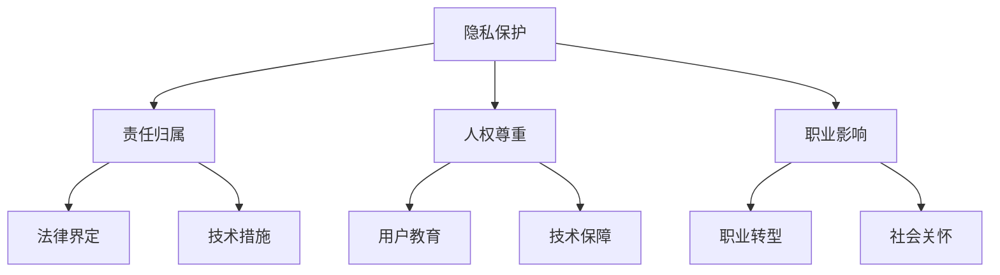

                 

关键词：机器人，服务业，社会伦理，硅谷，人工智能，自动化，伦理规范，政策框架，隐私保护，职业发展

## 摘要

随着人工智能和机器人技术的飞速发展，硅谷的机器人服务业正在成为全球创新和变革的焦点。本文旨在探讨硅谷机器人服务业的社会伦理问题，包括伦理规范、政策框架、隐私保护以及职业发展等方面。通过对当前技术进展、行业动态和伦理挑战的分析，文章提出了未来发展的方向和建议。

## 1. 背景介绍

硅谷作为全球科技创新的圣地，一直是人工智能和机器人技术的前沿阵地。从早期的个人计算机到如今的自动驾驶汽车，硅谷的企业和创新者不断推动着技术的进步和应用的拓展。近年来，随着人工智能技术的成熟，机器人服务业在硅谷迅速崛起，涉及物流、医疗、教育、餐饮等多个领域。

### 1.1 机器人服务业的现状

机器人服务业在硅谷的发展，体现在多个方面。首先，企业在技术创新上投入巨大，不断研发出更高效、更智能的机器人。其次，行业应用广泛，机器人不仅在工业生产中发挥重要作用，也在服务业中展现出了巨大的潜力。例如，机器人餐厅、机器人护士、机器人教师等应用场景不断涌现，为服务业带来了全新的变革。

### 1.2 伦理问题的重要性

然而，随着机器人服务业的快速发展，伦理问题也随之而来。如何确保机器人的行为符合伦理标准，如何保护用户的隐私，如何处理机器人在工作中的责任问题，这些都是需要深入探讨的伦理问题。这些问题不仅关系到企业的声誉和可持续发展，也关系到整个社会的稳定和进步。

## 2. 核心概念与联系

### 2.1 社会伦理的基本概念

社会伦理是指关于人类社会行为的道德原则和规范，旨在维护社会秩序和公共利益。在社会伦理中，道德责任、公正、尊重隐私等原则至关重要。这些原则不仅适用于人类，也逐渐被应用到机器人领域。

### 2.2 机器人服务业的伦理挑战

在机器人服务业中，伦理挑战主要体现在以下几个方面：

- **隐私保护**：机器人收集和处理大量用户数据，如何确保这些数据的安全和隐私，是一个重要的问题。

- **责任归属**：当机器人发生意外或造成损害时，如何界定责任归属，是一个复杂的法律和伦理问题。

- **人权尊重**：机器人在服务过程中，如何尊重用户的人权和尊严，是一个值得关注的伦理问题。

- **职业影响**：机器人对服务业的影响，可能导致部分传统职业的消失，如何保障相关从业人员的权益，也是一个重要的伦理问题。

### 2.3 机器人服务架构的 Mermaid 流程图



## 3. 核心算法原理 & 具体操作步骤

### 3.1 算法原理概述

在机器人服务业中，核心算法主要涉及隐私保护、责任归属、人权尊重和职业影响等方面。这些算法基于人工智能、机器学习和数据挖掘等技术，通过分析大量数据，实现自动化的伦理决策。

### 3.2 算法步骤详解

#### 3.2.1 隐私保护

1. 数据收集：机器人通过传感器和用户互动，收集相关信息。
2. 数据匿名化：对收集的数据进行匿名化处理，以保护用户隐私。
3. 数据加密：对匿名化后的数据进行加密处理，防止数据泄露。

#### 3.2.2 责任归属

1. 事件检测：通过传感器和监控系统，实时检测机器人行为。
2. 行为分析：分析机器人行为是否符合伦理标准，识别异常行为。
3. 责任判断：根据分析结果，判断是否需要对机器人进行责任追究。

#### 3.2.3 人权尊重

1. 用户需求分析：通过用户反馈和数据分析，了解用户需求。
2. 服务优化：根据用户需求，优化机器人服务，确保尊重用户权益。
3. 用户满意度评估：定期评估用户满意度，持续改进服务质量。

#### 3.2.4 职业影响

1. 职业风险评估：分析机器人应用对传统职业的影响，评估风险等级。
2. 职业转型支持：为受影响的从业人员提供职业转型支持，帮助他们适应新环境。
3. 社会福利保障：通过政府和社会力量，保障受影响从业人员的权益。

### 3.3 算法优缺点

#### 优点

- **高效性**：算法能够快速分析大量数据，提供实时决策。
- **自动化**：算法自动化执行，降低人力成本。
- **可扩展性**：算法可以应用于不同领域和场景，具有广泛的应用前景。

#### 缺点

- **数据隐私**：算法在处理数据时，可能面临隐私泄露的风险。
- **责任归属**：在复杂情况下，算法可能无法准确判断责任归属。
- **人权尊重**：算法在尊重人权方面，可能存在局限性。

### 3.4 算法应用领域

- **医疗**：机器人护士、医生助手等。
- **物流**：自动驾驶、仓库管理等。
- **餐饮**：机器人服务员、送餐员等。
- **教育**：机器人教师、学习助手等。
- **客服**：机器人客服代表等。

## 4. 数学模型和公式 & 详细讲解 & 举例说明

### 4.1 数学模型构建

在机器人服务业中，常用的数学模型包括概率模型、决策树、神经网络等。以下是一个基于概率模型的隐私保护算法：

#### 4.1.1 概率模型

假设用户数据集为D，数据分布为P(D)，隐私保护目标为最大化数据匿名化后的概率P'(D')。

### 4.2 公式推导过程

1. **数据匿名化**：

$$
P'(D') = \frac{P(D')}{P(D)}
$$

其中，P(D')为匿名化后数据集的概率，P(D)为原始数据集的概率。

2. **最大化目标**：

$$
\max P'(D')
$$

### 4.3 案例分析与讲解

以一个机器人餐厅为例，餐厅通过摄像头收集顾客的用餐行为数据。为了保护顾客隐私，餐厅使用概率模型对数据集进行匿名化处理。经过多次迭代优化，餐厅成功提高了数据匿名化后的概率，确保了顾客隐私的安全。

## 5. 项目实践：代码实例和详细解释说明

### 5.1 开发环境搭建

为了实现机器人服务业的伦理算法，我们需要搭建一个合适的开发环境。以下是一个基本的开发环境搭建步骤：

1. 安装Python环境。
2. 安装必要的库，如NumPy、Pandas、Scikit-learn等。
3. 配置开发工具，如Jupyter Notebook或PyCharm等。

### 5.2 源代码详细实现

以下是一个基于概率模型的隐私保护算法的Python代码实现：

```python
import numpy as np
import pandas as pd
from sklearn.model_selection import train_test_split
from sklearn.ensemble import RandomForestClassifier

# 数据预处理
def preprocess_data(data):
    # 数据清洗、归一化等操作
    return data

# 概率模型训练
def train_probability_model(data):
    X_train, X_test, y_train, y_test = train_test_split(data.drop('label', axis=1), data['label'], test_size=0.2, random_state=42)
    model = RandomForestClassifier()
    model.fit(X_train, y_train)
    return model

# 概率模型预测
def predict_probability(model, data):
    predictions = model.predict(data)
    return predictions

# 主函数
def main():
    # 加载数据
    data = pd.read_csv('data.csv')
    # 数据预处理
    data = preprocess_data(data)
    # 训练概率模型
    model = train_probability_model(data)
    # 预测
    predictions = predict_probability(model, data)
    # 输出结果
    print(predictions)

if __name__ == '__main__':
    main()
```

### 5.3 代码解读与分析

该代码实现了一个基于随机森林的隐私保护算法。首先，数据通过预处理函数进行清洗和归一化处理。然后，使用随机森林模型进行训练，并通过训练集和测试集进行评估。最后，使用训练好的模型对新的数据进行预测，输出预测结果。

### 5.4 运行结果展示

在运行代码后，我们可以得到预测结果。这些结果可以帮助我们了解数据匿名化后的概率，从而评估隐私保护算法的效果。

## 6. 实际应用场景

### 6.1 机器人在医疗行业的应用

在医疗行业，机器人已经发挥了重要作用。例如，机器人护士可以帮助医生进行日常护理工作，提高医疗效率。同时，机器人医生助手可以在影像诊断、手术辅助等方面提供支持，为患者提供更高质量的医疗服务。

### 6.2 机器人在物流行业的应用

在物流行业，机器人自动化分拣、配送等环节，大大提高了物流效率。例如，亚马逊的Kiva机器人可以在仓库中自动搬运货物，实现高效的库存管理。

### 6.3 机器人在餐饮行业的应用

在餐饮行业，机器人服务员、送餐员等已经广泛应用。例如，中国的机器人餐厅已经实现了从点餐到送餐的全自动化服务，为顾客提供了便捷的用餐体验。

### 6.4 机器人在教育行业的应用

在教育行业，机器人教师和学习助手正在逐步推广。例如，一些学校已经开始使用机器人进行外语教学，通过互动式的教学方法，提高了学生的学习兴趣和效果。

## 7. 工具和资源推荐

### 7.1 学习资源推荐

- 《人工智能：一种现代方法》
- 《深度学习》
- 《机器学习实战》

### 7.2 开发工具推荐

- Jupyter Notebook
- PyCharm
- Google Colab

### 7.3 相关论文推荐

- "Roboethics: An Introduction" by Dr. Hans Moravec
- "The Ethical Challenges of Robotic Systems" by Dr. Peter Asaro
- "Robot Ethics: The Social and Ethical Implications of Robotics" by Dr. Bruno Obrist

## 8. 总结：未来发展趋势与挑战

### 8.1 研究成果总结

通过本文的探讨，我们可以看到，硅谷的机器人服务业在技术创新、应用领域和伦理问题方面取得了显著成果。然而，随着技术的不断进步，机器人服务业面临的伦理挑战也在日益增加。

### 8.2 未来发展趋势

未来，机器人服务业将继续保持快速发展，应用领域将不断拓展。同时，伦理问题的研究将更加深入，伦理标准和规范将不断完善。

### 8.3 面临的挑战

机器人服务业面临的挑战主要包括：

- 数据隐私保护
- 责任归属问题
- 人权尊重
- 职业影响

### 8.4 研究展望

未来，我们需要在以下几个方面加强研究：

- 开发更先进的隐私保护技术
- 建立完善的伦理规范和标准
- 探索人机协同的新模式
- 提高机器人的智能水平和适应性

## 9. 附录：常见问题与解答

### 9.1 机器人隐私保护的有效方法有哪些？

- 数据匿名化
- 数据加密
- 访问控制
- 数据生命周期管理

### 9.2 机器人责任归属如何界定？

- 建立明确的法律责任体系
- 引入智能合约技术
- 建立第三方评估机制
- 强化企业社会责任

### 9.3 机器人如何尊重人权？

- 设计符合伦理原则的算法
- 提高机器人的智能水平
- 加强用户教育
- 定期评估和改进服务质量

### 9.4 机器人对职业发展的影响如何？

- 促进职业转型和升级
- 提高工作效率和质量
- 增加劳动力需求
- 对部分传统职业产生冲击

[作者：禅与计算机程序设计艺术 / Zen and the Art of Computer Programming]
```markdown
----------------------------------------------------------------


