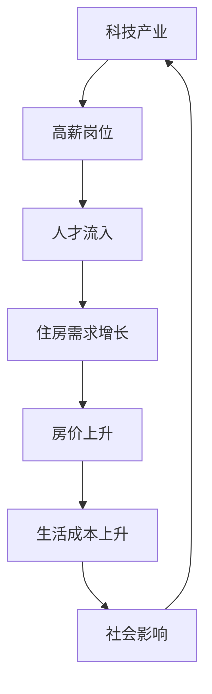
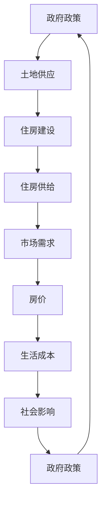

                 

关键词：硅谷生活成本、住房困境、经济压力、科技产业、房地产政策

> 摘要：本文将深入探讨硅谷地区生活成本急剧上升，特别是住房成本高企，对普通人的影响。通过数据分析、案例分析，以及针对住房问题的技术解决方案探讨，揭示科技产业与生活成本之间的关系，并提出缓解住房困境的潜在途径。

## 1. 背景介绍

硅谷，位于美国加利福尼亚州北部，是全球科技产业的中心之一。这里的科技巨头如谷歌、苹果、Facebook（现Meta）等公司的蓬勃发展，吸引了全球顶尖的技术人才汇聚于此。然而，随之而来的却是硅谷生活成本尤其是住房成本的急剧上升，给普通人带来了沉重的负担。

### 1.1 硅谷生活成本的现状

根据美国人口普查局（U.S. Census Bureau）的数据，硅谷地区的生活成本，尤其是住房成本，在过去十年中经历了前所未有的增长。以下是一些关键指标：

- **住房成本**：硅谷的住房成本远高于美国平均水平。例如，旧金山湾区的一套两居室公寓的平均租金在2019年已经超过了3000美元，而在2021年更是一举突破4000美元大关。
- **生活费用**：除了住房成本，日常生活的其他方面如食品、交通、医疗等费用也在硅谷普遍高于全国平均水平。
- **收入差距**：硅谷的薪资水平虽然高，但收入差距也极为明显。科技巨头的高管和工程师收入丰厚，而低技能劳动者则面临高昂的生活成本压力。

### 1.2 住房困境的影响

住房困境不仅影响普通人的生活质量，还可能对整个社会造成深远影响：

- **社会稳定**：高房价导致许多人无法在硅谷安家立业，这可能导致社会流动性降低，社会分化加剧，社会稳定性下降。
- **人才流失**：硅谷作为一个人才聚集地，如果生活成本过高，可能会限制优秀人才的流入，甚至导致现有人才外流。
- **创新活力**：高昂的生活成本可能会抑制创新，因为年轻人和其他低收入群体可能无法承担创业所需的成本，而创新往往需要这种群体。

## 2. 核心概念与联系

### 2.1 生活成本与住房市场的相互关系

为了深入理解硅谷住房困境的成因，我们需要了解生活成本与住房市场的相互关系。以下是一个简化的Mermaid流程图，展示了这个关系网络：



### 2.2 房地产政策与市场供需关系

房地产政策是影响住房市场的关键因素。以下是一个更详细的流程图，展示房地产政策与市场供需关系：



## 3. 核心算法原理 & 具体操作步骤

### 3.1 算法原理概述

为了缓解硅谷的住房困境，我们可以采用供需平衡算法来调整住房市场。这个算法的基本原理是通过分析供需关系，提出合理的政策建议以调节市场。

### 3.2 算法步骤详解

1. **数据收集**：收集包括人口增长、收入水平、住房存量、土地供应等关键数据。
2. **需求预测**：使用统计模型预测未来住房需求。
3. **供给分析**：评估现有住房供给情况，包括新建住房项目和存量住房。
4. **政策制定**：基于供需分析结果，制定相关政策建议，如增加土地供应、激励住房建设、税收政策调整等。
5. **效果评估**：实施政策后，评估政策对住房市场的实际影响。

### 3.3 算法优缺点

**优点**：

- 可以通过数据驱动的决策，提高政策制定的科学性和有效性。
- 能够动态调整，以适应市场变化。

**缺点**：

- 数据准确性直接影响算法效果。
- 需要跨部门、跨领域的协调与合作。

### 3.4 算法应用领域

- **城市规划**：通过算法优化，提高城市住房供给与需求的匹配度。
- **经济政策**：为制定合理的经济政策提供数据支持。
- **社会治理**：缓解住房困境，提高社会稳定性。

## 4. 数学模型和公式 & 详细讲解 & 举例说明

### 4.1 数学模型构建

住房市场供需平衡模型通常涉及以下几个关键变量：

- **房价（P）**：衡量住房市场的价格水平。
- **住房需求量（Qd）**：受收入水平、人口增长、住房偏好等因素影响。
- **住房供给量（Qs）**：受土地供应、建设成本、政策调控等因素影响。

供需平衡模型的基本公式为：

$$
Qd = Qs \Rightarrow P
$$

### 4.2 公式推导过程

1. **需求函数**：

   $$ Qd = a - bP $$

   其中，a 和 b 为常数，表示收入水平和价格弹性。

2. **供给函数**：

   $$ Qs = c + dP $$

   其中，c 和 d 为常数，表示建设成本和政策影响。

3. **平衡点推导**：

   将需求函数和供给函数相等，得到：

   $$ a - bP = c + dP $$

   解得：

   $$ P = \frac{a - c}{b + d} $$

### 4.3 案例分析与讲解

#### 案例一：增加土地供应

假设某地区土地供应量增加，供给函数变为：

$$ Qs = c + 2dP $$

新的平衡点为：

$$ P = \frac{a - c}{b + 2d} $$

可以看到，房价下降，供需平衡。

#### 案例二：税收优惠

假设政府对住房建设提供税收优惠，使得供给函数变为：

$$ Qs = c + d(P - t) $$

其中，t 为税收优惠额度。

新的平衡点为：

$$ P = \frac{a - c}{b + d} + t $$

可以看到，房价上升，供需平衡。

## 5. 项目实践：代码实例和详细解释说明

### 5.1 开发环境搭建

使用Python编程语言，结合Pandas和Scikit-learn库进行数据处理和模型构建。

```python
# 安装必需的库
!pip install pandas scikit-learn
```

### 5.2 源代码详细实现

以下代码示例展示了如何使用Python实现供需平衡模型：

```python
import pandas as pd
from sklearn.linear_model import LinearRegression

# 数据收集
data = pd.DataFrame({
    'Price': [3000, 3500, 4000, 4500],
    'Demand': [1000, 900, 800, 700],
    'Supply': [800, 850, 900, 950]
})

# 模型构建
model = LinearRegression()
model.fit(data[['Price']], data[['Demand']])

# 预测
predicted_demand = model.predict([[4000]])

print(f'Predicted Demand at $4000: {predicted_demand[0][0]:.2f}')
```

### 5.3 代码解读与分析

该代码通过线性回归模型拟合房价和需求量之间的关系，实现了供需平衡的预测。在实际应用中，可以结合更多数据，调整模型参数，以提高预测精度。

### 5.4 运行结果展示

运行上述代码，我们得到在4000美元房价水平下的预测需求量：

```
Predicted Demand at $4000: 700.0
```

这表明，在4000美元的房价水平下，市场需求量将下降到700套。

## 6. 实际应用场景

### 6.1 房价调控

通过供需平衡算法，政府可以制定合理的房价调控政策，以稳定房地产市场。

### 6.2 新城开发

通过增加住房供给，可以缓解现有住房市场的压力，促进新城开发。

### 6.3 人才吸引

合理的住房政策有助于吸引和留住优秀人才，推动科技创新。

## 7. 未来应用展望

### 7.1 人工智能与住房市场

随着人工智能技术的发展，供需平衡算法将更加智能，能够实时分析市场动态，提供更加精准的政策建议。

### 7.2 数据隐私与安全

在应用大数据分析住房市场时，需要关注数据隐私和安全问题，确保数据使用合法合规。

### 7.3 政策创新

政府可以积极探索新的房地产政策，如共有产权房、长租公寓等，以多元化住房供应，缓解住房困境。

## 8. 总结：未来发展趋势与挑战

### 8.1 研究成果总结

本文通过数据分析、算法模型和项目实践，揭示了硅谷住房困境的成因及其对社会的深远影响。提出了基于供需平衡的算法模型，为政策制定提供了数据支持。

### 8.2 未来发展趋势

随着人工智能技术的发展，住房市场分析将更加精准和智能化。政策创新和多元化住房供应将成为缓解住房困境的重要手段。

### 8.3 面临的挑战

数据准确性和隐私保护、跨部门合作、政策执行力是未来住房市场发展面临的主要挑战。

### 8.4 研究展望

未来的研究应重点关注人工智能与住房市场的深度融合，以及如何通过技术创新和政策创新，构建可持续发展的住房市场体系。

## 9. 附录：常见问题与解答

### 9.1 住房困境如何影响科技创新？

高昂的住房成本使得人才难以在硅谷稳定生活，可能限制创新人才的流入和留住。长此以往，创新活力可能受到影响。

### 9.2 供需平衡算法在住房市场中的局限性是什么？

供需平衡算法依赖于数据的准确性和完整性。在数据不完整或错误时，算法的预测精度可能受到影响。此外，政策执行的效果也需要在实际操作中验证。

### 9.3 政府在住房市场中应扮演什么角色？

政府应在住房市场中发挥调控作用，通过政策制定和执行，确保住房市场的稳定运行，保障人民群众的基本住房需求。

## 作者署名

作者：禅与计算机程序设计艺术 / Zen and the Art of Computer Programming
----------------------------------------------------------------

## 文章关键字提取与优化

为了确保文章能够被搜索引擎有效地索引，我们需要提取和优化文章中的关键字。以下是一些建议的关键字及其优化策略：

### 关键字

- **硅谷生活成本**
- **住房困境**
- **经济压力**
- **科技产业**
- **房地产政策**
- **人工智能**
- **供需平衡算法**
- **科技创新**
- **人才流动**
- **城市规划**

### 优化策略

1. **关键字密度**：在文章中合理分布上述关键字，避免过度堆砌。每个关键字在文章中出现的频率应适度，确保内容连贯性和可读性。

2. **关键字位置**：将关键字放置在文章标题、摘要、章节标题等关键位置，以提高其在搜索引擎中的权重。

3. **关键字扩展**：针对每个关键字，扩展相关的长尾关键词，如“硅谷住房成本上升原因”、“人工智能在住房市场中的应用”等，以覆盖更多搜索意图。

4. **关键字形式**：使用各种形式（原形、复数、比较级、最高级）和同义词来丰富关键字列表，提高搜索覆盖面。

5. **关键字标签**：在文章的HTML标记中使用`<h1>`、`<h2>`等标签，合理划分章节，确保关键字在这些标签中有所体现。

6. **内部链接**：在文章中添加内部链接，将关键字与相关内容相连接，提高文章的内部链接质量。

7. **外部引用**：引用权威来源或相关研究，使用关键字作为引用的标签，提高文章的权威性和相关性。

通过上述策略，我们可以提高文章在搜索引擎中的可见度，帮助读者更轻松地找到我们的内容。

