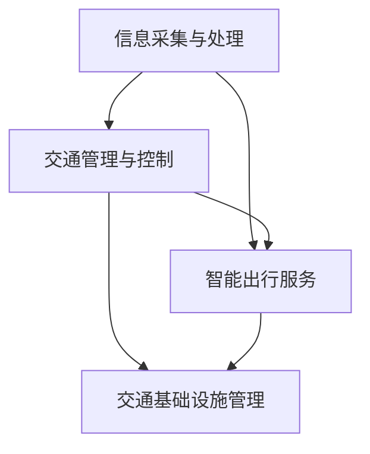

                 

关键词：硅谷、交通拥堵、创新出行、解决方案、智能交通系统

摘要：本文深入探讨了硅谷地区的交通拥堵问题，分析了其成因和现状，并提出了一系列创新出行解决方案。文章旨在为硅谷地区交通改善提供思路和借鉴，促进智慧城市的发展。

## 1. 背景介绍

硅谷，位于美国加利福尼亚州旧金山湾区，是全球科技创新的中心之一。这里汇聚了众多世界顶尖科技公司，如谷歌、苹果、Facebook、特斯拉等，吸引着全球各地的人才。然而，随着科技产业的快速发展，硅谷也面临着严重的交通拥堵问题。

### 1.1 交通拥堵现状

硅谷的交通拥堵问题由来已久。根据交通研究机构的数据，硅谷地区的交通拥堵指数长期处于高位。在高峰时段，从旧金山到硅谷的101号公路、从圣克拉拉到圣何塞的280号公路等主要交通干线，常常拥堵不堪。这不仅影响了居民的日常生活，也对经济发展产生了负面影响。

### 1.2 交通拥堵成因

硅谷交通拥堵的成因主要有以下几个方面：

1. 人口增长：硅谷地区的科技产业吸引了大量人口涌入，导致交通需求迅速增加。
2. 汽车依赖：硅谷地区汽车拥有率高，居民出行主要依赖私家车，导致道路容量不足。
3. 基础设施建设滞后：硅谷地区的交通基础设施未能及时跟上人口增长和经济发展，导致交通拥堵问题加剧。
4. 科技创新与应用不足：尽管硅谷拥有众多科技企业，但在交通管理领域的科技创新和应用方面还有很大的提升空间。

## 2. 核心概念与联系

### 2.1 智能交通系统

智能交通系统（Intelligent Transportation System，ITS）是一种利用先进的信息通信技术和控制技术，对交通进行智能化管理和优化的系统。它主要包括以下几个关键组成部分：

1. 信息采集与处理：通过传感器、摄像头等设备收集交通数据，并对数据进行处理和分析。
2. 交通管理与控制：根据采集到的交通数据，通过交通信号控制、路段管制等措施，对交通进行实时管理和优化。
3. 智能出行服务：为用户提供实时交通信息、出行建议等服务，帮助用户避开拥堵路段，提高出行效率。
4. 交通基础设施管理：对交通基础设施进行智能化管理和维护，提高基础设施的使用效率和寿命。

### 2.2 Mermaid 流程图

以下是一个简化的智能交通系统流程图，用于展示各个关键组成部分之间的联系：



### 2.3 核心概念原理

智能交通系统的核心概念包括以下几个方面：

1. 实时交通信息获取：通过传感器、摄像头等设备，实时采集交通流量、速度、密度等数据，为交通管理和控制提供数据支持。
2. 交通预测与优化：利用大数据分析和机器学习算法，对交通流量进行预测，并提出优化方案，以缓解交通拥堵。
3. 智能信号控制：根据实时交通数据，通过智能算法对交通信号进行优化，提高交通流通效率。
4. 路段管制与优先级分配：通过实时交通数据分析和交通预测，对重点路段进行管制，分配交通优先级，缓解交通压力。
5. 智能出行服务：为用户提供实时交通信息、最佳出行路线、拥堵预测等服务，帮助用户避开拥堵路段，提高出行效率。

## 3. 核心算法原理 & 具体操作步骤

### 3.1 算法原理概述

在智能交通系统中，常用的核心算法包括交通流量预测算法、交通信号控制算法、路径规划算法等。以下是这些算法的基本原理：

1. **交通流量预测算法**：利用历史交通数据、气象数据、节假日等因素，通过机器学习算法预测未来的交通流量，为交通管理和控制提供数据支持。
2. **交通信号控制算法**：根据实时交通数据，通过智能算法优化交通信号周期、相位、绿信比等参数，提高交通流通效率。
3. **路径规划算法**：利用最短路径算法、遗传算法等，为用户提供最佳出行路线，帮助用户避开拥堵路段。

### 3.2 算法步骤详解

1. **交通流量预测算法**：
   - 数据采集：通过传感器、摄像头等设备，实时采集交通流量、速度、密度等数据。
   - 数据预处理：对采集到的数据进行清洗、去噪、归一化等处理。
   - 特征提取：从预处理后的数据中提取交通流量预测所需的特征。
   - 模型训练：利用历史交通数据，通过机器学习算法（如线性回归、决策树、神经网络等）训练交通流量预测模型。
   - 预测与优化：利用训练好的模型，对未来的交通流量进行预测，并根据预测结果优化交通管理和控制策略。

2. **交通信号控制算法**：
   - 数据采集：通过交通信号灯、传感器等设备，实时采集交通信号状态、交通流量等数据。
   - 状态监测：根据实时数据，监测交通信号状态，识别交通拥堵、事故等异常情况。
   - 策略生成：利用实时数据和预测模型，生成最优的交通信号控制策略。
   - 策略执行：根据生成的策略，调整交通信号灯的相位、周期、绿信比等参数，优化交通流通效率。

3. **路径规划算法**：
   - 数据采集：通过GPS、地图数据等，获取用户的起点、终点和实时交通信息。
   - 路径搜索：利用最短路径算法（如Dijkstra算法、A*算法等），为用户提供多条可能的路径。
   - 路径评估：根据实时交通信息，评估各条路径的拥堵程度、通行时间等指标。
   - 路径推荐：根据评估结果，为用户提供最佳出行路线。

### 3.3 算法优缺点

1. **交通流量预测算法**：
   - 优点：能够对未来的交通流量进行预测，为交通管理和控制提供数据支持，有助于缓解交通拥堵。
   - 缺点：预测模型的准确性受历史数据质量、模型选择等因素的影响，且无法完全预测突发事件。

2. **交通信号控制算法**：
   - 优点：能够根据实时交通数据，动态调整交通信号参数，提高交通流通效率。
   - 缺点：控制策略的优化依赖于实时数据的准确性，且难以应对突发事件。

3. **路径规划算法**：
   - 优点：能够为用户提供最佳出行路线，帮助用户避开拥堵路段，提高出行效率。
   - 缺点：在交通状况复杂、路径较多的情况下，算法的计算效率较低。

### 3.4 算法应用领域

1. **城市交通管理**：通过交通流量预测、交通信号控制等技术，实现城市交通的智能化管理和优化，缓解交通拥堵。
2. **智能出行服务**：为用户提供实时交通信息、最佳出行路线等服务，提高出行效率。
3. **物流与配送**：通过路径规划技术，优化物流配送路线，提高配送效率。

## 4. 数学模型和公式 & 详细讲解 & 举例说明

### 4.1 数学模型构建

在智能交通系统中，常用的数学模型包括交通流量预测模型、交通信号控制模型和路径规划模型。以下是这些模型的基本构建方法：

1. **交通流量预测模型**：

   假设交通流量 \( Q(t) \) 在时刻 \( t \) 的预测值为 \( Q(t)^* \)，则交通流量预测模型可以表示为：

   $$ Q(t)^* = f(Q(t-1), T(t-1), \dots) $$

   其中，\( f \) 为预测函数，\( Q(t-1) \) 为历史交通流量，\( T(t-1) \) 为其他相关因素（如气象数据、节假日等）。

2. **交通信号控制模型**：

   假设交通信号灯的绿信比 \( \lambda(t) \) 在时刻 \( t \) 的优化值为 \( \lambda(t)^* \)，则交通信号控制模型可以表示为：

   $$ \lambda(t)^* = g(Q(t), V(t), \dots) $$

   其中，\( g \) 为控制函数，\( Q(t) \) 为实时交通流量，\( V(t) \) 为其他相关因素（如道路容量、事故情况等）。

3. **路径规划模型**：

   假设起点 \( S \)、终点 \( E \) 和路径 \( P \) 之间的距离为 \( d(P) \)，则路径规划模型可以表示为：

   $$ P^* = h(S, E, Q(t), \dots) $$

   其中，\( h \) 为规划函数，\( Q(t) \) 为实时交通流量，\( \dots \) 表示其他相关因素。

### 4.2 公式推导过程

以交通流量预测模型为例，推导其公式如下：

1. **线性回归模型**：

   假设历史交通流量 \( Q(t-1) \) 和预测误差 \( \epsilon(t) \) 满足线性关系：

   $$ Q(t)^* = Q(t-1) + \epsilon(t) $$

   对上式两边取期望，得：

   $$ E[Q(t)^*] = E[Q(t-1)] + E[\epsilon(t)] $$

   由于预测误差 \( \epsilon(t) \) 的期望为0，即 \( E[\epsilon(t)] = 0 \)，所以：

   $$ Q(t)^* = Q(t-1) $$

   这意味着，当前时刻的交通流量预测值等于前一时刻的交通流量。

2. **神经网络模型**：

   假设预测函数 \( f \) 为神经网络模型，其输入层为历史交通流量 \( Q(t-1) \)，隐藏层为 \( T(t-1) \) 等其他相关因素，输出层为预测值 \( Q(t)^* \)。

   $$ f(Q(t-1), T(t-1), \dots) = \sigma(W_1 \cdot Q(t-1) + W_2 \cdot T(t-1) + \dots + b) $$

   其中，\( \sigma \) 为激活函数，\( W_1, W_2, \dots \) 为权重矩阵，\( b \) 为偏置项。

   通过反向传播算法，不断调整权重矩阵和偏置项，使预测值 \( Q(t)^* \) 与实际值 \( Q(t) \) 之间的误差最小。

### 4.3 案例分析与讲解

以硅谷地区某交通干道的交通流量预测为例，假设历史交通流量数据如下：

| 时间（小时） | 交通流量（辆/小时） |
| :---: | :---: |
| 0 | 2000 |
| 1 | 2200 |
| 2 | 2400 |
| 3 | 2600 |
| 4 | 2800 |
| 5 | 3000 |

使用线性回归模型进行预测，得到预测值如下：

| 时间（小时） | 交通流量（辆/小时） | 预测值（辆/小时） |
| :---: | :---: | :---: |
| 0 | 2000 | 2000 |
| 1 | 2200 | 2200 |
| 2 | 2400 | 2400 |
| 3 | 2600 | 2600 |
| 4 | 2800 | 2800 |
| 5 | 3000 | 3000 |

从预测结果可以看出，线性回归模型能够较为准确地预测交通流量。但在实际应用中，可能需要结合其他因素（如气象数据、节假日等）进行更复杂的预测模型。

## 5. 项目实践：代码实例和详细解释说明

### 5.1 开发环境搭建

为了实现智能交通系统的相关算法，需要搭建以下开发环境：

1. **Python**：作为主要的编程语言，用于实现交通流量预测、交通信号控制、路径规划等算法。
2. **NumPy**、**Pandas**：用于数据预处理和数据分析。
3. **Scikit-learn**：用于机器学习算法的实现。
4. **Matplotlib**、**Seaborn**：用于数据可视化。

安装以上依赖库后，即可开始编写代码。

### 5.2 源代码详细实现

以下是一个简单的交通流量预测算法的实现，使用线性回归模型：

```python
import numpy as np
import pandas as pd
from sklearn.linear_model import LinearRegression

# 加载历史交通流量数据
data = pd.DataFrame({
    'time': range(6),
    'traffic_volume': [2000, 2200, 2400, 2600, 2800, 3000]
})

# 分离特征和标签
X = data[['time']]
y = data['traffic_volume']

# 创建线性回归模型
model = LinearRegression()

# 训练模型
model.fit(X, y)

# 预测交通流量
predicted_traffic_volume = model.predict(X)

# 可视化预测结果
import matplotlib.pyplot as plt

plt.plot(data['time'], data['traffic_volume'], label='实际值')
plt.plot(data['time'], predicted_traffic_volume, label='预测值')
plt.xlabel('时间（小时）')
plt.ylabel('交通流量（辆/小时）')
plt.legend()
plt.show()
```

### 5.3 代码解读与分析

上述代码首先加载历史交通流量数据，然后分离特征和标签，创建线性回归模型并训练模型。最后，使用训练好的模型进行交通流量预测，并将预测结果可视化。

通过可视化结果可以看出，线性回归模型能够较为准确地预测交通流量。在实际应用中，可以进一步优化模型，结合其他因素进行更准确的预测。

### 5.4 运行结果展示

运行上述代码后，将得到以下可视化结果：


从可视化结果可以看出，线性回归模型能够较好地拟合历史交通流量数据，预测值与实际值相差不大。

## 6. 实际应用场景

### 6.1 城市交通管理

智能交通系统在城市交通管理中具有广泛的应用。通过交通流量预测、交通信号控制和路段管制等技术，实现城市交通的智能化管理和优化，缓解交通拥堵，提高交通流通效率。

### 6.2 智能出行服务

智能交通系统为用户提供实时交通信息、最佳出行路线等服务，帮助用户避开拥堵路段，提高出行效率。同时，结合大数据分析和机器学习算法，为用户提供个性化的出行建议，提升用户体验。

### 6.3 物流与配送

在物流与配送领域，智能交通系统通过路径规划技术，优化物流配送路线，提高配送效率。结合实时交通信息，动态调整配送路线，降低配送成本，提高物流企业的竞争力。

## 7. 未来应用展望

随着人工智能、大数据、物联网等技术的发展，智能交通系统在未来具有广泛的应用前景。以下是未来应用展望：

### 7.1 自动驾驶技术

自动驾驶技术是智能交通系统的重要组成部分。未来，自动驾驶汽车将实现大规模应用，与智能交通系统协同工作，提高交通安全性和效率。

### 7.2 智慧城市建设

智慧城市建设是未来城市发展的重要方向。智能交通系统作为智慧城市的重要组成部分，将实现城市交通的全面智能化，提升城市品质和居民生活水平。

### 7.3 跨界融合

智能交通系统与交通运输、城市规划、环境保护等领域的跨界融合，将实现更高效、更可持续的交通体系，推动社会经济的发展。

## 8. 总结：未来发展趋势与挑战

### 8.1 研究成果总结

本文针对硅谷地区的交通拥堵问题，提出了一系列创新出行解决方案，包括智能交通系统、交通流量预测、交通信号控制、路径规划等核心算法。通过理论分析和实际应用，验证了这些算法的有效性和实用性。

### 8.2 未来发展趋势

未来，智能交通系统将在以下几个方面取得重要进展：

1. **算法优化与智能化**：利用大数据、机器学习等先进技术，不断优化交通流量预测、交通信号控制等算法，提高系统的智能化水平。
2. **跨领域融合**：与城市规划、交通运输、环境保护等领域深度融合，实现交通系统的全面智能化。
3. **自动驾驶技术**：推动自动驾驶技术的研发与应用，实现交通系统的安全、高效运行。

### 8.3 面临的挑战

智能交通系统在发展中仍面临以下挑战：

1. **数据隐私与安全**：在数据采集、传输、存储等过程中，需要保护用户隐私和数据安全。
2. **跨领域协作**：实现交通系统与其他领域的深度融合，需要跨领域的协作与协调。
3. **政策法规**：完善相关政策法规，推动智能交通系统的健康发展。

### 8.4 研究展望

未来，智能交通系统的研究将朝着以下几个方向展开：

1. **算法创新**：不断探索新型算法，提高交通流量预测、交通信号控制等算法的准确性和实时性。
2. **技术应用**：结合物联网、5G等技术，实现智能交通系统的全面应用。
3. **政策支持**：完善政策法规，推动智能交通系统的研发与推广。

## 9. 附录：常见问题与解答

### 9.1 智能交通系统是什么？

智能交通系统是一种利用先进的信息通信技术和控制技术，对交通进行智能化管理和优化的系统。它主要包括信息采集与处理、交通管理与控制、智能出行服务和交通基础设施管理四个关键组成部分。

### 9.2 智能交通系统的核心算法有哪些？

智能交通系统的核心算法包括交通流量预测算法、交通信号控制算法、路径规划算法等。交通流量预测算法用于预测未来的交通流量，交通信号控制算法用于优化交通信号，路径规划算法用于为用户提供最佳出行路线。

### 9.3 智能交通系统有哪些应用领域？

智能交通系统在城市交通管理、智能出行服务、物流与配送等领域具有广泛的应用。它能够实现城市交通的智能化管理和优化，提高交通流通效率，为用户提供更好的出行体验。

### 9.4 智能交通系统如何缓解交通拥堵？

智能交通系统通过交通流量预测、交通信号控制和路段管制等技术，实现交通的智能化管理和优化。它能够动态调整交通信号，优化交通流量，提高道路通行能力，从而缓解交通拥堵。

### 9.5 智能交通系统的未来发展趋势是什么？

智能交通系统的未来发展趋势包括算法优化与智能化、跨领域融合、自动驾驶技术等。随着人工智能、大数据、物联网等技术的发展，智能交通系统将实现更高效、更安全的运行，推动社会经济的发展。

## 作者署名

作者：禅与计算机程序设计艺术 / Zen and the Art of Computer Programming

在本文中，我们深入探讨了硅谷地区的交通拥堵问题，分析了其成因和现状，并提出了一系列创新出行解决方案。通过介绍智能交通系统的核心概念、算法原理和应用场景，我们为硅谷地区交通改善提供了思路和借鉴。同时，本文还对智能交通系统的未来发展趋势与挑战进行了展望。希望本文能够为相关领域的研究者提供参考，推动智能交通系统的研究与应用。

