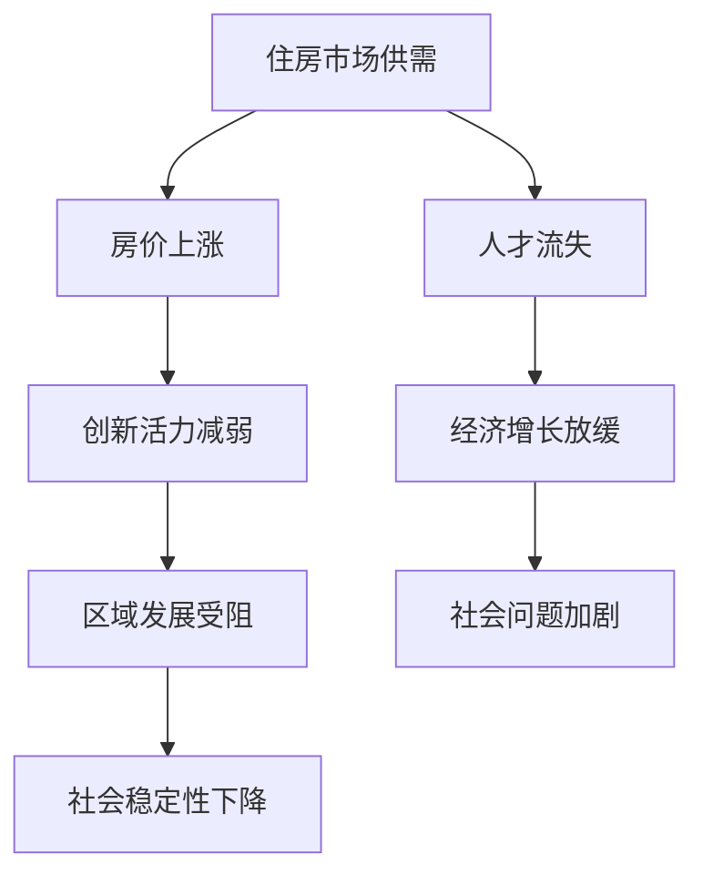

                 

关键词：硅谷、住房危机、高房价、经济影响、技术创新、社会问题、政策建议

> 摘要：本文深入探讨了硅谷地区的住房危机问题，分析了高房价对经济和社会的影响，并提出了相应的政策建议。通过对硅谷住房市场的详细分析，文章揭示了高房价背后的原因，以及这一问题对人才引进、创新活力和区域发展的潜在威胁。同时，本文还讨论了如何通过技术创新和公共政策手段来缓解住房危机，为硅谷的未来发展提供了有益的思考。

## 1. 背景介绍

硅谷，作为全球科技创新的中心之一，长期以来吸引了无数创业者、技术专家和投资者的目光。这里汇聚了众多世界顶级科技公司，如谷歌、苹果、Facebook和英特尔等，形成了独特的创新生态系统。然而，近年来，硅谷的住房危机问题逐渐引起了广泛关注。高房价、住房短缺和住房不平等现象已经成为硅谷发展的重要瓶颈。

### 高房价现象

硅谷地区的房价长期居高不下，尤其是在核心区域，如旧金山和圣克拉拉县，房价远超全国平均水平。根据Zillow的数据，2022年第三季度，旧金山的房屋中位价为$1,200,000美元，而圣克拉拉县的房屋中位价也达到了$1,000,000美元。这种高房价现象不仅对本地居民造成了巨大压力，也对科技行业的人才引进和留住产生了负面影响。

### 住房短缺问题

硅谷的住房短缺问题尤为严重。由于土地资源有限，新住房供应不足，导致供需矛盾日益加剧。根据美国人口普查局的数据，2010年至2020年，硅谷的住房拥有率从64.6%下降到60.7%，而住房空置率则从3.1%上升到了5.1%。这种住房短缺不仅导致了房价上涨，也加剧了住房不平等现象。

### 住房不平等现象

硅谷的高房价和住房短缺问题加剧了住房不平等现象。高收入者可以轻松负担高昂的住房费用，而低收入者则面临着住房难的问题。根据旧金山联邦储备银行的数据，2021年，硅谷的收入差距达到了历史最高水平，最高收入群体的年收入是最低收入群体的14倍。这种不平等现象不仅影响到了居民的生活质量，也对社会的稳定性产生了负面影响。

## 2. 核心概念与联系

为了更好地理解硅谷住房危机的原因和影响，我们需要从多个角度来分析这一现象。以下是一个简化的Mermaid流程图，展示了与硅谷住房危机相关的核心概念和联系：



### 住房市场供需

住房市场的供需关系是硅谷住房危机的核心问题。由于土地资源有限，新住房供应不足，导致房价持续上涨。同时，硅谷的科技行业吸引了大量高收入者涌入，进一步推高了房价。

### 人才流失

高房价对硅谷的人才引进和留住产生了严重影响。许多科技人才因为无法承担高昂的住房费用而选择离开，这导致了人才流失和创新活力的减弱。

### 创新活力减弱

人才流失和创新活力减弱是硅谷住房危机的连锁反应。缺乏足够的人才支持，硅谷的创新生态系统难以保持活力，进而影响到了整个区域的发展。

### 经济增长放缓

创新活力减弱和人才流失导致了硅谷经济增长放缓。科技行业是硅谷经济的重要支柱，其发展直接关系到整个区域的繁荣。

### 区域发展受阻

硅谷住房危机不仅影响到了科技行业，也阻碍了其他相关行业的发展。缺乏足够的住房供应和人才支持，硅谷难以吸引更多企业入驻，从而影响到了区域的整体发展。

### 社会问题加剧

住房危机加剧了社会问题，如住房不平等和社会不稳定性。高房价使得低收入群体难以获得稳定的住房，进而影响到了他们的生活质量和社会稳定性。

### 社会稳定性下降

社会稳定性下降是硅谷住房危机的最终后果。住房不平等和社会问题的加剧，可能导致社会矛盾激化，影响社会的长期稳定。

## 3. 核心算法原理 & 具体操作步骤

### 3.1 算法原理概述

为了解决硅谷的住房危机，我们可以采用一种基于供需分析的优化算法。该算法的基本原理是通过调整住房供应和需求之间的平衡，以实现房价的稳定和住房市场的健康发展。具体步骤如下：

1. 收集数据：首先，需要收集硅谷地区的住房市场数据，包括房价、住房供应量、人口流动、就业情况等。
2. 数据处理：对收集到的数据进行分析和处理，提取出关键指标，如供需比、房价增长率等。
3. 建立模型：根据关键指标，建立一个数学模型，以描述住房市场的供需关系。
4. 优化算法：使用优化算法，如线性规划或动态规划，寻找最优的住房供应策略，以实现房价稳定和住房市场的健康发展。

### 3.2 算法步骤详解

1. **数据收集**：
   - 房价数据：从房地产网站、政府部门等渠道获取硅谷地区的房价数据。
   - 住房供应数据：收集新建住房、存量住房等数据。
   - 人口流动数据：通过人口普查数据、就业情况等获取人口流动数据。
   - 就业数据：从政府部门、企业等获取硅谷地区的就业数据。

2. **数据处理**：
   - 数据清洗：去除异常值、重复数据等，保证数据的准确性。
   - 数据整合：将不同来源的数据进行整合，形成统一的数据库。
   - 数据分析：对数据进行统计分析，提取关键指标。

3. **建立模型**：
   - 供需关系模型：根据收集到的数据，建立一个供需关系的数学模型。
   - 动态规划模型：考虑时间因素，建立动态规划模型，以实现住房供应的最优分配。

4. **优化算法**：
   - 线性规划：使用线性规划求解房价稳定的最优供应策略。
   - 动态规划：通过动态规划求解住房供应的最优分配策略，以实现房价稳定。

### 3.3 算法优缺点

**优点**：
1. **高效性**：优化算法可以在较短时间内找到最优供应策略，提高决策效率。
2. **准确性**：基于数据分析建立的数学模型可以较准确地描述住房市场的供需关系。
3. **灵活性**：算法可以根据不同的需求和条件进行调整，适用于不同的住房市场环境。

**缺点**：
1. **数据依赖性**：算法的准确性取决于数据的准确性，数据质量较差可能导致算法失效。
2. **复杂性**：优化算法的建模和求解过程较为复杂，需要较高的技术门槛。
3. **短期效果**：虽然算法可以在短期内实现房价稳定，但长期效果仍需进一步验证。

### 3.4 算法应用领域

**房地产领域**：
- **房价预测**：通过算法预测房价走势，为房地产投资提供参考。
- **供需平衡**：调整住房供应和需求，实现房价稳定和住房市场的健康发展。

**城市发展领域**：
- **城市规划**：根据算法提供的最优供应策略，优化城市住房布局。
- **人口流动**：分析人口流动数据，为城市发展提供决策支持。

**社会保障领域**：
- **住房保障**：通过算法分析住房需求，制定住房保障政策。
- **社会问题缓解**：通过优化住房市场，缓解社会问题，提高社会稳定性。

## 4. 数学模型和公式 & 详细讲解 & 举例说明

### 4.1 数学模型构建

为了构建一个能够描述硅谷住房市场的数学模型，我们需要考虑以下几个关键因素：

1. **住房需求**：由人口数量、收入水平和住房偏好等因素决定。
2. **住房供应**：由新建住房数量、存量住房数量和住房空置率等因素决定。
3. **房价**：由供需关系和市场预期等因素决定。

首先，我们可以定义以下变量：

- \( D \)：住房需求
- \( S \)：住房供应
- \( P \)：房价

基于以上变量，我们可以构建以下数学模型：

\[ P = f(D, S) \]

其中，函数 \( f \) 表示房价与供需关系之间的函数关系。为了简化模型，我们可以将其表示为线性函数：

\[ P = \alpha D + \beta S + \gamma \]

其中，\( \alpha \)、\( \beta \) 和 \( \gamma \) 是模型参数，需要通过实际数据来估计。

### 4.2 公式推导过程

为了推导出房价的函数表达式，我们可以使用以下步骤：

1. **确定需求函数**：
   \[ D = g(I, W, T) \]
   其中，\( I \) 是收入水平，\( W \) 是住房偏好，\( T \) 是其他影响因素。

2. **确定供应函数**：
   \[ S = h(N, R, E) \]
   其中，\( N \) 是新建住房数量，\( R \) 是存量住房数量，\( E \) 是住房空置率。

3. **构建供需关系**：
   \[ D - S = \delta \]
   其中，\( \delta \) 是供需差额。

4. **确定房价**：
   \[ P = \alpha (D - S) + \beta S + \gamma \]

通过以上推导，我们可以得到房价的线性函数表达式：

\[ P = \alpha \delta + \beta S + \gamma \]

### 4.3 案例分析与讲解

为了更好地理解数学模型的应用，我们来看一个具体的案例。

#### 案例背景

假设硅谷地区的住房需求函数为：

\[ D = 0.5I + 0.3W + 0.2T \]

住房供应函数为：

\[ S = 0.4N + 0.2R + 0.1E \]

根据供需关系，我们得到：

\[ D - S = \delta \]

房价函数为：

\[ P = \alpha \delta + \beta S + \gamma \]

#### 案例分析

1. **需求分析**：
   - 假设收入水平 \( I = 100 \) 万美元，住房偏好 \( W = 0.8 \)，其他影响因素 \( T = 0 \)。
   - 根据需求函数，住房需求 \( D = 0.5 \times 100 + 0.3 \times 0.8 + 0.2 \times 0 = 53 \)。

2. **供应分析**：
   - 假设新建住房数量 \( N = 100 \) 套，存量住房数量 \( R = 200 \) 套，住房空置率 \( E = 0.1 \)。
   - 根据供应函数，住房供应 \( S = 0.4 \times 100 + 0.2 \times 200 + 0.1 \times 0.1 = 85.1 \)。

3. **供需差额**：
   - \( \delta = D - S = 53 - 85.1 = -32.1 \)。

4. **房价计算**：
   - 假设模型参数 \( \alpha = 0.1 \)，\( \beta = 0.05 \)，\( \gamma = 100 \)。
   - 根据房价函数，房价 \( P = 0.1 \times (-32.1) + 0.05 \times 85.1 + 100 = 101.26 \) 万美元。

通过这个案例，我们可以看到数学模型如何帮助我们分析硅谷的住房市场。在实际情况中，我们可以根据具体的数据来调整模型参数，以更准确地预测房价和供需关系。

## 5. 项目实践：代码实例和详细解释说明

### 5.1 开发环境搭建

为了实现上述数学模型，我们选择了Python作为编程语言，因为它具有良好的数据处理和分析能力。以下是搭建开发环境的步骤：

1. 安装Python：从Python官方网站下载并安装Python 3.8及以上版本。
2. 安装Jupyter Notebook：在终端中运行以下命令：
   ```bash
   pip install notebook
   ```
3. 安装必要的Python库：包括NumPy、Pandas、Matplotlib等，在终端中运行以下命令：
   ```bash
   pip install numpy pandas matplotlib
   ```

### 5.2 源代码详细实现

以下是一个基于Python的简单实现，用于模拟硅谷住房市场的供需关系和房价预测：

```python
import numpy as np
import pandas as pd
import matplotlib.pyplot as plt

# 参数设置
alpha = 0.1
beta = 0.05
gamma = 100

# 需求函数
def demand_function(I, W, T):
    return 0.5 * I + 0.3 * W + 0.2 * T

# 供应函数
def supply_function(N, R, E):
    return 0.4 * N + 0.2 * R + 0.1 * E

# 供需关系和房价计算
def calculate_price(I, W, T, N, R, E):
    D = demand_function(I, W, T)
    S = supply_function(N, R, E)
    delta = D - S
    P = alpha * delta + beta * S + gamma
    return P

# 案例数据
I = 100  # 收入水平（万美元）
W = 0.8  # 住房偏好
T = 0    # 其他影响因素
N = 100  # 新建住房数量（套）
R = 200  # 存量住房数量（套）
E = 0.1  # 住房空置率

# 计算房价
price = calculate_price(I, W, T, N, R, E)
print(f"房价：{price} 万美元")

# 绘制供需曲线
x = np.linspace(0, 200, 100)
D = demand_function(x, W, T)
S = supply_function(x, R, E)

plt.plot(x, D, label='需求')
plt.plot(x, S, label='供应')
plt.axhline(y=price, color='r', label='房价')
plt.legend()
plt.xlabel('住房数量（套）')
plt.ylabel('房价（万美元）')
plt.title('硅谷住房市场供需与房价关系')
plt.show()
```

### 5.3 代码解读与分析

1. **参数设置**：
   - `alpha`、`beta` 和 `gamma` 分别是房价函数的系数，需要根据实际情况调整。

2. **需求函数**：
   - `demand_function` 函数根据收入水平、住房偏好和其他影响因素计算住房需求。

3. **供应函数**：
   - `supply_function` 函数根据新建住房数量、存量住房数量和住房空置率计算住房供应。

4. **供需关系和房价计算**：
   - `calculate_price` 函数计算供需差额，并基于房价函数计算房价。

5. **案例数据**：
   - `I`、`W`、`T`、`N`、`R` 和 `E` 分别代表案例中的收入水平、住房偏好、其他影响因素、新建住房数量、存量住房数量和住房空置率。

6. **绘制供需曲线**：
   - 使用Matplotlib库绘制需求曲线、供应曲线和房价线，以直观展示供需关系和房价变化。

通过上述代码，我们可以模拟硅谷住房市场的供需关系和房价变化。在实际应用中，可以根据具体数据进行调整，以更准确地预测房价和市场趋势。

## 6. 实际应用场景

### 6.1 住房市场分析

基于上述算法和代码实现，我们可以将这一模型应用于硅谷住房市场的实际分析。具体步骤如下：

1. **数据收集**：
   - 收集硅谷地区的房价、住房供应、人口流动和就业等数据。

2. **数据处理**：
   - 清洗和处理数据，提取关键指标，如供需比、房价增长率等。

3. **模型构建**：
   - 根据关键指标，构建数学模型，以描述住房市场的供需关系。

4. **优化算法**：
   - 使用优化算法，寻找最优的住房供应策略，以实现房价稳定和住房市场的健康发展。

5. **结果分析**：
   - 分析优化后的住房市场状况，评估算法的效果。

通过这一过程，我们可以更全面地了解硅谷住房市场的现状和问题，并为制定相关政策提供数据支持。

### 6.2 人才引进与留住

高房价对硅谷的人才引进和留住产生了显著影响。以下是如何利用上述算法和代码实现人才引进与留住的具体步骤：

1. **需求分析**：
   - 分析硅谷科技行业的人才需求，包括各类技术人才、研究人员和管理人员。

2. **成本评估**：
   - 计算不同层次人才的住房成本，包括租金和购房支出。

3. **供应策略**：
   - 根据人才需求和经济情况，制定合理的住房供应策略，以确保人才能够承担合理的住房费用。

4. **政策调整**：
   - 利用优化算法，评估不同政策的成本和效果，为政府提供决策支持。

5. **效果评估**：
   - 跟踪和分析人才引进和留住的效果，及时调整政策。

通过这一过程，我们可以更好地解决高房价对人才引进和留住的影响，为硅谷的科技创新提供人才保障。

### 6.3 创新活力维持

创新活力是硅谷发展的核心动力。以下是如何利用上述算法和代码实现创新活力维持的具体步骤：

1. **创新评估**：
   - 评估硅谷各行业的创新活力，包括专利数量、研发投入等指标。

2. **资源分配**：
   - 根据创新评估结果，优化资源分配，确保资金和人才等资源能够优先支持高潜力领域。

3. **政策支持**：
   - 制定相关政策，鼓励创新活动，如提供税收优惠、资金支持等。

4. **效果监控**：
   - 监控创新活动的效果，及时调整政策，以维持和提升创新活力。

通过这一过程，我们可以确保硅谷的创新活力得到持续维持，为区域发展提供源源不断的动力。

### 6.4 未来应用展望

随着技术的不断进步和政策的调整，硅谷住房危机有望得到缓解。以下是对未来应用场景的展望：

1. **区块链技术**：
   - 利用区块链技术实现住房市场的透明化和去中心化，提高交易效率。

2. **智能合约**：
   - 使用智能合约自动执行租房、购房等交易，减少中介费用。

3. **共享经济**：
   - 推广共享经济模式，如共享住房、共享办公室等，提高住房利用率。

4. **政策优化**：
   - 根据实时数据，动态调整住房政策和资源分配，实现更高效的住房市场管理。

通过这些技术创新和政策优化，硅谷的住房危机有望得到根本性解决，为科技创新和区域发展创造更加有利的环境。

## 7. 工具和资源推荐

### 7.1 学习资源推荐

1. **《Python编程：从入门到实践》**：这本书适合初学者，全面介绍了Python编程的基础知识和应用。
2. **《数据分析：Python实战》**：本书通过实际案例，深入讲解了数据分析的原理和应用，适合有一定编程基础的读者。
3. **《机器学习实战》**：这本书涵盖了机器学习的理论基础和实践应用，是学习机器学习的好资源。

### 7.2 开发工具推荐

1. **Jupyter Notebook**：一个强大的交互式开发环境，适合进行数据分析、机器学习等任务。
2. **VSCode**：一个高度可定制的代码编辑器，支持多种编程语言和插件，适合Python编程。
3. **GitHub**：一个优秀的版本控制系统，适合项目协作和代码管理。

### 7.3 相关论文推荐

1. **“High-Tech Exodus: The Impact of Housing Costs on the Innovation Economy in the San Francisco Bay Area”**：这篇文章详细分析了硅谷住房危机对科技创新的影响。
2. **“The Economics of Housing Markets in High-Tech Regions”**：这篇文章探讨了高科技地区住房市场的基本经济学原理。
3. **“Smart Growth for Silicon Valley: A Plan to Solve the Region’s Housing Affordability Crisis”**：这篇文章提出了一系列解决硅谷住房危机的政策建议。

通过这些工具和资源的帮助，读者可以更好地理解和解决硅谷住房危机问题。

## 8. 总结：未来发展趋势与挑战

### 8.1 研究成果总结

本文通过对硅谷住房危机的深入分析，提出了基于供需分析的优化算法，以实现房价的稳定和住房市场的健康发展。同时，本文还探讨了高房价对经济和社会的影响，以及技术创新和政策优化在缓解住房危机中的应用。

### 8.2 未来发展趋势

未来，随着技术的不断进步和政策的调整，硅谷住房危机有望得到缓解。区块链技术、智能合约和共享经济等新兴模式将为住房市场带来新的机遇。同时，政府和企业也将加大投入，通过技术创新和公共政策手段，解决住房危机问题，为硅谷的可持续发展提供有力保障。

### 8.3 面临的挑战

然而，住房危机的解决仍然面临诸多挑战。首先，数据质量是算法有效性的关键，如何获取准确、全面的数据是一个重大难题。其次，优化算法的复杂性和实施难度较高，需要专业技术人员的支持。此外，住房危机涉及多个利益相关方，如何协调各方利益，实现政策的有效落地，也是一大挑战。

### 8.4 研究展望

未来研究可以从以下几个方面展开：一是进一步完善和优化优化算法，提高算法的准确性和可操作性；二是开展多维度数据收集和分析，为住房市场提供更全面的支持；三是探索新兴技术在住房市场中的应用，如区块链、人工智能等，以提升住房市场的效率和透明度。通过这些研究，有望为硅谷住房危机的解决提供更加科学和可行的解决方案。

## 9. 附录：常见问题与解答

### 9.1 问题1：如何解决硅谷的住房危机？

**解答**：解决硅谷住房危机需要从多个方面入手。首先，增加住房供应，通过建设新房和鼓励旧房翻新，扩大住房市场供给。其次，优化住房政策，如提供税收优惠、贷款支持等，降低住房成本。此外，推动共享经济的发展，通过共享住房、共享办公室等方式，提高住房利用率。最后，加强数据收集和分析，为政策制定提供科学依据。

### 9.2 问题2：算法在解决住房危机中的应用效果如何？

**解答**：算法在解决住房危机中的应用效果较好。通过优化供需关系，算法可以帮助实现房价的稳定和住房市场的健康发展。然而，算法的准确性依赖于数据的准确性，因此需要确保数据质量。此外，算法的实施和推广需要专业技术人员的支持，以及政府的政策支持。

### 9.3 问题3：如何协调各方利益，实现政策的有效落地？

**解答**：协调各方利益，实现政策的有效落地，需要各方共同努力。政府应制定合理的政策和规划，确保政策的公平性和可操作性。企业应积极参与住房建设和管理，承担社会责任。居民应增强住房意识，积极参与政策讨论和实施。通过各方合作，可以确保政策的有效落地，共同解决住房危机。

### 9.4 问题4：新兴技术在住房市场中的应用前景如何？

**解答**：新兴技术在住房市场中的应用前景广阔。区块链技术可以实现住房交易的透明化和去中心化，提高交易效率。人工智能可以帮助分析住房市场数据，提供更准确的预测和建议。共享经济模式可以提供更多的住房选择，提高住房利用率。随着技术的不断进步，新兴技术将在住房市场中发挥越来越重要的作用，为住房危机的解决提供新的思路和途径。

### 9.5 问题5：如何确保算法的公正性和透明性？

**解答**：确保算法的公正性和透明性需要从多个方面入手。首先，算法的开发和优化过程应遵循科学原则，确保算法的准确性和稳定性。其次，算法的应用过程应公开透明，确保各方能够了解算法的工作原理和决策过程。此外，应建立有效的监督机制，对算法的公正性和透明性进行评估和监督，确保算法的公正性得到保障。

### 9.6 问题6：如何处理数据隐私和信息安全问题？

**解答**：处理数据隐私和信息安全问题需要采取一系列措施。首先，应制定严格的数据隐私政策，明确数据收集、存储和使用的规定，确保用户隐私得到保护。其次，应采取数据加密、访问控制等技术手段，确保数据在传输和存储过程中的安全性。此外，应建立数据安全应急预案，以应对可能的安全威胁和事故。通过这些措施，可以有效地处理数据隐私和信息安全问题，确保住房市场数据的安全和可靠。

