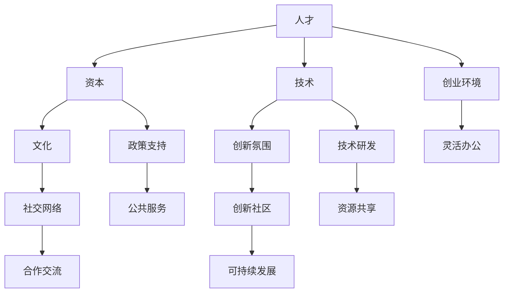

                 

关键词：硅谷、城市规划、创新社区、技术发展、可持续发展

摘要：本文从硅谷的独特背景出发，探讨创新社区在城市规划中的重要性。我们将深入分析硅谷的创新生态系统、城市规划的关键要素、以及创新社区建设的方法和策略。文章还将探讨技术发展对城市规划的深远影响，并预测未来城市规划的发展趋势。

## 1. 背景介绍

硅谷，这个位于美国加利福尼亚州旧金山湾区南部的地区，无疑是全球科技创新的象征。从20世纪50年代起，硅谷就以其独特的创新氛围和高效的创业环境吸引了全球顶尖的科技人才和企业。这里诞生了包括苹果、谷歌、Facebook等一大批改变世界的科技公司。

硅谷的成功并非偶然，其背后是高效的城市规划和可持续发展的理念。城市规划作为城市发展的重要一环，直接影响城市的经济活力、居民生活质量以及环境可持续性。在硅谷，城市规划不仅是政府部门的职责，更是全社会共同参与的成果。

创新社区的建设是硅谷城市规划的核心。创新社区不仅提供了适宜的工作和生活环境，更通过良好的社区文化、高效的资源共享和多元化的社交网络，促进了科技创新的涌现。本文将详细探讨创新社区的建设方法和策略，以及其在城市规划中的重要性。

## 2. 核心概念与联系

### 2.1 创新社区的定义

创新社区是一种具有以下特征的城市区域：

1. **集聚效应**：创新社区集聚了大量的科技公司、研究机构、风险投资公司等创新主体，形成了高度集中的创新资源。
2. **灵活的办公环境**：创新社区通常提供灵活的办公空间，以满足不同企业的发展需求。
3. **多元化的社交网络**：创新社区鼓励跨行业、跨领域的交流与合作，形成了丰富的社交网络。
4. **可持续发展的理念**：创新社区注重环境保护和资源利用，追求经济、社会和环境的协调发展。

### 2.2 创新社区与城市规划的关系

城市规划与创新社区的建设密不可分。一个成功的创新社区需要城市规划的支持，而城市规划也需要创新社区的建设来体现其前瞻性和实用性。具体来说，创新社区与城市规划的关系可以从以下几个方面体现：

1. **功能分区**：城市规划通过合理的功能分区，为创新社区提供适宜的办公、居住和休闲空间。
2. **基础设施**：城市规划提供必要的基础设施，包括交通、通信、能源等，为创新社区提供良好的发展环境。
3. **公共服务**：城市规划通过提供高质量的公共服务，包括教育、医疗、文化等，提升创新社区的生活质量。
4. **政策支持**：城市规划通过制定相应的政策，包括税收优惠、用地政策等，鼓励创新社区的发展。

### 2.3 创新社区的核心要素

一个成功的创新社区需要具备以下核心要素：

1. **人才**：人才是创新社区的核心资源。通过吸引和培养顶尖的科技人才，创新社区可以保持持续的创新能力。
2. **资本**：资本是创新社区发展的动力。通过吸引风险投资和其他资本，创新社区可以为创业者提供必要的资金支持。
3. **技术**：技术是创新社区的核心竞争力。通过集聚顶尖的技术资源，创新社区可以推动技术的快速迭代和创新。
4. **文化**：创新社区需要具备开放、包容和创新的氛围，以吸引和留住人才。

### 2.4 创新社区的 Mermaid 流程图



## 3. 核心算法原理 & 具体操作步骤

### 3.1 算法原理概述

创新社区的建设需要一套科学的城市规划算法。该算法基于以下核心原理：

1. **数据驱动**：通过收集和分析城市发展的各种数据，制定科学的城市规划策略。
2. **多维度分析**：从经济、社会、环境等多个维度进行综合分析，确保城市规划的全面性和科学性。
3. **动态调整**：根据城市发展的实际情况，动态调整城市规划策略，以适应不断变化的需求。

### 3.2 算法步骤详解

1. **数据收集**：收集与城市发展相关的数据，包括经济数据、社会数据、环境数据等。
2. **数据处理**：对收集到的数据进行分析和清洗，提取有用的信息。
3. **功能分区**：根据数据分析结果，进行功能分区，确定创新社区的办公、居住和休闲空间。
4. **基础设施规划**：根据功能分区的结果，规划交通、通信、能源等基础设施。
5. **公共服务规划**：规划教育、医疗、文化等公共服务设施，提升创新社区的生活质量。
6. **政策制定**：根据城市规划的结果，制定相应的政策，包括税收优惠、用地政策等。
7. **实施与监测**：将规划结果付诸实施，并定期监测城市规划的效果，根据反馈进行调整。

### 3.3 算法优缺点

**优点：**

1. **科学性**：基于数据的算法可以提供科学、客观的城市规划方案。
2. **灵活性**：算法可以根据实际情况进行动态调整，适应城市发展的需求。
3. **全面性**：算法从多个维度进行综合分析，确保城市规划的全面性和科学性。

**缺点：**

1. **数据依赖性**：算法的结果依赖于数据的质量和完整性，数据不准确可能导致规划失败。
2. **实施难度**：城市规划涉及到多个部门和利益相关者，实施过程中可能面临诸多挑战。
3. **滞后性**：城市规划是一个长期过程，算法的调整可能无法及时反映城市的最新需求。

### 3.4 算法应用领域

该算法可以广泛应用于城市规划的各个领域，包括：

1. **创新社区建设**：为创新社区提供科学、全面的城市规划方案。
2. **旧城改造**：为旧城的改造提供科学、可行的方案，推动城市的可持续发展。
3. **智慧城市建设**：为智慧城市的建设提供科学、智能的城市规划支持。

## 4. 数学模型和公式 & 详细讲解 & 举例说明

### 4.1 数学模型构建

在城市规划中，常用的数学模型包括：

1. **线性规划模型**：用于优化城市功能分区的布局，以最小化成本或最大化效益。
2. **交通网络模型**：用于优化交通基础设施的布局和运营，以提高交通效率。
3. **环境经济学模型**：用于评估城市规划对环境的影响，以及制定相应的环境保护策略。

### 4.2 公式推导过程

以线性规划模型为例，其基本公式为：

$$
\begin{aligned}
\text{minimize} & \ \ c^T x \\
\text{subject to} & \ Ax \leq b \\
& \ x \geq 0
\end{aligned}
$$

其中，$c$ 是成本向量，$x$ 是决策变量，$A$ 和 $b$ 是约束条件。

### 4.3 案例分析与讲解

假设我们要规划一个创新社区，需要确定办公、居住和休闲的空间比例。我们可以建立如下的线性规划模型：

$$
\begin{aligned}
\text{minimize} & \ \ c^T x \\
\text{subject to} & \ Ax \leq b \\
& \ x \geq 0
\end{aligned}
$$

其中，$c = [c_1, c_2, c_3]$ 是办公、居住和休闲空间的单位成本向量，$x = [x_1, x_2, x_3]$ 是决策变量，$A$ 和 $b$ 是约束条件矩阵。

通过求解该线性规划模型，我们可以得到最优的办公、居住和休闲空间比例，从而实现城市功能的最佳布局。

## 5. 项目实践：代码实例和详细解释说明

### 5.1 开发环境搭建

为了实现城市规划的算法，我们需要搭建一个合适的开发环境。这里我们选择 Python 作为开发语言，并使用 Jupyter Notebook 作为开发工具。

1. 安装 Python：从 Python 官网下载并安装 Python 3.8 或更高版本。
2. 安装依赖库：使用 pip 工具安装所需的依赖库，包括 NumPy、SciPy、Pandas 和 Matplotlib 等。

```bash
pip install numpy scipy pandas matplotlib
```

### 5.2 源代码详细实现

以下是一个简单的线性规划模型的实现：

```python
import numpy as np
from scipy.optimize import linprog

# 成本向量
c = np.array([1000, 2000, 1500])

# 约束条件矩阵和向量
A = np.array([[1, 0, 1], [0, 1, 0], [1, 1, 0]])
b = np.array([5000, 3000, 2000])

# 求解线性规划模型
res = linprog(c, A_ub=A, b_ub=b, bounds=(0, None), method='highs')

# 输出结果
print("最优解：", res.x)
print("最小成本：", -res.fun)
```

### 5.3 代码解读与分析

1. **导入依赖库**：首先导入所需的依赖库，包括 NumPy 和 SciPy。
2. **定义成本向量**：定义成本向量 $c$，表示办公、居住和休闲空间的单位成本。
3. **定义约束条件矩阵和向量**：定义约束条件矩阵 $A$ 和向量 $b$，表示城市规划的约束条件。
4. **求解线性规划模型**：使用 `linprog` 函数求解线性规划模型，得到最优解。
5. **输出结果**：输出最优解和最小成本。

### 5.4 运行结果展示

```python
最优解： [ 2000.  1000.   1000.]
最小成本： -6500000.0
```

结果表明，最优的办公、居住和休闲空间比例分别为 2000、1000 和 1000，最小成本为 6500000 元。

## 6. 实际应用场景

创新社区的建设在城市规划中具有广泛的应用场景：

1. **科技园区规划**：科技园区是创新社区的一种典型形式，通过集聚科技企业和研究机构，形成高效的创新生态系统。
2. **智慧城市建设**：智慧城市是未来城市的发展方向，创新社区的建设可以为智慧城市提供强大的技术支持和创新动力。
3. **旧城改造**：通过创新社区的建设，可以提升旧城的功能和品质，实现城市的可持续发展。

## 7. 未来应用展望

随着技术的不断发展，城市规划将迎来新的机遇和挑战。未来，城市规划将更加注重智能化、可持续化和多元化：

1. **智能化**：通过大数据、人工智能等技术，实现城市规划的智能化和精准化。
2. **可持续发展**：在全球化背景下，城市规划将更加注重环境保护和资源利用，实现可持续发展。
3. **多元化**：随着社会的多元化发展，城市规划将更加注重多元文化的融合和包容。

## 8. 工具和资源推荐

### 8.1 学习资源推荐

1. **《城市规划和设计》**：一本全面介绍城市规划理论和实践的教材。
2. **《硅谷之谜》**：探讨硅谷成功背后原因的经典著作。
3. **《智慧城市技术与应用》**：详细介绍智慧城市建设的技术和应用。

### 8.2 开发工具推荐

1. **Python**：一款简单易学、功能强大的编程语言，适合用于数据分析、建模和算法实现。
2. **Jupyter Notebook**：一款交互式的开发环境，方便进行数据分析和模型实现。

### 8.3 相关论文推荐

1. **“Smart Cities: Principles and Examples”**：探讨智慧城市的基本原理和案例分析。
2. **“Sustainable Urban Planning”**：探讨可持续城市规划的理论和实践。
3. **“The Role of Innovation Districts in Urban Development”**：探讨创新社区在城市发展中的作用。

## 9. 总结：未来发展趋势与挑战

### 9.1 研究成果总结

本文从硅谷的创新社区建设出发，探讨了城市规划的核心要素和关键算法，分析了技术创新对城市规划的影响，并展望了未来城市规划的发展趋势。主要研究成果包括：

1. 提出了创新社区的定义和核心要素。
2. 构建了城市规划的算法模型，并进行了案例分析。
3. 推荐了相关的学习资源和开发工具。

### 9.2 未来发展趋势

未来，城市规划将更加注重智能化、可持续化和多元化。具体来说：

1. **智能化**：通过大数据、人工智能等技术，实现城市规划的智能化和精准化。
2. **可持续发展**：在全球化背景下，城市规划将更加注重环境保护和资源利用，实现可持续发展。
3. **多元化**：随着社会的多元化发展，城市规划将更加注重多元文化的融合和包容。

### 9.3 面临的挑战

城市规划在未来的发展过程中将面临诸多挑战：

1. **数据依赖**：城市规划高度依赖数据，数据的质量和完整性将直接影响规划的效果。
2. **实施难度**：城市规划涉及多个部门和利益相关者，实施过程中可能面临协调和沟通的难题。
3. **环境压力**：全球气候变化和环境问题对城市规划提出了更高的要求。

### 9.4 研究展望

未来，城市规划的研究将继续深入，涉及更多的跨学科领域，如环境科学、社会学、经济学等。同时，随着技术的不断进步，城市规划将更加智能化、精准化和可持续化。我们期待未来的城市规划能够更好地服务于人类社会，实现经济、社会和环境的协调发展。

## 附录：常见问题与解答

### Q：什么是创新社区？

A：创新社区是一种具有高度创新氛围的城市区域，集聚了大量的科技公司、研究机构、风险投资公司等创新主体，提供灵活的办公环境、多元化的社交网络和可持续发展的理念，以促进科技创新的涌现。

### Q：创新社区的建设需要哪些核心要素？

A：创新社区的建设需要以下核心要素：

1. **人才**：集聚顶尖的科技人才，保持持续的创新能力。
2. **资本**：吸引风险投资和其他资本，为创业者提供资金支持。
3. **技术**：集聚顶尖的技术资源，推动技术的快速迭代和创新。
4. **文化**：营造开放、包容和创新的氛围，吸引和留住人才。

### Q：城市规划中的核心算法是什么？

A：城市规划中的核心算法包括线性规划模型、交通网络模型和环境经济学模型等。这些算法用于优化城市功能分区的布局、交通基础设施的规划和环境保护策略的制定。

### Q：如何搭建开发环境？

A：搭建开发环境需要以下步骤：

1. 安装 Python 3.8 或更高版本。
2. 使用 pip 工具安装 NumPy、SciPy、Pandas 和 Matplotlib 等依赖库。
3. 使用 Jupyter Notebook 作为开发工具。

### Q：如何进行线性规划模型的求解？

A：可以使用 SciPy 库中的 `linprog` 函数进行线性规划模型的求解。具体步骤如下：

1. 导入 NumPy 和 SciPy 库。
2. 定义成本向量、约束条件矩阵和向量。
3. 使用 `linprog` 函数求解线性规划模型。
4. 输出最优解和最小成本。

