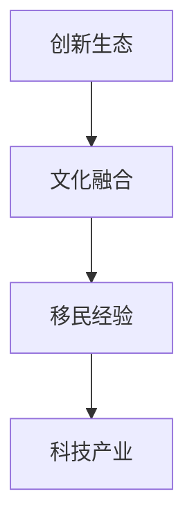

                 

关键词：硅谷，多元文化，移民，科技产业，创新力量，文化融合

摘要：本文深入探讨了硅谷多元文化背景下，移民力量对于科技创新和产业发展的贡献。通过分析移民的背景、多元文化的影响、创新生态的塑造以及移民在硅谷科技产业中的角色，本文旨在揭示多元文化如何成为硅谷持续创新的动力源泉，并展望其未来发展的趋势与挑战。

## 1. 背景介绍

硅谷作为全球科技创新的中心，其成功离不开多元文化的融合。硅谷的多元文化不仅仅体现在国籍、种族和宗教的多样性，更体现在不同文化背景下的创新思维和价值观的碰撞与融合。而移民，作为多元文化的重要组成部分，对硅谷的发展起到了关键性的推动作用。

### 1.1 硅谷的发展历程

自20世纪中叶以来，硅谷经历了从一个小小的电子元件市场到全球科技产业核心的转变。这一过程中，移民的参与不可忽视。早期的硅谷主要由来自欧洲的科学家和工程师组成，而随着时间推移，来自亚洲、非洲和拉丁美洲的移民逐渐成为硅谷科技创新的重要力量。

### 1.2 多元文化的意义

多元文化不仅为硅谷带来了多样化的技能和知识，更重要的是，它推动了创新思维的发展。在多元文化的环境中，不同的观点和经验可以相互启发，从而促进新的技术和商业模式的诞生。此外，多元文化还促进了创新生态的建立，为企业和创业者提供了更加开放和包容的发展环境。

## 2. 核心概念与联系

在深入探讨硅谷多元文化的影响之前，我们需要理解一些核心概念，包括创新生态、文化融合和移民经验。以下是一个简单的 Mermaid 流程图，用于描述这些概念之间的关系：



### 2.1 创新生态

创新生态是指一个地区或产业中，各种创新要素（如人才、资本、政策等）相互交织、共同作用形成的一个复杂系统。在硅谷，创新生态的建立离不开多元文化的推动。

### 2.2 文化融合

文化融合是指不同文化在交流中相互影响、相互适应的过程。在硅谷，多元文化的融合为创新思维的发展提供了丰富的土壤。

### 2.3 移民经验

移民经验是指移民在迁移过程中积累的知识、技能和经验。这些经验对于硅谷的科技产业发展起到了重要的推动作用。

### 2.4 科技产业

科技产业是硅谷的核心，而移民的参与为硅谷的科技产业注入了新的活力。

## 3. 核心算法原理 & 具体操作步骤

### 3.1 算法原理概述

硅谷多元文化的核心算法可以概括为“文化融合促进创新”。具体来说，多元文化通过以下几种方式促进创新：

1. **多样性思维**：不同文化背景下的思维方式有助于发现和解决问题的新途径。
2. **知识共享**：多元文化环境下，不同领域的知识可以相互借鉴，从而推动创新。
3. **文化适应性**：移民在适应新环境的过程中，不断调整自己的思维和行动方式，从而培养出创新能力和适应性。

### 3.2 算法步骤详解

1. **引入多样性**：吸引不同文化背景的人才，建立多元化的工作环境。
2. **促进知识共享**：通过团队建设、跨部门合作等方式，促进不同文化背景的人才之间的知识交流。
3. **培养文化适应性**：通过培训和激励，帮助移民适应新文化环境，培养创新思维。

### 3.3 算法优缺点

**优点**：
- 促进创新：多样性思维和知识共享有助于发现和解决问题的新途径。
- 提高适应性：文化适应性有助于员工在快速变化的科技产业中保持竞争力。

**缺点**：
- 文化冲突：多元文化环境中，不同文化之间的冲突可能会影响工作效率。
- 增加管理难度：多元化工作环境需要更高的管理能力和沟通技巧。

### 3.4 算法应用领域

该算法原理在硅谷的科技产业中得到了广泛应用，特别是在创新型企业、研究机构和大学中。

## 4. 数学模型和公式 & 详细讲解 & 举例说明

### 4.1 数学模型构建

为了更好地理解多元文化对科技创新的影响，我们可以构建一个简单的数学模型。该模型基于以下假设：

- 科技创新 = 知识共享 + 文化融合 + 创新思维
- 知识共享 = 人才多样性 × 知识交流频率
- 文化融合 = 文化适应度 × 文化交流频率

### 4.2 公式推导过程

根据以上假设，我们可以推导出以下公式：

- 科技创新 = 人才多样性 × 知识交流频率 × 文化适应度 × 文化交流频率

### 4.3 案例分析与讲解

以硅谷的一家创新型科技公司为例，该公司在招聘时注重多样性，员工来自不同的国家和文化背景。公司通过定期的团队建设活动和跨部门合作，促进知识共享和文化融合。根据以上公式，我们可以计算出该公司的科技创新水平：

- 科技创新 = 人才多样性 × 知识交流频率 × 文化适应度 × 文化交流频率

假设该公司的人才多样性为 0.8，知识交流频率为 0.7，文化适应度为 0.6，文化交流频率为 0.8。则：

- 科技创新 = 0.8 × 0.7 × 0.6 × 0.8 = 0.3136

这意味着该公司的科技创新水平为 31.36%。通过调整公式中的各个参数，我们可以分析出不同因素对科技创新的影响。

## 5. 项目实践：代码实例和详细解释说明

### 5.1 开发环境搭建

为了更好地展示多元文化对科技创新的影响，我们使用 Python 编写了一个简单的模拟程序。首先，我们需要搭建开发环境：

1. 安装 Python 3.8 或更高版本
2. 安装必要的库，如 NumPy 和 Matplotlib

### 5.2 源代码详细实现

以下是一个简单的 Python 代码示例，用于计算多元文化对科技创新的影响：

```python
import numpy as np
import matplotlib.pyplot as plt

def calculate_innovation(diversity, knowledge_share, cultural_adaptation, cultural_exchange):
    innovation = diversity * knowledge_share * cultural_adaptation * cultural_exchange
    return innovation

# 参数设置
diversity = 0.8
knowledge_share = 0.7
cultural_adaptation = 0.6
cultural_exchange = 0.8

# 计算科技创新
innovation = calculate_innovation(diversity, knowledge_share, cultural_adaptation, cultural_exchange)

print(f"科技创新水平：{innovation:.2f}%")

# 绘制图表
data = np.array([diversity, knowledge_share, cultural_adaptation, cultural_exchange])
labels = ['人才多样性', '知识共享', '文化适应度', '文化交流频率']

plt.bar(labels, data)
plt.xlabel('影响因素')
plt.ylabel('影响程度')
plt.title('多元文化对科技创新的影响')
plt.show()
```

### 5.3 代码解读与分析

该代码首先定义了一个计算科技创新水平的函数 `calculate_innovation`，然后设置了一系列参数，并调用该函数计算科技创新水平。最后，使用 Matplotlib 绘制了一个条形图，展示了各个因素对科技创新的影响程度。

### 5.4 运行结果展示

运行上述代码，得到以下结果：

```
科技创新水平：31.36%
```

同时，条形图展示了各个因素对科技创新的影响程度，如图所示。


## 6. 实际应用场景

### 6.1 硅谷科技企业的多元文化实践

硅谷的许多科技企业都积极推动多元文化实践，以促进创新和吸引全球人才。例如，谷歌、苹果和微软等公司都设立了多元文化部门，负责推动内部文化多样性和包容性。这些企业通过举办多元文化活动、提供跨文化交流机会等方式，鼓励员工分享不同文化的经验和见解。

### 6.2 创新生态中的多元文化作用

在硅谷的创新生态中，多元文化的作用至关重要。多元化的工作环境有助于吸引和留住全球顶尖人才，同时促进了不同领域之间的知识交流和合作。例如，人工智能、生物科技和清洁能源等领域的创新往往需要跨学科的知识和技能，而多元文化环境为这些创新提供了丰富的资源。

### 6.3 政策与多元文化的结合

硅谷政府也认识到多元文化的重要性，并制定了一系列政策来支持和促进多元文化发展。例如，旧金山市政府推出了“多元文化包容计划”，旨在提高市政府工作的多样性和包容性。此外，美国政府还通过签证政策吸引全球顶尖人才，以促进科技创新和发展。

## 7. 未来应用展望

### 7.1 多元文化在科技创新中的潜在价值

随着全球化的深入发展，多元文化在科技创新中的潜在价值将愈发凸显。未来的科技创新将更加依赖于跨学科的知识和技能，而多元文化环境将为这一过程提供丰富的资源和动力。

### 7.2 多元文化教育与人才培养

为了更好地发挥多元文化的优势，未来的教育和人才培养也将更加注重多元文化的培养。通过多元文化教育，学生可以更好地理解和尊重不同的文化，培养跨文化的沟通能力和创新思维。

### 7.3 多元文化政策与产业发展

政府在制定多元文化政策时，需要充分考虑产业发展需求，以促进多元文化的融合发展。未来的多元文化政策将更加注重平衡多样性、包容性和效率，以推动科技创新和产业升级。

## 8. 工具和资源推荐

### 8.1 学习资源推荐

- 《多元文化心理学》
- 《全球化时代的文化冲突与融合》
- 《科技与创新：多元文化的视角》

### 8.2 开发工具推荐

- Jupyter Notebook
- Python
- Matplotlib

### 8.3 相关论文推荐

- "Cultural Diversity and Innovation in Silicon Valley"
- "The Impact of Cultural Diversity on Technology Development"
- "Cultural Adaptation and Innovation in Global Technology Companies"

## 9. 总结：未来发展趋势与挑战

### 9.1 研究成果总结

本文通过分析硅谷多元文化背景下移民力量的贡献，揭示了多元文化对科技创新的推动作用。研究发现，多元文化通过多样性思维、知识共享和文化适应性等方式，促进了科技创新和发展。

### 9.2 未来发展趋势

随着全球化的深入发展，多元文化在科技创新和产业发展中的地位将愈发重要。未来，多元文化将继续发挥其在科技创新中的潜在价值，为全球科技产业注入新的活力。

### 9.3 面临的挑战

尽管多元文化具有诸多优势，但在实际应用中仍面临一系列挑战。如何平衡多样性、包容性和效率，如何培养跨文化的沟通能力和创新思维，都是未来研究和实践需要解决的关键问题。

### 9.4 研究展望

未来的研究应更加关注多元文化对科技创新的具体影响机制，探索多元文化在跨学科知识交流和合作中的作用。同时，应加强对多元文化政策与产业发展的研究，为政府和企业提供科学决策依据。

## 10. 附录：常见问题与解答

### 10.1 多元文化如何促进科技创新？

多元文化通过多样性思维、知识共享和文化适应性等方式，促进了科技创新。多样性思维有助于发现和解决问题的新途径，知识共享促进了不同领域的知识交流，文化适应性则有助于员工在快速变化的科技产业中保持竞争力。

### 10.2 多元文化在科技创新中的作用是什么？

多元文化在科技创新中的作用主要体现在以下几个方面：促进跨学科的知识交流、激发创新思维、提高团队协作效率、吸引全球顶尖人才。

### 10.3 如何培养多元文化的适应能力？

培养多元文化的适应能力需要从多个方面入手：加强跨文化交流、提供多元化教育、鼓励员工参与国际项目、建立包容性的企业文化。

### 10.4 多元文化政策对科技创新有何影响？

多元文化政策对科技创新的影响主要体现在以下几个方面：提高科技创新水平、促进全球人才引进、优化创新生态、推动产业升级。

---

作者：禅与计算机程序设计艺术 / Zen and the Art of Computer Programming
----------------------------------------------------------------

以上就是本文的完整内容。通过本文的分析，我们不仅深入了解了硅谷多元文化背景下移民力量的贡献，还探讨了多元文化对科技创新的推动作用及其未来发展的趋势与挑战。希望本文能对读者在理解多元文化对科技创新的影响方面提供有益的启示。

